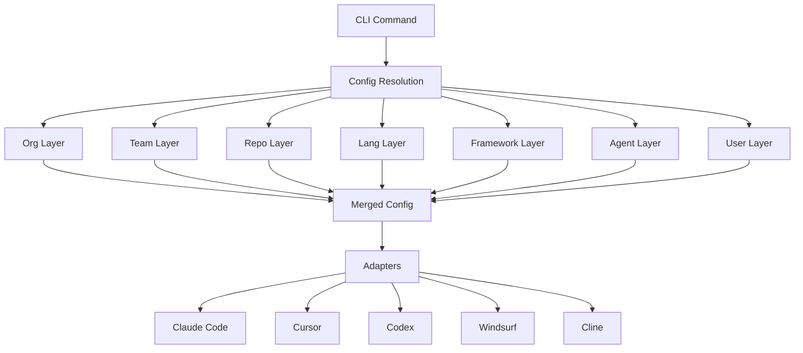

<p align="center">
  
</p>

<p align="center">
  <strong>One config. Every AI agent. Zero drift.</strong>
</p>

<p align="center">
  Define your rules, skills, agents, and flags once — Codi generates the correct configuration for Claude Code, Cursor, Codex, Windsurf, and Cline automatically.
</p>

[](https://www.npmjs.com/package/codi-cli)
[](./LICENSE)
[](https://github.com/lehidalgo/codi/actions)
[]()

---

## Why Codi?

Every AI coding agent uses a different configuration format. Claude Code reads `CLAUDE.md`. Cursor reads `.cursorrules`. Codex reads `AGENTS.md`. When your team uses multiple agents — or different members prefer different tools — you end up maintaining duplicate configs that inevitably drift apart.

**Codi eliminates this.** Write your configuration once in `.codi/`, and Codi generates the right file for every agent, every time.

---

## Feature Overview

### Supported Agents

| Agent | Config File | Rules | Skills | Agents | Commands | MCP |
|:------|:-----------|:-----:|:------:|:------:|:--------:|:---:|
| **Claude Code** | `CLAUDE.md` | `.claude/rules/*.md` | `.claude/skills/*/SKILL.md` | `.claude/agents/*.md` | `.claude/commands/*.md` | `.claude/mcp.json` |
| **Cursor** | `.cursorrules` | `.cursor/rules/*.mdc` | `.cursor/skills/*/SKILL.md` | -- | -- | `.cursor/mcp.json` |
| **Codex** | `AGENTS.md` | Inline | `.agents/skills/*/SKILL.md` | `.codex/agents/*.toml` | -- | `.codex/config.toml` |
| **Windsurf** | `.windsurfrules` | Inline | `.windsurf/skills/*/SKILL.md` | -- | -- | -- |
| **Cline** | `.clinerules` | Inline | `.cline/skills/*/SKILL.md` | -- | -- | -- |

### Built-in Templates

| Artifact | Count | Highlights |
|:---------|:-----:|:-----------|
| **Rules** | 23 | security, code-style, testing, architecture, git-workflow, error-handling, performance, documentation, api-design, golang, rust, nextjs, django, and more |
| **Skills** | 18 | code-review, documentation, MCP, security-scan, test-coverage, refactoring, codebase-onboarding, presentation, mobile-development, and more |
| **Agents** | 8 | code-reviewer, test-generator, security-analyzer, docs-lookup, refactorer, onboarding-guide, performance-auditor, api-designer |
| **Commands** | 8 | review, test-run, security-scan, test-coverage, refactor, onboard, docs-lookup, commit |

All templates are customizable. Create your own with `codi add rule|skill|agent|command <name>`.

### Preset System

| Preset | Focus | Description |
|:-------|:------|:------------|
| `minimal` | Permissive | Minimal guardrails, maximum flexibility |
| `balanced` | Recommended | Sensible defaults for most projects |
| `strict` | Enforced | Maximum safety and compliance |
| `python-web` | Full stack | Python + web rules, skills, and agents |
| `typescript-fullstack` | Full stack | TypeScript + fullstack rules, skills, and agents |
| `security-hardened` | Security | Security-focused rules, scanning, and compliance |

Create, share, and install presets from ZIP, GitHub, or the registry with `codi preset`.

### Governance & Teams

| Capability | Description |
|:-----------|:------------|
| **7-layer inheritance** | org &rarr; team &rarr; repo &rarr; language &rarr; framework &rarr; agent &rarr; user |
| **Locked flags** | Org-level policies that cannot be overridden downstream |
| **Artifact ownership** | `managed_by: codi` (auto-updated) vs `managed_by: user` (never overwritten) |
| **Version pinning** | Enforce minimum Codi version across the team with `requiredVersion` |

### MCP Integration

| Capability | Details |
|:-----------|:--------|
| **Pre-configured servers** | 17 servers: docs, memory, sequential-thinking, context7, Stripe, Supabase, Vercel, Neon, Sentry, Linear, Notion, Prisma, GitHub, Upstash, Cloudflare |
| **Centralized config** | Define once in `.codi/mcp.yaml`, auto-distributed in each agent's native format (JSON, TOML) |
| **Server toggling** | Enable/disable individual servers with `enabled: false` |

### CI/CD & DevOps

| Capability | Details |
|:-----------|:--------|
| **Pre-commit hooks** | File size limits (800 LOC), secret scanning, conventional commit validation |
| **CI validation** | `codi ci` and `codi doctor --ci` — exits non-zero on config errors or stale files |
| **Backup & revert** | Automatic backup on every generate; restore with `codi revert --last` |
| **Watch mode** | `codi watch` auto-regenerates when `.codi/` files change |
| **Drift detection** | `codi status` reports when generated files are out of sync |

### Behavioral Flags

| Flag | Type | Description |
|:-----|:-----|:------------|
| `max_file_lines` | number | Maximum lines per source file |
| `allow_force_push` | boolean | Allow `git push --force` |
| `require_pr_review` | boolean | Require PR review before merging |
| `test_before_commit` | boolean | Run tests before every commit |
| `security_scan` | boolean | Run security scans before merging |
| `auto_commit` | boolean | Allow auto-committing |
| `progressive_loading` | string | Skill loading strategy (off/metadata/catalog) |
| `drift_detection` | string | Drift enforcement level (off/warn/error) |
| *+ 10 more* | | See [Configuration Guide](docs/configuration.md) for all 18 flags |

---

## Quick Start

### 1. Install

```bash
npm install -D codi-cli
```

**Requires Node.js >= 20.**

### 2. Initialize

```bash
# Interactive wizard — select agents, preset, and artifacts
codi init

# Or non-interactive
codi init --agents claude-code cursor --preset balanced
```

### 3. Generate

```bash
codi generate
```

That's it. Your `CLAUDE.md`, `.cursorrules`, and any other agent files are generated and ready to commit.

---

## Architecture

Codi reads your `.codi/` directory, resolves configuration through 7 inheritance layers, and passes the result through agent-specific adapters.



## CLI Reference

| Command | Description | Key Options |
|---------|-------------|-------------|
| `codi init` | Initialize `.codi/` configuration | `--force`, `--agents <ids...>`, `--preset <name>` |
| `codi generate` | Generate agent config files | `--agent <ids...>`, `--dry-run`, `--force` |
| `codi validate` | Validate `.codi/` configuration | -- |
| `codi status` | Show drift status of generated files | `--json` |
| `codi add rule <name>` | Add a custom rule | `-t, --template <name>`, `--all` |
| `codi add skill <name>` | Add a custom skill | `-t, --template <name>`, `--all` |
| `codi add agent <name>` | Add a custom agent | `-t, --template <name>`, `--all` |
| `codi add command <name>` | Add a custom command | `-t, --template <name>`, `--all` |
| `codi doctor` | Check project health | `--ci` |
| `codi verify` | Verify agent loaded configuration | `--check <response>` |
| `codi update` | Update flags and artifacts to latest | `--preset`, `--rules`, `--skills`, `--agents`, `--from <repo>`, `--dry-run` |
| `codi clean` | Remove generated files | `--all`, `--dry-run`, `--force` |
| `codi compliance` | Comprehensive health check | `--ci` |
| `codi watch` | Auto-regenerate on file changes | `--once` |
| `codi ci` | Composite CI validation | -- |
| `codi revert` | Restore from backup | `--list`, `--last`, `--backup <ts>` |
| `codi marketplace` | Search/install skills from registry | `search <query>`, `install <name>` |
| `codi preset` | Manage configuration presets | `create`, `list`, `install`, `export`, `validate`, `remove`, `edit`, `search`, `update` |
| `codi contribute` | Share artifacts with the community | -- |
| `codi docs-update` | Update documentation counts to match templates | -- |

Aliases: `codi gen` = `codi generate`.

### Global Options

| Option | Description |
|--------|-------------|
| `-j, --json` | Output as JSON (for scripting) |
| `-v, --verbose` | Verbose/debug output |
| `-q, --quiet` | Suppress non-essential output |
| `--no-color` | Disable colored output |

## Configuration

The `.codi/` directory holds your project manifest (`codi.yaml`), behavioral flags (`flags.yaml`), custom rules, skills, agents, commands, and override layers. Everything is YAML and Markdown.

For full details on directory structure, flags, and flag modes, see the [Configuration Guide](docs/configuration.md).

## Presets

Presets bundle flags, rules, skills, agents, commands, and MCP config into reusable, shareable packages.

```bash
# Use a built-in preset
codi init --preset python-web

# Create your own
codi preset create my-setup

# Install from GitHub
codi preset install my-preset --from org/repo

# Export as ZIP
codi preset export my-setup --format zip
```

**Built-in presets**: `minimal`, `balanced`, `strict`, `python-web`, `typescript-fullstack`, `security-hardened`.

See [Multi-Tenant Design](docs/reference/multi-tenant-design.md) for the full preset architecture.

## Daily Workflow

```bash
# 1. Edit your rules
vim .codi/rules/custom/security.md

# 2. Regenerate agent configs
codi generate

# 3. Check nothing drifted
codi status

# 4. Commit both config and generated files
git add .codi/ CLAUDE.md .cursorrules AGENTS.md .windsurfrules .clinerules
git commit -m "update codi rules"
```

## Git & Version Control

| What | Commit? | Why |
|------|---------|-----|
| `.codi/codi.yaml` | Yes | Project manifest -- source of truth |
| `.codi/flags.yaml` | Yes | Flag configuration |
| `.codi/rules/custom/` | Yes | Your rules |
| `.codi/skills/` | Yes | Your skills |
| `.codi/agents/` | Yes | Your agents |
| `.codi/commands/` | Yes | Your commands |
| `.codi/state.json` | Yes | Enables drift detection for your team |
| Generated files | Yes | Agents need these files in the repo |
| `~/.codi/user.yaml` | No | Personal preferences, never committed |
| `~/.codi/org.yaml` | No | Shared via org tooling, not per-repo |

## Troubleshooting

| Issue | Fix |
|-------|-----|
| `codi` command not found | `npx codi --version` or install globally |
| Node.js version too old | Requires Node >= 20. Use `nvm install 20` |
| Drift detected | Run `codi generate` to regenerate |
| Token mismatch on verify | Config changed since last generate. Regenerate first |
| Watch not triggering | Enable `auto_generate_on_change` flag in `flags.yaml` |

See [Troubleshooting Guide](docs/troubleshooting.md) for detailed solutions.

## Contributing

See [CONTRIBUTING.md](CONTRIBUTING.md) for development setup, code conventions, and how to add new features.

## Documentation

| Guide | Description |
|-------|-------------|
| [Documentation Index](docs/README.md) | Full documentation index with all guides, specs, and references |
| [Specification](docs/spec/README.md) | 10-chapter formal specification (architecture, layout, artifacts, flags, etc.) |
| [Configuration](docs/configuration.md) | Flags, presets, directory structure, manifest |
| [Architecture](docs/architecture.md) | System design, hook system, error handling |
| [Writing Artifacts](docs/guides/writing-rules.md) | Create and customize rules, skills, agents, commands |
| [Artifact Lifecycle](docs/guides/artifact-lifecycle.md) | Ownership, drift detection, staleness, deprecation workflow |
| [Cloud & CI](docs/guides/cloud-ci.md) | CI/CD patterns for GitHub Actions, GitLab, Azure, Docker |
| [Security](docs/guides/security.md) | Secret management, hook security, MCP trust, OWASP |
| [Migration](docs/migration.md) | Adopt codi in existing projects |
| [CI Integration](docs/guides/ci-integration.md) | GitHub Actions workflow for codi validation |
| [Testing Guide](docs/guides/testing-guide.md) | E2E testing procedure (8 suites) |
| [Adoption & Verification](docs/guides/adoption-verification.md) | Token-based verification and adoption tracking |
| [User Flows](docs/guides/user-flows.md) | Complete user interaction paths and workflows |
| [Troubleshooting](docs/troubleshooting.md) | Common issues and fixes |
| [Design Reference](docs/reference/design.md) | Complete design documentation for all 33 functionalities |
| [Governance](docs/reference/governance.md) | 7-level inheritance, org policies, locking |
| [Multi-Tenant Design](docs/reference/multi-tenant-design.md) | Presets, plugins, and stacks architecture |
| [Contributing](CONTRIBUTING.md) | Development setup and contribution guide |

## Roadmap

| Feature | Description |
|:--------|:------------|
| Plugin system | Custom adapters for new AI agents |
| Approval workflows | Draft, review, publish lifecycle for artifacts |
| VS Code extension | Visual config management inside the editor |
| Context compression | Intelligent token-aware content trimming |
| Remote includes | Git URLs as config sources for shared rules |

## FAQ

**Q: I already have a `CLAUDE.md` -- will codi overwrite it?**
Yes. Run `codi init`, then move your rules into `.codi/rules/custom/` as Markdown files with frontmatter and run `codi generate`. Back up your existing files first.

**Q: Do I commit generated files like `CLAUDE.md`?**
Yes. Agents read these files from your repo. Commit both `.codi/` (your config) and generated files (the output).

**Q: Can different team members use different flag values?**
Yes. Personal preferences go in `~/.codi/user.yaml` (never committed). Org-wide policies go in `~/.codi/org.yaml` with `locked: true` to prevent overrides.

**Q: What happens if I edit a generated file manually?**
`codi status` will report it as "drifted". Running `codi generate` will overwrite your manual edit. If you want persistent changes, edit the rules in `.codi/rules/custom/` instead.

**Q: How do I add codi to a CI pipeline?**
Add `codi doctor --ci` to your CI. It exits non-zero if config is invalid, version is wrong, or generated files are stale.

**Q: Can I use codi with only one agent?**
Yes. Run `codi init --agents claude-code` (or any single agent). Codi works with 1 to 5 agents.

**Q: What's the difference between a rule and a skill?**
Rules are instructions that agents follow (e.g., "never expose secrets"). Skills are reusable workflows that agents can invoke (e.g., "code review checklist"). Both are Markdown files with YAML frontmatter.

**Q: How do I remove a flag from my config?**
Delete the flag entry from `.codi/flags.yaml` and run `codi generate` to apply the change. Codi will use the catalog default for any missing flags.

## License

[MIT](./LICENSE)
