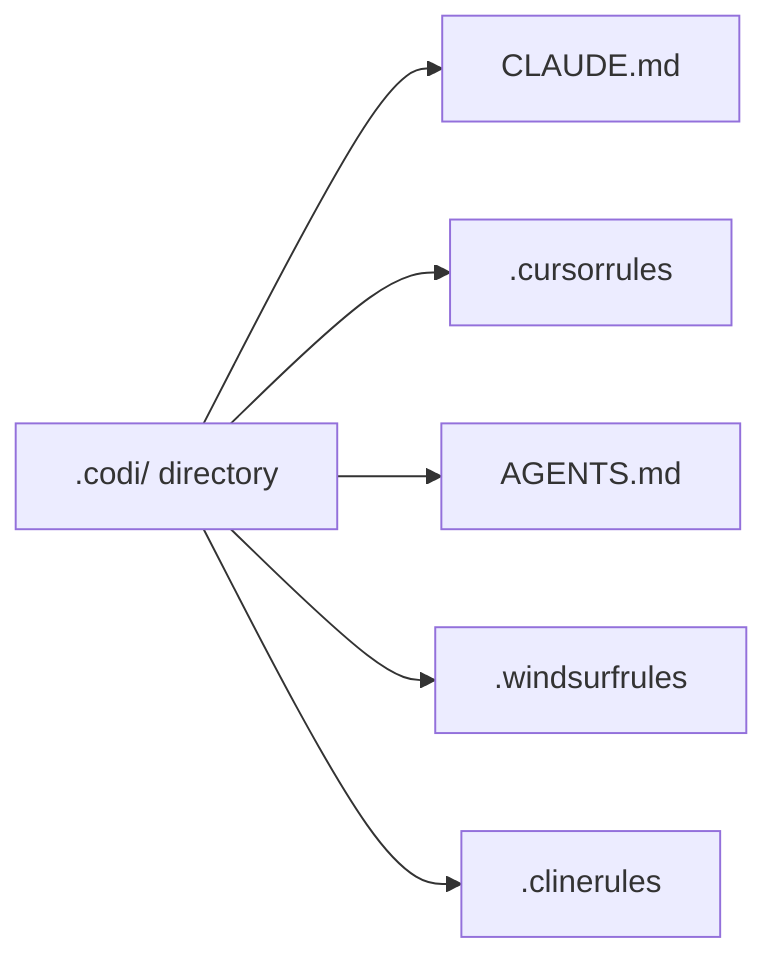

<p align="center">
  
</p>

<p align="center">
  <strong>Unified configuration platform for AI coding agents.</strong>
</p>

[](https://www.npmjs.com/package/codi-cli)
[](./LICENSE)
[](https://github.com/lehidalgo/codi/actions)

## What is Codi?

AI coding agents (Claude Code, Cursor, Codex, Windsurf, Cline) each require their own configuration file with different formats and conventions. When you use multiple agents, you end up maintaining separate config files that inevitably drift apart.

**Codi solves this.** Define your rules, flags, and settings once in a `.codi/` directory, and Codi generates the correct configuration file for each agent.



**One config. Every agent. No drift.**

## Supported Agents

| Agent | Generated File | Config Directory |
|-------|---------------|-----------------|
| Claude Code | `CLAUDE.md` | `.claude/rules/` |
| Cursor | `.cursorrules` | `.cursor/rules/` |
| Codex (OpenAI) | `AGENTS.md` | — |
| Windsurf | `.windsurfrules` | — |
| Cline | `.clinerules` | — |

## Quick Start

### Install

```bash
# As a dev dependency (recommended)
npm install -D codi-cli

# Or globally
npm install -g codi-cli
```

**Requires Node.js >= 20.**

### Initialize

```bash
# Interactive wizard — walks you through setup
codi init
```

The wizard will ask you to:
1. **Select agents** — auto-detected from your project
2. **Choose rules** — pick from 9 built-in templates (security, code-style, testing, architecture, git-workflow, error-handling, performance, documentation, api-design)
3. **Pick a preset** — `minimal`, `balanced` (recommended), or `strict`
4. **Enable version pinning** — locks your team to a minimum codi version

```bash
# Or skip the wizard with explicit options
codi init --agents claude-code cursor --preset balanced
```

### Add More Rules Later

```bash
# Add all 9 built-in template rules at once
codi add rule --all

# Add a specific rule from a template
codi add rule security --template security

# Add a blank rule to write yourself
codi add rule api-guidelines
```

### Generate

```bash
# Generate config files for all detected agents
codi generate

# Preview without writing files
codi generate --dry-run

# Generate for a specific agent only
codi generate --agent claude-code
```

### Verify

```bash
# Show the verification token and prompt
codi verify

# After asking your agent to verify, validate its response
codi verify --check "token: codi-abc123, rules: security, code-style"
```

## What Gets Generated

After running `codi generate`, each agent gets a config file tailored to its format. Here's what the output looks like:

**CLAUDE.md** (for Claude Code):
```markdown
## Permissions

Keep source code files under 700 lines. Documentation files have no line limit.
Do NOT use force push (--force) on git operations.
All changes require pull request review before merging.
Maximum context window: 50000 tokens.

## security

# Security Rules

- Never expose secrets, API keys, or credentials in code
- Use environment variables for sensitive configuration
- Validate and sanitize all user inputs
- Follow OWASP security guidelines

## Codi Verification

This project uses Codi for unified AI agent configuration.
When asked "verify codi" or "codi verify", respond with:
- Verification token: `codi-9ced0d`
- Rules loaded: [list the rule names you see in this file]
- Flags active: [list any permission constraints from this file]
```

Each adapter formats the same rules and flags for its agent's conventions. Individual rule files are also created in `.claude/rules/` and `.cursor/rules/` for agents that support per-rule files.

## Daily Workflow

```bash
# 1. Edit your rules
vim .codi/rules/custom/security.md

# 2. Regenerate agent configs
codi generate

# 3. Check nothing drifted
codi status

# 4. Commit both config and generated files
git add .codi/ CLAUDE.md .cursorrules AGENTS.md .windsurfrules .clinerules
git commit -m "update codi rules"
```

## Git & Version Control

| What | Commit? | Why |
|------|---------|-----|
| `.codi/codi.yaml` | Yes | Your project manifest — source of truth |
| `.codi/flags.yaml` | Yes | Flag configuration |
| `.codi/rules/custom/` | Yes | Your rules |
| `.codi/skills/` | Yes | Your skills |
| `.codi/state.json` | Yes | Enables drift detection for your team |
| Generated files (`CLAUDE.md`, `.cursorrules`, etc.) | Yes | Agents need these files in the repo to read them |
| `~/.codi/user.yaml` | No | Personal preferences, never committed |
| `~/.codi/org.yaml` | No | Shared via org tooling, not per-repo |

## CLI Reference

### Commands

| Command | Description | Key Options |
|---------|-------------|-------------|
| `codi init` | Initialize `.codi/` configuration | `--force`, `--agents <ids...>`, `--preset <name>` |
| `codi generate` | Generate agent config files | `--agent <ids...>`, `--dry-run`, `--force` |
| `codi validate` | Validate `.codi/` configuration | — |
| `codi status` | Show drift status of generated files | — |
| `codi add rule <name>` | Add a custom rule | `-t, --template <name>` |
| `codi add skill <name>` | Add a custom skill | `-t, --template <name>` |
| `codi doctor` | Check project health | `--ci` |
| `codi verify` | Verify agent loaded configuration | `--check <response>` |
| `codi update` | Update flags and rules to latest versions | `--preset <name>`, `--rules`, `--regenerate`, `--dry-run`, `--from <repo>` |
| `codi clean` | Remove generated files (uninstall codi output) | `--all`, `--dry-run`, `--force` |
| `codi add agent <name>` | Add a custom agent | `-t, --template <name>`, `--all` |

Aliases: `codi gen` = `codi generate`.

### Global Options

| Option | Description |
|--------|-------------|
| `-j, --json` | Output as JSON (for scripting) |
| `-v, --verbose` | Verbose/debug output |
| `-q, --quiet` | Suppress non-essential output |
| `--no-color` | Disable colored output |

### `codi init`

Creates the `.codi/` directory with manifest, flags, rules, skills, and framework directories. Auto-detects your stack and existing agent config files. Runs an interactive wizard by default.

See [Configuration Guide](docs/configuration.md) for presets and flags.

### `codi generate`

Resolves configuration from all 7 layers and produces output files. Updates `.codi/state.json` with SHA-256 hashes for drift detection. Use `--dry-run` to preview.

### `codi validate`

Validates the `.codi/` configuration directory for correctness.

### `codi status`

Compares generated files against hashes in `.codi/state.json`. Reports each file as synced, drifted, or missing.

### `codi doctor`

Runs health checks: config validity, version compatibility, org/team config, and drift detection. Use `--ci` for non-zero exit on failure (designed for pre-commit hooks and CI pipelines).

### `codi update`

Brings flags and rules up to date. Without options, adds new flags from the catalog. With `--preset`, resets all flags. With `--rules`, `--skills`, or `--agents`, refreshes template-managed artifacts (`managed_by: codi`) to the latest versions. User-custom artifacts are never touched.

Use `--from <repo>` to pull centralized artifacts from a team GitHub repository. This is one-way: codi reads from the remote repo but never writes to it. Only artifacts marked `managed_by: codi` are updated; user-custom artifacts are preserved.

```bash
# Full update: flags + all artifacts + regenerate
codi update --preset balanced --rules --skills --agents --regenerate

# Pull team config from a centralized GitHub repo
codi update --from org/team-codi-config
```

### `codi clean`

Removes generated files from your project. By default keeps `.codi/` intact. Use `--all` to also remove the `.codi/` directory. Use `--dry-run` to preview.

### `codi add`

Add rules, skills, or agents. Use `--template` to create from a built-in template, or omit for a blank skeleton. Use `--all` to create all available templates at once.

See [Writing Artifacts](docs/writing-rules.md) for templates and authoring guide.

### `codi verify`

Verify that your AI agent loaded the correct configuration. See [Verification](docs/verification.md).

## Configuration

The `.codi/` directory holds your project manifest (`codi.yaml`), behavioral flags (`flags.yaml`), custom rules, skills, and override layers. Everything is YAML and Markdown.

For full details on directory structure, all 18 flags, presets, and flag modes, see the [Configuration Guide](docs/configuration.md).

## 7-Level Config Inheritance

Codi resolves configuration through 7 layers (org, team, repo, lang, framework, agent, user). Each layer can set, override, or lock flag values.

For full details, see [Governance](docs/governance.md).

## Version Enforcement

Pin a minimum Codi version to keep your team aligned:

```yaml
# codi.yaml
codi:
  requiredVersion: ">=0.1.0"
```

When `requiredVersion` is set, `codi init` auto-installs a pre-commit hook that runs `codi doctor --ci`, catching version mismatches before code is pushed.

## Documentation

| Guide | Description |
|-------|-------------|
| [Configuration](docs/configuration.md) | Flags, presets, directory structure, manifest |
| [Writing Artifacts](docs/writing-rules.md) | Create and customize rules, skills, agents |
| [Governance](docs/governance.md) | 7-level inheritance, org policies, locking |
| [Verification](docs/verification.md) | Token-based config verification |
| [Migration](docs/migration.md) | Adopt codi in existing projects |
| [Architecture](docs/architecture.md) | System design and internals |

## FAQ

**Q: I already have a `CLAUDE.md` — will codi overwrite it?**
Yes. Run `codi init`, move your rules into `.codi/rules/custom/` as Markdown files with frontmatter, then `codi generate`. Back up your existing files first.

**Q: Do I commit generated files like `CLAUDE.md`?**
Yes. Agents read these files from your repo. Commit both `.codi/` (your config) and generated files (the output).

**Q: Can different team members use different flag values?**
Yes. Personal preferences go in `~/.codi/user.yaml` (never committed). Org-wide policies go in `~/.codi/org.yaml` with `locked: true` to prevent overrides.

**Q: What happens if I edit a generated file manually?**
`codi status` will report it as "drifted". Running `codi generate` will overwrite your manual edit. If you want persistent changes, edit the rules in `.codi/rules/custom/` instead.

**Q: How do I add codi to a CI pipeline?**
Add `codi doctor --ci` to your CI. It exits non-zero if config is invalid, version is wrong, or generated files are stale.

**Q: Can I use codi with only one agent?**
Yes. Run `codi init --agents claude-code` (or any single agent). Codi works with 1 to 5 agents.

**Q: What's the difference between a rule and a skill?**
Rules are instructions that agents follow (e.g., "never expose secrets"). Skills are reusable workflows that agents can invoke (e.g., "code review checklist"). Both are Markdown files with YAML frontmatter.

**Q: How do I remove a flag from my config?**
Delete the flag entry from `.codi/flags.yaml` and run `codi generate`. Codi will use the catalog default for any missing flags.

## Development

### Setup

```bash
git clone https://github.com/lehidalgo/codi.git
cd codi
npm install
npm run build
npm test
```

### Scripts

| Script | Description |
|--------|-------------|
| `npm run build` | Build with tsup |
| `npm test` | Run tests (Vitest) |
| `npm run test:watch` | Watch mode |
| `npm run test:coverage` | Coverage report |
| `npm run lint` | Type check (`tsc --noEmit`) |
| `npm run dev` | Build in watch mode |

For project structure and technical details, see [Architecture](docs/architecture.md).

## License

[MIT](./LICENSE)
