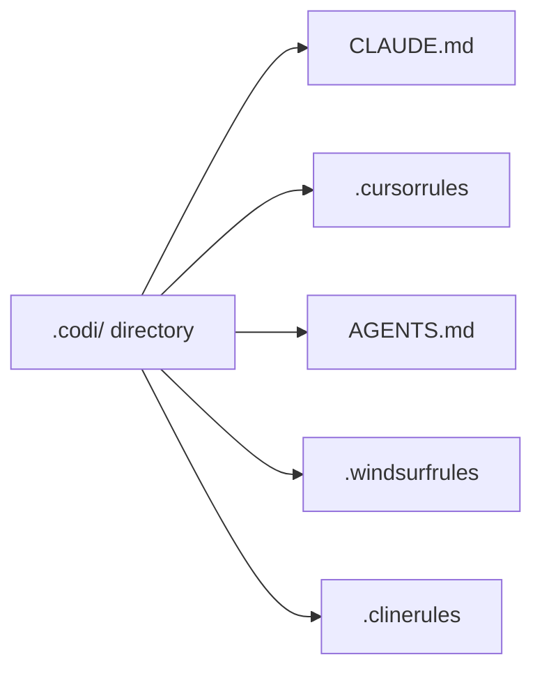
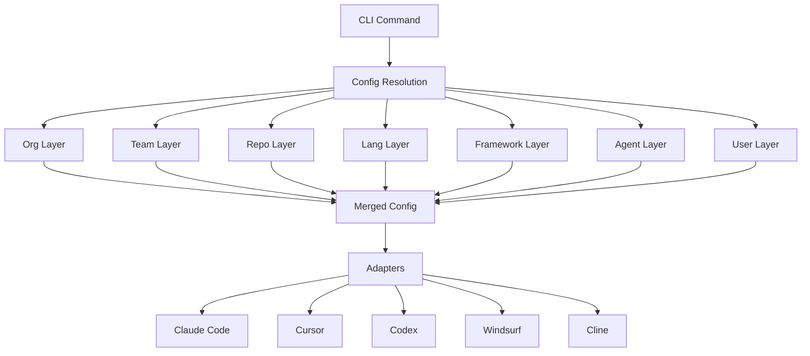

<p align="center">
  
</p>

<p align="center">
  <strong>Unified configuration platform for AI coding agents.</strong>
</p>

[](https://www.npmjs.com/package/codi-cli)
[](./LICENSE)
[](https://github.com/lehidalgo/codi/actions)
[]()

## What is Codi?

AI coding agents (Claude Code, Cursor, Codex, Windsurf, Cline) each require their own configuration file with different formats and conventions. Codi lets you define rules, skills, agents, and flags once in a `.codi/` directory, then generates the correct configuration file for each agent. One config. Every agent. No drift.



## Architecture Overview

Codi reads your `.codi/` directory, resolves configuration through 7 inheritance layers, and passes the result through agent-specific adapters to produce output files.



## Quick Start

### Installation

```bash
# As a dev dependency (recommended)
npm install -D codi-cli

# Or globally
npm install -g codi-cli
```

**Requires Node.js >= 20.**

### Initialize

```bash
# Interactive wizard — select agents, rules, preset
codi init

# Or skip the wizard
codi init --agents claude-code cursor --preset balanced
```

### Generate

```bash
# Generate config files for all detected agents
codi generate

# Preview without writing files
codi generate --dry-run
```

### Verify

```bash
# Show the verification token and prompt
codi verify

# Validate an agent's response
codi verify --check "token: codi-abc123, rules: security, code-style"
```

## Artifacts Matrix

| Artifact | Location | Claude Code | Cursor | Codex | Windsurf | Cline |
|----------|----------|-------------|--------|-------|----------|-------|
| **Rules** | `.codi/rules/custom/` | `.claude/rules/*.md` | `.cursor/rules/*.mdc` | `AGENTS.md` (inline) | `.windsurfrules` (inline) | `.clinerules` (inline) |
| **Skills** | `.codi/skills/` | `.claude/skills/*/SKILL.md` | `.cursor/skills/*/SKILL.md` | `.agents/skills/*/SKILL.md` | `.windsurf/skills/*/SKILL.md` | `.cline/skills/*/SKILL.md` |
| **Agents** | `.codi/agents/` | `.claude/agents/*.md` | -- | `.codex/agents/*.toml` | -- | -- |
| **Commands** | `.codi/commands/` | `.claude/commands/*.md` | -- | -- | -- | -- |
| **MCP** | `.codi/mcp.yaml` | `.claude/mcp.json` | `.cursor/mcp.json` | `.codex/mcp.toml` | `.windsurf/mcp.json` | -- |

Keep individual artifacts under 6,000 chars and total combined content under 12,000 chars (Windsurf limit). Run `codi doctor` to check. See the [Writing Artifacts](docs/writing-rules.md) guide for per-agent size budgets.

## CLI Reference

| Command | Description | Key Options |
|---------|-------------|-------------|
| `codi init` | Initialize `.codi/` configuration | `--force`, `--agents <ids...>`, `--preset <name>` |
| `codi generate` | Generate agent config files | `--agent <ids...>`, `--dry-run`, `--force` |
| `codi validate` | Validate `.codi/` configuration | -- |
| `codi status` | Show drift status of generated files | `--json` |
| `codi add rule <name>` | Add a custom rule | `-t, --template <name>`, `--all` |
| `codi add skill <name>` | Add a custom skill | `-t, --template <name>`, `--all` |
| `codi add agent <name>` | Add a custom agent | `-t, --template <name>`, `--all` |
| `codi add command <name>` | Add a custom command | `-t, --template <name>`, `--all` |
| `codi doctor` | Check project health | `--ci` |
| `codi verify` | Verify agent loaded configuration | `--check <response>` |
| `codi update` | Update flags and artifacts to latest | `--preset`, `--rules`, `--skills`, `--agents`, `--from <repo>`, `--regenerate` |
| `codi clean` | Remove generated files | `--all`, `--dry-run`, `--force` |
| `codi compliance` | Comprehensive health check | `--ci` |
| `codi watch` | Auto-regenerate on file changes | `--once` |
| `codi ci` | Composite CI validation | -- |
| `codi revert` | Restore from backup | `--list`, `--last`, `--backup <ts>` |
| `codi marketplace` | Search/install skills from registry | `search <query>`, `install <name>` |
| `codi preset` | Manage configuration presets | `create`, `list`, `install`, `search`, `update` |
| `codi docs-update` | Update documentation counts to match templates | -- |

Aliases: `codi gen` = `codi generate`.

### Global Options

| Option | Description |
|--------|-------------|
| `-j, --json` | Output as JSON (for scripting) |
| `-v, --verbose` | Verbose/debug output |
| `-q, --quiet` | Suppress non-essential output |
| `--no-color` | Disable colored output |

## Configuration

The `.codi/` directory holds your project manifest (`codi.yaml`), behavioral flags (`flags.yaml`), custom rules, skills, agents, commands, and override layers. Everything is YAML and Markdown.

Codi ships with 18 behavioral flags and 3 presets (`minimal`, `balanced`, `strict`). Flags control permissions like `max_file_lines`, `allow_force_push`, `require_tests`, and more.

For full details on directory structure, flags, and flag modes, see the [Configuration Guide](docs/configuration.md).

## Presets

Presets are composable packages that bundle flags, rules, skills, agents, commands, and MCP config into reusable units. Use built-in presets or create your own.

```bash
codi preset create my-setup
codi preset install name --from org/repo
```

See [Multi-Tenant Design](docs/multi-tenant-design.md) for the full preset architecture.

## Daily Workflow

```bash
# 1. Edit your rules
vim .codi/rules/custom/security.md

# 2. Regenerate agent configs
codi generate

# 3. Check nothing drifted
codi status

# 4. Commit both config and generated files
git add .codi/ CLAUDE.md .cursorrules AGENTS.md .windsurfrules .clinerules
git commit -m "update codi rules"
```

## Git & Version Control

| What | Commit? | Why |
|------|---------|-----|
| `.codi/codi.yaml` | Yes | Project manifest -- source of truth |
| `.codi/flags.yaml` | Yes | Flag configuration |
| `.codi/rules/custom/` | Yes | Your rules |
| `.codi/skills/` | Yes | Your skills |
| `.codi/agents/` | Yes | Your agents |
| `.codi/commands/` | Yes | Your commands |
| `.codi/state.json` | Yes | Enables drift detection for your team |
| Generated files | Yes | Agents need these files in the repo |
| `~/.codi/user.yaml` | No | Personal preferences, never committed |
| `~/.codi/org.yaml` | No | Shared via org tooling, not per-repo |

## Troubleshooting

| Issue | Fix |
|-------|-----|
| `codi` command not found | `npx codi --version` or install globally |
| Node.js version too old | Requires Node >= 20. Use `nvm install 20` |
| Drift detected | Run `codi generate` to regenerate |
| Token mismatch on verify | Config changed since last generate. Regenerate first |
| Watch not triggering | Enable `auto_generate_on_change` flag in `flags.yaml` |

See [Troubleshooting Guide](docs/troubleshooting.md) for detailed solutions.

## Contributing

See [CONTRIBUTING.md](CONTRIBUTING.md) for development setup, code conventions, and how to add new features.

## Documentation

| Guide | Description |
|-------|-------------|
| [Configuration](docs/configuration.md) | Flags, presets, directory structure, manifest |
| [Design Reference](docs/design.md) | Complete design documentation for all 33 functionalities |
| [Architecture](docs/architecture.md) | System design, hook system, error handling |
| [Governance](docs/governance.md) | 7-level inheritance, org policies, locking |
| [Writing Artifacts](docs/writing-rules.md) | Create and customize rules, skills, agents, commands |
| [Adoption & Verification](docs/adoption-verification.md) | Token-based verification and adoption tracking |
| [Migration](docs/migration.md) | Adopt codi in existing projects |
| [CI Integration](docs/ci-integration.md) | GitHub Actions workflow for codi validation |
| [Testing Guide](docs/testing-guide.md) | E2E testing procedure (8 suites) |
| [Multi-Tenant Design](docs/multi-tenant-design.md) | Presets, plugins, and stacks architecture |
| [User Flows](docs/user-flows.md) | Complete user interaction paths and workflows |
| [Troubleshooting](docs/troubleshooting.md) | Common issues and fixes |
| [Contributing](CONTRIBUTING.md) | Development setup and contribution guide |

## Roadmap

Phase 4 (Scale) is next:

- Plugin system for custom adapters
- Approval workflows (draft, review, publish)
- VS Code extension
- Context compression engine
- Remote includes (Git URLs as config sources)

## FAQ

**Q: I already have a `CLAUDE.md` -- will codi overwrite it?**
Yes. Run `codi init`, move your rules into `.codi/rules/custom/` as Markdown files with frontmatter, then `codi generate`. Back up your existing files first.

**Q: Do I commit generated files like `CLAUDE.md`?**
Yes. Agents read these files from your repo. Commit both `.codi/` (your config) and generated files (the output).

**Q: Can different team members use different flag values?**
Yes. Personal preferences go in `~/.codi/user.yaml` (never committed). Org-wide policies go in `~/.codi/org.yaml` with `locked: true` to prevent overrides.

**Q: What happens if I edit a generated file manually?**
`codi status` will report it as "drifted". Running `codi generate` will overwrite your manual edit. If you want persistent changes, edit the rules in `.codi/rules/custom/` instead.

**Q: How do I add codi to a CI pipeline?**
Add `codi doctor --ci` to your CI. It exits non-zero if config is invalid, version is wrong, or generated files are stale.

**Q: Can I use codi with only one agent?**
Yes. Run `codi init --agents claude-code` (or any single agent). Codi works with 1 to 5 agents.

**Q: What's the difference between a rule and a skill?**
Rules are instructions that agents follow (e.g., "never expose secrets"). Skills are reusable workflows that agents can invoke (e.g., "code review checklist"). Both are Markdown files with YAML frontmatter.

**Q: How do I remove a flag from my config?**
Delete the flag entry from `.codi/flags.yaml` and run `codi generate`. Codi will use the catalog default for any missing flags.

## License

[MIT](./LICENSE)
