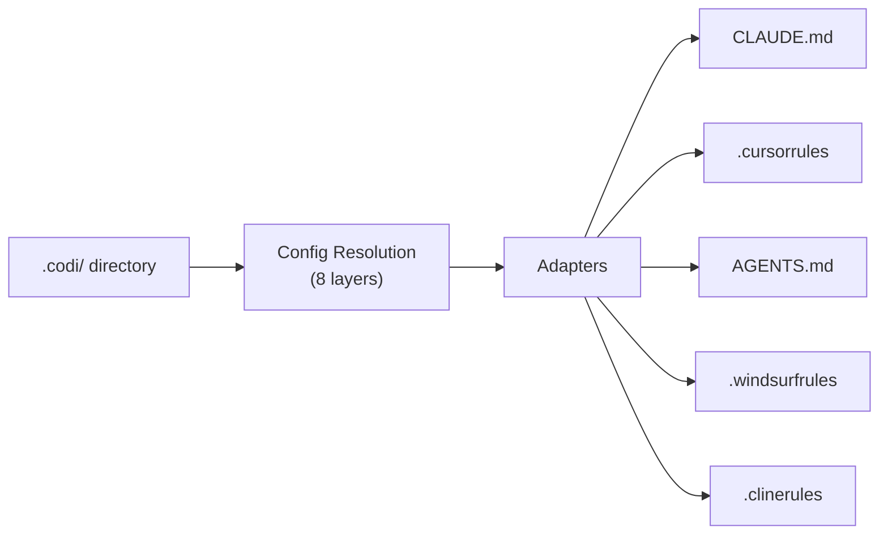

<p align="center">
  
</p>

<p align="center">
  <strong>One config. Every AI agent. Zero drift.</strong>
</p>

<p align="center">
  Define your rules, skills, and workflows once in <code>.codi/</code> — Codi generates the correct configuration for Claude Code, Cursor, Codex, Windsurf, and Cline automatically.
</p>

[](https://www.npmjs.com/package/codi-cli)
[](./LICENSE)
[](https://github.com/lehidalgo/codi/actions)

---

## The Problem

Every AI coding agent speaks a different language. Claude Code reads `CLAUDE.md`, Cursor reads `.cursorrules`, Codex reads `AGENTS.md`. When your team uses multiple agents — or different team members use different editors — you end up maintaining duplicate configurations that inevitably drift apart. A security rule added to `CLAUDE.md` never makes it to `.cursorrules`. A new coding convention is enforced in one agent but ignored by the others.

**Codi solves this.** Write your configuration once in `.codi/`, and Codi generates the correct file for every agent, every time. One source of truth. Zero drift.

---

## Who Is Codi For?

- **Teams using multiple AI agents** — ensure consistent rules across Claude Code, Cursor, Codex, Windsurf, and Cline
- **Tech leads enforcing standards** — define security policies, coding conventions, and testing requirements once and deploy them to every developer's agent
- **Individual developers** — get a structured, version-controlled configuration with 100+ built-in templates instead of writing agent configs from scratch

---

## What You Get

- **5 agents, 1 config** — generate native config files for all supported agents from a single `.codi/` directory
- **100+ built-in templates** — rules, skills, agents, and commands covering security, testing, 11 languages, and 3 frameworks
- **6 presets** — from minimal to strict, choose your starting point and customize
- **Pre-commit hooks** — automated testing, secret scanning, type checking, and file size limits
- **Drift detection** — know instantly when generated files diverge from your source config
- **Interactive wizard** — guided setup, or go fully non-interactive for CI

---

## Quick Start

```bash
# 1. Install
npm install -g codi-cli

# 2. Initialize (interactive wizard)
codi init

# 3. Generate agent configs
codi generate

# 4. Verify
codi status
```

Your `CLAUDE.md`, `.cursorrules`, `AGENTS.md`, and other agent files are generated and ready to commit.

> **No global install?** Use `npx codi-cli <command>` or install as a dev dependency with `npm install -D codi-cli`. Requires **Node.js >= 20**. See the [Getting Started tutorial](docs/getting-started.md) for detailed setup options.

---

## How It Works



Codi reads your `.codi/` directory, resolves configuration through 8 inheritance layers (org → team → preset → repo → language → framework → agent → user), and passes the result through agent-specific adapters that produce each platform's native format. Flags with `locked: true` cannot be overridden by later layers.

---

## Core Concepts

| Concept | What It Is | Learn More |
|:--------|:-----------|:-----------|
| **Artifacts** | Rules, skills, agents, commands, brands — the building blocks of your config | [Artifacts Guide](docs/artifacts.md) |
| **Presets** | Bundles of flags + artifacts for quick setup (6 built-in) | [Presets Guide](docs/presets.md) |
| **Flags** | 18 behavioral switches controlling security, testing, permissions, and context | [Configuration](docs/configuration.md) |
| **Adapters** | Translators that convert your config to each agent's native format | [Architecture](docs/architecture.md) |

---

## Supported Agents

<!-- GENERATED:START:supported_agents -->
| Agent | Config File | Rules | Skills | Agents | MCP |
|:------|:-----------|:-----:|:------:|:------:|:---:|
| **Claude Code** | `CLAUDE.md` | `.claude/rules` | `.claude/skills` | `.claude/agents` | `.mcp.json` |
| **Cursor** | `.cursorrules` | `.cursor/rules` | `—` | — | `.cursor/mcp.json` |
| **Codex** | `AGENTS.md` | `.` | `.agents/skills` | `.codex/agents` | `.codex/mcp.toml` |
| **Windsurf** | `.windsurfrules` | `.` | `.windsurf/skills` | — | — |
| **Cline** | `.clinerules` | `.cline` | `.cline/skills` | — | — |
<!-- GENERATED:END:supported_agents -->

## Built-in Templates

<!-- GENERATED:START:template_counts_compact -->
| Artifact | Count |
|:---------|:-----:|
| **Rules** | 27 |
| **Skills** | 42 |
| **Agents** | 22 |
| **Commands** | 16 |
<!-- GENERATED:END:template_counts_compact -->

Create your own with `codi add rule|skill|agent|command <name>`, or start from a template with `--template`.

## Presets

<!-- GENERATED:START:preset_table -->
| Preset | Focus | Description |
|:-------|:------|:------------|
| `codi-minimal` | minimal | Permissive — security off, no test requirements, all actions allowed |
| `codi-balanced` | balanced | Recommended — security on, type-checking strict, no force-push |
| `codi-strict` | strict | Enforced — security locked, tests required, delete restricted, no force-push |
| `codi-fullstack` | fullstack | Comprehensive web/app development — broad rules, testing, and security. Language-agnostic |
| `codi-dev` | codi | Preset for developing the Codi CLI itself |
| `codi-power-user` | workflow | Daily workflow — graph exploration, day tracking, session management, codebase onboarding |
<!-- GENERATED:END:preset_table -->

Create, share, and install presets from ZIP, GitHub, or the registry with `codi preset`. See the [Presets Guide](docs/presets.md).

---

## CLI Quick Reference

| Command | Description |
|---------|-------------|
| `codi` | Launch interactive Command Center |
| `codi init` | Initialize `.codi/` configuration |
| `codi generate` | Generate agent config files |
| `codi add <type> <name>` | Add a rule, skill, agent, command, or brand |
| `codi status` | Show drift status |
| `codi doctor` | Check project health |
| `codi validate` | Validate configuration |
| `codi preset <sub>` | Manage presets (create, install, export, etc.) |
| `codi watch` | Auto-regenerate on file changes |
| `codi compliance` | Full health + drift + verification check |

> **Full reference**: See [CLI Reference](docs/cli-reference.md) for all 20 commands with options, examples, and the Command Center / init wizard documentation.

### Global Options

`-j, --json` JSON output | `-v, --verbose` debug | `-q, --quiet` silent | `--no-color` plain

---

## FAQ

**Q: Will Codi overwrite my existing `CLAUDE.md`?**
Yes. Back up your existing files first, then move your rules into `.codi/rules/custom/` and run `codi generate`.

**Q: Do I commit generated files?**
Yes. Agents read these files from your repo. Commit both `.codi/` (source) and generated files (output).

**Q: What happens if I edit a generated file manually?**
`codi status` reports it as "drifted". Running `codi generate` overwrites the edit. Modify rules in `.codi/rules/custom/` instead.

**Q: Can different team members use different settings?**
Yes. Personal preferences go in `~/.codi/user.yaml` (never committed). Org-wide policies go in `~/.codi/org.yaml` with `locked: true`.

**Q: How do I add Codi to CI?**
Install as a dev dependency and add `npx codi doctor --ci` to your pipeline. It exits non-zero on issues.

> More questions? See [Troubleshooting](docs/troubleshooting.md).

---

## Documentation

| Guide | Description |
|:------|:------------|
| [Getting Started](docs/getting-started.md) | Hands-on tutorial for new users |
| [Feature Inventory](docs/features.md) | Complete list of everything Codi does |
| [CLI Reference](docs/cli-reference.md) | All commands, Command Center, init wizard |
| [Architecture](docs/architecture.md) | Config resolution, adapters, generation pipeline |
| [Configuration](docs/configuration.md) | Manifest, flags, layers, MCP |
| [Artifacts](docs/artifacts.md) | Rules, skills, agents, commands, brands |
| [Presets](docs/presets.md) | Built-in and custom presets |
| [Workflows](docs/workflows.md) | Daily usage, CI/CD, team patterns |
| [Migration](docs/migration.md) | Adopt Codi in existing projects |
| [Troubleshooting](docs/troubleshooting.md) | Common issues and fixes |
| [Maintaining Docs](docs/maintaining-docs.md) | Documentation maintenance guidelines |

---

## Contributing

See [CONTRIBUTING.md](CONTRIBUTING.md) for development setup, code conventions, and how to add features.

## License

[MIT](./LICENSE)
