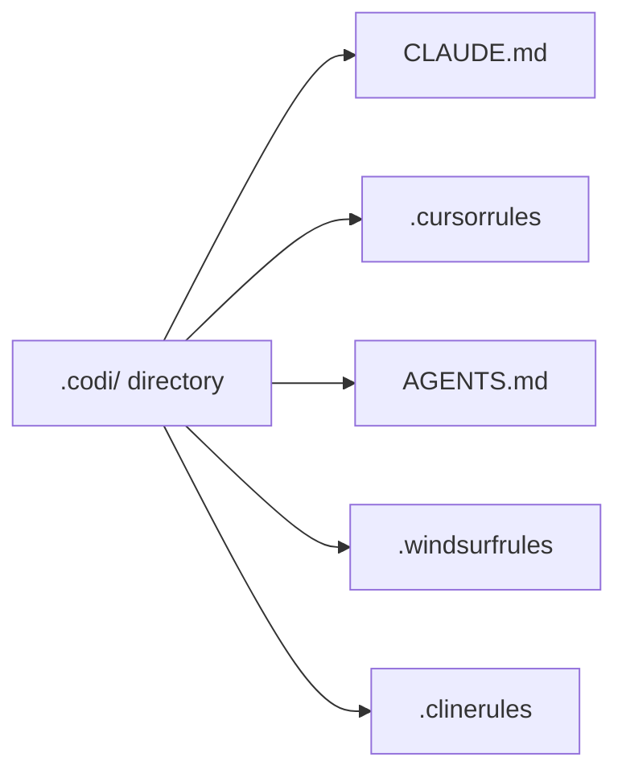
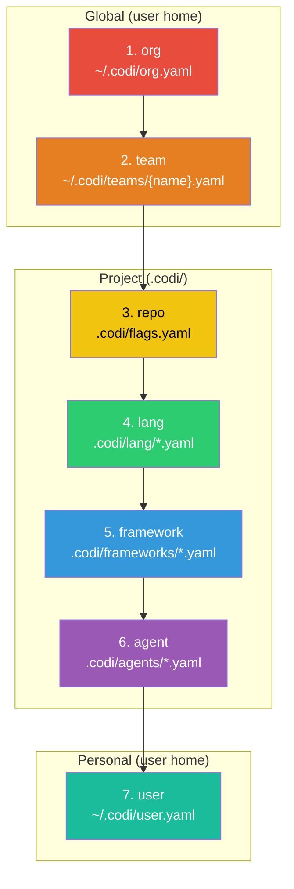
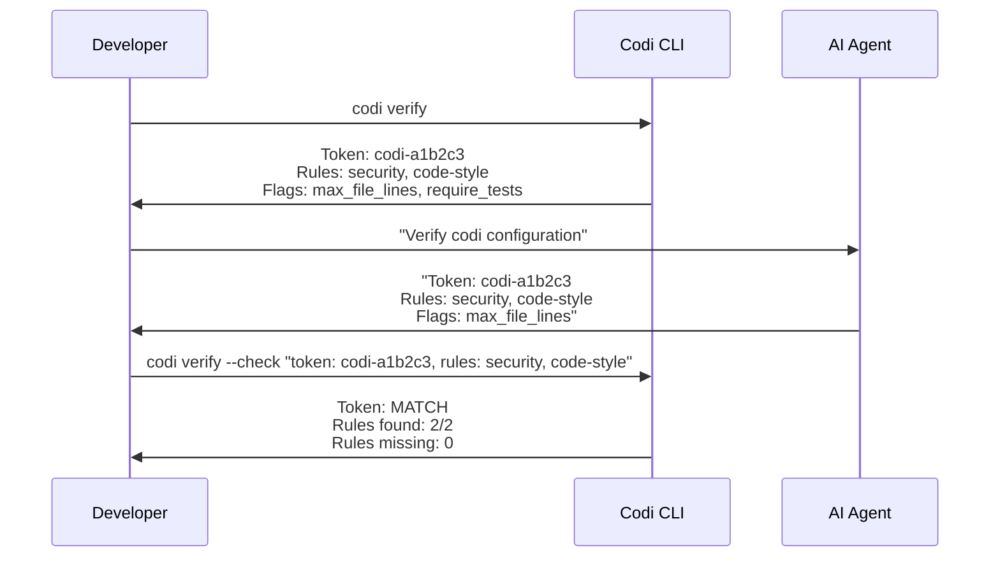

<p align="center">
  
</p>

<p align="center">
  <strong>Unified configuration platform for AI coding agents.</strong>
</p>

[](https://www.npmjs.com/package/codi-cli)
[](./LICENSE)
[](https://github.com/lehidalgo/codi/actions)

## What is Codi?

AI coding agents (Claude Code, Cursor, Codex, Windsurf, Cline) each require their own configuration file with different formats and conventions. When you use multiple agents, you end up maintaining separate config files that inevitably drift apart.

**Codi solves this.** Define your rules, flags, and settings once in a `.codi/` directory, and Codi generates the correct configuration file for each agent.



**One config. Every agent. No drift.**

## Supported Agents

| Agent | Generated File | Config Directory |
|-------|---------------|-----------------|
| Claude Code | `CLAUDE.md` | `.claude/rules/` |
| Cursor | `.cursorrules` | `.cursor/rules/` |
| Codex (OpenAI) | `AGENTS.md` | — |
| Windsurf | `.windsurfrules` | — |
| Cline | `.clinerules` | — |

## Quick Start

### Install

```bash
# As a dev dependency (recommended)
npm install -D codi-cli

# Or globally
npm install -g codi-cli
```

**Requires Node.js >= 20.**

### Initialize

```bash
# Interactive wizard — walks you through setup
codi init
```

The wizard will ask you to:
1. **Select agents** — auto-detected from your project
2. **Choose rules** — pick from built-in templates (security, code-style, testing, architecture)
3. **Pick a preset** — `minimal`, `balanced` (recommended), or `strict`
4. **Enable version pinning** — locks your team to a minimum codi version

```bash
# Or skip the wizard with explicit options
codi init --agents claude-code cursor --preset balanced
```

### Add More Rules Later

```bash
# Add all 9 built-in template rules at once
codi add rule --all

# Add a specific rule from a template
codi add rule security --template security

# Add a blank rule to write yourself
codi add rule api-guidelines
```

### Generate

```bash
# Generate config files for all detected agents
codi generate

# Preview without writing files
codi generate --dry-run

# Generate for a specific agent only
codi generate --agent claude-code
```

### Verify

```bash
# Show the verification token and prompt
codi verify

# After asking your agent to verify, validate its response
codi verify --check "token: codi-abc123, rules: security, code-style"
```

## What Gets Generated

After running `codi generate`, each agent gets a config file tailored to its format. Here's what the output looks like:

**CLAUDE.md** (for Claude Code):
```markdown
## Permissions

Keep source code files under 700 lines. Documentation files have no line limit.
Do NOT use force push (--force) on git operations.
All changes require pull request review before merging.
Maximum context window: 50000 tokens.

## security

# Security Rules

- Never expose secrets, API keys, or credentials in code
- Use environment variables for sensitive configuration
- Validate and sanitize all user inputs
- Follow OWASP security guidelines

## code-style

# Code Style

- Follow consistent naming conventions
- Keep functions focused and small
...

## Codi Verification

This project uses Codi for unified AI agent configuration.
When asked "verify codi" or "codi verify", respond with:
- Verification token: `codi-9ced0d`
- Rules loaded: [list the rule names you see in this file]
- Flags active: [list any permission constraints from this file]
```

**.cursorrules** (for Cursor) — same rules, different format:
```
# Rules

## security

- Never expose secrets, API keys, or credentials in code
- Use environment variables for sensitive configuration
...
```

Each adapter formats the same rules and flags for its agent's conventions. Individual rule files are also created in `.claude/rules/` and `.cursor/rules/` for agents that support per-rule files.

### How Flags Become Instructions

Flags in `flags.yaml` are automatically translated into natural-language instructions in the generated files:

| Flag YAML | Generated Instruction |
|-----------|----------------------|
| `allow_force_push: false` | "Do NOT use force push (--force) on git operations." |
| `max_file_lines: 700` | "Keep source code files under 700 lines. Documentation files have no line limit." |
| `require_pr_review: true` | "All changes require pull request review before merging." |
| `require_tests: true` | "Write tests for all new code." |
| `allow_shell_commands: false` | "Do NOT execute shell commands." |
| `require_documentation: true` | "Write documentation for all new code and APIs." |
| `mcp_allowed_servers: [github, jira]` | "Only use these MCP servers: github, jira." |
| `allowed_languages: [typescript, python]` | "Only use these languages: typescript, python." |
| `max_context_tokens: 50000` | "Maximum context window: 50000 tokens." |

Flags that are operational (like `drift_detection`, `progressive_loading`, `lint_on_save`) don't generate agent instructions — they control codi's behavior instead.

## Daily Workflow

```bash
# 1. Edit your rules
vim .codi/rules/custom/security.md

# 2. Regenerate agent configs
codi generate

# 3. Check nothing drifted
codi status

# 4. Commit both config and generated files
git add .codi/ CLAUDE.md .cursorrules AGENTS.md .windsurfrules .clinerules
git commit -m "update codi rules"
```

## Git & Version Control

| What | Commit? | Why |
|------|---------|-----|
| `.codi/codi.yaml` | Yes | Your project manifest — source of truth |
| `.codi/flags.yaml` | Yes | Flag configuration |
| `.codi/rules/custom/` | Yes | Your rules |
| `.codi/skills/` | Yes | Your skills |
| `.codi/state.json` | Yes | Enables drift detection for your team |
| Generated files (`CLAUDE.md`, `.cursorrules`, etc.) | Yes | Agents need these files in the repo to read them |
| `~/.codi/user.yaml` | No | Personal preferences, never committed |
| `~/.codi/org.yaml` | No | Shared via org tooling, not per-repo |

## Migration

Already using AI agents with manual config files? Codi can adopt your existing setup.

```bash
# 1. Initialize — codi auto-detects existing agent config files
codi init

# 2. Move your existing rules into .codi/rules/custom/ as Markdown files
# Each rule needs YAML frontmatter (name, description, priority)

# 3. Regenerate — now all agents get the same rules
codi generate

# 4. Verify the output matches your expectations
codi status
```

Your existing `CLAUDE.md`, `.cursorrules`, etc. will be overwritten by codi's generated versions. Back them up first if needed.

## CLI Reference

### Commands

| Command | Description | Key Options |
|---------|-------------|-------------|
| `codi init` | Initialize `.codi/` configuration | `--force`, `--agents <ids...>`, `--preset <name>` |
| `codi generate` | Generate agent config files | `--agent <ids...>`, `--dry-run`, `--force` |
| `codi validate` | Validate `.codi/` configuration | — |
| `codi status` | Show drift status of generated files | — |
| `codi add rule <name>` | Add a custom rule | `-t, --template <name>` |
| `codi add skill <name>` | Add a custom skill | `-t, --template <name>` |
| `codi doctor` | Check project health | `--ci` |
| `codi sync` | Sync config to team repo via PR | `--dry-run`, `-m, --message <msg>` |
| `codi verify` | Verify agent loaded configuration | `--check <response>` |
| `codi update` | Update flags and rules to latest versions | `--preset <name>`, `--rules`, `--regenerate`, `--dry-run` |
| `codi clean` | Remove generated files (uninstall codi output) | `--all`, `--dry-run`, `--force` |

Aliases: `codi gen` = `codi generate`.

### Global Options

Every command accepts these options:

| Option | Description |
|--------|-------------|
| `-j, --json` | Output as JSON (for scripting) |
| `-v, --verbose` | Verbose/debug output |
| `-q, --quiet` | Suppress non-essential output |
| `--no-color` | Disable colored output |

### Command Details

#### `codi init`

Creates the `.codi/` directory structure with:
- `codi.yaml` — project manifest listing detected agents
- `flags.yaml` — all 18 flags with default values
- `rules/generated/common/` and `rules/custom/` — rule directories
- `skills/` — skill directory
- `frameworks/` — framework override directory

**Stack auto-detection** looks for `package.json` (Node), `pyproject.toml` (Python), `go.mod` (Go), `Cargo.toml` (Rust).

**Agent auto-detection** checks for existing config files (`CLAUDE.md`, `.cursorrules`, etc.) in the project root.

**Interactive wizard** runs by default. Skipped when `--agents`, `--json`, or `--quiet` is provided.

**Presets** control the flag strictness level via `--preset`:

| Preset | Philosophy |
|--------|-----------|
| `minimal` | Permissive — security off, no test requirements, all actions allowed |
| `balanced` | Recommended — security on, type-checking strict, no force-push |
| `strict` | Enforced — security locked, tests required, shell/delete restricted |

<details>
<summary>Preset comparison (click to expand)</summary>

| Flag | Minimal | Balanced | Strict |
|------|---------|----------|--------|
| `security_scan` | `false` | `true` | `true` (enforced, locked) |
| `test_before_commit` | `false` | `true` | `true` (enforced, locked) |
| `type_checking` | `off` | `strict` | `strict` (enforced, locked) |
| `max_file_lines` | `1000` | `700` | `500` |
| `require_tests` | `false` | `false` | `true` (enforced, locked) |
| `allow_shell_commands` | `true` | `true` | `false` |
| `allow_file_deletion` | `true` | `true` | `false` |
| `allow_force_push` | `true` | `false` | `false` (enforced, locked) |
| `require_pr_review` | `false` | `true` | `true` (enforced, locked) |
| `require_documentation` | `false` | `false` | `true` |
| `drift_detection` | `off` | `warn` | `error` |
| `auto_generate_on_change` | `false` | `false` | `true` |

Flags marked "enforced, locked" in the strict preset cannot be overridden by any lower layer.

</details>

After creating the structure, Codi automatically runs generation to produce the initial config files.

#### `codi generate`

Resolves configuration from all 7 layers, then invokes each adapter to produce the output files. Updates `.codi/state.json` with SHA-256 hashes of all generated files for drift detection.

Use `--dry-run` to preview what would be generated without writing any files. Use `--force` to regenerate even if nothing has changed.

#### `codi status`

Compares the current content of generated files against the hashes stored in `.codi/state.json`. Reports each file as:
- **synced** — file matches the last generation
- **drifted** — file was modified after generation
- **missing** — file was deleted after generation

#### `codi doctor`

Runs health checks:
1. **Config validity** — `.codi/` directory parses correctly
2. **Version compatibility** — codi version satisfies `requiredVersion` (if set)
3. **Org config** — `~/.codi/org.yaml` is valid YAML (if exists)
4. **Team config** — referenced team file exists and is valid (if set)
5. **Drift detection** — generated files are up to date

With `--ci`, exits non-zero on any failure — designed for pre-commit hooks and CI pipelines.

#### `codi sync`

Syncs your local `.codi/` rules and skills to a shared team repository via pull request. Requires the `gh` CLI to be installed and authenticated.

Flow: clone team repo → create branch → copy paths → commit → push → create PR.

#### `codi update`

Brings your flags and rules up to date:
- **Without options**: Adds any new flags from the catalog (forward-compatibility when upgrading codi)
- **With `--preset`**: Resets ALL flags to the specified preset values
- **With `--rules`**: Refreshes template-managed rules (`managed_by: codi`) to the latest content from the installed codi version. User-custom rules (`managed_by: user`) are never touched.

```bash
# Add any new flags from latest codi version
codi update

# Reset all flags to the strict preset
codi update --preset strict

# Refresh rules to latest templates
codi update --rules

# Full update: flags + rules + regenerate
codi update --preset balanced --rules --regenerate

# Preview without writing
codi update --rules --dry-run
```

#### Rule Ownership

Rules have a `managed_by` field in their frontmatter:
- **`managed_by: codi`** — created from a template, updated by `codi update --rules`
- **`managed_by: user`** — custom rule, never overwritten by codi

When you run `codi add rule security --template security`, the rule is created with `managed_by: codi`. When you run `codi add rule my-custom-rule` (no template), it's `managed_by: user`.

#### `codi clean`

Removes generated files from your project. By default keeps `.codi/` intact (your config is safe).

```bash
# Remove generated files only (CLAUDE.md, .cursorrules, etc.)
codi clean

# Full uninstall — also removes .codi/ directory
codi clean --all

# Preview without deleting
codi clean --dry-run
```

## Configuration

### Directory Structure

```
.codi/
  codi.yaml                    # Project manifest
  flags.yaml                   # Behavioral flags (18 flags)
  state.json                   # Generation state (auto-managed)
  rules/
    generated/
      common/                  # Auto-generated rules
    custom/                    # Your custom rules (Markdown)
  skills/                      # Your custom skills (Markdown)
  lang/                        # Language-specific flag overrides (*.yaml)
  frameworks/                  # Framework-specific flag overrides (*.yaml)
  agents/                      # Agent-specific flag overrides (*.yaml)
```

### Manifest (`codi.yaml`)

The manifest declares your project name, target agents, and optional settings.

```yaml
name: my-project
version: "1"

# Which agents to generate config for
agents:
  - claude-code
  - cursor
  - codex
  - windsurf
  - cline

# Reference a team config (loaded from ~/.codi/teams/frontend.yaml)
team: frontend

# Pin minimum codi version
codi:
  requiredVersion: ">=0.1.0"

# Team sync configuration
sync:
  repo: "org/team-codi-config"
  branch: main
  paths: [rules, skills]

# Control which content types are included
layers:
  rules: true
  skills: true
  commands: true
  agents: true
  context: true
```

### Flags (`flags.yaml`)

Flags control how AI agents behave in your project. Each flag has a **mode** and a **value**.

```yaml
security_scan:
  mode: enforced
  value: true
  locked: true          # Prevents lower layers from overriding

max_file_lines:
  mode: enabled
  value: 500

type_checking:
  mode: conditional
  value: strict
  conditions:
    lang: [typescript]   # Only apply when language is TypeScript
```

#### All 18 Flags

| Flag | Type | Default | Description |
|------|------|---------|-------------|
| `auto_commit` | boolean | `false` | Automatic commits after changes |
| `test_before_commit` | boolean | `true` | Run tests before commit |
| `security_scan` | boolean | `true` | Mandatory security scanning |
| `type_checking` | enum | `strict` | Type checking level (`strict`, `basic`, `off`) |
| `max_file_lines` | number | `700` | Maximum lines per file |
| `require_tests` | boolean | `false` | Require tests for new code |
| `allow_shell_commands` | boolean | `true` | Allow shell command execution |
| `allow_file_deletion` | boolean | `true` | Allow file deletion |
| `lint_on_save` | boolean | `true` | Lint files on save |
| `allow_force_push` | boolean | `false` | Allow force push to remote |
| `require_pr_review` | boolean | `true` | Require PR review before merge |
| `mcp_allowed_servers` | string[] | `[]` | Whitelist of allowed MCP servers |
| `require_documentation` | boolean | `false` | Require documentation for new code |
| `allowed_languages` | string[] | `["*"]` | Allowed programming languages (`*` = all) |
| `max_context_tokens` | number | `50000` | Maximum context token window |
| `progressive_loading` | enum | `metadata` | Loading strategy (`off`, `metadata`, `full`) |
| `drift_detection` | enum | `warn` | Drift behavior (`off`, `warn`, `error`) |
| `auto_generate_on_change` | boolean | `false` | Auto-regenerate on config change |

Flags are translated into natural-language instructions embedded in each agent's config file. For example, `allow_force_push: false` becomes _"Do NOT use force push (--force) on git operations."_

#### Flag Modes

Each flag supports 6 modes that control how it behaves across the inheritance chain:

| Mode | Behavior | Can Override? |
|------|----------|---------------|
| `enforced` | Always active, non-negotiable | No (stops resolution) |
| `enabled` | Active with specified value | Yes |
| `disabled` | Explicitly turned off | Yes |
| `inherited` | Skip — use parent layer's value | Yes |
| `delegated_to_agent_default` | Use the flag's catalog default | Yes |
| `conditional` | Apply only if conditions match | Yes |

**Conditional mode** requires a `conditions` block with at least one key:

```yaml
require_tests:
  mode: conditional
  value: true
  conditions:
    lang: [typescript, python]     # Match by language
    framework: [react, nextjs]     # Match by framework
    agent: [claude-code]           # Match by agent
    file_pattern: ["src/**/*.ts"]  # Match by file glob
```

All specified conditions must match for the flag to apply.

#### Locking Flags

Flags can be locked at org, team, or repo levels to prevent lower layers from overriding them:

```yaml
# In ~/.codi/org.yaml — nobody can disable security scanning
security_scan:
  mode: enforced
  value: true
  locked: true
```

Attempting to override a locked flag at a lower layer produces a validation error.

#### Example `flags.yaml` (balanced preset)

This is what `flags.yaml` looks like after running `codi init` with the balanced preset:

```yaml
auto_commit:
  mode: enabled
  value: false
test_before_commit:
  mode: enabled
  value: true
security_scan:
  mode: enabled
  value: true
type_checking:
  mode: enabled
  value: strict
max_file_lines:
  mode: enabled
  value: 700
allow_force_push:
  mode: enabled
  value: false
require_pr_review:
  mode: enabled
  value: true
drift_detection:
  mode: enabled
  value: warn
# ... and 10 more flags
```

### Rules

Rules are Markdown files in `.codi/rules/custom/` with YAML frontmatter:

```markdown
---
name: security
description: Security best practices
priority: high
alwaysApply: true
managed_by: user
---

# Security Rules

- Never expose secrets, API keys, or credentials in code
- Use environment variables for sensitive configuration
- Validate and sanitize all user inputs
- Follow OWASP security guidelines
```

**Frontmatter fields:**

| Field | Type | Required | Description |
|-------|------|----------|-------------|
| `name` | string | Yes | Rule identifier |
| `description` | string | Yes | Brief description |
| `priority` | `high` / `medium` / `low` | No | Importance level |
| `alwaysApply` | boolean | No | Apply in all contexts |
| `managed_by` | `user` / `codi` | No | Who manages this rule |
| `scope` | string[] | No | Glob patterns to restrict scope |
| `language` | string | No | Language-specific rule |

For a complete guide on writing, modifying, and contributing rules, see **[docs/writing-rules.md](docs/writing-rules.md)**.

#### Built-in Rule Templates

Create rules from templates with `codi add rule <name> --template <template>`:

| Template | Description |
|----------|-------------|
| `security` | Secret management, input validation, auth, dependency auditing, OWASP |
| `code-style` | Naming conventions, function size limits, file organization, error handling |
| `testing` | TDD workflow (RED/GREEN/REFACTOR), 80% coverage, AAA pattern, mocking guidelines |
| `architecture` | Module design, dependency direction, SOLID principles, avoid over-engineering |
| `git-workflow` | Conventional commits, atomic commits, branch strategy, safety rules |
| `error-handling` | Typed errors, actionable messages, logging, resilience, cleanup |
| `performance` | N+1 prevention, async patterns, caching strategy, pagination |
| `documentation` | API docs, README maintenance, ADRs, code comments |
| `api-design` | REST conventions, versioning, error format, pagination, rate limiting |

### Skills

Skills define reusable workflows and instructions. They live in `.codi/skills/` as Markdown files:

```markdown
---
name: code-review
description: Code review workflow
type: skill
compatibility: [claude-code, cursor]
tools: []
---

# Code Review

## When to Use
Use this skill when reviewing code changes.

## Instructions
- Check for security vulnerabilities
- Verify error handling coverage
- Ensure consistent naming conventions
- Validate test coverage
```

#### Built-in Skill Templates

Create skills with `codi add skill <name> --template <template>`:

| Template | Description |
|----------|-------------|
| `mcp` | MCP server tool usage guidelines |
| `code-review` | Code review workflow and checklist |
| `documentation` | Documentation generation standards |
| `rule-management` | Guides AI agents to help create and manage codi rules |

## 7-Level Config Inheritance

Codi resolves configuration through 7 layers. Each layer can set, override, or lock flag values. Later layers override earlier ones — unless a flag is locked.



**Resolution direction:** Layer 7 (user) has the highest override priority for non-locked flags. Layers 1-3 (org, team, repo) can lock flags to prevent overrides.

### Layer Descriptions

| # | Layer | Location | Purpose |
|---|-------|----------|---------|
| 1 | **org** | `~/.codi/org.yaml` | Organization-wide security policies |
| 2 | **team** | `~/.codi/teams/{name}.yaml` | Team-specific standards |
| 3 | **repo** | `.codi/flags.yaml` | Project-level configuration |
| 4 | **lang** | `.codi/lang/*.yaml` | Language-specific overrides (e.g., `typescript.yaml`) |
| 5 | **framework** | `.codi/frameworks/*.yaml` | Framework-specific defaults (e.g., `nextjs.yaml`) |
| 6 | **agent** | `.codi/agents/*.yaml` | Agent-specific overrides (e.g., `claude-code.yaml`) |
| 7 | **user** | `~/.codi/user.yaml` | Personal preferences (never committed) |

### Example: Organization Policy Enforcement

```yaml
# ~/.codi/org.yaml — enforced across all projects
flags:
  security_scan:
    mode: enforced
    value: true
    locked: true          # No project can disable this

  allow_force_push:
    mode: enforced
    value: false
    locked: true          # Force push prohibited company-wide
```

```yaml
# ~/.codi/teams/frontend.yaml — team-level overrides
flags:
  max_file_lines:
    mode: enabled
    value: 500            # Stricter than default 700

  allowed_languages:
    mode: enabled
    value: [typescript, javascript, css]
```

```yaml
# .codi/flags.yaml — project-level (can't override locked org flags)
flags:
  require_tests:
    mode: conditional
    value: true
    conditions:
      lang: [typescript]  # Only require tests for TypeScript files
```

```yaml
# ~/.codi/user.yaml — personal preferences (never committed)
flags:
  auto_commit:
    mode: enabled
    value: true           # Personal preference for auto-commit
```

**Resolution result:**
- `security_scan` = `true` (locked at org, cannot be changed)
- `allow_force_push` = `false` (locked at org)
- `max_file_lines` = `500` (team override)
- `require_tests` = `true` for TypeScript, `false` otherwise (conditional at repo)
- `auto_commit` = `true` (user personal preference)

## Verification

Codi generates a deterministic verification token based on your project configuration. This lets you confirm that an AI agent actually loaded and understood your rules.

### How It Works



The token is a SHA-256 hash of your project name, agents, rules, and active flags. If the agent returns the correct token, you know it loaded the full configuration.

### Usage

```bash
# Step 1: See your token and what to ask
codi verify

# Step 2: Ask your agent to verify (paste the prompt codi shows you)

# Step 3: Validate the agent's response
codi verify --check "token: codi-a1b2c3, rules: security, code-style, flags: max_file_lines"
```

## Version Enforcement

Pin a minimum Codi version to keep your team aligned:

```yaml
# codi.yaml
codi:
  requiredVersion: ">=0.1.0"
```

### Doctor Checks

```bash
# Interactive health check
codi doctor

# CI/pre-commit mode — exits non-zero on any failure
codi doctor --ci
```

`codi doctor` runs these checks:
1. Config directory validity
2. Codi version satisfies `requiredVersion`
3. Org config is valid YAML (if exists)
4. Team config exists (if referenced in manifest)
5. Generated files are not stale

When `requiredVersion` is set, `codi init` auto-installs a pre-commit hook that runs `codi doctor --ci`, catching version mismatches before code is pushed.

## Team Sync

Share rules and skills with your team through a shared config repository.

### Setup

```yaml
# codi.yaml
sync:
  repo: "org/team-codi-config"   # GitHub repository
  branch: main                    # Target branch
  paths: [rules, skills]          # What to sync
```

### Usage

```bash
# Preview what would be synced
codi sync --dry-run

# Sync and create a pull request
codi sync

# With a custom PR message
codi sync -m "Add security rules from project-x"
```

**Requires** the [GitHub CLI](https://cli.github.com/) (`gh`) to be installed and authenticated.

### How It Works

1. Clones the team repository
2. Creates a feature branch with timestamp
3. Copies specified paths from local `.codi/` to the repo
4. Commits and pushes the changes
5. Creates a pull request via `gh` CLI
6. Returns the PR URL

Changes are detected via hash comparison — only modified files are synced.

## Development

### Setup

```bash
git clone https://github.com/lehidalgo/codi.git
cd codi
npm install
npm run build
npm test
```

### Scripts

| Script | Description |
|--------|-------------|
| `npm run build` | Build with tsup |
| `npm test` | Run tests (Vitest) |
| `npm run test:watch` | Watch mode |
| `npm run test:coverage` | Coverage report |
| `npm run lint` | Type check (`tsc --noEmit`) |
| `npm run dev` | Build in watch mode |

### Project Structure

```
src/
  cli/              # Command handlers
    init.ts         #   codi init — project scaffolding
    init-wizard.ts  #   Interactive setup wizard
    generate.ts     #   codi generate — config file generation
    validate.ts     #   codi validate — config validation
    status.ts       #   codi status — drift detection
    add.ts          #   codi add rule/skill — scaffolding
    verify.ts       #   codi verify — token verification
    doctor.ts       #   codi doctor — health checks
    sync.ts         #   codi sync — team repo sync
    shared.ts       #   Global options and output handling
  adapters/         # Agent-specific output generators
    claude-code.ts  #   CLAUDE.md + .claude/rules/
    cursor.ts       #   .cursorrules + .cursor/rules/
    codex.ts        #   AGENTS.md
    windsurf.ts     #   .windsurfrules
    cline.ts        #   .clinerules
    flag-instructions.ts  # Flag → instruction text conversion
  core/
    config/         # 7-level config resolution engine
    flags/          # 18-flag catalog, resolver, validator
    generator/      # Adapter orchestration
    hooks/          # Pre-commit hook system
    migration/      # Import from existing CLAUDE.md / AGENTS.md
    output/         # Logger, formatter, 23 error codes, exit codes
    scaffolder/     # Rule and skill template system
    sync/           # Git operations and PR creation
    verify/         # Token generation and response validation
    version/        # Semver checking and doctor reports
  schemas/          # Zod validation schemas
  templates/        # Built-in rule, skill, and hook templates
  types/            # TypeScript type definitions
  utils/            # Path resolution, hashing, semver
```

### Tech Stack

| Technology | Purpose |
|------------|---------|
| TypeScript | Strict mode, ESM, full type safety |
| Commander.js | CLI framework |
| Zod | Schema validation |
| Vitest | Test runner (373 tests) |
| tsup | Bundler (ESM, Node 20 target) |
| gray-matter | YAML frontmatter parsing |

### Architecture

- **Result types** — all functions return `Result<T>` (`ok(data)` or `err(errors)`), no thrown exceptions
- **Adapter pattern** — each agent has an independent adapter implementing `detect()` and `generate()`
- **Hash-based state** — SHA-256 hashes track generated file freshness for drift detection
- **Layered resolution** — 7-level config cascade with locking and conditional evaluation
- **23 structured error codes** — every error has a code, severity, and actionable hint

## FAQ

**Q: I already have a `CLAUDE.md` — will codi overwrite it?**
Yes. Run `codi init`, move your rules into `.codi/rules/custom/` as Markdown files with frontmatter, then `codi generate`. Back up your existing files first.

**Q: Do I commit generated files like `CLAUDE.md`?**
Yes. Agents read these files from your repo. Commit both `.codi/` (your config) and generated files (the output).

**Q: Can different team members use different flag values?**
Yes. Personal preferences go in `~/.codi/user.yaml` (never committed). Org-wide policies go in `~/.codi/org.yaml` with `locked: true` to prevent overrides.

**Q: What happens if I edit a generated file manually?**
`codi status` will report it as "drifted". Running `codi generate` will overwrite your manual edit. If you want persistent changes, edit the rules in `.codi/rules/custom/` instead.

**Q: How do I add codi to a CI pipeline?**
Add `codi doctor --ci` to your CI. It exits non-zero if config is invalid, version is wrong, or generated files are stale.

**Q: Can I use codi with only one agent?**
Yes. Run `codi init --agents claude-code` (or any single agent). Codi works with 1 to 5 agents.

**Q: What's the difference between a rule and a skill?**
Rules are instructions that agents follow (e.g., "never expose secrets"). Skills are reusable workflows that agents can invoke (e.g., "code review checklist"). Both are Markdown files with YAML frontmatter.

**Q: How do I remove a flag from my config?**
Delete the flag entry from `.codi/flags.yaml` and run `codi generate`. Codi will use the catalog default for any missing flags.

## License

[MIT](./LICENSE)
