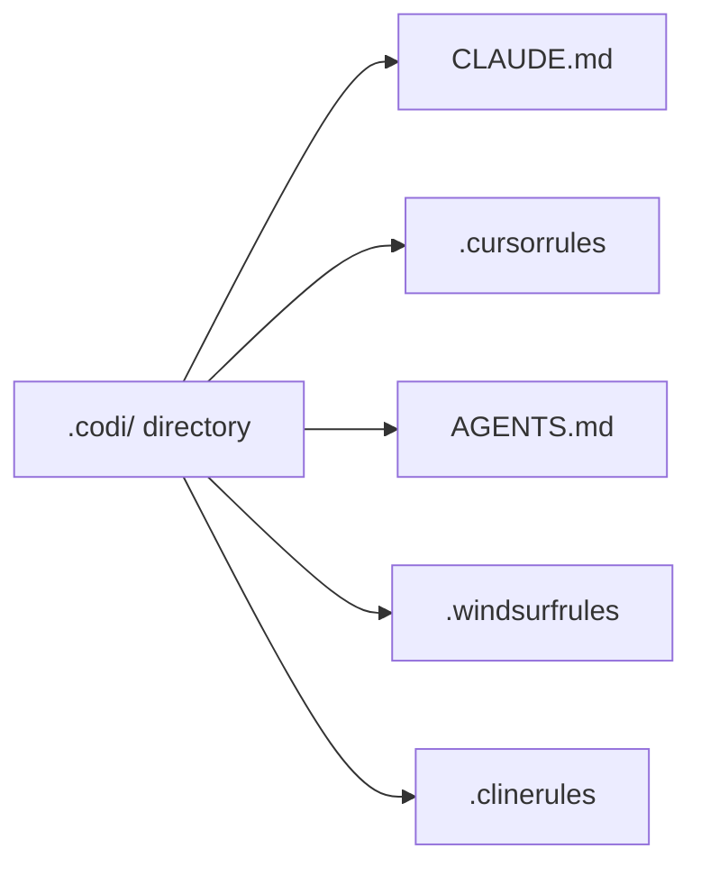
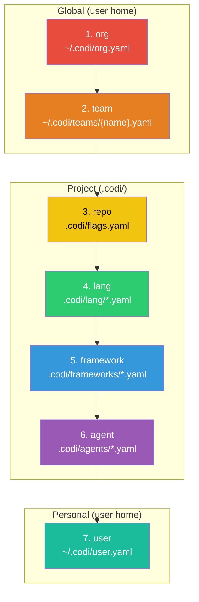
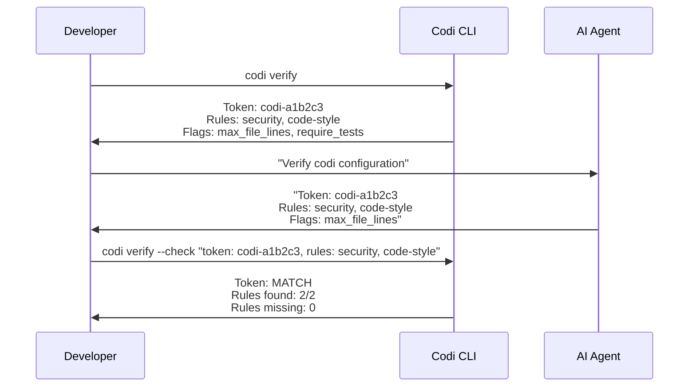

<p align="center">
  
</p>

<p align="center">
  <strong>Unified configuration platform for AI coding agents.</strong>
</p>

[](https://www.npmjs.com/package/codi-cli)
[](./LICENSE)
[](https://github.com/lehidalgo/codi/actions)

## What is Codi?

AI coding agents (Claude Code, Cursor, Codex, Windsurf, Cline) each require their own configuration file with different formats and conventions. When you use multiple agents, you end up maintaining separate config files that inevitably drift apart.

**Codi solves this.** Define your rules, flags, and settings once in a `.codi/` directory, and Codi generates the correct configuration file for each agent.



**One config. Every agent. No drift.**

## Supported Agents

| Agent | Generated File | Config Directory |
|-------|---------------|-----------------|
| Claude Code | `CLAUDE.md` | `.claude/rules/` |
| Cursor | `.cursorrules` | `.cursor/rules/` |
| Codex (OpenAI) | `AGENTS.md` | — |
| Windsurf | `.windsurfrules` | — |
| Cline | `.clinerules` | — |

## Quick Start

### Install

```bash
# As a dev dependency (recommended)
npm install -D codi-cli

# Or globally
npm install -g codi-cli
```

**Requires Node.js >= 20.**

### Initialize

```bash
# Auto-detect agents and tech stack
codi init

# Or specify agents explicitly
codi init --agents claude-code cursor codex
```

Codi auto-detects your tech stack (Node, Python, Go, Rust) and which agents are already configured in your project. It creates the `.codi/` directory with a manifest and default flags.

### Add Rules

```bash
# Add a rule from a built-in template
codi add rule security --template security

# Add a blank rule to write yourself
codi add rule api-guidelines
```

### Generate

```bash
# Generate config files for all detected agents
codi generate

# Preview without writing files
codi generate --dry-run

# Generate for a specific agent only
codi generate --agent claude-code
```

### Verify

```bash
# Show the verification token and prompt
codi verify

# After asking your agent to verify, validate its response
codi verify --check "token: codi-abc123, rules: security, code-style"
```

## CLI Reference

### Commands

| Command | Description | Key Options |
|---------|-------------|-------------|
| `codi init` | Initialize `.codi/` configuration | `--force`, `--agents <ids...>` |
| `codi generate` | Generate agent config files | `--agent <ids...>`, `--dry-run`, `--force` |
| `codi validate` | Validate `.codi/` configuration | — |
| `codi status` | Show drift status of generated files | — |
| `codi add rule <name>` | Add a custom rule | `-t, --template <name>` |
| `codi add skill <name>` | Add a custom skill | `-t, --template <name>` |
| `codi doctor` | Check project health | `--ci` |
| `codi sync` | Sync config to team repo via PR | `--dry-run`, `-m, --message <msg>` |
| `codi verify` | Verify agent loaded configuration | `--check <response>` |

Aliases: `codi gen` = `codi generate`.

### Global Options

Every command accepts these options:

| Option | Description |
|--------|-------------|
| `-j, --json` | Output as JSON (for scripting) |
| `-v, --verbose` | Verbose/debug output |
| `-q, --quiet` | Suppress non-essential output |
| `--no-color` | Disable colored output |

### Command Details

#### `codi init`

Creates the `.codi/` directory structure with:
- `codi.yaml` — project manifest listing detected agents
- `flags.yaml` — all 18 flags with default values
- `rules/generated/common/` and `rules/custom/` — rule directories
- `skills/` — skill directory
- `frameworks/` — framework override directory

**Stack auto-detection** looks for `package.json` (Node), `pyproject.toml` (Python), `go.mod` (Go), `Cargo.toml` (Rust).

**Agent auto-detection** checks for existing config files (`CLAUDE.md`, `.cursorrules`, etc.) in the project root.

After creating the structure, Codi automatically runs generation to produce the initial config files.

#### `codi generate`

Resolves configuration from all 7 layers, then invokes each adapter to produce the output files. Updates `.codi/state.json` with SHA-256 hashes of all generated files for drift detection.

Use `--dry-run` to preview what would be generated without writing any files. Use `--force` to regenerate even if nothing has changed.

#### `codi status`

Compares the current content of generated files against the hashes stored in `.codi/state.json`. Reports each file as:
- **synced** — file matches the last generation
- **drifted** — file was modified after generation
- **missing** — file was deleted after generation

#### `codi doctor`

Runs health checks:
1. **Config validity** — `.codi/` directory parses correctly
2. **Version compatibility** — codi version satisfies `requiredVersion` (if set)
3. **Org config** — `~/.codi/org.yaml` is valid YAML (if exists)
4. **Team config** — referenced team file exists and is valid (if set)
5. **Drift detection** — generated files are up to date

With `--ci`, exits non-zero on any failure — designed for pre-commit hooks and CI pipelines.

#### `codi sync`

Syncs your local `.codi/` rules and skills to a shared team repository via pull request. Requires the `gh` CLI to be installed and authenticated.

Flow: clone team repo → create branch → copy paths → commit → push → create PR.

## Configuration

### Directory Structure

```
.codi/
  codi.yaml                    # Project manifest
  flags.yaml                   # Behavioral flags (18 flags)
  state.json                   # Generation state (auto-managed)
  rules/
    generated/
      common/                  # Auto-generated rules
    custom/                    # Your custom rules (Markdown)
  skills/                      # Your custom skills (Markdown)
  lang/                        # Language-specific flag overrides (*.yaml)
  frameworks/                  # Framework-specific flag overrides (*.yaml)
  agents/                      # Agent-specific flag overrides (*.yaml)
```

### Manifest (`codi.yaml`)

The manifest declares your project name, target agents, and optional settings.

```yaml
name: my-project
version: "1"

# Which agents to generate config for
agents:
  - claude-code
  - cursor
  - codex
  - windsurf
  - cline

# Reference a team config (loaded from ~/.codi/teams/frontend.yaml)
team: frontend

# Pin minimum codi version
codi:
  requiredVersion: ">=0.1.0"

# Team sync configuration
sync:
  repo: "org/team-codi-config"
  branch: main
  paths: [rules, skills]

# Control which content types are included
layers:
  rules: true
  skills: true
  commands: true
  agents: true
  context: true
```

### Flags (`flags.yaml`)

Flags control how AI agents behave in your project. Each flag has a **mode** and a **value**.

```yaml
security_scan:
  mode: enforced
  value: true
  locked: true          # Prevents lower layers from overriding

max_file_lines:
  mode: enabled
  value: 500

type_checking:
  mode: conditional
  value: strict
  conditions:
    lang: [typescript]   # Only apply when language is TypeScript
```

#### All 18 Flags

| Flag | Type | Default | Description |
|------|------|---------|-------------|
| `auto_commit` | boolean | `false` | Automatic commits after changes |
| `test_before_commit` | boolean | `true` | Run tests before commit |
| `security_scan` | boolean | `true` | Mandatory security scanning |
| `type_checking` | enum | `strict` | Type checking level (`strict`, `basic`, `off`) |
| `max_file_lines` | number | `700` | Maximum lines per file |
| `require_tests` | boolean | `false` | Require tests for new code |
| `allow_shell_commands` | boolean | `true` | Allow shell command execution |
| `allow_file_deletion` | boolean | `true` | Allow file deletion |
| `lint_on_save` | boolean | `true` | Lint files on save |
| `allow_force_push` | boolean | `false` | Allow force push to remote |
| `require_pr_review` | boolean | `true` | Require PR review before merge |
| `mcp_allowed_servers` | string[] | `[]` | Whitelist of allowed MCP servers |
| `require_documentation` | boolean | `false` | Require documentation for new code |
| `allowed_languages` | string[] | `["*"]` | Allowed programming languages (`*` = all) |
| `max_context_tokens` | number | `50000` | Maximum context token window |
| `progressive_loading` | enum | `metadata` | Loading strategy (`off`, `metadata`, `full`) |
| `drift_detection` | enum | `warn` | Drift behavior (`off`, `warn`, `error`) |
| `auto_generate_on_change` | boolean | `false` | Auto-regenerate on config change |

Flags are translated into natural-language instructions embedded in each agent's config file. For example, `allow_force_push: false` becomes _"Do NOT use force push (--force) on git operations."_

#### Flag Modes

Each flag supports 6 modes that control how it behaves across the inheritance chain:

| Mode | Behavior | Can Override? |
|------|----------|---------------|
| `enforced` | Always active, non-negotiable | No (stops resolution) |
| `enabled` | Active with specified value | Yes |
| `disabled` | Explicitly turned off | Yes |
| `inherited` | Skip — use parent layer's value | Yes |
| `delegated_to_agent_default` | Use the flag's catalog default | Yes |
| `conditional` | Apply only if conditions match | Yes |

**Conditional mode** requires a `conditions` block with at least one key:

```yaml
require_tests:
  mode: conditional
  value: true
  conditions:
    lang: [typescript, python]     # Match by language
    framework: [react, nextjs]     # Match by framework
    agent: [claude-code]           # Match by agent
    file_pattern: ["src/**/*.ts"]  # Match by file glob
```

All specified conditions must match for the flag to apply.

#### Locking Flags

Flags can be locked at org, team, or repo levels to prevent lower layers from overriding them:

```yaml
# In ~/.codi/org.yaml — nobody can disable security scanning
security_scan:
  mode: enforced
  value: true
  locked: true
```

Attempting to override a locked flag at a lower layer produces a validation error.

### Rules

Rules are Markdown files in `.codi/rules/custom/` with YAML frontmatter:

```markdown
---
name: security
description: Security best practices
priority: high
alwaysApply: true
managed_by: user
---

# Security Rules

- Never expose secrets, API keys, or credentials in code
- Use environment variables for sensitive configuration
- Validate and sanitize all user inputs
- Follow OWASP security guidelines
```

**Frontmatter fields:**

| Field | Type | Required | Description |
|-------|------|----------|-------------|
| `name` | string | Yes | Rule identifier |
| `description` | string | Yes | Brief description |
| `priority` | `high` / `medium` / `low` | No | Importance level |
| `alwaysApply` | boolean | No | Apply in all contexts |
| `managed_by` | `user` / `codi` | No | Who manages this rule |
| `scope` | string[] | No | Glob patterns to restrict scope |
| `language` | string | No | Language-specific rule |

#### Built-in Rule Templates

Create rules from templates with `codi add rule <name> --template <template>`:

| Template | Description |
|----------|-------------|
| `security` | OWASP guidelines, secrets management, input validation |
| `code-style` | Naming conventions, small functions, self-documenting code |
| `testing` | 80% coverage, descriptive names, arrange-act-assert |
| `architecture` | Established patterns, composition over inheritance |

### Skills

Skills define reusable workflows and instructions. They live in `.codi/skills/` as Markdown files:

```markdown
---
name: code-review
description: Code review workflow
type: skill
compatibility: [claude-code, cursor]
tools: []
---

# Code Review

## When to Use
Use this skill when reviewing code changes.

## Instructions
- Check for security vulnerabilities
- Verify error handling coverage
- Ensure consistent naming conventions
- Validate test coverage
```

#### Built-in Skill Templates

Create skills with `codi add skill <name> --template <template>`:

| Template | Description |
|----------|-------------|
| `mcp` | MCP server tool usage guidelines |
| `code-review` | Code review workflow and checklist |
| `documentation` | Documentation generation standards |

## 7-Level Config Inheritance

Codi resolves configuration through 7 layers. Each layer can set, override, or lock flag values. Later layers override earlier ones — unless a flag is locked.



**Resolution direction:** Layer 7 (user) has the highest override priority for non-locked flags. Layers 1-3 (org, team, repo) can lock flags to prevent overrides.

### Layer Descriptions

| # | Layer | Location | Purpose |
|---|-------|----------|---------|
| 1 | **org** | `~/.codi/org.yaml` | Organization-wide security policies |
| 2 | **team** | `~/.codi/teams/{name}.yaml` | Team-specific standards |
| 3 | **repo** | `.codi/flags.yaml` | Project-level configuration |
| 4 | **lang** | `.codi/lang/*.yaml` | Language-specific overrides (e.g., `typescript.yaml`) |
| 5 | **framework** | `.codi/frameworks/*.yaml` | Framework-specific defaults (e.g., `nextjs.yaml`) |
| 6 | **agent** | `.codi/agents/*.yaml` | Agent-specific overrides (e.g., `claude-code.yaml`) |
| 7 | **user** | `~/.codi/user.yaml` | Personal preferences (never committed) |

### Example: Organization Policy Enforcement

```yaml
# ~/.codi/org.yaml — enforced across all projects
flags:
  security_scan:
    mode: enforced
    value: true
    locked: true          # No project can disable this

  allow_force_push:
    mode: enforced
    value: false
    locked: true          # Force push prohibited company-wide
```

```yaml
# ~/.codi/teams/frontend.yaml — team-level overrides
flags:
  max_file_lines:
    mode: enabled
    value: 500            # Stricter than default 700

  allowed_languages:
    mode: enabled
    value: [typescript, javascript, css]
```

```yaml
# .codi/flags.yaml — project-level (can't override locked org flags)
flags:
  require_tests:
    mode: conditional
    value: true
    conditions:
      lang: [typescript]  # Only require tests for TypeScript files
```

```yaml
# ~/.codi/user.yaml — personal preferences (never committed)
flags:
  auto_commit:
    mode: enabled
    value: true           # Personal preference for auto-commit
```

**Resolution result:**
- `security_scan` = `true` (locked at org, cannot be changed)
- `allow_force_push` = `false` (locked at org)
- `max_file_lines` = `500` (team override)
- `require_tests` = `true` for TypeScript, `false` otherwise (conditional at repo)
- `auto_commit` = `true` (user personal preference)

## Verification

Codi generates a deterministic verification token based on your project configuration. This lets you confirm that an AI agent actually loaded and understood your rules.

### How It Works



The token is a SHA-256 hash of your project name, agents, rules, and active flags. If the agent returns the correct token, you know it loaded the full configuration.

### Usage

```bash
# Step 1: See your token and what to ask
codi verify

# Step 2: Ask your agent to verify (paste the prompt codi shows you)

# Step 3: Validate the agent's response
codi verify --check "token: codi-a1b2c3, rules: security, code-style, flags: max_file_lines"
```

## Version Enforcement

Pin a minimum Codi version to keep your team aligned:

```yaml
# codi.yaml
codi:
  requiredVersion: ">=0.1.0"
```

### Doctor Checks

```bash
# Interactive health check
codi doctor

# CI/pre-commit mode — exits non-zero on any failure
codi doctor --ci
```

`codi doctor` runs these checks:
1. Config directory validity
2. Codi version satisfies `requiredVersion`
3. Org config is valid YAML (if exists)
4. Team config exists (if referenced in manifest)
5. Generated files are not stale

When `requiredVersion` is set, `codi init` auto-installs a pre-commit hook that runs `codi doctor --ci`, catching version mismatches before code is pushed.

## Team Sync

Share rules and skills with your team through a shared config repository.

### Setup

```yaml
# codi.yaml
sync:
  repo: "org/team-codi-config"   # GitHub repository
  branch: main                    # Target branch
  paths: [rules, skills]          # What to sync
```

### Usage

```bash
# Preview what would be synced
codi sync --dry-run

# Sync and create a pull request
codi sync

# With a custom PR message
codi sync -m "Add security rules from project-x"
```

**Requires** the [GitHub CLI](https://cli.github.com/) (`gh`) to be installed and authenticated.

### How It Works

1. Clones the team repository
2. Creates a feature branch with timestamp
3. Copies specified paths from local `.codi/` to the repo
4. Commits and pushes the changes
5. Creates a pull request via `gh` CLI
6. Returns the PR URL

Changes are detected via hash comparison — only modified files are synced.

## Development

### Setup

```bash
git clone https://github.com/lehidalgo/codi.git
cd codi
npm install
npm run build
npm test
```

### Scripts

| Script | Description |
|--------|-------------|
| `npm run build` | Build with tsup |
| `npm test` | Run tests (Vitest) |
| `npm run test:watch` | Watch mode |
| `npm run test:coverage` | Coverage report |
| `npm run lint` | Type check (`tsc --noEmit`) |
| `npm run dev` | Build in watch mode |

### Project Structure

```
src/
  cli/              # Command handlers
    init.ts         #   codi init — project scaffolding
    generate.ts     #   codi generate — config file generation
    validate.ts     #   codi validate — config validation
    status.ts       #   codi status — drift detection
    add.ts          #   codi add rule/skill — scaffolding
    verify.ts       #   codi verify — token verification
    doctor.ts       #   codi doctor — health checks
    sync.ts         #   codi sync — team repo sync
    shared.ts       #   Global options and output handling
  adapters/         # Agent-specific output generators
    claude-code.ts  #   CLAUDE.md + .claude/rules/
    cursor.ts       #   .cursorrules + .cursor/rules/
    codex.ts        #   AGENTS.md
    windsurf.ts     #   .windsurfrules
    cline.ts        #   .clinerules
    flag-instructions.ts  # Flag → instruction text conversion
  core/
    config/         # 7-level config resolution engine
    flags/          # 18-flag catalog, resolver, validator
    generator/      # Adapter orchestration
    hooks/          # Pre-commit hook system
    migration/      # Import from existing CLAUDE.md / AGENTS.md
    output/         # Logger, formatter, 23 error codes, exit codes
    scaffolder/     # Rule and skill template system
    sync/           # Git operations and PR creation
    verify/         # Token generation and response validation
    version/        # Semver checking and doctor reports
  schemas/          # Zod validation schemas
  templates/        # Built-in rule, skill, and hook templates
  types/            # TypeScript type definitions
  utils/            # Path resolution, hashing, semver
```

### Tech Stack

| Technology | Purpose |
|------------|---------|
| TypeScript | Strict mode, ESM, full type safety |
| Commander.js | CLI framework |
| Zod | Schema validation |
| Vitest | Test runner (365 tests) |
| tsup | Bundler (ESM, Node 20 target) |
| gray-matter | YAML frontmatter parsing |

### Architecture

- **Result types** — all functions return `Result<T>` (`ok(data)` or `err(errors)`), no thrown exceptions
- **Adapter pattern** — each agent has an independent adapter implementing `detect()` and `generate()`
- **Hash-based state** — SHA-256 hashes track generated file freshness for drift detection
- **Layered resolution** — 7-level config cascade with locking and conditional evaluation
- **23 structured error codes** — every error has a code, severity, and actionable hint

## License

[MIT](./LICENSE)
