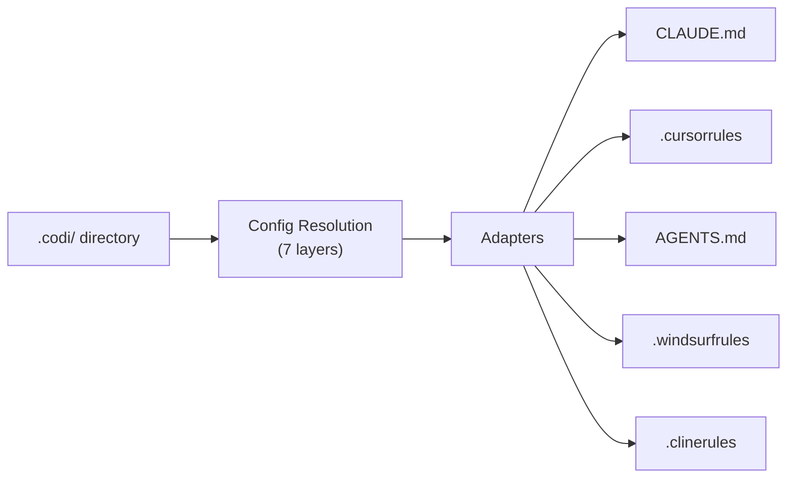

<p align="center">
  
</p>

<p align="center">
  <strong>One config. Every AI agent. Zero drift.</strong>
</p>

<p align="center">
  Define your rules, skills, agents, and flags once — Codi generates the correct configuration for Claude Code, Cursor, Codex, Windsurf, and Cline automatically.
</p>

[](https://www.npmjs.com/package/codi-cli)
[](./LICENSE)
[](https://github.com/lehidalgo/codi/actions)
[]()

---

## What is Codi?

Every AI coding agent uses a different configuration format. Claude Code reads `CLAUDE.md`, Cursor reads `.cursorrules`, Codex reads `AGENTS.md`. When your team uses multiple agents, you end up maintaining duplicate configs that inevitably drift apart.

**Codi eliminates this.** Write your configuration once in `.codi/`, and Codi generates the right file for every agent, every time.

---

## Quick Start

### 1. Install

```bash
npm install -D codi-cli
```

Requires **Node.js >= 20**.

### 2. Initialize

```bash
# Interactive wizard — select agents, preset, and artifacts
codi init

# Or non-interactive
codi init --agents claude-code cursor --preset balanced
```

### 3. Generate

```bash
codi generate
```

Your `CLAUDE.md`, `.cursorrules`, `AGENTS.md`, and other agent files are generated and ready to commit.

### 4. Verify

```bash
# Check everything is in sync
codi status

# Full health check
codi doctor
```

---

## How It Works



Codi reads your `.codi/` directory, resolves configuration through 7 inheritance layers (org, team, preset, repo, language, framework, agent, user), and passes the result through agent-specific adapters that produce each platform's native format.

---

## Core Concepts

| Concept | What it is | Learn more |
|:--------|:-----------|:-----------|
| **Artifacts** | Rules, skills, agents, commands, brands — the building blocks | [Artifacts Guide](docs/artifacts.md) |
| **Presets** | Bundles of flags + artifacts for quick setup | [Presets Guide](docs/presets.md) |
| **Flags** | 18 behavioral switches (file limits, PR review, security scan, etc.) | [Configuration](docs/configuration.md) |
| **Adapters** | Translators that convert config to each agent's format | [Architecture](docs/architecture.md) |

---

## Supported Agents

<!-- GENERATED:START:supported_agents -->
| Agent | Config File | Rules | Skills | Agents | MCP |
|:------|:-----------|:-----:|:------:|:------:|:---:|
| **Claude Code** | `CLAUDE.md` | `.claude/rules` | `.claude/skills` | `.claude/agents` | `.claude/mcp.json` |
| **Cursor** | `.cursorrules` | `.cursor/rules` | `—` | — | `.cursor/mcp.json` |
| **Codex** | `AGENTS.md` | `.` | `.agents/skills` | `.codex/agents` | `.codex/mcp.toml` |
| **Windsurf** | `.windsurfrules` | `.` | `.windsurf/skills` | — | — |
| **Cline** | `.clinerules` | `.cline` | `.cline/skills` | — | — |
<!-- GENERATED:END:supported_agents -->

## Built-in Templates

<!-- GENERATED:START:template_counts_compact -->
| Artifact | Count |
|:---------|:-----:|
| **Rules** | 23 |
| **Skills** | 37 |
| **Agents** | 8 |
| **Commands** | 9 |
<!-- GENERATED:END:template_counts_compact -->

All templates are customizable. Create your own with `codi add rule|skill|agent|command <name>`.

## Presets

<!-- GENERATED:START:preset_table -->
| Preset | Focus | Description |
|:-------|:------|:------------|
| `minimal` | minimal | Permissive — security off, no test requirements, all actions allowed |
| `balanced` | balanced | Recommended — security on, type-checking strict, no force-push |
| `strict` | strict | Enforced — security locked, tests required, delete restricted, no force-push |
| `python-web` | python | Python web development with Django/FastAPI conventions, security, and testing |
| `typescript-fullstack` | typescript | TypeScript fullstack development with React/Next.js, strict typing, and CI best practices |
| `security-hardened` | security | Maximum security enforcement with locked flags, mandatory scans, and restricted operations |
| `codi-development` | codi | Preset for developing the Codi CLI itself — strict TypeScript, anti-hardcoding, safe releases, and full QA tooling |
| `power-user` | workflow | Daily workflow — graph exploration, day tracking, error diagnosis, enhanced commits |
| `data-ml` | data | Data engineering, data science, ML, and AI agent specialists |
<!-- GENERATED:END:preset_table -->

Create, share, and install presets from ZIP, GitHub, or the registry with `codi preset`.

---

## CLI Reference

| Command | Description | Key Options |
|---------|-------------|-------------|
| `codi` | Launch Command Center (interactive wizard) | |
| `codi init` | Initialize `.codi/` configuration | `--force`, `--agents <ids...>`, `--preset <name>` |
| `codi generate` | Generate agent config files | `--agent <ids...>`, `--dry-run`, `--force` |
| `codi validate` | Validate `.codi/` configuration | |
| `codi status` | Show drift status of generated files | `--json` |
| `codi add <type> <name>` | Add a rule, skill, agent, command, or brand | `-t, --template <name>`, `--all` |
| `codi doctor` | Check project health | `--ci` |
| `codi verify` | Verify agent loaded configuration | `--check <response>` |
| `codi update` | Update flags and artifacts to latest | `--rules`, `--skills`, `--agents`, `--from <repo>`, `--dry-run` |
| `codi clean` | Remove generated files | `--all`, `--dry-run`, `--force` |
| `codi compliance` | Full check: doctor + status + verification | `--ci` |
| `codi ci` | Composite CI validation | |
| `codi watch` | Auto-regenerate on file changes | `--once` |
| `codi revert` | Restore from backup | `--list`, `--last`, `--backup <ts>` |
| `codi preset` | Manage presets | `create`, `list`, `install`, `export`, `validate`, `remove`, `edit` |
| `codi marketplace` | Search/install skills from registry | `search <query>`, `install <name>` |
| `codi contribute` | Share artifacts with the community | |
| `codi docs` | Export skill catalog | `--json`, `--html` |
| `codi skill` | Skill management | `export`, `evolve` |

### Global Options

| Option | Description |
|--------|-------------|
| `-j, --json` | Output as JSON (for scripting) |
| `-v, --verbose` | Verbose/debug output |
| `-q, --quiet` | Suppress non-essential output |
| `--no-color` | Disable colored output |

---

## Daily Workflow

```bash
# 1. Edit your rules or skills
vim .codi/rules/custom/security.md

# 2. Regenerate agent configs
codi generate

# 3. Check nothing drifted
codi status

# 4. Commit both config and generated files
git add .codi/ CLAUDE.md .cursorrules AGENTS.md
git commit -m "update codi rules"
```

---

## Git & Version Control

| What | Commit? | Why |
|------|---------|-----|
| `.codi/codi.yaml` | Yes | Project manifest — source of truth |
| `.codi/flags.yaml` | Yes | Flag configuration |
| `.codi/rules/custom/` | Yes | Your rules |
| `.codi/skills/` | Yes | Your skills |
| `.codi/agents/` | Yes | Your agents |
| `.codi/commands/` | Yes | Your commands |
| `.codi/state.json` | Yes | Enables drift detection for your team |
| Generated files | Yes | Agents need these files in the repo |
| `~/.codi/user.yaml` | No | Personal preferences, never committed |
| `~/.codi/org.yaml` | No | Shared via org tooling, not per-repo |

---

## Documentation

| Guide | Description |
|-------|-------------|
| [Documentation Index](docs/README.md) | Full documentation index |
| [Architecture](docs/architecture.md) | Config resolution, adapters, generation pipeline, hooks |
| [Configuration](docs/configuration.md) | Manifest, flags, modes, layers, MCP |
| [Artifacts](docs/artifacts.md) | Rules, skills, agents, commands, brands, templates |
| [Presets](docs/presets.md) | Create, install, export, and manage presets |
| [Workflows](docs/workflows.md) | Import/export, CI/CD, marketplace, contributing |
| [Migration](docs/migration.md) | Adopt Codi in existing projects |
| [Troubleshooting](docs/troubleshooting.md) | Common issues and fixes |
| [Specification](docs/spec/README.md) | 10-chapter formal specification |

---

## FAQ

**Q: I already have a `CLAUDE.md` — will Codi overwrite it?**
Yes. Run `codi init`, then move your rules into `.codi/rules/custom/` as Markdown files with frontmatter and run `codi generate`. Back up your existing files first.

**Q: Do I commit generated files like `CLAUDE.md`?**
Yes. Agents read these files from your repo. Commit both `.codi/` (your config) and generated files (the output).

**Q: Can different team members use different flag values?**
Yes. Personal preferences go in `~/.codi/user.yaml` (never committed). Org-wide policies go in `~/.codi/org.yaml` with `locked: true` to prevent overrides.

**Q: What happens if I edit a generated file manually?**
`codi status` will report it as "drifted". Running `codi generate` will overwrite your manual edit. Edit rules in `.codi/rules/custom/` instead.

**Q: How do I add Codi to a CI pipeline?**
Add `codi doctor --ci` to your CI. It exits non-zero if config is invalid or generated files are stale.

**Q: Can I use Codi with only one agent?**
Yes. Run `codi init --agents claude-code` (or any single agent).

**Q: What's the difference between a rule and a skill?**
Rules are instructions that agents follow (e.g., "never expose secrets"). Skills are reusable workflows that agents can invoke (e.g., "code review checklist"). Both are Markdown files with YAML frontmatter.

**Q: How do I install a preset from GitHub?**
Run `codi preset install github:org/repo`. You can pin a version with `github:org/repo@v1.0` or a branch with `github:org/repo#branch`.

**Q: How do I export my configuration as a ZIP?**
Run `codi preset export my-preset --format zip` to share your setup with others.

---

## Contributing

See [CONTRIBUTING.md](CONTRIBUTING.md) for development setup, code conventions, and how to add new features.

## License

[MIT](./LICENSE)
