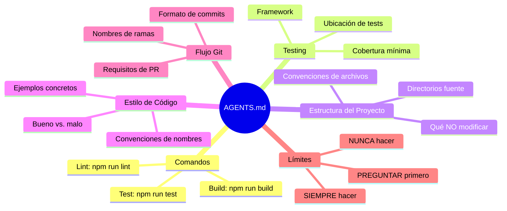
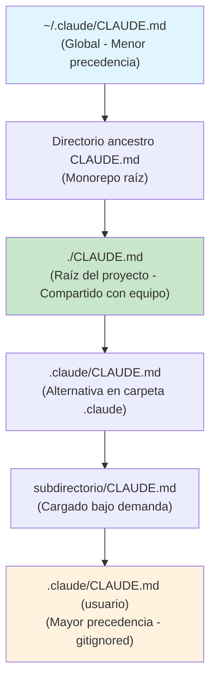
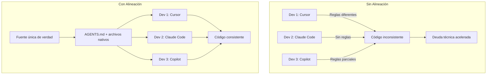
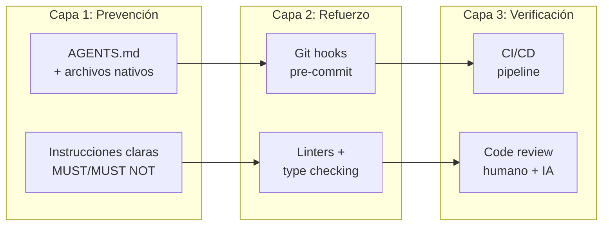
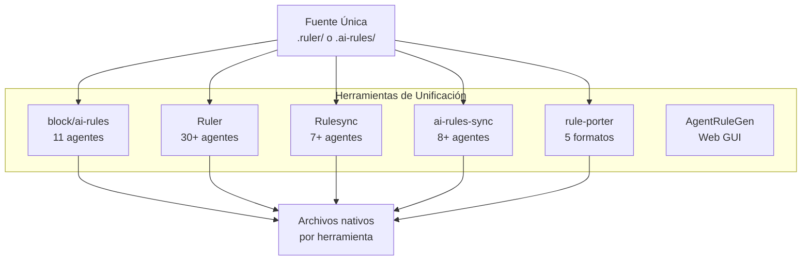
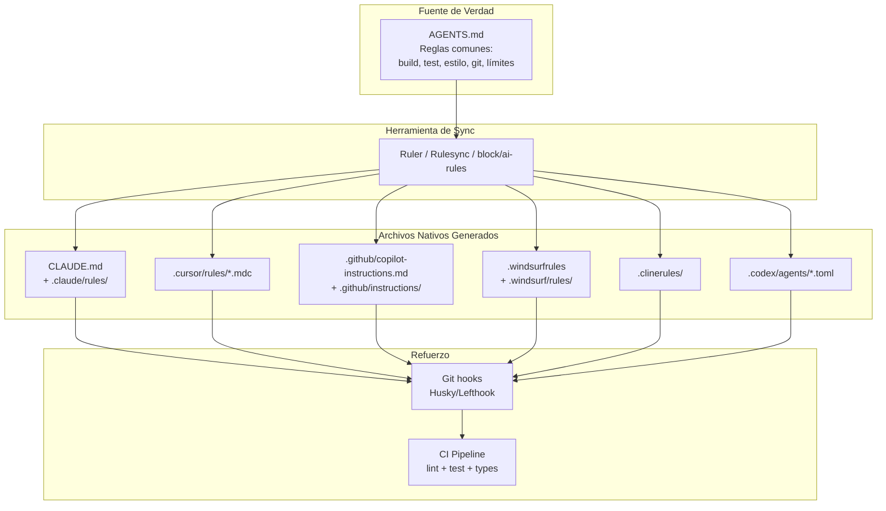
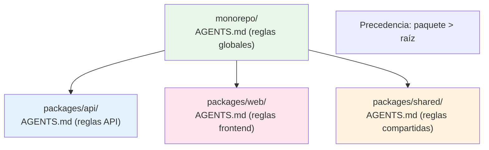
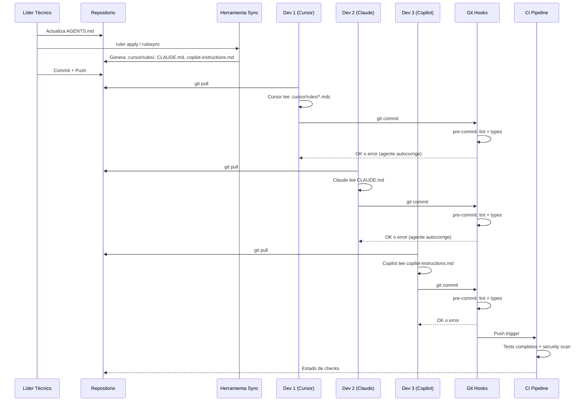

# Alineación de Agentes de Código IA en Equipos de Desarrollo: Mejores Prácticas, Configuraciones y Herramientas

**Fecha**: 2026-03-26 12:00:00
**Documento**: 2026-03-26-120000_research_ai-agent-team-alignment.md

---

## Tabla de Contenidos

1. [Resumen Ejecutivo](#1-resumen-ejecutivo)
2. [El 20% que Aporta el 80% del Valor](#2-el-20-que-aporta-el-80-del-valor)
3. [Análisis por Plataforma](#3-análisis-por-plataforma)
4. [Ejemplos Reales de la Comunidad](#4-ejemplos-reales-de-la-comunidad)
5. [Estrategias de Alineación para Equipos](#5-estrategias-de-alineación-para-equipos)
6. [Herramientas de Unificación](#6-herramientas-de-unificación)
7. [Arquitectura Recomendada](#7-arquitectura-recomendada)
8. [Checklist de Implementación](#8-checklist-de-implementación)
9. [Referencias y Recursos](#9-referencias-y-recursos)

---

## 1. Resumen Ejecutivo

La adopción masiva de agentes de código IA (Claude Code, GitHub Copilot, Cursor, Windsurf, OpenAI Codex CLI, Cline y otros) ha creado un desafío sin precedentes para los equipos de desarrollo: **garantizar que todos los agentes produzcan código consistente, seguro y alineado con los estándares del proyecto**, independientemente de qué herramienta utilice cada desarrollador.

### Hallazgos Clave

1. **AGENTS.md ha emergido como estándar abierto unificado**, codesarrollado por OpenAI, Google, Microsoft, Anthropic y otros bajo la Linux Foundation (AAIF). Más de 60.000 repositorios lo han adoptado a febrero de 2026.

2. **Cada plataforma mantiene su propio formato nativo** (CLAUDE.md, .cursorrules/.mdc, .windsurfrules, .clinerules, copilot-instructions.md), pero AGENTS.md funciona como denominador común.

3. **Han surgido herramientas de sincronización** (Ruler, Rulesync, ai-rules-sync, rule-porter, block/ai-rules) que generan configuraciones para múltiples agentes desde una fuente única de verdad.

4. **Los git hooks son la defensa más efectiva** contra código generado por IA que no cumple estándares. Los agentes como Claude Code leen errores de hooks y autocorrigen.

5. **El marco de madurez L0-L6** (desde ausente hasta adaptativo) permite a los equipos evaluar y planificar la progresión de sus archivos de instrucciones.

6. **La combinación recomendada es: AGENTS.md para reglas compartidas + archivos nativos para optimizaciones por herramienta**, mantenido con herramientas de sincronización y reforzado por git hooks y CI.

---

## 2. El 20% que Aporta el 80% del Valor

Según el análisis de más de 2.500 repositorios realizado por GitHub y la experiencia documentada por la comunidad, estas son las acciones con mayor impacto:

### Las 5 Acciones de Mayor Impacto

| Prioridad | Acción | Impacto |
|-----------|--------|---------|
| 1 | **Crear AGENTS.md con las 6 áreas clave** | Unifica instrucciones para todos los agentes |
| 2 | **Configurar git hooks (pre-commit + commit-msg)** | Refuerzo automático de estándares |
| 3 | **Usar lenguaje RFC 2119 (MUST/MUST NOT)** | Los agentes respetan reglas prescriptivas, ignoran sugerencias |
| 4 | **Incluir comandos ejecutables exactos** | Los agentes necesitan `npm run test -- --coverage`, no "ejecuta tests" |
| 5 | **Definir límites claros (always/ask/never)** | Previene acciones destructivas sin aprobación |

### Las 6 Áreas Clave de AGENTS.md



### Regla de Oro

> "Un fragmento de código real mostrando tu estilo vale más que tres párrafos describiéndolo." — GitHub Blog, Lecciones de 2.500 repositorios

---

## 3. Análisis por Plataforma

### 3.1 CLAUDE.md (Claude Code - Anthropic)

**Archivo**: `CLAUDE.md`
**Ubicaciones soportadas**:



**Características clave**:
- Se carga automáticamente al inicio de cada conversación
- Soporta importaciones con sintaxis `@path/to/file.md`
- Los archivos posteriores tienen mayor precedencia
- El comando `/init` genera un CLAUDE.md inicial basado en el análisis del proyecto
- Soporta `.claude/rules/` con frontmatter para reglas con alcance por ruta

**Marco de madurez L0-L6** (dev.to/cleverhoods):

| Nivel | Nombre | Descripción |
|-------|--------|-------------|
| L0 | Ausente | Sin archivo de instrucciones |
| L1 | Básico | CLAUDE.md existe y está versionado |
| L2 | Delimitado | Restricciones explícitas con MUST/MUST NOT |
| L3 | Estructurado | Múltiples archivos organizados por responsabilidad |
| L4 | Abstraído | Reglas por ruta, cargadas solo cuando son relevantes |
| L5 | Mantenido | L4 + gobernanza activa y revisiones periódicas |
| L6 | Adaptativo | Skills dinámicos, MCP, carga contextual |

**Mejores prácticas para CLAUDE.md**:
- Mantener conciso: "¿Eliminar esta línea causaría que Claude cometa errores? Si no, elimínala"
- Usar restricciones explícitas: `MUST use TypeScript strict mode` en lugar de `Prefer TypeScript`
- Incluir comandos bash comunes con flags exactos
- Separar por responsabilidades en L3+: `@docs/architecture.md`, `@docs/api-conventions.md`
- Para monorepos: CLAUDE.md en raíz + CLAUDE.md por paquete

### 3.2 AGENTS.md (Estándar Abierto - AAIF/Linux Foundation)

**Archivo**: `AGENTS.md`
**Gobernanza**: Agentic AI Foundation (AAIF) bajo la Linux Foundation
**Cocreadores**: OpenAI, Google, Microsoft (GitHub), Anthropic, Sourcegraph, Factory, Cursor

**Herramientas que lo soportan nativamente (60+)**:

| Herramienta | Soporte | Notas |
|-------------|---------|-------|
| GitHub Copilot | Nativo | Requiere `chat.useAgentsMdFile: true` en VS Code |
| OpenAI Codex CLI | Nativo | Creador original del formato |
| Google Jules | Nativo | — |
| Cursor | Nativo | — |
| Windsurf | Nativo | — |
| Devin | Nativo | — |
| Amp (Sourcegraph) | Nativo | — |
| Aider | Nativo | — |
| Goose (Block) | Nativo | — |
| Claude Code | Pendiente | Usa CLAUDE.md; AGENTS.md en consideración |
| Gemini CLI | Nativo | — |

**Orden de descubrimiento en Codex**:
1. `AGENTS.override.md`
2. `AGENTS.md`
3. `TEAM_GUIDE.md`
4. `.agents.md`

**Características**:
- Formato Markdown estándar, sin campos obligatorios
- Soporte jerárquico para monorepos (el archivo más cercano tiene precedencia)
- El nombre DEBE ser en mayúsculas: `AGENTS.md`, no `agents.md`
- Límite recomendado: < 500 líneas para eficiencia de ventana de contexto
- Más de 60.000 proyectos de código abierto lo han adoptado

### 3.3 Cursor (.cursorrules / .cursor/rules/)

**Evolución de formatos**:

| Año | Formato | Estado |
|-----|---------|--------|
| 2023 | `.cursorrules` (archivo único Markdown) | Deprecado (funcional) |
| 2024 | `.cursor/` con `index.mdc` | Transición |
| 2025 | `.cursor/rules/*.mdc` (multi-archivo) | Actual |
| 2026 | Reglas con conciencia contextual + MCP | Planificado |

**Formato MDC (Markdown Components)**:
- Archivos `.mdc` con frontmatter YAML
- Soporta modos de activación: Manual, Siempre Activo, Decisión del Modelo, Auto
- Patrones glob para coincidencia de archivos
- Control de versiones integrado

**Repositorios comunitarios clave**:
- [PatrickJS/awesome-cursorrules](https://github.com/PatrickJS/awesome-cursorrules) — El repositorio principal con reglas para múltiples tecnologías
- [sanjeed5/awesome-cursor-rules-mdc](https://github.com/sanjeed5/awesome-cursor-rules-mdc) — Lista curada de archivos .mdc

**Mejores prácticas**:
- Crear archivos .mdc granulares por responsabilidad (test, lint, API, etc.)
- Usar frontmatter para controlar activación y alcance
- Nombrar carpetas siguiendo el patrón: `tecnología-enfoque-cursorrules-prompt-file`
- Migrar de `.cursorrules` a `.cursor/rules/` para mayor control

### 3.4 GitHub Copilot (copilot-instructions.md)

**Archivos de configuración**:

```
.github/
├── copilot-instructions.md          # Instrucciones para todo el repositorio
└── instructions/
    ├── frontend.instructions.md     # Específico para frontend
    ├── backend.instructions.md      # Específico para backend
    └── testing.instructions.md      # Específico para testing
```

**Niveles de instrucciones** (precedencia de mayor a menor):
1. **Personales** — Configuración del usuario individual
2. **Repositorio** — `.github/copilot-instructions.md`
3. **Organización** — Instrucciones a nivel organizacional
4. **Por ruta** — `*.instructions.md` bajo `.github/instructions/`

**Limitaciones**:
- Copilot code review solo lee los primeros 4.000 caracteres de cada archivo de instrucciones
- Copilot Chat y coding agent no tienen este límite

**Recurso oficial**: [github/awesome-copilot](https://github.com/github/awesome-copilot) — Instrucciones, agentes, skills y configuraciones contribuidas por la comunidad

### 3.5 OpenAI Codex CLI

**Configuración**:
- Archivo principal: `~/.codex/config.toml`
- Instrucciones del proyecto: `AGENTS.md` (nativo)
- Subagentes: `~/.codex/agents/*.toml` (personal) o `.codex/agents/*.toml` (proyecto)

**Parámetros clave en config.toml**:
```toml
project_doc_fallback_filenames = ["TEAM_GUIDE.md", ".agents.md"]
project_doc_max_bytes = 65536

[agents.reviewer]
description = "Code reviewer specialist"
config_file = "agents/reviewer.toml"
```

**Características**:
- Herencia de configuración: CLI flags > config.toml > defaults
- Soporte para subagentes con roles especializados
- Ejecución paralela de subagentes para tareas complejas
- Lectura automática de AGENTS.md antes de cualquier trabajo

### 3.6 Windsurf (.windsurfrules)

**Archivos de configuración**:
- `global_rules.md` — Reglas globales independientes del workspace
- `.windsurfrules` — Reglas locales específicas del workspace
- `.windsurf/rules/` — Directorio de reglas modulares

**Modos de activación**:
1. **Manual** — Se activa por @mención
2. **Siempre Activo** — Se aplica en cada prompt
3. **Decisión del Modelo** — La IA decide si aplica la regla
4. **Auto** — Activación automática basada en contexto

**Directorio oficial**: [windsurf.com/editor/directory](https://windsurf.com/editor/directory) — Reglas de ejemplo curadas por el equipo de Windsurf

**Mejores prácticas**:
- Comenzar con 5-10 reglas esenciales
- Probar en features pequeños antes de aplicar ampliamente
- Involucrar al equipo en la definición y refinamiento de reglas
- Actualizar conforme el proyecto evoluciona

### 3.7 Cline (.clinerules)

**Archivos de configuración**:
- `.clinerules/` — Directorio en la raíz del proyecto (reglas de equipo)
- Directorio global del sistema — Preferencias personales
- Cada regla tiene un toggle para habilitar/deshabilitar

**Características**:
- Reglas granulares por archivo: `debug-logging.md`, `test-generation-jest.md`
- Soporte para Conventional Commits (feat, fix, docs, etc.)
- Toggle individual por regla sin necesidad de eliminar el archivo
- Control de versiones compartido vía `.clinerules/`

**Mejores prácticas**:
- Usar estructura Markdown con títulos y categorías para que Cline entienda el alcance
- Crear reglas granulares para actividades comunes de desarrollo
- Tratar las reglas como documentación viva que evoluciona con el proyecto
- Usar headers para ayudar a Cline a entender el alcance de cada instrucción

### 3.8 MCP (Model Context Protocol) para Equipos

**Archivos de configuración compartida**:

| Archivo | Alcance | Control de versiones |
|---------|---------|---------------------|
| `.mcp.json` (raíz) | Repositorio | Sí (recomendado) |
| `.vscode/mcp.json` | VS Code workspace | Opcional |
| `.cursor/mcp.json` | Cursor workspace | Opcional |
| `.claude/mcp.json` | Claude Code | Sí |

**Configuración en VS Code para AGENTS.md**:
```json
{
  "chat.useAgentsMdFile": true,
  "chat.useNestedAgentsMdFiles": true
}
```

**Modelos de despliegue para equipos**:
1. **Jump Box centralizado** — Servidores MCP en una máquina compartida con SSH, logs de auditoría centralizados y RBAC compartido
2. **Pod por equipo** — Cada equipo obtiene un pod con servidores MCP, políticas de red y cuentas de servicio limitadas
3. **Archivo compartido en repositorio** — `.mcp.json` en la raíz del repo, versionado y compartido

---

## 4. Ejemplos Reales de la Comunidad

### 4.1 Repositorios "Awesome" Curados

| Repositorio | Contenido | Estrellas |
|-------------|-----------|-----------|
| [PatrickJS/awesome-cursorrules](https://github.com/PatrickJS/awesome-cursorrules) | Reglas de Cursor para múltiples frameworks | Referencia principal |
| [rohitg00/awesome-claude-code-toolkit](https://github.com/rohitg00/awesome-claude-code-toolkit) | 135 agentes, 35 skills, 42 comandos, 150+ plugins | Más completo |
| [hesreallyhim/awesome-claude-code](https://github.com/hesreallyhim/awesome-claude-code) | Skills, hooks, slash-commands, orchestrators | Curado selectivamente |
| [shanraisshan/claude-code-best-practice](https://github.com/shanraisshan/claude-code-best-practice) | Patrones de referencia para CLAUDE.md | Mejores prácticas |
| [FlorianBruniaux/claude-code-ultimate-guide](https://github.com/FlorianBruniaux/claude-code-ultimate-guide) | Guía completa de principiante a avanzado | Educativo |
| [github/awesome-copilot](https://github.com/github/awesome-copilot) | Instrucciones, agentes y skills para Copilot | Oficial GitHub |
| [VoltAgent/awesome-agent-skills](https://github.com/VoltAgent/awesome-agent-skills) | 1000+ skills de equipos oficiales y comunidad | Cross-platform |
| [sanjeed5/awesome-cursor-rules-mdc](https://github.com/sanjeed5/awesome-cursor-rules-mdc) | Archivos .mdc curados para Cursor | Formato moderno |
| [agentsmd/agents.md](https://github.com/agentsmd/agents.md) | Especificación oficial de AGENTS.md | Estándar oficial |

### 4.2 Guías y Artículos Destacados

| Recurso | Autor | URL |
|---------|-------|-----|
| "Lecciones de 2.500 repositorios" | GitHub Blog | [github.blog](https://github.blog/ai-and-ml/github-copilot/how-to-write-a-great-agents-md-lessons-from-over-2500-repositories/) |
| "CLAUDE.md Best Practices" | Nick Babich / UX Planet | [uxplanet.org](https://uxplanet.org/claude-md-best-practices-1ef4f861ce7c) |
| "CLAUDE.md de básico a adaptativo" | CleverHoods / DEV | [dev.to](https://dev.to/cleverhoods/claudemd-best-practices-from-basic-to-adaptive-9lm) |
| "12 reglas para equipos AI-ready" | Augment Code | [augmentcode.com](https://www.augmentcode.com/guides/enterprise-coding-standards-12-rules-for-ai-ready-teams) |
| "AGENTS.md Cross-Tool Guide" | SmartScope | [smartscope.blog](https://smartscope.blog/en/generative-ai/github-copilot/github-copilot-agents-md-guide/) |
| "Git hooks vs AI-generated mess" | Jones Russell / DEV | [dev.to](https://dev.to/jonesrussell/git-hooks-are-your-best-defense-against-ai-generated-mess-5h1a) |
| "Coding Guidelines for AI Agents" | JetBrains Blog | [blog.jetbrains.com](https://blog.jetbrains.com/idea/2025/05/coding-guidelines-for-your-ai-agents/) |
| "Using Linters to Direct Agents" | Factory.ai | [factory.ai](https://factory.ai/news/using-linters-to-direct-agents) |
| "One Prompt to Rule Them All" | Yevheniy Potupa / Medium | [medium.com](https://medium.com/@genyklemberg/one-prompt-to-rule-them-all-how-to-reuse-the-same-markdown-instructions-across-copilot-claude-42693df4df00) |
| "Renacimiento de convenciones escritas" | BrokenRobot | [brokenrobot.xyz](https://www.brokenrobot.xyz/blog/the-renaissance-of-written-coding-conventions/) |

### 4.3 Ejemplo de AGENTS.md Efectivo

Basado en las lecciones del análisis de GitHub sobre 2.500 repositorios:

```markdown
# AGENTS.md

## Project Overview
E-commerce API built with Node.js 20, TypeScript 5.4, PostgreSQL 16, Prisma ORM.

## Commands
- Build: `npm run build`
- Test: `npm run test -- --coverage`
- Lint: `npm run lint:fix`
- Type check: `tsc --noEmit`
- Database migrations: `npx prisma migrate dev`

## Project Structure
- `src/` — Application source code
- `src/modules/` — Feature modules (users, orders, products)
- `src/shared/` — Shared utilities and types
- `tests/` — Unit and integration tests
- `prisma/` — Database schema and migrations

## Code Style
- MUST use TypeScript strict mode
- MUST NOT use `any` type
- MUST use functional components with hooks (no class components)
- Naming: camelCase for variables/functions, PascalCase for types/interfaces

### Good Example
```typescript
async function findUserById(id: string): Promise<User | null> {
  return prisma.user.findUnique({ where: { id } });
}
```

### Bad Example
```typescript
async function getUser(id: any): Promise<any> {
  return prisma.user.findUnique({ where: { id } });
}
```

## Testing
- Framework: Vitest
- Coverage minimum: 80%
- Test file pattern: `*.test.ts` alongside source files
- MUST write tests for all new public functions

## Git Workflow
- Branch naming: `feat/`, `fix/`, `chore/`, `docs/`
- Commit format: Conventional Commits (feat:, fix:, chore:, docs:)
- MUST NOT commit directly to main
- All changes require PR review

## Boundaries
### Always Do
- Run `npm run lint:fix` before committing
- Add tests for new functionality
- Update types when modifying APIs

### Ask First
- Database schema changes
- New dependencies
- Changes to CI/CD configuration

### Never Do
- Commit secrets or API keys
- Modify `prisma/migrations/` directly
- Force push to any branch
- Delete or modify existing tests without approval
```

---

## 5. Estrategias de Alineación para Equipos

### 5.1 El Problema Central



### 5.2 Estrategia de Tres Capas



### 5.3 Git Hooks como Defensa Principal

Los git hooks son la defensa más efectiva contra código generado por IA que no cumple estándares. Cuando Claude Code encuentra un fallo en un hook pre-commit, **lee el error, corrige la violación y reintenta el commit automáticamente**.

**Hooks recomendados**:

| Hook | Propósito | Herramienta |
|------|-----------|-------------|
| `pre-commit` | Linting de código | ESLint, Prettier, golangci-lint |
| `pre-commit` | Type checking | `tsc --noEmit` |
| `pre-commit` | Tests rápidos | Tests unitarios contra archivos modificados |
| `commit-msg` | Formato de commits | Conventional Commits (feat:, fix:, etc.) |
| `pre-push` | Tests completos | Suite completa de tests |

**Gestores de hooks recomendados**:
- **Husky** (JavaScript/TypeScript) — El más popular, integrado con npm/pnpm
- **Lefthook** (Multi-lenguaje) — Rápido (Go), configuración YAML
- **pre-commit** (Python, multi-lenguaje) — Estándar de la industria, aislamiento de dependencias

### 5.4 Las 12 Reglas para Equipos AI-Ready (Augment Code)

1. **Convenciones de nombres** — Patrones consistentes en toda la organización
2. **Documentación** — Propósito, parámetros, retorno y ejemplo por cada función/clase
3. **Manejo de errores** — Excepciones específicas y contextuales, no bloques genéricos
4. **Eliminación de estado global** — Sin variables a nivel de módulo
5. **Patrones de seguridad** — Escaneo continuo de vulnerabilidades
6. **Disciplina de control de versiones** — Commits estructurados y convenciones de ramas
7. **Automatización de code review** — Agentes IA para escalar capacidad de revisión
8. **Estándares de rendimiento** — Detección de patrones N+1 y cuellos de botella
9. **Cumplimiento de accesibilidad** — WCAG 2.2 reforzado upstream
10. **Internacionalización** — RTL y reglas de pluralización en plantillas
11. **Headers de archivo** — Metadatos estandarizados de copyright y licencia
12. **Recuperación ante desastres** — Validación rutinaria de backup/restore

### 5.5 Gobernanza Empresarial

Para organizaciones grandes, la estrategia debe incluir:

- **Política de herramientas aprobadas**: Definir qué agentes IA están permitidos (Cursor, Claude Code, Copilot, etc.)
- **Control de acceso basado en roles**: Diferentes capacidades de IA según el rol
- **Human-in-the-loop**: Requisitos de revisión humana para código generado por IA que supere umbrales definidos
- **Reglas de manejo de datos**: Protección de código propietario y propiedad intelectual
- **Política como código**: Reglas de gobernanza dentro de pipelines CI/CD
- **Observabilidad unificada**: Visibilidad del impacto de IA en la calidad del código

---

## 6. Herramientas de Unificación

### 6.1 Comparativa de Herramientas



### 6.2 Detalle por Herramienta

#### block/ai-rules (Block/Square)
- **Repo**: [github.com/block/ai-rules](https://github.com/block/ai-rules)
- **Agentes**: AMP, Claude, Cline, Codex, Copilot, Cursor, Firebender, Gemini, Goose, Kilocode, Roo (11 agentes)
- **Características**: Multi-agent desde fuente única, sync management, generación selectiva, soporte MCP
- **Instalación**: `curl -fsSL https://raw.githubusercontent.com/block/ai-rules/main/scripts/install.sh | bash`

#### Ruler (intellectronica)
- **Repo**: [github.com/intellectronica/ruler](https://github.com/intellectronica/ruler)
- **Agentes**: 30+ (Copilot, Claude, Cursor, Windsurf, Cline, Aider, Zed, Amazon Q, JetBrains, etc.)
- **Características**: Almacenamiento centralizado en `.ruler/`, distribución automática, gestión MCP, backup/revert
- **Uso**: `ruler init` → editar `.ruler/AGENTS.md` → `ruler apply --verbose`
- **Diferenciador**: Soporte más amplio de agentes, reglas anidadas para monorepos

#### Rulesync (dyoshikawa)
- **Repo**: [github.com/dyoshikawa/rulesync](https://github.com/dyoshikawa/rulesync)
- **Agentes**: Claude Code, Codex CLI, Copilot, Cursor, OpenCode, Google Antigravity y más
- **Características**: Reglas, ignore, MCP, comandos, subagentes y skills
- **Web**: [rulesync.dyoshikawa.com](https://rulesync.dyoshikawa.com/)

#### ai-rules-sync (lbb00)
- **Repo**: [github.com/lbb00/ai-rules-sync](https://github.com/lbb00/ai-rules-sync)
- **Agentes**: Cursor, Claude Code, Copilot, OpenCode, Trae AI, Codex, Gemini CLI, Warp
- **Instalación**: `brew tap lbb00/ai-rules-sync && brew install ais`
- **Uso**: `ais cursor add react`, `ais copilot instructions add coding-standards`

#### rule-porter (nedcodes)
- **Repo**: [github.com/nedcodes-ok/rule-porter](https://github.com/nedcodes-ok/rule-porter)
- **Formatos**: Cursor .mdc ↔ CLAUDE.md ↔ AGENTS.md ↔ Copilot ↔ Windsurf
- **Uso**: `npx rule-porter --to agents-md`, `npx rule-porter --to claude-md`
- **Diferenciador**: Conversión bidireccional, cero dependencias, manejo inteligente de frontmatter/globs

#### AgentRuleGen (Web)
- **Web**: [agentrulegen.com](https://www.agentrulegen.com/)
- **Características**: Interfaz web para generar reglas, 1000+ reglas preconstruidas, soporte para múltiples stacks
- **Diferenciador**: No requiere CLI, ideal para comenzar rápido

### 6.3 Tabla Comparativa

| Herramienta | Agentes | Instalación | Reglas | MCP | Skills | Bidireccional |
|-------------|---------|-------------|--------|-----|--------|---------------|
| block/ai-rules | 11 | Shell script | Sí | Sí | No | No |
| Ruler | 30+ | npm | Sí | Sí | Sí | Sí (revert) |
| Rulesync | 7+ | npm | Sí | Sí | Sí | Sí |
| ai-rules-sync | 8+ | Homebrew | Sí | No | Sí | Sí (import/export) |
| rule-porter | 5 | npx | Sí | No | No | Sí |
| AgentRuleGen | 4+ | Web | Sí | No | No | No |

---

## 7. Arquitectura Recomendada

### 7.1 Enfoque: Base Compartida + Overrides por Herramienta (Recomendado)



### 7.2 Estructura de Directorios Recomendada

```
proyecto/
├── AGENTS.md                          # Fuente de verdad compartida
├── .claude/
│   ├── CLAUDE.md                      # Generado + overrides Claude
│   ├── rules/
│   │   ├── api-rules.md              # Reglas para src/api/**
│   │   ├── frontend-rules.md         # Reglas para src/components/**
│   │   └── test-rules.md             # Reglas para tests/**
│   └── mcp.json                       # Configuración MCP
├── .cursor/
│   └── rules/
│       ├── general.mdc               # Generado desde AGENTS.md
│       └── react-components.mdc      # Override específico Cursor
├── .github/
│   ├── copilot-instructions.md       # Generado desde AGENTS.md
│   └── instructions/
│       ├── frontend.instructions.md
│       └── backend.instructions.md
├── .windsurfrules                     # Generado desde AGENTS.md
├── .clinerules/
│   └── coding-standards.md           # Generado desde AGENTS.md
├── .codex/
│   └── agents/
│       └── reviewer.toml             # Subagente de revisión
├── .vscode/
│   ├── mcp.json                      # MCP compartido para equipo
│   └── settings.json                 # chat.useAgentsMdFile: true
├── .mcp.json                         # MCP a nivel de repo (versionado)
├── .husky/
│   ├── pre-commit                    # Lint + types + tests rápidos
│   └── commit-msg                    # Conventional Commits
├── .ruler/                            # Si se usa Ruler
│   ├── AGENTS.md                     # Fuente de verdad
│   └── ruler.toml                    # Configuración de generación
└── .gitignore                         # Excluir archivos personales
```

### 7.3 Estrategia para Monorepos



**Principio**: Las reglas del directorio raíz establecen estándares organizacionales. Las reglas de cada paquete agregan contexto específico solo cuando el agente trabaja en ese paquete, ahorrando tokens.

### 7.4 Flujo de Trabajo del Equipo



---

## 8. Checklist de Implementación

### Fase 1: Fundación (Semana 1)

- [ ] Crear `AGENTS.md` en la raíz del proyecto con las 6 áreas clave
- [ ] Incluir comandos ejecutables exactos (build, test, lint, type-check)
- [ ] Definir estilo de código con ejemplos concretos (bueno vs. malo)
- [ ] Establecer límites claros con tres niveles (siempre/preguntar/nunca)
- [ ] Usar lenguaje prescriptivo RFC 2119 (MUST, MUST NOT, SHOULD)
- [ ] Mantener AGENTS.md por debajo de 500 líneas

### Fase 2: Refuerzo (Semana 2)

- [ ] Configurar git hooks con Husky o Lefthook
- [ ] Hook pre-commit: ESLint/Prettier + `tsc --noEmit`
- [ ] Hook commit-msg: Validar Conventional Commits
- [ ] Configurar CI pipeline con lint, tests y type-check
- [ ] Verificar que los agentes IA autocorrigen tras fallos de hooks

### Fase 3: Multi-Herramienta (Semana 3)

- [ ] Evaluar qué herramientas usa el equipo (Cursor, Claude, Copilot, etc.)
- [ ] Elegir herramienta de sincronización (Ruler, Rulesync, block/ai-rules)
- [ ] Generar archivos nativos desde AGENTS.md
- [ ] Agregar overrides específicos por herramienta donde sea necesario
- [ ] Configurar MCP compartido si aplica (`.mcp.json` o `.vscode/mcp.json`)
- [ ] Actualizar `.gitignore` para excluir archivos personales

### Fase 4: Escalado (Semana 4+)

- [ ] Para monorepos: crear AGENTS.md por paquete/módulo
- [ ] Implementar reglas con alcance por ruta (`.claude/rules/`, `.cursor/rules/`)
- [ ] Definir subagentes especializados para tareas comunes
- [ ] Configurar instrucciones a nivel de organización (GitHub Copilot)
- [ ] Documentar el proceso de actualización de reglas

### Fase 5: Gobernanza Continua (Ongoing)

- [ ] Revisar y actualizar AGENTS.md mensualmente
- [ ] Rastrear métricas de calidad de código generado por IA
- [ ] Iterar reglas basándose en errores comunes del agente
- [ ] Compartir mejores prácticas dentro del equipo
- [ ] Evaluar nivel de madurez (L0-L6) y planificar progresión
- [ ] Auditar que archivos nativos estén sincronizados con AGENTS.md

---

## 9. Referencias y Recursos

### Especificaciones y Documentación Oficial

- [AGENTS.md — Especificación oficial](https://agents.md/)
- [AGENTS.md — Repositorio GitHub](https://github.com/agentsmd/agents.md)
- [Claude Code — Mejores prácticas](https://code.claude.com/docs/en/best-practices)
- [Claude — Usando archivos CLAUDE.md](https://claude.com/blog/using-claude-md-files)
- [Cursor — Documentación de reglas](https://docs.cursor.com/context/rules)
- [GitHub Copilot — Instrucciones personalizadas](https://docs.github.com/en/copilot/how-tos/configure-custom-instructions)
- [GitHub Copilot — Instrucciones de organización](https://docs.github.com/en/copilot/how-tos/configure-custom-instructions/add-organization-instructions)
- [OpenAI Codex — AGENTS.md](https://developers.openai.com/codex/guides/agents-md)
- [OpenAI Codex — Configuración avanzada](https://developers.openai.com/codex/config-advanced)
- [Cline — Documentación de reglas](https://docs.cline.bot/customization/cline-rules)
- [Windsurf — Directorio de reglas](https://windsurf.com/editor/directory)
- [VS Code — Servidores MCP](https://code.visualstudio.com/docs/copilot/customization/mcp-servers)

### Herramientas de Unificación

- [block/ai-rules](https://github.com/block/ai-rules) — Gestión de reglas multi-agente (Block/Square)
- [Ruler](https://github.com/intellectronica/ruler) — Reglas unificadas para 30+ agentes
- [Rulesync](https://github.com/dyoshikawa/rulesync) — CLI de sincronización de reglas
- [ai-rules-sync](https://github.com/lbb00/ai-rules-sync) — Sincronización de reglas para 8+ agentes
- [rule-porter](https://github.com/nedcodes-ok/rule-porter) — Conversión bidireccional entre formatos
- [AgentRuleGen](https://www.agentrulegen.com/) — Generador web de reglas para agentes
- [SyncAI](https://github.com/nxnom/syncai) — Sincronización de reglas de agentes IA

### Repositorios Comunitarios

- [awesome-cursorrules](https://github.com/PatrickJS/awesome-cursorrules) — Reglas curadas para Cursor
- [awesome-cursor-rules-mdc](https://github.com/sanjeed5/awesome-cursor-rules-mdc) — Reglas .mdc para Cursor
- [awesome-claude-code](https://github.com/hesreallyhim/awesome-claude-code) — Skills, hooks y plugins para Claude Code
- [awesome-claude-code-toolkit](https://github.com/rohitg00/awesome-claude-code-toolkit) — Toolkit completo para Claude Code
- [awesome-copilot](https://github.com/github/awesome-copilot) — Customizaciones para GitHub Copilot (oficial)
- [awesome-agent-skills](https://github.com/VoltAgent/awesome-agent-skills) — 1000+ skills cross-platform
- [claude-code-best-practice](https://github.com/shanraisshan/claude-code-best-practice) — Mejores prácticas de CLAUDE.md
- [claude-code-ultimate-guide](https://github.com/FlorianBruniaux/claude-code-ultimate-guide) — Guía completa
- [claude-code-showcase](https://github.com/ChrisWiles/claude-code-showcase) — Ejemplo de configuración completa

### Artículos y Guías

- [GitHub Blog: Lecciones de 2.500 repositorios](https://github.blog/ai-and-ml/github-copilot/how-to-write-a-great-agents-md-lessons-from-over-2500-repositories/)
- [UX Planet: CLAUDE.md Best Practices](https://uxplanet.org/claude-md-best-practices-1ef4f861ce7c)
- [DEV.to: CLAUDE.md de básico a adaptativo](https://dev.to/cleverhoods/claudemd-best-practices-from-basic-to-adaptive-9lm)
- [Augment Code: 12 reglas para equipos AI-ready](https://www.augmentcode.com/guides/enterprise-coding-standards-12-rules-for-ai-ready-teams)
- [SmartScope: Guía unificada AGENTS.md](https://smartscope.blog/en/generative-ai/github-copilot/github-copilot-agents-md-guide/)
- [DEV.to: Git hooks vs código IA](https://dev.to/jonesrussell/git-hooks-are-your-best-defense-against-ai-generated-mess-5h1a)
- [JetBrains: Coding Guidelines for AI Agents](https://blog.jetbrains.com/idea/2025/05/coding-guidelines-for-your-ai-agents/)
- [Factory.ai: Linters para dirigir agentes](https://factory.ai/news/using-linters-to-direct-agents)
- [HumanLayer: Writing a good CLAUDE.md](https://www.humanlayer.dev/blog/writing-a-good-claude-md)
- [SFEIR Institute: Claude Code Best Practices](https://institute.sfeir.com/en/claude-code/claude-code-resources/best-practices/)
- [BrokenRobot: Renacimiento de convenciones escritas](https://www.brokenrobot.xyz/blog/the-renaissance-of-written-coding-conventions/)
- [Medium: Estándar unificado AGENTS.md](https://addozhang.medium.com/agents-md-a-new-standard-for-unified-coding-agent-instructions-0635fc5cb759)
- [DeployHQ: Todos los archivos de configuración IA explicados](https://www.deployhq.com/blog/ai-coding-config-files-guide)
- [AICourses: Sincronizar setup IA entre Cursor, Claude y Copilot](https://aicourses.com/ai-for-developers/sync-ai-coding-setup-cursor-claude-code-copilot/)
- [Liam ERD: Lint enforcement con Lefthook y Claude Code](https://liambx.com/blog/ai-agent-lint-enforcement-lefthook-claude-code)
- [Medium: Reglas, comandos, skills y agentes — Guía definitiva 2026](https://medium.com/jin-system-architect/rules-commands-skills-and-agents-the-definitive-guide-to-structuring-your-ai-coding-workflow-in-db7818359ea5)
- [InfoQ: AGENTS.md como estándar abierto](https://www.infoq.com/news/2025/08/agents-md/)
- [Cursor Forum: Migración de .cursorrules a .mdc](https://forum.cursor.com/t/my-best-practices-for-mdc-rules-and-troubleshooting/50526)
- [Block Engineering Blog: 3 principios para diseñar Agent Skills](https://engineering.block.xyz/blog/3-principles-for-designing-agent-skills)

### Directivas de Notas de Devalias

- [Notas exhaustivas sobre archivos de reglas/instrucciones de agentes IA](https://gist.github.com/0xdevalias/f40bc5a6f84c4c5ad862e314894b2fa6) — Recopilación comprensiva de todos los formatos existentes

---

*Investigación realizada el 26 de marzo de 2026. Las URLs y datos reflejan el estado del ecosistema a esa fecha.*
