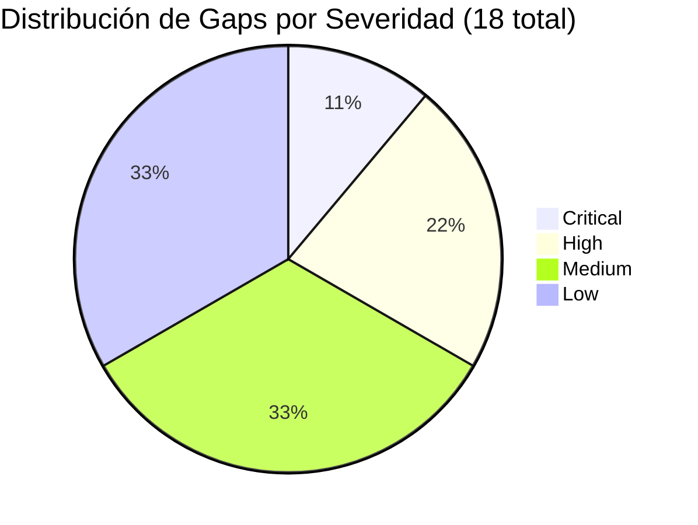
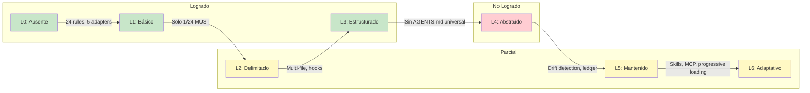
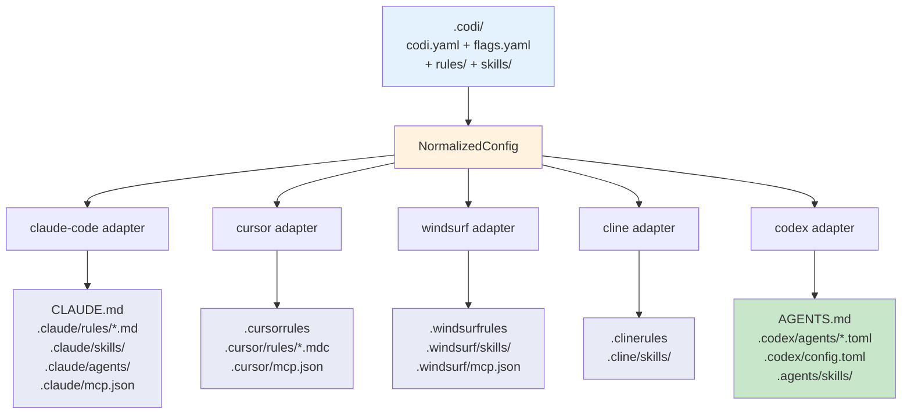
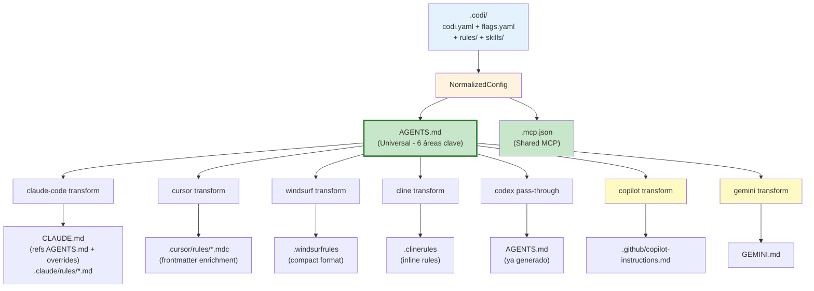
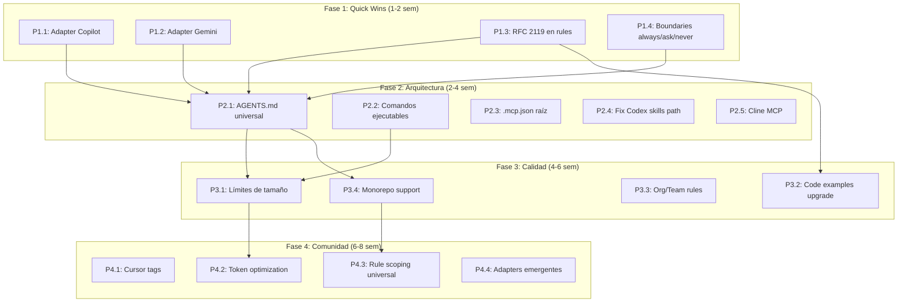
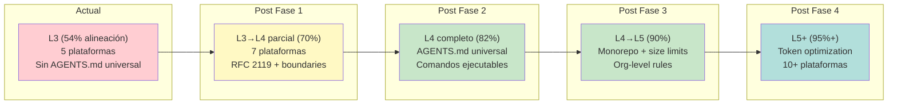

# Auditoría de Alineación: Codi vs Mejores Prácticas de la Comunidad

**Fecha**: 2026-03-26 12:00
**Documento**: 2026-03-26_AUDIT_codi-community-alignment.md
**Categoría**: AUDIT

---

## 1. Resumen Ejecutivo

Esta auditoría evalúa qué tan alineadas están las configuraciones, presets y artefactos que genera Codi con las mejores prácticas identificadas en la investigación de la comunidad ([ver reporte de investigación](./2026-03-26-120000_research_ai-agent-team-alignment.md)).

### Score de Alineación por Categoría

| Categoría | Score | Estado |
|-----------|-------|--------|
| Cobertura de plataformas | 5/7 (71%) | Faltan Copilot y Gemini CLI |
| AGENTS.md como estándar universal | 1/5 (20%) | Solo Codex lo genera; no es fuente de verdad |
| Calidad del contenido generado | 3/7 (43%) | Falta RFC 2119, boundaries, comandos ejecutables |
| Arquitectura de sincronización | 3/5 (60%) | Generación independiente, no transform-from-source |
| Funcionalidades avanzadas | 4/7 (57%) | Drift detection y skills avanzados; falta monorepo |
| Alineación con comunidad | 4/6 (67%) | Buenos formatos nativos; falta `.mcp.json` compartido |
| **Score Global** | **20/37 (54%)** | **Nivel L3 con gaps importantes en L4** |

### Distribución de Gaps



---

## 2. Matriz de Gaps

### 2.1 Critical (2)

| ID | Gap | Archivo Afectado | Evidencia | Impacto |
|----|-----|-------------------|-----------|---------|
| GAP-01 | No existe adapter para GitHub Copilot | `src/adapters/` (falta `github-copilot.ts`) | GitHub Copilot es la plataforma de IA de código más desplegada del mundo. La investigación lo documenta como plataforma tier-1 con soporte nativo de AGENTS.md | Equipos que usan Copilot no pueden beneficiarse de Codi |
| GAP-02 | No se genera AGENTS.md como fuente de verdad universal | `src/core/generator/generator.ts` | Solo el adapter Codex genera AGENTS.md (`src/adapters/codex.ts:93`). Los otros 4 adapters generan contenido independiente. La investigación muestra que AGENTS.md es el estándar abierto con 60K+ repos y gobernanza de la Linux Foundation | Los artefactos generados son independientes entre sí; no hay documento canónico compartido |

### 2.2 High (4)

| ID | Gap | Archivo Afectado | Evidencia | Impacto |
|----|-----|-------------------|-----------|---------|
| GAP-03 | Rules no usan lenguaje RFC 2119 (MUST/MUST NOT) | `src/templates/rules/*.ts` (24 archivos) | Grep en los 24 templates muestra **solo 1 uso** de "MUST" (`documentation.ts:40`). Los templates usan "Never", "Always", "Do not" en su lugar. La investigación demuestra que los agentes IA respetan reglas prescriptivas RFC 2119 significativamente mejor que sugerencias en lenguaje natural | Los agentes pueden ignorar reglas críticas expresadas como sugerencias |
| GAP-04 | No existen boundaries estructurados (always/ask/never) | `src/adapters/flag-instructions.ts` | Las instrucciones de flags generan líneas planas ("Do NOT delete files", "Do NOT use force push") sin categorización en tres niveles. El adapter Codex usa "FORBIDDEN"/"REQUIRES APPROVAL" (`codex.ts:168-191`) pero solo para su config TOML, no universalmente | Los agentes no tienen claridad sobre qué acciones requieren aprobación vs cuáles están prohibidas |
| GAP-05 | No se incluyen comandos ejecutables del proyecto | `src/adapters/section-builder.ts:43-57, 79-107` | `buildCommandsTable()` genera tabla de `/commands` de Codi (skills), no comandos del proyecto. `buildDevelopmentNotes()` dice "Run tests before committing" sin especificar el comando real. Los comandos reales existen en el hook registry pero no se surfacean | Los agentes reciben instrucciones vagas en lugar de comandos copy-paste como `npm run test -- --coverage` |
| GAP-06 | No existe adapter para Gemini CLI | `src/adapters/` (falta `gemini.ts`) | Gemini CLI lee `GEMINI.md` en la raíz del proyecto. Google Gemini CLI es una plataforma en crecimiento con soporte nativo de AGENTS.md | Equipos que usan Gemini CLI no pueden beneficiarse de Codi |

### 2.3 Medium (6)

| ID | Gap | Archivo Afectado | Evidencia | Impacto |
|----|-----|-------------------|-----------|---------|
| GAP-07 | Cline adapter sin soporte MCP | `src/adapters/cline.ts:38-39` | `mcp: false` y `mcpConfig: null` en el adapter. Sin embargo, Cline sí soporta MCP vía `.cline/mcp_settings.json` | Proyectos con MCP no propagan config a Cline |
| GAP-08 | Codex usa path no estándar `.agents/skills/` | `src/adapters/codex.ts:39,59` | Skills en `.agents/skills/` en lugar de `.codex/skills/`. El `detect()` busca `.agents` en vez de `.codex` | Confusión de directorios; diverge del patrón `.{tool}/` |
| GAP-09 | No se genera `.mcp.json` compartido en raíz | `src/core/generator/generator.ts` | Cada adapter genera su propio `./\{agent\}/mcp.json`. La comunidad recomienda `.mcp.json` en raíz como config MCP compartida | Duplicación de config MCP entre adapters |
| GAP-10 | No hay soporte para monorepos jerárquicos | `src/core/generator/generator.ts` | No existe generación de AGENTS.md por paquete/workspace. La investigación documenta precedencia `paquete > raíz` como best practice | Monorepos no pueden tener reglas específicas por paquete |
| GAP-11 | Sin control de tamaño en archivos generados | `src/constants.ts`, adapters de single-file | `MAX_CONTEXT_LINES = 300` y `MAX_SKILL_LINES = 500` definidos pero no enforced durante generación. Windsurf y Cline inlinean todo en un archivo | Archivos pueden exceder 500 líneas, degradando el contexto del agente |
| GAP-12 | Archivos nativos no referencian AGENTS.md | Todos los adapters | Cada archivo generado es self-contained. La práctica recomendada es que `CLAUDE.md` inicie con "See AGENTS.md for project standards" | Duplicación de contenido; sin documento canónico referenciable |

### 2.4 Low (6)

| ID | Gap | Archivo Afectado | Evidencia | Impacto |
|----|-----|-------------------|-----------|---------|
| GAP-13 | Cursor `.mdc` sin campo `tags` en frontmatter | `src/adapters/cursor.ts:27-36` | `buildMdcFrontmatter` genera `description`, `alwaysApply`, `globs` pero no `tags` | Pierda de agrupación semántica en Cursor |
| GAP-14 | Ejemplos BAD/GOOD como texto plano | `src/templates/rules/*.ts` | `BAD: \`const API_KEY = "sk-abc123..."\`` sin fenced code blocks con anotación de lenguaje | Menor legibilidad para agentes y humanos |
| GAP-15 | Org/Team layer solo exporta flags | `src/core/config/resolver.ts:89-103` | Las capas org y team extraen solo flags, no rules, skills ni agents | Organizaciones no pueden compartir reglas comunes |
| GAP-16 | No existen adapters para Aider, Goose, JetBrains AI | `src/adapters/` | Plataformas emergentes sin adapter. Aider usa `.aider.conf.yml`, Goose usa `.goosehints`, JetBrains usa `.jb-ai-instructions.md` | Cobertura parcial de plataformas emergentes |
| GAP-17 | Rule scoping solo implementado para Cursor | `src/adapters/cursor.ts` | El tipo `NormalizedRule` tiene `scope: string[]` opcional pero solo Cursor lo usa para `globs:` en `.mdc`. Los 24 templates tienen `alwaysApply: true` | Rules no pueden limitarse a paths específicos en otros adapters |
| GAP-18 | Sin optimización de token budget | Todos los adapters | No se calcula el conteo de tokens del contenido generado ni se advierte al acercarse a los límites de contexto por adapter (32K Cursor/Windsurf, 200K Claude/Cline/Codex) | Posible overflow de contexto sin advertencia |

---

## 3. Evaluación de Madurez (L0-L6)

### Marco de Referencia

| Nivel | Nombre | Descripción |
|-------|--------|-------------|
| L0 | Ausente | Sin archivo de instrucciones para agentes |
| L1 | Básico | Archivo de instrucciones existe y está versionado |
| L2 | Delimitado | Restricciones explícitas con MUST/MUST NOT |
| L3 | Estructurado | Múltiples archivos organizados por responsabilidad |
| L4 | Abstraído | Reglas por ruta, carga contextual, AGENTS.md universal |
| L5 | Mantenido | L4 + gobernanza activa, métricas, auditoría |
| L6 | Adaptativo | Skills dinámicos, MCP, feedback loops de IA |

### Evaluación de Codi



**Resultado: L3 (Structured) con capacidades parciales de L5 y L6**

| Nivel | Criterio | Estado | Evidencia |
|-------|----------|--------|-----------|
| L0 | Archivos de instrucciones existen | Logrado | 5 adapters generan archivos para cada plataforma |
| L1 | Archivos versionados en git | Logrado | Todos los archivos generados se commitean al repo |
| L2 | Restricciones con MUST/MUST NOT | **Parcial** | Solo 1/24 templates usa RFC 2119. Flags usan "Do NOT" |
| L3 | Multi-archivo por responsabilidad | Logrado | Rules en archivos separados, skills con progressive loading, agents independientes |
| L4 | AGENTS.md universal + reglas por ruta | **No logrado** | Sin AGENTS.md universal. Scoping solo en Cursor |
| L5 | Gobernanza + métricas + auditoría | **Parcial** | Drift detection, verification tokens, operations ledger (avanzado). Pero sin métricas de compliance |
| L6 | Skills dinámicos + MCP + adaptativo | **Parcial** | Skills con 3 modos de loading, MCP config en 4/5 adapters. Pero sin feedback loops de IA |

### Fortalezas vs Comunidad (Codi está adelante en)

| Capacidad | Codi | Ruler | block/ai-rules | Rulesync |
|-----------|------|-------|----------------|----------|
| Config resolution niveles | 7 | 2 | 1 | 2 |
| Progressive loading skills | 3 modos | No | No | No |
| Drift detection | Hash-based | Backup/revert | No | No |
| Operations ledger | JSON audit | No | No | No |
| Rule templates | 24 (3 tiers) | Manual | Manual | Manual |
| Hook system | 12 lenguajes | No | No | No |
| Verification tokens | Sí | No | No | No |

---

## 4. Arquitectura Actual vs Ideal

### 4.1 Arquitectura Actual



**Problema**: Cada adapter genera contenido independiente. No existe AGENTS.md como documento canónico compartido.

### 4.2 Arquitectura Ideal



**Beneficio**: AGENTS.md es la fuente de verdad. Los archivos nativos referencian y transforman ese contenido.

---

## 5. Análisis Detallado del Contenido Generado

### 5.1 Secciones Generadas vs Recomendadas

| Sección Recomendada (Investigación) | Estado en Codi | Archivo Fuente | Notas |
|--------------------------------------|----------------|----------------|-------|
| **Project Overview** | Generado | `section-builder.ts:4-20` | Nombre, team, descripción, link a Codi |
| **Commands** (ejecutables del proyecto) | **No generado** | `section-builder.ts:43-57` | Genera tabla de /commands de Codi, no `npm run test` |
| **Project Structure** (directorios) | **No generado** | N/A | No existe sección de estructura de directorios |
| **Code Style** (con ejemplos good/bad) | Generado (parcial) | `src/templates/rules/code-style.ts` | Buenos ejemplos pero sin RFC 2119 y sin code fences |
| **Testing** (framework, cobertura) | Generado (parcial) | `src/templates/rules/testing.ts` | Framework y patterns, pero sin comando ejecutable |
| **Git Workflow** (branches, commits) | Generado | `src/templates/rules/git-workflow.ts` | Conventional commits, branch naming |
| **Boundaries** (always/ask/never) | **No generado** | `flag-instructions.ts` | Lista plana de restricciones sin categorización |
| **Development Notes** | Generado | `section-builder.ts:79-107` | Bullets derivados de flags |
| **Workflow Guidelines** | Generado | `section-builder.ts:110-128` | Understand/Search/Propose + checklist |

### 5.2 Lenguaje Usado en Rules vs Recomendado

| Patrón Actual | Frecuencia | Recomendado RFC 2119 |
|---------------|------------|----------------------|
| "Never hardcode..." | 12 usos | "MUST NOT hardcode..." |
| "Always validate..." | 8 usos | "MUST validate..." |
| "Do not..." / "Do NOT..." | 15 usos | "MUST NOT..." |
| "Prefer..." | 6 usos | "SHOULD..." |
| "Avoid..." | 4 usos | "SHOULD NOT..." |
| "Use..." (imperativo) | 20+ usos | "MUST use..." |
| **"MUST" (RFC 2119)** | **1 uso** | **Debería ser dominante** |

### 5.3 Ejemplo Concreto: Security Rule Actual vs Ideal

**Actual** (`src/templates/rules/security.ts:12-13`):
```
- Never hardcode secrets, API keys, tokens, or credentials in source code
```

**Ideal** (RFC 2119 + fenced code block):
```
- MUST NOT hardcode secrets, API keys, tokens, or credentials in source code

```typescript
// BAD
const API_KEY = "sk-abc123...";

// GOOD
const API_KEY = process.env.API_KEY;
`` `
```

---

## 6. Roadmap Priorizado

### Fase 1: Quick Wins (1-2 semanas)

Objetivo: Cerrar gaps Critical y High de bajo esfuerzo para alcanzar L4.

| Tarea | Gap | Esfuerzo | Archivos a Modificar |
|-------|-----|----------|----------------------|
| Agregar adapter GitHub Copilot | GAP-01 | Bajo | Crear `src/adapters/github-copilot.ts`, modificar `src/adapters/index.ts` |
| Agregar adapter Gemini CLI | GAP-06 | Bajo | Crear `src/adapters/gemini.ts`, modificar `src/adapters/index.ts` |
| Aplicar RFC 2119 a los 24 rule templates | GAP-03 | Medio | Modificar `src/templates/rules/*.ts` (24 archivos) |
| Reestructurar flags como boundaries always/ask/never | GAP-04 | Medio | Modificar `src/adapters/flag-instructions.ts`, `section-builder.ts` |

### Fase 2: Cambio Arquitectónico (2-4 semanas)

Objetivo: AGENTS.md como fuente de verdad universal.

| Tarea | Gap | Esfuerzo | Archivos a Modificar |
|-------|-----|----------|----------------------|
| Generar AGENTS.md universal para todos los proyectos | GAP-02, GAP-12 | Alto | Modificar `src/core/generator/generator.ts`, crear generador AGENTS.md |
| Surfacear comandos ejecutables del proyecto | GAP-05 | Medio | Modificar `section-builder.ts`, posiblemente `codi.yaml` schema |
| Generar `.mcp.json` compartido en raíz | GAP-09 | Bajo | Modificar `src/core/generator/generator.ts` |
| Corregir Codex skills path a `.codex/skills/` | GAP-08 | Bajo | Modificar `src/adapters/codex.ts:39,59` |
| Agregar soporte MCP a Cline | GAP-07 | Bajo | Modificar `src/adapters/cline.ts:38-39` |

### Fase 3: Calidad de Contenido (4-6 semanas)

Objetivo: Pulir contenido generado y optimizar para contexto de agentes.

| Tarea | Gap | Esfuerzo | Archivos a Modificar |
|-------|-----|----------|----------------------|
| Enforcer límites de tamaño en archivos generados | GAP-11 | Medio | Modificar adapters de single-file (windsurf, cline) |
| Upgrade code examples a fenced code blocks | GAP-14 | Medio | Modificar `src/templates/rules/*.ts` (24 archivos) |
| Expandir Org/Team layer para soportar rules | GAP-15 | Medio | Modificar `src/core/config/resolver.ts:89-103` |
| Agregar soporte monorepo jerárquico | GAP-10 | Alto | Modificar generator, manifest schema, adapters |

### Fase 4: Alineación Comunitaria (6-8 semanas)

Objetivo: Features L5/L6 y cobertura de plataformas emergentes.

| Tarea | Gap | Esfuerzo | Archivos a Modificar |
|-------|-----|----------|----------------------|
| Agregar campo `tags` a Cursor `.mdc` | GAP-13 | Bajo | Modificar `src/adapters/cursor.ts:27-36` |
| Implementar token budget optimization | GAP-18 | Medio | Crear utility, integrar en adapters |
| Rule scoping para todos los adapters | GAP-17 | Medio | Modificar adapters que no lo soportan |
| Adapters Aider/Goose/JetBrains | GAP-16 | Medio | Crear 3 nuevos adapters |

### Diagrama de Dependencias entre Fases



---

## 7. Impacto Esperado por Fase



---

## 8. Referencias

- **Investigación completa**: [2026-03-26-120000_research_ai-agent-team-alignment.md](./2026-03-26-120000_research_ai-agent-team-alignment.md)
- **AGENTS.md Spec**: [agents.md](https://agents.md/)
- **GitHub: Lecciones de 2500 repos**: [github.blog](https://github.blog/ai-and-ml/github-copilot/how-to-write-a-great-agents-md-lessons-from-over-2500-repositories/)
- **Madurez L0-L6**: [dev.to/cleverhoods](https://dev.to/cleverhoods/claudemd-best-practices-from-basic-to-adaptive-9lm)
- **12 reglas AI-ready**: [augmentcode.com](https://www.augmentcode.com/guides/enterprise-coding-standards-12-rules-for-ai-ready-teams)
- **block/ai-rules**: [github.com/block/ai-rules](https://github.com/block/ai-rules)
- **Ruler**: [github.com/intellectronica/ruler](https://github.com/intellectronica/ruler)

---

## Apéndice: Archivos Clave del Codebase

| Archivo | Propósito | Líneas |
|---------|-----------|--------|
| `src/adapters/claude-code.ts` | Adapter Claude Code | ~200 |
| `src/adapters/cursor.ts` | Adapter Cursor | ~150 |
| `src/adapters/windsurf.ts` | Adapter Windsurf | ~120 |
| `src/adapters/cline.ts` | Adapter Cline | ~120 |
| `src/adapters/codex.ts` | Adapter Codex (genera AGENTS.md) | ~200 |
| `src/adapters/section-builder.ts` | Secciones compartidas entre adapters | 140 |
| `src/adapters/flag-instructions.ts` | Traduce flags a instrucciones | 57 |
| `src/core/generator/generator.ts` | Orquesta generación multi-adapter | ~100 |
| `src/core/config/state.ts` | State management + drift detection | 142 |
| `src/core/hooks/hook-installer.ts` | Instalación de git hooks | ~150 |
| `src/templates/rules/*.ts` | 24 templates de reglas (3 tiers) | ~50 c/u |
| `src/constants.ts` | Constantes globales | ~50 |
