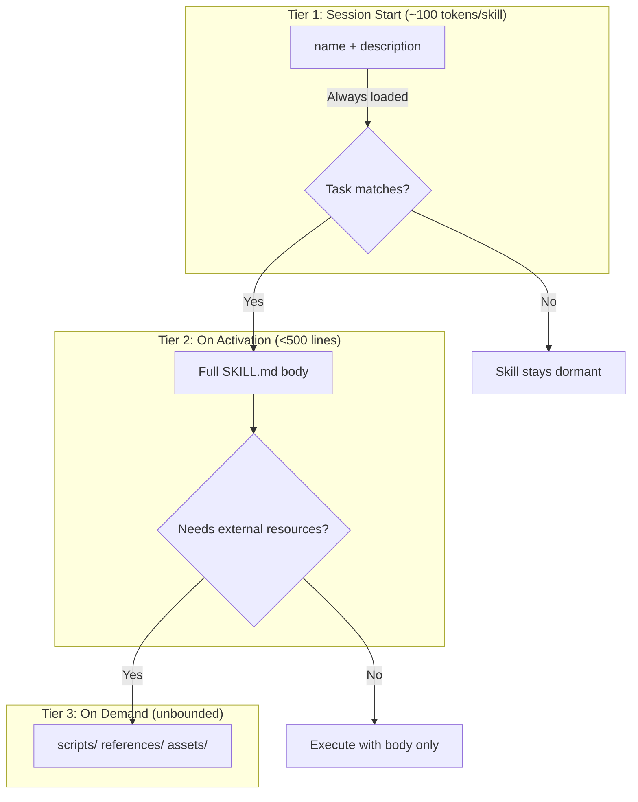
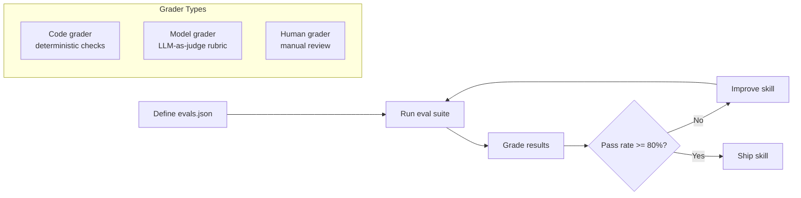
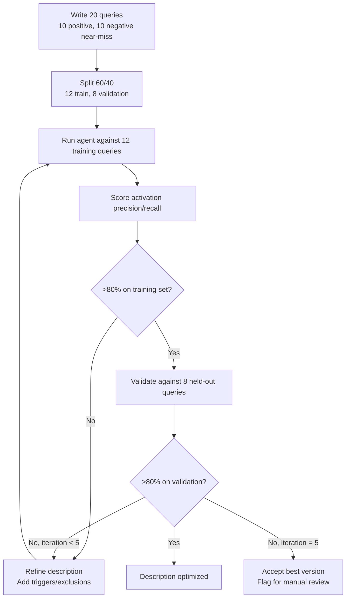
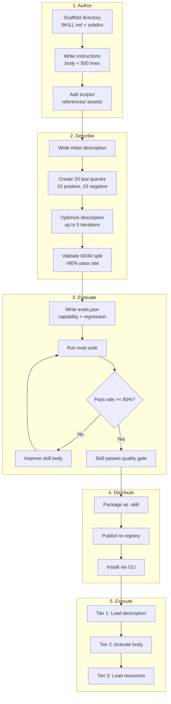
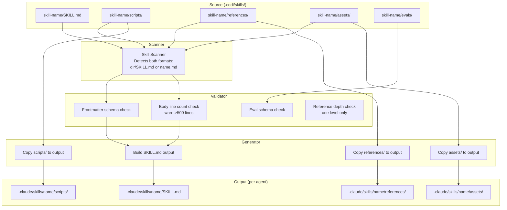
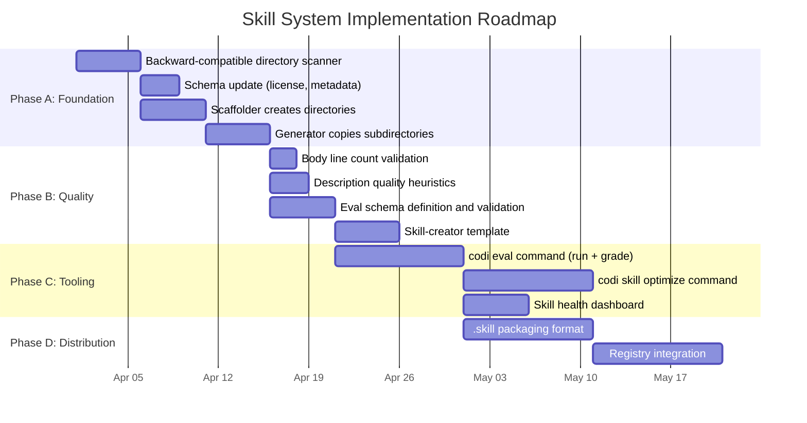

# Skills System Analysis and Architecture Design
**Date**: 2026-03-25 22:00
**Document**: 20260325_2200_RESEARCH_skills-system-analysis.md
**Category**: RESEARCH

---

## 1. Executive Summary

Codi currently implements a minimal skill system: single SKILL.md files generated from `.codi/skills/<name>.md` source files, each containing YAML frontmatter (`name`, `description`, `compatibility`, `tools`, `managed_by`) and a Markdown body. The generator (`skill-generator.ts`) produces one `SKILL.md` per skill into each agent's skill directory (e.g., `.claude/skills/<name>/SKILL.md`, `.cursor/skills/<name>/SKILL.md`).

The Claude Code / agentskills.io specification supports a substantially richer system: multi-file skill directories with `scripts/`, `references/`, `assets/`, and `evals/` subdirectories; progressive three-tier loading; description-optimized triggering with eval-driven iteration; and a `.skill` packaging format for distribution.

This document analyzes the full specification, identifies every gap between codi's current implementation and the target spec, and proposes a concrete architecture for bridging those gaps.

**Key conclusion**: Skills are instruction-RAG -- on-demand knowledge loading for agents. The description field acts as a retrieval trigger (~100 tokens per skill at session startup). The body is the retrieved document. Resources (`scripts/`, `references/`) are lazy-loaded sub-documents. This framing explains every design decision in the spec: minimize startup cost, maximize precision when activated, and iterate quality through evals.

---

## 2. Analysis of Claude Skills System

### 2.1 Skill Directory Structure

A fully-specified skill is not a single file but a directory:

```
.claude/skills/
└── create-component/
    ├── SKILL.md              # Required: frontmatter + instructions
    ├── evals/                # Optional: evaluation suite
    │   ├── evals.json        # Test definitions (positive + negative)
    │   └── graders/          # Custom grading scripts
    ├── scripts/              # Optional: executable helpers
    │   ├── scaffold.sh       # Reusable shell scripts
    │   └── validate.py       # Validation scripts
    ├── references/           # Optional: documentation loaded on demand
    │   ├── api-spec.md       # API specifications
    │   └── conventions.md    # Team conventions
    └── assets/               # Optional: templates, static files
        ├── component.tsx.template
        └── test.tsx.template
```

Each subdirectory serves a distinct purpose in the progressive loading model:

| Directory | Loaded | Purpose |
|-----------|--------|---------|
| `SKILL.md` (frontmatter) | Session start | Trigger matching (~100 tokens) |
| `SKILL.md` (body) | On activation | Full instructions (<500 lines) |
| `scripts/` | On demand | Executable code the agent runs |
| `references/` | On demand | Documentation the agent reads |
| `assets/` | On demand | Templates and static files |
| `evals/` | Development time | Quality validation, never loaded by agent |

### 2.2 SKILL.md Frontmatter

The frontmatter is the skill's metadata contract. The agentskills.io spec and Claude Code support these fields:

```yaml
---
name: create-component
description: >
  Create a React component following project conventions.
  Use when asked to build UI components, widgets, or pages.
  Do NOT use for utility functions, hooks, or non-visual modules.
license: MIT
compatibility: Requires Node.js 18+. Works with Claude Code, Cursor.
disable-model-invocation: false
argument-hint: "<component-name> [--variant=default|card|modal]"
allowed-tools:
  - Read
  - Write
  - Bash
  - Glob
metadata:
  author: team-name
  version: "1.2.0"
  generatedBy: "codi-0.5.1"
---
```

Key fields:

- **`name`**: kebab-case identifier, max 64 characters. Must match directory name.
- **`description`**: The trigger. Max 1024 characters. This is what the agent sees at session start to decide whether to activate the skill. Must be specific, "pushy," and include both positive triggers ("Use when...") and negative exclusions ("Do NOT use for...").
- **`license`**: SPDX identifier for distribution.
- **`compatibility`**: Human-readable prerequisites and platform support.
- **`disable-model-invocation`**: If `true`, the skill is only activated via slash command, never by model inference.
- **`argument-hint`**: Shown to the user when they type `/skill-name` to indicate expected arguments.
- **`allowed-tools`**: Restricts which tools the agent may use when executing this skill.
- **`metadata`**: Author, version, and generation provenance.

### 2.3 Progressive Loading (Three-Tier Model)

Progressive loading is the core architectural insight. It solves the fundamental tension: agents need access to many skills, but context windows are finite.



**Tier 1 -- Metadata (~100 tokens per skill)**:
At session start, the agent receives only `name` and `description` for every installed skill. With 20 skills, this costs ~2,000 tokens -- negligible. This is the "index" the agent uses for retrieval.

**Tier 2 -- Body (<500 lines)**:
When the agent determines a task matches a skill's description, it loads the full SKILL.md body. This contains step-by-step instructions, decision trees, output formats, and inline examples. The 500-line soft limit exists because beyond that, instructions lose focus and the agent's adherence degrades.

**Tier 3 -- Resources (on demand)**:
The body references files in `scripts/`, `references/`, and `assets/` by relative path. The agent loads these only when it reaches the step that needs them. This keeps activation cost low while allowing arbitrarily deep knowledge.

### 2.4 Triggering: The Description Field

The description is the single most critical field in a skill. It determines whether the skill activates (true positive), stays silent (true negative), fires incorrectly (false positive), or misses a relevant task (false negative).

**Good descriptions are "pushy" and specific:**

```yaml
# GOOD: specific triggers + explicit exclusions
description: >
  Create a React component following project conventions.
  Use when asked to build UI components, widgets, pages, or visual elements.
  Do NOT use for utility functions, hooks, API clients, or non-visual modules.

# BAD: vague, no exclusions
description: Helps with React development

# BAD: too broad, will false-positive on everything
description: Use for any coding task involving the frontend
```

**Description optimization protocol** (from the agentskills.io spec):

1. Write 20 test queries: 10 that SHOULD trigger the skill, 10 near-miss queries that should NOT
2. Split 60/40: 12 queries for training (iterate the description), 8 for validation
3. Run the agent with the current description against the 12 training queries
4. Score: does the agent activate the skill when it should, and stay silent when it should not?
5. Refine the description based on failures
6. Repeat up to 5 iterations
7. Validate against the held-out 8 queries
8. Target: >80% precision and recall

### 2.5 Eval Loop

Skills are code. Like code, they need tests. The eval system provides this:

```
evals/
├── evals.json          # Test case definitions
└── graders/
    └── check-output.sh # Custom grading scripts
```

**`evals.json` structure:**

```json
{
  "skill": "create-component",
  "version": "1.2.0",
  "cases": [
    {
      "id": "basic-component",
      "type": "capability",
      "prompt": "Create a Button component with primary and secondary variants",
      "grader": "code",
      "checks": [
        { "type": "file_exists", "path": "src/components/Button.tsx" },
        { "type": "file_contains", "path": "src/components/Button.tsx", "pattern": "export.*Button" },
        { "type": "command", "run": "npx tsc --noEmit", "expect": "exit_0" }
      ],
      "split": "train"
    },
    {
      "id": "negative-hook-request",
      "type": "negative",
      "prompt": "Create a useAuth hook for authentication",
      "grader": "model",
      "rubric": "The skill should NOT activate. The agent should handle this without the create-component skill.",
      "split": "validation"
    }
  ],
  "thresholds": {
    "pass_at_1": 0.7,
    "pass_at_3": 0.9
  }
}
```

**Eval lifecycle:**



**Grader types:**

| Grader | Determinism | Best for |
|--------|-------------|----------|
| Code | Deterministic | File existence, pattern matching, test passes, build succeeds |
| Model | Probabilistic | Open-ended quality, style adherence, architectural decisions |
| Human | Manual | Security-sensitive changes, subjective quality |

### 2.6 Description Optimization Protocol

The description optimization is a systematic process distinct from the eval loop. While evals test whether the skill produces correct output, description optimization tests whether the skill activates at the right time.



The 60/40 split prevents overfitting: a description could score perfectly on training queries by being overly specific, but fail on validation queries because it missed the general pattern.

### 2.7 Packaging: The `.skill` Format

For distribution, skills are packaged as `.skill` files (ZIP archives with a specific structure):

```
my-skill.skill
├── SKILL.md
├── manifest.json       # Package metadata
├── scripts/
├── references/
├── assets/
└── evals/
```

**`manifest.json`:**

```json
{
  "name": "create-component",
  "version": "1.2.0",
  "description": "...",
  "author": "team-name",
  "license": "MIT",
  "compatibility": ["claude-code", "cursor"],
  "dependencies": [],
  "checksum": "sha256:abc123..."
}
```

### 2.8 Complete Skill Lifecycle



---

## 3. Key Design Principles

### 3.1 Why This Works for LLMs: Progressive Disclosure Reduces Context Waste

LLMs have finite context windows. Every token loaded at session start is a token unavailable for the actual task. The three-tier model exploits a key insight: **most skills are irrelevant to any given task**.

With 20 installed skills:
- **Naive approach** (load everything): 20 skills x ~300 lines x ~4 tokens/line = ~24,000 tokens wasted at startup
- **Progressive approach** (load descriptions only): 20 skills x ~100 tokens = ~2,000 tokens at startup, plus ~1,200 tokens for the one skill that activates

This is a 10x reduction in startup context cost. The savings compound: with 50 skills, naive loading becomes untenable (~60,000 tokens), while progressive loading remains ~5,000 tokens.

### 3.2 The Description-as-Trigger Pattern

The description field is functionally a retrieval query in an instruction-RAG system:

1. The agent's task prompt is the "query"
2. Skill descriptions are the "document index"
3. The agent performs the retrieval (matching task to description)
4. The matched skill's body is the "retrieved document"

This explains why the description must be:
- **Specific**: vague descriptions cause false positives (retrieving irrelevant documents)
- **Pushy**: passive descriptions cause false negatives (missing relevant documents)
- **Bounded**: explicit exclusions prevent retrieval bleeding across similar skills

The ~100 token budget per description is not arbitrary -- it is the practical limit where the agent can still perform accurate matching without the index itself consuming significant context.

### 3.3 Eval-Driven Development: Skills Are Code

Skills are instructions that produce behavior. Like code, they can:
- Have bugs (wrong instructions lead to wrong output)
- Regress (a change to step 3 breaks step 7)
- Be tested (define expected output, run, compare)

The eval system treats skills as code artifacts with a test suite. The `evals.json` file is the skill's `test.spec.ts`. The graders are the assertions. The pass rate is the coverage metric.

This is not optional. Without evals, skill quality is measured by vibes. With evals, quality is measured by pass rates, and degradation is caught before deployment.

### 3.4 The Bundling Pattern: Scripts Prevent Reinvention

The `scripts/` directory solves a specific problem: agents reinvent helper code on every invocation.

Without bundled scripts, a skill that needs to scan a directory structure will prompt the agent to write a scanning script from scratch each time. This is:
- **Wasteful**: consumes context tokens for code generation
- **Inconsistent**: the agent writes slightly different code each time
- **Error-prone**: novel code has novel bugs

With bundled scripts, the skill says "run `scripts/scan.sh`" and the agent executes a tested, deterministic helper. The agent's job reduces from "write and run a scanner" to "run the scanner and interpret results."

Example from the `rules-distill` skill in everything-claude-code:

```
rules-distill/
├── SKILL.md
└── scripts/
    ├── scan-skills.sh    # Deterministic skill inventory
    └── scan-rules.sh     # Deterministic rules index
```

The SKILL.md body says "run `bash scripts/scan-skills.sh`" rather than "write a bash script that finds all SKILL.md files and extracts their frontmatter." The deterministic collection is handled by scripts; the LLM handles judgment on the collected data.

### 3.5 One Level Deep References

The spec enforces a deliberate constraint: references load one level deep only. A SKILL.md can reference `references/api-spec.md`, but `api-spec.md` cannot reference another file that triggers another load.

This prevents:
- **Chain loading**: A -> B -> C -> D consumes unbounded context
- **Circular references**: A -> B -> A creates infinite loops
- **Unpredictable cost**: the agent cannot reason about total context cost if references can chain

One level deep means the skill author can predict exactly how much context their skill will consume: body + sum of referenced files.

---

## 4. Gaps vs. Codi's Current Implementation

### 4.1 Source-Side Gaps (`.codi/skills/`)

| Feature | Codi Current | Full Spec | Gap |
|---------|-------------|-----------|-----|
| **Source format** | Single `.md` file per skill | Directory with subdirectories | Codi stores `skill-name.md`, not `skill-name/SKILL.md` + children |
| **Scripts directory** | Not supported | `scripts/` with executable helpers | No mechanism to bundle scripts |
| **References directory** | Not supported | `references/` for on-demand docs | No mechanism to bundle references |
| **Assets directory** | Not supported | `assets/` for templates/static files | No mechanism to bundle assets |
| **Evals directory** | Not supported | `evals/evals.json` with graders | No eval system |
| **Eval runner** | Not supported | Run -> grade -> improve loop | No CLI command for evals |
| **Description optimization** | Manual | 20-query protocol, 60/40 split, 5 iterations | No tooling for description testing |

### 4.2 Schema Gaps

| Feature | Codi Current | Full Spec | Gap |
|---------|-------------|-----------|-----|
| **`license`** | Not in schema | SPDX string | Missing from `SkillFrontmatterSchema` |
| **`metadata`** | Not in schema | `author`, `version`, `generatedBy` | Missing from `SkillFrontmatterSchema` |
| **`disable-model-invocation`** | In schema (`disableModelInvocation`) | In schema | Supported |
| **`argument-hint`** | In schema (`argumentHint`) | In schema | Supported |
| **`allowed-tools`** | In schema (`allowedTools`) | In schema | Supported |
| **`compatibility`** | Array of strings | Free-text string (max 500 chars) | Type mismatch -- codi uses array, spec uses string |

### 4.3 Generator Gaps

| Feature | Codi Current | Full Spec | Gap |
|---------|-------------|-----------|-----|
| **Output structure** | `<agent>/skills/<name>/SKILL.md` | Same | Matched |
| **Progressive loading** | Not implemented (flag deferred) | Three-tier model | E7.5 is deferred |
| **Body size validation** | No warning | Warn on >500 lines | No validation |
| **Script copying** | Not supported | Copy `scripts/` to output | Generator ignores subdirectories |
| **Reference copying** | Not supported | Copy `references/` to output | Generator ignores subdirectories |
| **Asset copying** | Not supported | Copy `assets/` to output | Generator ignores subdirectories |
| **Frontmatter fields** | `name`, `description`, `disable-model-invocation`, `argument-hint`, `allowed-tools` | All above + `license`, `metadata`, `compatibility` | Missing fields in output |

### 4.4 Scaffolder Gaps

| Feature | Codi Current | Full Spec | Gap |
|---------|-------------|-----------|-----|
| **Scaffold output** | Single file: `.codi/skills/<name>.md` | Directory: `.codi/skills/<name>/SKILL.md` + subdirs | Flat file vs. directory |
| **Evals scaffold** | Not created | `evals/evals.json` with example cases | Missing |
| **Scripts scaffold** | Not created | Empty `scripts/` directory | Missing |
| **References scaffold** | Not created | Empty `references/` directory | Missing |
| **Assets scaffold** | Not created | Empty `assets/` directory | Missing |

### 4.5 Tooling Gaps

| Feature | Codi Current | Full Spec | Gap |
|---------|-------------|-----------|-----|
| **`codi eval`** | Not implemented | Run eval suite against a skill | No CLI command |
| **`codi skill optimize`** | Not implemented | Description optimization protocol | No CLI command |
| **`codi skill package`** | Not implemented | Package as `.skill` file | No CLI command |
| **Skill health dashboard** | Not implemented | Success rates, failure clustering | No analytics |
| **Skill-creator skill** | Not available | Meta-skill that teaches the process | Not in template library |

### 4.6 Summary

**Total gaps identified: 25**

- Source structure: 5 gaps
- Schema: 2 gaps (plus 1 type mismatch)
- Generator: 5 gaps
- Scaffolder: 5 gaps
- Tooling: 5 gaps
- Validation: 3 gaps

---

## 5. Proposed Architecture Improvements

### 5.1 Skill Directory Structure

Migrate from flat files to directories in `.codi/skills/`:

**Current:**
```
.codi/skills/
├── my-skill.md
├── another-skill.md
└── third-skill.md
```

**Proposed:**
```
.codi/skills/
├── my-skill/
│   ├── SKILL.md              # Instructions (body < 500 lines)
│   ├── evals/
│   │   └── evals.json        # Test cases
│   ├── scripts/
│   │   └── helper.sh         # Bundled executables
│   ├── references/
│   │   └── api-docs.md       # On-demand documentation
│   └── assets/
│       └── template.tsx      # Static templates
├── another-skill/
│   └── SKILL.md              # Minimal skill (no subdirs needed)
└── third-skill.md            # BACKWARD COMPAT: single file still works
```

**Backward compatibility**: The scanner should detect both formats. A bare `<name>.md` file is treated as a skill with no subdirectories. A `<name>/SKILL.md` directory is treated as a full skill. This allows gradual migration.

### 5.2 Architecture Overview



### 5.3 The Skill-Creator Skill

A meta-skill that teaches the 8-step skill creation process. This should be available as a built-in template (`codi add skill skill-creator --template skill-creator`):

**8-Step Lifecycle:**

1. **Identify**: What task does this skill automate? What is the trigger?
2. **Scaffold**: `codi add skill <name>` creates the directory structure
3. **Write body**: Instructions in SKILL.md, <500 lines, imperative mood
4. **Bundle scripts**: Extract repetitive operations into `scripts/`
5. **Add references**: Documentation the agent needs on-demand in `references/`
6. **Write description**: Specific, pushy, with exclusions
7. **Write evals**: 10+ test cases in `evals/evals.json`
8. **Optimize description**: Run the 20-query protocol


### 5.4 Schema Updates

Update `SkillFrontmatterSchema` in `src/schemas/skill.ts`:

```typescript
export const SkillFrontmatterSchema = z.object({
  name: z.string().regex(NAME_PATTERN).max(MAX_NAME_LENGTH),
  description: z.string().max(MAX_SKILL_DESCRIPTION_LENGTH),
  type: z.literal('skill').default('skill'),
  // Existing fields
  compatibility: z.union([
    z.array(z.string()),       // Legacy: array format
    z.string().max(500),       // Spec: free-text string
  ]).optional(),
  tools: z.array(z.string()).optional(),
  model: z.string().optional(),
  managed_by: z.enum(MANAGED_BY_VALUES).default('user'),
  disableModelInvocation: z.boolean().optional(),
  argumentHint: z.string().optional(),
  allowedTools: z.array(z.string()).optional(),
  // NEW fields
  license: z.string().optional(),            // SPDX identifier
  metadata: z.object({
    author: z.string().optional(),
    version: z.string().optional(),
    generatedBy: z.string().optional(),
  }).optional(),
});
```

### 5.5 Scaffolder Changes

Update `skill-scaffolder.ts` to create directories instead of flat files:

```typescript
// Current: creates .codi/skills/<name>.md
// Proposed: creates .codi/skills/<name>/SKILL.md + subdirectories

const DEFAULT_CONTENT = `---
name: {{name}}
description: Custom skill. Use when [specific trigger]. Do NOT use for [exclusions].
license: MIT
compatibility: []
tools: []
managed_by: user
metadata:
  author: ""
  version: "1.0.0"
---

# {{name}}

## When to Use

Describe the specific triggers that should activate this skill.

## Steps

1. First step
2. Second step
3. Third step

## Output Format

Describe expected output.`;

// Create directory structure
const skillDir = path.join(codiDir, 'skills', name);
await fs.mkdir(path.join(skillDir, 'evals'), { recursive: true });
await fs.mkdir(path.join(skillDir, 'scripts'), { recursive: true });
await fs.mkdir(path.join(skillDir, 'references'), { recursive: true });
await fs.mkdir(path.join(skillDir, 'assets'), { recursive: true });
await fs.writeFile(path.join(skillDir, 'SKILL.md'), content + '\n', 'utf-8');

// Scaffold evals.json with example structure
const evalsTemplate = {
  skill: name,
  version: "1.0.0",
  cases: [
    {
      id: "example-positive",
      type: "capability",
      prompt: "Example prompt that SHOULD trigger this skill",
      grader: "code",
      checks: [],
      split: "train"
    },
    {
      id: "example-negative",
      type: "negative",
      prompt: "Example prompt that should NOT trigger this skill",
      grader: "model",
      rubric: "The skill should NOT activate for this request.",
      split: "validation"
    }
  ],
  thresholds: { pass_at_1: 0.7, pass_at_3: 0.9 }
};
await fs.writeFile(
  path.join(skillDir, 'evals', 'evals.json'),
  JSON.stringify(evalsTemplate, null, 2) + '\n',
  'utf-8'
);
```

### 5.6 Generator Changes

Update `skill-generator.ts` to handle new frontmatter fields and copy subdirectories:

```typescript
export function buildSkillMd(skill: NormalizedSkill): string {
  const frontmatter: string[] = ['---'];
  frontmatter.push(`name: ${skill.name}`);
  frontmatter.push(`description: ${skill.description}`);
  // NEW: license
  if (skill.license) {
    frontmatter.push(`license: ${skill.license}`);
  }
  // NEW: compatibility (handle both formats)
  if (skill.compatibility) {
    frontmatter.push(`compatibility: ${skill.compatibility}`);
  }
  // Existing fields
  if (skill.disableModelInvocation) {
    frontmatter.push('disable-model-invocation: true');
  }
  if (skill.argumentHint) {
    frontmatter.push(`argument-hint: "${skill.argumentHint}"`);
  }
  if (skill.allowedTools && skill.allowedTools.length > 0) {
    frontmatter.push(`allowed-tools: ${skill.allowedTools.join(', ')}`);
  }
  // NEW: metadata
  if (skill.metadata) {
    frontmatter.push('metadata:');
    if (skill.metadata.author) frontmatter.push(`  author: ${skill.metadata.author}`);
    if (skill.metadata.version) frontmatter.push(`  version: "${skill.metadata.version}"`);
    if (skill.metadata.generatedBy) frontmatter.push(`  generatedBy: "${skill.metadata.generatedBy}"`);
  }
  frontmatter.push('---');
  return `${frontmatter.join('\n')}\n\n${skill.content}`;
}
```

Additionally, the generator must copy `scripts/`, `references/`, and `assets/` from the source directory to the output directory. The `evals/` directory is NOT copied -- it is development-only.

### 5.7 Validation Changes

Add new validation rules:

```typescript
// Body line count warning
const bodyLines = skill.content.split('\n').length;
if (bodyLines > 500) {
  warnings.push(createWarning('W_SKILL_TOO_LONG', {
    skill: skill.name,
    lines: bodyLines,
    limit: 500,
    message: `Skill "${skill.name}" body is ${bodyLines} lines (recommended max: 500). Long skills lose agent focus.`,
  }));
}

// Eval schema validation (if evals/ exists)
if (evalsDir && evalsJsonExists) {
  const evalsResult = EvalsJsonSchema.safeParse(evalsData);
  if (!evalsResult.success) {
    errors.push(createError('E_EVAL_INVALID', {
      skill: skill.name,
      issues: evalsResult.error.issues,
    }));
  }
}

// Description quality heuristics
if (skill.description.length < 50) {
  warnings.push(createWarning('W_SKILL_DESCRIPTION_SHORT', {
    skill: skill.name,
    message: 'Description under 50 characters may cause false negatives (skill fails to activate).',
  }));
}
if (!skill.description.toLowerCase().includes('use when') && !skill.description.toLowerCase().includes('use for')) {
  warnings.push(createWarning('W_SKILL_DESCRIPTION_NO_TRIGGER', {
    skill: skill.name,
    message: 'Description lacks explicit trigger phrase ("Use when...", "Use for..."). May cause activation failures.',
  }));
}
```

---

## 6. Optimization Opportunities

### 6.1 Reducing Context: Only SKILL.md in Generated Output

The key optimization: `evals/` never leaves `.codi/`. It is a development artifact, not a runtime artifact.

```
.codi/skills/my-skill/        <-- Source (full structure)
├── SKILL.md
├── evals/                    <-- STAYS HERE (dev-only)
│   └── evals.json
├── scripts/
│   └── helper.sh
├── references/
│   └── api-docs.md
└── assets/
    └── template.tsx

.claude/skills/my-skill/      <-- Generated output (no evals/)
├── SKILL.md
├── scripts/
│   └── helper.sh
├── references/
│   └── api-docs.md
└── assets/
    └── template.tsx
```

This separation means:
- Runtime context is minimal (only what the agent needs)
- Development context is complete (evals stay in source)
- Generated output is distributable (no test scaffolding in production)

### 6.2 Improving Triggering: Description Guide

Provide a reference guide as part of the `artifact-creator` skill, with examples of good vs bad descriptions:

| Quality | Description | Problem |
|---------|-------------|---------|
| Bad | "Helps with testing" | Too vague, triggers on any test-related request |
| Bad | "A skill for database migrations" | Passive, no trigger phrase, no exclusions |
| Okay | "Use when running database migrations" | Has trigger, but no exclusions |
| Good | "Run database migrations with Prisma. Use when schema changes need migration files. Do NOT use for query writing, seeding, or direct SQL." | Specific trigger + tool + exclusions |
| Best | "Run database migrations with Prisma ORM. Use when the user changes a schema file (schema.prisma) and needs to generate or apply migration files. Also use when asked to 'migrate', 'update schema', or 'sync database'. Do NOT use for writing Prisma queries, seeding data, raw SQL, or database backups." | Multiple trigger patterns + explicit exclusions + synonyms |

### 6.3 Reusability: Scripts Directory

The `scripts/` directory prevents the agent from writing the same helper code on every invocation. Common patterns:

```
scripts/
├── scan.sh          # Directory/file scanning
├── validate.sh      # Output validation
├── format.sh        # Output formatting
└── setup.sh         # Environment preparation
```

Each script should:
- Be executable (`chmod +x`)
- Accept arguments for flexibility
- Output structured data (JSON preferred) for agent consumption
- Exit with meaningful codes (0 = success, 1 = failure, 2 = warning)
- Include a usage comment at the top

### 6.4 Developer Experience: Scaffolding and Teaching

**`codi add skill <name>` should scaffold everything:**

```bash
$ codi add skill api-migration

Created skill directory: .codi/skills/api-migration/
  SKILL.md          # Write your instructions here
  evals/evals.json  # Define test cases
  scripts/          # Add helper scripts
  references/       # Add on-demand documentation
  assets/           # Add templates and static files

Next steps:
  1. Edit .codi/skills/api-migration/SKILL.md
  2. Write a specific description with triggers and exclusions
  3. Add eval cases in evals/evals.json
  4. Run: codi generate
```

**The skill-creator template teaches the process:**

```bash
$ codi add skill my-workflow --template skill-creator

Created skill from template: .codi/skills/my-workflow/
  SKILL.md          # Pre-filled with 8-step creation guide
  evals/evals.json  # Pre-filled with example test structure
  scripts/          # Ready for helper scripts
  references/       # Ready for documentation
  assets/           # Ready for templates
```

---

## 7. Risks and Anti-Patterns

### 7.1 Overloading SKILL.md Body (>500 Lines)

**Risk**: Instructions beyond 500 lines cause the agent to lose focus. Later steps get skipped or executed incorrectly because the agent's attention has drifted.

**Mitigation**:
- Validate at generation time: warn on >500 lines
- Move detailed reference material to `references/`
- Move executable procedures to `scripts/`
- The body should contain the decision tree and step sequence, not the full implementation detail

### 7.2 Vague Descriptions

**Risk**: A description like "helps with things" or "useful for development" will false-positive on nearly every task, loading the skill's body unnecessarily and wasting context.

**Mitigation**:
- Validation warns when descriptions lack trigger phrases
- Validation warns when descriptions are under 50 characters
- The description optimization protocol (20-query, 60/40 split) catches this systematically
- Documentation with good/bad examples in the artifact-creator skill

### 7.3 Testing Implementation Details in Evals

**Risk**: Eval cases that test HOW the skill operates (e.g., "step 3 should run before step 4") are brittle. They break when the skill is refactored even if the output is correct.

**Mitigation**:
- Evals should test OUTCOMES: "the component file exists and exports correctly"
- Evals should NOT test PROCESS: "the agent read file X before writing file Y"
- Code graders check outputs (file existence, content patterns, test passes)
- Model graders check quality (rubric-based assessment of the result)

### 7.4 Chain-Loading References

**Risk**: If `references/setup.md` says "see also `references/advanced-setup.md`", and that file says "see also `references/expert-setup.md`", the agent enters unbounded context consumption.

**Mitigation**:
- Enforce one-level-deep: SKILL.md can reference files in `references/`, but those files cannot trigger further loads
- Validation should scan reference files for path references and warn if found
- Documentation should explicitly state the one-level-deep rule

### 7.5 Eval Overfitting

**Risk**: Iterating the description or body to pass specific eval cases can overfit to those cases. The skill passes all evals but fails on real-world usage.

**Mitigation**:
- The 60/40 train/validation split catches this: if the skill passes training cases but fails validation cases, it is overfitting
- Eval cases should represent diverse real-world usage patterns, not corner cases
- Periodically add new eval cases from actual usage failures

### 7.6 Premature Description Optimization

**Risk**: Spending 5 iterations optimizing the description before the skill body itself works correctly. A perfectly-triggered skill that produces wrong output is worse than a poorly-triggered skill that produces correct output.

**Mitigation**:
- The 8-step lifecycle puts body writing (step 3) before description optimization (step 8)
- First ensure the skill produces correct output (eval pass rate on capability tests)
- Then optimize triggering (description optimization protocol)
- This order is critical: correctness first, activation precision second

---

## 8. Final Recommendations

### 8.1 Priority Order for Implementation



### 8.2 What to Build Now vs. Later

**Build now (Phase A -- no breaking changes, immediate value):**

1. **Backward-compatible directory scanner**: Detect both `name.md` (legacy) and `name/SKILL.md` (new) formats. Zero migration burden.
2. **Schema update**: Add `license` and `metadata` fields as optional. Non-breaking.
3. **Scaffolder update**: `codi add skill` creates a directory with subdirectories. New skills get the full structure; existing skills keep working.
4. **Generator update**: Copy `scripts/`, `references/`, `assets/` to output when present. Skip `evals/`. Non-breaking for skills without subdirectories.

**Build next (Phase B -- quality gates):**

5. **Body validation**: Warn on >500 lines. Simple, high impact.
6. **Description heuristics**: Warn on missing trigger phrases, short descriptions. Cheap to implement.
7. **Eval schema**: Define `EvalsJsonSchema` in Zod. Validate when `evals/evals.json` exists.
8. **Skill-creator template**: Add to the template library. Teaches the full 8-step process.

**Build later (Phase C/D -- advanced tooling, aligns with Phase 4 roadmap):**

9. **`codi eval` command**: Run eval suite, grade, report. Requires runtime infrastructure.
10. **`codi skill optimize`**: Description optimization protocol. Requires agent invocation.
11. **`.skill` packaging**: ZIP format with manifest. Aligns with marketplace/plugin system.
12. **Registry integration**: Publish/install packaged skills. Requires Phase 4 plugin infrastructure.

### 8.3 Alignment with Phase 4 Roadmap

The skill system improvements map directly to Phase 4 priorities from STATUS.md:

| Phase 4 Epic | Skill System Connection |
|-------------|------------------------|
| **Plugin system for custom adapters** | `.skill` packaging is a plugin format. The same infrastructure (manifest, versioning, checksums) applies to adapter plugins. |
| **Approval workflows** | Skill evals provide a quality gate for the draft -> review -> publish pipeline. A skill cannot progress from draft to published without passing evals. |
| **Context compression engine** | Progressive loading IS context compression. Tier 1 descriptions are the compressed form. Tier 2/3 are the decompressed form loaded on demand. |
| **Remote includes** | `.skill` packages can be hosted at Git URLs. `codi marketplace install` already fetches from registries; `.skill` adds a portable format. |

The `progressive_loading` flag (E7.5, currently deferred) should be re-evaluated after Phase A. With directory-based skills and proper subdirectory support, the groundwork for progressive loading is already in place. The remaining work is adapter-specific: each agent platform must support the three-tier loading model natively.

---

## References

- **agentskills.io specification**: Skill format, progressive loading, description optimization protocol
- **Agentic Collaboration Standard (ACS) v1 -- Chapter 5 (Skills)**: `/projs/agentic-collaboration-standard/spec/v1/05-skills.md`
- **ACS Skill Schema**: `/projs/agentic-collaboration-standard/schemas/v1/skill.schema.json`
- **Everything Claude Code -- skill-create command**: `/projs/everything-claude-code/commands/skill-create.md`
- **Everything Claude Code -- eval-harness skill**: `/projs/everything-claude-code/skills/eval-harness/SKILL.md`
- **Everything Claude Code -- rules-distill skill** (bundled scripts pattern): `/projs/everything-claude-code/skills/rules-distill/SKILL.md`
- **Codi skill schema**: `/src/schemas/skill.ts`
- **Codi skill scaffolder**: `/src/core/scaffolder/skill-scaffolder.ts`
- **Codi skill generator**: `/src/adapters/skill-generator.ts`
- **Codi STATUS.md**: Phase 4 roadmap and deferred progressive_loading flag
- **OpenSpec skill generation**: `/projs/OpenSpec/src/core/shared/skill-generation.ts` (reference implementation with `license`, `metadata`, `compatibility` fields)
