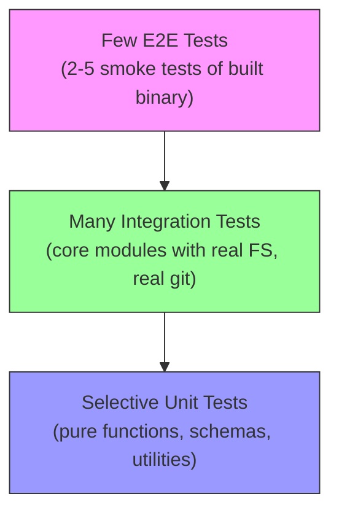

# CLI Testing Strategies for Node.js Applications
**Date**: 2026-03-26 10:00:00
**Document**: 20260326_1000_RESEARCH_cli-testing-strategies.md

---

## Executive Summary

This report evaluates testing strategies for a Node.js CLI application (codi-cli) built with Commander, @clack/prompts, and system commands (git, zip/unzip). It covers six areas: interactive prompt testing, process.exit handling, git/child_process mocking, ZIP operations, coverage exclusions, and integration vs unit test boundaries.

**Key recommendation**: Adopt a "Testing Diamond" approach -- heavy integration tests at the component level, selective unit tests for pure logic, minimal E2E, and pragmatic coverage exclusions for interactive CLI glue code.

---

## 1. Testing Interactive CLI Prompts (@clack/prompts)

### The Challenge

Files like `init-wizard.ts`, `add-wizard.ts`, and `preset-wizard.ts` import `@clack/prompts` as `* as p` and call `p.select()`, `p.multiselect()`, `p.confirm()`, `p.text()`, and `p.isCancel()`. These functions read from stdin and write to stdout, making them inherently interactive.

### Approach A: Module-Level Mocking with vi.mock (Recommended)

```typescript
import { describe, it, expect, vi, beforeEach } from 'vitest';

vi.mock(import('@clack/prompts'), () => ({
  intro: vi.fn(),
  outro: vi.fn(),
  cancel: vi.fn(),
  select: vi.fn(),
  multiselect: vi.fn(),
  confirm: vi.fn(),
  text: vi.fn(),
  isCancel: vi.fn(() => false),
  spinner: vi.fn(() => ({ start: vi.fn(), stop: vi.fn() })),
  note: vi.fn(),
  log: { info: vi.fn(), warn: vi.fn(), error: vi.fn(), step: vi.fn() },
}));

import * as p from '@clack/prompts';
import { runInitWizard } from '../../src/cli/init-wizard.js';

describe('runInitWizard', () => {
  beforeEach(() => {
    vi.clearAllMocks();
  });

  it('returns null when user cancels agent selection', async () => {
    vi.mocked(p.multiselect).mockResolvedValue(Symbol('cancel'));
    vi.mocked(p.isCancel).mockReturnValue(true);

    const result = await runInitWizard(['node'], ['claude'], ['claude', 'cursor']);
    expect(result).toBeNull();
    expect(p.cancel).toHaveBeenCalledWith('Operation cancelled.');
  });

  it('collects wizard answers into WizardResult', async () => {
    vi.mocked(p.multiselect).mockResolvedValue(['claude', 'cursor']);
    vi.mocked(p.select).mockResolvedValueOnce('preset'); // config mode
    vi.mocked(p.select).mockResolvedValueOnce('balanced'); // preset choice
    vi.mocked(p.confirm).mockResolvedValue(false); // version pin
    // ... continue for remaining prompts

    const result = await runInitWizard(['node'], ['claude'], ['claude', 'cursor']);
    expect(result).toBeDefined();
    expect(result?.agents).toEqual(['claude', 'cursor']);
  });
});
```

| Criterion | Rating | Notes |
|-----------|--------|-------|
| Complexity | Low | Standard vi.mock pattern |
| Maintainability | Medium | Mock sequence must match prompt order; breaks if wizard flow changes |
| Value | High | Tests branching logic, cancel handling, data assembly |
| Industry consensus | Strong | This is what oclif, create-t3-app, and Astro do |

### Approach B: Thin-Wrapper Extraction

Refactor wizards to accept a `prompter` dependency:

```typescript
// init-wizard.ts
export async function runInitWizard(
  detectedStack: string[],
  detectedAgents: string[],
  allAgents: string[],
  prompter = defaultPrompter, // injectable
): Promise<WizardResult | null> { ... }
```

This is cleaner but requires a refactor. Use if test maintenance cost of Approach A becomes high.

### Approach C: E2E with stdin piping

Use `execa` to spawn the built CLI and pipe keystrokes. Fragile, slow, and only for smoke tests.

**Verdict**: Use Approach A (vi.mock) for unit tests. Reserve E2E for 1-2 smoke tests of the built binary.

---

## 2. Testing Code That Calls process.exit()

### The Challenge

Commander calls `process.exit()` on parse errors and `--help`/`--version`. Some CLI commands may also call it directly.

### Approach A: vi.spyOn with mockImplementation (Recommended)

```typescript
import { vi, describe, it, expect, beforeEach, afterEach } from 'vitest';

describe('CLI error handling', () => {
  let exitSpy: ReturnType<typeof vi.spyOn>;

  beforeEach(() => {
    exitSpy = vi.spyOn(process, 'exit').mockImplementation((() => {
      throw new Error('process.exit called');
    }) as never);
  });

  afterEach(() => {
    exitSpy.mockRestore();
  });

  it('exits with code 1 on invalid command', async () => {
    // Import and execute the code that triggers process.exit
    expect(() => {
      // synchronous exit trigger
    }).toThrow('process.exit called');
    expect(exitSpy).toHaveBeenCalledWith(1);
  });
});
```

**Important Vitest caveat**: The spy must be set up BEFORE importing the module that calls `process.exit()`. With async code, use `vi.waitFor()`:

```typescript
it('handles async exit', async () => {
  doAsyncThing();
  await vi.waitFor(() => {
    expect(exitSpy).toHaveBeenCalledWith(1);
  });
});
```

### Approach B: vitest-mock-process Library

```typescript
import { mockProcessExit } from 'vitest-mock-process';

const mockExit = mockProcessExit();
process.exit(1);
expect(mockExit).toHaveBeenCalledWith(1);
mockExit.mockRestore();
```

Requires adding `vitest-mock-process` as a dev dependency and configuring `deps.inline`.

### Approach C: Avoid Testing process.exit Directly

Structure code so that business logic returns exit codes rather than calling `process.exit()`:

```typescript
// Instead of: process.exit(1)
// Return: { exitCode: 1, message: 'error' }
```

Then only the thin CLI entry point calls `process.exit()`, and that layer is excluded from coverage.

| Approach | Complexity | Maintainability | Value |
|----------|------------|-----------------|-------|
| vi.spyOn | Low | High | Medium |
| vitest-mock-process | Low | High | Medium |
| Architectural (return codes) | Medium upfront | Very High | High |

**Verdict**: The codi project already follows good architecture -- Commander handles exit. Use `vi.spyOn` for the few spots that need it; do not add a dependency for this.

---

## 3. Testing Code That Shells Out to Git

### The Challenge

`src/utils/git.ts` uses `execFile` from `node:child_process` (promisified). `src/core/preset/preset-zip.ts` also uses it for `zip` and `unzip` commands.

### Approach A: vi.mock on node:child_process (Recommended for Unit Tests)

```typescript
import { describe, it, expect, vi, beforeEach } from 'vitest';

vi.mock(import('node:child_process'), async (importOriginal) => {
  const actual = await importOriginal();
  return {
    ...actual,
    execFile: vi.fn(),
  };
});

import { execFile } from 'node:child_process';
import { isGitRepo, getGitRoot } from '../../src/utils/git.js';

const mockExecFile = vi.mocked(execFile);

describe('isGitRepo', () => {
  beforeEach(() => {
    vi.clearAllMocks();
  });

  it('returns true when git rev-parse succeeds', async () => {
    // execFile is promisified, so mock the callback style
    mockExecFile.mockImplementation((_cmd, _args, _opts, callback) => {
      if (callback) callback(null, 'true\n', '');
      return {} as any;
    });

    expect(await isGitRepo('/some/repo')).toBe(true);
  });

  it('returns false when git rev-parse fails', async () => {
    mockExecFile.mockImplementation((_cmd, _args, _opts, callback) => {
      if (callback) callback(new Error('not a repo'), '', '');
      return {} as any;
    });

    expect(await isGitRepo('/not/a/repo')).toBe(false);
  });
});
```

**Caveat**: Mocking `execFile` when it is promisified requires matching the callback signature. An alternative is to mock at the `util.promisify` level or to create a thin wrapper.

### Approach B: Integration Tests with Real Git (Recommended for Integration)

```typescript
import { describe, it, expect, beforeEach, afterEach } from 'vitest';
import { mkdtemp, rm } from 'node:fs/promises';
import { execFileSync } from 'node:child_process';
import path from 'node:path';
import os from 'node:os';
import { isGitRepo, getGitRoot } from '../../src/utils/git.js';

describe('git utils (integration)', () => {
  let tmpDir: string;

  beforeEach(async () => {
    tmpDir = await mkdtemp(path.join(os.tmpdir(), 'codi-test-'));
    execFileSync('git', ['init'], { cwd: tmpDir });
  });

  afterEach(async () => {
    await rm(tmpDir, { recursive: true, force: true });
  });

  it('detects a real git repo', async () => {
    expect(await isGitRepo(tmpDir)).toBe(true);
  });

  it('returns git root', async () => {
    const root = await getGitRoot(tmpDir);
    expect(root).toBe(tmpDir);
  });
});
```

| Approach | Complexity | Maintainability | Value |
|----------|------------|-----------------|-------|
| vi.mock child_process | Medium | Medium (callback mocking is fiddly) | Medium |
| Real git in tmpdir | Low | Very High | Very High |

**Verdict**: Use real git in temp directories for `src/utils/git.ts` -- the functions are simple and git is universally available on dev/CI machines. Reserve mocking for code where the git interaction is a side concern (e.g., wizard flows).

---

## 4. Testing ZIP File Operations

### The Challenge

`preset-zip.ts` shells out to system `zip` and `unzip` commands via `execFile`. It also depends on `validatePreset` and filesystem operations.

### Approach A: Integration Test with Real Files (Recommended)

```typescript
import { describe, it, expect, beforeEach, afterEach } from 'vitest';
import fs from 'node:fs/promises';
import path from 'node:path';
import os from 'node:os';
import { createPresetZip, extractPresetZip, installPresetFromZip } from '../../src/core/preset/preset-zip.js';

describe('preset-zip (integration)', () => {
  let tmpDir: string;
  let presetDir: string;

  beforeEach(async () => {
    tmpDir = await fs.mkdtemp(path.join(os.tmpdir(), 'codi-zip-test-'));
    presetDir = path.join(tmpDir, 'my-preset');
    await fs.mkdir(presetDir, { recursive: true });
    // Create a minimal valid preset
    await fs.writeFile(
      path.join(presetDir, 'preset.yaml'),
      'name: my-preset\ndescription: Test preset\n',
    );
  });

  afterEach(async () => {
    await fs.rm(tmpDir, { recursive: true, force: true });
  });

  it('creates and extracts a ZIP round-trip', async () => {
    const zipPath = path.join(tmpDir, 'output.zip');
    const createResult = await createPresetZip(presetDir, zipPath);
    expect(createResult.ok).toBe(true);

    const extractResult = await extractPresetZip(zipPath);
    expect(extractResult.ok).toBe(true);
  });
});
```

### Approach B: Mocked execFile for Unit Tests

Mock `execFile` to test error paths (e.g., zip command not found, extraction failure) without needing real zip binaries:

```typescript
vi.mock(import('node:child_process'), async (importOriginal) => {
  const actual = await importOriginal();
  return {
    ...actual,
    execFile: vi.fn(),
  };
});

it('returns error when zip command fails', async () => {
  mockExecFile.mockImplementation((_cmd, _args, _opts, cb) => {
    cb(new Error('zip: command not found'), '', '');
    return {} as any;
  });

  const result = await createPresetZip(presetDir, outputPath);
  expect(result.ok).toBe(false);
  expect(result.errors[0].code).toBe('E_PRESET_ZIP_FAILED');
});
```

| Approach | Complexity | Maintainability | Value |
|----------|------------|-----------------|-------|
| Real zip/unzip in tmpdir | Low | High | Very High (tests actual behavior) |
| Mocked execFile | Medium | Medium | Medium (tests error handling paths) |

**Verdict**: Use both. Integration tests for the happy path (round-trip create/extract). Mocked tests for error scenarios (command not found, oversized files, invalid ZIP).

**Note**: Ensure CI runners have `zip` and `unzip` installed. On GitHub Actions, `ubuntu-latest` includes both. On macOS runners they are pre-installed.

---

## 5. Coverage Exclusion Patterns

### When Exclusion Is Acceptable

Based on industry research and OSS practice, these categories are widely accepted as reasonable coverage exclusions:

| Category | Example in codi | Rationale |
|----------|----------------|-----------|
| Entry points with only wiring | `src/cli.ts` (Commander parse) | Pure glue, no logic to test |
| Type re-exports | `src/index.ts`, `src/**/*.d.ts` | No runtime behavior |
| Interactive UI glue | `src/cli/*-wizard.ts` prompt wiring | Better tested via vi.mock or E2E |
| Template files | `src/templates/**/*.tmpl` | Static content, not executable TS |
| Error catalog definitions | Static error code mappings | Declarative, no branching |

### What Should NOT Be Excluded

- Core business logic (`src/core/**`)
- Utility functions (`src/utils/**`)
- Schema validation (`src/schemas/**`)
- Adapter logic (`src/adapters/**`)
- Command handlers (the logic portions of `src/cli/*.ts`)

### Recommended vitest.config.ts

```typescript
import { defineConfig, coverageConfigDefaults } from 'vitest/config';

export default defineConfig({
  test: {
    globals: true,
    include: ['tests/**/*.test.ts'],
    exclude: ['projs/**', 'node_modules/**'],
    coverage: {
      provider: 'v8',
      include: ['src/**/*.ts'],
      exclude: [
        ...coverageConfigDefaults.exclude,
        // Type-only files
        'src/**/*.d.ts',
        // Entry points (pure wiring, no testable logic)
        'src/index.ts',
        'src/cli.ts',
        // Template files (static content)
        'src/templates/**',
      ],
      thresholds: {
        // Start conservative, tighten over time
        statements: 60,
        branches: 50,
        functions: 60,
        lines: 60,
        // Higher bar for core logic
        'src/utils/**/*.ts': {
          statements: 80,
          branches: 70,
          functions: 80,
          lines: 80,
        },
        'src/schemas/**/*.ts': {
          statements: 80,
          branches: 70,
          functions: 80,
          lines: 80,
        },
      },
    },
  },
});
```

### Inline Exclusions with istanbul Comments

For specific uncoverable lines within otherwise-tested files:

```typescript
/* v8 ignore next 3 */
if (process.env.NODE_ENV === 'development') {
  enableDevTools();
}
```

The `/* v8 ignore next */` and `/* v8 ignore start */` / `/* v8 ignore stop */` comments work with the v8 provider. The `/* istanbul ignore next */` syntax also works as a fallback.

---

## 6. Integration vs Unit Test Boundaries

### The Testing Diamond (Recommended for CLI Tools)



### Boundary Definitions for codi

| Layer | Test Type | What to Test | Dependencies |
|-------|-----------|-------------|--------------|
| `src/utils/*.ts` | Unit | Pure functions (hash, paths, semver, frontmatter) | None -- no mocking needed |
| `src/schemas/*.ts` | Unit | Schema validation, parsing | None |
| `src/core/**/*.ts` | Integration | Generator, preset logic, migration, config | Real filesystem in tmpdir |
| `src/core/preset/preset-zip.ts` | Integration + Unit | Happy path with real zip; error paths with mocks | Real FS + mocked execFile |
| `src/utils/git.ts` | Integration | Real git operations | Real git in tmpdir |
| `src/cli/*.ts` (commands) | Integration | Command handler logic | Mocked @clack/prompts, real FS |
| `src/cli.ts` (entry) | E2E | Version, help output | Spawned process (existing tests) |
| `src/adapters/**` | Unit | Adapter output correctness | None -- pure transforms |

### What Popular OSS CLI Projects Do

| Project | Framework | Testing Strategy |
|---------|-----------|-----------------|
| create-t3-app | Vitest | Module mocks for prompts, snapshot tests for output |
| Astro CLI | Vitest | Fixture-based integration, real FS |
| Angular CLI | Jasmine | Heavy integration with temp workspaces |
| oclif | Mocha | E2E with `@oclif/test`, command output capture |
| Turborepo | Vitest + integration | Real FS, real git, snapshot tests |

### Recommended Test File Organization

```
tests/
  unit/
    utils.test.ts          (pure functions)
    schemas.test.ts        (validation logic)
    adapters.test.ts       (adapter transforms)
    error-catalog.test.ts  (error creation)
  integration/
    git-utils.test.ts      (real git in tmpdir)
    preset-zip.test.ts     (real zip/unzip + error mocks)
    generator.test.ts      (real FS output verification)
    init-wizard.test.ts    (mocked @clack/prompts)
    full-pipeline.test.ts  (existing end-to-end flow)
  e2e/
    cli.test.ts            (spawned binary -- version, help)
```

---

## Decision Matrix Summary

| Area | Recommended Approach | Effort | ROI |
|------|---------------------|--------|-----|
| @clack/prompts | vi.mock entire module | Low | High |
| process.exit | vi.spyOn + mockImplementation | Low | Medium |
| git operations | Real git in tmpdir (integration) | Low | Very High |
| ZIP operations | Real zip for happy path + mocked execFile for errors | Medium | High |
| Coverage exclusions | Exclude entry points, types, templates | Low | High (reduces noise) |
| Test architecture | Testing Diamond: integration-heavy | Medium | Very High |

---

## Immediate Action Items

1. **Update vitest.config.ts** with the recommended coverage exclusions and thresholds
2. **Add integration tests** for `src/utils/git.ts` using real git in temp directories
3. **Add integration tests** for `preset-zip.ts` with real zip/unzip round-trips
4. **Add unit tests** for wizard flows using `vi.mock(import('@clack/prompts'))`
5. **Move existing CLI smoke tests** to `tests/e2e/` for clearer organization
6. **Set up per-directory coverage thresholds** to enforce higher coverage on core logic

---

## Sources

- [Vitest Module Mocking Guide](https://vitest.dev/guide/mocking/modules)
- [Vitest Coverage Configuration](https://vitest.dev/config/coverage)
- [vitest-mock-process Library](https://github.com/leonsilicon/vitest-mock-process)
- [Cannot Mock Implementation of process.exit - Vitest Issue #5400](https://github.com/vitest-dev/vitest/issues/5400)
- [Mock child_process.exec in Vitest - Gist](https://gist.github.com/joemaller/f9171aa19a187f59f406ef1ffe87d9ac)
- [How to Test CLI Output in Jest and Vitest](https://www.lekoarts.de/how-to-test-cli-output-in-jest-vitest/)
- [Node.js Testing Best Practices (Goldbergyoni)](https://github.com/goldbergyoni/nodejs-testing-best-practices)
- [Vitest Mocking/Spying on child_process - Discussion #2075](https://github.com/vitest-dev/vitest/discussions/2075)
- [Vitest Coverage Exclude Discussion #3739](https://github.com/vitest-dev/vitest/discussions/3739)
- [JavaScript Testing Complete Guide 2026](https://calmops.com/programming/javascript/javascript-testing-guide-2026/)
- [Vitest in 2026 - DEV Community](https://dev.to/ottoaria/vitest-in-2026-the-testing-framework-that-makes-you-actually-want-to-write-tests-kap)
- [@clack/prompts npm](https://www.npmjs.com/package/@clack/prompts)
