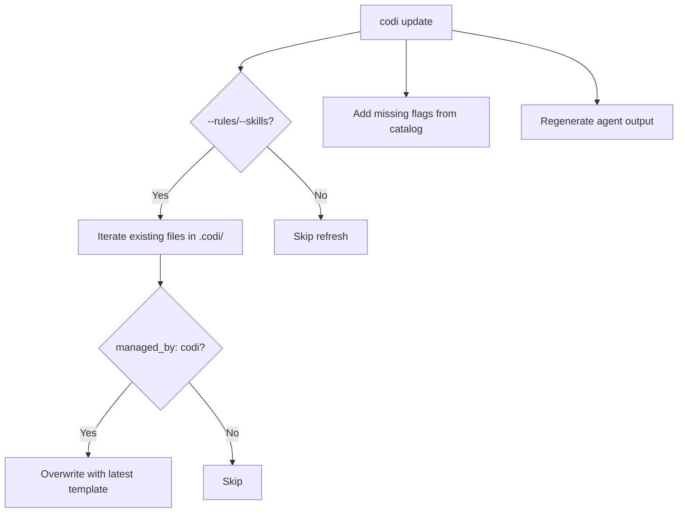
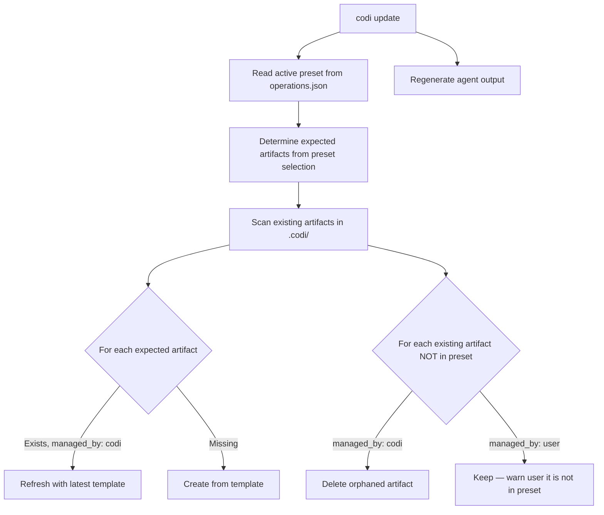

# Update Command Sync Improvements
**Date**: 2026-03-26 23:40
**Document**: 20260326_2340_SPEC_update_sync_improvements.md
**Category**: SPEC

## Problem

The `codi update` command currently only refreshes existing managed templates. It has four gaps:

1. **No removal**: If an artifact is removed from the active preset, `update` doesn't delete the orphaned file
2. **No addition**: If a new template is added in a codi version, `update` doesn't create it
3. **No user artifact protection on clean**: `codi clean` destroys `managed_by: user` files without warning or backup
4. **No sync with preset selection**: `update` doesn't reconcile what SHOULD exist vs what DOES exist

## Current Behavior



## Proposed Behavior



## Implementation Plan

### Phase 1: Sync artifacts with preset selection

**File**: `src/cli/update.ts`

Add a `syncArtifactsWithPreset()` function that:

1. Reads active preset selection from `.codi/operations.json` → `activePreset.artifactSelection`
2. For each artifact type (rules, skills, agents, commands):
   - **Expected** = artifacts listed in the preset selection
   - **Existing** = files in `.codi/{type}/` with `managed_by: codi`
   - **To create** = Expected - Existing (new artifacts from updated codi version)
   - **To remove** = Existing - Expected (orphaned artifacts from deselected items)
   - **To refresh** = Expected AND Existing (update templates to latest)
3. Create missing artifacts from templates
4. Delete orphaned `managed_by: codi` artifacts
5. Refresh remaining managed artifacts

### Phase 2: Protect user artifacts on clean

**File**: `src/cli/clean.ts`

Before deleting `.codi/`, check for `managed_by: user` files:
- If found and NOT `--force`, warn and list them, ask for confirmation
- If `--force`, back up user artifacts to a `.codi-backup/` directory before deleting
- Print backup location in output

### Phase 3: Backup/restore for user artifacts

**Files**: New `src/core/backup/` module

- `backupUserArtifacts(codiDir)` — scans for `managed_by: user`, copies to `.codi-backup/YYYY-MM-DD/`
- `restoreUserArtifacts(codiDir)` — copies from latest backup back to `.codi/`
- Integrate with `clean --all` (auto-backup) and `init --force` (auto-restore)

## Priority

| Phase | Impact | Effort | Priority |
|-------|--------|--------|----------|
| Phase 1: Sync | High — artifacts drift without it | Medium | **P1** |
| Phase 2: Protect on clean | Medium — prevents data loss | Low | **P2** |
| Phase 3: Backup/restore | Low — safety net | Medium | **P3** |

## Verification

```bash
# Phase 1: Sync test
codi init --preset balanced  # select 5 rules
# Manually delete 2 rules from operations.json selection
codi update --rules
# Verify: 2 orphaned rule files deleted, 3 remaining refreshed

# Phase 2: Clean protection test
# Create a custom rule with managed_by: user
codi clean --all
# Verify: warning shown, backup created

# Phase 3: Restore test
codi init --force
# Verify: user artifacts restored from backup
```
