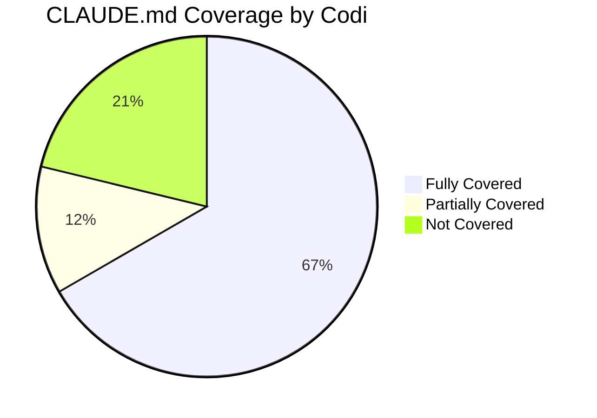
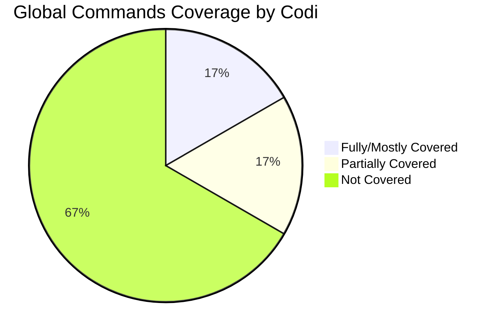
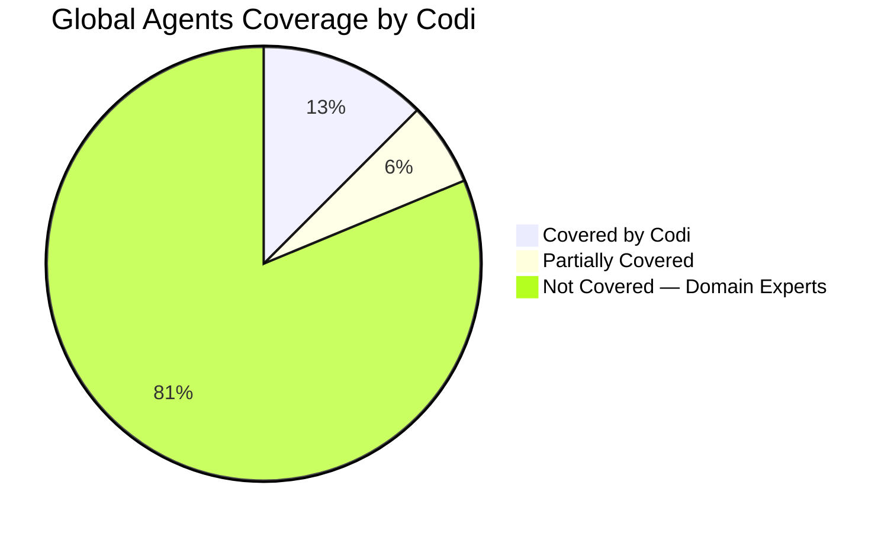

# CLAUDE.md Global → Codi Integration Analysis
**Date**: 2026-03-27 15:00
**Document**: 20260327_1500_ARCH_claude-md-codi-integration.md
**Category**: ARCH

## 1. Introduction

This document analyzes the configuration elements in the user's global `~/.claude/CLAUDE.md` and maps them against Codi's existing artifact system. The goal: determine what can be absorbed by Codi, what is already covered, and what gaps remain — so the global CLAUDE.md can be reduced to a thin layer that delegates to Codi.

## 2. CLAUDE.md Global Configuration Analysis

The global CLAUDE.md contains **8 configuration domains**:

| # | Domain | Lines | Content Type |
|---|--------|-------|-------------|
| 1 | Core Workflow Principles | 1–24 | Behavioral rules (human-in-the-loop, baby steps, no commits without approval) |
| 2 | MCP Usage Strategy | 27–97 | MCP tool prioritization (graph-code → docs → sequential-thinking → memory) |
| 3 | Agent Usage Guidelines | 100–117 | When/how to spawn subagents |
| 4 | Code Quality Standards | 120–143 | File size limits, typing, validation, linting |
| 5 | Language & Writing Standards | 147–154 | Spanish orthography rules |
| 6 | Security Standards | 158–169 | Auth, input validation, code trust |
| 7 | Production-Grade Requirements | 173–196 | No shortcuts, DB migrations, performance, UI standards |
| 8 | Documentation Standards | 200–281 | Naming, Mermaid diagrams, doc types, directory structure |
| 9 | Decision-Making Framework | 285–320 | MCP-first decision flowcharts |
| 10 | Quick Reference | 324–340 | Summary table of all rules |

## 3. Codi Architecture Overview

Codi manages **7 artifact types** that generate agent-specific output:

| Artifact | Count | Purpose | Output Format |
|----------|-------|---------|---------------|
| **Rules** | 22 templates | Coding conventions injected into agent context | Markdown → agent rules files |
| **Skills** | 20 templates | Workflow guides (commit, review, QA, etc.) | Markdown → agent skills dirs |
| **Agents** | 8 templates | Subagent definitions | Markdown → agent-specific format |
| **Commands** | 9 templates | Slash commands (review, commit, etc.) | Markdown → agent commands |
| **Flags** | 17 flags | Enforceable settings (max_file_lines, security_scan, etc.) | YAML → CLAUDE.md permissions/instructions |
| **MCP Servers** | 29 templates | MCP server configurations | YAML → JSON/TOML per agent |
| **Presets** | 7 presets | Bundles of rules + skills + agents + commands + flags + MCP servers | Composite |

## 4. Mapping Between CLAUDE.md Global and Codi Artifacts

### 4.1 Fully Covered — Already Exists in Codi

| CLAUDE.md Section | Codi Artifact | Coverage |
|-------------------|---------------|----------|
| File size limits (700 LOC) | Flag: `max_file_lines` (default 700) | **100%** — enforced via flag + pre-commit hook |
| Strict typing / no `any` | Rule: `typescript`, Flag: `type_checking: strict` | **100%** |
| Security (input validation, secrets, auth) | Rule: `security`, Flag: `security_scan` | **100%** |
| Testing requirements | Rule: `testing`, Flag: `require_tests`, `test_before_commit` | **100%** |
| Git workflow (conventional commits, no force push) | Rule: `git-workflow`, Flag: `allow_force_push: false` | **100%** |
| Performance guidelines (N+1, parallelization) | Rule: `performance` | **100%** |
| Error handling | Rule: `error-handling` | **100%** |
| Code style (naming, functions, linting) | Rule: `code-style` | **100%** |
| Architecture (file organization, deps) | Rule: `architecture` | **100%** |
| API design (REST conventions) | Rule: `api-design` | **100%** |
| Documentation (doc types, required sections) | Rule: `documentation` | **90%** — missing Mermaid enforcement and filename format |
| Production mindset (no shortcuts) | Rule: `production-mindset` | **100%** |
| Simplicity first (YAGNI) | Rule: `simplicity-first` | **100%** |
| No commits without approval | Flag: `require_pr_review: true` | **100%** |
| Lint on save | Flag: `lint_on_save: true` | **100%** |
| Allow shell commands | Flag: `allow_shell_commands` | **100%** |
| Allow file deletion | Flag: `allow_file_deletion` | **100%** |
| Require documentation | Flag: `require_documentation` | **100%** |
| MCP server configs | MCP Servers: 29 builtin templates | **100%** |
| Commit workflow | Skill: `commit` + Command: `/commit` | **100%** |
| Code review | Skill: `code-review` + Command: `/review` | **100%** |
| Security scanning | Skill: `security-scan` + Command: `/security-scan` | **100%** |
| Codebase onboarding | Skill: `codebase-onboarding` + Command: `/onboard` | **100%** |

### 4.2 Partially Covered — Needs Enhancement

| CLAUDE.md Section | Current Codi State | Gap |
|-------------------|-------------------|-----|
| **MCP Usage Strategy** (graph-code first, ordered workflow) | Skill: `mcp` exists but covers usage/troubleshooting, not the mandatory ordering | Missing: **rule or skill** enforcing the "graph-code FIRST → docs → sequential-thinking → memory" workflow |
| **Documentation naming** (`YYYYMMDD_HHMM_CATEGORY_name.md`) | Rule: `documentation` has general standards | Missing: the specific filename format and 10-category system |
| **Mermaid-only diagrams** | Rule: `documentation` mentions diagrams | Missing: explicit "no ASCII art, Mermaid only" enforcement |
| **No Claude signatures in commits** | Skill: `commit` handles formatting | Missing: explicit prohibition of Co-Authored-By and emoji signatures |

### 4.3 Not Covered — Gaps

| CLAUDE.md Section | Why It's a Gap | Proposed Solution |
|-------------------|---------------|-------------------|
| **Human-in-the-Loop workflow** (baby steps, propose before execute) | Behavioral instruction, not a code convention | New rule: `workflow` or `human-in-the-loop` |
| **Self-Evaluation Checklist** (security, perf, scalability, cost) | Cross-cutting concern, not language-specific | New rule: `self-evaluation` or merge into `production-mindset` |
| **Agent Usage Guidelines** (when to spawn, best practices) | Agent orchestration, not code style | New rule: `agent-usage` |
| **Spanish Orthography** | Language-specific writing standard | New rule: `spanish-orthography` (or `i18n-writing`) |
| **Decision-Making Framework** (MCP-first flowcharts) | Process instruction with diagrams | Merge into MCP usage skill or new skill: `decision-framework` |
| **Database migration rules** (never apply without file, user confirmation) | Framework-agnostic DB concern | Merge into `production-mindset` rule or new rule |
| **UI Standards** (responsive, WCAG, semantic HTML) | Frontend-specific concern | New rule: `ui-accessibility` or merge into `react`/`nextjs` |

## 5. Gap Analysis Summary



**22 of 33 identified concerns** (67%) are fully covered by existing Codi artifacts.
**4 concerns** (12%) need minor enhancements to existing rules/skills.
**7 concerns** (21%) require new artifacts or merges.

## 6. Proposed Integration Strategy

### Phase 1: Enhance Existing Artifacts (Low Effort)

| Action | Target | Change |
|--------|--------|--------|
| Add Mermaid enforcement | Rule: `documentation` | Add "All diagrams must use Mermaid syntax — no ASCII art" and filename format sections |
| Add commit signature prohibition | Skill: `commit` | Add "Never add Co-Authored-By or AI attribution signatures" |
| Add MCP ordering to MCP skill | Skill: `mcp` | Add "Mandatory ordering: graph-code → docs → sequential-thinking → memory" |
| Add DB migration rules | Rule: `production-mindset` | Add "Never apply migrations without migration file first" and "User confirmation required" |

### Phase 2: Create New Rules (Medium Effort)

| New Rule | Content | Source from CLAUDE.md |
|----------|---------|----------------------|
| `workflow` | Human-in-the-loop, baby steps, propose before execute, self-evaluation checklist | Sections 1 + Decision Framework |
| `spanish-orthography` | Accent rules, punctuation, applies to docs/comments/commits | Section 5 |
| `agent-usage` | When to spawn agents, best practices, parallel execution | Section 3 |

### Phase 3: Reduce Global CLAUDE.md (Final)

After Phase 1-2, the global CLAUDE.md can be reduced to:

```markdown
# Global Agent Instructions

## Codi-Managed Configuration
This project uses Codi for AI agent configuration. All coding standards,
security rules, and workflow conventions are managed via `.codi/` artifacts.
Run `codi generate` to apply.

## User Preferences (not codifiable)
- Spanish: always write with correct orthography (acentos, tildes, ¿?, ¡!)
- MCP Priority: always query graph-code before other exploration tools
- Baby Steps: propose ONE step at a time, wait for feedback
```

Only **non-codifiable behavioral preferences** remain in the global file. Everything else is governed by Codi rules, flags, and skills.

## 7. Optimization Opportunities

### 7.1 Eliminate Duplication
The current state has significant duplication — the same instruction (e.g., "max 700 lines") appears in both CLAUDE.md Global and Codi's `max_file_lines` flag. After integration, each concern exists in exactly one place.

### 7.2 Cross-Project Portability
Rules like `workflow`, `spanish-orthography`, and `agent-usage` would be globally useful across all projects. Consider adding them as builtin templates in Codi so any project can opt in via presets.

### 7.3 Preset for Your Workflow
Create a custom preset (e.g., `personal-workflow`) that bundles:
- All standard rules
- `workflow` + `spanish-orthography` + `agent-usage`
- MCP servers: graph-code, memory, sequential-thinking, docs
- Strict flags: `max_file_lines: 500`, `security_scan: true`, `require_tests: true`

This preset replaces the entire CLAUDE.md Global for any new project.

## 8. Global Commands Analysis

The user's global `~/.claude/commands/` contains **12 commands**. Codi provides **9 builtin command templates**.

### 8.1 Commands Mapping

| Global Command | Purpose | Codi Equivalent | Coverage |
|----------------|---------|-----------------|----------|
| `commit.md` | Conventional commits with format rules | Command: `/commit` | **100%** — Codi's version is more structured |
| `security_review.md` | Launch 3 parallel security audit agents | Command: `/security-scan` | **80%** — Codi covers scanning but not the 3-agent parallel pattern |
| `codebase.md` | Explore codebase via graph-code MCP | Command: `/onboard` | **70%** — Codi covers onboarding but doesn't enforce graph-code MCP first |
| `search.md` | Search knowledge sources (docs → graph-code → web) | Command: `/docs-lookup` | **60%** — Codi covers doc lookup but not the ordered multi-source search |
| `check.md` | Error diagnosis workflow using MCP servers | — | **0%** — No equivalent |
| `close_day.md` | Document daily work progress to CONTROL.json | — | **0%** — No equivalent |
| `open_day.md` | Review prior work from CONTROL.json | — | **0%** — No equivalent |
| `remember.md` | 150+ project development rules checklist | — | **0%** — Covered by Codi rules system, but not as a command |
| `roadmap.md` | Create JSON todo lists in docs/roadmaps/ | — | **0%** — No equivalent |
| `index_graph.md` | Full repository re-indexing via graph-code MCP | — | **0%** — MCP-specific, not codifiable |
| `update_graph.md` | Incremental graph update for changed files | — | **0%** — MCP-specific, not codifiable |
| `status.md` | Report project state from roadmap files | — | **0%** — No equivalent |

### 8.2 Commands Coverage Summary



### 8.3 Commands Migration Plan

| Category | Commands | Action |
|----------|----------|--------|
| **Already Covered** | `commit`, `security_review` | Drop global versions — Codi commands are sufficient |
| **Enhance Existing** | `codebase` → `/onboard`, `search` → `/docs-lookup` | Add MCP-first workflow to existing Codi commands |
| **Personal Workflow** | `open_day`, `close_day`, `status`, `roadmap` | Keep as global commands — these are personal productivity tools, not codifiable standards |
| **MCP-Specific** | `index_graph`, `update_graph` | Keep as global commands — these are MCP server operations, not project conventions |
| **Absorb into Rules** | `remember` | Already covered by Codi's 22 rule templates — the command is redundant |
| **New Command Candidate** | `check` | Consider adding a `/diagnose` command to Codi for error diagnosis workflows |

## 9. Global Agents Analysis

The user's global `~/.claude/agents/` contains **16 agents**. Codi provides **8 builtin agent templates**.

### 9.1 Agents Mapping

| Global Agent | Purpose | Codi Equivalent | Coverage |
|--------------|---------|-----------------|----------|
| `Explorer` | Codebase exploration | Agent: `onboarding-guide` | **70%** — Codi covers onboarding but Explorer is more general-purpose |
| `security-expert` | Security analysis and hardening | Agent: `security-analyzer` | **90%** — Nearly identical purpose |
| `nextjs-best-practices-researcher` | Next.js patterns and optimization | — | **0%** — Framework-specific research agent |
| `payload-cms-auditor` | Payload CMS best practices | — | **0%** — Platform-specific agent |
| `python-performance-architect` | Python performance optimization | — | **0%** — Language-specific expert |
| `python-senior-dev` | Python architecture and concurrency | — | **0%** — Language-specific expert |
| `data-intensive-architect` | Distributed systems and data architecture | — | **0%** — Domain-specific expert |
| `data-science-specialist` | ML, statistics, feature engineering | — | **0%** — Domain-specific expert |
| `data-engineering-expert` | Data pipelines and ETL/ELT | — | **0%** — Domain-specific expert |
| `data-analytics-bi-expert` | BI dashboards and data visualization | — | **0%** — Domain-specific expert |
| `scalability-expert` | Infrastructure scaling and performance | Agent: `performance-auditor` | **40%** — Codi covers code-level performance, not infrastructure scaling |
| `ai-engineering-expert` | RAG, embeddings, LLM integration | — | **0%** — Domain-specific expert |
| `mlops-engineer` | ML deployment and monitoring | — | **0%** — Domain-specific expert |
| `openai-agents-sdk-specialist` | OpenAI Agents SDK patterns | — | **0%** — SDK-specific expert |
| `legal-compliance-eu` | GDPR and EU regulatory compliance | — | **0%** — Domain-specific expert |
| `marketing-seo-specialist` | SEO and marketing strategy | — | **0%** — Domain-specific expert |

### 9.2 Agents Coverage Summary



### 9.3 Agents Classification

The 16 global agents fall into **3 categories**:

| Category | Agents | Count |
|----------|--------|-------|
| **Generic Development** | Explorer, security-expert | 2 |
| **Framework/Language Experts** | nextjs-researcher, python-performance, python-senior-dev, payload-cms-auditor | 4 |
| **Domain Specialists** | data-intensive-architect, data-science, data-engineering, data-analytics-bi, scalability-expert, ai-engineering, mlops-engineer, openai-agents-sdk, legal-compliance-eu, marketing-seo | 10 |

### 9.4 Agents Migration Plan

| Action | Agents | Rationale |
|--------|--------|-----------|
| **Drop — Already Covered** | `security-expert` | Codi's `security-analyzer` covers the same function |
| **Enhance Existing** | `Explorer` → `onboarding-guide` | Add general-purpose exploration mode to Codi's onboarding agent |
| **Keep as Global** | All 13 domain/framework experts | These are **personal expertise amplifiers**, not project conventions. They apply across all projects regardless of Codi config. Codi should not absorb them. |
| **Future Consideration** | `scalability-expert` | Could enhance Codi's `performance-auditor` with infrastructure-level guidance |

### 9.5 Key Insight: Agents vs Commands Boundary

**Commands** in Codi = slash commands triggered by the user (e.g., `/commit`, `/review`). They are **workflow instructions**.

**Agents** in Codi = subagent definitions spawned for specialized tasks. They are **expertise profiles**.

The 13 uncovered global agents are **domain specialists** — they represent the user's professional toolkit across data engineering, ML, security, legal, and marketing. These should remain global because:

1. They are **user-specific**, not project-specific — a data engineer needs them on every project
2. They are **domain knowledge**, not coding conventions — Codi manages conventions
3. They are **heavyweight** — each contains extensive prompts and tool configurations
4. Moving them into Codi would **bloat every project** with irrelevant agent definitions

The correct architecture: **Codi manages project-level agents** (code-reviewer, test-generator, etc.), **global config manages personal expert agents** (data-science, legal-compliance, etc.).

## 10. Complete Migration Summary

### 10.1 What Moves to Codi

| Type | Items | Action |
|------|-------|--------|
| Rules (from CLAUDE.md) | 22 concerns | Already covered |
| Rules (new) | `workflow`, `spanish-orthography`, `agent-usage` | Create in Phase 2 |
| Commands | `commit`, `security_review` | Drop global — use Codi |
| Commands | `codebase`, `search` | Enhance Codi equivalents |
| Agents | `security-expert` | Drop global — use Codi |
| Agents | `Explorer` | Enhance Codi's `onboarding-guide` |

### 10.2 What Stays Global

| Type | Items | Reason |
|------|-------|--------|
| Commands | `open_day`, `close_day`, `status`, `roadmap` | Personal productivity workflow |
| Commands | `index_graph`, `update_graph` | MCP-specific operations |
| Commands | `check` | Error diagnosis (consider future Codi command) |
| Agents | 13 domain specialists | Personal expertise, not project conventions |
| CLAUDE.md sections | Spanish orthography, MCP priority, baby steps | Non-codifiable behavioral preferences |

### 10.3 Reduced Global Configuration

After full migration, the global `~/.claude/` would contain:

```
~/.claude/
├── CLAUDE.md              # ~10 lines: Spanish, MCP priority, baby steps
├── commands/
│   ├── open_day.md        # Personal workflow
│   ├── close_day.md       # Personal workflow
│   ├── status.md          # Personal workflow
│   ├── roadmap.md         # Personal workflow
│   ├── check.md           # Error diagnosis
│   ├── index_graph.md     # MCP operation
│   └── update_graph.md    # MCP operation
└── agents/
    ├── Explorer.md                        # General exploration
    ├── ai-engineering-expert.md           # Domain specialist
    ├── data-analytics-bi-expert.md        # Domain specialist
    ├── data-engineering-expert.md         # Domain specialist
    ├── data-intensive-architect.md        # Domain specialist
    ├── data-science-specialist.md         # Domain specialist
    ├── legal-compliance-eu.md             # Domain specialist
    ├── marketing-seo-specialist.md        # Domain specialist
    ├── mlops-engineer.md                  # Domain specialist
    ├── nextjs-best-practices-researcher.md # Framework expert
    ├── openai-agents-sdk-specialist.md    # SDK specialist
    ├── payload-cms-auditor.md             # Platform expert
    ├── python-performance-architect.md    # Language expert
    ├── python-senior-dev.md               # Language expert
    └── scalability-expert.md              # Domain specialist
```

**5 commands removed** (absorbed by Codi: `commit`, `security_review`, `codebase`, `search`, `remember`)
**1 agent removed** (`security-expert` → Codi's `security-analyzer`)

## 11. Conclusion

| Metric | Value |
|--------|-------|
| **CLAUDE.md Global** | |
| Total concerns | 33 |
| Already covered by Codi | 22 (67%) |
| Need minor enhancement | 4 (12%) |
| Need new artifacts | 7 (21%) |
| **Global Commands** | |
| Total commands | 12 |
| Covered by Codi | 2 (17%) |
| Partially covered | 2 (17%) |
| Personal/MCP-specific (keep global) | 8 (66%) |
| **Global Agents** | |
| Total agents | 16 |
| Covered by Codi | 2 (12.5%) |
| Partially covered | 1 (6.25%) |
| Domain specialists (keep global) | 13 (81.25%) |
| **Migration Actions** | |
| New rules to create | 3 (`workflow`, `spanish-orthography`, `agent-usage`) |
| Existing artifacts to enhance | 5 (`documentation` rule, `commit` skill, `mcp` skill, `onboard` command, `docs-lookup` command) |
| Global commands to drop | 5 (`commit`, `security_review`, `codebase`, `search`, `remember`) |
| Global agents to drop | 1 (`security-expert`) |

The global CLAUDE.md is largely redundant with Codi's existing artifact system. After creating 3 new rules and enhancing 5 existing artifacts, the global file can be reduced to ~10 lines of non-codifiable behavioral preferences. 7 personal workflow commands and 15 domain specialist agents remain global — these represent the user's personal toolkit, not project conventions, and correctly live outside Codi's scope.
