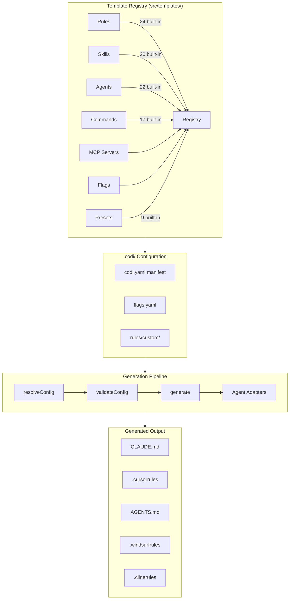
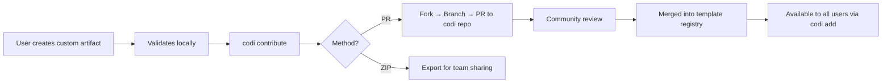
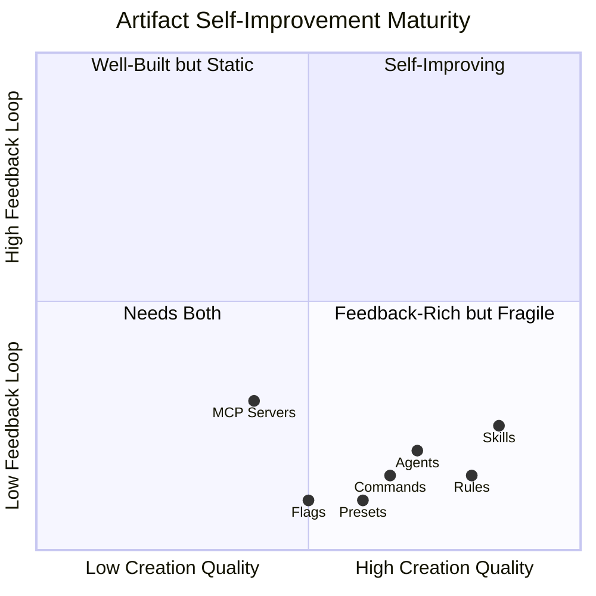
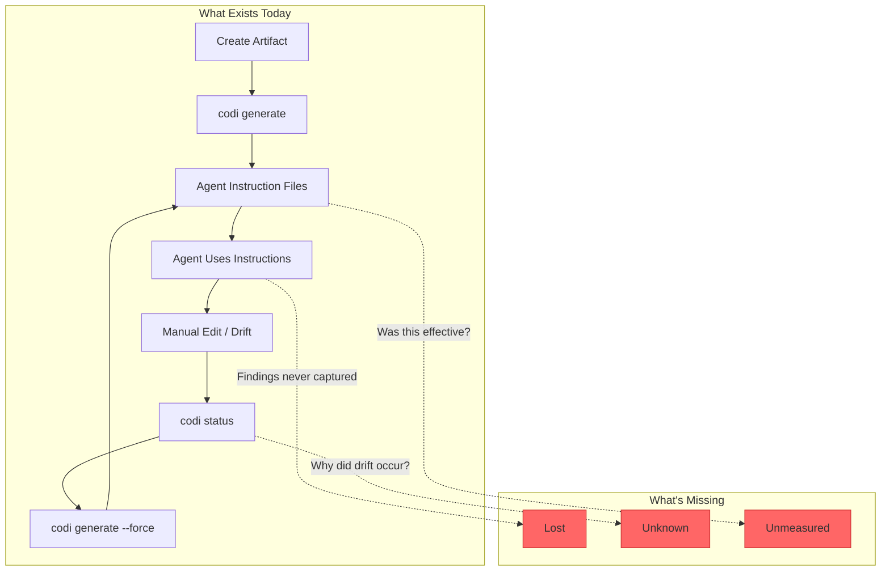
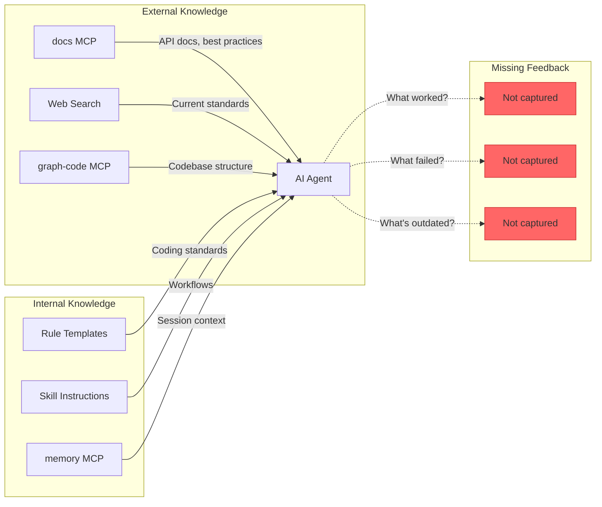
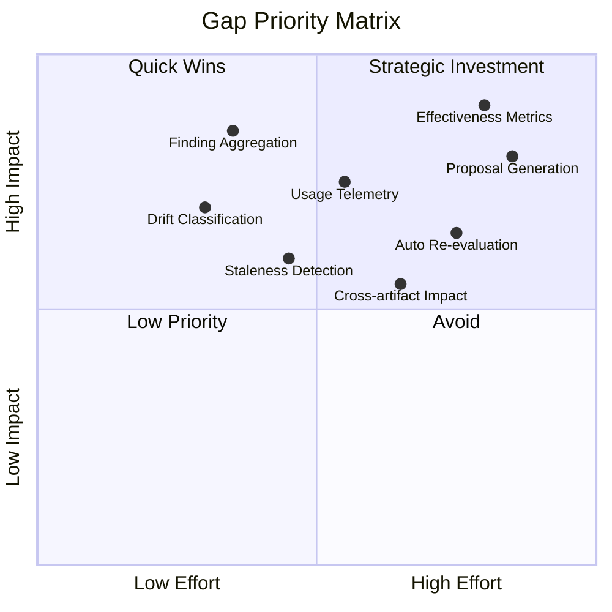
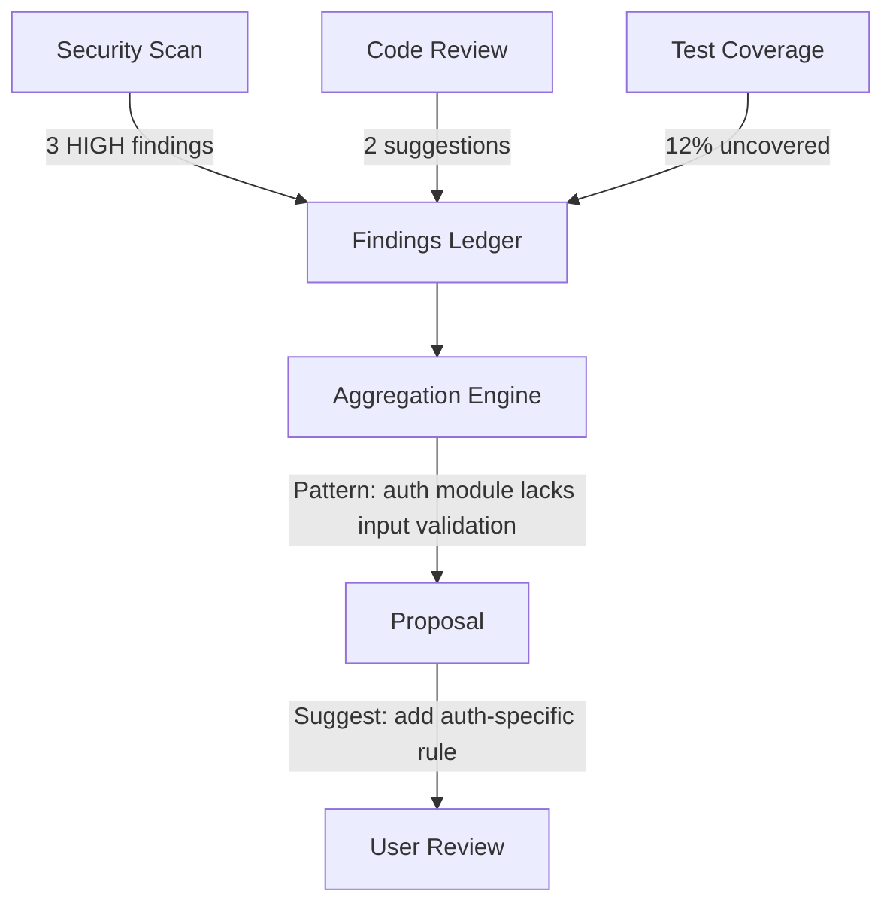
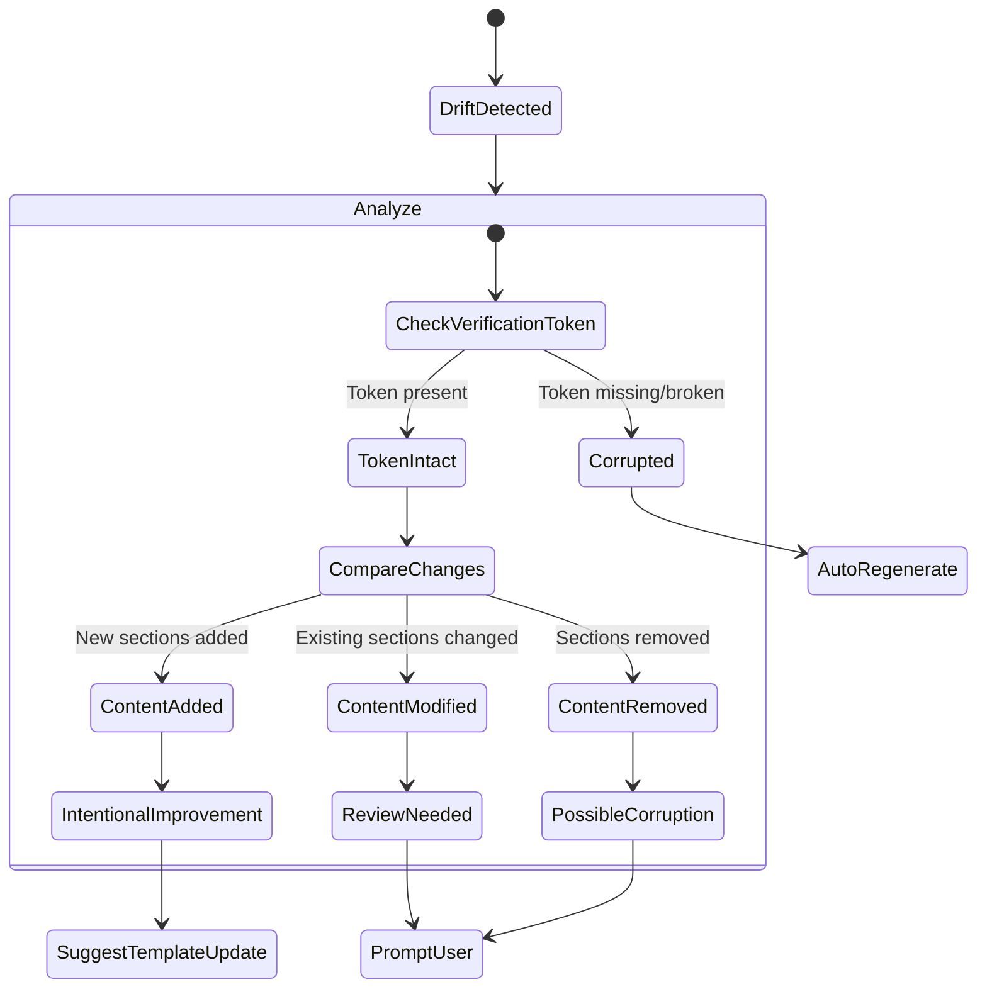
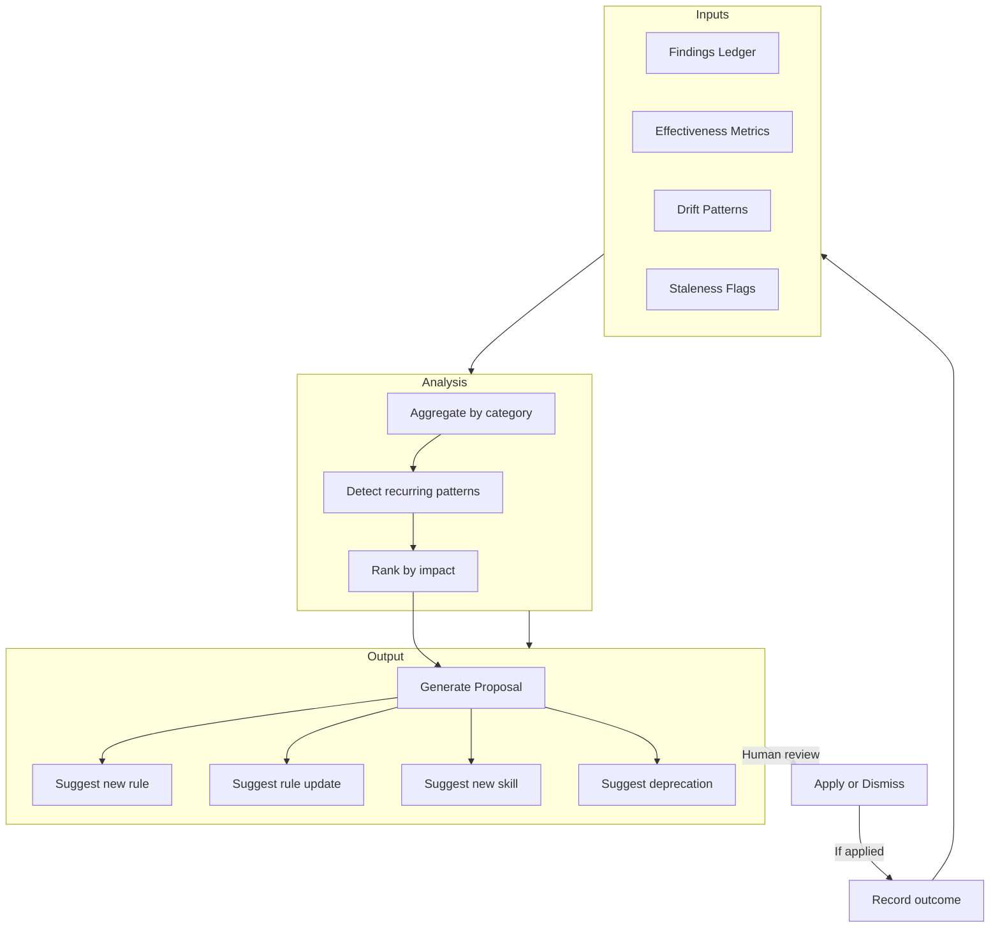
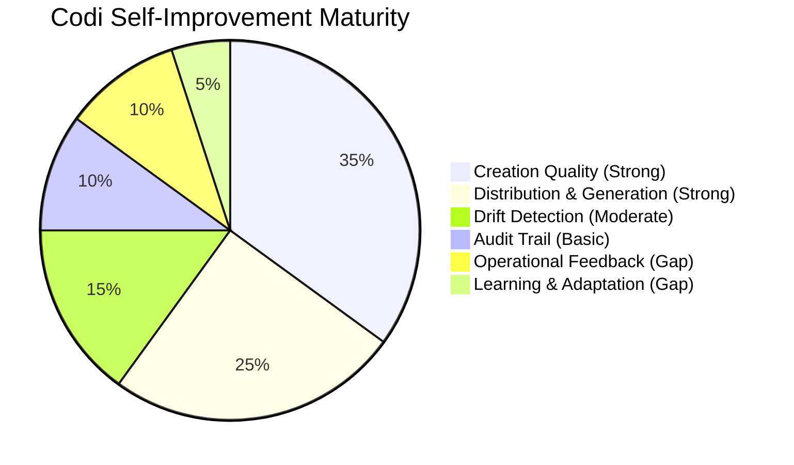

# Codi as a Self-Improving System: A Deep Architectural Analysis
**Date**: 2026-03-27 18:00
**Document**: 20260327_1800_RESEARCH_codi-self-improvement-analysis.md
**Category**: RESEARCH

## 1. Introduction

What does "self-improving" mean for an AI agent configuration framework? At its core, a self-improving system exhibits three capabilities:

1. **Observation** — It detects when its outputs, rules, or behaviors produce suboptimal results
2. **Learning** — It aggregates observations into actionable patterns
3. **Adaptation** — It modifies its own configuration based on learned patterns

This analysis evaluates Codi against these three capabilities. Codi is a unified configuration framework that generates instruction files for multiple AI coding agents (Claude Code, Cursor, Codex, Windsurf, Cline). The question is not whether Codi generates correct configurations — it demonstrably does — but whether the framework enables agents to become *better* over time through their own operational experience.

The distinction matters: a framework that generates static, high-quality configurations is a **good tool**. A framework that enables configurations to evolve based on real-world feedback is a **self-improving system**. This analysis maps where Codi sits on that spectrum and what it would take to close the gap.

---

## 2. Codi Framework Overview

### Architecture

Codi operates through a pipeline of **7 artifact types**, a **template registry**, and a **generation engine** that produces agent-specific output files.



### Key Components

| Component | File | Purpose |
|-----------|------|---------|
| Config Resolver | `src/core/config/resolver.ts` | Reads and normalizes `.codi/codi.yaml` |
| Validator | `src/core/config/validator.ts` | Validates configuration integrity |
| Generator | `src/core/generator/generator.ts` | Transforms config into agent-specific files |
| State Manager | `src/core/config/state.ts` | Tracks generated file hashes for drift detection |
| Operations Ledger | `src/core/audit/operations-ledger.ts` | Append-only log of all Codi operations |
| Adapter Registry | `src/core/generator/adapter-registry.ts` | Maps agent IDs to file-generation adapters |

### The Generation Cycle

The core loop is: `init → configure → generate → detect drift → regenerate`. This cycle is **unidirectional** — information flows from templates to output, never backward.

---

## 3. Intended Self-Improvement Paradigm

Codi's design embeds several mechanisms that *support* improvement, though they operate at creation-time rather than runtime.

### 3.1 Quality Gates at Creation

Codi's creator skills enforce structured quality checks before artifacts enter the system:

| Creator Skill | Validation Steps | Key Gate |
|---------------|-----------------|----------|
| `skill-creator` | 8-step lifecycle | Eval suite with pass/fail criteria |
| `rule-creator` | 9-item checklist | Rationale requirement for every rule |
| `agent-creator` | 7-step lifecycle | Tool justification and scope definition |
| `command-creator` | 6-step lifecycle | Usage examples and error handling |
| `preset-creator` | 5-step lifecycle | Cross-artifact dependency validation |

The **skill-creator** (`/.codi/skills/skill-creator/SKILL.md`) is the most rigorous, requiring:
1. Intent capture via structured interview
2. Scaffolding with `codi add skill`
3. SKILL.md draft with strict description rules
4. Eval suite creation (3+ test cases minimum)
5. User review and iteration
6. Validation run
7. Registration
8. Post-creation documentation

The **rule-creator** requires rationale ("— prevents injection attacks") after each rule, ensuring that rules carry their *why*, not just their *what*.

### 3.2 The Contribute Workflow

The `contribute` skill (`/.codi/skills/contribute/SKILL.md`) is Codi's primary cross-boundary feedback mechanism. It standardizes the path from local customization to community template:



This is a **human-mediated feedback loop**: a user discovers a useful pattern, codifies it as an artifact, and contributes it back. It works, but it requires human initiative at every step.

### 3.3 Drift Detection

The `StateManager` (`src/core/config/state.ts`) tracks content hashes of every generated file:

```typescript
interface DriftFile {
  path: string;
  status: 'synced' | 'drifted' | 'missing';
  expectedHash?: string;
  currentHash?: string;
}
```

When `codi status` runs, it compares current file hashes against stored state. This detects *that* drift occurred but not *why* or *whether the drift was intentional*.

### 3.4 Operations Ledger

The `OperationsLedgerManager` (`src/core/audit/operations-ledger.ts`) maintains an append-only log of all Codi operations:

```typescript
type OperationType =
  | 'init' | 'generate' | 'clean' | 'add'
  | 'update' | 'preset-install' | 'preset-remove' | 'revert';
```

Each operation records a timestamp and detail object. This provides a **complete history** of what happened, but no mechanism to learn from that history.

---

## 4. Artifact Design Evaluation

### Evaluation Framework

Each artifact type is assessed on four dimensions:

| Dimension | Question |
|-----------|----------|
| **Creation Quality** | How well-validated are new artifacts? |
| **Operational Feedback** | Can runtime outcomes feed back into the artifact? |
| **Evolution Support** | Can the artifact improve over time without human intervention? |
| **Cross-Artifact Awareness** | Does improving one artifact improve related ones? |

### Per-Artifact Assessment



**Interpretation**: All artifacts cluster in the "Well-Built but Static" quadrant. Creation quality is strong (x-axis), but feedback loops are weak (y-axis). No artifact currently reaches the "Self-Improving" quadrant.

| Artifact | Creation | Feedback | Evolution | Cross-Artifact |
|----------|----------|----------|-----------|----------------|
| **Rules** | Strong (rationale required, BAD/GOOD examples) | None (rules never learn if they're followed or effective) | Manual only (user edits) | None |
| **Skills** | Strongest (eval suite, 8-step lifecycle) | Partial (evals test triggering, not outcome quality) | Manual only | None |
| **Agents** | Good (tool justification, scope definition) | None (no tracking of agent task success/failure) | Manual only | None |
| **Commands** | Good (usage examples, error handling) | None (no tracking of command usage frequency or errors) | Manual only | None |
| **Presets** | Moderate (dependency validation) | None (no tracking of which presets users keep vs abandon) | Manual only | None (adding a new template doesn't auto-update presets) |
| **Flags** | Moderate (type validation, mode system) | None (flag values never auto-adjust) | Manual only | Partial (flags influence hook generation) |
| **MCP Servers** | Basic (connection validation) | Highest relative (MCP servers can provide external data) | None | None |

---

## 5. Agent Interaction and Feedback Loops

### 5.1 Current Feedback Architecture



The current architecture has **three information sinks** — points where valuable operational data is generated but immediately lost:

1. **Skill findings evaporate**: When the `security-scan` skill runs, it produces a detailed vulnerability report. When `code-review` runs, it produces improvement suggestions. These findings exist only in the conversation context and are never aggregated or fed back into rules or agent configurations.

2. **Drift cause is unknown**: The state manager detects that `CLAUDE.md` changed, but cannot distinguish between:
   - A user intentionally improving instructions (signal: the template should be updated)
   - An agent accidentally overwriting managed content (signal: better guard instructions needed)
   - A merge conflict corrupting the file (signal: regenerate)

3. **Effectiveness is unmeasured**: There is no mechanism to determine whether a rule like "avoid N+1 queries" actually reduced N+1 queries in the codebase, or whether the `security-analyzer` agent catches more vulnerabilities than the default approach.

### 5.2 The Ledger Gap

The operations ledger records *what* Codi did but not *what happened as a result*:

```typescript
// What the ledger captures today:
{ type: 'generate', timestamp: '...', details: { agents: ['claude-code'], filesGenerated: 5 } }

// What a self-improving system would also capture:
{
  type: 'generate',
  timestamp: '...',
  details: { agents: ['claude-code'], filesGenerated: 5 },
  outcomes: {
    driftDetectedWithin: '24h',          // File was edited within 24 hours
    driftType: 'intentional-improvement', // User added a better example
    agentFeedback: 'Rule X was unclear',  // Agent reported confusion
    effectivenessSignal: 0.85            // 85% of rule directives observed in commits
  }
}
```

### 5.3 The MCP Paradox

MCP servers represent Codi's closest approach to external feedback — `graph-code` provides structural analysis, `docs` provides documentation search, `memory` provides cross-session persistence. But these are **passive tools**, not feedback channels:

- MCP servers provide information *to* agents, but agents don't report findings *back* to Codi
- The `memory` MCP stores per-user context, but this isn't aggregated into template improvements
- No MCP server tracks which instructions agents follow, ignore, or struggle with

---

## 6. Continuous Learning and Knowledge Integration

### 6.1 Current Knowledge Sources



### 6.2 Knowledge Integration Maturity

| Capability | Status | Evidence |
|------------|--------|----------|
| Static knowledge distribution | Mature | Templates distribute 24 rules, 22 agents, 20 skills across 5 agent platforms |
| External knowledge access | Moderate | MCP strategy defined but optional; agents can query docs, web, graph |
| Cross-session persistence | Basic | memory MCP exists but is per-user, not per-project or per-template |
| Knowledge freshness | None | No mechanism to detect when a rule references a deprecated API or outdated pattern |
| Community knowledge aggregation | Partial | Contribute skill exists but requires manual initiative |
| Operational knowledge capture | None | No mechanism to learn from agent execution outcomes |

### 6.3 The Staleness Problem

Rules and templates encode best practices at a point in time. Consider the rule in `typescript.ts`:

> *"Use `as const` objects over TypeScript enums — better tree-shaking and no runtime overhead"*

This is correct today. But if TypeScript 6.0 introduces optimized enums, this rule becomes actively harmful — and nothing in Codi would detect that. The system has no mechanism for:

- Periodic re-evaluation of rule accuracy against current standards
- Flagging rules that reference deprecated APIs or patterns
- Comparing rule guidance against actual codebase practices to detect drift between ideals and reality

---

## 7. Gap Analysis

### Systematic Catalog



| # | Gap | Severity | Effort | Description |
|---|-----|----------|--------|-------------|
| G1 | **Finding aggregation** | Critical | Low | Skill outputs (security findings, review suggestions) are lost after each session |
| G2 | **Drift classification** | High | Low | Drift is detected but not categorized (intentional improvement vs corruption vs conflict) |
| G3 | **Usage telemetry** | High | Medium | No data on which rules/skills/agents are used, how often, or with what outcomes |
| G4 | **Effectiveness metrics** | Critical | High | No way to measure whether rules improve code quality or agents complete tasks successfully |
| G5 | **Staleness detection** | Medium | Medium | Rules reference patterns that may become outdated; no freshness checks |
| G6 | **Cross-artifact impact** | Medium | Medium | Adding a new rule doesn't trigger re-evaluation of related skills, agents, or presets |
| G7 | **Auto re-evaluation** | Medium | High | No scheduled review of artifact effectiveness or relevance |
| G8 | **Proposal generation** | High | High | No mechanism to propose template improvements based on aggregated operational data |

---

## 8. Recommendations for a Self-Improving System

### 8.1 Feedback Ledger (addresses G1, G2)

Extend the operations ledger with a **findings** section:



The findings ledger would capture structured output from skills:

```json
{
  "findings": [
    {
      "source": "security-scan",
      "timestamp": "2026-03-27T18:00:00Z",
      "category": "input-validation",
      "severity": "HIGH",
      "file": "src/api/auth.ts",
      "relatedRules": ["security", "api-design"],
      "resolved": false
    }
  ]
}
```

**Estimated effort**: Low — skills already produce structured findings; the gap is capture and persistence, not generation.

### 8.2 Drift Classification (addresses G2)

Enhance drift detection to categorize changes:



**Estimated effort**: Low — verification tokens already exist; adding diff analysis to the status command is incremental.

### 8.3 Effectiveness Signals (addresses G3, G4)

Lightweight instrumentation to measure rule adherence:

1. **Pre-commit hook metrics**: Track which hooks pass/fail over time. If `eslint` fails 80% of commits, the `code-style` rule may not be effective.
2. **Drift frequency**: If users consistently override a specific section, that section needs improvement.
3. **Skill invocation tracking**: Record which skills are invoked and their outcomes (success/failure/partial).

This data would live in the operations ledger and require no external dependencies.

### 8.4 Staleness Detection (addresses G5)

Periodic rule validation:

1. **Version pinning**: Rules that reference specific framework features should declare the minimum version they target
2. **Web validation**: On `codi generate`, optionally check key rule claims against current documentation (via docs MCP)
3. **Codebase consistency**: Compare rule directives against actual code patterns — if a rule says "use `as const`" but the codebase uses enums everywhere, flag the discrepancy

### 8.5 Proposal Engine (addresses G6, G7, G8)

The most ambitious recommendation: an engine that synthesizes findings, metrics, and drift patterns into concrete improvement proposals.



**This closes the feedback loop**: findings → analysis → proposal → human review → application → new findings. The human remains in the loop for approval, but the system does the work of identifying *what* should change and *why*.

**Estimated effort**: High — requires aggregation logic, pattern detection, and proposal formatting. But this is the step that transforms Codi from a configuration generator into a self-improving system.

---

## 9. Conclusion

### Current Maturity Assessment



Codi is a **strong configuration generation framework** with exceptional creation-time quality controls. The 8-step skill lifecycle, 9-item rule validation, eval suites, and contribute workflow represent best-in-class artifact quality management.

However, Codi is not yet a self-improving system. The critical missing capability is the **feedback-to-improvement pipeline**: the system generates high-quality configurations and detects when they drift, but cannot learn from operational outcomes to propose improvements.

### Maturity Model

| Level | Name | Description | Codi Status |
|-------|------|-------------|-------------|
| 1 | **Static** | Fixed templates, no feedback | Surpassed |
| 2 | **Validated** | Quality gates at creation, structural validation | Current level |
| 3 | **Observable** | Drift detection, operational audit trail | Partially achieved |
| 4 | **Measurable** | Effectiveness metrics, usage telemetry | Not yet |
| 5 | **Adaptive** | Automated proposals, human-approved evolution | Not yet |

### Recommended Roadmap Priority

1. **Finding aggregation** (G1) — Lowest effort, highest immediate value. Captures data that currently vanishes.
2. **Drift classification** (G2) — Low effort, converts an existing capability (detection) into actionable intelligence.
3. **Usage telemetry** (G3) — Medium effort, provides the data foundation for all higher-level improvements.
4. **Effectiveness metrics** (G4) — High effort but transformative; makes quality measurable rather than assumed.
5. **Proposal engine** (G8) — The capstone; depends on all previous capabilities.

Codi's architecture is well-positioned for this evolution. The operations ledger provides the persistence layer, the skill system provides the finding-generation infrastructure, and the human-in-the-loop philosophy (contribute workflow, manual approval) provides the governance model. The framework needs a **learning layer** between its detection capabilities and its generation capabilities — and the foundation for that layer already exists.
