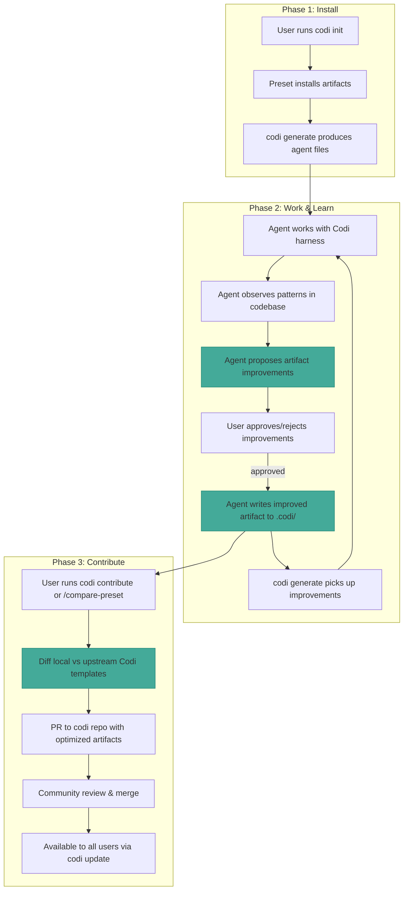
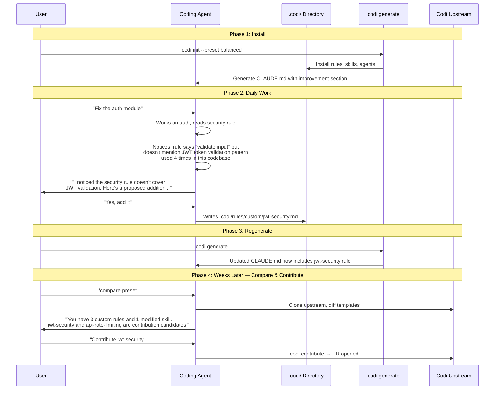
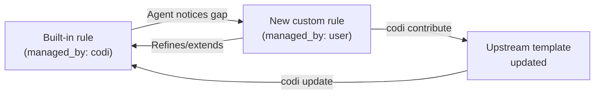
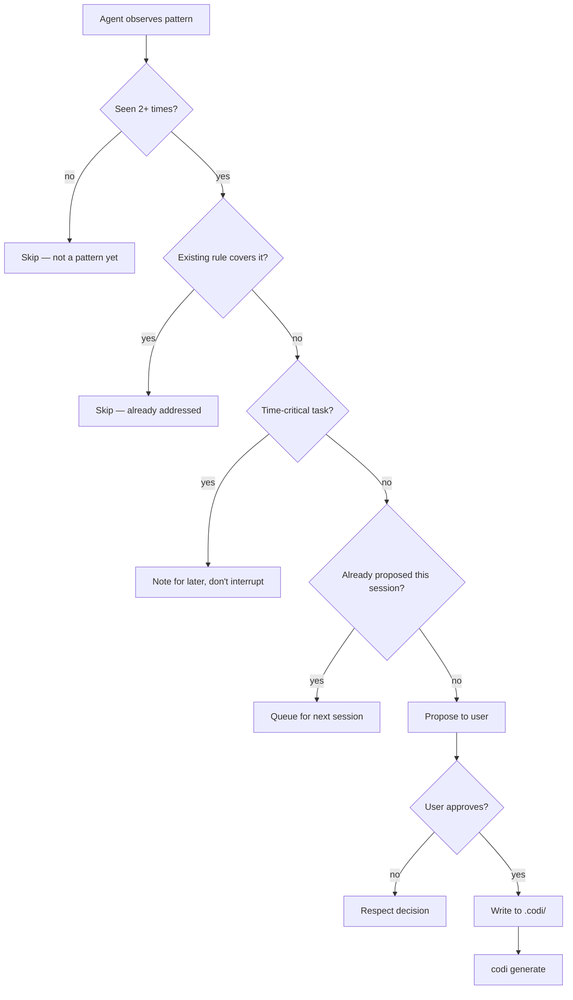
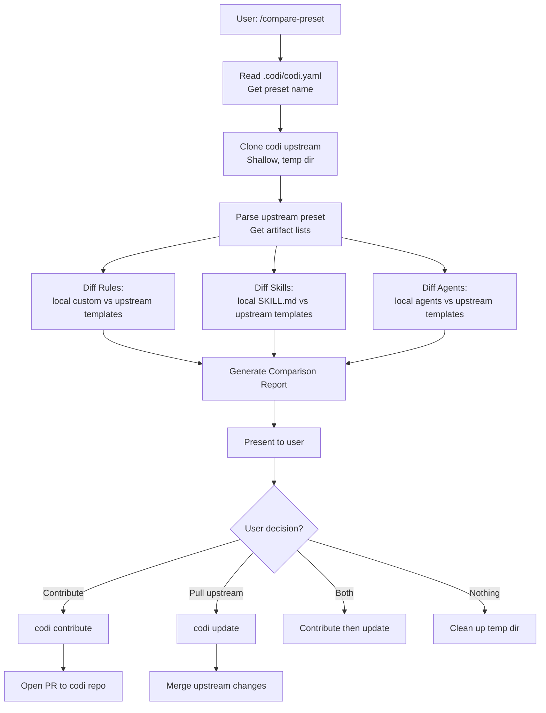
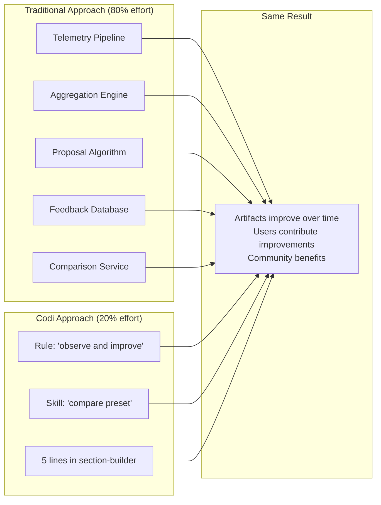

# The 20/80 Self-Improvement Loop: Making Codi Artifacts Evolve Through Agent Work
**Date**: 2026-03-27 19:00
**Document**: 20260327_1900_RESEARCH_codi-self-improvement-20-80.md
**Category**: RESEARCH

## 1. The Pattern



The loop is: **Install → Work → Learn → Improve → Contribute → Community benefits**.

The key question: **what 20% of implementation makes this loop real?**

---

## 2. What Already Exists (Foundation)

Before building anything new, here's what Codi already has:

| Capability | Implementation | Status |
|------------|---------------|--------|
| Artifact templates with `managed_by` ownership | `src/templates/`, frontmatter field | Working |
| Custom rules directory agents can write to | `.codi/rules/custom/*.md` | Working |
| Structured finding output from skills | `code-review`, `security-scan` produce severity-ranked findings | Working |
| Drift detection (hash comparison) | `src/core/config/state.ts` | Working |
| Operations ledger (append-only log) | `src/core/audit/operations-ledger.ts` | Working |
| Contribute workflow (PR or ZIP) | `.codi/skills/contribute/SKILL.md` | Working |
| Verification section appended to generated files | `src/core/verify/section-builder.ts` | Working |
| `codi update --from` pulls upstream changes | `src/cli/update.ts` with `managed_by` checks | Working |

**The foundation is solid.** The gaps are not in infrastructure but in *instructions* and *a comparison mechanism*.

---

## 3. The 20% Implementation: Three Deliverables

The entire self-improving loop can be activated with **three changes**, all of which are templates/content — no new CLI commands, no new infrastructure, minimal code.

### Deliverable 1: The "Codi Improvement" Rule (New Template)

**File**: `src/templates/rules/codi-improvement.ts`
**Effort**: Small (template content only)
**Impact**: This is the seed that plants the idea in every agent's mind.

This rule gets injected into every generated instruction file. It tells the agent:

> "As you work, if you notice that a Codi rule is missing guidance for patterns you see repeatedly, or a skill could be more effective, or an agent template could cover more scenarios — **propose the improvement** to the user and, if approved, write the improvement to the `.codi/` directory."

**What it contains**:

```markdown
# Continuous Artifact Improvement

## Core Principle
As you work with the codebase, you are both a consumer and an improver of the rules,
skills, and agents installed by Codi. When you observe patterns that the current
configuration does not address, propose improvements.

## When to Propose Improvements

- A rule gives guidance that contradicts what the codebase actually does consistently
- A rule is missing a common pattern you encounter repeatedly in this project
- A skill workflow could include an additional step that prevents recurring errors
- An agent's scope is too narrow for tasks you're frequently asked to do
- A BAD/GOOD example in a rule could be more relevant to this specific codebase

## How to Propose

1. **Identify the gap**: Name the specific artifact and what's missing or wrong
2. **Show evidence**: Point to 2-3 real occurrences in the codebase that demonstrate the pattern
3. **Draft the improvement**: Write the exact text that should be added or changed
4. **Present to user**: Show the current vs proposed content and ask for approval
5. **If approved**: Write the change to the appropriate `.codi/` file

## Where to Write Improvements

| Artifact Type | Write Location | Managed By |
|---------------|---------------|------------|
| Rules (built-in) | `.codi/rules/custom/<name>.md` (new custom rule) | user |
| Rules (custom) | `.codi/rules/custom/<name>.md` (edit in place) | user |
| Skills | `.codi/skills/<name>/SKILL.md` | user (after edit) |
| Agents | `.codi/agents/<name>.md` (if custom) | user |

**IMPORTANT**: Never overwrite `managed_by: codi` artifacts directly. Instead:
- For rule improvements: create a new custom rule that extends or refines the built-in
- For skill/agent improvements: create a project-specific version with `managed_by: user`
- The user can later contribute improvements upstream via `codi contribute`

## What NOT to Do

- Do not propose improvements for every minor preference — focus on **recurring patterns**
- Do not rewrite entire rules — propose **incremental additions**
- Do not change artifacts without user approval
- Do not propose improvements during time-critical tasks (bug fixes, incidents)

## Frequency

- Propose at most **one improvement per session**
- Only propose when you have **strong evidence** (2+ occurrences)
- Batch related improvements together rather than proposing them one by one
```

**Why this is high-impact**: Every rule Codi installs is read by every coding agent on every task. By adding this single rule, every agent session becomes a potential improvement opportunity. The rule is conservative (one improvement per session, evidence required, user approval mandatory) to avoid being annoying.

---

### Deliverable 2: The "Compare Preset" Skill (New Template)

**File**: `src/templates/skills/compare-preset.ts`
**Effort**: Medium (skill template + uses existing `codi contribute`)
**Impact**: Closes the loop between local improvements and upstream contribution.

This skill enables agents to diff the locally installed preset against the latest version in the Codi repository.

**What it contains**:

```markdown
# Compare Preset

## When to Activate

- User asks to compare their local Codi setup against the latest version
- User wants to see what they've customized vs what's upstream
- User is preparing to contribute improvements back to Codi
- User runs `/compare-preset`

## Step 1: Identify Local State

**[CODING AGENT]** Read the local configuration:

1. Read `.codi/codi.yaml` to identify the installed preset name
2. List all custom rules: `ls .codi/rules/custom/`
3. List all skills: `ls .codi/skills/`
4. List all agents: Check the manifest for active agents
5. Identify any `managed_by: user` artifacts that started as `managed_by: codi`

## Step 2: Fetch Upstream State

**[CODING AGENT]** Get the latest Codi templates:

```bash
# Clone Codi repo (shallow, temp directory)
TEMP_DIR=$(mktemp -d)
git clone --depth 1 https://github.com/lehidalgo/codi.git "$TEMP_DIR/codi-upstream"
```

Read the corresponding preset from `$TEMP_DIR/codi-upstream/src/templates/presets/`.

## Step 3: Generate Diff Report

**[CODING AGENT]** For each artifact type, compare local vs upstream:

### Rules Comparison
For each rule in the local preset:
1. Read local version from `.codi/rules/custom/<name>.md` or generated `.claude/rules/<name>.md`
2. Read upstream version from `$TEMP_DIR/codi-upstream/src/templates/rules/<name>.ts`
3. Extract the template string content
4. Identify: added sections, removed sections, modified guidance

### Custom Rules (local-only)
List rules in `.codi/rules/custom/` that have no upstream equivalent — these are contribution candidates.

### Skills/Agents Comparison
Same approach: diff local SKILL.md against upstream template string.

## Step 4: Present Report

**[CODING AGENT]** Format the comparison as:

```markdown
## Preset Comparison: [preset-name]

### Local Customizations (contribution candidates)
- **[rule-name]**: [what was added/changed] — [why it's better]
- **[skill-name]**: [what was added/changed] — [why it's better]

### Upstream Updates Available
- **[rule-name]**: upstream added [new section] — [should we pull it in?]
- **[template-name]**: upstream version is newer — [summary of changes]

### Conflicts
- **[artifact-name]**: local and upstream both changed [section] — needs manual resolution

### Recommendation
[Suggest whether to contribute local changes, pull upstream changes, or both]
```

## Step 5: Action

**[CODING AGENT]** Based on user's choice:
- **Contribute local improvements**: Guide through `codi contribute` workflow
- **Pull upstream updates**: Run `codi update` (only updates `managed_by: codi` artifacts)
- **Both**: Contribute first, then pull updates

## Cleanup

```bash
rm -rf "$TEMP_DIR"
```
```

**Why this is high-impact**: This is the bridge between local improvement and community contribution. Without it, improvements stay local forever. With it, users can see exactly what they've improved and contribute with confidence.

---

### Deliverable 3: Improvement Tracking Section in Generated Files (Small Code Change)

**File**: `src/core/verify/section-builder.ts` + `src/adapters/section-builder.ts`
**Effort**: Small (append 5 lines to existing section builder)
**Impact**: Makes the improvement loop visible and persistent.

Add a small section to the verification block in every generated file:

```typescript
// In src/core/verify/section-builder.ts, add to buildVerificationSection():

lines.push('');
lines.push('## Artifact Improvement');
lines.push('');
lines.push('This project uses Codi artifacts that can be improved through use.');
lines.push('When you identify patterns that rules or skills don\'t cover:');
lines.push('1. Propose the improvement with evidence from this codebase');
lines.push('2. If approved, write to `.codi/rules/custom/` or `.codi/skills/`');
lines.push('3. Run `codi generate` to propagate changes');
lines.push('4. Use `/compare-preset` to see local improvements vs upstream');
```

**Why this is high-impact**: This ensures the improvement mindset is embedded in *every single generated file*, not just when the `codi-improvement` rule is selected. Even projects using `minimal` preset get the nudge.

---

## 4. How the Three Deliverables Work Together



---

## 5. What This Does NOT Require

This is the critical "20%" aspect — what we're explicitly **not** building:

| Not Building | Why Not Needed |
|-------------|---------------|
| New CLI commands | Rules/skills are templates; the improvement section is 5 lines in section-builder |
| Finding aggregation engine | The agent's own context window is the aggregation — it sees patterns across a session |
| Usage telemetry | The agent observes directly what rules it uses and which gaps it hits |
| Effectiveness metrics | The agent IS the measurement — if it repeatedly encounters unaddressed patterns, that's the signal |
| Database or new storage | `.codi/rules/custom/` already exists for this purpose |
| Automated proposal generation | The agent IS the proposal engine — it writes the improvement text |
| New state schema | No state tracking needed — custom rules are plain markdown files |

The insight is: **the coding agent itself is the learning layer, the aggregation engine, and the proposal generator**. We don't need to build infrastructure for things the agent already does — we just need to *tell it to do them*.

---

## 6. Per-Artifact Improvement Strategy

Not all artifacts improve the same way. Here's the specific strategy per type:

### Rules: Additive Custom Rules



**Pattern**: Agent never edits built-in rules. Instead, it creates a new custom rule in `.codi/rules/custom/` that **extends** the built-in with project-specific guidance. Example:

- Built-in `security` rule says: "Validate and sanitize ALL user input"
- Agent observes JWT tokens are validated inconsistently across 4 endpoints
- Agent proposes custom rule `jwt-security.md` with specific JWT validation patterns from this codebase
- User can later merge this into the upstream `security` rule template via PR

### Skills: Step Additions

**Pattern**: Agent proposes adding a step or substep to an existing skill. It creates a project-specific version in `.codi/skills/<name>/SKILL.md` with `managed_by: user`. Example:

- Built-in `code-review` skill has 6 steps
- Agent observes that in this monorepo, Step 2 (Read Context) should include checking the CODEOWNERS file
- Agent proposes adding "2b: Check CODEOWNERS for affected paths" as a substep
- User approves, agent edits the local SKILL.md

### Agents: Scope Expansions

**Pattern**: Agent proposes expanding an agent template's scope or adding specialized instructions. Example:

- Built-in `security-analyzer` agent checks OWASP Top 10
- Agent observes this project uses GraphQL, which has specific security concerns (query depth, introspection exposure)
- Agent proposes adding a GraphQL security section to the local agent file

### Commands: Rare, User-Initiated

Commands are less likely to need automatic improvement since they define invocation patterns, not evolving guidance. Improvements here are typically user-initiated ("add a `/deploy` command").

---

## 7. The Improvement Guardrails

The `codi-improvement` rule includes built-in guardrails, but here's the full set:



| Guardrail | Purpose |
|-----------|---------|
| 2+ occurrence threshold | Prevents noise from one-off observations |
| Existing coverage check | Prevents duplicate rules |
| Time-critical task check | Doesn't interrupt urgent work |
| One per session limit | Prevents improvement fatigue |
| User approval required | Human stays in control |
| Write to custom only | Never corrupts managed artifacts |

---

## 8. The Compare-Preset Workflow in Detail

This is the mechanism that turns local improvements into community value:



### What the diff shows:

```
## Preset Comparison: balanced

### Your Improvements (3 custom rules, 1 modified skill)

1. **jwt-security** (custom rule, no upstream equivalent)
   - Adds JWT token validation patterns specific to Express.js middleware
   - Evidence: 4 endpoints in src/api/ follow this pattern
   → Contribution candidate ✓

2. **graphql-security** (custom rule, no upstream equivalent)
   - Adds GraphQL query depth limiting and introspection controls
   - Evidence: project uses Apollo Server with 12 resolver files
   → Contribution candidate ✓

3. **api-pagination** (custom rule, extends api-design)
   - Adds cursor-based pagination pattern used in this project
   → Could be merged into upstream api-design rule

4. **code-review** (modified skill, managed_by: user)
   - Added Step 2b: Check CODEOWNERS for affected paths
   - Added Step 3f: Verify GraphQL schema changes are backward-compatible
   → Contribution candidate ✓

### Upstream Updates Available (2 rules updated since your install)

1. **security**: Upstream added supply-chain attack prevention section
   → Your local version doesn't have this — pull recommended

2. **testing**: Upstream added property-based testing guidance
   → Your local version doesn't have this — pull recommended

### Summary
- 3 improvements ready to contribute
- 2 upstream updates to pull
- Recommendation: Contribute first, then pull updates to get the latest
```

---

## 9. Implementation Checklist

| # | Deliverable | Files | Effort | Dependencies |
|---|-------------|-------|--------|-------------|
| 1 | `codi-improvement` rule template | `src/templates/rules/codi-improvement.ts`, `src/templates/rules/index.ts` | Small | None |
| 2 | `compare-preset` skill template | `src/templates/skills/compare-preset.ts`, `src/templates/skills/index.ts` | Medium | None |
| 3 | Improvement section in generated files | `src/core/verify/section-builder.ts` | Small | None |
| 4 | Add to relevant presets | `src/templates/presets/balanced.ts`, `power-user.ts`, `strict.ts` | Small | #1, #2 |
| 5 | Tests | `tests/unit/templates/rules/codi-improvement.test.ts`, `tests/unit/templates/skills/compare-preset.test.ts` | Small | #1, #2 |

**Total estimated files changed**: 7-9
**Total lines of code changed**: ~200 (mostly template content, ~15 lines of TypeScript logic)
**No new CLI commands, no new infrastructure, no new dependencies.**

---

## 10. Why This Works (The Insight)

The conventional approach to "self-improving systems" involves:
- Building telemetry pipelines
- Creating aggregation engines
- Designing proposal algorithms
- Implementing feedback databases

All of that is the **80% effort that provides 20% value**, because:

1. **The coding agent IS the telemetry** — it directly observes code patterns
2. **The agent's context window IS the aggregation** — it sees patterns across files in a session
3. **The agent IS the proposal engine** — it can write the improvement text
4. **`.codi/rules/custom/` IS the feedback database** — it's just markdown files

The 20% effort is: **tell the agent to do what it's already capable of doing**. A rule that says "observe and propose improvements" plus a skill that says "compare your improvements against upstream" — that's the entire loop.



The trick is recognizing that in a framework where AI agents are the consumers, **the agents themselves are the most powerful feedback mechanism available** — and they work for free if you just ask them.

---

## 11. Risks and Mitigations

| Risk | Mitigation |
|------|-----------|
| Agents propose low-quality improvements | 2+ occurrence threshold, user approval required, evidence-based proposals |
| Improvement fatigue (too many proposals) | One per session limit, time-critical task detection |
| Custom rules diverge wildly from upstream | `/compare-preset` shows the gap; `codi update` reconciles |
| Agent edits `managed_by: codi` files | Rule explicitly prohibits this; write-protection in the instruction |
| Improvements are project-specific, not generalizable | The contribute workflow includes quality guidelines; PR review catches this |
| Compare-preset requires network access | Graceful degradation: skip upstream comparison if offline, show local-only report |

---

## 12. Evolution Path

Once the basic loop works, these extensions become natural:

1. **Improvement log** (`.codi/improvements.log`): Optional append-only log of all proposed improvements with outcomes (accepted/rejected). Not required for the loop to work, but useful for understanding improvement velocity.

2. **Preset scoring**: Compare two presets by counting custom rules and skill modifications. Higher customization = more battle-tested preset.

3. **`codi improve` command**: Automate the comparison + contribution workflow into a single CLI command. Nice-to-have, not needed for v1.

4. **Cross-project learning**: If the same user has Codi installed in 5 projects, improvements in one could be suggested for others. This is a future capability that builds on the custom rules mechanism.

None of these are required. The three deliverables in Section 3 are sufficient to activate the full self-improvement loop.
