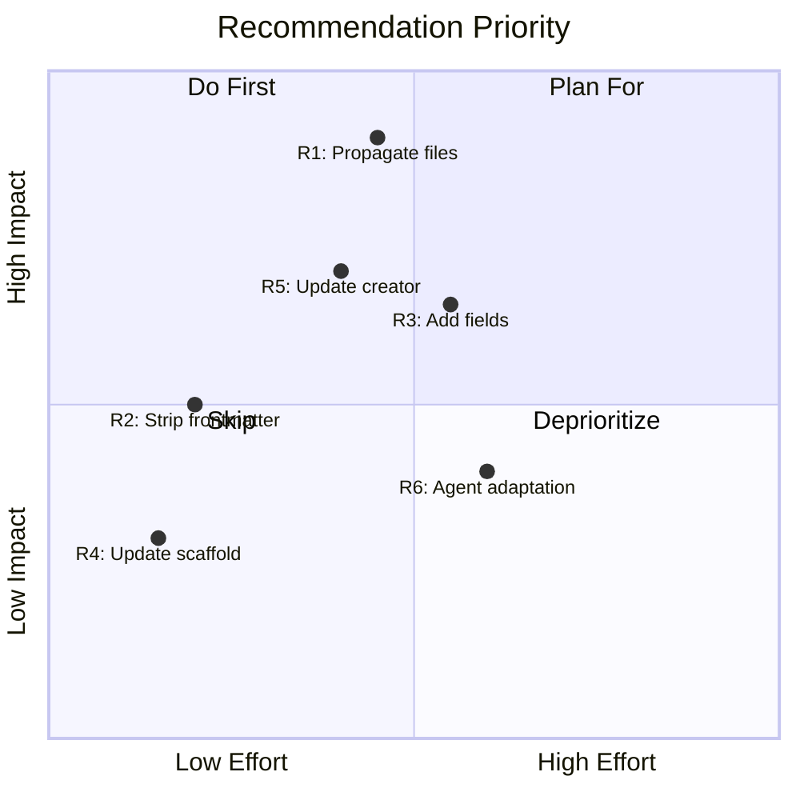

# Skill Generation Evaluation: Codi vs Claude Code Official Architecture

**Date**: 2026-03-27 20:00
**Document**: 20260327_2000_AUDIT_skill-generation-evaluation.md
**Category**: AUDIT

## 1. Introduction

This document evaluates how Codi generates skill artifacts across its 5 supported agents (Claude Code, Cursor, Codex, Windsurf, Cline) and compares the output against the official Claude Code skill architecture documented at [code.claude.com/docs/en/skills](https://code.claude.com/docs/en/skills).

The evaluation addresses two separate concerns:

1. **Generation pipeline** (`codi generate`): What file structure does Codi produce in `.claude/skills/`, `.cursor/skills/`, etc.?
2. **Scaffolding pipeline** (`codi add skill`): What file structure does Codi create in `.codi/skills/` for user-authored skills?

These are different paths — generation produces agent-consumable output, scaffolding produces the source-of-truth authoring environment.

## 2. Claude Code Skill Architecture Overview

Based on the official documentation at [code.claude.com/docs/en/skills](https://code.claude.com/docs/en/skills):

### Expected Directory Structure

```
my-skill/
├── SKILL.md           # Main instructions (REQUIRED)
├── reference.md       # Detailed API docs (optional, loaded when needed)
├── examples.md        # Usage examples (optional, loaded when needed)
├── template.md        # Template for Claude to fill in (optional)
└── scripts/
    └── helper.py      # Utility script (optional, executed not loaded)
```

### SKILL.md Frontmatter Fields (Official)

| Field                      | Required    | Description                                                                |
| -------------------------- | ----------- | -------------------------------------------------------------------------- |
| `name`                     | No          | Display name; defaults to directory name. Lowercase, hyphens, max 64 chars |
| `description`              | Recommended | What the skill does and when to use it. Claude uses this for auto-loading  |
| `argument-hint`            | No          | Hint shown during autocomplete (e.g., `[issue-number]`)                    |
| `disable-model-invocation` | No          | `true` prevents Claude auto-loading. Default: `false`                      |
| `user-invocable`           | No          | `false` hides from `/` menu. Default: `true`                               |
| `allowed-tools`            | No          | Tools Claude can use without permission when skill is active               |
| `model`                    | No          | Model to use when skill is active                                          |
| `effort`                   | No          | Effort level override (`low`, `medium`, `high`, `max`)                     |
| `context`                  | No          | `fork` to run in a forked subagent context                                 |
| `agent`                    | No          | Which subagent type when `context: fork`                                   |
| `hooks`                    | No          | Hooks scoped to this skill's lifecycle                                     |
| `paths`                    | No          | Glob patterns limiting when skill activates                                |
| `shell`                    | No          | Shell for inline commands (`bash` or `powershell`)                         |

### Key Architectural Principles

1. **Directory-based, not file-based**: Each skill is a directory with `SKILL.md` as the entry point
2. **Supporting files are optional**: Reference docs, examples, templates, and scripts live alongside `SKILL.md`
3. **Scripts execute without loading into context**: Only script output consumes tokens
4. **SKILL.md should stay under 500 lines**: Heavy reference material goes to separate files
5. **String substitutions**: `$ARGUMENTS`, `$ARGUMENTS[N]`, `$N`, `${CLAUDE_SKILL_DIR}`, `${CLAUDE_SESSION_ID}`
6. **Dynamic context injection**: `` !`command` `` syntax runs shell commands before skill content is sent
7. **Auto-discovery**: Skills in nested `.claude/skills/` directories are discovered automatically
8. **Description-based triggering**: Claude loads skill descriptions at startup (2% of context window budget)

### What Claude Code Does NOT Expect

- No `evals/` directory (evals are a Codi/skill-creator concept, not a Claude Code native feature)
- No `references/` directory (official docs use flat files alongside SKILL.md)
- No `assets/` directory (not mentioned in official docs)
- No `.gitkeep` files
- No `managed_by` frontmatter field (Codi-specific)
- No `compatibility` frontmatter field (Codi-specific)

## 3. Agent Requirements for Skills

### Per-Agent Skill Support Matrix

| Agent           | Skill Directory            | Skill Files | Inline in Instruction File             | Progressive Loading      | Frontmatter         | Discovery            |
| --------------- | -------------------------- | ----------- | -------------------------------------- | ------------------------ | ------------------- | -------------------- |
| **Claude Code** | `.claude/skills/{name}/`   | `SKILL.md`  | No (separate files)                    | Yes (metadata-only stub) | Yes (official spec) | Auto-discovery       |
| **Cursor**      | `.cursor/skills/{name}/`   | `SKILL.md`  | No (separate files)                    | Yes (metadata-only stub) | Partial             | Manual               |
| **Codex**       | `.agents/skills/{name}/`   | `SKILL.md`  | No (separate files)                    | Yes (metadata-only stub) | Unknown             | Manual               |
| **Windsurf**    | `.windsurf/skills/{name}/` | `SKILL.md`  | Yes (full content in `.windsurfrules`) | No                       | No                  | Via instruction file |
| **Cline**       | `.cline/skills/{name}/`    | `SKILL.md`  | Yes (full content in `.clinerules`)    | No                       | No                  | Via instruction file |

### How Each Agent Consumes Skills

**Claude Code** (`src/adapters/claude-code.ts`):

- Generates `SKILL.md` files in `.claude/skills/{name}/`
- With progressive loading: generates metadata-only stubs pointing to `.codi/skills/{name}/SKILL.md`
- Without progressive loading: generates full `SKILL.md` with all content
- Supports all official frontmatter fields
- Auto-discovers skills from directory structure

**Cursor** (`src/adapters/cursor.ts`):

- Generates `SKILL.md` files in `.cursor/skills/{name}/`
- Same progressive loading behavior as Claude Code
- Frontmatter support is partial (no official Cursor skill spec)

**Codex** (`src/adapters/codex.ts`):

- Generates `SKILL.md` files in `.agents/skills/{name}/`
- Same progressive loading behavior
- Codex skill format is less documented

**Windsurf** (`src/adapters/windsurf.ts`):

- Dual output: inline skill content in `.windsurfrules` AND separate `SKILL.md` files in `.windsurf/skills/`
- No progressive loading support
- No frontmatter support
- Primary consumption is via the instruction file, not skill directories

**Cline** (`src/adapters/cline.ts`):

- Identical pattern to Windsurf: inline in `.clinerules` + separate `SKILL.md` files
- No progressive loading or frontmatter support
- Primary consumption is via the instruction file

## 4. Current Codi Skill Implementation

### 4.1 Generation Pipeline (`codi generate`)

**Source**: `src/adapters/skill-generator.ts`

The `generateSkillFiles()` function generates ONE file per skill:

```typescript
// For each skill, generates:
// {basePath}/{skill-name}/SKILL.md
```

**What `buildSkillMd()` produces** (full mode):

```yaml
---
name: commit
description: Git commit workflow...
# Optional fields if set:
# disable-model-invocation: true
# argument-hint: "..."
# allowed-tools: Read, Grep
# license: MIT
# metadata-key: "value"
---
[skill content from template]
```

**What `buildSkillMetadataOnly()` produces** (progressive loading mode):

```yaml
---
name: commit
description: Git commit workflow...
---
Full skill content available at: .codi/skills/commit/SKILL.md
```

**Generated output structure** (all agents):

```
.claude/skills/commit/
└── SKILL.md          # Only this file — no supporting files
```

### 4.2 Scaffolding Pipeline (`codi add skill`)

**Source**: `src/core/scaffolder/skill-scaffolder.ts`

The `createSkill()` function creates a full directory scaffold:

```
.codi/skills/{name}/
├── SKILL.md                    # Main skill file
├── evals/
│   └── evals.json              # Empty eval scaffold
├── scripts/
│   └── .gitkeep
├── references/
│   └── .gitkeep
└── assets/
    └── .gitkeep
```

**What `evals.json` contains**:

```json
{
  "skill_name": "commit",
  "evals": []
}
```

### 4.3 Template System

Skill templates in `src/templates/skills/` export a template string with:

- Codi-specific frontmatter: `managed_by: codi`, `compatibility: [...]`
- `{{name}}` placeholder substituted during scaffolding
- Full skill body content

The skill-creator template (`src/templates/skills/skill-creator.ts`) documents an 8-step lifecycle including evals, description optimization, and registration.

## 5. Gap and Root Cause Analysis

### Gap 1: Generated Skills Lack Supporting Files

**What's missing**: When `codi generate` runs, it produces only `SKILL.md` per skill. No `scripts/`, `reference.md`, `examples.md`, or other supporting files are generated.

**Impact**: Low-medium. Claude Code auto-discovers supporting files, but they must exist. Skills that would benefit from reference material or helper scripts cannot leverage this feature through the generation pipeline.

**Root cause**: The `generateSkillFiles()` function in `skill-generator.ts` only generates the `SKILL.md` file. It has no mechanism to include auxiliary files from the `.codi/skills/{name}/` source directory.

```typescript
// Current: only generates SKILL.md
files.push({
  path: `${basePath}/${dirName}/${SKILL_OUTPUT_FILENAME}`,
  content,
  sources: [MANIFEST_FILENAME],
  hash: hashContent(content),
});
// Missing: no logic to copy scripts/, reference.md, etc.
```

### Gap 2: Evals Directory Not Part of Claude Code Standard

**What exists**: Codi scaffolds `evals/evals.json` in every skill directory.

**Impact**: Neutral. Claude Code ignores unknown files in skill directories. The evals directory doesn't harm anything, but it also isn't consumed by any agent. It's a Codi-specific authoring tool.

**Root cause**: The skill-creator template designed evals as part of Codi's quality assurance workflow, not as an agent-consumed artifact. This is correct — evals are a build-time concern, not a runtime concern.

### Gap 3: Codi-Specific Frontmatter Fields

**What exists**: Codi templates include `managed_by: codi` and `compatibility: [claude-code, cursor, codex]` in frontmatter.

**Impact**: Low. Claude Code ignores unknown frontmatter fields. However, these fields consume space in the skill description budget (2% of context window).

**Root cause**: Codi needs ownership tracking (`managed_by`) for its update/drift pipeline. This is a valid Codi concern but should ideally be stripped from the generated output.

### Gap 4: Missing Official Frontmatter Fields

**What Codi supports in `buildSkillMd()`**:

| Field                      | Supported | Generated   |
| -------------------------- | --------- | ----------- |
| `name`                     | Yes       | Yes         |
| `description`              | Yes       | Yes         |
| `disable-model-invocation` | Yes       | Conditional |
| `argument-hint`            | Yes       | Conditional |
| `allowed-tools`            | Yes       | Conditional |
| `license`                  | Yes       | Conditional |
| `model`                    | No        | No          |
| `effort`                   | No        | No          |
| `context`                  | No        | No          |
| `agent`                    | No        | No          |
| `hooks`                    | No        | No          |
| `paths`                    | No        | No          |
| `shell`                    | No        | No          |
| `user-invocable`           | No        | No          |

**Impact**: Medium. Skills that need subagent execution (`context: fork`), path-based activation (`paths`), or effort control (`effort`) cannot be configured through Codi.

**Root cause**: Codi's `NormalizedSkill` type was designed before the Claude Code skill spec was finalized. The type doesn't include these fields:

```typescript
// Current NormalizedSkill likely lacks:
// model, effort, context, agent, hooks, paths, shell, user-invocable
```

### Gap 5: `references/` and `assets/` Not Part of Official Spec

**What exists**: Codi scaffolds `references/` and `assets/` directories with `.gitkeep`.

**Impact**: Minimal. These are empty directories with `.gitkeep` files. They don't harm anything but don't match the official Claude Code pattern, which uses flat files alongside `SKILL.md`.

**Official pattern**: `reference.md`, `examples.md` as siblings of `SKILL.md`, not in subdirectories. The official docs say: "Keep references one level deep and link directly from SKILL.md to reference files."

**Root cause**: The scaffold was designed before the official skill spec was published (March 2026). The directory structure was a reasonable guess but doesn't match the published standard.

### Gap 6: No String Substitution Support

**What's missing**: Claude Code supports `$ARGUMENTS`, `$ARGUMENTS[N]`, `$N`, `${CLAUDE_SKILL_DIR}`, `${CLAUDE_SESSION_ID}` in skill content. Codi templates use `{{name}}` (which is resolved at scaffolding time) but don't preserve or support runtime substitutions.

**Impact**: Low. Most Codi skills are reference/workflow skills, not argument-driven. However, skills that accept arguments (like `/fix-issue 123`) can't use Codi templates for this.

**Root cause**: Codi's template system resolves all placeholders at build time. Runtime substitutions are a Claude Code feature, not a Codi feature — but Codi should pass them through unchanged.

### Gap 7: No Dynamic Context Injection Support

**What's missing**: Claude Code supports `` !`command` `` syntax for pre-execution shell commands. Codi templates don't use or preserve this syntax.

**Impact**: Low for current skills. High for advanced skills (like PR summary skills that need live data).

**Root cause**: This is a Claude Code runtime feature. Codi templates should be able to include this syntax, and the generation pipeline should pass it through unchanged. Currently no template uses it.

### Gap 8: Supporting Files Not Propagated to Agent Directories

**What's missing**: Even when a `.codi/skills/{name}/` directory contains `scripts/`, `reference.md`, etc., `codi generate` only copies `SKILL.md` to `.claude/skills/{name}/`. Supporting files are lost.

**Impact**: High. This is the most significant gap. Users who follow the skill-creator's guidance to create scripts and reference files will find that `codi generate` discards them. The `.codi/` directory has the full skill, but the agent never sees the supporting files.

**Root cause**: `generateSkillFiles()` explicitly constructs only the `SKILL.md` content. It never reads the `.codi/skills/{name}/` directory for additional files.

## 6. Evaluation of Codi Preset Artifacts

### Skill Creator (`src/templates/skills/skill-creator.ts`)

**Strengths**:

- Comprehensive 8-step lifecycle (capture intent → scaffold → write → evals → run → grade → optimize → register)
- Detailed description writing guide with BAD/GOOD examples
- Eval format is well-specified with objective pass/fail criteria
- Script bundling guidance (extract after 3+ repetitions)
- 500-line SKILL.md body limit aligns with official Claude Code recommendation

**Gaps vs Official Spec**:

| Skill Creator Teaches                                           | Official Spec Says                                                                                                                       | Gap                                               |
| --------------------------------------------------------------- | ---------------------------------------------------------------------------------------------------------------------------------------- | ------------------------------------------------- |
| Scaffold: `SKILL.md`, `evals.json`, `scripts/`                  | Structure: `SKILL.md`, optional `reference.md`, `examples.md`, `scripts/`                                                                | Missing `reference.md` and `examples.md` patterns |
| Frontmatter: `name`, `description`, `managed_by`                | Frontmatter: `name`, `description`, `disable-model-invocation`, `context`, `agent`, `paths`, `effort`, `model`, `hooks`, `allowed-tools` | Missing 8 frontmatter fields                      |
| No mention of `$ARGUMENTS` substitution                         | Full substitution system: `$ARGUMENTS`, `$N`, `${CLAUDE_SKILL_DIR}`                                                                      | Users can't create argument-driven skills         |
| No mention of `context: fork` subagent execution                | Full subagent support with agent type selection                                                                                          | Users can't create skills that run in isolation   |
| No mention of `` !`command` `` dynamic injection                | Pre-execution shell commands for live data                                                                                               | Users can't create data-fetching skills           |
| No mention of `disable-model-invocation` for side-effect skills | Explicit guidance: use for deploy, commit, send-slack                                                                                    | Users can't control invocation mode               |
| Teaches `compatibility: [claude-code, cursor, codex]`           | Not a Claude Code field                                                                                                                  | Codi-specific field adds no value to Claude Code  |

### Rule Creator, Agent Creator, Command Creator

These are well-aligned with their respective domains and don't have the same Claude Code skill-specific concerns.

## 7. Recommendations for Full Skill Scaffold Generation

### R1: Propagate Supporting Files During Generation (HIGH PRIORITY)

**Change**: Modify `generateSkillFiles()` to scan `.codi/skills/{name}/` for all files and copy them to the agent's skill directory.

```
.codi/skills/commit/             .claude/skills/commit/
├── SKILL.md            →        ├── SKILL.md
├── reference.md        →        ├── reference.md
├── examples.md         →        ├── examples.md
└── scripts/            →        └── scripts/
    └── validate.sh     →            └── validate.sh
```

**What to exclude from copying**: `evals/` (Codi-only), `assets/` (not standard), `.gitkeep` files.

**Files**: `src/adapters/skill-generator.ts`

### R2: Strip Codi-Specific Frontmatter from Generated Output (MEDIUM)

**Change**: Remove `managed_by`, `compatibility`, and any `metadata-*` fields from the generated `SKILL.md` frontmatter. Keep them in `.codi/skills/` (the source) but strip from `.claude/skills/` (the output).

**Why**: These fields consume context budget and aren't consumed by any agent.

**Files**: `src/adapters/skill-generator.ts` (`buildSkillMd()`)

### R3: Add Missing Official Frontmatter Fields to Skill Type (MEDIUM)

**Change**: Extend `NormalizedSkill` to support all official Claude Code frontmatter fields:

```typescript
interface NormalizedSkill {
  // Existing fields
  name: string;
  description: string;
  content: string;
  // Add missing official fields
  model?: string;
  effort?: "low" | "medium" | "high" | "max";
  context?: "fork";
  agent?: string;
  hooks?: Record<string, unknown>;
  paths?: string[];
  shell?: "bash" | "powershell";
  userInvocable?: boolean;
}
```

**Files**: `src/types/config.ts`, `src/adapters/skill-generator.ts`, `src/core/config/normalizer.ts`

### R4: Update Scaffold to Match Official Directory Pattern (LOW)

**Change**: Remove `references/` and `assets/` directories from the scaffold. Add placeholder `reference.md` instead.

```
.codi/skills/{name}/
├── SKILL.md           # Main skill file (required)
├── reference.md       # Reference material (optional placeholder)
├── evals/
│   └── evals.json     # Codi eval suite (Codi-specific, not copied to agents)
└── scripts/           # Helper scripts (optional, copied to agents)
```

**Files**: `src/core/scaffolder/skill-scaffolder.ts`

### R5: Update Skill Creator Template with Official Spec (MEDIUM)

**Change**: Add sections to the skill-creator template covering:

- All official frontmatter fields with usage guidance
- `$ARGUMENTS` substitution with examples
- `context: fork` subagent execution pattern
- `` !`command` `` dynamic context injection
- `disable-model-invocation: true` for side-effect skills
- Supporting file patterns (reference.md, examples.md alongside SKILL.md)
- Remove mention of `compatibility` field

**Files**: `src/templates/skills/skill-creator.ts`

### R6: Agent-Specific Skill Adaptation (LOW)

**Change**: For agents that don't support directory-based skills (Windsurf, Cline), consider concatenating reference files into the inline skill content, since these agents consume skills through their instruction file.

**Rationale**: Windsurf and Cline inline skills into `.windsurfrules`/`.clinerules`. Supporting files in `.windsurf/skills/{name}/` are unlikely to be discovered. The reference content should be merged into the inline section for these agents.

**Files**: `src/adapters/windsurf.ts`, `src/adapters/cline.ts`

### Priority Matrix



## 8. Conclusion

### Summary of Findings

Codi's skill implementation has **two distinct pipelines** with different maturity levels:

**Scaffolding (`codi add skill`)**: Well-designed, creates a comprehensive directory structure with `SKILL.md`, `evals/`, `scripts/`, `references/`, and `assets/`. Includes the 8-step skill-creator lifecycle with eval support. The main gap is that `references/` and `assets/` don't match the official Claude Code flat-file pattern, and the scaffold doesn't teach about official frontmatter fields.

**Generation (`codi generate`)**: **This is where the critical gap is.** Only `SKILL.md` is propagated to agent directories. Supporting files (scripts, references, examples) created in `.codi/skills/` are silently dropped. Users who follow the skill-creator's guidance to create comprehensive skill directories will find that only the `SKILL.md` reaches the agents.

### Current State vs Official Spec

| Aspect                    | Codi Status                   | Official Spec         | Alignment      |
| ------------------------- | ----------------------------- | --------------------- | -------------- |
| Directory-based skills    | Yes                           | Yes                   | Aligned        |
| SKILL.md as entry point   | Yes                           | Yes                   | Aligned        |
| Frontmatter (basic)       | `name`, `description`         | `name`, `description` | Aligned        |
| Frontmatter (advanced)    | 3 of 12 fields                | 12 fields             | Partial        |
| Supporting files          | Scaffolded but not propagated | Core feature          | Gap            |
| Scripts directory         | Scaffolded but not propagated | Executed, not loaded  | Gap            |
| Evals                     | Codi-specific (good practice) | Not part of spec      | Codi extension |
| String substitutions      | Not supported in templates    | Full system           | Gap            |
| Dynamic context injection | Not supported                 | `` !`command` ``      | Gap            |
| Progressive loading       | Yes (metadata stubs)          | Native behavior       | Aligned        |
| Multi-agent output        | 5 agents with adapted formats | Claude Code only      | Codi advantage |

### Recommended Priority Order

1. **R1** — Propagate supporting files during generation (closes the biggest gap)
2. **R5** — Update skill-creator template with official spec guidance
3. **R3** — Add missing frontmatter fields to NormalizedSkill type
4. **R2** — Strip Codi-specific frontmatter from generated output
5. **R4** — Update scaffold directory structure
6. **R6** — Agent-specific skill adaptation for Windsurf/Cline

Sources:

- [Extend Claude with skills - Claude Code Docs](https://code.claude.com/docs/en/skills)
- [Skill authoring best practices - Claude API Docs](https://platform.claude.com/docs/en/agents-and-tools/agent-skills/best-practices)
- [Agent Skills - Claude API Docs](https://platform.claude.com/docs/en/agents-and-tools/agent-skills/overview)
