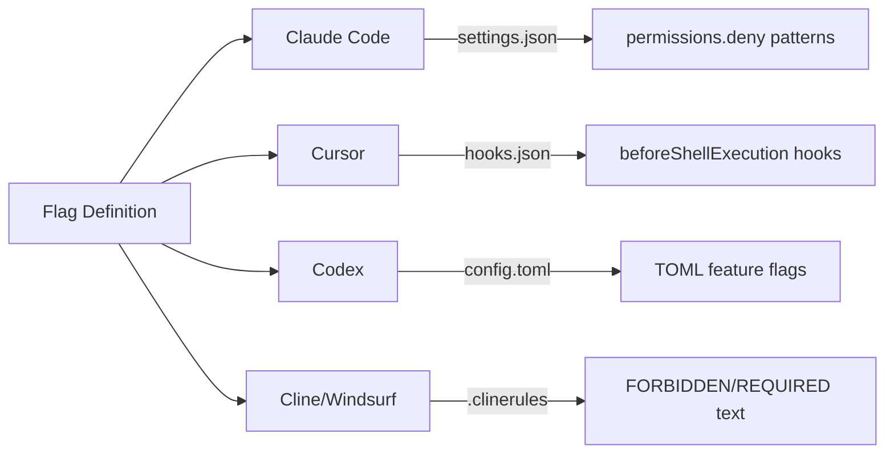
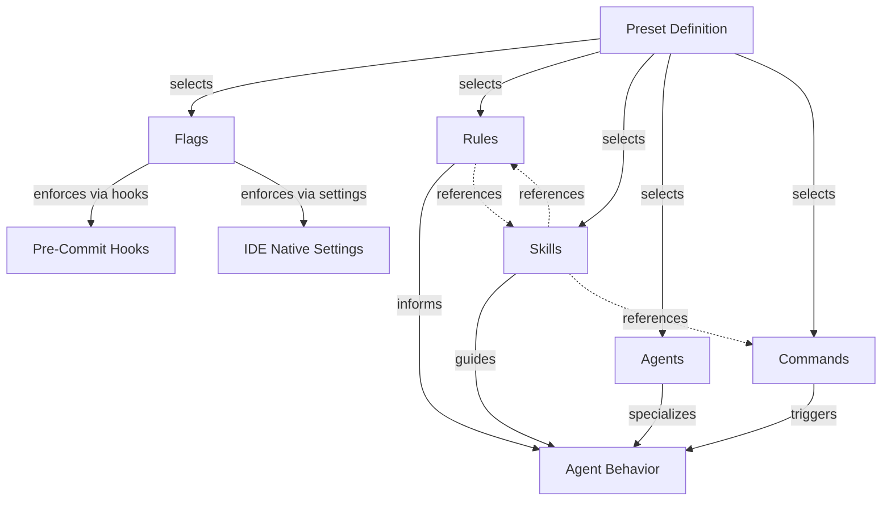
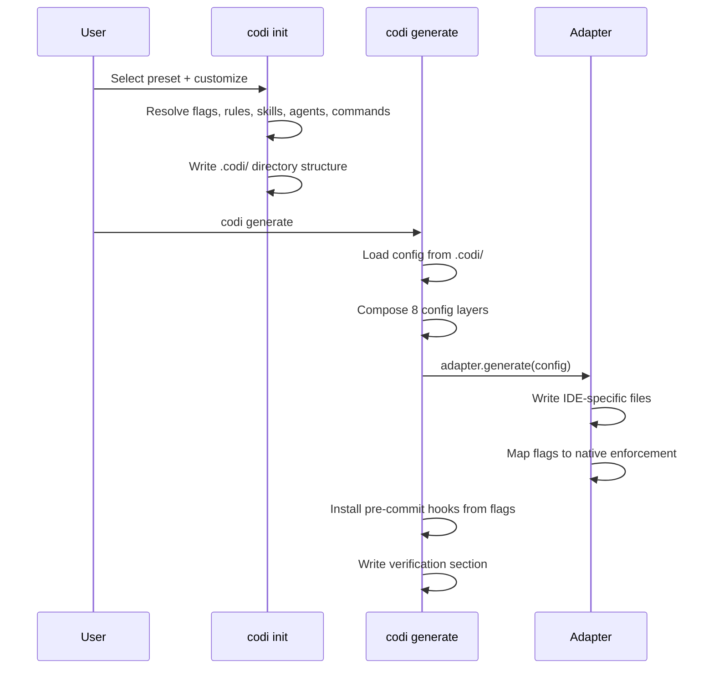
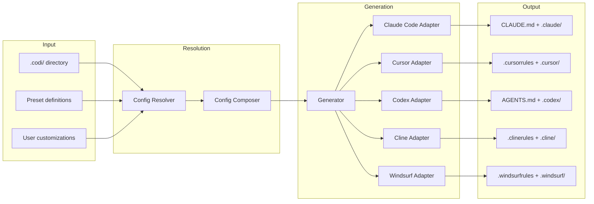

# CODI Framework Architecture
**Date**: 2026-03-28 12:00
**Document**: 20260328_1200_ARCH_codi-framework-architecture.md
**Category**: ARCH

## 1. Introduction

CODI (Configuration for Development Intelligence) is a unified configuration platform that generates IDE-specific instruction files for AI coding agents. It solves a fundamental problem: each AI coding tool (Claude Code, Cursor, Codex, Windsurf, Cline) uses its own configuration format, creating fragmentation when teams want consistent AI behavior across tools.

CODI introduces a **preset-based architecture** where five artifact types compose a unified configuration that gets translated into each tool's native format. This document explains each artifact type, how they interact, and how they collectively form the system's backbone.

## 2. Artifact Definitions

CODI manages five first-class artifact types, each serving a distinct architectural role:

| Artifact | Purpose | Format | Location |
|----------|---------|--------|----------|
| **Flags** | Behavioral constraints and enforcement | YAML key-value | `flags.yaml` |
| **Rules** | Coding standards and conventions | Markdown with frontmatter | `.codi/rules/` |
| **Skills** | Procedural workflows and step-by-step guides | Markdown with frontmatter + directory | `.codi/skills/` |
| **Agents** | Specialized AI persona definitions | Markdown with frontmatter | `.codi/agents/` |
| **Commands** | Slash-command implementations | Markdown with frontmatter | `.codi/commands/` |

Additionally, **Presets** are the composition layer that bundles selections of all five artifact types into a named, shareable configuration.

## 3. Role of Each Artifact

### 3.1 Flags

**Purpose**: Machine-enforceable behavioral constraints that control what the AI agent can and cannot do.

**Design Rationale**: Rules and skills are advisory text that an AI agent interprets. Flags are binary/enum switches that map directly to native enforcement mechanisms in each IDE. A rule saying "don't force push" is a suggestion; a flag `allow_force_push: false` becomes a permissions denial in Claude Code's `settings.json` or a shell hook pattern in Cursor's `hooks.json`.

**Structure** (`src/core/flags/flag-catalog.ts`):
```typescript
{
  type: 'boolean' | 'number' | 'enum' | 'string[]',
  default: unknown,
  hook: string | null,       // Links to pre-commit hook
  description: string,
  hint: string,              // Detailed UX explanation
  valueHints: Record<string, string>,  // Per-value explanations (enum only)
}
```

**Current Flags** (17 total):

| Flag | Type | Effect |
|------|------|--------|
| `auto_commit` | boolean | Agent commits without asking |
| `test_before_commit` | boolean | Pre-commit hook runs test suite |
| `security_scan` | boolean | Pre-commit hook scans for leaked secrets |
| `type_checking` | enum | Pre-commit type checker (strict/basic/off) |
| `max_file_lines` | number | Pre-commit blocks files exceeding limit |
| `require_tests` | boolean | Agent must write tests for new code |
| `allow_shell_commands` | boolean | Agent can run shell commands |
| `allow_file_deletion` | boolean | Agent can delete files |
| `lint_on_save` | boolean | Agent runs linter after modifications |
| `allow_force_push` | boolean | Agent can force push to remote |
| `require_pr_review` | boolean | Agent must create PR instead of merging |
| `mcp_allowed_servers` | string[] | MCP server whitelist |
| `require_documentation` | boolean | Agent must update docs for features |
| `allowed_languages` | string[] | Language restrictions |
| `max_context_tokens` | number | Context window budget |
| `progressive_loading` | enum | Artifact loading strategy (off/metadata/full) |
| `drift_detection` | enum | Config drift severity (off/warn/error) |
| `auto_generate_on_change` | boolean | Auto-regenerate on .codi/ changes |

**Flag Modes**: Each flag has a mode that controls overridability:
- `enforced` — value is locked; lower-precedence layers cannot change it
- `enabled` — active but can be overridden by user or team
- `disabled` — explicitly turned off
- `inherited` — value comes from parent preset
- `delegated_to_agent_default` — defers to the IDE's native default
- `conditional` — applies only when conditions match (language, framework, agent)

**Native Enforcement Mapping**:



### 3.2 Rules

**Purpose**: Declarative coding standards and conventions that guide how the AI agent writes code.

**Design Rationale**: Rules encode "how we write code here" as structured markdown. They are the most numerous artifact type (27 templates) because every language, framework, and practice area needs its own set of conventions. Rules are passive context — they inform the agent's decisions but don't prescribe a step-by-step process.

**Structure**:
```yaml
---
name: security
description: Secret management, input validation, auth, dependencies
managed_by: codi    # 'codi' (template-provided) or 'user' (custom)
---

# Security Rules

## Secret Management
- Never hardcode secrets...

## Input Validation
- Validate and sanitize ALL user input...
```

**Categories**:
- **Language-specific**: typescript, python, golang, java, kotlin, rust, swift, csharp
- **Framework-specific**: react, nextjs, django, spring-boot
- **Practice-specific**: security, testing, performance, architecture, error-handling
- **Workflow**: git-workflow, code-style, documentation, production-mindset, simplicity-first
- **Codi-internal**: codi-improvement (self-improvement rule)

**Key Distinction from Skills**: Rules say "what good code looks like." Skills say "how to perform a task." A rule states "use parameterized queries for SQL"; a skill walks through "Step 1: Identify the query. Step 2: Extract parameters..."

### 3.3 Skills

**Purpose**: Procedural, step-by-step workflows that guide the AI agent through complex multi-step tasks.

**Design Rationale**: Skills fill the gap between declarative rules (what to do) and the agent's own reasoning. They encode institutional knowledge about "how we do things here" — the specific process, not just the principles. Skills are directory-based because complex workflows often need supporting files (scripts, reference data, evaluation criteria).

**Structure**:
```
.codi/skills/code-review/
  SKILL.md              # Main workflow definition
  scripts/              # Executable scripts
  references/           # Reference materials
  assets/               # Images, diagrams
  evals/                # Evaluation criteria
    evals.json          # Test cases for skill quality
```

**SKILL.md Format**:
```yaml
---
name: code-review
description: Structured code review workflow with checklist
compatibility: [claude-code, cursor, codex, windsurf, cline]
managed_by: codi
---

# code-review

## When to Activate
- User asks to review code...

## Step 1: Understand the Change
Read the diff and identify...

## Step 2: Check for Issues
...
```

**Skill Categories** (22 templates):
- **Development**: code-review, commit, refactoring, test-coverage, security-scan
- **Documentation**: documentation, codebase-onboarding, presentation
- **Creation**: codi-skill-creator, codi-rule-creator, codi-agent-creator, codi-command-creator, codi-preset-creator
- **Operations**: codi-operations, codi-contribute, codi-compare-preset
- **Specialized**: mcp, mcp-server-creator, e2e-testing, guided-qa-testing, mobile-development

**Progressive Loading**: Skills support three loading modes via the `progressive_loading` flag:
- `off` — Full skill content inlined into the agent's instruction file
- `metadata` — Only name and description loaded; full content available on demand
- `full` — Complete SKILL.md written to agent-specific directory

### 3.4 Agents

**Purpose**: Specialized AI persona definitions that give the coding agent domain-specific expertise and focus.

**Design Rationale**: A general-purpose coding agent handles everything equally. Agent definitions create specialists — a "security-analyzer" agent focuses on vulnerability detection, a "test-generator" agent focuses on writing tests. This enables multi-agent workflows where different agents handle different aspects of development.

**Structure**:
```yaml
---
name: code-reviewer
description: Reviews code changes for quality, security, and best practices
managed_by: codi
---

# code-reviewer

## Role
You are a senior code reviewer...

## Focus Areas
- Security vulnerabilities
- Performance bottlenecks
- Code style consistency

## Output Format
Provide findings as...
```

**Available Agents** (8 templates):
- code-reviewer, test-generator, security-analyzer, docs-lookup
- refactorer, onboarding-guide, performance-auditor, api-designer

**Key Distinction from Skills**: Agents define "who" (a persona with expertise and focus areas). Skills define "how" (a step-by-step process). An agent definition says "you are a security expert"; a skill says "here is how to perform a security scan."

### 3.5 Commands

**Purpose**: Slash-command implementations that users invoke explicitly (e.g., `/commit`, `/review`).

**Design Rationale**: Commands bridge the gap between the user's intent and the agent's execution. While skills can activate automatically based on context, commands are explicitly triggered by the user typing a slash command. They provide a predictable, repeatable interface for common operations.

**Structure**:
```yaml
---
name: commit
description: Create a well-structured git commit with conventional message format
managed_by: codi
---

# commit

## Instructions
1. Review staged changes...
2. Draft commit message using conventional commits...
3. Run pre-commit hooks...
```

**Available Commands** (16 templates):
- **Git**: commit, review, refactor
- **Quality**: test-run, test-coverage, security-scan, check
- **Navigation**: onboard, codebase-explore, docs-lookup
- **Workflow**: open-day, close-day, session-handoff, roadmap
- **Infrastructure**: index-graph, update-graph

**Key Distinction from Skills**: Commands are user-initiated actions bound to a `/name` trigger. Skills are agent-discoverable workflows that activate based on context or explicit invocation. A command is "run this now"; a skill is "know how to do this."

## 4. Interrelationships Between Artifacts

### 4.1 Dependency Map



### 4.2 Interaction Patterns

**Flags influence all other artifacts**:
- `require_tests: true` makes the "testing" rule more relevant
- `security_scan: true` installs a pre-commit hook regardless of whether the "security" rule is selected
- `progressive_loading: metadata` changes how skills are written to disk
- `max_context_tokens` determines how many artifacts can be loaded simultaneously

**Rules reference skills**: The `codi-improvement` rule tells the agent to "use `codi contribute` to share improvements" — referencing the contribute skill's workflow.

**Skills reference commands**: The `codi-compare-preset` skill instructs the agent to run `codi contribute` after identifying improvements.

**Presets are the composition layer**: A preset doesn't contain artifacts — it references them by name. The `balanced` preset selects `['code-style', 'error-handling', 'codi-improvement']` as rules and `['code-review', 'commit', 'codi-compare-preset']` as skills.

### 4.3 Lifecycle Flow



## 5. Architecture Backbone Explanation

### 5.1 The Preset as Composition Root

The entire CODI architecture centers on the **preset** as the composition root. A preset is a named selection of artifacts:

```typescript
interface BuiltinPresetDefinition {
  name: string;
  description: string;
  version: string;
  author: string;
  tags: string[];
  compatibility: { codi: string; agents: string[] };
  flags: Record<string, FlagDefinition>;
  rules: string[];
  skills: string[];
  agents: string[];
  commands: string[];
  mcpServers: string[];
}
```

This design enables:
- **Shareability**: Teams share presets, not individual config files
- **Composability**: Presets select from a registry of artifacts
- **Customizability**: Users modify a preset's selections without forking it
- **Versioning**: Presets are versioned and can be locked to a specific codi version

### 5.2 The 8-Layer Configuration Precedence

Configuration resolves through 8 layers in strict precedence order:

```
Org (highest) > Team > Preset > Repo > Lang > Framework > Agent > User (lowest)
```

Each layer can contribute flags, rules, skills, agents, and commands. The composer merges them:
- **Arrays** (rules, skills, agents, commands): concatenated
- **Objects** (flags, manifest): merged with precedence
- **Locked flags**: cannot be overridden by lower-precedence layers

### 5.3 The Adapter Pattern

The adapter pattern is the central architectural abstraction. Each IDE implements `AgentAdapter`:

```typescript
interface AgentAdapter {
  id: string;
  name: string;
  detect(projectRoot: string): Promise<boolean>;
  paths: AgentPaths;
  capabilities: AgentCapabilities;
  generate(config, options): Promise<GeneratedFile[]>;
}
```

This enables:
- **Multi-IDE support**: Same .codi/ config produces .cursorrules, CLAUDE.md, AGENTS.md, etc.
- **Capability-based generation**: Cursor can't handle agents or commands, so its adapter skips them
- **Progressive enhancement**: IDEs with larger context windows get more content

### 5.4 The Generation Pipeline



## 6. Overlap and Redundancy Analysis

### 6.1 Rules vs. Skills

**Overlap**: Both contain markdown instructions that guide the agent. A rule about "testing standards" and a skill about "test coverage" both tell the agent how to handle testing.

**Resolution**: The overlap is intentional and complementary. Rules are **declarative principles** (what good code looks like). Skills are **procedural workflows** (how to perform a task). The testing rule says "maintain 80% coverage"; the test-coverage skill says "Step 1: Run coverage tool. Step 2: Identify uncovered lines. Step 3: Write tests for critical paths."

**Verdict**: No consolidation needed. Both serve distinct cognitive roles.

### 6.2 Skills vs. Commands

**Overlap**: Both define actions the agent can perform. The `commit` skill and the `/commit` command both guide the commit process.

**Resolution**: Commands are **user-invoked triggers** (explicit `/slash` syntax). Skills are **context-activated workflows** (the agent recognizes when to use them). A command is always explicitly triggered; a skill can activate automatically when the agent detects a relevant situation.

**Verdict**: Some functional overlap exists by design. The command provides a predictable entry point; the skill provides the detailed workflow. They are complementary.

### 6.3 Agents vs. Rules

**Overlap**: Both influence how the agent behaves. An "api-designer" agent definition and an "api-design" rule both guide API-related work.

**Resolution**: Rules apply **globally** to all agent behavior. Agent definitions create **specialized personas** for specific tasks. The api-design rule applies whenever the agent writes API code. The api-designer agent is a dedicated specialist invoked for API design work specifically.

**Verdict**: Complementary. Rules are horizontal (apply everywhere). Agents are vertical (deep expertise in one area).

### 6.4 Flags vs. Rules

**Overlap**: Both express constraints. The flag `allow_force_push: false` and the git-workflow rule "never force push" say the same thing.

**Resolution**: Flags are **machine-enforceable** (mapped to native IDE settings, hooks, permissions). Rules are **advisory** (the agent reads and interprets them). The flag physically prevents force push via `permissions.deny` in settings.json. The rule explains *why* force pushing is dangerous, giving the agent context.

**Verdict**: Intentional redundancy. Defense in depth — the flag enforces, the rule educates.

### 6.5 Identified Redundancies

| Area | Issue | Recommendation |
|------|-------|----------------|
| `auto_generate_on_change` flag | Overlaps with `codi watch` command | Keep both — flag is the switch, command is the implementation |
| Testing rule + require_tests flag | Flag enforces, rule guides | Complementary, no change needed |
| Multiple creator skills | 5 separate skills for creating 5 artifact types | Consider unifying into single `codi-artifact-creator` with type parameter |

## 7. Improvement Opportunities

### 7.1 Artifact Discovery

**Current**: Artifacts are registered in static `TEMPLATE_MAP` objects in each loader file. Adding a new template requires editing the map, the index.ts export, and possibly preset files.

**Improvement**: Auto-discover templates from the filesystem, deriving the map from the directory contents. This eliminates manual registration and reduces the chance of forgetting to register a new template.

### 7.2 Flag-Rule Linkage

**Current**: Flags and rules are independent — there's no formal link between `security_scan: true` and the `security` rule.

**Improvement**: Add an optional `relatedFlags` field to rule frontmatter, enabling the wizard to suggest related rules when a flag is enabled and vice versa.

### 7.3 Skill Evaluation Framework

**Current**: Skills have an `evals/` directory with `evals.json` but the evaluation framework is not yet implemented.

**Improvement**: Implement the evaluation runner so skill quality can be measured objectively, enabling data-driven improvement of skill templates.

### 7.4 Command-Skill Unification

**Current**: Commands and skills are separate artifact types with separate loaders, scaffolders, and storage.

**Improvement**: Consider making commands a subtype of skills with a `trigger: slash-command` property. This would reduce the number of loaders and simplify the architecture while preserving the functional distinction.

### 7.5 Adapter Capability Matrix Documentation

**Current**: Adapter capabilities are defined in code but not surfaced to users.

**Improvement**: Generate a capability matrix during `codi init` showing which artifacts will be active for each selected agent, so users understand that selecting commands while targeting Cursor will have no effect.

## 8. Conclusion

CODI's architecture is built on a clear separation of concerns across five artifact types:

- **Flags** enforce constraints mechanically
- **Rules** establish coding standards declaratively
- **Skills** encode procedural workflows
- **Agents** define specialized personas
- **Commands** provide explicit user-triggered actions

These artifacts are composed through **presets** and translated into IDE-specific formats through **adapters**. The 8-layer configuration precedence system enables organizational control (org/team layers can lock flags) while preserving developer flexibility (user layer can customize non-locked settings).

The overlaps between artifact types are intentional and follow a defense-in-depth pattern: flags enforce what rules advise, commands trigger what skills detail, and agents specialize what rules generalize. Each artifact type occupies a distinct point on two axes:

```
                    Machine-Enforceable
                          |
                        Flags
                          |
    Declarative ----+-----+-----+---- Procedural
                    |           |
                  Rules       Skills
                    |           |
                  Agents     Commands
                          |
                    Advisory Only
```

The architecture achieves its goal of unified, multi-IDE configuration through disciplined separation of what (rules), how (skills), who (agents), when (commands), and whether (flags).
