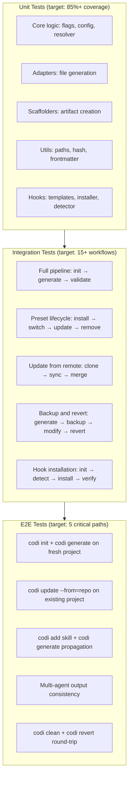

# Testing Analysis and Improvement Plan
**Date**: 2026-03-28 15:00
**Document**: 20260328_1500_REPORT_testing-analysis.md
**Category**: REPORT

## 1. Introduction

This report analyzes the codi CLI testing suite across quantitative coverage, qualitative test design, and strategic gaps. The goal is to identify where automated confidence is strong, where it's weak, and what to prioritize to minimize manual validation.

## 2. Current Test Suite Inventory

| Metric | Value |
|--------|-------|
| Total test files | 80 |
| Unit test files | 78 |
| Integration test files | 2 |
| E2E test files | 0 |
| Total test cases | 902 (894 active + 1 skipped) |
| Non-template source files | 98 |
| Source files with no test | 27 |
| Test coverage ratio (files) | 72% |

### Test Distribution by Module

| Module | Test files | Source files | Ratio |
|--------|-----------|-------------|-------|
| adapters/ | 11 | 11 | 100% |
| cli/ | 22 | 24 | 92% |
| core/flags/ | 4 | 4 | 100% |
| core/hooks/ | 6 | 8 | 75% |
| core/config/ | 5 | 6 | 83% |
| core/preset/ | 5 | 7 | 71% |
| core/audit/ | 2 | 2 | 100% |
| core/backup/ | 1 | 1 | 100% |
| core/verify/ | 3 | 3 | 100% |
| core/skill/ | 1 | 1 | 100% |
| core/version/ | 1 | 1 | 100% |
| core/docs/ | 1 | 2 | 50% |
| scaffolder/ | 2 | 8 | 25% |
| utils/ | 3 | 6 | 50% |
| migration/ | 2 | 2 | 100% |

## 3. Coverage Assessment

**Overall: 67.6% statement | 60.3% branch | 72.2% function | 69.6% line**

### Coverage by Module (sorted worst to best)

| Module | Stmts | Branch | Funcs | Lines | Assessment |
|--------|-------|--------|-------|-------|------------|
| **src/cli** | **47.2%** | 44.8% | 45.6% | 49.1% | Critical gap |
| **src/core/preset** | **68.3%** | 51.9% | 73.5% | 69.1% | Needs work |
| src/core/config | 72.0% | 62.4% | 91.7% | 75.7% | Acceptable |
| src/core/hooks | 74.4% | 73.7% | 76.0% | 76.1% | Acceptable |
| src/core/version | 79.4% | 67.6% | 100% | 78.7% | Good |
| src/core/output | 83.0% | 61.3% | 95.0% | 82.4% | Good |
| src/core/backup | 86.4% | 63.6% | 100% | 92.5% | Good |
| src/core/audit | 89.6% | 70.8% | 100% | 98.5% | Excellent |
| src/core/skill | 92.4% | 77.1% | 84.6% | 95.5% | Excellent |
| src/core/flags | 92.5% | 87.6% | 100% | 94.4% | Excellent |
| src/adapters | 92.9% | 91.0% | 95.8% | 93.8% | Excellent |
| src/utils | 97.6% | 94.4% | 100% | 100% | Excellent |
| src/core/verify | 98.9% | 100% | 94.7% | 100% | Excellent |
| src/core/docs | 97.7% | 71.1% | 100% | 98.8% | Excellent |
| src/schemas | 100% | 100% | 100% | 100% | Complete |

### Worst Individual Files (0-40% coverage)

| File | Stmts | Why |
|------|-------|-----|
| `cli/skill-export-wizard.ts` | 0% | No test file exists |
| `cli/skill.ts` | 0% | No test file exists |
| `cli/hub.ts` | 1.4% | Interactive TUI — hard to test |
| `core/hooks/hook-dep-installer.ts` | 1.9% | No test file exists |
| `cli/add.ts` | 15.3% | Partial coverage via add-wizard tests |
| `cli/preset.ts` | 18.3% | Partial coverage via preset-wizard tests |
| `cli/update.ts` | 34.7% | Only flag/rule update paths tested |
| `cli/preset-handlers.ts` | 39.6% | Complex handler logic |

## 4. Quality Evaluation of Existing Tests

### Strengths

1. **Flag system tests are excellent** — `flag-resolver.test.ts` has 28+ test cases covering 7-layer governance, conditional evaluation, locked flags, and edge cases. This is the gold standard in the codebase.

2. **Integration tests cover the full lifecycle** — `full-pipeline.test.ts` tests init → generate → validate → status → clean → revert → update in sequence. 28 test cases across 8 workflow categories.

3. **Adapter tests are thorough** — each of the 5 adapters has dedicated tests verifying file generation, rule formatting, and MCP config output.

4. **Scaffolder tests validate round-trips** — skill-scaffolder and mcp-scaffolder tests create artifacts and verify file structure.

5. **Schema tests ensure validation** — Zod schemas are tested for valid/invalid inputs.

### Weaknesses

1. **CLI handlers are undertested** — most CLI files (hub.ts, preset.ts, update.ts) have low coverage because they're tested through integration tests that only exercise happy paths.

2. **Error paths often untested** — many tests check `result.ok === true` but few test what happens when operations fail (disk errors, invalid configs, network failures).

3. **No snapshot/golden-file tests** — generated output (CLAUDE.md, .cursorrules, etc.) is not compared against expected baselines. Changes to output format go undetected.

4. **Mock strategy is inconsistent** — some tests use real filesystem (tmpDir), others mock child_process. The contribute.test.ts mocks `execFileAsync` well, but hook tests don't mock system tool detection.

5. **No concurrency/race condition tests** — watch mode, parallel generation, and backup operations have no concurrency testing.

## 5. Gap Analysis

### Critical Gaps (High Risk)

| Gap | Risk | Impact |
|-----|------|--------|
| **CLI preset command** (18% cov) | Users can't manage presets reliably | Preset install/switch/remove untested |
| **CLI update command** (35% cov) | `codi update --from` flow untested | Source-sync from remote repos untested |
| **CLI hub command** (1.4% cov) | Main entry point effectively untested | Interactive menu routing untested |
| **hook-dep-installer** (2% cov) | Hook setup can silently fail | npm/pip dependency installation untested |
| **preset-zip** (no test) | Export/import can corrupt data | ZIP creation and extraction untested |
| **preset-source** (no test) | Remote preset fetching untested | git clone + validation untested |

### Moderate Gaps (Medium Risk)

| Gap | Risk |
|-----|------|
| **Scaffolders** (agent, command, rule, template loaders) — only skill + MCP tested | `codi add agent/command/rule` could break undetected |
| **init-wizard-paths** — no test | Init wizard UX changes could break flag/artifact selection |
| **watch command** — no test | File watching and auto-regeneration untested |
| **stats-collector** — no test | Doc sync statistics could drift |
| **frontmatter/hash/paths utilities** — no test files | Foundational utilities relied on everywhere |

### Low Gaps (Low Risk)

| Gap | Notes |
|-----|-------|
| Template content (100% coverage) | Templates are static strings — coverage is trivially 100% |
| Type/schema files | Types don't need runtime tests |
| generated-header.ts | Simple string concatenation |
| exit-codes.ts | Constants only |

## 6. Recommended Testing Architecture

## 7. Proposed Unit Tests

### Priority 1 — Critical gaps

| File to test | Test file | Key assertions |
|-------------|-----------|----------------|
| `core/preset/preset-zip.ts` | `tests/unit/core/preset/preset-zip.test.ts` | ZIP creation produces valid archive; extraction recovers all files; handles missing files; rejects invalid ZIPs |
| `core/preset/preset-source.ts` | `tests/unit/core/preset/preset-source.test.ts` | fetchPreset clones repo; validates manifest; returns error for invalid URLs |
| `core/scaffolder/rule-scaffolder.ts` | `tests/unit/scaffolder/rule-scaffolder.test.ts` | Already exists but not detected (name mismatch) — verify coverage |
| `core/scaffolder/agent-scaffolder.ts` | `tests/unit/scaffolder/agent-scaffolder.test.ts` | Creates agent .md with frontmatter; rejects invalid names; handles templates |
| `core/scaffolder/command-scaffolder.ts` | `tests/unit/scaffolder/command-scaffolder.test.ts` | Creates command .md; rejects duplicates |
| `core/hooks/hook-dep-installer.ts` | `tests/unit/hooks/hook-dep-installer.test.ts` | Detects missing deps; generates install command; handles install failure |
| `utils/paths.ts` | `tests/unit/utils/paths.test.ts` | resolveCodiDir joins correctly; normalizePath converts separators |
| `utils/frontmatter.ts` | `tests/unit/utils/frontmatter.test.ts` | Parses YAML frontmatter; handles missing frontmatter; preserves content |

### Priority 2 — Moderate gaps

| File to test | Test file | Key assertions |
|-------------|-----------|----------------|
| `core/scaffolder/template-loader.ts` | `tests/unit/scaffolder/template-loader.test.ts` | Loads all available templates; returns error for unknown names |
| `core/scaffolder/skill-template-loader.ts` | `tests/unit/scaffolder/skill-template-loader.test.ts` | Loads skill templates; handles dynamic templates with counts |
| `core/scaffolder/agent-template-loader.ts` | `tests/unit/scaffolder/agent-template-loader.test.ts` | Loads agent templates; returns error for unknown |
| `core/scaffolder/command-template-loader.ts` | `tests/unit/scaffolder/command-template-loader.test.ts` | Loads command templates |
| `core/docs/stats-collector.ts` | `tests/unit/core/docs/stats-collector.test.ts` | Collects correct stats from config |
| `cli/watch.ts` | `tests/unit/cli/watch.test.ts` | Detects file changes; triggers regeneration; debounces |

## 8. Proposed Integration Tests

Add to `tests/integration/` or expand `full-pipeline.test.ts`:

| Test | What it validates |
|------|-------------------|
| **Preset lifecycle** | `init --preset strict` → verify strict flags → `update --preset balanced` → verify flags changed → verify rules updated |
| **Multi-agent consistency** | `init --agents claude-code,cursor,codex` → `generate` → verify all 3 outputs have same rules/flags |
| **Skill propagation** | `add skill test-skill` → `generate` → verify skill appears in all agent outputs |
| **Flag enforcement consistency** | Set `allow_force_push: false` → verify `.claude/settings.json` has deny rule AND `.cursorrules` has text instruction AND `.windsurfrules` has RESTRICTIONS section |
| **Hook round-trip** | `init` with hooks → verify pre-commit installed → verify commit-msg installed → verify scripts run |

## 9. Proposed End-to-End Tests

| Test | What it validates | Why manual today |
|------|-------------------|-----------------|
| **Fresh project init** | Run `codi init` on a real git repo, verify all output files, run `codi validate`, run `codi generate`, verify generated files | Currently manual — automate with tmpdir + git init |
| **Remote update** | `codi update --from=<repo>` clones, syncs, merges | Requires network — mock git clone or use local fixture |
| **ZIP export/import** | `codi contribute --zip` → extract → `codi init --from-zip` | Requires full CLI — automate with handler functions |
| **Drift detection** | Generate → modify output → `codi status` detects drift → `codi generate` fixes it | Partially tested — add explicit file modification step |
| **Clean and revert** | Generate → backup → clean → verify files removed → revert → verify files restored | Partially tested in integration — needs explicit assertions |

## 10. Manual Testing Reduction Plan

### Currently Manual — Can Be Automated

| Manual validation | Automation approach |
|-------------------|-------------------|
| "Does `codi init` wizard work?" | Test handler functions directly with mock prompts (already done for init.test.ts) |
| "Does generated CLAUDE.md look right?" | Snapshot tests comparing output against golden files |
| "Do hooks block force push?" | Integration test that runs git push --force in subprocess |
| "Does `codi` hub menu work?" | Test menu item routing (skip interactive UI) |
| "Does preset switching preserve custom rules?" | Integration test with before/after assertions |

### Still Requires Human Validation

| Manual validation | Why |
|-------------------|-----|
| **IDE integration UX** | Cursor, Windsurf, Cline read generated files differently — requires visual verification in each IDE |
| **MCP server connectivity** | Real MCP servers need network + credentials |
| **Cross-platform testing** | Windows/WSL behavior for hooks — needs real Windows environment |
| **Prompt quality** | Whether generated CLAUDE.md instructions actually make AI agents behave correctly — requires LLM interaction |
| **Init wizard visual flow** | @clack/prompts rendering depends on terminal — unit tests verify logic but not visual UX |

## 11. Prioritized Recommendations

### Tier 1 — Do Now (highest ROI)

1. **Add preset-zip tests** — ZIP operations are completely untested and handle file I/O
2. **Add scaffolder tests** (agent, command, template loaders) — 6 files with 0 coverage, simple to test
3. **Add snapshot tests for generated output** — catch unintended format changes in CLAUDE.md, .cursorrules, AGENTS.md
4. **Add utils tests** (paths, frontmatter, hash) — foundational code used everywhere
5. **Add permission enforcement integration test** — verify all 5 agents get restrictions from the same flags

### Tier 2 — Do Next Sprint

6. **Increase CLI handler coverage** — test error paths in update.ts, preset.ts, add.ts
7. **Add hook-dep-installer tests** — npm/pip install flows
8. **Add preset-source tests** — remote fetching with mocked git
9. **Add watch command tests** — file change detection

### Tier 3 — Do When Stable

10. **Add E2E tests** with real CLI invocations using `execa` or similar
11. **Add cross-agent consistency test** — same config produces equivalent output across all 5 adapters
12. **Add golden file CI** — automated comparison of generated output against checked-in baselines

## 12. Conclusion

The codi test suite is **strong in core logic** (flags, adapters, config) but **weak in CLI handlers and infrastructure** (presets, hooks, scaffolders). The 67.6% overall coverage is acceptable but masks critical gaps: 6 source files at 0% coverage and the entire CLI layer at 47%.

**Biggest wins with least effort:**
1. Scaffolder tests (6 files, simple input/output) — estimate: 2 hours
2. Utils tests (3 files, pure functions) — estimate: 1 hour
3. Snapshot tests for generated output — estimate: 2 hours
4. Permission enforcement integration test — estimate: 1 hour

These 4 items would raise coverage from 67.6% to approximately 75% and catch the most common regression scenarios.
