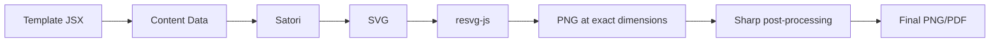
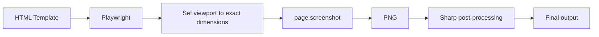

# Programmatic Design Export Tools Research
**Date**: 2026-03-29 20:00
**Document**: 20260329_2000_RESEARCH_design-export-tools.md
**Category**: RESEARCH

---

## Executive Summary

This document evaluates tools for programmatically generating publishable visual content (carousels, social cards, branded visuals) and exporting to PNG/PDF. Tools are categorized by approach: local/open-source, cloud APIs with free tiers, and enterprise-only services.

**Recommendation**: For a Claude Code skill, the **Satori + resvg-js** pipeline is the strongest candidate for local generation. For complex designs, **Playwright screenshots** provide full CSS/HTML fidelity. Cloud APIs like **Bannerbear** or **Creatomate** offer template-based workflows with free/affordable tiers if richer design capabilities are needed.

---

## 1. Local / Open-Source Tools (No API Keys Required)

### 1.1 Satori (Vercel)

| Attribute | Detail |
|-----------|--------|
| **What it does** | Converts HTML/CSS (JSX syntax) to SVG. Paired with `@resvg/resvg-js`, converts SVG to PNG. No browser required. |
| **License** | MPL-2.0 (open source) |
| **npm package** | `satori` (0.26.0) + `@resvg/resvg-js` (2.6.2) |
| **Cost** | Free, fully local |
| **Integration** | npm package, runs in Node.js. Perfect for a CLI skill. |

**How it works**:
1. Define layout in JSX (React-like syntax, no React required)
2. Satori renders to SVG using Yoga Layout (same engine as React Native)
3. resvg-js converts SVG to PNG at exact pixel dimensions

**Strengths**:
- Zero external dependencies (no browser, no network)
- Fast (milliseconds per image)
- Deterministic output (no browser rendering quirks)
- Supports CSS Flexbox, custom fonts (TTF/OTF/WOFF), CSS variables
- Can set exact output dimensions (e.g., 1080x1080 for Instagram)

**Limitations**:
- No WOFF2 font support
- No CSS Grid (Flexbox only)
- No `calc()`, no `z-index`, no 3D transforms
- No CSS selectors (inline styles only)
- No advanced typography (kerning, ligatures, RTL)
- Must provide font files explicitly (no system font access)
- JSX syntax required (not raw HTML)

**Verdict**: Best option for generating social cards, carousels, and branded visuals from structured data. The CSS subset covers 90% of card/carousel design needs. Ideal for a Claude Code skill.

---

### 1.2 @vercel/og

| Attribute | Detail |
|-----------|--------|
| **What it does** | Higher-level wrapper around Satori + resvg-wasm. Designed for Open Graph social cards. |
| **License** | MPL-2.0 |
| **npm package** | `@vercel/og` (0.11.1) |
| **Cost** | Free, fully local |
| **Integration** | npm package, designed for Edge/serverless but works in Node.js |

**Strengths**:
- Simpler API than raw Satori (batteries included)
- Bundles resvg-wasm so no native binary compilation needed
- Designed specifically for social card generation

**Limitations**:
- Same CSS limitations as Satori (it uses Satori internally)
- Primarily designed for Vercel Edge Runtime, may have quirks outside that context
- Less control than using Satori + resvg-js directly

**Verdict**: Good for quick social card generation, but raw Satori + resvg-js offers more control for a skill that needs to support multiple output formats.

---

### 1.3 Puppeteer

| Attribute | Detail |
|-----------|--------|
| **What it does** | Headless Chrome automation. Can render any HTML/CSS and screenshot at exact dimensions. |
| **License** | Apache-2.0 |
| **npm package** | `puppeteer` (24.40.0) |
| **Cost** | Free, fully local |
| **Integration** | npm package, downloads Chromium (~200MB) |

**How it works**:
1. Launch headless Chrome
2. Set viewport to exact dimensions (e.g., 1080x1350 for carousel)
3. Load HTML content via `page.setContent()`
4. Screenshot with `page.screenshot({ type: 'png', clip: { x, y, width, height } })`

**Strengths**:
- Full CSS support (Grid, animations, transforms, everything)
- Full web font support (Google Fonts, WOFF2, variable fonts)
- Can render any web technology (SVG, Canvas, WebGL)
- Precise dimension control via viewport + clip
- Can generate PDF via `page.pdf()`
- Mature, well-documented, massive ecosystem

**Limitations**:
- Requires Chromium download (~200MB)
- Slower than Satori (hundreds of milliseconds per screenshot)
- Higher memory usage
- Browser startup latency (mitigated by reusing browser instance)
- Non-deterministic rendering (slight differences across OS/versions)

**Verdict**: The "nuclear option" that handles any design. Best for complex layouts requiring full CSS. Good fallback when Satori's CSS subset is insufficient.

---

### 1.4 Playwright

| Attribute | Detail |
|-----------|--------|
| **What it does** | Same as Puppeteer but supports Chrome, Firefox, and WebKit. |
| **License** | Apache-2.0 |
| **npm package** | `playwright` (1.58.2) |
| **Cost** | Free, fully local |
| **Integration** | npm package, downloads browser binaries |

**Strengths over Puppeteer**:
- Multi-browser support (WebKit for Safari-accurate rendering)
- More modern API with better defaults
- Built-in auto-waiting reduces flaky screenshots
- Additional output formats: GIF, JP2, TIFF, AVIF, HEIF

**Limitations**:
- Same as Puppeteer (browser dependency, size, speed)
- Slightly larger install footprint if multiple browsers downloaded

**Verdict**: Functionally equivalent to Puppeteer for this use case. Choose Playwright if the project already uses it (this project has a Playwright MCP server available).

---

### 1.5 node-html-to-image

| Attribute | Detail |
|-----------|--------|
| **What it does** | Wrapper around Puppeteer specifically for HTML-to-image conversion. |
| **License** | Apache-2.0 |
| **npm package** | `node-html-to-image` (5.0.0) |
| **Cost** | Free |
| **Integration** | npm package |

**Strengths**:
- Simpler API than raw Puppeteer for HTML-to-image use case
- Supports Handlebars templates for dynamic content injection
- Supports batch generation (multiple images from template + data)

**Limitations**:
- Wraps Puppeteer (same heavyweight dependency)
- Less control than using Puppeteer directly
- Last published over a year ago

**Verdict**: Convenient wrapper but adds no unique value over Puppeteer/Playwright for a custom skill.

---

### 1.6 html-to-image

| Attribute | Detail |
|-----------|--------|
| **What it does** | Browser-side library that converts DOM nodes to images using Canvas + SVG foreignObject. |
| **License** | MIT |
| **npm package** | `html-to-image` (1.11.13) |
| **Cost** | Free |
| **Integration** | npm package (browser-only) |

**Limitations**:
- **Browser-only** (requires a DOM environment). Cannot run in Node.js CLI.
- Not suitable for a CLI-based skill.

**Verdict**: Not applicable for Claude Code skill (requires browser context).

---

### 1.7 Sharp

| Attribute | Detail |
|-----------|--------|
| **What it does** | High-performance image processing (resize, composite, convert formats). Not an HTML renderer. |
| **License** | Apache-2.0 |
| **npm package** | `sharp` (0.34.5) |
| **Cost** | Free |
| **Integration** | npm package with native libvips binding |

**Role in the pipeline**: Sharp can post-process images generated by Satori or Puppeteer (resize, compress, add watermarks, convert formats, composite multiple images).

**Verdict**: Complementary tool, not a standalone solution. Useful for post-processing.

---

### 1.8 CLI Tools

| Tool | Status | Notes |
|------|--------|-------|
| `wkhtmltoimage` | Unmaintained | Uses Qt WebKit (outdated rendering). Not recommended for new projects. |
| Chrome headless CLI | Available | `chrome --headless --screenshot --window-size=1080,1080 file.html` works but less control than Puppeteer |
| `convert` (ImageMagick) | Not installed locally | Can convert between formats but does not render HTML |

---

## 2. Cloud Design Template APIs

### 2.1 Canva Connect API

| Attribute | Detail |
|-----------|--------|
| **What it does** | Create designs, autofill templates, export to PNG/PDF/MP4 |
| **Free tier** | No free tier for Autofill API |
| **Pricing** | Requires Canva Enterprise subscription (price varies, typically $30+/user/month) |
| **Integration** | REST API, OAuth2 |

**Capabilities**:
- Create new designs programmatically
- Autofill brand templates with text, images, and chart data
- Design Editing API (GA): read and update layout, position, size of elements
- Export to PNG, PDF, MP4
- Data Connectors for CRM/spreadsheet integration

**Critical Limitation**: The Autofill API (the most useful feature for programmatic content) requires a **Canva Enterprise** account. This is not available on Free, Pro, or Teams plans.

**Other Limitations**:
- Rate limited to 10 requests/minute per user
- OAuth2 flow requires user authentication (not purely server-to-server)
- Template must be created manually in Canva first

**Verdict**: Powerful but Enterprise-gated. Not suitable unless the user already has a Canva Enterprise subscription.

---

### 2.2 Google Slides API

| Attribute | Detail |
|-----------|--------|
| **What it does** | Create/edit slide decks programmatically. Export to PNG/PDF. |
| **Free tier** | Free with Google account (API quota limits apply) |
| **Integration** | REST API, Google Cloud project required |

**Carousel Use Case**: Create a presentation where each slide = one carousel card, then export each slide as PNG.

**Capabilities**:
- Create presentations and slides programmatically
- Insert text, images, shapes, tables, charts
- Duplicate and manipulate slides
- Export entire presentation to PDF via Drive API
- Export individual slides as PNG thumbnails

**PNG Export Methods**:
1. **Thumbnail API**: `presentations/{id}/pages/{pageId}/thumbnail` (limited resolution)
2. **Drive Export**: Export as PDF, then convert pages to PNG
3. **Google Apps Script**: More control, can export slides as high-res images

**Limitations**:
- Requires Google Cloud project setup and API key/OAuth
- Thumbnail resolution is limited (default 800px wide, max 1600px)
- No direct "export slide as PNG at exact pixel dimensions" endpoint
- Requires internet connection (not local)
- API quota: 300 requests per minute per project (generous)

**Verdict**: Viable for carousel generation with decent quality. Free to use. The resolution limit is the main concern for social media (Instagram carousels need 1080px+).

---

### 2.3 Figma API

| Attribute | Detail |
|-----------|--------|
| **What it does** | Read designs, export renders, access components and styles |
| **Free tier** | Free for personal use |
| **Integration** | REST API + Plugin API + MCP (already available in this project) |

**Critical Finding**: The Figma REST API is **read-only**. It cannot create or modify design nodes.

**What it CAN do**:
- Export existing frames/nodes as PNG, SVG, PDF at specified scale
- Read file structure, components, styles, variables
- Access design tokens and component properties

**What it CANNOT do via REST API**:
- Create new files or nodes
- Modify existing nodes (no PUT/PATCH for design content)
- The `file_content:write` scope is internal and not publicly available

**Write Access**: Only possible through the **Plugin API** (requires Figma editor running) or **Figma MCP** tools that may use plugin bridge.

**Potential Workflow**:
1. Design carousel templates manually in Figma
2. Use REST API to export frames as PNG at desired resolution
3. Use text/image replacement if supported by Figma MCP

**Verdict**: Useful for exporting pre-designed templates, but cannot create designs programmatically via the REST API. The Figma MCP integration in this project could potentially bridge this gap if it supports write operations.

---

### 2.4 Bannerbear

| Attribute | Detail |
|-----------|--------|
| **What it does** | Template-based image and video generation API |
| **Free tier** | Free trial (limited renders) |
| **Pricing** | Starts at $49/month for 1,000 API credits |
| **Integration** | REST API, webhooks |

**Capabilities**:
- Design templates in web editor
- Fill templates via API with text, images, colors
- Generate images (PNG, JPEG), PDFs, and basic video overlays
- Batch generation (collections API for multi-image sets like carousels)
- Auto-resize for different platforms

**Strengths**:
- Purpose-built for this exact use case (social media image generation)
- Collections feature supports carousel generation natively
- Good documentation and SDKs

**Limitations**:
- No free tier beyond trial
- Templates must be designed in Bannerbear's web editor
- Cloud-only (cannot run locally)

---

### 2.5 Creatomate

| Attribute | Detail |
|-----------|--------|
| **What it does** | Image, video, and PDF generation from templates |
| **Free tier** | Free plan with watermarked renders |
| **Pricing** | Starts at $54/month for 2,000 images or 200 videos |
| **Integration** | REST API, Node.js SDK |

**Capabilities**:
- Template editor with layers, animations
- Dynamic text, image, video replacement via API
- Supports PNG, JPEG, PDF, MP4, GIF output
- Batch rendering
- JSON-based template definition

**Strengths**:
- Supports both image and video output
- JSON templates can be version-controlled
- More affordable than Bannerbear per-render
- Free plan available (watermarked)

**Limitations**:
- Cloud-only
- Watermark on free tier
- Template design requires their web editor

---

### 2.6 Placid.app

| Attribute | Detail |
|-----------|--------|
| **What it does** | Image and video generation API with template system |
| **Free tier** | Free trial |
| **Pricing** | Starts at $15/month for 500 credits |
| **Integration** | REST API, Zapier, Make.com, Airtable |

**Capabilities**:
- Visual template editor
- Dynamic content layers (text, images, shapes)
- Image and basic video generation
- Integrations with no-code tools

**Strengths**:
- Cheapest starting tier ($15/month)
- Good no-code integrations
- PDF generation support

**Limitations**:
- Only 500 credits at base tier
- Cloud-only
- Fewer developer-focused features than Bannerbear/Creatomate

---

### 2.7 Renderform

| Attribute | Detail |
|-----------|--------|
| **What it does** | Simple image and PDF generation API from templates |
| **Free tier** | Free plan with limited renders |
| **Pricing** | Starts at ~$15/month |
| **Integration** | REST API |

**Strengths**:
- Simple, lean API focused on reliability
- Good for straightforward template filling
- Free tier available

**Limitations**:
- Fewer features than competitors
- Less documentation and community

---

## 3. Comparison Matrix

### Local Tools (No API Key Required)

| Tool | Output Formats | CSS Support | Speed | Install Size | Complexity |
|------|---------------|-------------|-------|-------------|------------|
| **Satori + resvg-js** | PNG, SVG | Flexbox only | ~50ms/image | ~10MB | Low |
| **Puppeteer** | PNG, JPEG, WebP, PDF | Full CSS | ~200-500ms/image | ~200MB | Medium |
| **Playwright** | PNG, JPEG, PDF, GIF, AVIF | Full CSS | ~200-500ms/image | ~200MB+ | Medium |
| **@vercel/og** | PNG | Flexbox only | ~50ms/image | ~12MB | Low |

### Cloud APIs (Require Account/Key)

| Service | Free Tier | Carousel Support | Starting Price | Template Editor |
|---------|-----------|-----------------|---------------|----------------|
| **Canva API** | None (Enterprise only) | Via multi-page | $30+/user/month | Yes (Canva) |
| **Google Slides** | Yes (generous) | Slide-per-card | Free | Yes (Slides) |
| **Figma API** | Yes (read-only) | Export frames | Free | Yes (Figma) |
| **Bannerbear** | Trial only | Collections API | $49/month | Web editor |
| **Creatomate** | Yes (watermark) | Yes | $54/month | Web editor |
| **Placid** | Trial only | Yes | $15/month | Web editor |
| **Renderform** | Yes (limited) | Limited | ~$15/month | Web editor |

---

## 4. Recommended Architecture for a Claude Code Skill

### Primary Pipeline: Satori + resvg-js (Local, Free)

**Why this pipeline**:
- Runs 100% locally, no API keys needed
- Fast enough for batch generation (carousel = 5-10 images)
- JSX templates can be defined inline by Claude
- Exact pixel dimensions guaranteed
- Font embedding for brand consistency

### Fallback Pipeline: Playwright (Local, Free, Full CSS)

Use when Satori's CSS subset is insufficient (CSS Grid, complex animations, WOFF2 fonts):

### PDF Carousel Generation

For platforms that accept PDF carousels (LinkedIn):
1. Generate individual PNGs via Satori pipeline
2. Use Sharp or a PDF library (`pdf-lib`, `pdfkit`) to combine into multi-page PDF

### Standard Dimensions Reference

| Platform | Format | Dimensions |
|----------|--------|-----------|
| Instagram Carousel | Square | 1080x1080 |
| Instagram Carousel | Portrait | 1080x1350 |
| LinkedIn Carousel | PDF slides | 1080x1080 or 1920x1080 |
| Twitter/X Card | Large | 1200x628 |
| Facebook Post | Image | 1200x630 |
| LinkedIn Post | Image | 1200x627 |
| Story/Reel Cover | Vertical | 1080x1920 |

---

## 5. Key Findings

1. **Satori is the clear winner for local generation** -- zero browser dependency, fast, deterministic, and the CSS Flexbox subset covers card/carousel layouts well.

2. **Canva API is Enterprise-gated** -- the Autofill API (the key feature) requires Canva Enterprise. Not viable without that subscription.

3. **Figma REST API is read-only** -- cannot create designs programmatically. Can only export existing designs. The Figma MCP could potentially help if it supports plugin-level write operations.

4. **Google Slides API is free and viable** for carousel generation (one slide = one card, export as PNG/PDF), but thumbnail resolution caps at ~1600px and requires Google Cloud setup.

5. **Playwright is already available in this project** via MCP server, making it the easiest fallback for full-CSS rendering.

6. **Cloud template APIs** (Bannerbear, Creatomate, Placid) are purpose-built for this use case but require monthly subscriptions and cloud connectivity.

---

## Sources

- [Canva Connect APIs Documentation](https://www.canva.dev/docs/connect/)
- [Canva Create Design API](https://www.canva.dev/docs/connect/api-reference/designs/create-design/)
- [Canva Autofill Guide](https://www.canva.dev/docs/connect/autofill-guide/)
- [Google Slides API Developer Docs](https://developers.google.com/slides)
- [Google Slides to PNG with Apps Script](https://www.labnol.org/code/20580-google-slide-screenshot-images)
- [Figma Developer Docs](https://developers.figma.com/)
- [Figma REST API Introduction](https://developers.figma.com/docs/rest-api/)
- [Figma Compare APIs](https://developers.figma.com/compare-apis/)
- [Satori GitHub Repository](https://github.com/vercel/satori)
- [Satori npm Package](https://www.npmjs.com/package/satori)
- [Satori CSS Support Details](https://deepwiki.com/vercel/satori/4-advanced-usage)
- [Generate Image from HTML Using Satori and Resvg](https://anasrin.dev/blog/generate-image-from-html-using-satori-and-resvg/)
- [Vercel OG Image Generation](https://vercel.com/blog/introducing-vercel-og-image-generation-fast-dynamic-social-card-images)
- [Puppeteer Screenshot Guide](https://www.webshare.io/academy-article/puppeteer-screenshot)
- [Playwright Screenshot Rendering](https://screenshotone.com/blog/how-to-render-screenshots-with-playwright/)
- [Top Bannerbear Alternatives (includes Placid, Creatomate, Renderform)](https://templated.io/blog/best-bannerbear-alternatives/)
- [Top Placid Alternatives](https://templated.io/blog/top-placid-alternatives-for-image-generation/)
- [Creatomate vs Bannerbear](https://creatomate.com/compare/bannerbear-alternative)
