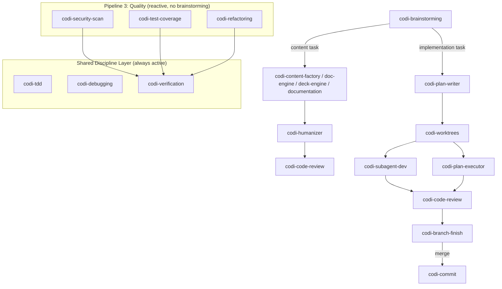

# Superpowers Integration into Codi
**Date**: 2026-04-03 21:08
**Document**: 20260403_210847_[PLAN]_superpowers-integration.md
**Category**: PLAN

## Goal

Create 8 new codi-native workflow skills that absorb the behavioral discipline patterns from the superpowers plugin, plus enhance 1 existing skill. Once complete, the superpowers plugin can be uninstalled. All new skills follow codi conventions (codi- prefix, frontmatter format, template registration, CLAUDE.md routing).

## Architecture: 4 Pipelines + Shared Discipline Layer



### Pipeline 1: Implementation (features, bug fixes, refactors)

```
codi-brainstorming -> codi-plan-writer -> codi-worktrees
    -> codi-subagent-dev OR codi-plan-executor
    -> codi-code-review (enhanced) -> codi-branch-finish
```

### Pipeline 2: Content and Documents

```
codi-brainstorming -> content skill (factory/doc-engine/deck-engine/documentation)
    -> codi-humanizer (opt-in) -> codi-code-review (content mode)
```

### Pipeline 3: Quality and Operations (reactive)

```
codi-security-scan / codi-test-coverage / codi-code-review / codi-refactoring
    -> codi-verification
```

### Pipeline 4: Operations (guided / audit)

Two entry points sharing a common evidence and documentation layer:

```
Entry A — Guided Execution (first-time setup, config, infra, deployment):
codi-guided-execution
    -> [per step] codi-evidence-gathering -> codi-verification -> codi-step-documenter
    -> Final summary in docs/executions/<workflow>/README.md

Entry B — Audit-Fix (systematic audit, migration, fix backlog):
codi-audit-fix
    -> [per item] codi-evidence-gathering -> codi-verification -> commit
```

Shared discipline layer applies to both entries (verification, debugging, tdd when applicable).

## New Skills (12)

### 1. codi-tdd (Shared Discipline Layer)

**Purpose:** Enforce RED-GREEN-REFACTOR as a behavioral discipline, not guidance.

**Key patterns from superpowers:**
- Iron Law: `NO PRODUCTION CODE WITHOUT A FAILING TEST FIRST`
- Mandatory verification: run test, watch it fail, run test, watch it pass
- Delete-and-restart: if code written before test, delete it entirely
- Rationalization table: 11 excuses with counter-arguments
- Red flags: thoughts that signal the agent is about to skip TDD
- Good/bad code examples for each phase

**Integration with existing codi artifacts:**
- Supersedes the 3-line TDD section in `codi-testing` rule (lines 23-27)
- Used by `codi-plan-executor` and `codi-subagent-dev` during task execution
- Used by `codi-debugging` (Phase 4: create failing test before fixing)
- `codi-test-generator` agent dispatched when test structure is unclear

**Frontmatter:**
- `category: Developer Workflow`
- `description` trigger keywords: implementation, feature, bug fix, refactor
- Triggers on: any feature, bug fix, refactor, behavior change

### 2. codi-debugging (Shared Discipline Layer)

**Purpose:** 4-phase systematic root cause analysis. No random fixes.

**Key patterns from superpowers:**
- Iron Law: `NO FIXES WITHOUT ROOT CAUSE INVESTIGATION FIRST`
- Phase 1: Root Cause Investigation (read errors, reproduce, check recent changes, trace data flow)
- Phase 2: Pattern Analysis (find working examples, compare, identify differences)
- Phase 3: Hypothesis Testing (single hypothesis, minimal change, verify)
- Phase 4: Implementation (failing test via codi-tdd, single fix, verify)
- 3+ failed fixes = question the architecture (escalation)
- Supporting references: root-cause-tracing.md, defense-in-depth.md, condition-based-waiting.md

**Integration with existing codi artifacts:**
- Fills the complete absence of debugging methodology in codi
- Uses `codi-tdd` skill for Phase 4 (write failing test)
- Uses `codi-verification` skill before claiming fix is done
- `/codi-check` command provides diagnostic entry point; this skill provides methodology
- `codi-codebase-explorer` agent used during Phase 1 to trace call graphs

### 3. codi-verification (Shared Discipline Layer)

**Purpose:** Evidence-before-claims gate. Targets the known LLM failure of claiming completion without proof.

**Key patterns from superpowers:**
- Iron Law: `NO COMPLETION CLAIMS WITHOUT FRESH VERIFICATION EVIDENCE`
- 5-step gate: IDENTIFY proof command, RUN it, READ full output, VERIFY it matches claim, CLAIM with evidence
- Weasel word detection: "should", "probably", "seems to", "I believe" trigger stop
- Red flags: satisfaction before running checks, planning commits before tests
- Applies to ALL success claims across all pipelines

**Integration with existing codi artifacts:**
- Enhances `codi-workflow` rule's "Self-Evaluation Checklist" with hard verification
- Used by `codi-branch-finish` before presenting completion options
- Used by `codi-plan-executor` and `codi-subagent-dev` after each task
- Used by Pipeline 3 quality skills before reporting findings

### 4. codi-brainstorming (Pipeline Entry Point)

**Purpose:** Universal entry point for non-trivial tasks. Socratic design exploration before implementation.

**Key patterns from superpowers:**
- Hard gate: `DO NOT invoke any implementation skill until design is approved`
- One question at a time, multiple choice preferred
- Propose 2-3 approaches with trade-offs and recommendation
- Present design in sections, get approval after each
- Scope decomposition for large projects
- Spec self-review: placeholder scan, consistency check, ambiguity check

**Integration with existing codi artifacts:**
- Spec saved to `docs/YYYYMMDD_HHMMSS_[PLAN]_feature-name.md` (codi doc convention)
- Uses code graph (per codi-workflow MCP usage order) during context exploration
- Routes to appropriate pipeline based on task type:
  - Implementation -> codi-plan-writer
  - Content -> codi-content-factory / codi-doc-engine / codi-deck-engine / codi-documentation
  - Quality -> typically skips brainstorming (reactive tasks)
- Omits superpowers' "visual companion" (codi has codi-frontend-design for mockups)

### 5. codi-plan-writer (Pipeline 1)

**Purpose:** Break a design spec into atomic, executable implementation tasks.

**Key patterns from superpowers:**
- Iron Law: `NO PLACEHOLDERS -- EVERY TASK MUST CONTAIN EXECUTABLE CODE`
- Each task: 2-5 minutes, follows TDD cycle (test, verify fail, implement, verify pass, commit)
- Every task: exact file paths, complete code blocks, verification commands with expected output
- Self-review: no "TBD", no vague language, type consistency across tasks
- Plan saved to docs/ with codi naming convention

**Integration with existing codi artifacts:**
- Consumes the spec from `codi-brainstorming`
- Plan saved to `docs/YYYYMMDD_HHMMSS_[PLAN]_feature-name-impl.md`
- Terminal state: user chooses codi-subagent-dev (recommended) or codi-plan-executor
- References `codi-tdd` cycle in every task structure

### 6. codi-plan-executor (Pipeline 1)

**Purpose:** Sequential execution of plan tasks with checkpoints. For when subagents are not preferred.

**Key patterns from superpowers:**
- Load plan, create task list, execute sequentially
- Stopping conditions: missing deps, failed tests, unclear instructions, verification failures
- Integrates codi-tdd and codi-verification during execution

**Integration with existing codi artifacts:**
- Requires `codi-worktrees` as prerequisite (isolated workspace)
- Invokes `codi-tdd` during each task
- Invokes `codi-verification` before marking tasks complete
- Terminal state: invokes `codi-branch-finish`

### 7. codi-subagent-dev (Pipeline 1)

**Purpose:** Orchestrate plan execution with fresh subagents per task. Recommended over plan-executor.

**Key patterns from superpowers:**
- Fresh subagent per task (no inherited context)
- Two-stage review: spec compliance check, then code quality check
- 4 status types: DONE, DONE_WITH_CONCERNS, NEEDS_CONTEXT, BLOCKED
- Model selection based on task complexity
- Never dispatch multiple implementers in parallel
- Prompt templates for implementer, spec-reviewer, code-quality-reviewer

**Integration with existing codi artifacts:**
- Requires `codi-worktrees` as prerequisite
- Dispatches `codi-code-reviewer` agent for code quality review stage
- Dispatches `codi-test-generator` agent when tests are needed
- Follows `codi-agent-usage` rule for subagent best practices
- Terminal state: invokes `codi-branch-finish`

### 8. codi-worktrees (Pipeline 1 prerequisite)

**Purpose:** Create isolated git workspaces for feature development.

**Key patterns from superpowers:**
- Directory selection priority: existing .worktrees/ > CLAUDE.md preference > ask user
- Safety: verify directory is gitignored before creating
- Auto-detect project setup (pnpm install, cargo build, pip install, etc.)
- Baseline test verification before declaring ready

**Integration with existing codi artifacts:**
- Required by `codi-plan-executor` and `codi-subagent-dev`
- Cleanup handled by `codi-branch-finish`
- Respects `codi-git-workflow` rule conventions
- Uses `codi-verification` to confirm baseline tests pass

### 9. codi-evidence-gathering (Pipeline 4 shared skill)

**Purpose:** Structured investigation protocol before proposing any change. Reusable across Pipeline 4 and other pipelines requiring formal evidence before action.

**Key patterns:**
- Iron Law: No conclusions without evidence. No evidence without tool usage.
- 5-step protocol: FRAME → SEARCH → COLLECT → ANALYZE → REPORT
- Tool priority order: graph-code MCP → Grep/Glob → Read → Tests → Web research
- Evidence table: Finding | Source | File:Line | Confidence
- Distinguishes confirmed facts vs inferences vs unverified assumptions
- Surfaces open questions rather than guessing

**Integration:**
- Called by `codi-audit-fix` (Phase 2a per item)
- Called by `codi-guided-execution` (Phase 6 per step)
- Feeds into `codi-verification` (evidence gathered here is the verification input)
- Usable standalone: "investigate X before we change it"

### 10. codi-step-documenter (Pipeline 4 shared skill)

**Purpose:** Generates structured step completion documents after each validated workflow step. Accumulates into a reusable guide for the full process.

**Key patterns:**
- 14-section template: title, objective, why it matters, initial situation, actions, agent contributions, user contributions, commands used, decisions made, problems encountered, outcome, validation, reusable guide, next step
- File naming: `docs/executions/<workflow-name>/step-NN-<step-slug>.md`
- Creates directory and README index on first step
- Quality checklist: all sections present, commands exact, reusable guide self-contained

**Integration:**
- Invoked by `codi-guided-execution` after each verified step
- Receives `codi-verification` output for the "How We Validated" section
- Produces source material for the workflow summary doc

### 11. codi-audit-fix (Pipeline 4 Entry B)

**Purpose:** Iterative audit-and-fix agent. Processes items from a list one at a time with evidence gathering, fix proposals, user approval gates, and per-item commits.

**Key patterns:**
- Iron Laws: one item at a time, evidence before proposal, approval before implementation, one commit per item
- Phase 1: Build TODO list (analyze scope, TaskCreate per item, present for review, lock list)
- Phase 2: Process current item (investigate → evaluate → fix proposal with 5 sections → present → STOP → wait for approval)
- Phase 3: Close item (implement → validate → verify → commit → graph update attempt → mark complete)
- Red flags table: 6 rationalization patterns with corrections
- Escalation: pattern detection after 3+ same-type items

**Integration:**
- Uses `codi-evidence-gathering` for Phase 2a investigation
- Uses `codi-verification` in Phase 3 to confirm fixes
- Uses `codi-debugging` for complex root cause analysis
- Produces per-item commits for full traceability

### 12. codi-guided-execution (Pipeline 4 Entry A)

**Purpose:** Collaborative step-by-step execution for first-time technical processes. Agent and user work as a team: agent reasons, plans, and executes what it can; user performs actions requiring credentials, browser access, or external systems.

**Key patterns:**
- Iron Laws: explain before executing, validate before advancing, document every step
- 9-step checklist: understand goal → task list → plan approval → execute → validate → document → update tasks → repeat → summary
- 7-phase step execution protocol per step: framing → rationale → responsibility split → instructions → feedback loop → validation → closure
- Responsibility classification table: agent vs user actions
- Troubleshooting mode: invoke debugging, targeted fix, re-validate, 3-cycle escalation
- Task management: TaskCreate/TaskUpdate with 5 statuses, always shows done/current/next
- Communication: plain language, one thing per message, explicit about what agent can't verify

**Integration:**
- Uses `codi-evidence-gathering` + `codi-verification` for step validation
- Uses `codi-step-documenter` to document each completed step
- Uses `codi-debugging` in troubleshooting mode
- For complex goals: pair with `codi-brainstorming` + `codi-plan-writer` first

## Enhanced Skills (1)

### codi-code-review (enhanced)

**Current state:** Covers performing reviews (analyzing changes, severity-ranked findings).

**Additions from superpowers:**

1. **Requesting reviews section:**
   - When to request: after each subagent task, after features, before merge
   - How to dispatch: commit range, implementation summary, requirements reference
   - Severity-based triage: critical = fix now, important = fix before merge, minor = note

2. **Receiving feedback section:**
   - No sycophantic agreement: ban "You're absolutely right!", "Great point!"
   - Verify feedback against codebase before implementing
   - Push-back patterns: break functionality, lack context, violate YAGNI, contradict architecture
   - Acknowledge valid feedback tersely: "Fixed" or "Good catch on [issue]. Fixed in [location]."

## codi-branch-finish (Pipeline 1 completion)

**Purpose:** Structured branch completion with 4 deterministic options.

**Key patterns from superpowers:**
- Hard gate: verify all tests pass before presenting options
- 4 options: merge locally, create PR, keep branch, discard
- Typed confirmation for discard ("type 'discard' to confirm")
- Worktree cleanup for merge and discard only
- Uses `codi-verification` for fresh test run
- Uses `codi-commit` for merge commits

## Template Registration

Each new skill requires:
1. `src/templates/skills/<name>/template.ts` -- skill template content
2. `src/templates/skills/<name>/index.ts` -- module export
3. Export in `src/templates/skills/index.ts`
4. Entry in `TEMPLATE_MAP` in `src/core/scaffolder/skill-template-loader.ts`
5. Skills with reference files: entry in `STATIC_DIR_MAP` + `staticDir` export

Skills with static reference files:
- `codi-debugging` -- needs `references/root-cause-tracing.md`, `references/defense-in-depth.md`, `references/condition-based-waiting.md`
- `codi-tdd` -- needs `references/testing-anti-patterns.md`
- `codi-subagent-dev` -- needs `references/implementer-prompt.md`, `references/spec-reviewer-prompt.md`, `references/code-quality-reviewer-prompt.md`

## CLAUDE.md Updates

### Skill Routing Table additions

| Task | Examples | Skill |
|------|----------|-------|
| Test-Driven Development | "Write tests first", "Use TDD", "RED-GREEN-REFACTOR" | codi-tdd |
| Debugging | "Debug this", "Find root cause", "Fix this bug systematically" | codi-debugging |
| Verification | "Verify this works", "Prove it passes", "Show evidence" | codi-verification |
| Brainstorming | "Design this feature", "Let's brainstorm", "Explore approaches" | codi-brainstorming |
| Plan Writing | "Write an implementation plan", "Break this into tasks" | codi-plan-writer |
| Plan Execution | "Execute this plan", "Work through these tasks" | codi-plan-executor |
| Subagent Development | "Use subagents for this", "Dispatch agents for implementation" | codi-subagent-dev |
| Git Worktrees | "Create an isolated workspace", "Set up a worktree" | codi-worktrees |
| Branch Completion | "Finish this branch", "Ready to merge", "Clean up branch" | codi-branch-finish |

### Verified skills list

Add: codi-brainstorming, codi-branch-finish, codi-debugging, codi-plan-executor, codi-plan-writer, codi-subagent-dev, codi-tdd, codi-verification, codi-worktrees

## Implementation Order

Batch 1 (independent, can be parallel):
- codi-tdd
- codi-debugging
- codi-verification

Batch 2 (pipeline entry):
- codi-brainstorming

Batch 3 (pipeline middle, depends on brainstorming design):
- codi-plan-writer
- codi-worktrees

Batch 4 (pipeline execution):
- codi-subagent-dev
- codi-plan-executor

Batch 5 (pipeline completion + enhancements):
- codi-branch-finish
- codi-code-review enhancement

Batch 6 (registration):
- Template registration for all 9 skills
- CLAUDE.md updates
- Test verification

## Verification

1. Run `pnpm test` to confirm no regressions
2. Invoke each new skill standalone and verify it loads correctly
3. Walk through Pipeline 1 end-to-end with a small feature
4. Verify Pipeline 2 flow (brainstorming -> content skill -> humanizer)
5. Run `codi generate` to propagate changes
