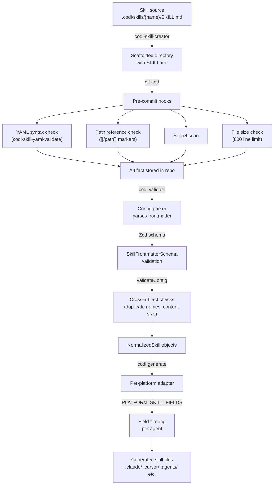
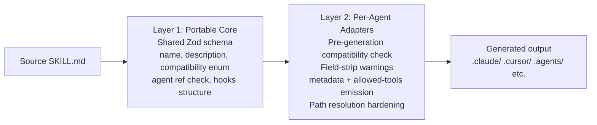

# Skill Compatibility and Validation Audit
**Date**: 2026-04-05 09:27
**Document**: 20260405_092702_[AUDIT]_skill-compatibility-validation.md
**Category**: AUDIT

---

## 1. Executive Summary

This audit assessed the full skill lifecycle in the Codi CLI — from creation through schema validation, generation, and commit hooks — against the official requirements of five target agents: Claude Code, OpenAI Codex, Windsurf, Cursor, and Cline.

**67 production skill artifacts were tested.** All pass basic validation today. However, the audit found:

- **2 critical defects** in the generation pipeline that cause silent data loss
- **4 schema gaps** that accept structurally invalid values without error
- **1 false positive** in a pre-commit hook that flags valid documentation
- **No pre-generation warnings** when platform-incompatible fields are stripped

The recommended fix is a two-layer validation model: a shared portable-skill core validated at parse time, plus per-agent adapters validated before generation, with explicit warnings on field loss.

---

## 2. Agent Skill Compatibility Matrix

### 2.1 What "skills" are called per agent

| Agent | Artifact Name | Discovery File | Skills Directory |
|-------|--------------|---------------|-----------------|
| Claude Code | skill (slash command) | CLAUDE.md | `.claude/skills/{name}/SKILL.md` |
| Codex (OpenAI) | skill | AGENTS.md | `.agents/skills/{name}/SKILL.md` |
| Cursor | skill (reference only) | `.cursorrules` | `.cursor/skills/{name}/SKILL.md` |
| Windsurf | skill (reference only) | `.windsurfrules` | `.windsurf/skills/{name}/SKILL.md` |
| Cline | skill (reference only) | `.clinerules` | `.cline/skills/{name}/SKILL.md` |

### 2.2 Field support matrix

| Field | Claude Code | Codex | Cursor | Windsurf | Cline |
|-------|:-----------:|:-----:|:------:|:--------:|:-----:|
| `name` | Required | Required | Required | Required | Required |
| `description` | Required | Required | Required | Required | Required |
| `user-invocable` | Supported | - | Supported | - | - |
| `disable-model-invocation` | Supported | - | - | - | - |
| `argument-hint` | Supported | - | - | - | - |
| `allowed-tools` | Supported | Supported | Supported | - | - |
| `model` | Supported | - | - | - | - |
| `effort` | Supported | - | - | - | - |
| `context` | Supported | - | - | - | - |
| `agent` | Supported | - | - | - | - |
| `paths` | Supported | - | - | - | - |
| `shell` | Supported | - | - | - | - |
| `license` | Supported | Supported | - | - | - |
| `metadata` | Supported* | Supported* | - | - | - |
| `hooks` | Supported | - | - | - | - |

*`metadata` is declared in `PLATFORM_SKILL_FIELDS` for Claude Code and Codex but is never emitted — see Critical Defect #1.

### 2.3 Invocation and discovery model

| Aspect | Claude Code | Codex | Cursor | Windsurf | Cline |
|--------|:-----------:|:-----:|:------:|:--------:|:-----:|
| Direct slash command | Yes | No | No | No | No |
| Agent auto-discovery from directory | Yes | Yes | No | No | No |
| Content inlined in main rules file | No | No | Partial | Yes (default) | Yes (default) |
| Script execution support | Yes | Yes | No | No | No |
| Max context tokens | 200K | 200K | ~50K | 32K | 200K |

### 2.4 Portability zones

| Zone | Agents | Fields safe to use |
|------|--------|-------------------|
| Zone 1: Universal | All 5 | `name`, `description` + Markdown body |
| Zone 2: Most agents | Claude Code, Codex, Cursor | `allowed-tools` |
| Zone 3: Two agents | Claude Code, Codex | `license` |
| Zone 4: Claude Code only | Claude Code | `user-invocable`, `model`, `effort`, `context`, `agent`, `paths`, `shell`, `hooks`, `disable-model-invocation`, `argument-hint` |

---

## 3. Current Validation Coverage Map

### 3.1 Validation flow



### 3.2 Checks implemented per layer

| Layer | Check | File | Enforces |
|-------|-------|------|----------|
| Creation | Name pattern `^[a-z][a-z0-9-]*$` max 64 chars | `skill-scaffolder.ts:39` | Name format |
| Creation | Directory conflict detection | `skill-scaffolder.ts:78` | No overwrites |
| Pre-commit | YAML frontmatter syntax | `codi-skill-yaml-validate.mjs` | Valid YAML |
| Pre-commit | `[[/path]]` file existence | `codi-skill-resource-check.mjs` | References valid |
| Pre-commit | Secret patterns + entropy | `codi-secret-scan.mjs` | No leaked keys |
| Pre-commit | File line count (800 max) | `codi-file-size-check.mjs` | Size limit |
| Schema | Name pattern + max 64 | `skill.ts:10` | Name format |
| Schema | Description max 1024 | `skill.ts:12` | Description length |
| Schema | Category enum | `skill.ts:22` | Known categories |
| Schema | Effort enum (low/medium/high/max) | `skill.ts` | Effort values |
| Schema | Shell enum (bash/powershell) | `skill.ts` | Shell values |
| Schema | context literal "fork" | `skill.ts` | Context values |
| Validator | Duplicate skill names | `validator.ts` | Uniqueness |
| Validator | Content size (6K chars / 500 lines) | `validator.ts:63` | Content budget |
| Generator | Platform field filtering | `skill-generator.ts:22` | No unsupported fields in output |
| Generator | YAML escaping via `fmStr()` | `skill-generator.ts:75` | Valid YAML output |

---

## 4. Findings Report

### 4.1 Critical findings

---

**CRITICAL-1: `metadata` field is a dead entry — never emitted**

- **Evidence**: `PLATFORM_SKILL_FIELDS` in `skill-generator.ts:37` declares `metadata` for Claude Code and `skill-generator.ts:41` for Codex. No `allowed.has("metadata")` check exists in `buildSkillMd()` (lines 99-169).
- **Root cause**: Field was added to the platform set but the corresponding emission code was not written. `preset-applier.ts:91-97` correctly emits metadata — demonstrating the known pattern that was missed in `skill-generator.ts`.
- **Impact**: Any skill with `metadata:` in source loses that data on every `codi generate`. No warning is produced. Codex users expecting metadata propagation get silent data loss.
- **Affected files**: `src/adapters/skill-generator.ts`
- **Severity**: CRITICAL — silent data loss, round-trip inconsistency

---

**CRITICAL-2: Regex in `resolveSkillRefsForPlatform()` fails silently on bracketed paths**

- **Evidence**: Pattern `/\[\[\s*(\/[^[\]]*?)\s*\]\]/g` uses `[^[\]]*?` which stops at any `[` or `]` character inside the path. A path like `[[/scripts/[v1]/run.sh]]` is not resolved — the marker is left in the output unchanged.
- **Root cause**: Negated character class `[^[\]]*?` was chosen to prevent ambiguous nesting, but this also prevents legitimate bracket characters in file paths (e.g., glob-style or versioned directories).
- **Impact**: Marker remains unresolved in generated output for all platforms. Claude Code gets a literal `[[/scripts/[v1]/run.sh]]` string instead of the resolved path. No error or warning.
- **Affected files**: `src/adapters/skill-generator.ts:90-97`
- **Severity**: CRITICAL — silent resolution failure

---

### 4.2 High findings

---

**HIGH-1: No pre-generation warnings when platform-incompatible fields are stripped**

- **Evidence**: `buildSkillMd()` silently skips any field not in `PLATFORM_SKILL_FIELDS[platformId]`. A skill with `paths: src/**/*.ts` generated for Windsurf loses the path scoping with no output to the user.
- **Root cause**: Stripping was designed as a silent transformation. No warning callback or log call exists at the strip point.
- **Impact**: Users cannot know whether their skill works differently across agents without manually diffing generated outputs. Behavior-changing fields (paths, effort, context) disappear without notification.
- **Affected files**: `src/adapters/skill-generator.ts:99-169`
- **Severity**: HIGH — invisible behavior difference per agent

---

**HIGH-2: `compatibility` array accepts any string — not validated against SUPPORTED_PLATFORMS**

- **Evidence**: `skill.ts:15` uses `z.array(z.string()).optional()`. The validator in `validator.ts` does not cross-check these values against `SUPPORTED_PLATFORMS` from `constants.ts`.
- **Root cause**: Schema was written to accept generic strings. The platform enum is defined separately in `constants.ts` and not imported into the schema.
- **Impact**: A skill with `compatibility: ['claude-code-typo', 'cursor']` passes all validation layers and enters the repository. At generation time, the adapters ignore the field entirely, so the error is never surfaced.
- **Affected files**: `src/schemas/skill.ts:15`
- **Severity**: HIGH — invalid platform names accepted silently

---

**HIGH-3: `fmStr()` YAML serializer is duplicated with divergent behavior**

- **Evidence**: `skill-generator.ts:75-80` and `preset-applier.ts:50-55` both define `fmStr()` with the same base logic. However, `preset-applier.ts` applies `val.replace(/\n+/g, " ").trim()` to metadata values before serializing; `skill-generator.ts` does not (and does not emit metadata at all today).
- **Root cause**: No shared utility module; each file re-implements the function independently.
- **Impact**: When `metadata` emission is added to `skill-generator.ts`, the two serializers will produce different YAML for the same input. Inconsistent YAML quoting may break agent parsers.
- **Affected files**: `src/adapters/skill-generator.ts:75`, `src/core/preset/preset-applier.ts:50`
- **Severity**: HIGH — divergent YAML output risk when metadata emission is fixed

---

### 4.3 Medium findings

---

**MEDIUM-1: `agent` field in skill frontmatter has no existence check**

- **Evidence**: `skill.ts:28` uses `agent: z.string().optional()`. No cross-reference to the parsed agent list exists in `validator.ts`.
- **Root cause**: Cross-artifact validation is not implemented for skills referencing agents.
- **Impact**: A skill with `agent: does-not-exist` passes all validation layers. At runtime (Claude Code), the agent delegation silently fails or falls back.
- **Current exposure**: 1 skill (`codi-skill-creator`) uses `agent: Explore` — valid value. No live violations.
- **Severity**: MEDIUM — latent defect, not exploited today

---

**MEDIUM-2: `hooks` field is `z.unknown()` — no structure validation**

- **Evidence**: `skill.ts:32` uses `z.unknown()`.
- **Root cause**: Hook schema was not defined when the field was added.
- **Impact**: Any value (string, array, deeply nested object, `null`) passes validation. A malformed hook config is silently accepted and emitted as-is.
- **Current exposure**: No production skills use hooks.
- **Severity**: MEDIUM — unvalidated field, no live exposure

---

**MEDIUM-3: `flattenDescription()` does not collapse multiple consecutive newlines**

- **Evidence**: `skill-generator.ts:70-72` replaces `\n\s*` with a single space. Input `"Line 1\n\n\nLine 2"` produces `"Line 1   Line 2"` (3 spaces).
- **Impact**: Generated frontmatter has extra spaces in description values when source has blank lines.
- **Severity**: MEDIUM — cosmetic but produces invalid YAML style

---

**MEDIUM-4: `user-invocable` is always emitted even when it equals the default (`true`)**

- **Evidence**: `skill-generator.ts:116-119` always pushes `user-invocable: ${invocable}` when the platform supports the field.
- **Impact**: Generated files contain `user-invocable: true` for skills that never set it. This inflates frontmatter and creates noise when diffing source vs generated.
- **Severity**: MEDIUM — semantic noise, no behavior impact

---

### 4.4 Low findings

---

**LOW-1: False positive in `codi-skill-resource-check` for `codi-skill-creator`**

- **Evidence**: `codi-skill-creator/SKILL.md` contains example documentation showing the `${CLAUDE_SKILL_DIR}[[/path]]` pattern in a code block. The pre-commit hook regex matches this as an actual file reference and checks for file existence.
- **Impact**: May block commits if the example path doesn't exist on the local system. Currently passing because the example path is a pattern illustration, not a real reference.
- **Recommendation**: Exclude content inside fenced code blocks from the resource reference check.
- **Severity**: LOW — false positive in documentation example

---

**LOW-2: `tools` and `allowedTools` fields are not validated against any registry**

- **Evidence**: Both fields are `z.array(z.string()).optional()` with no validation.
- **Current exposure**: No production skills use these fields.
- **Impact**: Invalid tool names accepted silently.
- **Severity**: LOW — not used today

---

**LOW-3: `model` field accepts any string — not validated against known Claude models**

- **Evidence**: `skill.ts` uses `model: z.string().optional()`.
- **Impact**: `model: claude-100-megabrain` passes validation and fails only at runtime.
- **Severity**: LOW — will fail at runtime, not silently

---

## 5. Validator and Generator Gap List

### Schema gaps (parse-time)

| Gap | Field | Expected Validation | Current Validation |
|-----|-------|-------------------|-------------------|
| S-1 | `compatibility` | Enum from SUPPORTED_PLATFORMS | Any string array |
| S-2 | `agent` | Exists in parsed agent list | Any string |
| S-3 | `hooks` | Structured hook schema | `z.unknown()` |
| S-4 | `tools` / `allowedTools` | Against MCP registry or known tools | Any string array |
| S-5 | `model` | Known Claude model identifier | Any string |
| S-6 | `paths` | Valid glob patterns | `z.union([z.array(), z.string()])` |

### Generator gaps (generation-time)

| Gap | Location | Issue |
|-----|----------|-------|
| G-1 | `skill-generator.ts:37,41` | `metadata` declared in PLATFORM_SKILL_FIELDS, never emitted |
| G-2 | `skill-generator.ts:90-97` | Bracket chars in paths break `[[/path]]` resolution |
| G-3 | `skill-generator.ts:99-169` | No warning when fields are stripped per platform |
| G-4 | `skill-generator.ts:70-72` | `flattenDescription()` leaves multiple spaces after multi-newline |
| G-5 | `skill-generator.ts:75` | `fmStr()` duplicated; diverges from `preset-applier.ts:50` |

### Hook gaps (commit-time)

| Gap | Location | Issue |
|-----|----------|-------|
| H-1 | `codi-skill-yaml-validate` | Validates YAML syntax but not SkillFrontmatterSchema fields |
| H-2 | `codi-skill-resource-check` | Regex matches code-block examples (false positives) |
| H-3 | (missing) | No check: skill `compatibility` values are valid platform names |
| H-4 | (missing) | No pre-generation compatibility check before `codi generate` |

---

## 6. Recommended Schema Model

### 6.1 Two-layer validation architecture



### 6.2 Layer 1: Shared portable core (schema changes)

**File: `src/schemas/skill.ts`**

```typescript
// Replace: compatibility: z.array(z.string()).optional()
// With:
compatibility: z.array(z.enum(SUPPORTED_PLATFORMS as [string, ...string[]])).optional()

// Add: hooks structured schema
const HookConfigSchema = z.object({
  onActivate: z.string().optional(),
  onComplete: z.string().optional(),
  onError: z.string().optional(),
}).catchall(z.string());

// Replace: hooks: z.unknown().optional()
// With:
hooks: HookConfigSchema.optional()
```

**File: `src/core/config/validator.ts`**

Add to `validateSkills()`:
```typescript
// Validate agent field reference
if (skill.agent && !knownAgentNames.includes(skill.agent)) {
  errors.push(`Skill "${skill.name}" references unknown agent: "${skill.agent}"`);
}
```

### 6.3 Layer 2: Per-agent adapter hardening

**File: `src/adapters/skill-generator.ts`**

Add pre-generation warning function before `buildSkillMd()`:

```typescript
function warnStrippedFields(skill: NormalizedSkill, platformId: PlatformId): void {
  const allowed = PLATFORM_SKILL_FIELDS[platformId];
  const lossy = [
    skill.model && "model",
    skill.effort && "effort",
    skill.context && "context",
    skill.agent && "agent",
    skill.paths?.length && "paths",
    skill.shell && "shell",
    skill.hooks && "hooks",
    skill.argumentHint && "argument-hint",
  ].filter((f): f is string => !!f && !allowed.has(f));

  if (lossy.length > 0) {
    Logger.getInstance().warn(
      `Skill "${skill.name}" (${platformId}): stripping unsupported fields: ${lossy.join(", ")}`
    );
  }
}
```

Add metadata emission inside `buildSkillMd()`:
```typescript
if (allowed.has("metadata") && skill.metadata && Object.keys(skill.metadata).length > 0) {
  const lines = Object.entries(skill.metadata)
    .map(([k, v]) => `  ${k}: ${fmStr(v.replace(/\n+/g, " ").trim())}`)
    .join("\n");
  frontmatter.push(`metadata:\n${lines}`);
}
```

Fix regex in `resolveSkillRefsForPlatform()`:
```typescript
// Replace: /\[\[\s*(\/[^[\]]*?)\s*\]\]/g
// With:    /\[\[\s*(\/[^\]]+?)\s*\]\]/g
// Allows brackets inside paths, stops only at first ]
```

Extract shared `fmStr()` to `src/utils/yaml-serialize.ts`.

---

## 7. Pre-Commit and CI Hardening Proposal

### 7.1 Pre-commit additions

| Hook | What to add | Priority |
|------|-------------|----------|
| `codi-skill-yaml-validate` | Run full SkillFrontmatterSchema Zod parse (not just YAML syntax) | HIGH |
| `codi-skill-compat-check` (new) | Validate `compatibility` values against SUPPORTED_PLATFORMS | HIGH |
| `codi-skill-resource-check` | Exclude fenced code block content from path reference scan | MEDIUM |
| `codi-artifact-validate` | Add pre-generate compatibility check: flag fields declared but not supported by listed `compatibility` platforms | MEDIUM |

### 7.2 CI additions

| Check | Description | Trigger |
|-------|-------------|---------|
| Round-trip consistency | Generate for all platforms, verify output matches expected fixture | On PR |
| Platform field coverage | Verify PLATFORM_SKILL_FIELDS entries all have emission code | On PR |
| Dead entry detection | Lint check: any field in PLATFORM_SKILL_FIELDS that has no `allowed.has(field)` check | On PR |
| Snapshot diff | Compare generated `.claude/`, `.cursor/`, `.agents/` output against committed snapshots | On PR |

---

## 8. Regression Test Suite Design

### 8.1 Golden fixtures (valid skills per agent)

Create `tests/fixtures/skills/` with one known-valid SKILL.md per agent. Test that:
- Generation succeeds for that agent
- Generated output contains exactly the expected fields
- No unexpected fields appear

### 8.2 Negative fixtures (malformed skills)

Create test cases that verify each validator REJECTS:
- Invalid platform in `compatibility` array
- `name` containing uppercase letters
- `description` exceeding 1024 chars
- `hooks` as a bare string (not an object)
- `agent` referencing a name not in the agent registry

### 8.3 Round-trip generation tests

For a skill with all supported fields set:
- Source → generate Claude Code → parse generated output → assert all Claude Code fields preserved
- Source → generate Codex → assert `metadata` field present in output (after fix)
- Source → generate Windsurf → assert only `name` and `description` in frontmatter

### 8.4 Path resolution tests

Cover:
- Standard path: `[[/scripts/run.sh]]`
- Path with brackets: `[[/scripts/[v1]/run.sh]]`
- Path with extra whitespace: `[[ /scripts/run.sh ]]`
- `${CLAUDE_SKILL_DIR}[[/scripts/run.sh]]` for Claude Code
- Same for Windsurf/Cline (verify `${CLAUDE_SKILL_DIR}` is stripped)

### 8.5 Pre-commit enforcement tests

Confirm that hooks block:
- Skill with invalid YAML frontmatter
- Skill referencing a non-existent file path
- Skill with `compatibility: ['not-a-real-agent']`
- Skill with `name: Invalid Name` (space, uppercase)

---

## 9. Implementation Backlog (Prioritized)

| # | Item | File(s) | Effort | Impact |
|---|------|---------|--------|--------|
| 1 | Fix: emit `metadata` field in `buildSkillMd()` | `skill-generator.ts` | XS | CRITICAL |
| 2 | Fix: update regex in `resolveSkillRefsForPlatform()` to allow `[` in paths | `skill-generator.ts:90` | XS | CRITICAL |
| 3 | Extract shared `fmStr()` / `serializeYamlScalar()` to `src/utils/yaml-serialize.ts` | new file + 2 imports | S | HIGH |
| 4 | Add `warnStrippedFields()` pre-generation logging | `skill-generator.ts` | S | HIGH |
| 5 | Validate `compatibility` against SUPPORTED_PLATFORMS in schema | `skill.ts` | XS | HIGH |
| 6 | Add `agent` field cross-reference check in `validateConfig()` | `validator.ts` | S | MEDIUM |
| 7 | Define and enforce `HookConfigSchema` in `skill.ts` | `skill.ts` | M | MEDIUM |
| 8 | Fix `flattenDescription()` to collapse multiple spaces | `skill-generator.ts:70` | XS | MEDIUM |
| 9 | Fix `user-invocable` emission to skip when value is default `true` | `skill-generator.ts:116` | XS | MEDIUM |
| 10 | Upgrade `codi-skill-yaml-validate` hook to run full Zod schema parse | hook template | M | HIGH |
| 11 | Add new `codi-skill-compat-check` pre-commit hook | hook template + catalog | M | HIGH |
| 12 | Fix `codi-skill-resource-check` to exclude fenced code blocks | hook template | S | LOW |
| 13 | Add round-trip consistency integration test | `tests/integration/` | M | HIGH |
| 14 | Add golden fixture tests per agent | `tests/fixtures/` | M | MEDIUM |
| 15 | Add CI dead-entry lint check for PLATFORM_SKILL_FIELDS | CI config | S | MEDIUM |

**Effort key**: XS = < 1 hour, S = 1-3 hours, M = 3-8 hours

---

## 10. Definition of Done for Future Skill Compliance

A skill artifact is compliant when it satisfies all of the following:

**Schema compliance:**
- `name` matches `^[a-z][a-z0-9-]*$`, max 64 characters
- `description` is present, max 1024 characters, single line
- `compatibility` (if present) lists only values from SUPPORTED_PLATFORMS
- `agent` (if present) exists in the project's agent registry
- `hooks` (if present) conforms to HookConfigSchema
- `paths` (if present) are valid glob patterns

**Generation compliance:**
- All fields declared in source that are supported by each listed `compatibility` agent appear in generated output
- No unsupported fields appear in generated output for any agent
- `[[/path]]` markers resolve correctly for all platforms
- `${CLAUDE_SKILL_DIR}` is stripped in non-Claude-Code output

**Pre-commit compliance:**
- YAML frontmatter parses without error
- All `[[/path]]` references point to existing files (excluding code block content)
- No hardcoded secrets detected
- File is under the line count limit
- `compatibility` values are valid platform names

**CI compliance:**
- Round-trip generation test passes for all declared `compatibility` agents
- Generated output snapshot matches committed expected fixture

---

## 11. Success Criteria Status

| Criterion | Status |
|-----------|--------|
| Each supported agent has an explicit, documented validation contract | Done (this document, Section 2) |
| Every skill creation path is validated against target-agent rules | Partial — schema validates format, not agent compatibility |
| Generated skills cannot bypass structural validation | Not yet — pre-generation field check not implemented |
| Commit hooks block malformed or incompatible skills reliably | Partial — YAML syntax blocked, schema-level checks not run |
| Known edge cases are covered by automated tests | Not yet — round-trip and fixture tests not implemented |
| Cross-agent compatibility risks are visible before merge | Not yet — no CI compatibility report |
