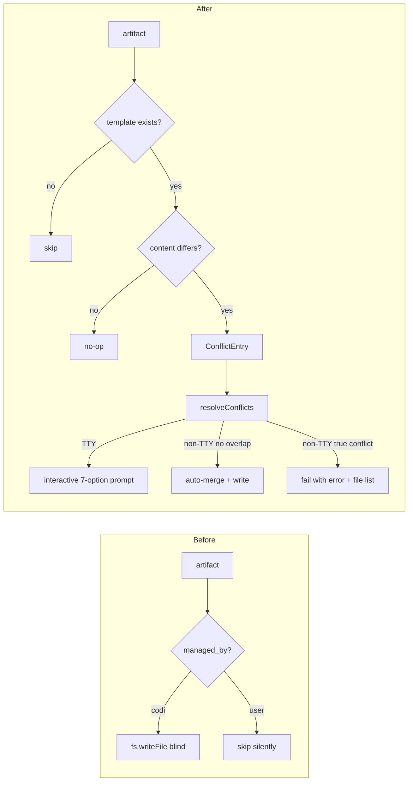

# Conflict Resolver for All Update/Generate Operations
**Date**: 2026-04-05 12:20:15
**Document**: 20260405_122015_[PLAN]_conflict-resolver-update-generate.md
**Category**: PLAN

## Summary

All artifact update and generate operations must route changed files through the conflict resolver. No file may be silently overwritten or silently skipped. In non-interactive environments, non-overlapping changes are auto-merged; true conflicts cause a hard failure with a clear error listing affected files.

---

## Problem Statement

Current behavior has two critical gaps:

1. `codi update --rules/--skills/--agents` blindly overwrites `managed_by: codi` artifacts and silently skips `managed_by: user` artifacts - neither goes through the conflict resolver.
2. `resolveConflicts()` in non-TTY mode auto-accepts all conflicts, silently destroying local modifications.

---

## Design

### Approach

Targeted surgical changes to two files. No new abstractions. Mirrors the pattern already used in `generator.ts`.

---

## Change 1: `src/utils/conflict-resolver.ts` — Non-TTY default

**Location**: lines 239-244

**Current behavior**: auto-accept all conflicts, log a warning.

**New behavior**:
1. Attempt `buildConflictMarkers(current, incoming)` for each conflict
2. If `hasConflicts === false`: push to `merged` (auto-merged successfully)
3. If `hasConflicts === true`: push to `failed`
4. After processing all conflicts:
   - If `failed.length > 0`: throw `UnresolvableConflictError` listing all file labels
   - Otherwise: write all merged entries, log count

**New error class** (same file):
```typescript
export class UnresolvableConflictError extends Error {
  constructor(public readonly files: string[]) {
    super(
      `${files.length} file(s) have unresolvable conflicts and require manual resolution.\n` +
      `Files: ${files.join(", ")}\n` +
      `Run the command interactively to resolve, or use --force to accept all incoming, --json to keep all current.`
    );
  }
}
```

**Non-TTY log on success**: `"N file(s) auto-merged in non-interactive mode"`

---

## Change 2: `src/cli/update.ts` — `refreshManagedArtifacts()`

**Location**: lines 112-149

**Current behavior**:
- `managed_by: codi` → `fs.writeFile` unconditional overwrite
- `managed_by: user` → skip silently

**New behavior** (two-bucket pattern mirroring `generate()`):

```
for each artifact in directory:
  load template content (if no template → skip)
  if content identical → no-op
  if content differs   → push to ConflictEntry[]

resolveConflicts(conflictEntries, { force, json, dryRun })
write accepted + merged entries
```

Both `managed_by: codi` and `managed_by: user` artifacts that differ from the incoming template are surfaced in the conflict resolver. The user decides per file.

**`RefreshArtifactOptions` additions**:
```typescript
force?: boolean;
json?: boolean;
```

---

## Change 3: `src/cli/update.ts` — `pullFromSource()`

**Location**: lines 273-282

**Current behavior**:
- `managed_by: user` local files → skip
- Others → `fs.writeFile` direct

**New behavior**: Remove the `managed_by: user` skip at lines 273-278. Read all local files, diff against remote, route all diffs through `resolveConflicts()`.

---

## Data Flow



---

## Files Changed

| File | Lines | Change |
|---|---|---|
| `src/utils/conflict-resolver.ts` | 239-244 + new class | Non-TTY: auto-merge or fail |
| `src/cli/update.ts` | 112-149, 273-282 | Route all artifacts through resolver |

`src/core/generator/generator.ts` and `src/core/preset/preset-applier.ts` require no changes - they already use the conflict resolver and inherit the non-TTY fix automatically.

---

## Out of Scope

- New files introduced by an upstream template (no local counterpart) continue to be written directly - no conflict possible
- `codi init` flow is unchanged
- `--dry-run` behavior is unchanged (no writes in any path)

---

## Testing

- Unit: `resolveConflicts()` non-TTY with overlapping and non-overlapping conflicts
- Unit: `refreshManagedArtifacts()` with `managed_by: codi` changed, `managed_by: user` changed, identical, and new artifacts
- Integration: `codi update --rules` with a locally modified `managed_by: codi` rule shows conflict prompt
- Integration: `codi update --rules` in non-TTY with auto-mergeable change succeeds
- Integration: `codi update --rules` in non-TTY with true conflict exits non-zero with file list
