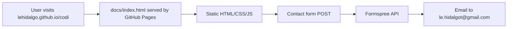

# Codi GitHub Pages Marketing Site
**Date**: 2026-04-05 12:23
**Document**: 20260405_122337_[PLAN]_codi-github-pages-marketing.md
**Category**: PLAN

---

## Overview

Build a single-file GitHub Pages marketing site for Codi (`docs/index.html`). No build step, no framework - pure HTML/CSS/JS deployed from the `docs/` folder on the `main` branch.

**Live URL target**: `https://lehidalgo.github.io/codi`

---

## Design System

| Token | Value |
|-------|-------|
| Background | `#0d1117` (GitHub dark) |
| Surface | `#161b22` |
| Border | `rgba(255,255,255,0.08)` |
| Primary gradient | `linear-gradient(135deg, #56b6c2, #61afef)` |
| Text primary | `#e6edf3` |
| Text secondary | `#8b949e` |
| Text muted | `#484f58` |
| Code accent | `#56b6c2` |
| Success | `#98c379` |
| Font headings | `'Inter', system-ui, sans-serif` (loaded from Google Fonts CDN) |
| Font mono | `'SF Mono', Monaco, Consolas, monospace` (system stack, no CDN) |

---

## Page Sections (9)

### 1. Nav
- Fixed top, blurred background (`backdrop-filter: blur`)
- Left: `codi` wordmark in gradient mono font
- Right: Docs link, GitHub link, "Install" CTA button (gradient)
- Collapses to hamburger on mobile

### 2. Hero (Centered)
- Badge pill: `v2.2.0 — now supporting 5 agents`
- H1: `One config.` + gradient `Every AI agent.`
- Subtext: one-sentence value prop referencing `.codi/`
- Install command block with copy button (clipboard API)
- Two CTAs: "Quick Start →" (gradient fill) + "View on GitHub" (ghost)
- Stats strip (4 columns, border-top separator):
  - `3k+` Monthly downloads
  - `5` Agents supported
  - `100+` Built-in templates
  - `28` Versions published

### 3. Problem → Solution
- Two-column layout: Problem on left (red-tinted card), Solution on right (green-tinted card)
- Problem: "Every agent speaks a different language. Rules drift. Teams diverge."
- Solution: "One `.codi/` directory. Codi generates native config for all agents. One source of truth."
- Connecting arrow between columns on desktop

### 4. 6 Features Grid
- 2×3 grid of feature cards (icon + title + one-line description)
- Features:
  1. **5 agents, 1 config** — Claude Code, Cursor, Codex, Windsurf, Cline
  2. **100+ built-in templates** — rules, skills, agents for 11 languages and 3 frameworks
  3. **6 presets** — from minimal to strict, customizable
  4. **Pre-commit hooks** — automated testing, secret scanning, type checking, file size limits
  5. **Drift detection** — instant alert when generated files diverge from source
  6. **Interactive wizard** — guided setup or fully non-interactive for CI

### 5. Agents Logo Strip
- Centered heading: "Works with every major AI coding agent"
- Horizontal strip of 5 agent name badges (styled chips with icons/colors):
  - Claude Code · Cursor · Codex · Windsurf · Cline
- Subtle animated gradient shimmer on hover per chip

### 6. Social Proof Stats Bar
- Intentionally distinct from the Hero stats strip: the Hero strip is inline, compact, and part of the flow. This section is a full-width dedicated block with larger typography, more breathing room, and an npm badge for external validation.
- Full-width dark strip (`#161b22` background)
- 4 large stat blocks centered:
  - `3,000+` npm downloads/month
  - `28` versions released
  - `100+` configuration templates
  - `v2.2.0` current stable version
- npm badge (shields.io) linking to the npm package page

### 7. Quick Start
- Section heading: "Up and running in 60 seconds"
- Numbered 3-step flow:
  1. Install: `npm install -g codi-cli`
  2. Init: `codi init` (select preset)
  3. Generate: `codi generate`
- Terminal window mockup (static, styled like macOS terminal with traffic light buttons)
- Shows full output: install → init → generate → 5 agent files confirmed

### 8. About the Builder
- Two-column: photo placeholder (avatar circle with initials "LH") + bio text
- Name: **Leandro A. Hidalgo**
- Title: **AI Engineer**
- Bio: 2-3 sentence description of who built Codi and why
- Social links row: GitHub + LinkedIn icons (SVG, link to profiles)
  - GitHub: `https://github.com/lehidalgo`
  - LinkedIn: `https://www.linkedin.com/in/leandro-hidalgo/`

### 9. Contact + Footer
- Contact form (Formspree endpoint `https://formspree.io/f/FORM_ID` — user must replace `FORM_ID`):
  - Fields: Name, Email, Message
  - Submit button (gradient)
  - Success/error state feedback (no page reload - fetch API)
- Footer:
  - `codi` wordmark
  - Copyright `© 2026 Leandro A. Hidalgo`
  - Links: npm · GitHub · MIT License

---

## Architecture

- **Single file**: `docs/index.html` (~600 lines)
- **No external JS frameworks** - vanilla JS only
- **No build step** - deploys as-is via GitHub Pages
- **External dependencies** (CDN, loaded async):
  - Google Fonts: Inter (headings only - one `<link>` in `<head>`)
- **Contact form**: Formspree (free tier, user configures endpoint)
- **Copy button**: Clipboard API (`navigator.clipboard.writeText`)

---

## Deployment

1. GitHub Pages must be set to serve from `docs/` folder on `main` branch
2. Go to: Settings → Pages → Source → `main` branch → `/docs` folder
3. Replace `FORM_ID` in the contact form action with a real Formspree form ID

---

## Data Flow

---

## Files to Create

Split into 3 files to stay within the 700-line limit per file:

| File | Size estimate | Notes |
|------|--------------|-------|
| `docs/index.html` | ~200 lines | HTML structure only, links to style.css and app.js |
| `docs/style.css` | ~300 lines | All styles, CSS custom properties, responsive breakpoints |
| `docs/app.js` | ~100 lines | Clipboard copy, contact form fetch, mobile nav toggle |

---

## Out of Scope

- Multi-page site
- CMS or dynamic content
- Analytics (can be added later via a script tag)
- Testimonials section (no user quotes available yet - replaced with stats bar)
