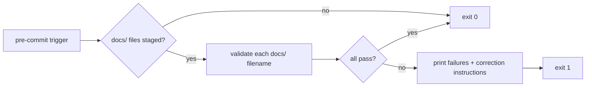
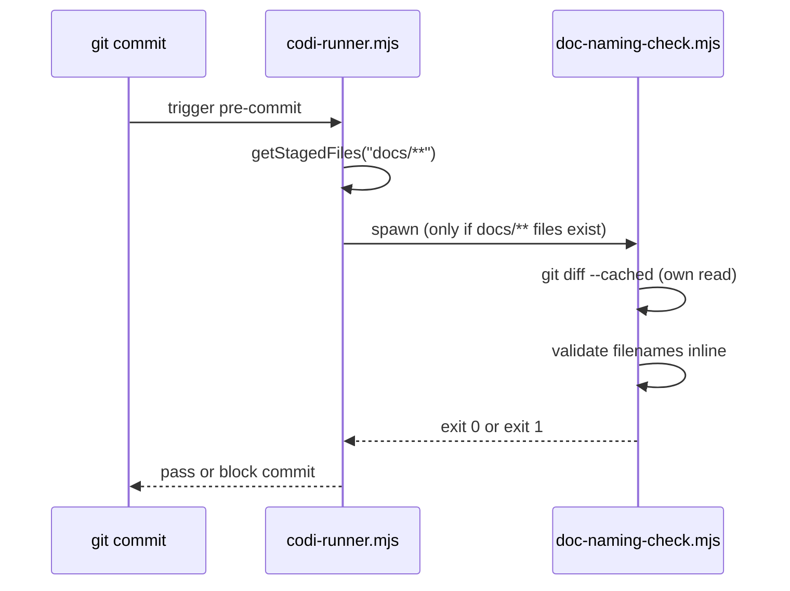

# Doc Naming Hook — Inline TypeScript Logic
- **Date**: 2026-04-05 23:07
- **Document**: 20260405_230732_[PLAN]_doc-naming-hook-inline.md
- **Category**: PLAN

## Overview

Convert the `doc-naming-check` pre-commit hook from calling an external Python script (`scripts/validate-docs.py`) to self-contained inline JavaScript. This makes the hook available to all user projects, not just Codi contributors who have the script on disk.

## Problem

`DOC_NAMING_CHECK_TEMPLATE` in `hook-templates.ts` currently calls:

```js
execFileSync('python3', ['scripts/validate-docs.py', '--quiet'], { stdio: 'inherit' });
```

`hasDocNamingCheck()` in `hook-config-generator.ts` gates this hook on `existsSync("scripts/validate-docs.py")`. That file only exists in this repo, so every user project gets `false` and the hook never runs.

## Approach

Option A: inline the validation logic directly into `DOC_NAMING_CHECK_TEMPLATE`. No new files, no scaffolding, no external dependencies. Follows the exact pattern of all other hooks in the codebase.

## Architecture



## Components

### `src/core/hooks/hook-templates.ts`

Replace the body of `DOC_NAMING_CHECK_TEMPLATE`. The new inline logic:

1. Get staged files via `git diff --cached --name-only --diff-filter=ACMR`
2. Filter to files starting with `docs/`
3. Exit 0 if none
4. For each staged docs file, validate the filename against:
   - Regex: `^\d{8}_\d{6}_\[([A-Z]+)\]_.+$` (extension not enforced — matches Python script behavior)
   - Allowed categories: `ARCHITECTURE`, `AUDIT`, `GUIDE`, `REPORT`, `ROADMAP`, `RESEARCH`, `SECURITY`, `TESTING`, `BUSINESS`, `TECH`, `PLAN`
   - Skip dirs: skip any file whose path contains a segment matching `project`, `codi_docs`, `superpowers`, or `DEPRECATED`
   - Skip files: `.DS_Store`
   - Subdirectory check: a file passes if its staged path has exactly two segments — `docs/<filename>`. A path like `docs/subdir/file.md` (three segments) fails with "must be in docs/ root"
5. If any failures: print each failing path with diagnosis, print correction instructions, exit 1
6. Exit 0

### `src/core/hooks/hook-config-generator.ts`

Simplify `hasDocNamingCheck()`:

```ts
function hasDocNamingCheck(): boolean {
  return true;
}
```

The check always returns `true` — the hook itself handles the early-exit when no docs files are staged.

### `src/core/version/artifact-version-baseline.json`

Regenerate via `pnpm run baseline:update` after template content changes.

## Data Flow

`RUNNER_TEMPLATE` is the master pre-commit runner script (`.git/hooks/codi-runner.mjs`). It reads a JSON config of hooks, applies each hook's `stagedFilter` to decide whether to invoke it, then spawns the hook as a subprocess. The hook is responsible for its own git read — it does not receive the filtered file list as an argument.



## Error Handling

- No staged docs files: exit 0 silently (no output)
- Validation failure: print each failing file with reason + correction instructions, exit 1
- git command failure: catch and treat as empty staged list (same as other hooks)

## Testing Approach

Add unit tests for the new inline validation logic in `tests/unit/hooks/doc-naming-check.test.ts`:

- Valid filename passes: `20260405_120000_[PLAN]_my-feature.md`
- Invalid category fails: `20260405_120000_[BOGUS]_my-feature.md`
- Missing timestamp fails: `my-feature.md`
- Subdirectory file fails: `docs/subdir/file.md` (three path segments)
- Skip-dir file passes: `docs/project/README.md`
- Skip file passes: `.DS_Store`

Existing integration coverage:

- `tests/integration/docs-generation.test.ts` line 75: `validate docs succeeds on fresh project` — covers the no-staged-docs early exit path
- E2e hook tests verify the hook template compiles and runs

Run `pnpm test` after changes to confirm all tests pass.

## Files Changed

| File | Change |
|------|--------|
| `src/core/hooks/hook-templates.ts` | Replace `DOC_NAMING_CHECK_TEMPLATE` body with inline JS |
| `src/core/hooks/hook-config-generator.ts` | `hasDocNamingCheck()` returns `true` unconditionally |
| `src/core/version/artifact-version-baseline.json` | Regenerated via `pnpm run baseline:update`; commit the updated file in the same PR |
| `tests/unit/hooks/doc-naming-check.test.ts` | New unit tests for inline validation logic |

`scripts/validate-docs.py` — no change. Kept for contributor manual use.
