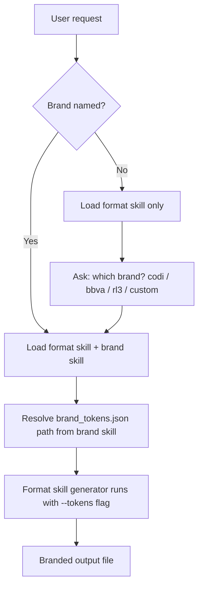

# Format / Brand Skill Separation
- **Date**: 2026-04-06 15:03
- **Document**: 20260406_1503_SPEC_format-brand-skill-separation.md
- **Category**: SPEC

---

## Problem Statement

Brand skills (`codi-codi-brand`, `codi-rl3-brand`, `codi-bbva-brand`) currently contain their own `generate_pptx.ts`, `generate_docx.ts`, and Python equivalents — duplicating the file generation logic that belongs in the format skills (`codi-pptx`, `codi-docx`). This means:

**Scope note:** `codi-xlsx` is included. Brand skills currently have no xlsx generators — this refactor adds them to the format skill from scratch. Branded xlsx applies brand colors to header rows, tab color, and font family from brand_tokens.json.

- Format skills are bypassed when a brand is active
- Bugs and improvements must be applied to each brand separately
- Missing scripts (e.g. rl3-brand has no `generate_docx.ts`) go undetected until runtime
- Adding a new brand requires writing yet another full generator from scratch

---

## Target Architecture



---

## Skill Responsibilities After Refactor

### Format Skills (codi-pptx, codi-docx, codi-xlsx)
Own **all file generation logic**.

| What stays | What is added |
|------------|---------------|
| Reading/extraction scripts | `scripts/ts/generate_pptx.ts` (NEW) |
| QA/thumbnail/conversion tools | `scripts/ts/generate_docx.ts` (NEW) |
| Office helpers (soffice, unpack, pack) | `scripts/ts/generate_xlsx.ts` (NEW, xlsx skill only) |
| SKILL.md workflow | Codi default `brand_tokens.json` bundled inside skill |
| | Brand + theme prompt step in SKILL.md |

All generators are TypeScript only. Accept `--content`, `--tokens`, `--theme`, and `--output`.

For `codi-xlsx`, the `generate_xlsx.ts` generator is added. Branded xlsx applies: header row fill (`theme.primary`), header font color (`theme.background` inverted for contrast), tab color (`theme.primary`), body font (`fonts.body`), alternating row fill (`theme.surface`).

### Brand Skills (codi-codi-brand, codi-rl3-brand, codi-bbva-brand)
Own **only the brand layer**.

| What stays | What is removed |
|------------|-----------------|
| `scripts/brand_tokens.json` (updated to v2 schema) | `scripts/ts/generate_pptx.ts` |
| `scripts/ts/brand_tokens.ts` (updated) | `scripts/ts/generate_docx.ts` |
| `scripts/validators/` | `scripts/python/generate_pptx.py` |
| `assets/` (logos, images) | `scripts/python/generate_docx.py` |
| `references/` (brand guide docs) | `scripts/python/brand_tokens.py` |
| SKILL.md routing (updated to point to format skills) | `scripts/python/__init__.py` |

Python scripts are removed entirely from brand skills. The `scripts/python/` directory is deleted per brand.

---

## Generator Interface

All format skill generators are **TypeScript only** (`npx tsx`). Python generators are removed entirely — TypeScript via pptxgenjs, docx, and ExcelJS covers all cases without requiring Python dependencies.

**TypeScript (Claude Code — preferred when npx available):**
```bash
npx tsx generate_pptx.ts --content content.json --tokens brand_tokens.json --theme dark  --output out.pptx
npx tsx generate_docx.ts --content content.json --tokens brand_tokens.json --theme light --output out.docx
npx tsx generate_xlsx.ts --content content.json --tokens brand_tokens.json --theme dark  --output out.xlsx
```

**Python (Claude Code + Claude.ai — always available):**
```bash
python3 generate_pptx.py --content content.json --tokens brand_tokens.json --theme dark  --output out.pptx
python3 generate_docx.py --content content.json --tokens brand_tokens.json --theme light --output out.docx
python3 generate_xlsx.py --content content.json --tokens brand_tokens.json --theme dark  --output out.xlsx
```

**Arguments (identical for both runtimes):**

| Flag | Required | Default | Description |
|------|----------|---------|-------------|
| `--content` | Yes | — | Path to content.json |
| `--tokens` | No | codi built-in tokens | Path to brand_tokens.json |
| `--theme` | No | `dark` | Color theme: `light` or `dark` |
| `--output` | Yes | — | Output file path |

When `--tokens` is omitted, the generator uses Codi brand tokens (bundled inside the format skill).
When `--theme` is omitted, the generator defaults to `dark`.

**Runtime selection — agent picks at execution time:**
```bash
if command -v npx &>/dev/null && npx tsx --version &>/dev/null 2>&1; then
  npx tsx scripts/ts/generate_xxx.ts ...
else
  python3 scripts/python/generate_xxx.py ...
fi
```

**Why dual-runtime:**
- Claude.ai (web/app) does not have Node.js — TypeScript-only scripts silently fail there
- Python works in both Claude Code and Claude.ai — it is the guaranteed fallback
- TypeScript is preferred in Claude Code for type safety and pptxgenjs/docx/ExcelJS ecosystem
- Same CLI interface (`--content`, `--tokens`, `--theme`, `--output`) in both versions — callers do not change

**Python dependencies:** `python-pptx`, `python-docx`, `openpyxl` (all pip-installable, no C extensions)

---

## content.json Schema (unchanged)

```json
{
  "title": "string (required)",
  "subtitle": "string (optional)",
  "author": "string (optional)",
  "sections": [
    {
      "number": "01",
      "label": "Section Label",
      "heading": "Section Heading",
      "body": "Paragraph text.",
      "items": ["Bullet 1", "Bullet 2"],
      "callout": "Optional highlighted callout"
    }
  ]
}
```

---

## brand_tokens.json Canonical Schema

All brand token files must conform to this schema. Colors are now split into `themes.dark` and `themes.light` — generators pick the active theme at runtime based on the `--theme` flag.

```json
{
  "brand": "string",
  "version": 2,
  "themes": {
    "dark": {
      "background":     "hex — main background (dark)",
      "surface":        "hex — card/section background",
      "text_primary":   "hex — primary text on dark bg",
      "text_secondary": "hex — secondary/muted text on dark bg",
      "primary":        "hex — brand primary (headers, accent bar)",
      "accent":         "hex — highlight color, CTAs, callouts",
      "logo":           "logo_dark_bg"
    },
    "light": {
      "background":     "hex — main background (light)",
      "surface":        "hex — card/section background",
      "text_primary":   "hex — primary text on light bg",
      "text_secondary": "hex — secondary/muted text on light bg",
      "primary":        "hex — brand primary (headers, accent bar)",
      "accent":         "hex — highlight color, CTAs, callouts",
      "logo":           "logo_light_bg"
    }
  },
  "fonts": {
    "headlines":     "string (required — for PPTX titles and DOCX headings)",
    "body":          "string (required — for body text)",
    "fallback_sans": "string (required — Arial or system font)"
  },
  "layout": {
    "slide_width_in":      "string",
    "slide_height_in":     "string",
    "content_margin_in":   "string",
    "accent_bar_width_in": "string"
  },
  "assets": {
    "logo_dark_bg":  "relative path — logo for use on dark backgrounds",
    "logo_light_bg": "relative path — logo for use on light backgrounds"
  },
  "voice": {
    "phrases_use":   ["string"],
    "phrases_avoid": ["string"]
  }
}
```

**How generators use the theme:**
```ts
const theme = tokens.themes[args.theme ?? "dark"];
// theme.background, theme.text_primary, theme.accent, etc.
// theme.logo resolves to tokens.assets[theme.logo]
```

**Migration notes per brand:**

| Brand | dark.background | dark.accent | light.background | light.accent |
|-------|----------------|-------------|-----------------|--------------|
| codi | `#070a0f` | `#56b6c2` | `#f5f5f5` | `#56b6c2` |
| rl3 | `#0a0a0b` | `#c8b88a` | `#f5f5f5` | `#c8b88a` |
| bbva | `#000519` | `#FFE761` | `#F7F8F8` | `#001391` |

Font keys renamed: `pptx_headlines` → `headlines`, `pptx_body` → `body` (now shared across all format types).

---

## Brand + Theme Prompt Step (Format Skill SKILL.md)

When generating a file, the format skill asks two questions if not already specified in the request:

**Step 1 — Brand** (skip if brand already named in request):
```
Which brand styling would you like to apply?
  1. Codi (default)
  2. BBVA
  3. RL3
  4. Custom — provide a path to brand_tokens.json
```

**Step 2 — Theme** (skip if theme already named in request):
```
Which color theme?
  1. Dark (default)
  2. Light
```

If both brand and theme are clear from the original request (e.g. "create a light BBVA deck"), skip both questions and proceed directly to generation.

---

## Brand Skill Routing Table (after refactor)

Brand SKILL.md routing uses runtime detection to pick the right generator:

```bash
# PPTX
if command -v npx &>/dev/null && npx tsx --version &>/dev/null 2>&1; then
  npx tsx ${CODI_PPTX_SKILL_DIR}[[/scripts/ts/generate_pptx.ts]] --content content.json --tokens ${CLAUDE_SKILL_DIR}[[/scripts/brand_tokens.json]] --theme dark --output out.pptx
else
  python3 ${CODI_PPTX_SKILL_DIR}[[/scripts/python/generate_pptx.py]] --content content.json --tokens ${CLAUDE_SKILL_DIR}[[/scripts/brand_tokens.json]] --theme dark --output out.pptx
fi

# DOCX
if command -v npx &>/dev/null && npx tsx --version &>/dev/null 2>&1; then
  npx tsx ${CODI_DOCX_SKILL_DIR}[[/scripts/ts/generate_docx.ts]] --content content.json --tokens ${CLAUDE_SKILL_DIR}[[/scripts/brand_tokens.json]] --theme dark --output out.docx
else
  python3 ${CODI_DOCX_SKILL_DIR}[[/scripts/python/generate_docx.py]] --content content.json --tokens ${CLAUDE_SKILL_DIR}[[/scripts/brand_tokens.json]] --theme dark --output out.docx
fi

# XLSX
if command -v npx &>/dev/null && npx tsx --version &>/dev/null 2>&1; then
  npx tsx ${CODI_XLSX_SKILL_DIR}[[/scripts/ts/generate_xlsx.ts]] --content content.json --tokens ${CLAUDE_SKILL_DIR}[[/scripts/brand_tokens.json]] --theme dark --output out.xlsx
else
  python3 ${CODI_XLSX_SKILL_DIR}[[/scripts/python/generate_xlsx.py]] --content content.json --tokens ${CLAUDE_SKILL_DIR}[[/scripts/brand_tokens.json]] --theme dark --output out.xlsx
fi
```

`${CLAUDE_SKILL_DIR}` resolves to the brand skill's directory (provides tokens).
`${CODI_PPTX_SKILL_DIR}` / `${CODI_DOCX_SKILL_DIR}` / `${CODI_XLSX_SKILL_DIR}` resolve to the format skill directories.

---

## Files Changed

### Format skill templates (src/templates/skills/) — files added

| File | Change |
|------|--------|
| `pptx/scripts/ts/generate_pptx.ts` | NEW — brand+theme-aware TS generator (Claude Code) |
| `pptx/scripts/python/generate_pptx.py` | NEW — brand+theme-aware Python generator (Claude Code + Claude.ai) |
| `pptx/scripts/brand_tokens.json` | NEW — bundled Codi default tokens (v2 schema) |
| `docx/scripts/ts/generate_docx.ts` | NEW — brand+theme-aware TS generator (Claude Code) |
| `docx/scripts/python/generate_docx.py` | NEW — brand+theme-aware Python generator (Claude Code + Claude.ai) |
| `docx/scripts/brand_tokens.json` | NEW — bundled Codi default tokens (v2 schema) |
| `xlsx/scripts/ts/generate_xlsx.ts` | NEW — brand+theme-aware TS generator (Claude Code) |
| `xlsx/scripts/python/generate_xlsx.py` | NEW — brand+theme-aware Python generator (Claude Code + Claude.ai) |
| `xlsx/scripts/brand_tokens.json` | NEW — bundled Codi default tokens (v2 schema) |
| `pptx/template.ts` | UPDATE — add brand+theme prompt step, runtime detection, document flags |
| `docx/template.ts` | UPDATE — add brand+theme prompt step, runtime detection, document flags |
| `xlsx/template.ts` | UPDATE — add brand+theme prompt step, runtime detection, document flags |

### Brand skill templates (src/templates/skills/) — files deleted

| File | Change |
|------|--------|
| `bbva-brand/scripts/ts/generate_pptx.ts` | DELETE |
| `bbva-brand/scripts/ts/generate_docx.ts` | DELETE |
| `bbva-brand/scripts/python/` (entire dir) | DELETE |
| `rl3-brand/scripts/ts/generate_pptx.ts` | DELETE |
| `rl3-brand/scripts/python/` (entire dir) | DELETE |
| `rl3-brand/scripts/generate_pptx.py` | DELETE (root-level stray) |
| `rl3-brand/scripts/generate_docx.py` | DELETE (root-level stray) |
| `codi-brand/scripts/ts/generate_pptx.ts` | DELETE |
| `codi-brand/scripts/ts/generate_docx.ts` | DELETE |
| `codi-brand/scripts/python/` (entire dir) | DELETE |

### Brand skill templates (src/templates/skills/) — files updated

| File | Change |
|------|--------|
| `bbva-brand/scripts/brand_tokens.json` | UPDATE to v2 schema (themes.dark + themes.light) |
| `rl3-brand/scripts/brand_tokens.json` | UPDATE to v2 schema |
| `codi-brand/scripts/brand_tokens.json` | UPDATE to v2 schema |
| `bbva-brand/scripts/ts/brand_tokens.ts` | UPDATE to export v2 theme shape |
| `rl3-brand/scripts/ts/brand_tokens.ts` | UPDATE to export v2 theme shape |
| `codi-brand/scripts/ts/brand_tokens.ts` | UPDATE to export v2 theme shape |
| `bbva-brand/template.ts` | UPDATE — routing table points to format skill generators |
| `rl3-brand/template.ts` | UPDATE — routing table points to format skill generators |
| `codi-brand/template.ts` | UPDATE — routing table points to format skill generators |

### Propagation

After all template changes:
```bash
npm run build
codi add skill codi-pptx --template codi-pptx
codi add skill codi-docx --template codi-docx
codi add skill codi-xlsx --template codi-xlsx
codi add skill codi-bbva-brand --template codi-bbva-brand
codi add skill codi-rl3-brand --template codi-rl3-brand
codi add skill codi-codi-brand --template codi-codi-brand
codi generate --force
```

---

## Implementation Order

1. Define v2 `brand_tokens.json` schema and update all three brand templates (codi, bbva, rl3)
2. Update `brand_tokens.ts` in each brand to export v2 theme shape
3. Write TS generators in format skill templates: `pptx/scripts/ts/generate_pptx.ts`, `docx/scripts/ts/generate_docx.ts`, `xlsx/scripts/ts/generate_xlsx.ts`
4. Bundle Codi default `brand_tokens.json` (v2) inside each format skill template
5. Delete all Python generator scripts and directories from brand skill templates
6. Delete TS generator scripts from brand skill templates
7. Update brand skill `template.ts` routing tables to point to format skill generators
8. Update format skill `template.ts` files to add brand+theme prompt step and document flags
9. Bump versions in all modified `template.ts` files
10. Build, reinstall all 6 skills, propagate, run 18-file validation

---

## Validation

After refactor, generate all combinations end-to-end (3 brands × 3 formats × 2 themes = 18 files):

```bash
for BRAND in codi bbva rl3; do
  for THEME in dark light; do
    npx tsx <pptx-skill>/scripts/ts/generate_pptx.ts \
      --content examples/$BRAND/content.json \
      --tokens <$BRAND-skill>/scripts/brand_tokens.json \
      --theme $THEME --output examples/$BRAND/deck-$THEME.pptx

    npx tsx <docx-skill>/scripts/ts/generate_docx.ts \
      --content examples/$BRAND/content.json \
      --tokens <$BRAND-skill>/scripts/brand_tokens.json \
      --theme $THEME --output examples/$BRAND/doc-$THEME.docx

    npx tsx <xlsx-skill>/scripts/ts/generate_xlsx.ts \
      --content examples/$BRAND/content.json \
      --tokens <$BRAND-skill>/scripts/brand_tokens.json \
      --theme $THEME --output examples/$BRAND/sheet-$THEME.xlsx
  done
done
```

All 18 files must generate without errors. Visual spot-check at least one dark and one light output per brand.
