# Documentation Site Strategy for Codi
- **Date**: 2026-04-07 09:00
- **Document**: 20260407_0900_RESEARCH_documentation-site-strategy.md
- **Category**: RESEARCH

---

## 1. Codebase Documentation Readiness Assessment

Codi is a TypeScript CLI tool (Node.js >= 20, strict ESM, tsup build) with ~440 source files and ~45,000 lines across five clearly separated concerns: adapters, CLI commands, core config/generation logic, Zod schemas, and a 100+ template catalog of rules, skills, agents, and presets.

### What Already Exists

| Signal | Current State | Documentation Value |
|--------|--------------|---------------------|
| **CLI commands** (18 via Commander.js) | `src/cli.ts` + `src/cli/` — each command handler is its own module | High: auto-walk `program.commands` tree → one Markdown file per command |
| **TypeScript types** (`src/types/`) | ~300 lines, strict interfaces for `NormalizedConfig`, `NormalizedRule`, `NormalizedSkill`, `NormalizedAgent`, `Result<T>`, flag types | High: TypeDoc renders these as a clean reference page |
| **Zod schemas** (`src/schemas/`) | 11 files, 100% branch coverage; `ProjectManifestSchema`, `RuleFrontmatterSchema`, `SkillFrontmatterSchema`, `FlagDefinitionSchema`, `McpConfigSchema`, etc. | High: `typedoc-plugin-zod` renders schemas as tables with field descriptions |
| **JSDoc comments** | ~272 comment blocks across 62% of files; best coverage in adapters, schemas, types | Medium-High: ready for TypeDoc extraction with minor gap-filling |
| **Exported public API** (`src/index.ts`, `src/adapters/index.ts`, `src/core/config/index.ts`, `src/schemas/index.ts`) | Selective, well-named exports | High: TypeDoc entry points are already obvious |
| **Template catalog** (`src/templates/`) | 28 rules, 67 skills, 22 agents, 6 presets, 34 MCP servers — each with `index.ts` (metadata) + `template.ts` (content) | High: can auto-generate a "Template Catalog" page from `index.ts` metadata |
| **Existing Markdown docs** (`docs/project/`) | 13 files: getting-started, cli-reference, architecture, configuration, artifacts, presets, workflows, migration, troubleshooting | High: already publishable as-is; needs light reformatting into SSG nav |
| **README.md** | 9.6 KB, covers quick start, supported agents, presets table, install | Medium: re-use as landing page intro |
| **CHANGELOG.md** | 18 KB, conventional format | Ready for a "Releases" page |
| **CONTRIBUTING.md** | 10.7 KB, dev setup + contribution guide | Ready for a "Contributing" guide |
| **Test files** (153 Vitest files) | Clear naming: `schemas.test.ts`, `flags/*.test.ts`, `scaffolder/*.test.ts` | Medium: test fixtures double as usage examples |

### Gaps That Require Manual Authoring

| Gap | Priority | Notes |
|-----|----------|-------|
| Skill authoring guide | High | How to write SKILL.md, references/, evals/, agents/ sub-dirs, scripts/ — no current page |
| Rule authoring guide | High | How to write effective rules with BAD/GOOD examples and frontmatter fields |
| Template contribution guide | High | How to add a new rule/skill/agent/preset template to `src/templates/` |
| Adapter development guide | Medium | How to implement a new agent adapter (`AgentAdapter` interface) |
| Flag system deep dive | Medium | Flag modes (enforced/enabled/conditional), `FlagConditions`, the precedence model |
| Config resolution pipeline | Medium | The 3-layer resolution: manifest → templates → runtime `.codi/` — valuable for advanced users |
| Skill feedback & evolution system | Medium | `.codi/feedback/`, `codi skill evolve`, evals/ format |
| MCP server catalog | Low | 34 built-in servers — could be auto-generated from `src/templates/mcp-servers/` |
| Test patterns guide | Low | When to write unit vs. integration vs. e2e, Vitest config, coverage targets |

### Summary Score

```
Documentation readiness: 7.5 / 10
- User guides: 9/10 (13 existing docs, comprehensive coverage)
- API reference: 5/10 (types/schemas good; JSDoc gaps in cli/ module)
- Authoring guides: 3/10 (skills/rules/template creation not documented)
- Auto-generation potential: 8/10 (CLI, types, schemas, templates all parseable)
```

---

## 2. How Strong Projects Build Documentation from Code

### OpenAI Agents Python — MkDocs Material + mkdocstrings

The Python reference uses `mkdocs-material` with `mkdocstrings[python]`. Python docstrings (Google style) are parsed by Griffe and rendered into parameter tables with types, return values, and source links. Navigation is driven by `mkdocs.yml`. CI: GitHub Actions → `mkdocs build --strict` → `actions/deploy-pages`. This is the gold standard for Python SDK docs but requires a Python runtime in CI.

### OpenAI Agents JS — Astro Starlight + starlight-typedoc

The TypeScript counterpart uses **Astro Starlight** with `starlight-typedoc`. Six separate TypeDoc invocations, one per package, populate `docs/src/content/docs/api/` automatically. Plugins: `typedoc-plugin-zod` (Zod schemas as tables), `typedoc-plugin-frontmatter`, custom sidebar plugins. The look is polished, dark-mode-first, with Pagefind search and expressive code highlighting. This is the direct model for a TypeScript CLI.

### Vite / VitePress Ecosystem (Vue, Vitest, VitePress itself)

Uses VitePress with `typedoc-plugin-markdown` + `typedoc-vitepress-theme`. TypeDoc generates Markdown files that VitePress treats as regular content pages. A `typedoc-sidebar.json` is auto-generated and imported in `.vitepress/config.mts`. Extremely fast HMR and build times. The model for minimal-overhead TypeScript docs.

### Docusaurus (React, Jest, Prettier, React Native)

Meta's framework handles versioning best. `docusaurus-plugin-typedoc` wraps the TypeDoc pipeline. Multiple versions (`/v1/`, `/v2/`) with diff views. The heaviest setup but strongest versioning story — important when an API has breaking changes between major versions.

### Common Patterns Across All Strong Docs Sites

1. **Compile first, document second**: TypeDoc requires `.d.ts` declaration files. Every project builds TypeScript before running TypeDoc in CI.
2. **Autogenerate API reference, hand-write everything else**: No project hand-writes API docs. Guides, concepts, and tutorials are always manual.
3. **CLI docs via build script**: No tool auto-generates CLI docs. Projects write a small script that walks the command tree and emits Markdown.
4. **Search is non-negotiable**: Every modern docs site includes full-text search. Pagefind (Starlight), Algolia (Docusaurus/VitePress), or built-in lunr.js (MkDocs).
5. **GitHub Actions → GitHub Pages**: Universal CI/CD pattern for open-source docs. One workflow file, triggered on push to `main` on `docs/**` or `src/**` paths.

---

## 3. Applicable Tooling Options

### Comparison Matrix

| Criterion | Astro Starlight | VitePress | Docusaurus | MkDocs Material |
|-----------|:--------------:|:---------:|:----------:|:---------------:|
| TypeDoc integration | Native (`starlight-typedoc`) | Plugin adapter | Plugin | Pre-gen only (no native TS) |
| Zod schema docs | `typedoc-plugin-zod` | `typedoc-plugin-zod` | `typedoc-plugin-zod` | Not applicable |
| CLI docs (Commander.js) | Build script + MDX | Build script + .md | Build script + MDX | Build script + .md |
| Default aesthetics | Excellent | Good | Good | Excellent |
| Search (built-in) | Pagefind (fast, offline) | Basic | Basic | Built-in lunr |
| Search (production) | Pagefind is sufficient | Algolia recommended | Algolia recommended | Sufficient built-in |
| Dark mode | Built-in | Built-in | Built-in | Built-in |
| Versioning | Plugin (`starlight-versions`) | Plugin | Best-in-class (built-in) | Plugin |
| i18n | Built-in | Built-in | Best-in-class | Plugin |
| Setup time | ~15 min | ~10 min | ~20-30 min | ~30 min + Python |
| Runtime requirement | Node.js only | Node.js only | Node.js only | Python + Node.js |
| Maintenance burden | Low | Low | Medium | Medium-High |
| Fit for TypeScript CLI | Excellent | Good | Good | Poor |
| Real-world TypeScript usage | OpenAI Agents JS | Vue 3, Vite, Vitest | React, Jest, Prettier | OpenAI Agents Python (Python) |

### Recommendation: Astro Starlight

Rationale:

- **Directly precedented**: OpenAI Agents JS uses this exact stack. The integration patterns, plugin choices, and CI workflow are proven and documented.
- **Zod-aware**: `typedoc-plugin-zod` converts Codi's Zod schemas (the project's primary API surface) into rendered tables — no other tool does this natively.
- **Node.js only**: No Python runtime required in CI. The entire pipeline (build → TypeDoc → Starlight SSG) runs in one `npm` invocation.
- **Pagefind search**: Full-text search ships zero-config. Docusaurus and VitePress need Algolia for production-quality search.
- **MDX support**: Guide pages can embed live component demos or custom callout components without leaving the Starlight ecosystem.
- **starlight-typedoc auto-wires the sidebar**: No manual `sidebar.json` maintenance — the plugin generates sidebar groups from TypeDoc output.

VitePress is the correct choice **only if** Starlight's Astro overhead (slightly longer cold build) is a concern and the team is comfortable with Vue components for customization. For this project the difference is negligible.

---

## 4. Recommended Architecture for Codi Docs

### Stack

```
Astro Starlight (SSG)
  └── starlight-typedoc           → API reference from TypeScript source
  └── typedoc-plugin-zod          → Zod schemas rendered as tables
  └── typedoc-plugin-frontmatter  → frontmatter metadata for generated pages
  └── @astrojs/sitemap            → sitemap.xml for SEO
  └── Pagefind (built-in)         → full-text search

Commander.js walk script
  └── scripts/generate-cli-docs.ts  → one .md per command → docs/src/content/docs/cli/

GitHub Actions
  └── pnpm build (emit .d.ts)
  └── node scripts/generate-cli-docs.ts
  └── pnpm docs:build (Starlight)
  └── deploy-pages
```

### Directory Layout

```
docs/
├── astro.config.mjs          ← Starlight + starlight-typedoc config
├── package.json              ← docs workspace (separate from root)
├── tsconfig.json
└── src/
    └── content/
        └── docs/
            ├── index.mdx               ← Home / landing (hand-written)
            ├── guides/
            │   ├── quickstart.md       ← hand-written
            │   ├── installation.md     ← hand-written
            │   └── migration.md        ← import from docs/project/migration.md
            ├── concepts/
            │   ├── how-it-works.md     ← hand-written (config resolution pipeline)
            │   ├── flags.md            ← hand-written (flag modes, conditions)
            │   └── adapters.md         ← hand-written (5 supported agents)
            ├── authoring/
            │   ├── rules.md            ← hand-written
            │   ├── skills.md           ← hand-written
            │   ├── agents.md           ← hand-written
            │   └── presets.md          ← import from docs/project/presets.md
            ├── cli/                    ← auto-generated by scripts/generate-cli-docs.ts
            │   ├── index.md            ← command index
            │   ├── init.md
            │   ├── generate.md
            │   ├── add.md
            │   └── ...
            ├── templates/              ← auto-generated from src/templates/*/index.ts
            │   ├── rules.md
            │   ├── skills.md
            │   └── agents.md
            ├── api/                    ← auto-generated by starlight-typedoc
            │   ├── types/
            │   ├── schemas/
            │   ├── adapters/
            │   └── core/
            └── reference/
                ├── configuration.md    ← import from docs/project/configuration.md
                ├── changelog.md        ← link to root CHANGELOG.md
                └── contributing.md     ← import from root CONTRIBUTING.md
```

### Autogenerated vs Hand-Written Content Split

| Section | Method | Source |
|---------|--------|--------|
| API reference (`/api/`) | Auto (TypeDoc + starlight-typedoc) | `src/types/`, `src/schemas/`, `src/adapters/`, `src/core/config/` |
| CLI reference (`/cli/`) | Auto (Commander walk script) | `src/cli.ts` + Commander `program.commands` |
| Template catalog (`/templates/`) | Auto (metadata script) | `src/templates/*/index.ts` |
| Configuration reference | Mostly auto (import existing .md) | `docs/project/configuration.md` |
| Changelog | Import | Root `CHANGELOG.md` |
| Quickstart / Installation | Hand-written | New content |
| Concepts / How it works | Hand-written | New content (config resolution, flag system) |
| Skill authoring guide | Hand-written | New content |
| Rule authoring guide | Hand-written | New content |
| Migration guide | Import + edit | `docs/project/migration.md` |
| Troubleshooting | Import + edit | `docs/project/troubleshooting.md` |

Estimated split: **~40% auto-generated, ~60% manually authored**. The 60% is mostly one-time work to migrate and expand the 13 existing docs files.

---

## 5. Documentation Information Architecture

### Proposed Site Structure

```mermaid
flowchart TD
    Home["/ - Home"] --> GS["Getting Started"]
    Home --> Concepts["Concepts"]
    Home --> Authoring["Authoring Artifacts"]
    Home --> CLI["CLI Reference"]
    Home --> API["API Reference"]
    Home --> Templates["Template Catalog"]
    Home --> Reference["Reference"]

    GS --> Install["Installation"]
    GS --> QS["Quickstart"]
    GS --> Migration["Migrating Existing Projects"]

    Concepts --> HowItWorks["How Codi Works"]
    Concepts --> Adapters["Agent Adapters"]
    Concepts --> Flags["Flags and Modes"]
    Concepts --> ConfigResolution["Config Resolution Pipeline"]
    Concepts --> Presets["Presets"]

    Authoring --> Rules["Writing Rules"]
    Authoring --> Skills["Writing Skills"]
    Authoring --> AgentDef["Defining Agents"]
    Authoring --> CustomPreset["Creating Presets"]
    Authoring --> Evals["Writing Evals"]

    CLI --> CLIIndex["Command Index"]
    CLI --> CLIInit["codi init"]
    CLI --> CLIGen["codi generate"]
    CLI --> CLIAdd["codi add"]
    CLI --> CLIEtc["...18 commands"]

    API --> Types["Types"]
    API --> Schemas["Schemas"]
    API --> AdaptersAPI["Adapters"]
    API --> CoreAPI["Core Config"]

    Templates --> TRules["Built-in Rules (28)"]
    Templates --> TSkills["Built-in Skills (67)"]
    Templates --> TAgents["Built-in Agents (22)"]
    Templates --> TMCP["MCP Servers (34)"]

    Reference --> Config["Configuration Reference"]
    Reference --> Changelog["Changelog"]
    Reference --> Contributing["Contributing"]
```



### Navigation Priorities

The sidebar should be ordered by user journey, not by technical taxonomy:

1. **Getting Started** — first thing a new user hits
2. **Concepts** — mental model before diving into authoring
3. **Authoring** — the most-used section for power users
4. **CLI Reference** — task reference, returned to frequently
5. **Template Catalog** — browseable directory of built-ins
6. **API Reference** — for contributors and integration builders
7. **Reference** — config schema, changelog, contributing

---

## 6. Implementation Plan

### Phase 1 — Scaffold the docs workspace (1 day)

1. Create `docs/` workspace as a separate npm package (`docs/package.json` with `"type": "module"`)
2. Install Starlight: `npm create astro@latest -- --template starlight`
3. Install TypeDoc plugins: `npm i -D starlight-typedoc typedoc typedoc-plugin-markdown typedoc-plugin-zod typedoc-plugin-frontmatter`
4. Configure `docs/astro.config.mjs` with three TypeDoc entry point groups:
   - `src/types/index.ts` → `/api/types/`
   - `src/schemas/index.ts` → `/api/schemas/`
   - `src/adapters/index.ts` → `/api/adapters/`
5. Configure `docs/tsconfig.json` to reference root `tsconfig.json`
6. Verify `pnpm docs:build` outputs the API reference correctly (after `tsc --build`)

### Phase 2 — CLI docs generator (0.5 days)

1. Create `scripts/generate-cli-docs.ts`
2. Import `program` from `src/cli.ts`
3. Walk `program.commands` recursively:
   - For each command: name, description, options (flags + args), examples (from `.addHelpText()`)
   - Emit `docs/src/content/docs/cli/<command>.md` with Starlight frontmatter
4. Add npm script: `"docs:cli": "tsx scripts/generate-cli-docs.ts"`
5. Add to pre-build: `"predocs:build": "tsc --build && npm run docs:cli"`

### Phase 3 — Template catalog generator (0.5 days)

1. Create `scripts/generate-template-catalog.ts`
2. Import each `src/templates/rules/*/index.ts`, `src/templates/skills/*/index.ts`, `src/templates/agents/*/index.ts`
3. Group by category, emit a single `docs/src/content/docs/templates/rules.md`, `skills.md`, `agents.md` with tables (name, description, category, languages)
4. These files rebuild on every `docs:build` — always in sync with source

### Phase 4 — Migrate existing docs (1 day)

1. Copy 13 files from `docs/project/` to `docs/src/content/docs/` with appropriate section placement
2. Add Starlight frontmatter (`title`, `description`, `sidebar.order`) to each file
3. Fix relative links between pages (use Starlight's `/guides/...` absolute paths)
4. Convert any ASCII diagrams to Mermaid (already the project standard)
5. Review for outdated content (some files reference pre-v1.0.0 behavior)

### Phase 5 — Hand-write missing guides (2-3 days)

Write the four high-priority missing pages:

1. **Skill authoring guide** — frontmatter fields, directory structure, references/, evals/ format, scripts/ conventions, the `managed_by` field
2. **Rule authoring guide** — frontmatter fields, priority levels, language/scope targeting, BAD/GOOD example conventions
3. **How Codi Works** (concepts/how-it-works.md) — config resolution pipeline diagram, 3-layer model, generation pipeline
4. **Flag system** (concepts/flags.md) — all 17 flags, mode enum, `FlagConditions` targeting, preset-vs-project inheritance

### Phase 6 — CI/CD and publishing (0.5 days)

Create `.github/workflows/docs.yml`:

```yaml
name: Deploy Docs
on:
  push:
    branches: [main]
    paths:
      - 'src/**'
      - 'docs/**'
      - 'CHANGELOG.md'

permissions:
  contents: read
  pages: write
  id-token: write

jobs:
  build:
    runs-on: ubuntu-latest
    steps:
      - uses: actions/checkout@v4
      - uses: actions/setup-node@v4
        with:
          node-version: '22'
          cache: 'npm'
      - run: npm ci
      - run: npm run build           # emit dist/ and .d.ts files
      - run: npm run docs:build      # TypeDoc → Starlight → static site
        working-directory: docs
      - uses: actions/upload-pages-artifact@v3
        with:
          path: docs/dist

  deploy:
    needs: build
    runs-on: ubuntu-latest
    environment:
      name: github-pages
      url: ${{ steps.deployment.outputs.page_url }}
    steps:
      - uses: actions/deploy-pages@v4
        id: deployment
```

Enable GitHub Pages in repo settings: Source → GitHub Actions.

### Phase 7 — JSDoc gap-fill (1 day)

The `src/cli/` module has the lightest JSDoc coverage. Add `@param`, `@returns`, and brief `@description` to:
- All exported functions in `src/core/config/index.ts` (primary API surface)
- All adapter factory functions in `src/adapters/`
- Key schema exports that lack descriptions in `src/schemas/`

This directly improves TypeDoc output quality.

### Total Effort Estimate

| Phase | Effort | Output |
|-------|--------|--------|
| 1 — Scaffold workspace | 1 day | Working docs site with API reference |
| 2 — CLI docs generator | 0.5 day | 18+ CLI pages auto-generated |
| 3 — Template catalog | 0.5 day | Rules/skills/agents/MCP catalog pages |
| 4 — Migrate existing docs | 1 day | All 13 existing docs in new site |
| 5 — Write missing guides | 2-3 days | 4 high-priority new guides |
| 6 — CI/CD | 0.5 day | Published to GitHub Pages |
| 7 — JSDoc gaps | 1 day | Improved API reference quality |
| **Total** | **6.5-7.5 days** | **Full docs site live** |

---

## 7. Page Examples Based on Current Codebase

### Example: `codi add` CLI Reference Page (auto-generated)

```markdown
---
title: codi add
description: Add a rule, skill, agent, or brand artifact to your project
sidebar:
  order: 3
---

Add a rule, skill, agent, or brand artifact to the current project.

## Usage

codi add <type> <name> [options]

## Arguments

| Argument | Description |
|----------|-------------|
| `type` | Artifact type: `rule`, `skill`, `agent`, `brand` |
| `name` | Artifact name (lowercase, hyphens allowed) |

## Options

| Option | Description |
|--------|-------------|
| `--template <name>` | Use a built-in template as starting point |
| `--force` | Overwrite if artifact already exists |
| `-j, --json` | Output as JSON |

## Examples

Add a custom rule from scratch:
codi add rule my-rule

Add a skill from the built-in brainstorming template:
codi add skill my-planning --template codi-brainstorming
```

### Example: `ProjectManifestSchema` API Reference Page (TypeDoc auto-generated)

TypeDoc will emit from `src/schemas/manifest.ts`:

```markdown
---
title: ProjectManifestSchema
---

# ProjectManifestSchema

Zod schema for the `.codi/codi.yaml` project manifest.

## Properties

| Property | Type | Required | Description |
|----------|------|----------|-------------|
| `name` | `string` | Yes | Project identifier (lowercase, hyphens) |
| `version` | `"1"` | Yes | Schema version |
| `description` | `string` | No | Human-readable description |
| `agents` | `AgentName[]` | No | Target platforms: claude-code, cursor, codex, windsurf, cline |
| `layers` | `LayersConfig` | No | Artifact layer overrides |
| `engine` | `EngineConfig` | No | Minimum CLI version requirement |
| `presets` | `string[]` | No | Installed preset names |
```

### Example: `NormalizedConfig` Type Reference (TypeDoc auto-generated)

From `src/types/config.ts`:

```markdown
---
title: NormalizedConfig
---

# NormalizedConfig

Fully resolved project configuration after reading `.codi/` as source of truth.
All artifacts, flags, and MCP server configurations are included.

## Properties

| Property | Type | Description |
|----------|------|-------------|
| `manifest` | `ProjectManifest` | Parsed `codi.yaml` values |
| `rules` | `NormalizedRule[]` | All installed rules with content |
| `skills` | `NormalizedSkill[]` | All installed skills with content |
| `agents` | `NormalizedAgent[]` | All installed agent definitions |
| `flags` | `ResolvedFlags` | Flag values after mode resolution |
| `mcp` | `McpConfig` | MCP server configurations |
```

---

## 8. Risks and Trade-offs

### Risk 1 — TypeDoc output quality depends on JSDoc completeness

TypeDoc can only document what is annotated. The `src/cli/` module (10,988 lines, 41 files) has minimal JSDoc. The API reference for CLI internals will be sparse until JSDoc is added. **Mitigation**: limit TypeDoc entry points to the four well-annotated modules (`types/`, `schemas/`, `adapters/`, `core/config/`) and exclude `src/cli/` from the initial API reference.

### Risk 2 — Template catalog staleness

The auto-generated template catalog (`rules.md`, `skills.md`) will drift if the generation script is only run manually. **Mitigation**: add `generate-template-catalog.ts` as a `predocs:build` step so it always runs before Starlight builds.

### Risk 3 — Commander.js walk script brittleness

If the CLI command registration pattern changes (e.g., lazy loading), the walk script may miss commands. **Mitigation**: add a CI assertion that `docs/src/content/docs/cli/` has exactly N files matching the count of registered commands.

### Risk 4 — Astro Starlight vs. existing `docs/_site/` directory

The project already has a `docs/_site/` directory, suggesting a prior static site attempt. Review what is in that directory before starting to avoid overwriting in-progress work.

### Risk 5 — Docs workspace adds install footprint

A separate `docs/package.json` adds ~150 MB to `node_modules/` in the docs workspace. This is standard for large projects but affects developer machine setup. **Mitigation**: use `workspaces` in the root `package.json` or keep the docs workspace dev-only with a `.npmignore` entry.

### Trade-off — Astro Starlight vs. VitePress for build speed

Starlight's Astro build is ~2-3× slower than VitePress on cold start for large sites. For Codi's estimated ~100 pages, this is ~8-15 seconds vs. ~4-8 seconds — negligible in CI but noticeable in watch mode. If watch-mode iteration speed becomes a pain point, VitePress is the fallback.

### Trade-off — Separate docs workspace vs. monorepo root

Running docs as a separate workspace isolates dependencies but requires contributors to `cd docs && npm install`. Alternatively, docs dependencies can be added to the root `package.json` as `devDependencies`. The separate workspace is cleaner for a public project but requires documentation in `CONTRIBUTING.md`.

---

## Summary

**Recommended stack**: Astro Starlight + starlight-typedoc + typedoc-plugin-zod + Commander.js walk script + GitHub Actions → GitHub Pages.

**Why this is right for Codi**:
- Directly precedented by OpenAI Agents JS (same TypeScript CLI/SDK pattern)
- Zod schemas (Codi's primary config surface) get first-class rendering
- Node.js only pipeline — no Python runtime in CI
- Pagefind search ships zero-config
- 40% of content is auto-generated from source of truth; no manual API doc maintenance

**First step**: Scaffold the Astro Starlight workspace in `docs/` and verify the TypeDoc pipeline produces correct output for `src/schemas/index.ts` — this de-risks the most uncertain integration before investing in guide writing.
