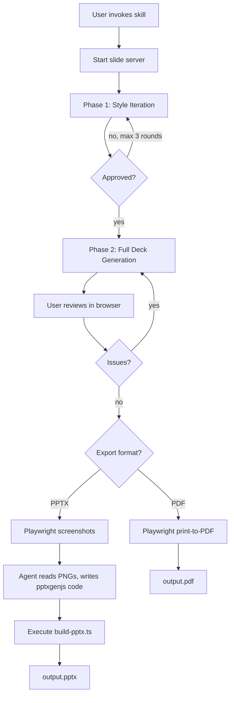
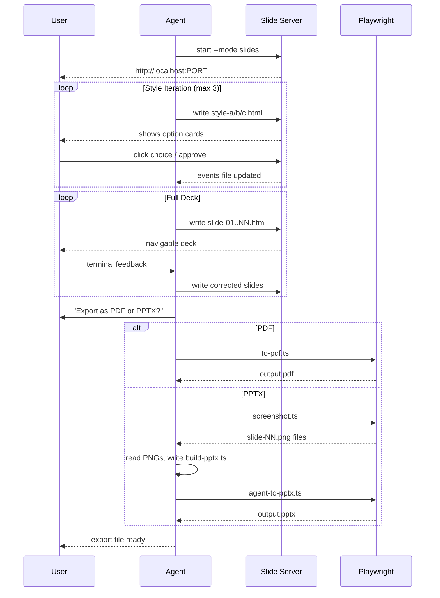

# Deck Skill Redesign: HTML-First Slide Generation with Interactive Server
- **Date**: 2026-04-07 12:00
- **Document**: 20260407_120000_PLAN_deck-skill-redesign.md
- **Category**: PLAN

---

## Overview

Redesign the `codi-pptx` skill (and by extension any brand-specific PPTX generator) from a TypeScript-hardcoded layout engine into a **three-phase interactive workflow**:

1. **Style iteration** — agent generates HTML slides, user iterates in browser until design is approved (max 3 rounds)
2. **Full deck generation** — agent generates all slides as HTML, user reviews in browser
3. **Export** — user chooses PDF or PPTX; agent uses Playwright screenshots and vision-based pptxgenjs code generation for high-fidelity output

---

## Problem Statement

The current generator (`generate_pptx.ts`) hardcodes all layout decisions as absolute inch coordinates in TypeScript. The content author (via `content.json`) controls only text strings — font sizes, colors, positions, and structure are fixed. This makes design iteration impossible without editing the generator source, and produces results the user cannot approve before full generation.

---

## Architecture



---

## Components

### 1. Server (`scripts/server.cjs`)

Extended from the brainstorming skill's `server.cjs`. Adds a `--mode slides` flag that switches the frame template from the brainstorm UI to a **slide shell**.

**Slide shell responsibilities:**
- Renders the current HTML file inside a fixed `960 × 540px` container
- Scales the container proportionally to fill the browser window (CSS `transform: scale`)
- Enforces `overflow: hidden` — nothing escapes the slide boundary
- Injects navigation controls: Prev / Next arrows, slide counter (`2 / 12`)
- Injects action buttons: **Approve Design**, **Request Changes** (with text input)
- Writes interaction events to `state_dir/events` as JSON lines (same protocol as brainstorming server)

**Style iteration mode (Phase 1):**
When the server detects 3 HTML files named `style-a.html`, `style-b.html`, `style-c.html` in `screen_dir`, it renders them as side-by-side option cards (same UI as brainstorming options), each showing a mini 16:9 preview. Clicking one switches to full single-slide view of that style. The user can then navigate the 3 sample slides of the chosen style.

**Full deck mode (Phase 2):**
Server serves a multi-slide HTML file with prev/next navigation injected. Slide files are named `slide-01.html` through `slide-NN.html`. The server watches for new files and refreshes automatically.

### 2. HTML Slide Authoring Contract

Every HTML slide the agent generates must follow this contract:

```html
<!DOCTYPE html>
<html>
<head>
  <meta charset="utf-8">
  <style>
    /* Brand tokens as CSS custom properties */
    :root {
      --color-primary:   #001391;
      --color-bg:        #ffffff;
      --color-text:      #1A1A2A;
      --color-secondary: #4A4A68;
      --color-accent1:   #85C8FF;
      --color-accent2:   #88E783;
      --color-accent3:   #FFE761;
      --color-accent4:   #FFB56B;
      --font-headline:   'Source Serif 4', Georgia, serif;
      --font-body:       'Lato', Arial, sans-serif;
    }

    /* Slide root: always 960×540, overflow clipped */
    .slide {
      width: 960px;
      height: 540px;
      position: relative;
      overflow: hidden;
      background: var(--color-bg);
      font-family: var(--font-body);
      box-sizing: border-box;
    }

    /* All content must be positioned inside .slide */
  </style>
</head>
<body>
  <div class="slide">
    <!-- content here -->
  </div>
</body>
</html>
```

**Rules:**
- All elements must be absolutely or relatively positioned **inside** `.slide`
- No external fetches (no CDN links, no `src="http://..."`)
- SVG brand assets (logo, icons) are **inlined** as `<svg>` elements
- CSS custom properties define the brand palette — agent uses these variables, not raw hex values
- Font faces declared via `@font-face` with base64-encoded woff2 data, OR fall back to system fonts

**Slide types the agent must implement as HTML:**

| Type | Key visual elements |
|------|-------------------|
| `title` | Large headline, subtitle line, horizontal rule, date, author |
| `divider` | Colored background, large heading at bottom-left, section number |
| `section` | Breadcrumb, heading, body paragraph, bullet list, optional callout box |
| `quote` | Dark background, large opening quote mark, italic quote text, attribution |
| `metrics` | Heading, 2-4 colored stat boxes (value + label) |
| `closing` | Brand background, centered message, contact line, logo |

### 3. Export Scripts (`scripts/export/`)

#### `screenshot.ts`
- Uses Playwright (via `npx playwright`) to open each `slide-NN.html` file
- Sets viewport to exactly `960 × 540`
- Disables animations (`prefers-reduced-motion: reduce`)
- Waits for fonts to load (`document.fonts.ready`)
- Takes screenshot, saves as `export/slide-NN.png`
- Returns a manifest: `[{ slide: 1, path: "export/slide-01.png" }, ...]`

#### `to-pdf.ts`
- Opens all slides sequentially in Playwright
- Calls `page.pdf({ printBackground: true, width: '960px', height: '540px', pageRanges: '1' })` per slide
- Concatenates pages using `pdf-lib` into a single PDF
- Outputs `output.pdf`

#### `build-pptx.ts` (agent-generated file)
This file is **not a static script** — it is generated by the agent in Phase 3. The agent receives the `slide-NN.png` screenshots, reads each one visually, and writes a TypeScript file that calls the `pptxgenjs` API to recreate each slide with fidelity. Format:

```typescript
import PptxGenJS from 'pptxgenjs';
const prs = new PptxGenJS();
prs.defineLayout({ name: 'WIDESCREEN', width: 10, height: 5.625 });
prs.layout = 'WIDESCREEN';

// Slide 1 — Title
const s1 = prs.addSlide();
s1.background = { color: 'FFFFFF' };
s1.addText('CODI Workshop', { x: 0.37, y: 3.31, w: 9.27, h: 1.5, fontSize: 54, bold: true, color: '001391', fontFace: 'Source Serif 4' });
// ... more elements

// Slide 2 — Section
const s2 = prs.addSlide();
// ... agent-written calls

await prs.writeFile({ fileName: 'output.pptx' });
```

#### `agent-to-pptx.ts`
A runner script that executes the agent-generated `build-pptx.ts`:
```bash
npx tsx export/build-pptx.ts
```

---

## Phase Details

### Phase 1 — Style Iteration (max 3 rounds)

**Agent responsibilities:**
1. Start the server with `--mode slides`
2. Generate 3 style variants as HTML: `style-a.html`, `style-b.html`, `style-c.html`
   - Each variant contains 3 sample slides: title, section, metrics
   - Each variant must differ on at least **two** of the following axes: background color scheme (light/dark/colored), heading font size and weight, layout density (breathing room vs. compact), accent color usage, and decorative elements (rules, shapes, gradient fills)
   - Example directions: (A) minimal — white bg, large serif headline, generous whitespace; (B) bold — brand-blue section accent, oversized numbers, tight grid; (C) editorial — off-white bg, mixed serif/sans hierarchy, ruled sections
3. Tell user to open the URL and pick a style
4. Read `state_dir/events` on next turn
5. If user picked a style → proceed to Phase 2
6. If user requested changes → generate new variants (up to 3 total rounds)
7. After 3 rounds without approval → ask user to choose the closest option

**Approval event format:**
```json
{"type": "approved", "style": "a", "timestamp": 1706000200}
```

### Phase 2 — Full Deck Generation

**Approved style scope:** When the user approves a style variant, the agent treats it as a **design system** — extracting the color palette, typography scale, spacing rhythm, and decorative pattern from the 3 sample slides and applying them consistently to every slide type in the full deck. The agent does not copy the sample slides literally; it composes new layouts per slide type using the same visual language.

**Agent responsibilities:**
1. Based on approved style, generate all N slides as `slide-01.html` through `slide-NN.html` — overwrite any existing file of the same name (server serves latest mtime)
2. Server auto-serves with navigation
3. Tell user to review all slides
4. On next turn: read `state_dir/events` and terminal feedback
   - Server provides a **"Request Changes"** button per slide that writes `{"type":"change-request","slide":N,"note":"user note"}` to events
   - Agent reads events, identifies affected slide numbers
5. **Fix reported issues by patching individual slides** — rewrite only `slide-NN.html` for each reported slide; do not regenerate the full deck unless the issue affects all slides (e.g., a global color or font change)
6. Ask for final approval before exporting

### Phase 3 — Export

**Agent asks once:**
> "Slides approved. Export as: (a) PDF — instant, pixel-perfect  (b) PPTX — takes longer, agent reconstructs each slide for editable output?"

**PDF path** (single agent turn):
```bash
npx tsx scripts/export/to-pdf.ts --slides ./slides/ --output output.pdf
```

**PPTX path** (multi-turn, agent-driven):
- **Turn 1:** Agent runs `screenshot.ts` → collects all PNGs
- **Turn 2:** Agent reads PNGs one by one, writes `export/build-pptx.ts` with pptxgenjs calls for every slide
- **Turn 3:** Agent runs `agent-to-pptx.ts` → produces `output.pptx`, then takes screenshots of PPTX output for QA
- **QA loop (max 2 passes):** Agent compares HTML PNGs vs. PPTX screenshots. For any slide with a visible mismatch, agent rewrites only those slide sections in `build-pptx.ts` and re-runs. After 2 passes, agent reports remaining discrepancies to the user rather than looping further.

---

## Data Flow



---

## Error Handling

| Failure | Detection | Recovery |
|---------|-----------|----------|
| Server fails to start | No `server-info` file after 5s | Re-run start-server.sh, report port conflict |
| Playwright not installed | Exit code on screenshot.ts | `npx playwright install chromium`, retry |
| Font not loading in screenshot | Visual check: fallback font renders | Embed font as base64 in HTML, retry |
| PPTX QA mismatch | Agent sees visual diff in screenshots | Agent rewrites pptxgenjs calls for affected slides; max 2 QA passes, then reports remaining gaps to user |
| User exceeds 3 style rounds | Counter in events | Agent asks user to pick closest existing option |

---

## File Structure (new skill directory)

```
.claude/skills/codi-deck/           (new skill, replaces codi-pptx for HTML-first workflow)
├── SKILL.md
├── scripts/
│   ├── server.cjs                  ← extended from brainstorming server
│   ├── slide-shell.html            ← 16:9 frame template for slide mode
│   ├── start-server.sh
│   ├── stop-server.sh
│   └── export/
│       ├── screenshot.ts           ← Playwright: HTML slides → PNGs
│       ├── to-pdf.ts               ← Playwright: HTML slides → PDF
│       └── agent-to-pptx.ts        ← runner: executes agent-generated build-pptx.ts
├── references/
│   └── slide-authoring.md          ← HTML authoring contract for agents
├── assets/                         ← empty (brand assets inlined in HTML by agent)
└── evals/
```

---

## Out of Scope (this iteration)

- Real-time collaborative editing in the browser
- Slide reordering via drag-and-drop
- Animations or transitions in PPTX output
- Speaker notes in exported PPTX
- Multi-brand preset switching in the server UI

---

## Open Questions (resolved)

| Question | Decision |
|----------|----------|
| PDF vs PPTX? | Ask user after HTML approval; both supported |
| PPTX fidelity strategy? | Screenshots → agent vision → pptxgenjs code generation per slide |
| Reuse brainstorming server or new server? | Extend existing server.cjs with --mode slides |
| Slide dimensions? | 960×540px in browser (16:9), maps to 10"×5.625" in pptxgenjs |
| Where does the skill live? | New `codi-deck` skill; `codi-pptx` kept for legacy/simple use |
