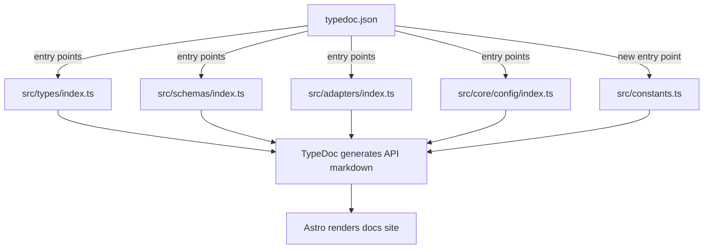

# JSDoc Enrichment — TypeDoc API Reference
- **Date**: 2026-04-07 17:22
- **Document**: 20260407_172216_SPEC_jsdoc-enrichment.md
- **Category**: SPEC

## Goal

Add JSDoc/TSDoc annotations and Zod `.describe()` calls to all public symbols across 5 modules so the TypeDoc-generated API reference becomes fully readable and actionable. No behavioral changes — pure documentation additions.

## Context

Codi exposes a programmatic API via 4 TypeDoc entry points. The generated reference today is thin:

| Module | Exported symbols | JSDoc comments today |
|---|---|---|
| `src/types/` | ~22 | 3 |
| `src/schemas/` | ~20 Zod schemas + type aliases | 0 |
| `src/adapters/` | 7 public symbols | 1 |
| `src/core/config/` | 7 functions/classes + 7 interfaces | 3 |
| `src/constants.ts` | ~40 constants + 3 functions | 9 |

The `typedoc-plugin-zod` plugin reads `.describe()` calls on Zod fields and renders them as property tables with descriptions. Adding `.describe()` to schema fields is the highest-leverage single change — it documents every frontmatter field that users author.

## Architecture



**One config change:** Add `"./src/constants.ts"` to `entryPoints` in `typedoc.json`. All other changes are documentation-only additions to source files.

## Scope: 5 Modules

### Module 1: `src/constants.ts` (new TypeDoc entry)

Add JSDoc to every exported constant group and all 3 exported functions. Constants document their purpose and valid range. Special focus on constants that schemas and validators reference, since users see these indirectly via validation errors.

Key groups to document:
- Project identity constants (`PROJECT_NAME`, `PROJECT_DIR`, `PROJECT_URL`)
- Artifact naming functions (`prefixedName`, `devArtifactName`, `resolveArtifactName`)
- Size limits (`MAX_NAME_LENGTH`, `MAX_DESCRIPTION_LENGTH`, `MAX_ARTIFACT_CHARS`)
- Supported platforms (`SUPPORTED_PLATFORMS`, `ALL_SKILL_CATEGORIES`, `MANAGED_BY_VALUES`)
- File name constants (`MANIFEST_FILENAME`, `FLAGS_FILENAME`, etc.)
- Code quality thresholds (`MIN_CODE_COVERAGE_PERCENT`, `MAX_FUNCTION_LINES`, etc.)
- CLI commands list (`CLI_COMMANDS`)

### Module 2: `src/types/`

Source files: `result.ts`, `config.ts`, `flags.ts`, `agent.ts`.

**`result.ts`** — Document the `Result<T, E>` discriminated union and its 4 helper functions. Explain the error-or-value pattern and provide examples showing both the happy path (`ok()`) and error path (`err()`).

**`config.ts`** — Document `ProjectManifest`, `NormalizedConfig`, `NormalizedRule`, `NormalizedSkill`, `NormalizedAgent`, `McpConfig`. Each interface property gets a one-line JSDoc describing its role and any constraints.

**`flags.ts`** — Document `FlagMode` (all 6 mode values explained inline), `FlagDefinition`, `FlagConditions`, `ResolvedFlag`, `ResolvedFlags`, `FlagSpec`. The mode values (`enforced`, `enabled`, `disabled`, `inherited`, `delegated_to_agent_default`, `conditional`) need plain-English explanations — they are opaque without context.

**`agent.ts`** — Document `AgentAdapter`, `AgentCapabilities`, `AgentPaths`, `GeneratedFile`, `GenerateOptions`, `FileStatus`, `AgentFileStatus`, `AgentStatus`.

### Module 3: `src/schemas/`

Source files: `manifest.ts`, `rule.ts`, `skill.ts`, `agent.ts`, `flag.ts`, `mcp.ts`, `hooks.ts`, `evals.ts`, `feedback.ts`.

**Pattern for every schema:**
1. JSDoc block on the exported `const FooSchema` explaining what this schema validates
2. `.describe("...")` on every Zod field that is not already self-explanatory from its name

**High-value field descriptions:**

`SkillFrontmatterSchema` fields needing descriptions:
- `compatibility` — which agent platforms this skill targets
- `effort` — model effort tier (low = faster/cheaper, max = highest capability)
- `context: "fork"` — runs the skill in an isolated Claude Code subagent
- `agent` — name of a registered codi agent to run this skill as
- `user-invocable` — whether users can invoke via `/skill-name` slash command
- `paths` — file glob patterns the skill is allowed to read/write
- `shell` — shell interpreter for script-type skills
- `disableModelInvocation` — pure tool skill, no LLM call
- `argumentHint` — shown to users when invoking: `/skill-name <hint>`

`AgentFrontmatterSchema` fields:
- `permissionMode` — `unrestricted`/`readonly`/`limited` tool access scope
- `isolation` — `"worktree"` runs in a git worktree copy
- `mcpServers` — MCP server names to attach from the project's mcp.yaml
- `memory` — `user`/`project`/`none` memory scope
- `background` — whether the agent runs as a background process
- `color` — color label in Claude Code's UI

`RuleFrontmatterSchema` fields:
- `priority` — `high` rules are injected first; `low` rules are appended last
- `scope` — file glob patterns; when set, rule only applies to matching files
- `alwaysApply` — `true` means the rule is injected unconditionally

`FlagDefinitionSchema.mode` values:
- `enforced` — value is fixed and cannot be overridden by agents
- `enabled` — feature is on; agents may override
- `disabled` — feature is off; agents may override
- `inherited` — uses the agent's own default (Codi does not set a value)
- `delegated_to_agent_default` — explicitly opt out of Codi management for this flag
- `conditional` — value depends on `conditions` (agent id or file pattern)

`HooksConfigSchema`:
- `runner` — which hook manager owns the hook files
- `install_method` — how hooks are written to disk (git-hooks, husky-append, etc.)

`McpConfigSchema` / `McpServerSchema` — document `type` (`stdio` vs `http`), `command`/`args` (for stdio servers), `url`/`headers` (for http servers), `enabled` flag.

`EvalsDataSchema` / `EvalCaseSchema` — document the skill evaluation system: `skillName`, `cases`, `prompt`, `expectations`, `passRate`.

`FeedbackIssueSchema` and related constants (`FEEDBACK_AGENTS`, `FEEDBACK_OUTCOMES`, `ISSUE_CATEGORIES`, `ISSUE_SEVERITIES`) — add schema-level JSDoc; field `.describe()` only for non-obvious fields (`category`, `severity`).

### Module 4: `src/adapters/`

Each of the 5 adapter constants (`claudeCodeAdapter`, `cursorAdapter`, `codexAdapter`, `windsurfAdapter`, `clineAdapter`) gets a JSDoc describing:
- Which agent/tool this adapts
- How detection works (what directory or file it looks for)
- The config root path it uses

`ALL_ADAPTERS` — document that this is the canonical registry, and that order determines priority during auto-detection.

`registerAllAdapters()` — document when to call it (before any generator operations), what it does (populates the adapter registry singleton).

### Module 5: `src/core/config/`

Source files: `resolver.ts`, `validator.ts`, `composer.ts`, `state.ts`, `parser.ts`, `index.ts`.

**`resolver.ts` → `resolveConfig()`** — Enrich the existing 1-line comment with `@param`, `@returns`, failure conditions, and a full `@example` showing how to use the Result type with `isOk`.

**`validator.ts` → `validateConfig()`** — Document what it validates (agent ids, rule names, skill sizes, flag references, platform compatibility) and what it returns.

**`composer.ts` → `flagsFromDefinitions()`** — Enrich with `@param`, `@returns`, `@example`.

**`state.ts` → `StateManager`** — Class-level JSDoc explaining the state file's role. Document every public method: `read()`, `write()`, `detectDrift()`, `saveGenerated()`, `savePresetArtifacts()`. Document state interfaces: `GeneratedFileState`, `ArtifactFileState`, `StateData`, `DriftFile`, `DriftReport`.

**`parser.ts` → `ParsedProjectDir`** — Document the interface and each field: `manifest` (parsed codi.yaml), `flags` (raw flag definitions keyed by flag name), `rules`/`skills`/`agents` (normalized artifact arrays), `mcp` (parsed mcp.yaml). Also document `scanProjectDir()` with `@param`/`@returns`/`@throws`.

## JSDoc Patterns (uniform across all modules)

**Interfaces:**
```typescript
/**
 * One sentence describing what this shape represents.
 *
 * Optional: context on where/when it appears.
 */
export interface Foo {
  /** The artifact's unique kebab-case identifier. */
  name: string;
}
```

**Functions:**
```typescript
/**
 * One sentence describing what this does.
 *
 * @param projectRoot - Absolute path to the project root directory
 * @returns A Result wrapping the resolved config, or errors if validation fails
 *
 * @example
 * ```ts
 * const result = await resolveConfig('/home/user/myapp');
 * if (isOk(result)) {
 *   console.log(result.data.rules.length);
 * }
 * ```
 */
```

**Zod schema exports:**
```typescript
/**
 * Validates the frontmatter of a `.codi/skills/<name>/SKILL.md` file.
 *
 * Used by the Codi parser when reading skills from disk.
 */
export const SkillFrontmatterSchema = z.object({
  name: z.string().describe("Unique skill name in kebab-case (e.g. 'my-skill')"),
  effort: z.enum(["low", "medium", "high", "max"])
    .describe("Model effort tier. 'low' uses faster/cheaper models; 'max' uses highest capability.")
    .optional(),
});
```

**Type aliases:**
```typescript
/**
 * One sentence on what this union represents.
 *
 * - `enforced` — value is fixed; agents cannot override
 * - `enabled` — feature is on; agents may override
 */
export type FlagMode = "enforced" | "enabled" | ...;
```

## TypeDoc Config Change

Add `"./src/constants.ts"` to the `entryPoints` array in `typedoc.json`:

```json
{
  "entryPoints": [
    "./src/types/index.ts",
    "./src/schemas/index.ts",
    "./src/adapters/index.ts",
    "./src/core/config/index.ts",
    "./src/constants.ts"
  ]
}
```

## Verification After Each Module

After documenting each module, run:
```bash
npm run docs:build
```
And confirm in the generated markdown (`docs/src/content/docs/api/`) that:
- Every exported symbol has a description paragraph (not just a type signature)
- Zod schema property tables show description text in each row
- `@example` blocks appear as fenced code in the rendered output

If `npm run docs:build` fails mid-plan, run `npx typedoc --skipErrorChecking` in isolation first to separate TypeDoc issues from Astro build issues. A passing baseline exists from before this work begins.

## Out of Scope

- `src/cli/` — internal command implementations, not public API
- All `src/core/` files not exported through `src/core/config/index.ts`
- Test files
- Any behavioral change to source code
- Changes to the Astro layout or CSS
