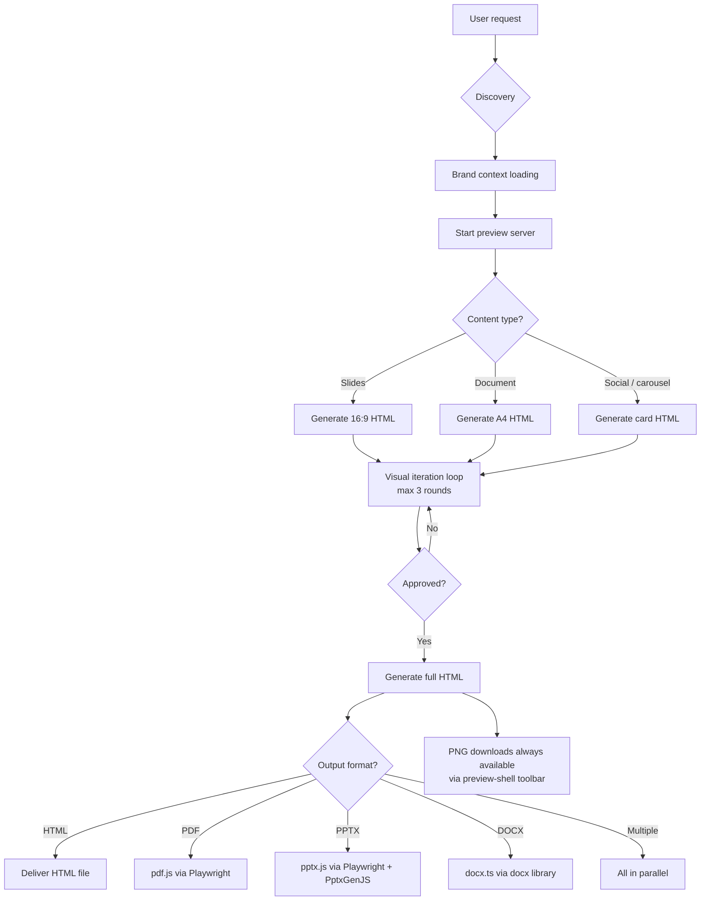

# Brand Skill Unified Workflow
- **Date**: 2026-04-07 22:17
- **Document**: 20260407_2217_SPEC_brand-skill-unified-workflow.md
- **Category**: SPEC

---

## Purpose

This document specifies the unified SKILL.md template for all brand skills (`codi-bbva`,
`codi-rl3`, `codi-codi`, and any future brand). It merges three previously separate
worlds — Format, Brand, and Content — into a single skill that owns the complete
creative and export pipeline.

---

## Architecture Summary



---

## Canonical Brand Skill Directory Layout

Every brand skill MUST follow this exact structure. No exceptions.

```
.codi/skills/{{BRAND}}/
  SKILL.md
  assets/
    logo-dark.svg
    logo-light.svg
    fonts/              ← brand webfonts (woff2)
    icons/              ← brand icon set (SVG)
  brand/
    tokens.json         ← canonical brand data (colors, fonts, voice, layout)
    tokens.ts           ← TypeScript adapter (CSS var names, SVG strings)
    tokens.css          ← CSS custom properties (inlined into all HTML outputs)
  scripts/
    server.cjs          ← brainstorming-compatible preview server (symlink or copy)
    start-server.sh     ← session launcher (returns screen_dir, state_dir, url)
    stop-server.sh      ← session cleanup
    frame-template.html ← server frame template (not used for full docs — kept for compat)
    helper.js           ← WebSocket client (injected by server into fragments)
    preview-shell.js    ← chat panel + PNG download toolbar (inlined into all HTML outputs)
    vendor/
      html2canvas.min.js ← client-side canvas renderer (required by preview-shell)
    export/
      pdf.js            ← Playwright → per-slide PDF (from codi-deck)
      pptx.js           ← NEW: Playwright screenshots + PptxGenJS rebuild
      docx.ts           ← brand-configured Word document generator
  generators/
    slides-base.html    ← 16:9 slide shell with brand CSS vars pre-loaded
    document-base.html  ← A4 document shell with brand typography
    social-base.html    ← social card shell (aspect-ratio-configurable)
  references/
    brand-guide.md      ← full brand rationale, color usage rules, voice
    ...                 ← brand-specific reference files
  evals/
```

---

## The Unified SKILL.md Template

The following is the exact prompt content that goes into each brand skill's `SKILL.md`.
Variables in `{{double braces}}` are substituted at scaffold time.
`${CLAUDE_SKILL_DIR}` is the runtime path to the installed skill directory.

---

```markdown
---
name: {{name}}
description: |
  {{BRAND_NAME}} brand content studio. Use when creating any branded deliverable
  for {{BRAND_NAME}} — presentations, documents, social content, reports,
  or any HTML/PDF/PPTX/DOCX output that must carry {{BRAND_NAME}} brand identity.
  Also activate when the user mentions '{{BRAND_TRIGGER}}' or asks for
  {{BRAND_NAME}}-branded output of any kind.
category: Brand Identity
managed_by: codi
user-invocable: true
version: 1
---

# {{name}} — {{BRAND_NAME}} Content Studio

## When to Activate

- User asks to create any content for {{BRAND_NAME}} (slides, deck, presentation,
  document, report, one-pager, social post, carousel, blog, proposal)
- User mentions '{{BRAND_TRIGGER}}' or any {{BRAND_NAME}}-related keyword
- User needs a deliverable that carries {{BRAND_NAME}} visual identity or voice

---

## Asset Map

Read all files in this table BEFORE generating any output.

| File | Read when | Purpose |
|------|-----------|---------|
| `${CLAUDE_SKILL_DIR}[[/brand/tokens.json]]` | Always | Canonical colors, fonts, layout, voice rules |
| `${CLAUDE_SKILL_DIR}[[/brand/tokens.css]]` | HTML generation | CSS custom properties to inline into all HTML |
| `${CLAUDE_SKILL_DIR}[[/brand/tokens.ts]]` | PPTX/DOCX generation | TypeScript adapter with typed brand values |
| `${CLAUDE_SKILL_DIR}[[/references/brand-guide.md]]` | Always | Usage rules, prohibited patterns, tone of voice |
| `${CLAUDE_SKILL_DIR}[[/assets/logo-dark.svg]]` | Dark theme output | SVG logo string for dark backgrounds |
| `${CLAUDE_SKILL_DIR}[[/assets/logo-light.svg]]` | Light theme output | SVG logo string for light backgrounds |
| `${CLAUDE_SKILL_DIR}[[/generators/slides-base.html]]` | Slide output | Base HTML shell for 16:9 slide decks |
| `${CLAUDE_SKILL_DIR}[[/generators/document-base.html]]` | Doc output | Base HTML shell for A4 documents |
| `${CLAUDE_SKILL_DIR}[[/generators/social-base.html]]` | Social output | Base HTML shell for social cards/carousels |

---

## Phase 1 — Discovery

**[CODING AGENT]** Ask the user the following questions before writing any code.
Ask all at once in a single message. Do NOT start generating until you have answers.

```
1. What content do you need?
   (topic, title, key points — paste a draft, bullet list, or brief description)

2. What type of output?
   □ Slides / presentation (16:9)
   □ Document / report / proposal (A4)
   □ Social content (carousel, cards, blog)

3. What output format(s)?
   □ HTML (browser preview + file download)
   □ PDF (print-ready, pixel-perfect)
   □ PPTX (editable in PowerPoint with animations)
   □ DOCX (editable Word document)
   □ PNG slides (download each slide as image)

4. Theme preference?
   □ Dark ({{BRAND_DARK_DESCRIPTION}})
   □ Light ({{BRAND_LIGHT_DESCRIPTION}})

5. Audience and tone?
   (e.g. "executive board, formal" / "internal team, casual" / "client pitch, persuasive")
```

**[CODING AGENT]** Wait for the user to answer ALL five questions before proceeding.

---

## Phase 2 — Brand Context Loading

**[CODING AGENT]** Read brand files in this order:

1. `${CLAUDE_SKILL_DIR}[[/brand/tokens.json]]` — extract colors, fonts, layout values,
   logo paths, voice rules
2. `${CLAUDE_SKILL_DIR}[[/references/brand-guide.md]]` — absorb usage rules and
   prohibited patterns
3. Read the logo SVG file matching the chosen theme (dark or light)

Create a local mental model:
- Background color, text color, accent color for the chosen theme
- Headline font, body font
- Logo SVG string (for inlining into HTML)
- Voice rules: phrases to use, phrases to avoid

---

## Phase 3 — Start Preview Server

**[CODING AGENT]** Start the preview server before generating any HTML:

```bash
bash ${CLAUDE_SKILL_DIR}[[/scripts/start-server.sh]] --project-dir $(pwd)
```

The script returns JSON like:
```json
{
  "url": "http://localhost:49XXX",
  "screen_dir": "/path/to/.codi/brainstorm/SESSION/content",
  "state_dir": "/path/to/.codi/brainstorm/SESSION/state"
}
```

Save `screen_dir` and `state_dir` — you will use them throughout the session.

Tell the user:
> "Preview server is running at {{url}}. Open it in your browser.
> I'll write prototype files there as we iterate."

---

## Phase 4 — HTML Prototype Generation

Generate the prototype HTML based on the content type selected in Phase 1.

### Rules that apply to ALL HTML outputs

1. **Read the base template** from `generators/` matching the content type
2. **Inline brand CSS** — paste the full contents of `brand/tokens.css` into a `<style>` block
3. **Inline preview-shell.js** — paste the full contents of
   `${CLAUDE_SKILL_DIR}[[/scripts/preview-shell.js]]` before `</body>`
4. **Inline html2canvas** — paste the full contents of
   `${CLAUDE_SKILL_DIR}[[/scripts/vendor/html2canvas.min.js]]` before preview-shell.js
5. **Why inline?** Browsers block external `<script src>` on `file://` protocol.
   Inlining ensures the toolbar and PNG export work when files are opened directly.
6. Write the file to `screen_dir/prototype.html` — the server auto-reloads the browser

### Slide output (16:9)

Each slide is a `<section>` element:

```html
<section class="slide" data-index="1" data-type="title">
  <!-- slide content here -->
</section>
```

**Slide structure requirements:**
- Strict 16:9 aspect ratio: `width: 960px; height: 540px` on each `.slide`
- All content inside the safe zone: 36px padding on all sides
- No overflow — content must never extend beyond the slide boundary
- Brand logo placed in a consistent position on every slide (lower-right recommended)
- Use CSS custom properties from `brand/tokens.css` for ALL colors and fonts
  (`var(--brand-bg)`, `var(--brand-text)`, `var(--brand-accent)`, etc.)

**Required `data-type` values for slides:**

| data-type | Purpose |
|-----------|---------|
| `title` | Opening slide with title, subtitle, author |
| `divider` | Section separator with section number and heading |
| `content` | Main content slide (heading + body + optional bullets) |
| `quote` | Full-bleed quote slide |
| `metrics` | Numerical highlights (max 4 per slide) |
| `table` | Data table (use `<table>` for PptxGenJS tableToSlides) |
| `closing` | Final slide with brand sign-off |

**Prototype scope:** For Phase 4, generate a prototype with only 3 slides:
- 1 title slide
- 1 representative content slide
- 1 closing slide

This keeps iteration fast. The full deck comes in Phase 6.

### Document output (A4)

```html
<section class="doc-page" data-index="1" data-type="cover">
  <!-- page content -->
</section>
```

**Document structure requirements:**
- A4 proportions: `width: 794px; min-height: 1123px` per `.doc-page`
- Scrollable vertical layout — multiple pages stack vertically
- Brand header (logo + brand color bar) on each page
- Brand footer (page number, contact) on each page

### Social / carousel output

```html
<section data-index="1" data-type="cover">
  <!-- card content -->
</section>
```

**Social structure requirements:**
- Each `<section>` is one card
- Aspect ratio set by CSS vars from brand tokens (`--brand-social-width`,
  `--brand-social-height`) — defaults: 1080×1080 (1:1)
- Preview-shell toolbar shows aspect ratio presets (1:1, 4:5, 9:16, 1200×630)
- User can switch aspect ratio in the toolbar during review

---

## Phase 5 — Visual Iteration Loop

**[CODING AGENT]** After writing `screen_dir/prototype.html`:

Tell the user:
> "Prototype is ready at {{url}}. The preview-shell toolbar at the top lets you:
> - Switch aspect ratios (slides/social)
> - Click any slide to target feedback
> - Type feedback in the chat panel on the right
> - Export any slide as PNG with the 'Export PNG' button
> - Click 'Export All PNGs' to download all slides
>
> When you're done reviewing, describe your feedback here in the terminal."

**End your turn** and wait for the user to respond.

### On your next turn — read feedback

Read from BOTH sources and merge:

**Source 1 — Browser chat panel** (most detailed):
```
mcp__playwright__browser_navigate({ url: "{{url}}" })
```
Then:
```
mcp__playwright__browser_evaluate({
  expression: "JSON.parse(document.getElementById('cf-events').textContent || '[]')"
})
```
Returns:
```json
[
  { "slide": 2, "type": "content", "text": "headline is too long", "timestamp": ... },
  { "slide": 3, "type": "closing", "text": "change background to dark", "timestamp": ... }
]
```

**Source 2 — State dir events** (click interactions):
```bash
cat {{state_dir}}/events 2>/dev/null
```
Each line is: `{"type":"click","choice":"...","text":"...","timestamp":...}`

**Source 3 — Terminal text** (user's direct message)

Merge all three sources. Apply each piece of feedback to the relevant slide.
Rewrite `screen_dir/prototype.html` — the server auto-reloads.

### Iteration limits

- **Maximum 3 rounds** of style/layout iteration
- After round 3, if no approval: present the best version and ask the user to choose
- Once the user says "approved", "looks good", "use this", or similar → proceed to Phase 6

---

## Phase 6 — Full Content Generation

**[CODING AGENT]** Generate the complete HTML output using the approved style.

For slides:
- Generate ALL slides defined by the user's content in Phase 1
- Every slide uses the approved style, brand CSS vars, and consistent brand elements
- Maintain `data-index` sequence starting at 1
- Write to `screen_dir/deck.html` (not `prototype.html`)

For documents:
- Generate all pages with consistent headers/footers
- Write to `screen_dir/document.html`

For social:
- Generate all cards in the series
- Write to `screen_dir/social.html`

Tell the user:
> "Full [deck/document/carousel] is ready at {{url}} — [N] slides/pages.
> You can export PNGs from the toolbar. Ready to generate [FORMAT]?"

---

## Phase 7 — Export

Run the export script(s) corresponding to the format(s) the user selected in Phase 1.
All export scripts read the fully generated HTML from Phase 6.

### HTML

No additional work required. Tell the user:
> "The HTML file is at: `screen_dir/[deck|document|social].html`
> You can open it in any browser."

### PDF

```bash
node ${CLAUDE_SKILL_DIR}[[/scripts/export/pdf.js]] \
  --input screen_dir/deck.html \
  --output output/{{filename}}.pdf
```

Requires: `npx playwright install chromium` (run once)

### PPTX

```bash
node ${CLAUDE_SKILL_DIR}[[/scripts/export/pptx.js]] \
  --input screen_dir/deck.html \
  --tokens ${CLAUDE_SKILL_DIR}[[/brand/tokens.json]] \
  --theme dark|light \
  --output output/{{filename}}.pptx
```

What `pptx.js` does internally:
1. Playwright renders each `.slide` at 1920×1080 → PNG screenshot (base64)
2. PptxGenJS creates a 16:9 (10"×5.625") slide for each:
   - `addImage(screenshot, fullBleed)` — pixel-perfect visual from the HTML
   - `addText(...)` from DOM-extracted text → editable text layer in PowerPoint
   - `tableToSlides()` for slides with `<table>` elements → editable PPTX tables
   - `addTransition()` per slide (brand-specific default)
   - `addAnimation()` on title and key text elements (entrance animations)
3. Saves `output/{{filename}}.pptx`

Requires: `npm install pptxgenjs` (run once per project)

### DOCX

```bash
npx tsx ${CLAUDE_SKILL_DIR}[[/scripts/export/docx.ts]] \
  --input screen_dir/document.html \
  --tokens ${CLAUDE_SKILL_DIR}[[/brand/tokens.json]] \
  --theme dark|light \
  --output output/{{filename}}.docx
```

Requires: `npm install docx` (run once per project)

---

## Phase 8 — Stop Server

After delivering the final output:

```bash
bash ${CLAUDE_SKILL_DIR}[[/scripts/stop-server.sh]] {{session_dir}}
```

---

## PNG Downloads — Always Available

The preview-shell toolbar is injected into every HTML output in Phase 4.
The user can download PNGs at any point without waiting for Phase 7.

**Per-slide export:** Hover over any slide → "Export PNG" button appears
**Bulk export:** Click "Export All PNGs" in the toolbar → downloads all slides sequentially

PNG resolution: 2× the display size (2160×1080 for 16:9 slides at 1920×1080 render)
Format: `slide-01-title.png`, `slide-02-content.png`, etc.

---

## Content Input Schema

The agent should use this schema when structuring slide content from user input.
This is an internal data structure — not a file the user needs to write.

```typescript
interface BrandDeck {
  title: string;
  subtitle?: string;
  author?: string;
  date?: string;
  theme: "dark" | "light";
  slides: Array<
    | { type: "title" }
    | { type: "divider"; number: string; label: string; heading: string }
    | { type: "content"; heading: string; body?: string; items?: string[]; callout?: string }
    | { type: "quote"; quote: string; attribution?: string }
    | { type: "metrics"; heading?: string; metrics: Array<{ value: string; label: string }> }
    | { type: "table"; heading?: string; rows: string[][] }
    | { type: "closing"; message: string; contact?: string }
  >;
}
```

---

## Brand Voice Enforcement

Before writing ANY copy (headlines, body text, captions):
- Read the `voice` section of `brand/tokens.json`
- Apply `phrases_use`: use these phrases, patterns, and tone markers
- Apply `phrases_avoid`: never use these phrases — rewrite if they appear
- Read `references/brand-guide.md` for extended copy rules

---

## Error Handling

| Error | Recovery |
|-------|----------|
| Server fails to start | Check port availability; retry with different port via `BRAINSTORM_PORT=XXXXX` |
| Playwright not installed | Run `npx playwright install chromium` then retry export |
| pptxgenjs not found | Run `npm install pptxgenjs` then retry |
| html2canvas export fails | Tell user to use Playwright-based PDF export instead |
| Screen dir not writable | Fall back to `/tmp/brand-preview-SESSION` |
```

---

## Implementation Plan

### Skills to create/modify

| Action | Skill | Files affected |
|--------|-------|---------------|
| Rewrite | `codi-bbva-brand` | `template.ts`, add `pptx.js`, add `server.*`, add `generators/` |
| Rewrite | `codi-rl3-brand` | `template.ts`, add all export scripts, add `generators/` |
| Rewrite | `codi-codi-brand` | `template.ts`, add all export scripts |
| Rewrite | `brand-identity` | `template.ts` — scaffold new brand skill in unified structure |
| Remove | `codi-deck` | Entire skill removed |
| Reduce scope | `codi-pptx` | Keep for editing existing files; remove generation routing |
| Reduce scope | `codi-docx` | Keep for editing existing files; remove generation routing |
| Keep as-is | `codi-pdf` | Manipulation only — no change |
| Keep as-is | `codi-xlsx` | Data tool — not absorbed into brand skills |
| Keep as-is | `codi-content-factory` | Keep until absorbed per brand (Phase 2 of rollout) |

### Python removal

All `scripts/python/` directories in brand skills are removed.
All `pptx.py` files are deleted.
No new Python is introduced anywhere in brand skills.

### Execution order

```
Step 1: Build scripts/export/pptx.js  (new PptxGenJS export engine)
Step 2: Copy brainstorming scripts/    (server.cjs, start-server.sh, stop-server.sh,
                                        frame-template.html, helper.js)
Step 3: Copy preview-shell.js +        (from content-factory, add to brand skill scripts/)
        html2canvas.min.js
Step 4: Write generators/              (slides-base.html, document-base.html, social-base.html)
Step 5: Write unified template.ts      (the SKILL.md from this spec, brand vars substituted)
Step 6: Apply to codi-bbva-brand       (first full migration)
Step 7: Apply to codi-rl3-brand
Step 8: Apply to codi-codi-brand
Step 9: Update brand-identity template
Step 10: Remove codi-deck skill
Step 11: Update codi-pptx / codi-docx descriptions
Step 12: Run codi generate + full test
```

### Files per brand skill (new additions)

| File | Source |
|------|--------|
| `scripts/server.cjs` | Copy from `brainstorming/scripts/` |
| `scripts/start-server.sh` | Copy from `brainstorming/scripts/` |
| `scripts/stop-server.sh` | Copy from `brainstorming/scripts/` |
| `scripts/frame-template.html` | Copy from `brainstorming/scripts/` |
| `scripts/helper.js` | Copy from `brainstorming/scripts/` |
| `scripts/preview-shell.js` | Copy from `content-factory/assets/` |
| `scripts/vendor/html2canvas.min.js` | Copy from `content-factory/assets/vendor/` |
| `scripts/export/pdf.js` | Copy from `deck/scripts/export/` |
| `scripts/export/pptx.js` | **NEW** — PptxGenJS implementation |
| `scripts/export/docx.ts` | Adapt from `docx/scripts/ts/generate_docx.ts` |
| `generators/slides-base.html` | **NEW** per brand |
| `generators/document-base.html` | **NEW** per brand |
| `generators/social-base.html` | **NEW** per brand |
| `brand/tokens.css` | **NEW** — derived from existing `brand_tokens.json` |

### Files per brand skill (removed)

| File | Reason |
|------|--------|
| `scripts/python/` | Python removed entirely |
| `scripts/ts/generate_pptx.ts` (BBVA only) | Replaced by `scripts/export/pptx.js` |
