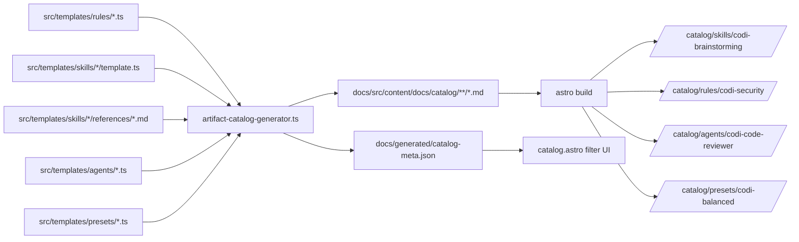

# Artifact Catalog Site Integration
- **Date**: 2026-04-08 11:23
- **Document**: 20260408_112350_[SPEC]_artifact-catalog-site.md
- **Category**: SPEC

---

## Goal

Integrate all Codi artifact templates (rules, skills, agents, presets) into the existing Astro docs site as browsable, filterable, searchable catalog pages — rendered in Markdown by Astro's native pipeline, styled with the Codi dark theme.

---

## Problem Statement

The current state:

| Gap | Impact |
|-----|--------|
| `skill-docs-generator.ts` covers only skills (42/120+ artifacts) | Rules, agents, presets are invisible to users |
| The standalone HTML catalog uses system-ui/light style, not the codi dark theme | Visual inconsistency with the main docs site |
| Skills with `references/*.md` are not exposed anywhere | 20 skills have companion markdown docs that are silently dropped |
| No individual artifact URLs | Artifacts cannot be shared, linked, or indexed by search engines |
| No filtering by type, category, compatibility | Discovery requires reading the full list |

---

## Approach: Option C — Static Pages + Metadata Index

A build-time generator writes individual Markdown files (one per artifact) into `docs/src/content/docs/catalog/`. Astro's existing glob content collection picks them up automatically and renders them with full Shiki syntax highlighting. A separate metadata-only JSON drives a client-side filter UI on the catalog index page.



---

## Data Model

### Artifact entry types

**Skill entry** (from `template.ts` frontmatter + body + `references/*.md`):
```typescript
interface SkillCatalogEntry {
  type: "skill";
  name: string;           // e.g. "codi-brainstorming"
  description: string;
  category: string;       // e.g. "developer_workflow"
  userInvocable: boolean;
  compatibility: string[]; // ["claude-code", "cursor", ...]
  version: number;
  body: string;           // full markdown body (after frontmatter)
  references: Array<{ filename: string; content: string }>;
}
```

**Rule entry** (from `template.ts` frontmatter + body):
```typescript
interface RuleCatalogEntry {
  type: "rule";
  name: string;           // e.g. "codi-security"
  description: string;
  priority: string;       // "high" | "medium" | "low"
  alwaysApply: boolean;
  version: number;
  body: string;
}
```

**Agent entry** (from `template.ts` frontmatter + body):
```typescript
interface AgentCatalogEntry {
  type: "agent";
  name: string;           // e.g. "codi-code-reviewer"
  description: string;
  tools: string[];        // ["Read", "Grep", ...]
  model: string;          // "inherit" | specific model id
  version: number;
  body: string;
}
```

**Preset entry** (from `BUILTIN_PRESETS` TypeScript objects):
```typescript
interface PresetCatalogEntry {
  type: "preset";
  name: string;           // e.g. "codi-balanced"
  description: string;
  version: string;
  tags: string[];
  compatibilityEngines: string;  // e.g. ">=0.3.0"
  compatibilityAgents: string[]; // ["claude-code", "cursor", ...]
  rules: string[];
  skills: string[];
  flagCount: number;
  body: string;           // rendered markdown: flag table + rules/skills lists
}
```

### catalog-meta.json (filter UI only — no bodies)

```json
{
  "generatedAt": "2026-04-08T11:23:50Z",
  "counts": { "skills": 70, "rules": 28, "agents": 22, "presets": 6 },
  "categories": ["developer_workflow", "brand", "content", "..."],
  "compatibilities": ["claude-code", "cursor", "windsurf", "cline", "codex"],
  "artifacts": [
    {
      "type": "skill",
      "name": "codi-brainstorming",
      "description": "Design exploration before implementation...",
      "slug": "catalog/skills/codi-brainstorming",
      "category": "developer_workflow",
      "userInvocable": true,
      "compatibility": ["claude-code", "cursor", "windsurf", "cline", "codex"],
      "version": 8
    }
  ]
}
```

---

## Generated Markdown File Format

### Skills (`docs/src/content/docs/catalog/skills/<name>.md`)

```markdown
---
title: codi-brainstorming
description: Design exploration before implementation...
sidebar:
  label: codi-brainstorming
artifactType: skill
artifactCategory: developer_workflow
userInvocable: true
compatibility:
  - claude-code
  - cursor
  - windsurf
version: 8
---

[full skill body — verbatim markdown from template]

---

## Reference: visual-companion

[content of references/visual-companion.md]

---

## Reference: spec-document-reviewer-prompt

[content of references/spec-document-reviewer-prompt.md]
```

### Rules (`docs/src/content/docs/catalog/rules/<name>.md`)

```markdown
---
title: codi-security
description: Security best practices and vulnerability prevention
sidebar:
  label: codi-security
artifactType: rule
priority: high
alwaysApply: true
version: 1
---

[full rule body — verbatim markdown from template]
```

### Agents (`docs/src/content/docs/catalog/agents/<name>.md`)

```markdown
---
title: codi-code-reviewer
description: Use when reviewing PRs or code changes...
sidebar:
  label: codi-code-reviewer
artifactType: agent
tools:
  - Read
  - Grep
  - Glob
  - Bash
model: inherit
version: 1
---

[full agent body — verbatim markdown from template]
```

### Presets (`docs/src/content/docs/catalog/presets/<name>.md`)

```markdown
---
title: codi-balanced
description: Recommended — security on, type-checking strict
sidebar:
  label: codi-balanced
artifactType: preset
version: "1.0.0"
tags:
  - balanced
  - recommended
  - general
compatibilityAgents:
  - claude-code
  - cursor
---

## Included Rules

`codi-code-style`, `codi-error-handling`, ...

## Included Skills

`codi-brainstorming`, `codi-debugging`, ...

## Flag Configuration

| Flag | Value |
|------|-------|
| auto_commit | false |
| security_scan | true |
| ...
```

---

## Catalog Index Page (`/catalog`)

**URL**: `https://lehidalgo.github.io/codi/docs/catalog`

**Layout**: Uses `DocsLayout.astro` (same dark theme, same nav)

**Interactions** (all client-side, vanilla JS, no framework):

```
[ All ] [ Skills (70) ] [ Rules (28) ] [ Agents (22) ] [ Presets (6) ]   ← type tabs

[ developer_workflow ] [ brand ] [ content ] [ qa ] ...                  ← category chips

[ claude-code ] [ cursor ] [ windsurf ] [ cline ] [ codex ]             ← compat chips

[ ] User-invocable only                                                  ← toggle

[ Search artifacts...                                   ]                ← search box

─────────────────────────────────────────────────────────
│ skill  codi-brainstorming                             │
│ developer_workflow  claude-code cursor windsurf       │
│ Design exploration before implementation...           →│
─────────────────────────────────────────────────────────
```

Each card: type badge + name + category badge + compat badges + description + arrow link to individual page.

Filtering is additive (AND): all active filters must match.

Search filters on `name` + `description` (case-insensitive substring match).

---

## Source Code Changes

### New files

| File | Purpose | Est. LOC |
|------|---------|---------|
| `src/core/docs/artifact-catalog-generator.ts` | Orchestrator — calls collectors, writes markdown files and meta JSON | ~350 |
| `docs/src/pages/catalog.astro` | Catalog index page with filter UI | ~200 |

### Modified files

| File | Change |
|------|--------|
| `src/core/docs/skill-docs-generator.ts` | Add `collectRuleEntries()`, `collectAgentEntries()`, `collectPresetEntries()` (~150 lines added) |
| `src/cli/docs.ts` | Add `--catalog` flag, wire to `generateArtifactCatalog()` |
| `docs/src/layouts/DocsLayout.astro` | Add static "Catalog" link in sidebar |
| `docs/src/content.config.ts` | Add artifact-specific frontmatter fields to schema |
| `package.json` | Update `docs:build` to run `codi docs --catalog` first |
| `.gitignore` | Add `docs/src/content/docs/catalog/` and `docs/generated/` |

### Gitignored (generated at build time)

```
docs/src/content/docs/catalog/   ← generated markdown pages
docs/generated/                  ← catalog-meta.json
```

---

## Build Pipeline

```
npm run docs:build
  1. codi docs --catalog
       → writes docs/src/content/docs/catalog/**/*.md  (~120 files)
       → writes docs/generated/catalog-meta.json
  2. typedoc
       → writes docs/src/content/docs/api/**
  3. astro build
       → renders all pages including catalog/**
       → outputs to site/docs/
```

The `--catalog` step must complete before `astro build` reads the content collection.

---

## Constraints

- `artifact-catalog-generator.ts` must stay under 700 LOC — split collectors to `skill-docs-generator.ts`
- No changes to `src/core/docs/skill-docs-generator.ts`'s existing public API (`collectSkillEntries`, `exportSkillCatalogJson`, `generateSkillDocsHtml`) — backward compatibility
- `catalog.astro` uses only the codi CSS variables already defined in `site/style.css` — no new styles unless strictly necessary
- Reference files are only markdown — skip `.ts`, `.js`, `.py` files in `references/`
- The `docs/src/content/docs/catalog/` directory is created fresh on every build — no stale files
