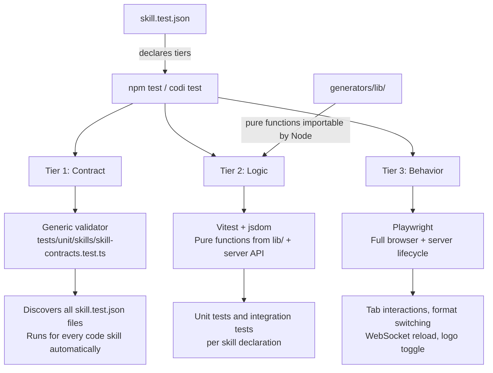

# Skill Testing Framework
- **Date**: 2026-04-11 15:36
- **Document**: 20260411_153614_[PLAN]_skill-testing-framework.md
- **Category**: PLAN

---

## Overview

Codi skills that contain runnable code (JavaScript servers, browser apps, generator scripts) currently have zero automated test coverage. This plan introduces a tiered testing framework that integrates with the existing Vitest pipeline, scales to all 68 skills without forcing complexity on simple skills, and lays the foundation for a `codi test` CLI command that works in consumer projects.

---

## Constraints

- Skill runtimes must be JavaScript/Node. Python is allowed for helper scripts only, not for testable skill code.
- Tests for Phase 1 run inside `npm test` — no new CI jobs required.
- Simple markdown skills with no code need zero changes and get no test overhead.
- The framework must work for future code skills, not just `content-factory`.

---

## Architecture

Three tiers, each scoped to what the skill actually is.



### Tier summary

| Tier | Name | Tools | Who runs it | Opt-in |
|------|------|-------|-------------|--------|
| 1 | Contract | Vitest (in-process) | Automatic for all skills with `skill.test.json` | No — declaring `skill.test.json` is enough |
| 2 | Logic | Vitest + jsdom | npm test + codi test | Yes — declare `tiers.logic` |
| 3 | Behavior | Playwright | Release CI + codi test | Yes — declare `tiers.behavior` |

---

## Component 1: `skill.test.json` — Tier manifest

Lives at the root of any skill that has testable code. Declares what exists and where.

```json
{
  "skill": "content-factory",
  "tiers": {
    "contract": true,
    "logic": {
      "lib": "generators/lib/",
      "tests": "tests/unit/"
    },
    "behavior": {
      "server": "scripts/server.cjs",
      "startScript": "scripts/start-server.sh",
      "tests": "tests/e2e/"
    }
  }
}
```

A new Zod schema (`src/schemas/skill-test.ts`) validates the manifest. The `codi validate` command includes it. Skills without `skill.test.json` are transparent to the framework.

### Schema

```ts
// src/schemas/skill-test.ts
const SkillTestManifestSchema = z.object({
  skill: z.string(),
  tiers: z.object({
    contract: z.boolean().default(true),
    logic: z.object({
      lib: z.string(),
      tests: z.string(),
    }).optional(),
    behavior: z.object({
      server: z.string(),
      startScript: z.string(),
      tests: z.string(),
      // port is informational only — the server always binds to a random available port
      // via the start script and reports the actual URL in its stdout JSON.
      // Do not use this field to hard-code a port; use the resolved URL from startServer().
      port: z.number().optional(),
    }).optional(),
  }),
});
```

---

## Component 2: `generators/lib/` — Extracted pure functions

The structural change that enables Tier 2. Pure functions move from `app.js` into a `lib/` subfolder that Node/Vitest can import without a DOM context.

### Functions to extract from `content-factory/generators/app.js`

| Function | Target file | What changes |
|----------|-------------|--------------|
| `parseCards(html)` | `lib/cards.js` | No change — already pure |
| `parseTemplate(html, filename)` | `lib/cards.js` | No change — already pure |
| `buildCardDoc(card, fmt, logo, handle)` | `lib/card-builder.js` | `handle` becomes a param instead of reading `state.handle` |
| `buildThumbDoc(card)` | `lib/card-builder.js` | No change — already pure |
| `cardFormat(card, stateFormat)` | `lib/card-builder.js` | `stateFormat` becomes a param instead of reading `state.format` |
| `computeCardSize(card, fmt, canvasW, canvasH, zoom, viewMode)` | `lib/card-builder.js` | Canvas dimensions become params instead of reading `$("canvas")` |

`app.js` keeps all DOM-dependent code: `buildCardEl`, `renderCards`, `init`, event listeners, WebSocket handler. It imports from `lib/` instead of defining the pure functions inline.

### Resulting structure for `content-factory`

```
src/templates/skills/content-factory/
  generators/
    lib/
      cards.js          ← parseCards, parseTemplate
      card-builder.js   ← buildCardDoc, buildThumbDoc, cardFormat, computeCardSize
    app.js              ← imports from lib/, keeps DOM/render code
    app.css
    app.html
    server.cjs
    templates/
      *.html
  tests/
    unit/
      cards.test.js
      card-builder.test.js
    integration/
      server.test.js
    e2e/
      gallery.spec.ts
      preview.spec.ts
  skill.test.json
```

---

## Component 3: `tests/unit/skills/skill-contracts.test.ts` — Tier 1 validator

One file in the main Codi test suite. Discovers all `skill.test.json` files and validates every code skill automatically. No per-skill code needed.

### Assertions per skill

```
✓ skill.test.json parses and matches SkillTestManifestSchema
✓ All declared paths exist (lib/, server, startScript, tests/)
✓ All template HTML files have a parseable codi:template meta tag
✓ meta tag has required fields: id, name, type, format.w, format.h
✓ type is one of: social | slides | document
✓ parseCards(html) returns > 0 cards for every template file
✓ Every card has data-type and data-index attributes
```

The last two assertions dynamically import `parseCards` from the skill's own `lib/` — so the contract test also verifies the lib extraction is wired correctly.

### Bugs this would have caught in today's session

| Bug | Assertion that catches it |
|-----|--------------------------|
| `.doc-page` and `.slide` not in selector | `parseCards(html) > 0 cards` fails for doc-article and clean-slides |
| Invalid `codi:template` JSON | `JSON.parse` throws on meta content |
| Card missing `data-type` | attribute presence assertion |

---

## Component 4: Skill-level unit and integration tests — Tier 2

Discovered by the updated vitest glob. Tests the logic extracted to `lib/` and the server API.

### Unit test examples (`tests/unit/cards.test.js`)

```js
import { parseCards, parseTemplate, cardFormat } from "../../generators/lib/cards.js";

describe("parseCards", () => {
  it("parses .social-card elements", () => {
    const html = `<body>
      <article class="social-card" data-type="cover" data-index="01"></article>
      <article class="social-card" data-type="content" data-index="02"></article>
    </body>`;
    expect(parseCards(html)).toHaveLength(2);
  });

  it("parses .doc-page elements", () => {
    const html = `<article class="doc-page" data-type="cover" data-index="01"></article>`;
    expect(parseCards(html)).toHaveLength(1);
  });

  it("parses .slide elements", () => {
    const html = `<section class="slide" data-type="title" data-index="01"></section>`;
    expect(parseCards(html)).toHaveLength(1);
  });
});

// stateFormat type: plain object { w: number, h: number } — same shape as state.format
describe("cardFormat", () => {
  it("returns state format for non-A4 cards", () => {
    expect(cardFormat({ format: null }, { w: 1080, h: 1350 })).toEqual({ w: 1080, h: 1350 });
  });

  it("returns native format for A4 cards (w=794)", () => {
    expect(cardFormat({ format: { w: 794, h: 1123 } }, { w: 1080, h: 1080 }))
      .toEqual({ w: 794, h: 1123 });
  });
});
```

### Unit test examples (`tests/unit/card-builder.test.js`)

```js
import { buildCardDoc } from "../../generators/lib/card-builder.js";

describe("buildCardDoc", () => {
  it("injects format CSS override after template styles", () => {
    const card = { html: "<div></div>", styleText: ":root{--w:1080px}", linkTags: "", format: null };
    const doc = buildCardDoc(card, { w: 1080, h: 1350 });
    expect(doc).toContain(":root{--w:1080px;--h:1350px}");
    expect(doc).toContain(".social-card{width:1080px!important;height:1350px!important}");
  });

  it("replaces @handle placeholder", () => {
    const card = { html: "<span>@handle</span>", styleText: "", linkTags: "", format: null };
    const doc = buildCardDoc(card, { w: 1080, h: 1080 }, null, "testuser");
    expect(doc).toContain("@testuser");
    expect(doc).not.toContain("@handle");
  });

  it("A4 cards inject native format vars regardless of stateFormat", () => {
    const card = { html: "<div></div>", styleText: "", linkTags: "", format: { w: 794, h: 1123 } };
    const doc = buildCardDoc(card, { w: 1080, h: 1080 });
    expect(doc).toContain("--w:794px;--h:1123px");
  });
});
```

### Integration test examples (`tests/integration/server.test.js`)

```js
import { beforeAll, afterAll, describe, it, expect } from "vitest";
import { spawn } from "node:child_process";
import { mkdtempSync, rmSync } from "node:fs";
import { tmpdir } from "node:os";
import path from "node:path";

// vitest timeout for this file — server startup can take up to 3s
vi.setConfig({ testTimeout: 15_000 });

let serverProcess;
let baseUrl;
let tempDir;

// startServer: spawns scripts/start-server.sh, waits for the JSON startup line,
// and resolves with { url, screen_dir, state_dir }. Rejects after 8s if no output.
async function startServer() {
  tempDir = mkdtempSync(path.join(tmpdir(), "codi-cf-test-"));
  return new Promise((resolve, reject) => {
    const timer = setTimeout(() => reject(new Error("Server did not start within 8s")), 8000);
    const proc = spawn("bash", [
      path.resolve("scripts/start-server.sh"),
      "--name", "test",
      "--project-dir", tempDir,
    ]);
    serverProcess = proc;
    proc.stdout.on("data", (chunk) => {
      const line = chunk.toString().trim();
      try {
        const data = JSON.parse(line);
        if (data.type === "server-started") { clearTimeout(timer); resolve(data); }
      } catch { /* not JSON yet */ }
    });
    proc.on("error", (err) => { clearTimeout(timer); reject(err); });
    proc.on("exit", (code) => {
      if (code !== 0) { clearTimeout(timer); reject(new Error(`Server exited with code ${code}`)); }
    });
  });
}

beforeAll(async () => {
  const result = await startServer();
  baseUrl = result.url;
});

afterAll(() => {
  serverProcess?.kill();
  if (tempDir) rmSync(tempDir, { recursive: true, force: true });
});

describe("GET /api/templates", () => {
  it("returns array of .html filenames", async () => {
    const files = await fetch(`${baseUrl}/api/templates`).then(r => r.json());
    expect(Array.isArray(files)).toBe(true);
    expect(files.length).toBeGreaterThan(0);
    expect(files.every(f => f.endsWith(".html"))).toBe(true);
  });
});

describe("GET /api/template", () => {
  it("returns HTML with codi:template meta for a known template", async () => {
    const html = await fetch(`${baseUrl}/api/template?file=dark-editorial.html`).then(r => r.text());
    expect(html).toContain('name="codi:template"');
  });
});

describe("GET /api/state", () => {
  it("returns structured state object", async () => {
    const state = await fetch(`${baseUrl}/api/state`).then(r => r.json());
    expect(state).toHaveProperty("activeFile");
    expect(state).toHaveProperty("activePreset");
    expect(state).toHaveProperty("preset");
  });
});
```

---

## Component 5: Playwright E2E tests — Tier 3

```
src/templates/skills/content-factory/tests/e2e/
  gallery.spec.ts    ← tab clickable immediately, templates render with cards
  preview.spec.ts    ← format change resizes cards, logo toggle works globally
  server.spec.ts     ← WebSocket triggers reload on content file change
```

### Key E2E scenarios

```ts
// gallery.spec.ts
test("Gallery tab responds before templates finish loading", async ({ page }) => {
  await page.goto(baseUrl);
  // Click immediately — do not wait for templates
  await page.click('[data-view="gallery"]');
  await expect(page.locator("#view-gallery")).toHaveClass(/active/);
});

// preview.spec.ts
test("Format change updates card iframe dimensions", async ({ page }) => {
  await loadTemplate(page, "dark-editorial");
  await page.click('[data-w="1080"][data-h="1350"]'); // 4:5 portrait
  const iframe = page.frameLocator(".card-frame iframe").first();
  const height = await iframe.evaluate(el => el.offsetHeight);
  expect(height).toBeGreaterThan(1080); // portrait is taller than square
});

test("Logo toggle turns off all card overlays", async ({ page }) => {
  await loadTemplate(page, "dark-editorial");
  await page.click("#logo-toggle");
  const overlays = await page.locator(".card-logo-overlay").all();
  for (const overlay of overlays) {
    await expect(overlay).toHaveCSS("display", "none");
  }
});
```

---

## Component 6: `codi test` CLI command — Phase 2

### Interface

```bash
codi test                                  # all tiers, all code skills
codi test content-factory                  # all tiers, one skill
codi test content-factory --tier contract  # single tier
codi test --json                           # structured output for CI
```

### Internal structure

```
src/
  cli/
    test.ts                      ← Commander command, arg parsing
  core/
    skill-test/
      runner.ts                  ← orchestrates tiers, aggregates results
      manifest.ts                ← reads + validates skill.test.json
      tier1-contract.ts          ← in-process static assertions
      tier2-logic.ts             ← spawns vitest subprocess
      tier3-behavior.ts          ← spawns playwright subprocess
      result.ts                  ← shared result types
```

### Path resolution

- **Inside Codi repo**: `src/templates/skills/<name>/skill.test.json`
- **Consumer project**: `.claude/skills/codi-<name>/skill.test.json`

Skills carry their own tests when distributed via preset. A consumer running `codi test content-factory` in their project runs the tests bundled with the installed skill.

---

## Vitest config changes

```ts
// vitest.config.ts
test: {
  include: [
    "tests/**/*.test.ts",
    "src/templates/skills/**/tests/**/*.test.{ts,js}",  // new
  ],
  coverage: {
    include: [
      "src/**/*.ts",
      "src/templates/skills/**/generators/lib/**/*.js",  // new
    ],
    exclude: [
      // existing exclusions...
      "src/templates/skills/**/scripts/**",  // keep — server.cjs excluded from coverage
    ],
    thresholds: {
      // existing thresholds...
      "src/templates/skills/**/generators/lib/**": {
        statements: 80,
        branches: 70,
        functions: 85,
      },
    },
  },
}
```

---

## CI integration

### Phase 1: `npm test` (immediate)

No new CI jobs. Tier 1 and Tier 2 run inside the existing test pipeline.

| Gate | Tiers | Blocks |
|------|-------|--------|
| PR check | Tier 1 + Tier 2 | Merge to main |
| Release check | Tier 1 + Tier 2 + Tier 3 | Version bump |

### Phase 2: Release gate (Playwright)

```yaml
# Dedicated job, runs on release branches only
- run: codi test content-factory --tier behavior
```

---

## Implementation phases

### Phase 1 — Core infrastructure + content-factory (delivers immediate CI value)

1. Add `src/schemas/skill-test.ts` with `SkillTestManifestSchema`
2. Add `tests/unit/skills/skill-contracts.test.ts` (Tier 1 generic validator)
3. Extract pure functions from `app.js` → `generators/lib/cards.js` + `generators/lib/card-builder.js`
4. Update `app.js` to import from `lib/`
5. Write `tests/unit/cards.test.js` and `tests/unit/card-builder.test.js`
6. Write `tests/integration/server.test.js`
7. Add `skill.test.json` to `content-factory`
8. Update `vitest.config.ts` with new globs and coverage paths
9. Run `codi generate --force` to sync changes from `src/templates/skills/content-factory/` to `.claude/skills/codi-content-factory/`. This copies the updated `lib/`, `tests/`, and `skill.test.json` into the installed skill directory so they travel with the skill when distributed.

### Phase 2 — CLI command + Playwright (completes the framework)

1. Add `src/cli/test.ts` Commander command
2. Add `src/core/skill-test/` runner, manifest reader, tier orchestrators
3. Write `tests/e2e/` Playwright specs for `content-factory`
4. Update CI to run Tier 3 on release branches
5. Document the framework in `docs/` for skill authors

---

## Validation criteria

Phase 1 is complete when:
- `npm test` passes with Tier 1 + Tier 2 coverage
- The 5 bugs fixed in the current session are covered by at least one test each
- `lib/` functions have ≥ 80% coverage
- No regressions in existing test thresholds

Phase 2 is complete when:
- `codi test content-factory` runs all three tiers from CLI
- Playwright specs pass for the 3 core interaction scenarios
- A second code skill (e.g. `codi-brand`) can adopt the framework by adding `skill.test.json` with no changes to Codi core
