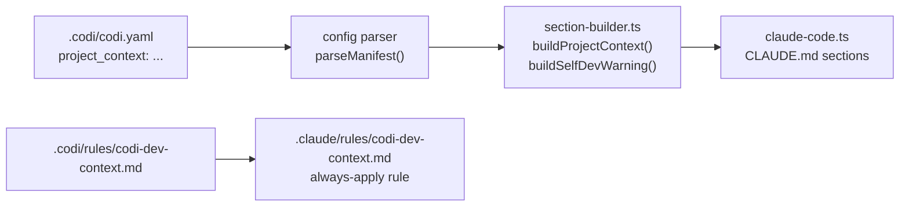
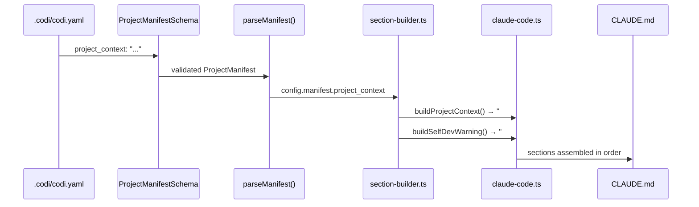

# Codi Self-Awareness: Project Context Guidance

- **Date**: 2026-04-11 22:02
- **Document**: 20260411_220211_[PLAN]_codi-self-awareness.md
- **Category**: PLAN

## Goal

Make Claude aware of which context it is operating in — the Codi source repo or a consumer project — so it always edits the right files and never confuses generated output with source.

Three independent layers, each solving a different scope:

| Layer | Scope | Mechanism |
|-------|-------|-----------|
| A — Custom rule | This repo only (immediate) | `.codi/rules/codi-dev-context.md` always-apply rule |
| B — Auto-inject section | Codi self-dev (automatic) | `buildSelfDevWarning()` in `section-builder.ts` when `name === "codi"` |
| C — `project_context` field | Any project (general) | New optional field in `codi.yaml` → injected into CLAUDE.md |

---

## Architecture



---

## Layer A — Custom Rule

**File**: `.codi/rules/codi-dev-context.md`
**Frontmatter**: `managed_by: user`, `alwaysApply: true`, `priority: high`

Content covers:

1. A clear header: "You are working on the Codi source code — not a consumer project."
2. A source/output distinction table:

| To change | Edit | Never edit |
|-----------|------|------------|
| A rule template | `src/templates/rules/<name>.md` | `.claude/rules/` (generated) |
| A skill template | `src/templates/skills/<name>/template.ts` | `.claude/skills/<name>/SKILL.md` (generated) |
| An agent template | `src/templates/agents/<name>.md` | `.claude/agents/` (generated) |
| This project's own rules | `.codi/rules/<name>.md` | `.claude/rules/` (generated output) |

3. When to bump artifact versions (edit `version:` in template frontmatter when content changes).
4. The test loop: edit `src/templates/` → `pnpm build` → `codi generate` in a test project.
5. `.claude/` is always generated — any manual edit there is overwritten on next `codi generate`.

This rule is `managed_by: user` so `codi generate` and `codi update` never overwrite it.

---

## Layer B — Auto-Inject Section

**File to change**: `src/adapters/section-builder.ts`

Add a new exported function. The constant `PROJECT_NAME` resolves to `"codi"` (verified in `src/constants.ts` line 6). The `.codi/codi.yaml` in this repo has `name: codi`, so the check fires correctly:

```typescript
export function buildSelfDevWarning(config: NormalizedConfig): string | null {
  if (config.manifest.name !== PROJECT_NAME) return null;
  // returns a ## Self-Development Mode section with the source/output table
}
```

**File to change**: `src/adapters/claude-code.ts` (line ~101, `generate()` method)

Insert the call immediately after `buildProjectOverview`:

```typescript
const selfDevWarning = buildSelfDevWarning(config);
if (selfDevWarning) sections.push(selfDevWarning);
```

The section title is `## Self-Development Mode` so it appears in the CLAUDE.md ToC and is easy to scan.

---

## Layer C — `project_context` Field

### Schema change

**File**: `src/schemas/manifest.ts`

Add after the `description` field (line 23):

```typescript
project_context: z
  .string()
  .optional()
  .describe(
    "Free-form markdown injected into CLAUDE.md as a 'Project Context' section. " +
    "Use for project-specific AI guidance that does not belong in any rule or skill.",
  ),
```

No length limit — this is markdown prose, not a description string.

### Type change

**File**: `src/types/config.ts` — `ProjectManifest` interface

Add after `description?`:

```typescript
/** Free-form markdown injected verbatim into the AI instruction file. */
project_context?: string;
```

### Section builder

**File**: `src/adapters/section-builder.ts`

Add:

```typescript
export function buildProjectContext(config: NormalizedConfig): string | null {
  const ctx = config.manifest.project_context;
  if (!ctx?.trim()) return null;
  return `## Project Context\n\n${ctx.trim()}`;
}
```

### Adapter wiring

**File**: `src/adapters/claude-code.ts` — `generate()` method (line ~101)

The final section order in CLAUDE.md must be:

1. `buildProjectOverview` — project name + managed-by line
2. `buildSelfDevWarning` (Layer B) — self-dev table (only when `name === "codi"`)
3. `buildProjectContext` (Layer C) — free-form `project_context` block
4. Permissions (`buildFlagInstructions`)
5. Agents table, skill routing, dev notes, workflow (unchanged)

```typescript
const selfDevWarning = buildSelfDevWarning(config);
if (selfDevWarning) sections.push(selfDevWarning);

const projectContext = buildProjectContext(config);
if (projectContext) sections.push(projectContext);

// existing: if (flagText) sections.push("## Permissions\n\n" + flagText);
```

**Scope note:** Layer C (`project_context`) is wired only into the `claude-code` adapter for now. Other adapters (Cursor, Windsurf, Codex, Cline) will not inject this section. This is an explicit scope decision — extend to other adapters in a follow-up if needed.

### Schema docs

**File**: `src/core/docs/renderers/schema-renderers.ts`

The existing `MANIFEST_DESCRIPTIONS` map drives the schema reference table. Add an entry with the key `"project_context"` (snake_case, matching the Zod field name exactly).

**Note on pre-existing drift**: `src/schemas/manifest.ts` already has `layers.context: z.boolean().default(true)` at line 44, but `ProjectManifest` in `src/types/config.ts` is missing `context?: boolean` in its `layers` block. Fix this drift in the same type-change step.

### Usage in this repo

**File**: `.codi/codi.yaml`

```yaml
name: codi
version: "1"
agents:
  - claude-code
project_context: |
  ## You Are Working on the Codi Source Code

  This project IS Codi. The source of truth for all rule, skill, and agent
  templates is `src/templates/`, not `.codi/`.

  | To change | Edit | Never edit |
  |-----------|------|------------|
  | A rule template | `src/templates/rules/<name>.md` | `.claude/rules/` |
  | A skill template | `src/templates/skills/<name>/template.ts` | `.claude/skills/` |
  | An agent template | `src/templates/agents/<name>.md` | `.claude/agents/` |

  Run `pnpm build && codi generate` in a test project to verify changes.
  Bump `version:` in template frontmatter whenever content changes.
```

---

## Data Flow



---

## File Change Summary

| File | Change | Layer |
|------|--------|-------|
| `.codi/rules/codi-dev-context.md` | New — always-apply custom rule | A |
| `src/schemas/manifest.ts` | Add `project_context` field to Zod schema | C |
| `src/types/config.ts` | Add `project_context?: string` to `ProjectManifest` | C |
| `src/adapters/section-builder.ts` | Add `buildSelfDevWarning()` + `buildProjectContext()` | B + C |
| `src/adapters/claude-code.ts` | Call new section builders in `generate()` | B + C |
| `src/core/docs/renderers/schema-renderers.ts` | Add `project_context` to `MANIFEST_DESCRIPTIONS` | C |
| `.codi/codi.yaml` | Add `project_context:` block | C |

Seven files total. Layers B and C require `codi generate` to re-run to propagate to CLAUDE.md.

---

## Testing Approach

- **Unit tests**: `buildSelfDevWarning()` returns non-null only when `name === "codi"` and returns null otherwise. `buildProjectContext()` returns null when field is absent, returns section when present.
- **Schema tests**: `ProjectManifestSchema.safeParse` accepts and rejects `project_context` correctly.
- **Integration**: Generate CLAUDE.md with a config that has `project_context` set; assert the section appears in the correct order (after overview, before permissions).
- **Regression**: Existing configs without `project_context` produce identical CLAUDE.md output (field is optional with no default).

---

## Order of Implementation

1. Layer A — custom rule (no code, immediate)
2. Layer C schema + type (foundation for the rest)
3. Layer C section builder + adapter wiring
4. Layer B section builder + adapter wiring
5. Layer C `.codi/codi.yaml` update
6. Re-run `codi generate` to materialize all changes into CLAUDE.md
7. Tests
