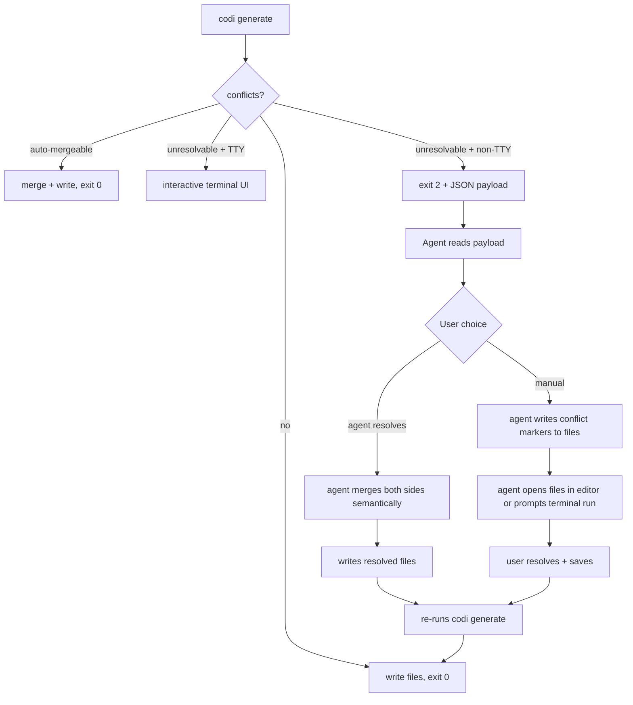
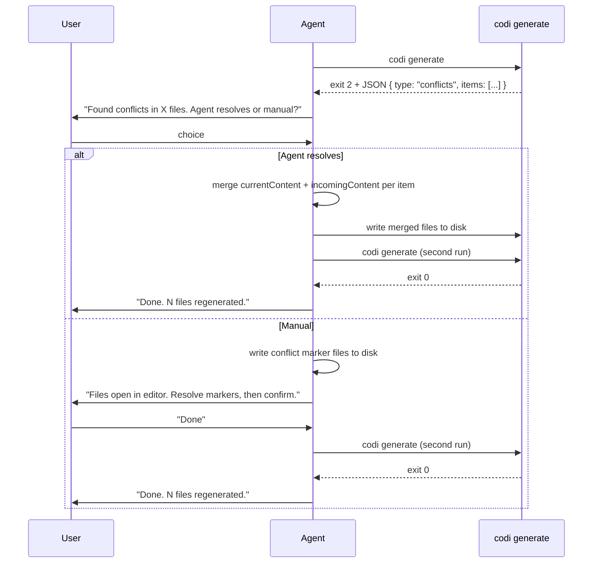

# Agent-Driven Conflict Resolution for `codi generate`

## Problem

When `codi generate` runs inside an AI coding agent (Claude Code, Codex), `process.stdout.isTTY` is `false`. The existing conflict resolver detects non-TTY, attempts auto-merge, and when hunks overlap it throws `UnresolvableConflictError` and exits. The interactive UI — which already has a full hunk-by-hunk resolver, editor integration, and accept/skip/merge options — never runs. The user sees a stack trace with no guidance.

## Goal

When a conflict occurs in an agent context:
1. The agent explains the situation in plain language.
2. The agent asks the user how to proceed — resolve automatically or open the files for manual resolution.
3. Both paths complete without requiring the user to leave the conversation or understand git conflict syntax.

---

## Architecture

Two independent layers. Each can be built and tested in isolation.



---

## Layer 1 — CLI: Structured Conflict Output

**File:** `src/utils/conflict-resolver.ts`

Change the non-TTY unresolvable branch from `throw UnresolvableConflictError` to:

```ts
// Before (throws, no data)
throw new UnresolvableConflictError(failed.map((f) => f.label));

// After (structured output, exit 2)
process.stdout.write(
  JSON.stringify({
    type: "conflicts",
    items: failed.map((f) => ({
      label: f.label,
      fullPath: f.fullPath,
      currentContent: f.currentContent,
      incomingContent: f.incomingContent,
    })),
  }) + "\n",
);
process.exitCode = 2;
// Return only the successfully auto-merged entries; failed entries are
// communicated via the JSON payload above — callers must check exitCode.
return { accepted: [], skipped: failed, merged: mergedEntries };
```

Exit code 2 = conflicts detected, structured payload in stdout.
Exit code 1 = unexpected error (unchanged).
Exit code 0 = success (unchanged).

`UnresolvableConflictError` is kept for the TTY interactive path (user cancelled mid-flow) — its semantics remain valid there.

**What the payload looks like:**

```json
{
  "type": "conflicts",
  "items": [
    {
      "label": "CLAUDE.md",
      "fullPath": "/Users/joe/project/CLAUDE.md",
      "currentContent": "...",
      "incomingContent": "..."
    }
  ]
}
```

---

## Layer 2 — Agent Skill: Conflict Handler in `codi-dev-operations`

**File:** `src/templates/skills/dev-operations/template.ts`

Add a `## Conflict Resolution` section to the skill. This section activates when `codi generate` exits with code 2.

### Skill behaviour

**Step 1 — Explain**

The agent reads the JSON payload and tells the user in plain language:

> "I ran `codi generate` and found conflicts in N file(s): [list of labels].
> These files have local customizations that differ from the updated templates.
> How do you want to resolve this?"

**Step 2 — Offer two paths**

```
[A] Let the agent resolve  — I will read both versions, merge them
                             preserving your customizations, and continue.

[B] I'll resolve manually  — I will open the files with conflict markers
                             in your editor so you can choose each change.
                             Run `codi generate` again when done.
```

**Step 3A — Agent resolves**

For each conflicting item:
1. Read `currentContent` (the user's version) and `incomingContent` (the template).
2. Identify sections unique to each side:
   - Keep all content from `currentContent` that is not present in `incomingContent`.
   - Add all new sections from `incomingContent` that are not present in `currentContent`.
   - For overlapping sections where template changed: use incoming unless the user has explicitly customized that section (heuristic: if current differs significantly from the base, keep current).
3. Write the merged content to `fullPath`.
4. After all files are resolved, re-run `codi generate`.
5. If generate exits 0, report success.
6. If generate exits 2 again (merge did not fully resolve), switch to the manual path: write conflict markers, open files in editor, tell the user "The automatic merge could not fully resolve these conflicts. I've opened the files with conflict markers — please resolve them and confirm."

**Step 3B — Manual resolve**

For each conflicting item:
1. Run `buildConflictMarkers` equivalent — write the file with `<<<<<<<`, `=======`, `>>>>>>>` markers so the user sees both sides inline.
2. Open the file in the editor using the project's configured editor (`$VISUAL` → `$EDITOR` → VS Code → vi, same resolution order as `resolveEditor()` in `conflict-resolver.ts`).
3. Tell the user: "Save the file after resolving all markers, then I will re-run `codi generate`."
4. Wait for user confirmation, then re-run.

---

## Data Flow



---

## Testing

### Unit tests — `conflict-resolver.ts`

| Test | Assertion |
|------|-----------|
| Non-TTY, auto-mergeable hunks | exits 0, merged content written |
| Non-TTY, unresolvable hunks | exits 2, JSON payload in stdout, no throw, failed entries in `skipped` |
| JSON payload shape | `type === "conflicts"`, `items` array with `label`, `fullPath`, `currentContent`, `incomingContent` |
| TTY path unchanged | interactive resolver still fires for TTY |
| `--force` flag | exits 0, all incoming accepted |
| `--json` flag | exits 0, all current kept |

### Skill tests — `dev-operations`

| Test | Assertion |
|------|-----------|
| Exit 2 detected | skill explains conflict in plain language |
| Agent-resolve path | merged file written, second generate succeeds |
| Manual path | conflict markers written, editor opened, second generate triggered |

---

## Files Changed

| File | Change |
|------|--------|
| `src/utils/conflict-resolver.ts` | Replace non-TTY throw with structured JSON output + exit 2 |
| `src/templates/skills/dev-operations/template.ts` | Add `## Conflict Resolution` section |
| `tests/unit/utils/conflict-resolver.test.ts` | Add non-TTY exit-2 and payload shape tests |

---

## Out of Scope

- Changing the interactive TTY path — it already works well.
- Adding a new `--agent` flag — auto-detection via TTY is sufficient.
- Resolving conflicts in CI pipelines — `--force` or `--json` flags cover that case.
