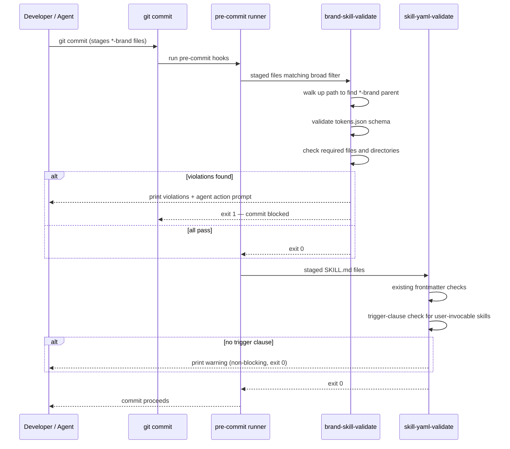

# Brand Skill Validation Hooks

**Goal:** Enforce the brand skill standard and improve skill description quality at commit time via two targeted additions to the pre-commit hook system.

**Architecture:** One new pre-commit hook (`brand-skill-validate`) validates every `-brand` skill directory against the full brand standard. One small extension to the existing `skill-yaml-validate` hook adds a description-quality check for `user-invocable` skills. Both follow the established dual-circuit pattern (developer: `src/templates/skills/`, user: `.codi/skills/`). `.codi/` is tracked in git and is not gitignored — user-circuit staged files reach the hook normally.

**Tech Stack:** Node.js ESM hook scripts (same as all existing hooks), TypeScript hook templates in `src/core/hooks/hook-templates.ts` and `src/core/hooks/hook-policy-templates.ts`, registered in `src/core/hooks/hook-config-generator.ts`, installed by `src/core/hooks/hook-installer.ts`.

---

## What already exists (no gap)

| Hook | What it covers |
|------|---------------|
| `skill-yaml-validate` | SKILL.md frontmatter: name, description, compatibility, types, enums |
| `skill-resource-check` | `[[/path]]` references exist on disk |
| `skill-path-wrap-check` | Bare paths not wrapped in `[[/path]]` |
| `template-wiring-check` | template.ts wired into generate pipeline |
| `version-bump` | version field incremented when template content changes |

## What is missing

1. No hook validates brand skill directory structure (`tokens.json` schema, required files, `references/`, `evals/`, `LICENSE.txt`)
2. `skill-yaml-validate` does not check that `user-invocable: true` skills have a trigger clause in their description

---

## Component 1 — `brand-skill-validate` hook

### What it checks

For every staged file inside a `*-brand` skill directory, the hook resolves the skill root and validates:

**tokens.json schema** (blocking):
- File exists at `brand/tokens.json`
- Required top-level fields: `brand`, `display_name`, `version`, `themes`, `fonts`, `assets`, `voice`
- `themes.dark` and `themes.light` each have: `background`, `surface`, `text_primary`, `text_secondary`, `primary`, `accent`, `logo`
- `fonts` has: `headlines`, `body`, `monospace`, `google_fonts_url` (string or null — not undefined)
- `assets` has: `logo_dark_bg`, `logo_light_bg`
- `voice` has: `tone` (string), `phrases_use` (array), `phrases_avoid` (array)

**Required files** (blocking):
- `brand/tokens.css` exists
- At least one SVG exists in `assets/` (logo-dark.svg or logo-light.svg or any `.svg`)
- `references/` directory exists and contains at least one `.html` file
- `evals/evals.json` exists
- `LICENSE.txt` exists

**templates/ convention** (blocking, applies to both circuits, only when `templates/` directory exists — skips silently when absent):
- Every `.html` file in `templates/` contains `<meta name="codi:template"`

### Dual circuit

- **Developer circuit**: `src/templates/skills/*-brand/` — triggered when contributing brand templates to the codi source
- **User circuit**: `.codi/skills/*-brand/` — triggered when creating or editing brand skills in a project (`.codi/` is tracked in git, not gitignored)

### Staged file trigger

`stagedFilter`: `**/*.{json,css,html,svg,md}`

The hook uses a simple broad filter. For each staged file it walks up the directory tree to find a parent whose name ends with `-brand`. If no such parent exists, the file is skipped silently. This avoids brace-expansion glob ambiguity while keeping false-positive skips impossible for brand directories.

### Wiring into the runner

`brand-skill-validate` is registered as a `HookEntry` in `hook-config-generator.ts` Stage 2 (same stage as `skill-yaml-validate`). The runner template reads the `hooks` array and invokes each entry in order. The installer writes the `.mjs` script to `.git/hooks/codi-brand-skill-validate.mjs` and adds the `HookEntry` to the runner's `hooks` array — the same pattern used by `skill-resource-check` and `skill-path-wrap-check`.

`brandSkillValidation` is always-on (like `skillYamlValidation`) — no flag required, no opt-in step.

### Error output format (agent-actionable)

```
[codi] brand-skill-validate: 2 violation(s)

  src/templates/skills/my-brand/brand/tokens.json
  ✗ Missing required field: fonts.google_fonts_url

  src/templates/skills/my-brand/
  ✗ Missing required directory: references/ (no .html files found)

  Action required (coding agent):
    1. Open brand/tokens.json — add "google_fonts_url": null (Google Fonts URL or null for local fonts)
       Reference: src/templates/skills/brand-creator/references/brand-standard.md
    2. Create references/brandguide.html — a visual HTML style guide for the brand
    3. Stage the fixed files and commit again.
```

---

## Component 2 — `skill-yaml-validate` extension

Add one check to the existing `SKILL_YAML_VALIDATE_TEMPLATE` in `src/core/hooks/hook-policy-templates.ts`:

**When `user-invocable: true`**: description must contain at least one of these trigger phrases: `"Use when"`, `"TRIGGER when"`, `"Activate when"`, `"Use for"`. Descriptions without a trigger clause make intent routing unreliable.

Failure output (**non-blocking warning**, not exit 1 — existing skills without the clause must not break all commits):
```
⚠ src/.../SKILL.md: 'user-invocable' is true but description has no trigger clause
  Add a "Use when..." sentence so the agent knows when to activate this skill.
```

---

## Files to modify

| File | Change |
|------|--------|
| `src/core/hooks/hook-templates.ts` | Add `BRAND_SKILL_VALIDATE_TEMPLATE` export (new hook script) |
| `src/core/hooks/hook-policy-templates.ts` | Add trigger-clause warning to `SKILL_YAML_VALIDATE_TEMPLATE` |
| `src/core/hooks/hook-config-generator.ts` | Add `brandSkillValidation: boolean` to `HooksConfig`; register `brand-skill-validate` entry in Stage 2; return `brandSkillValidation: true` |
| `src/core/hooks/hook-installer.ts` | Import `BRAND_SKILL_VALIDATE_TEMPLATE`; add `brandSkillValidation` to `InstallOptions`; write the `.mjs` file in `writeAuxiliaryScripts` |
| `tests/unit/hooks/hook-templates.test.ts` | Tests for `BRAND_SKILL_VALIDATE_TEMPLATE` (see below) |
| `tests/unit/hooks/hook-config-generator.test.ts` | Assert `brandSkillValidation: true` in generated config |
| `tests/unit/hooks/hook-policy-templates.test.ts` | Test trigger-clause warning for `user-invocable: true` skill without trigger phrase |

---

## Sequence diagram



---

## Testing approach

`tests/unit/hooks/hook-templates.test.ts` — for `BRAND_SKILL_VALIDATE_TEMPLATE`:
- Valid brand with all required fields and files → exit 0
- Missing `fonts.google_fonts_url` → exit 1, message names the field
- Missing `references/*.html` → exit 1, message names the directory
- Missing `evals/evals.json` → exit 1
- `templates/` exists without `<meta name="codi:template">` → exit 1
- `templates/` absent → hook skips templates check silently → exit 0
- Non-brand skill staged (no `-brand` parent) → hook skips silently → exit 0
- Error output contains "Action required (coding agent)" section

`tests/unit/hooks/hook-config-generator.test.ts`:
- `brandSkillValidation: true` present in generated config

`tests/unit/hooks/hook-policy-templates.test.ts` — trigger-clause extension:
- `user-invocable: true` with "Use when" in description → no warning
- `user-invocable: true` without any trigger phrase → prints warning, exits 0 (non-blocking)
- `user-invocable: false` without trigger phrase → no warning
