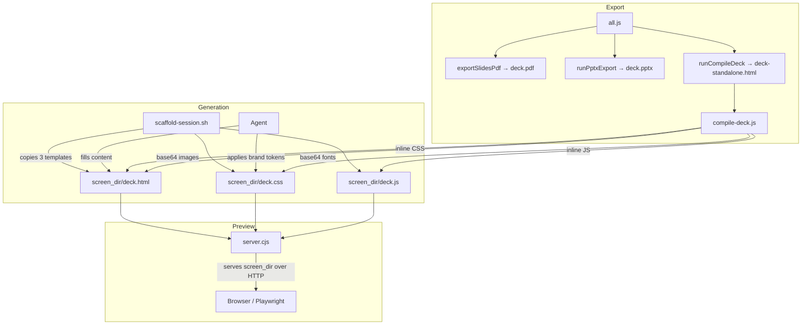
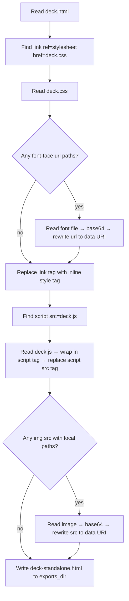
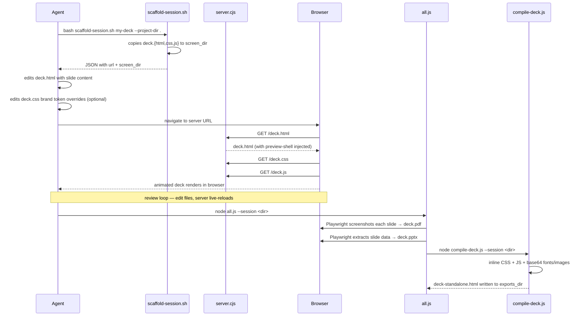

# Content Factory — Animated Slide Deck Upgrade
- **Date**: 2026-04-13 19:55
- **Document**: 20260413_1955_SPEC_content-factory-animated-deck.md
- **Category**: SPEC

---

## Overview

Upgrade the content factory slide deck pipeline to produce a high-quality animated
presentation as the primary output, and add a standalone HTML export that bundles
everything into a single shareable file.

**Current state**: `slides-base.html` is a single static file — no animations, basic
`display:none` toggle, minimal navigation.

**Target state**: 3-file generator (HTML + CSS + JS) matching the BBVA reference quality,
with entrance animations, rich navigation, and a compile step that produces a
zero-dependency `deck-standalone.html`.

---

## Architecture



---

## Components

### 1. `generators/slides-base.html` (rewrite)

Structure-only template. References external CSS and JS.

- `<link rel="stylesheet" href="deck.css">` — no inline styles
- `<script src="deck.js"></script>` — no inline scripts
- `.slide-chrome` overlay: a single `<div class="slide-chrome">` wrapping the persistent logo ``, progress bar, and slide counter — painted above all slides via `z-index: 101`
- Per-slide `<!-- img.slide__logo -->` comments from the old template are **removed** — the logo lives exclusively in `.slide-chrome`
- Slide types via `data-type` attribute: `title`, `divider`, `content`, `quote`, `metrics`, `table`, `closing`
- `.slide--blue` modifier available on any `.slide` for dark-background slides (e.g. dividers, closing) — triggers logo color inversion in JS
- `.animate-in` class on every content element (headings, paragraphs, bullets, cards)
- Logo path placeholder: `SKILL_ASSETS_DIR/logo.svg` (commented, agent replaces with real path or inline SVG)

### 2. `generators/slides-base.css` (new)

Brand token system + full layout + animations.

**Sections:**
- `@font-face` declarations with `SKILL_FONTS_DIR` placeholder paths
- `:root` design tokens: `--brand-bg`, `--brand-text`, `--brand-accent`, `--brand-primary`, `--brand-surface`, `--brand-font-headline`, `--brand-font-body`, `--slide-pad`
- Reset + base: `html, body { overflow: hidden }`, `font-family`, `background`
- `.deck` + `.deck__viewport`: 16:9 letterbox, centers on screen
- `.slide-chrome`: absolute overlay matching `.deck__viewport` size, `pointer-events: none`, `z-index: 101`
- `.progress-bar` + `.slide-counter`: positioned inside `.slide-chrome`
- `.slide`: `position: absolute; inset: 0; display: none` — hard cut still used, animations are **entrance-only** (on active slide children), not slide transitions
- `.slide.active { display: flex }`
- `.animate-in` + `fadeUp` keyframe: `from { opacity:0; transform:translateY(20px) }` `to { opacity:1; transform:translateY(0) }`
- Staggered delays: `.slide.active .animate-in:nth-child(n)` — 80ms increments, 7 steps
- Per-type styles: `[data-type="title"]`, `[data-type="divider"]`, `[data-type="content"]`, etc.
- `.slide--blue` modifier: dark primary background (`background: var(--brand-primary)`), inverts all text colors to white — used on divider and closing slides
- Component classes: `.metric-grid`, `.metric-card`, `.bullet-list`, `.split`, `.flow`, `.card-grid`
- `@media (prefers-reduced-motion: reduce)`: disable all animations
- Responsive breakpoints: `max-height: 700px`, `max-height: 500px`, `max-width: 768px`

> Target: under 700 lines.

### 3. `generators/slides-base.js` (new)

IIFE navigation engine. Adopted from BBVA reference.

**Features:**
- `goto(index)`: removes `.active` from current slide, calls `resetAnimations(currentSlide)`, adds `.active` to target, updates progress + hash + logo color
- `resetAnimations(slide)`: forces animation replay by toggling `animation: none` + reflow + restore on all `.animate-in` children
- `next()`, `prev()` helpers
- **Keyboard**: `ArrowRight`, `ArrowDown`, `Space` → next; `ArrowLeft`, `ArrowUp` → prev; `Home` → first; `End` → last; `1-9` → jump to slide N
- **Wheel**: debounced (300ms cooldown), `deltaY > 0` → next
- **Touch/swipe**: 50px threshold, dominant axis wins
- **Hash URL**: `history.replaceState(null, '', '#slide-N')` on each transition; `readHash()` on init for deep linking
- **Logo color**: toggles `.global-logo--inverted` when current slide has `.slide--blue`

> Target: under 200 lines.

### 4. `scripts/export/compile-deck.js` (new)

Bundles `deck.html` + `deck.css` + `deck.js` + assets into `deck-standalone.html`.

**CLI:**
```
node compile-deck.js --session <session-dir> [--out <filename>]
```
Default output filename: `deck-standalone.html` in `exports_dir`.

**Algorithm:**



**Error handling:**
- Font file not found: log warning, leave `url()` as-is (system font fallback)
- `deck.css` not found: skip CSS inlining, log warning
- `deck.js` not found: skip JS inlining, log warning
- Image file not found: log warning, leave `src` as-is
- All failures are non-fatal: output is still written, just with missing pieces

**Module breakdown** (to stay under 700 lines):
- `compile-deck.js` — CLI + orchestration (~80 lines)
- `lib/bundle-html.js` — reads CSS/JS, replaces `<link>` and `<script src>` tags (~80 lines)
- `lib/inline-assets.js` — finds `url()` in CSS and `src` in HTML, base64 encodes local files (~120 lines)

### 5. `scripts/export/all.js` (update)

Add compile step after PPTX export for slides type:

```js
if (type === 'slides') {
  await exportSlidesPdf(exportPage, fileUrl, pdfOut);
  await exportPage.close();
  runPptxExport(fileUrl, pptxOut);
  runCompileDeck(sessionDir, baseName);   // NEW
}
```

New `runCompileDeck` function spawns `compile-deck.js` as a child process (same pattern as `runPptxExport`):

```js
function runCompileDeck(sessionDir, baseName) {
  const compileScript = path.join(__dirname, 'compile-deck.js');
  const outFile = baseName + '-standalone.html';
  console.log(`  Compiling standalone HTML...`);
  const result = spawnSync(
    process.execPath,
    [compileScript, '--session', sessionDir, '--out', outFile],
    { stdio: 'inherit' }
  );
  if (result.status !== 0) {
    console.error(`  Standalone HTML compile failed (exit ${result.status})`);
  }
}
```

`compile-deck.js` receives `--session <sessionDir>` (to locate `screen_dir` via `state.json`) and `--out <filename>` (output filename within `exports_dir`).

### 6. `scripts/scaffold-session.sh` (update)

Copy all 3 generator files:

```bash
cp "$SKILL_DIR/generators/slides-base.html" "$CONTENT_DIR/deck.html"
cp "$SKILL_DIR/generators/slides-base.css"  "$CONTENT_DIR/deck.css"
cp "$SKILL_DIR/generators/slides-base.js"   "$CONTENT_DIR/deck.js"
```

No changes to argument handling — the `<session-name>` positional argument and `--project-dir` flag remain unchanged.

Update session seeded output message to list all 3 files.

### 7. `SKILL.md` (update)

- **Step 4** (Generate Visual Assets): specify that decks generate 3 files (`deck.html`, `deck.css`, `deck.js`); agent edits `deck.html` for content, `deck.css` for brand token overrides
- **Step 6** (Export): add standalone HTML as 4th export format: `deck-standalone.html` is generated automatically alongside PDF and PPTX
- Add note: "deck-standalone.html is a zero-dependency file — share it by email, Slack, or direct download. No server required."

---

## Data Flow (end-to-end)



---

## What Does NOT Change

- `server.cjs` — no changes needed; it already serves all files in `screen_dir`
- `scripts/export/lib/slides-pdf.js` — no changes; Playwright loads via HTTP, 3 files work fine
- `scripts/export/lib/classify.js` — no changes; still probes for `.slide` elements
- `generators/social-base.html` — unaffected
- `generators/document-base.html` — unaffected
- Preview shell sidebar (export buttons, format switcher) — unaffected

---

## File Inventory

| File | Action | Notes |
|------|--------|-------|
| `generators/slides-base.html` | Rewrite | BBVA reference quality, 3-file structure |
| `generators/slides-base.css` | New | Animations, brand tokens, responsive |
| `generators/slides-base.js` | New | Rich navigation engine |
| `scripts/export/compile-deck.js` | New | CLI entry point |
| `scripts/export/lib/bundle-html.js` | New | CSS/JS inliner |
| `scripts/export/lib/inline-assets.js` | New | Font + image base64 encoder |
| `scripts/export/all.js` | Update | Add `runCompileDeck` call |
| `scripts/scaffold-session.sh` | Update | Copy 3 files instead of 1 |
| `SKILL.md` | Update | Document 3-file flow + standalone export |

New files: 5 (`slides-base.css`, `slides-base.js`, `compile-deck.js`, `lib/bundle-html.js`, `lib/inline-assets.js`). Rewrites: 1 (`slides-base.html`). Updated files: 3.

---

## Out of Scope

- Slide transition animations (crossfade, slide-left between slides) — entrance animations per element are sufficient; slide transitions require a different JS engine that complicates PDF export (Playwright would capture mid-transition frames)
- Auto-play / timer mode
- Speaker notes
- Presenter view
