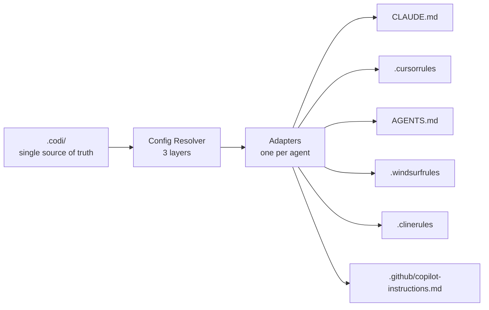
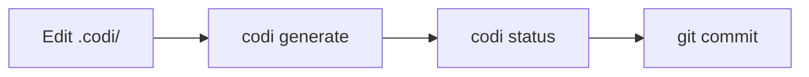
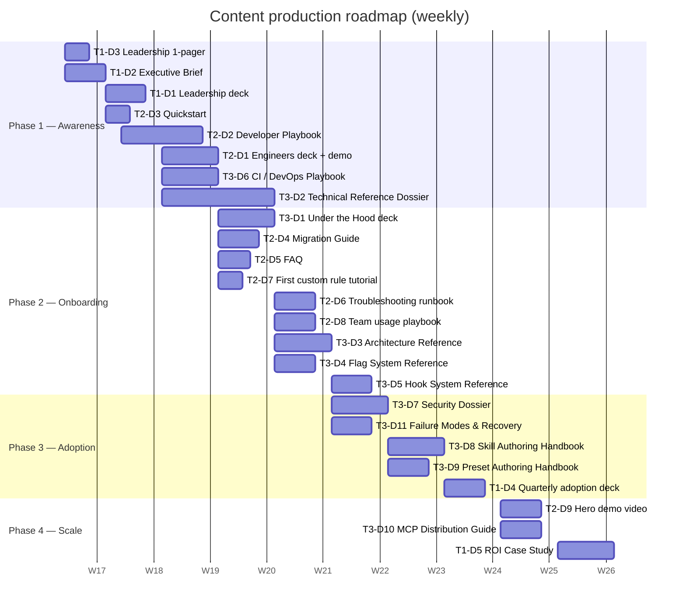
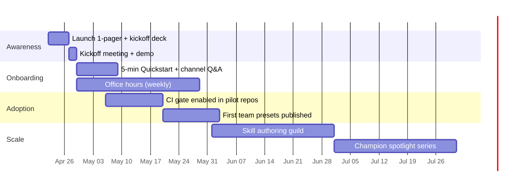
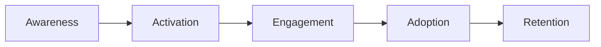

# Codi Adoption Content Campaign — Blueprint
- **Date**: 2026-04-19 09:37
- **Document**: 20260419_0937_GUIDE_codi-adoption-campaign-blueprint.md
- **Category**: GUIDE

> Strategic content campaign blueprint for driving internal adoption of **Codi** (`codi-cli`). Grounded in the Codi documentation (`docs/project/*`), the project `README.md`, `CLAUDE.md`, and codebase context as of 2026-04-19. All references point to artifacts that exist in this repository.

---

## 1. Executive Summary

**What Codi is.** Codi is a CLI (`codi-cli`, Node.js ≥ 20) that unifies AI coding agent configuration. Teams write their rules, skills, agents, flags, and MCP settings once in a `.codi/` directory. Codi generates native config files for six agents — Claude Code, Cursor, Codex, Windsurf, Cline, GitHub Copilot — from that single source of truth. Out of the box: **28 rules, 60 skills, 21 agents, 6 presets, 16 behavioral flags**.

**The adoption opportunity.** Every AI agent speaks a different dialect (`CLAUDE.md`, `.cursorrules`, `AGENTS.md`, `.windsurfrules`, `.clinerules`, `.github/copilot-instructions.md`). Teams using multiple agents — or where developers use different editors — maintain duplicate configs that drift. Security, testing, and style policies become inconsistent across the team. Codi eliminates that drift and turns AI-agent governance into a versioned, reviewable artifact.

**Why a campaign (not a docs dump).** Codi competes not with other tools, but with **inertia** and **"my editor, my config" individualism**. Adoption requires (a) making the drift pain visible, (b) showing a first-value path under 5 minutes, (c) giving champions advanced material, and (d) giving leadership a governance narrative. A layered content campaign is the right instrument.

**Recommended approach.** A four-phase rollout (Awareness → Onboarding → Adoption → Scale) delivered primarily as **slide decks and written documents** (the formats that fit a corporate environment), organized into **three depth tiers**:

- **Tier 1 — Executive / Business** (leadership, sponsors, managers): high-level slides + short briefs.
- **Tier 2 — Developer Adoption** (engineers picking it up): practical slides + quickstart + playbook documents.
- **Tier 3 — Deep Technical** (platform engineers, security, architects, champions): deep-dive slides that explain *how Codi actually works* + detailed reference documents.

Each tier is delivered as a matched **deck + document** pair so a reader can pick the format that suits their context (room presentation vs. async reading). Chat and video are secondary channels that support the slide/document core.

---

## 2. What Codi Is — Product and Codebase Understanding

### 2.1 Mental model



One input, six native outputs. Edit once, regenerate, commit both source and output.

### 2.2 Core building blocks

| Concept | What it is | Where it lives |
|---|---|---|
| **Artifacts** | Rules, skills, agents, brands — Markdown + YAML frontmatter | `.codi/rules/`, `.codi/skills/<name>/SKILL.md`, `.codi/agents/`, `.codi/brands/` |
| **Flags** | 16 behavioral switches (security, tests, permissions, generation) | `.codi/flags.yaml` |
| **Presets** | Bundles of flags + artifacts (6 built-in) | `.codi/presets/` + `codi.yaml` |
| **Adapters** | Translators that produce each agent's native format | `src/adapters/*.ts` |
| **State & drift** | Hash pairs per generated file → synced / drifted / missing | `.codi/state.json` |
| **Hooks** | Pre-commit automation (tests, secrets, typecheck, file size, conventional commits) | Husky / pre-commit / Lefthook / standalone |

### 2.3 Config resolution (3 layers, priority ascending)

1. **Preset** — built-in or installed bundles.
2. **Repo** — `.codi/` (single source of truth).
3. **User** — `~/.codi/user.yaml` (never committed).

Flags marked `locked: true` halt resolution — lower layers cannot override. This is the mechanism teams use to **enforce** policies (e.g. security on, force-push off) while still letting individuals customize non-policy preferences.

### 2.4 Supported agents

| Agent | Instruction file | Rules | Skills | Agents | MCP |
|---|---|:---:|:---:|:---:|:---:|
| Claude Code | `CLAUDE.md` | ✓ | ✓ | ✓ | ✓ |
| Cursor | `.cursorrules` | ✓ | ✓ | — | ✓ |
| Codex | `AGENTS.md` | ✓ | ✓ | ✓ | ✓ |
| Windsurf | `.windsurfrules` | ✓ | ✓ | — | — |
| Cline | `.clinerules` | ✓ | ✓ | — | — |
| GitHub Copilot | `.github/copilot-instructions.md` | ✓ | ✓ | ✓ | ✓ |

### 2.5 Presets (built-in)

| Preset | Focus | When to pick it |
|---|---|---|
| `codi-minimal` | permissive | Prototypes, early-stage projects |
| `codi-balanced` | recommended default | Most teams, most projects |
| `codi-strict` | enforced policies | Regulated or security-sensitive contexts |
| `codi-fullstack` | web/app breadth | Fullstack product teams |
| `codi-power-user` | workflow-heavy | Individual contributors using graph exploration, day tracking, enhanced commits |
| `codi-dev` | Codi itself | Contributors to Codi |

### 2.6 Command surface (what people actually touch)

| Command | Purpose |
|---|---|
| `codi init` / `codi onboard` | Scaffold `.codi/` (interactive wizard or AI-guided) |
| `codi generate` | Regenerate all agent configs |
| `codi status` | Drift check |
| `codi doctor` / `codi compliance` | Health and CI validation |
| `codi add <type> <name> [--template]` | Add rule / skill / agent / brand |
| `codi preset <create\|install\|export>` | Share team configs as ZIP or GitHub repo |
| `codi update` | Pull latest managed-by-codi artifacts |
| `codi watch` | Auto-regenerate on file change |
| `codi revert` | Roll back to an automatic backup (5 retained) |
| `codi contribute` | Open PR to a repo with selected artifacts |

### 2.7 Strengths

- **Single source of truth** — eliminates drift across agents and developers.
- **Governance-ready** — locked flags + presets let tech leads enforce policies; operations ledger + audit log support compliance.
- **Fast first value** — ≤ 5 minutes from install to generated configs, or `codi onboard` for an AI-guided path.
- **Batteries included** — 109 built-in artifacts (28 rules, 60 skills, 21 agents) and 6 presets.
- **Non-destructive authoring** — `managed_by: user` artifacts are never overwritten by `codi update`.
- **Deterministic CI** — `codi doctor --ci` and `codi compliance --ci` fail on drift or invalid config.
- **Result-typed core** — no thrown exceptions across module boundaries (`Result<T>`), improving reliability.

### 2.8 Limitations and adoption barriers

| Barrier | Reality | How to address in the campaign |
|---|---|---|
| "It will overwrite my CLAUDE.md" | True on first `generate`. | Teach the backup-and-move workflow (`docs/project/migration.md`) upfront. |
| "Yet another tool to learn" | Real cost; mitigated by the onboard wizard. | Lead with the pain (drift), not the tool. Position Codi as "governance for agents." |
| "My team only uses one agent" | Still benefits: templates, presets, hooks, drift detection, versioning. | Show one-agent value story in the General End User materials. |
| "I need to commit generated files?" | Yes — agents read from the repo. | Address explicitly in FAQ and in the Getting Started flow. |
| Node.js ≥ 20 prerequisite | Hard requirement. | Include in prereqs of every quickstart. |
| Mental model of 3 layers + locked flags | Learning curve for admins. | Reserve for the Technical Stakeholders and Power Users tracks. |

### 2.9 Common objections (prime for FAQ content)

- "Won't this just be another config layer that drifts too?" → Drift detection is built in; `codi status` flags it; CI blocks it.
- "Why not just share a `CLAUDE.md` via git?" → Works for one agent, fails the moment someone opens Cursor.
- "Can individuals still customize?" → Yes — `~/.codi/user.yaml` (never committed) for non-policy preferences; locked flags enforce the rest.
- "What if Codi breaks my agent setup?" → Automatic backups (5 retained), `codi revert` for rollback.

### 2.10 What's inferred vs. documented

- **Documented** (repo `README.md` + `docs/project/*`): artifact counts, presets, flags, adapters, layer order, hook detection, generation pipeline, backup count, result pattern.
- **Inferred** (from CLAUDE.md self-dev notes and codebase structure): the team already uses Codi to build Codi — the project itself is the lighthouse customer. This is useful for storytelling but should be verified before external quoting.
- **Unverified for this blueprint**: specific team size, target audience size, existing enablement channels, communication cadence norms. These need to be confirmed with the sponsor before production.

---

## 3. Key Use Cases, Workflows, Strengths, and Limitations

### 3.1 Highest-value use cases

| # | Use case | Trigger | Primary preset | Primary artifacts |
|---|---|---|---|---|
| 1 | **Multi-agent parity** — ensure Claude Code, Cursor, and Copilot all follow the same security and testing rules | Team uses 2+ agents | `codi-balanced` + `codi-security` rule | Rules, flags |
| 2 | **Policy enforcement** — security, typing, force-push, doc requirements, file-size limits | Tech lead wants to "lock" policies | `codi-strict` | Locked flags, pre-commit hooks |
| 3 | **Team onboarding** — new dev clones the repo, gets full agent config automatically | New joiner | Any | All |
| 4 | **CI validation** — fail PRs that introduce drift or invalid configuration | CI integration | Any | `codi doctor --ci` |
| 5 | **Skill sharing** — package a reviewed workflow (e.g. code review, commit, security scan) for the whole team | Champion publishes a skill | Any | Skills, `codi preset export` or `codi contribute` |
| 6 | **Language-specific reinforcement** — add TypeScript, Python, Go, Rust, Next.js, Django rules on top of a base preset | Project language decided | Language preset | Language rules |
| 7 | **Governance trail** — audit log + operations ledger for "when did rule X change?" | Compliance review | Any | `operations-ledger.json`, `audit.jsonl` |

### 3.2 The daily workflow (the "5-minute motion")



Memorize this loop. Ninety percent of daily Codi usage fits in it.

### 3.3 Shortest path to first value (≤ 5 min)

1. `npm install -g codi-cli`
2. `codi init` → pick **balanced**, pick agents
3. `codi generate`
4. Open your agent. It now reads the generated config.
5. `git add .codi/ CLAUDE.md .cursorrules && git commit -m "chore: add codi configuration"`

### 3.4 Advanced usage paths for champions

- **Custom skills** — author reviewed workflows under `.codi/skills/<name>/SKILL.md` with `scripts/`, `references/`, `assets/`, `evals/`.
- **Custom presets** — `codi preset create my-team-setup` and share via GitHub or ZIP.
- **Scoped rules** — add `scope: ["src/**/*.ts"]` to frontmatter so Claude Code loads the rule only when those files are active.
- **Conditional flags** — target specific languages, frameworks, agents, or file patterns.
- **MCP distribution** — `.codi/mcp.yaml` pushes MCP server config to each agent in its native format.
- **Drift-as-code** — `codi doctor --ci` in the pipeline, `drift_detection: error` to block merges on drift.

---

## 4. Audience Segmentation and Messaging Matrix

### 4.1 Audiences

| Audience | Size (est.) | Primary channel | Motivation | Objection to defuse |
|---|---|---|---|---|
| **A1 — Leadership / Sponsors** | small | 1-page brief, exec summary, steering meeting | Risk reduction, governance, velocity, measurable adoption | "Is this solving a real problem or adding tooling debt?" |
| **A2 — Managers / Team leads** | small-medium | Team meetings, portal, slides | Consistency across the team, less review friction, onboarding speed | "Another thing my team has to learn." |
| **A3 — General end users** | large | Chat channel, quickstart, short video | Less manual config, better agent behavior, fewer style arguments | "My current setup works fine." |
| **A4 — Power users / Champions** | small | Docs site, office hours, skill authoring guide | Authoring, sharing, tuning, contributing | "Documentation is thin for advanced cases." |
| **A5 — Technical stakeholders** | small | Architecture doc, security review | Integration, security, compliance, CI/CD | "I need to know the failure modes." |

### 4.2 Core message by audience

| Audience | Key message (one sentence) | Call to action |
|---|---|---|
| A1 | "Codi makes AI agent configuration a governed, versioned, auditable artifact — the same discipline we apply to code." | Sponsor the rollout; approve the adoption metric. |
| A2 | "Codi removes agent drift across your team so you stop arguing about style in code review." | Pick a preset; run `codi init`; make `codi doctor --ci` a required check. |
| A3 | "Stop maintaining three different config files. Edit once, regenerate, commit." | Run the 5-minute quickstart; ask in `#codi` if stuck. |
| A4 | "Package your best workflows as skills and presets. Share them with a PR." | Author one skill this sprint; present it at the next guild. |
| A5 | "Codi produces deterministic, diff-friendly output with CI integration, drift detection, and backup/rollback." | Review architecture doc; validate CI integration; approve for regulated projects. |

### 4.3 Messaging matrix (what to say / what to avoid)

| Audience | Use | Avoid |
|---|---|---|
| A1 | "governance", "drift", "auditable", "adoption metric", "velocity" | CLI flag names, YAML schemas |
| A2 | "consistency", "onboarding time", "shared presets", "required check" | Internals of the resolver, Result types |
| A3 | "one command", "5 minutes", "works with your editor" | "3-layer resolution", "locked flags" |
| A4 | "skill authoring", "preset export", "scoped rules", "conditional flags", "managed_by: user" | Buzzwords, generic marketing |
| A5 | "adapter pattern", "Result<T>", "`codi compliance --ci`", "operations ledger", "audit.jsonl" | Marketing metaphors |

---

## 5. Content Campaign Strategy

### 5.1 Content pillars

| Pillar | Promise | Example assets |
|---|---|---|
| **P1 — Eliminate drift** | "One config, every agent, zero drift." | Hero deck, landing brief, launch announcement |
| **P2 — Fast first value** | "From install to generated configs in under 5 minutes." | Quickstart guide, 90-second video, onboarding post |
| **P3 — Governance & safety** | "Lock policies. Detect drift in CI. Audit changes." | Technical brief, CI guide, security stakeholder deck |
| **P4 — Team leverage** | "Share your best workflows as reusable skills and presets." | Skill authoring guide, champion spotlights |
| **P5 — Depth when you need it** | "Architecture, flags, adapters, hooks — documented and explorable." | Architecture reference, advanced playbook, office hours recap |

### 5.2 Three depth tiers (primary delivery model)

Codi adoption in a corporate setting needs material at three distinct depths. Each tier is a **matched pair**: one slide deck (for the room) and one document (for async reading).

| Tier | Audience | Slide deck | Companion document | Goal |
|---|---|---|---|---|
| **Tier 1 — Business / Executive** | A1, A2 | *Codi for Leadership* (12–15 slides, 15 min) | *Executive Brief* (2–4 pages) | Sponsor sign-off + metric approval |
| **Tier 2 — Developer Adoption** | A2, A3 | *Codi for Engineers* (18–25 slides, 30 min + live demo) | *Developer Adoption Playbook* (10–15 pages) | Every developer can init and use Codi |
| **Tier 3 — Deep Technical** | A4, A5 | *Codi Under the Hood* (30–40 slides, 60 min) | *Technical Reference Dossier* (30+ pages) | Champions, platform, and security teams understand internals + CI + governance |

Each tier's detailed slide outline is in §7; each tier's document outline is in §9.

### 5.3 Content format mix (corporate-first)

Because this is a corporate rollout, slides and documents are the primary deliverables. Other formats support but do not replace them.

| Format | Priority | Role |
|---|---|---|
| **Slide decks** | P0 | Primary talk format for kickoff, tech deep dive, leadership update |
| **Written documents** | P0 | Canonical async reference — briefs, playbooks, deep dives, runbooks |
| **One-pagers (PDF)** | P0 | Leadership hand-outs, team-lead summaries |
| **Internal portal / wiki** | P1 | Central hub that indexes all slides + documents |
| **Live sessions** | P1 | Kickoff + deep-dive + weekly office hours (record and attach to portal) |
| **Email** | P1 | Launch + weekly digest + milestone updates |
| **Chat (`#codi`)** | P2 | Q&A and activation nudges only — not the primary distribution |
| **Short demo video** | P2 | 90-second hero loop + recorded deep dive |
| **Docs site** (`lehidalgo.github.io/codi/docs/`) | P1 | External reference linked from internal portal |

### 5.4 Narrative arc (campaign through-line)

1. **Name the pain** — drift across agents and developers is invisible but expensive.
2. **Show the fix** — one source of truth, generated per agent.
3. **Prove the speed** — 5-minute onboarding, live on screen.
4. **Lock the policy** — locked flags + CI block drift.
5. **Make it ours** — team presets, skills, champions.
6. **Measure it** — adoption metric, drift incidents, onboarding time.

---

## 6. Content Asset Inventory (tier-based, slides + documents)

All primary assets are either a **slide deck** or a **written document**. Each depth tier has a matched pair so the audience can consume content in the format that fits their context (meeting room vs. async reading).

### 6.1 Tier 1 — Business / Executive (leadership, sponsors, managers)

| ID | Title | Format | Audience | Length | Priority |
|---|---|---|---|---|---|
| T1-D1 | **Codi for Leadership** — kickoff deck | Slides | A1, A2 | 12–15 slides / 15 min | P0 |
| T1-D2 | **Executive Brief** — business case + governance narrative | Document | A1 | 2–4 pages | P0 |
| T1-D3 | **Leadership 1-pager** — scannable summary | PDF | A1, A2 | 1 page | P0 |
| T1-D4 | **Quarterly adoption review** — update deck | Slides | A1 | 8–10 slides | P1 |
| T1-D5 | **ROI / adoption case study** — after pilot | Document | A1, A2 | 3–5 pages | P2 |

### 6.2 Tier 2 — Developer Adoption (the engineers picking it up)

| ID | Title | Format | Audience | Length | Priority |
|---|---|---|---|---|---|
| T2-D1 | **Codi for Engineers** — main adoption deck + live demo | Slides | A2, A3 | 18–25 slides / 30 min | P0 |
| T2-D2 | **Developer Adoption Playbook** — end-to-end written guide | Document | A3 | 10–15 pages | P0 |
| T2-D3 | **5-minute Quickstart** — hands-on doc | Document | A3 | 2–3 pages | P0 |
| T2-D4 | **Migration Guide** — existing CLAUDE.md → Codi | Document | A2, A3 | 4–6 pages | P1 |
| T2-D5 | **FAQ document** — curated objections + answers | Document | A3 | 3–5 pages | P1 |
| T2-D6 | **Troubleshooting runbook** | Document | A3, A4 | 4–6 pages | P1 |
| T2-D7 | **"Your first custom rule" tutorial** | Document | A3 | 2 pages | P1 |
| T2-D8 | **Team usage playbook** — day 1 / week 1 / month 1 motions | Document | A2, A3 | 5–7 pages | P1 |
| T2-D9 | **Hero demo** — 90-second video | Video | A3 | 90s | P2 |

### 6.3 Tier 3 — Deep Technical (how it actually works)

This is the tier that was missing. It explains Codi's mechanics — the resolver, adapters, flags, hooks, state, security model — to platform engineers, architects, security reviewers, and internal champions who will own or extend Codi.

| ID | Title | Format | Audience | Length | Priority |
|---|---|---|---|---|---|
| T3-D1 | **Codi Under the Hood** — technical deep-dive deck | Slides | A4, A5 | 30–40 slides / 60 min | P0 |
| T3-D2 | **Technical Reference Dossier** — companion document | Document | A4, A5 | 30+ pages | P0 |
| T3-D3 | **Architecture Reference** — system overview, resolver, adapters | Document | A5 | 10–15 pages | P1 |
| T3-D4 | **Flag System Reference** — all 16 flags, modes, precedence | Document | A4, A5 | 8–10 pages | P1 |
| T3-D5 | **Hook System Reference** — detection, install, pre-commit map | Document | A5 | 6–8 pages | P1 |
| T3-D6 | **CI / DevOps Integration Playbook** — required checks, drift gates, rollback | Document | A2, A5 | 6–8 pages | P0 |
| T3-D7 | **Security & Compliance Dossier** — governance, audit log, secrets policy | Document | A1, A5 | 6–10 pages | P1 |
| T3-D8 | **Skill Authoring Handbook** — `SKILL.md`, resource markers, evals | Document | A4 | 8–12 pages | P1 |
| T3-D9 | **Preset Authoring + Distribution Handbook** | Document | A4 | 6–8 pages | P1 |
| T3-D10 | **MCP Distribution Guide** | Document | A4, A5 | 4–6 pages | P2 |
| T3-D11 | **Failure Modes & Recovery** — drift, overwrites, rollback, disaster | Document | A5 | 4–6 pages | P1 |

### 6.4 Asset specification template (applied to every asset above before production)

```yaml
title: <string>
tier: 1 | 2 | 3
format: deck | document | one-pager | video
target_audience: [A1|A2|A3|A4|A5]
why_it_matters: <one sentence>
core_message: <one sentence>
outline: [<section 1>, <section 2>, ...]
depth: executive | practitioner | deep-technical
dependencies: [<other asset IDs>]
priority: P0 | P1 | P2
desired_outcome: <behavior change / metric>
tone: executive | practitioner | technical
call_to_action: <verb + action>
length: <slide count or page count>
```

### 6.5 Filled spec — T1-D2 Executive Brief

- **Why it matters**: leadership will not read 30 pages; they need a governance narrative on 2–4 pages.
- **Core message**: Codi makes AI-agent configuration a governed, versioned, auditable artifact.
- **Outline**: (1) the drift problem in one paragraph; (2) cost drivers (review noise, onboarding, policy bypass); (3) how Codi closes the gap; (4) governance features (locked flags, CI gate, audit log, backups); (5) rollout plan; (6) adoption metric; (7) ask.
- **Outcome**: sponsor approves the metric and timeline.

### 6.6 Filled spec — T2-D2 Developer Adoption Playbook

- **Why it matters**: the "everything a developer needs in one doc" reference; reduces Slack noise.
- **Core message**: One `.codi/`, every agent. Edit once, regenerate, commit.
- **Outline**: (1) what Codi does; (2) prereqs; (3) install; (4) `codi init` (wizard and `codi onboard` paths); (5) directory tour of `.codi/`; (6) daily loop (edit → `generate` → `status` → commit); (7) customizing a rule; (8) adding a built-in skill; (9) CI expectations; (10) personal preferences via `~/.codi/user.yaml`; (11) troubleshooting index; (12) who to ask.
- **Outcome**: developer reaches productive use without opening any other doc.

### 6.7 Filled spec — T3-D1 "Codi Under the Hood" (deep-technical deck)

- **Why it matters**: champions and platform owners need to *understand* Codi, not just use it, before they advocate or integrate it.
- **Core message**: Codi is a deterministic, layered config resolver with adapters, hash-based drift detection, and CI integration — every behavior traces back to a specific module.
- **Outline** (by slide cluster):
  1. **Framing (3 slides)** — problem, system overview diagram, mental model.
  2. **Source of truth (3 slides)** — `.codi/` directory, artifact types (rules, skills, agents, brands), `managed_by`.
  3. **Config resolution (5 slides)** — 3 layers, precedence, locked flags, `conditional` mode, `delegated_to_agent_default`.
  4. **Flag system (4 slides)** — 16 flags, 6 modes, resolved-flag structure, hook mapping.
  5. **Adapter pattern (5 slides)** — adapter interface, per-agent matrix, `resolveSkillRefsForPlatform`, MCP translation (JSON vs. TOML).
  6. **Generation pipeline (4 slides)** — sequence diagram (user → resolver → generator → adapter → disk), verification injection, hash pair in `state.json`.
  7. **Drift detection (3 slides)** — hash pairs, three states (synced/drifted/missing), `drift_detection` modes, CI failure path.
  8. **Hook system (4 slides)** — detection order (Husky → pre-commit → Lefthook → standalone), flag-to-hook map, always-on hooks, `[[/path]]` resource markers.
  9. **Safety guarantees (3 slides)** — Result pattern, automatic backups (5 retained), `codi revert`, error catalog + exit codes, operations ledger.
  10. **CI + governance (4 slides)** — `codi doctor --ci`, `codi compliance --ci`, required checks, policy lock pattern, audit trail.
  11. **Extending Codi (2 slides)** — custom presets, custom skills, `codi contribute`, authoring a new adapter.
  12. **Risks, limits, open questions (2 slides)** — first-time overwrite, Node.js ≥ 20, generated files in git, what Codi does *not* do.
- **Outcome**: audience can answer "how does Codi decide what ends up in `CLAUDE.md`?" without opening the docs.
- **Length**: 30–40 slides, 60 min including Q&A.

### 6.8 Filled spec — T3-D2 Technical Reference Dossier

- **Why it matters**: the deep-technical deck is the talk; the dossier is the authoritative written reference that backs every slide.
- **Core message**: Everything in the deep-dive deck, written out with diagrams, code references, and source-file citations.
- **Outline** (chapters):
  1. System overview (from `docs/project/architecture.md`).
  2. The `.codi/` directory layout.
  3. Artifact model: rules, skills, agents, brands — full frontmatter reference.
  4. Configuration resolution: layers, precedence, locked flags, conditional mode.
  5. Flag catalog: all 16 flags, defaults, modes, hook mapping.
  6. Adapter pattern: interface, per-agent matrix, skill resource markers.
  7. Generation pipeline: stages, verification, hash computation.
  8. State & drift: `state.json` schema, detection modes, CI behavior.
  9. Hook system: detection, always-on hooks, developer-only hooks, installation per runner.
  10. Safety: Result pattern, backup strategy, revert, operations ledger, error catalog, exit codes.
  11. MCP distribution: `.codi/mcp.yaml` translation to per-agent formats.
  12. CI integration: `codi doctor --ci`, `codi compliance --ci`, GitHub Actions block.
  13. Extending Codi: presets, skills, contribute workflow, writing adapters.
  14. Failure modes and recovery procedures.
  15. Source map: for every claim, the file path in the Codi repo.
- **Outcome**: an engineer can own Codi integration in a regulated environment using only this dossier.
- **Length**: 30+ pages, fully cross-referenced.

### 6.9 Backlog table (all assets, prioritized)

| Priority | IDs |
|---|---|
| **P0 (must-have, phase 1)** | T1-D1, T1-D2, T1-D3, T2-D1, T2-D2, T2-D3, T3-D1, T3-D2, T3-D6 |
| **P1 (should-have, phase 2–3)** | T1-D4, T2-D4, T2-D5, T2-D6, T2-D7, T2-D8, T3-D3, T3-D4, T3-D5, T3-D7, T3-D8, T3-D9, T3-D11 |
| **P2 (nice-to-have, phase 4)** | T1-D5, T2-D9, T3-D10 |

### 6.4 Asset specification template (applied to every asset above before production)

```yaml
title: <string>
target_audience: [A1|A2|A3|A4|A5]
why_it_matters: <one sentence>
core_message: <one sentence>
outline:
  - <section 1>
  - <section 2>
level_of_detail: L1 | L2 | L3 | L4
dependencies: [<other asset IDs>]
priority: P0 | P1 | P2
desired_outcome: <behavior change / metric>
format: deck | doc | video | post | email | guide | brief
tone: executive | practitioner | hands-on | technical
call_to_action: <verb + action>
```

### 6.5 Filled spec — MH1 launch 1-pager

- **Why it matters**: executives and team leads need a single page they can forward.
- **Core message**: Codi turns AI agent configuration into governed, versioned code.
- **Outline**:
  1. The drift problem (3 bullets).
  2. What Codi does (2 sentences + the "one input → six outputs" diagram).
  3. What you get (built-in templates, presets, CI, drift detection).
  4. Rollout plan at a glance (phases + timeline placeholder).
  5. Next step (sign off on metric + timeline).
- **Level**: L1.
- **Dependencies**: none.
- **Outcome**: leadership sign-off on the adoption metric and timeline.
- **Format**: 1-page PDF or internal portal page.
- **Tone**: executive.
- **CTA**: "Approve the metric. Sponsor the rollout."

### 6.6 Filled spec — MH2 5-minute Quickstart

- **Why it matters**: this is the shortest path to first value; every adoption blocker traces back to friction here.
- **Core message**: Install, init, generate, commit. That's it.
- **Outline**:
  1. Prereqs (Node ≥ 20).
  2. Install (`npm install -g codi-cli`).
  3. Init with `codi-balanced` preset.
  4. Generate.
  5. Verify with `codi status`.
  6. Commit both `.codi/` and generated files.
  7. "What's next" (link to first-rule tutorial).
- **Level**: L2.
- **Dependencies**: MH1 (for context link).
- **Outcome**: user has a working Codi configuration in their repo.
- **Format**: Markdown guide + copy-pasteable commands.
- **Tone**: hands-on.
- **CTA**: "Run these four commands. Paste output in `#codi` if anything looks off."

### 6.7 Filled spec — MH5 CI integration how-to

- **Why it matters**: drift is invisible until CI blocks it.
- **Core message**: Make `codi doctor --ci` a required check.
- **Outline**:
  1. Why CI matters here.
  2. Minimal GitHub Actions step (use the block from `docs/project/workflows.md`).
  3. Pre-commit hook strategy (Husky / pre-commit / Lefthook detection).
  4. `drift_detection: error` vs `warn`.
  5. Rollback story (`codi revert`).
- **Level**: L3.
- **Dependencies**: MH2.
- **Outcome**: every repo running Codi also runs the check in CI.
- **Format**: docs page + copy-paste YAML.
- **Tone**: practitioner.
- **CTA**: "Add this step to your pipeline this week."

*(Remaining assets follow the same schema — see the production backlog in §9 for ordering.)*

---

## 7. Slide Decks — One per Depth Tier

Three full deck outlines. Each is a production-ready storyboard: slide title, speaker objective, and bullet content. Rehearse every live demo end-to-end on a clean machine before delivery.

---

### 7.1 Tier 1 Deck — *Codi for Leadership* (business/executive)

- **Audience**: A1 (sponsors), A2 (team leads).
- **Length**: 12–15 slides, 15 minutes including Q&A.
- **Tone**: executive. Minimal CLI. No YAML. Governance and risk language.
- **Goal**: sponsor sign-off on the adoption metric + timeline.

| # | Slide title | Objective | Key content |
|---|---|---|---|
| 1 | *One config. Every AI agent. Zero drift.* | Set the frame | Subtitle, speaker, date |
| 2 | The drift problem | Make the invisible visible | Three agents, three config files, three different rules on the same team |
| 3 | Why it costs us | Quantify | Review rework, onboarding time, security policy bypass, "works on my agent" |
| 4 | What we tried | Acknowledge history | Shared wiki, copy-paste, one-person gatekeeping — why each fails |
| 5 | What Codi is | Position in one breath | One `.codi/` → six agent configs. Governance artifact, not a tool |
| 6 | What you get out of the box | Credibility | 28 rules, 60 skills, 21 agents, 6 presets, CI gate, audit log |
| 7 | Governance features | Tie to leadership priorities | Locked flags, `codi doctor --ci`, drift detection, audit trail, rollback |
| 8 | The rollout plan | Show a path | Four phases: Awareness → Onboarding → Adoption → Scale (with dates) |
| 9 | What we will measure | Make success definable | Adoption %, drift incidents, onboarding time, team-authored artifacts |
| 10 | Risk & mitigation | Address the skeptic | Top 3 risks with mitigations (first-overwrite, CI strictness, resistance) |
| 11 | Investment & ask | Be specific | Hours of enablement, CI rollout scope, sponsor time, metric approval |
| 12 | Decision | Force the question | "Approve the metric? Sponsor the rollout?" |
| 13 | Appendix — architecture diagram | Back-pocket if asked | One-glance "how it works" |
| 14 | Appendix — cost of inaction | Back-pocket if asked | Drift incidents / quarter if we do nothing |

---

### 7.2 Tier 2 Deck — *Codi for Engineers* (developer adoption)

- **Audience**: A2 (team leads), A3 (general developers).
- **Length**: 18–25 slides, 30 minutes with a 5-minute live demo.
- **Tone**: practitioner. Show commands, show output, no marketing.
- **Goal**: every attendee leaves with a working Codi install path and knows who to ask.

| # | Slide title | Objective | Key content |
|---|---|---|---|
| 1 | Title + outcome | Set expectations | "By the end, you can init Codi on a real repo" |
| 2 | The drift problem (dev version) | Make it personal | Diff view of three config files that disagree |
| 3 | The daily cost | Relatable | Review noise, agent does X in Cursor but not Claude, "your config isn't mine" |
| 4 | The loop we want | Preview the target state | Edit once → `codi generate` → commit → every agent sees it |
| 5 | Enter Codi | Position | `.codi/` is the source of truth; Codi generates the rest |
| 6 | Diagram: one input, six outputs | Mental model | The flowchart |
| 7 | What's in `.codi/` | Ground truth | `codi.yaml`, `flags.yaml`, `rules/`, `skills/`, `agents/` |
| 8 | Presets | Starting point choice | 6 presets summary; `balanced` is the default |
| 9 | The daily loop | Muscle memory | `edit → codi generate → codi status → git commit` |
| 10 | Live demo part 1 — install + init | Hands-on | `npm install -g codi-cli`; `codi init` wizard |
| 11 | Live demo part 2 — generate + inspect | Show output | Open the generated `CLAUDE.md`; show the verification block |
| 12 | Live demo part 3 — edit a rule | Close the loop | Add a line to a rule; regenerate; see it reflected everywhere |
| 13 | Custom rules | Adopt to your team | `codi add rule`; `managed_by: user`; never overwritten |
| 14 | Built-in skills | Leverage | `codi add skill code-review --template code-review` |
| 15 | Drift, explained | The scary word | `codi status`, synced vs. drifted vs. missing, what to do |
| 16 | Personal preferences | Preserve autonomy | `~/.codi/user.yaml`, never committed, locked flags still apply |
| 17 | CI integration | Set team expectations | `npx codi doctor --ci`; required check |
| 18 | Rollback | De-risk | `codi revert`, automatic backups (5 retained) |
| 19 | Common pitfalls | Prevent frustration | First overwrite, Node 20, committing generated files, editing generated files |
| 20 | Your first week | Give a schedule | Day 1 install / Day 2 first custom rule / End of week 1 enable CI |
| 21 | Where to get help | Close the exit | Playbook, FAQ, `#codi`, office hours |
| 22 | What to do today | Decisive CTA | Three commands + a promise to ask if stuck |

---

### 7.3 Tier 3 Deck — *Codi Under the Hood* (deep technical)

- **Audience**: A4 (champions), A5 (platform, security, architecture).
- **Length**: 30–40 slides, 60 minutes.
- **Tone**: technical. Source files cited. Diagrams, not prose.
- **Goal**: audience can explain Codi's internals to a teammate without re-watching.

**Cluster 1 — Framing (3 slides)**
1. "What I want you to be able to answer by the end" — sets 5 concrete questions.
2. System overview diagram (`CLI → Handlers → Core → Adapters → Output`).
3. Mental model — "`.codi/` is a typed source of truth; everything downstream is a pure function of it."

**Cluster 2 — Source of truth (3 slides)**
4. Directory layout of `.codi/` (`codi.yaml`, `flags.yaml`, `rules/`, `skills/{name}/SKILL.md`, `agents/`, `brands/`, `state.json`, `operations-ledger.json`, `backups/`).
5. Artifact types and frontmatter schema (rule, skill, agent, brand).
6. `managed_by: codi` vs. `managed_by: user` — what `codi update` will and will not overwrite.

**Cluster 3 — Config resolution (5 slides)**
7. 3-layer model: preset → repo → user, priority ascending.
8. Flag modes: `enforced`, `enabled`, `disabled`, `inherited`, `delegated_to_agent_default`, `conditional`.
9. `locked: true` — halts resolution; governance lever.
10. Conditional flags — language / framework / agent / file pattern scoping.
11. Resolved-flag structure: `{ value, mode, source, locked }` from `src/core/config/composer.ts`.

**Cluster 4 — Flag system (4 slides)**
12. The flag catalog — 16 flags at a glance (source: `src/core/flags/flag-catalog.ts`).
13. Categories: security, testing, permissions, generation, documentation.
14. Flag-to-hook mapping (`test_before_commit` → tests, `security_scan` → secret-detection, etc.).
15. Design choice: why Codi does not implement metadata stubs or tiered skill loading — agents handle progressive loading natively.

**Cluster 5 — Adapter pattern (5 slides)**
16. `Adapter` interface: `id`, `detect()`, `generate(config, options)` (source: `src/adapters/*.ts`).
17. Per-agent capability matrix (rules/skills/agents/MCP support).
18. Shared translation: `flag-instructions.ts`.
19. Skill resource markers: `[[/path]]` — Claude Code expands, others preserve with `${CLAUDE_SKILL_DIR}` stripped.
20. MCP distribution: JSON for Claude Code/Cursor, TOML for Codex.

**Cluster 6 — Generation pipeline (4 slides)**
21. Sequence diagram: `User → .codi/ → Resolver → Generator → Adapter → Output Files → Agent`.
22. Stages: adapter resolution → generation → verification injection → hash computation → write.
23. Verification section: token + checksum appended to instruction file; validated with `codi verify`.
24. Binary assets copied via `fs.copyFile` using the `binarySrc` field on `GeneratedFile`.

**Cluster 7 — State & drift (3 slides)**
25. `state.json` — hash pair per generated file (source hash + generated hash).
26. Three states: synced, drifted, missing. `codi status` output.
27. `drift_detection` modes: `off`, `warn`, `error`. Last one fails CI.

**Cluster 8 — Hook system (4 slides)**
28. Hook runner detection order: Husky → pre-commit → Lefthook → standalone (`src/core/hooks/hook-detector.ts`).
29. Flag-controlled hooks (tests, secret-detection, typecheck, doc-check).
30. Always-on hooks (file-size-check, artifact-validate, import-depth-check, skill-yaml-validate, skill-resource-check, commit-msg).
31. Skill resource marker validation — `skill-resource-check` walks `.codi/skills/`, `src/templates/skills/`, and generated agent dirs.

**Cluster 9 — Safety guarantees (3 slides)**
32. `Result<T>` everywhere — no thrown exceptions across module boundaries (`src/types/result.ts`).
33. Error catalog — 29 error codes, 13 exit codes, structured `{ code, message, hint, severity, context }`.
34. Backup + revert — automatic snapshot before every `generate`, 5 retained, `codi revert --list / --last / --backup <ts>`.

**Cluster 10 — CI & governance (4 slides)**
35. `codi doctor --ci` — minimal gate. Exit codes on manifest error, version mismatch, drift.
36. `codi compliance --ci` — full pass (doctor + status + verification).
37. Governance pattern: strict preset + `locked: true` on policy flags → no lower layer can change them.
38. Audit trail: `operations-ledger.json` + `audit.jsonl` + generated verification tokens.

**Cluster 11 — Extending Codi (2 slides)**
39. Authoring a custom skill: `SKILL.md` frontmatter, `scripts/`, `references/`, `assets/`, `evals/`, `[[/path]]` markers.
40. Authoring and distributing a preset: `codi preset create / export / install github:org/repo`; `codi contribute` for PR flow.

**Cluster 12 — Risks, limits, open questions (2 slides)**
41. What Codi does not do: per-agent prompt tuning, runtime agent orchestration, live skill reloading.
42. Known sharp edges: first-time overwrite of existing configs, Node.js ≥ 20, committing generated files, 700-LOC source file limit in self-dev.

**Closing (1 slide)**
43. The five questions from slide 1, with one-sentence answers. Q&A.

---

### 7.4 Delivery notes (applies to all three decks)

- Use Codi's own visual brand (assets in `/assets/` and `codi-brand` skill).
- Every claim on a Tier 3 slide must cite the source file; maintain a hyperlink map in speaker notes.
- Live demos go on clean machines; record a backup screencast before the real session.
- Keep each deck to a single `.pptx` that mirrors the corresponding document in §9.

---

## 8. Elevator Pitches

### 30-second

> Every AI coding agent — Claude Code, Cursor, Copilot, Codex — wants its own config file. When your team uses more than one, those configs drift: a security rule lands in one, never makes it to the others. Codi fixes that. Write your rules, skills, and agents once in a `.codi/` folder. Codi generates the correct file for every agent. One source of truth. Zero drift. Installs in under five minutes.

### 60-second

> If your team uses more than one AI coding agent, you have a drift problem whether you see it or not. Claude Code reads `CLAUDE.md`. Cursor reads `.cursorrules`. Copilot reads `.github/copilot-instructions.md`. You maintain three copies of the same rule until they disagree. Codi makes AI agent configuration a single, governed artifact. You write rules, skills, and agents once in `.codi/`. Codi generates the native config for six agents. It ships with 28 rules, 60 skills, 21 agents, and 6 presets — so you start from a curated base, not a blank file. Locked flags let tech leads enforce policies across the team. `codi doctor --ci` blocks drift in the pipeline. It takes five minutes to install, init, and generate. After that, editing an AI agent's behavior is just a commit.

### 2-minute

> Here is the situation. Every modern developer has an AI coding assistant open. Most teams have at least two in play — Claude Code, Cursor, Codex, Copilot, Windsurf, Cline. Each one reads a different config file. So when you add a security rule, or change your testing convention, or tighten up commit message format, you have to remember to update three or four different files. You don't. Nobody does. The configs drift. Your team ends up in code review arguing about style that Claude Code was strict about and Cursor wasn't. Onboarding a new developer becomes a scavenger hunt.
>
> Codi is a CLI that treats AI agent configuration the way we treat source code — versioned, reviewable, drift-checked. You write your rules, skills, and agents once in a `.codi/` directory. When you run `codi generate`, Codi produces the correct native config for every agent your team uses. Edit once, regenerate, commit. That's the whole loop.
>
> Out of the box you get 28 curated rules covering security, testing, API design, error handling, documentation, and 11 languages. Sixty skills for workflows like code review, commits, debugging, refactoring. Twenty-one specialized agents. Six presets from minimal to strict. You pick a preset, customize what you need, and you're done.
>
> For tech leads: locked flags let you enforce team policies — security on, force push off, tests required — that individuals can't override. `codi doctor --ci` runs in your pipeline and fails the build on drift. Automatic backups with one-command rollback.
>
> For developers: you stop maintaining three config files. Your AI agent actually follows the rules. Your CLAUDE.md gets reviewed in PRs like any other code.
>
> It takes five minutes to install, init, and generate. After that, managing AI agent behavior is just a commit.

---

## 9. Documents — Tier-Aligned Companion Plan

Every deck in §7 has a matched document in §9. The deck is the room version; the document is the async version. For the deep-technical tier, the document (T3-D2 Dossier) is the authoritative reference — the deck is the tour.

### 9.0 Tier 1 documents — business / executive

#### T1-D2 — Executive Brief (2–4 pages)
- **Audience**: A1. **Tone**: executive.
- **Sections**: (1) the drift problem; (2) cost drivers; (3) what Codi is; (4) governance features; (5) rollout plan; (6) metric; (7) ask.
- **Acceptance**: sponsor can decide in one reading.

#### T1-D3 — Leadership 1-pager
- **Audience**: A1, A2. **Tone**: scannable.
- **Sections**: headline, three bullet pain points, three bullet outcomes, rollout timeline, CTA.
- **Acceptance**: printable; forwardable without context.

#### T1-D5 — ROI / Adoption Case Study (after pilot)
- **Audience**: A1, A2. **Tone**: evidence-first.
- **Sections**: baseline measurements, pilot scope, post-pilot measurements, qualitative quotes, next steps.
- **Acceptance**: every number is sourced to a log, ledger, or survey.

---

### 9.1 Tier 2 documents — developer adoption

Proposed document set, organized by reader journey. Each entry lists audience, minimum outline, and acceptance criterion.

### 9.1 Getting Started guide

- **Audience**: A3 (general end users).
- **Outline**: prerequisites → install → `codi init` (wizard path + `codi onboard` AI-guided path) → `codi generate` → verify → customize one rule → commit.
- **Acceptance**: a developer with zero context completes the flow in ≤ 5 minutes and has working agent config.

### 9.2 Best Practices guide

- **Audience**: A2, A3.
- **Outline**:
  1. Pick the right preset (`balanced` default; `strict` for regulated work).
  2. Name custom rules narrowly; keep one concern per file.
  3. `managed_by: user` for custom, `managed_by: codi` for templates.
  4. Commit source and generated files in the same PR.
  5. Run `codi status` before pushing.
  6. Use `~/.codi/user.yaml` for personal preferences — never commit it.
  7. Make `codi doctor --ci` a required check.
  8. Version custom rules (`version:` field) and bump on content changes.
- **Acceptance**: checklist can be printed and pinned; every bullet is actionable.

### 9.3 How-to guides (task-oriented)

| How to... | Audience | Core commands |
|---|---|---|
| Add a custom rule | A3 | `codi add rule <name>`, `codi generate` |
| Add a built-in skill | A3 | `codi add skill <name> --template <name>` |
| Migrate an existing `CLAUDE.md` | A2, A3 | backup → split sections into `.codi/rules/*.md` → `codi generate` |
| Enforce security in strict mode | A2, A5 | `codi init --preset strict` + `security_scan: enabled` + locked |
| Integrate with CI | A2, A5 | GitHub Actions YAML from `docs/project/workflows.md` |
| Share a team preset | A4 | `codi preset create` → `codi preset export` → `codi preset install github:org/repo` |
| Roll back after a bad generate | A3 | `codi revert --list`, `codi revert --last` |
| Enable watch mode | A4 | `codi watch` + `auto_generate_on_change: true` |

### 9.4 Tutorials (learning-oriented)

1. **"Your first rule"** — write a project-specific rule, observe it in every agent's instruction file.
2. **"Your first skill"** — author a code review skill with `SKILL.md`, `scripts/`, `references/`.
3. **"Your first preset"** — bundle your team's rules + flags + skills; publish to a private GitHub repo.
4. **"Locking a policy"** — set `security_scan` to enforced + locked; demonstrate it can't be overridden.

Each tutorial: prereqs, numbered steps, expected output at each step, common mistakes section, "what you learned" summary.

### 9.5 FAQ

Source the questions from `README.md#faq` and extend with:

- Will Codi overwrite my existing `CLAUDE.md`? (yes — back up first)
- Do I commit generated files? (yes — agents read from the repo)
- What happens if I edit a generated file manually? (`codi status` flags drift; `codi generate` overwrites)
- Can team members keep personal preferences? (yes — `~/.codi/user.yaml`, never committed)
- How do I add Codi to CI? (`npx codi doctor --ci`)
- What if my team uses only one agent? (you still get presets, drift detection, backup, CI, and a versioned source of truth)
- Which Node.js version is required? (≥ 20)
- Does Codi send telemetry? (verify against `docs/project/features.md` before publishing)

### 9.6 Troubleshooting guide

Start from `docs/project/troubleshooting.md`. Structure by symptom:

- "My rule isn't appearing in CLAUDE.md" → check frontmatter, `managed_by`, rerun `generate`.
- "`codi status` says drifted" → identify whether to re-run `generate` or to move the edit into `.codi/`.
- "Pre-commit hook is blocking my commit" → `codi hooks doctor`, install missing tools.
- "CI is failing with drift" → run `codi generate` locally, commit.
- "A custom skill isn't loading" → validate `SKILL.md` frontmatter, check `compatibility` field.

### 9.7 Prompting / skill-authoring guide

- Audience: A4.
- Cover frontmatter anatomy, directory structure, `[[/path]]` resource markers, `compatibility` field, eval files, `codi add skill --template`.
- Include one "bad skill" and one "good skill" side by side.

### 9.8 Team usage playbook

- Day 1: install, init with `balanced`, commit.
- Day 2: enable required CI check.
- Week 1: identify two team-specific rules, add them as custom rules.
- Week 2: pick one workflow and encode it as a skill.
- Month 1: publish a team preset; pin it in the repo.
- Quarter 1: review adoption metrics; tighten or relax flags; retire unused rules.

---

### 9.9 Tier 3 documents — deep technical (how it actually works)

This is the technical-writing backbone of the campaign. These documents explain Codi's mechanics in enough depth that a platform engineer, security reviewer, or architect can own integration and governance without reverse-engineering the code.

#### T3-D2 — Technical Reference Dossier (30+ pages)

The canonical deep-dive written reference. Pair with the Tier 3 deck. Full outline is in §6.8 — repeated here as the document table of contents:

1. **System overview** — CLI entry, handlers, core modules, adapters, outputs. Diagram from `docs/project/architecture.md`.
2. **The `.codi/` directory** — complete layout with purpose per file.
3. **Artifact model** — rules, skills, agents, brands. Full frontmatter reference tables for each.
4. **Configuration resolution** — 3-layer precedence, `conditional` mode, locked flags. Resolution flow diagram.
5. **Flag catalog** — all 16 flags: type, default, mode semantics, hook mapping.
6. **Adapter pattern** — interface, per-agent support matrix, skill marker resolution, MCP translation.
7. **Generation pipeline** — stages, sequence diagram, verification injection, hash computation, dry-run path.
8. **State & drift** — `state.json` schema, detection modes, CI behavior.
9. **Hook system** — runner detection order, flag-controlled hooks, always-on hooks, developer-only hooks, hook installation per runner.
10. **Safety guarantees** — Result pattern, 29 error codes, 13 exit codes, backup strategy, revert.
11. **MCP distribution** — `.codi/mcp.yaml` schema and per-agent output format.
12. **CI integration** — `codi doctor --ci`, `codi compliance --ci`, GitHub Actions example, pre-commit integration.
13. **Extending Codi** — authoring skills, presets, new adapters; `codi contribute` flow.
14. **Failure modes and recovery** — drift, overwrite, corrupted state, missing hook tools, version mismatch.
15. **Source map** — for every normative claim in the dossier, the source file path in the Codi repo.

Acceptance: an engineer reading the dossier cold can answer any Tier 3 deck question without opening the codebase.

#### T3-D3 — Architecture Reference (10–15 pages)

Standalone architecture document for readers who do not need the full dossier.

- Sections: system overview, resolution pipeline, generation pipeline, adapter pattern, data flow sequence diagram, supporting systems (backup, watch, MCP, verification, operations ledger).
- Sourced directly from `docs/project/architecture.md`; extended with internal-adoption context.
- Acceptance: new platform engineer can draw Codi's architecture on a whiteboard after one reading.

#### T3-D4 — Flag System Reference (8–10 pages)

The definitive flag document.

- Per flag: name, type, default, valid modes, hook mapping, "when to set it", "when to lock it".
- Sections on mode semantics (`enforced`, `enabled`, `disabled`, `inherited`, `delegated_to_agent_default`, `conditional`) and on locking strategy.
- Worked examples: "enforce security team-wide", "allow per-project test policy".
- Acceptance: tech lead can design a preset from scratch using only this doc.

#### T3-D5 — Hook System Reference (6–8 pages)

- Runner detection order and how Codi chooses.
- Flag-to-hook mapping table.
- Always-on hooks list (file-size, artifact-validate, import-depth, skill-yaml-validate, skill-resource-check, commit-msg).
- Developer-only hooks (`template-wiring-check`, `version-bump`) and when they activate.
- Installation details per runner (Husky, pre-commit, Lefthook, standalone).
- `codi hooks doctor` output reference and `--fix` usage.
- Acceptance: reader can add a new flag-triggered hook and predict the resulting installation behavior.

#### T3-D6 — CI / DevOps Integration Playbook (6–8 pages) — **P0**

This is the document that turns Codi from a local tool into an organizational policy instrument.

- Chapter 1: why CI matters for AI-agent config.
- Chapter 2: minimal integration — `npx codi doctor --ci` as a required check.
- Chapter 3: full integration — `codi compliance --ci` (doctor + status + verification).
- Chapter 4: GitHub Actions reference workflow (copy-pasteable YAML from `docs/project/workflows.md`).
- Chapter 5: `drift_detection: warn` → `error` rollout path.
- Chapter 6: pre-commit hook strategy for each runner.
- Chapter 7: rollback procedure and `codi revert` in CI failures.
- Chapter 8: monitoring — drift incidents over time as an operational signal.
- Acceptance: DevOps can enable the gate on a repo in under 30 minutes.

#### T3-D7 — Security & Compliance Dossier (6–10 pages)

- Governance model: presets + locked flags as policy code.
- Audit trail: `operations-ledger.json`, `audit.jsonl`, verification tokens.
- Secret handling: `security_scan` hook, secret-detection pre-commit, what Codi does and does not scan.
- Data flow: Codi does not transmit config externally; all operations are local.
- Backup and rollback as a recovery control.
- Disaster scenarios (accidental `codi clean --all`, corrupted state) and recovery procedures.
- Mapping to common compliance requirements (configuration change tracking, access control via locked flags).
- Acceptance: security reviewer can approve Codi for regulated projects from this doc alone.

#### T3-D8 — Skill Authoring Handbook (8–12 pages)

- Anatomy of a skill: `SKILL.md` frontmatter, `scripts/`, `references/`, `assets/`, `evals/`, `agents/`.
- Full frontmatter reference (`name`, `description`, `version`, `type`, `compatibility`, `tools`, `model`, `managed_by`).
- Resource markers (`[[/path]]`): how they resolve per agent; why the `skill-resource-check` hook validates them.
- Writing evals: `evals.json` format, 5–7 cases per skill.
- Testing a skill locally: `codi validate`, `codi generate`, `npm link` workflow for contributors.
- Anti-patterns: overlapping triggers, too-broad descriptions, skipped evals.
- Side-by-side: a "bad skill" and a "good skill" that do the same thing.
- Acceptance: reader produces a working skill that generates correctly for at least two agents.

#### T3-D9 — Preset Authoring + Distribution Handbook (6–8 pages)

- Preset manifest (`preset.yaml`) schema.
- Directory layout.
- Creating via wizard (`codi preset create`).
- Exporting (`codi preset export`) and installing (`codi preset install github:org/repo[@tag|#branch]`).
- Multi-preset composition rules: later presets override earlier.
- Locking strategy at preset level.
- Team-preset lifecycle: propose → review → publish → consume via `codi update --from org/team-config`.
- Acceptance: reader publishes a private-repo preset and installs it on a second machine.

#### T3-D10 — MCP Distribution Guide (4–6 pages)

- `.codi/mcp.yaml` schema.
- Per-agent translation: JSON (Claude Code, Cursor), TOML (Codex), none (Windsurf, Cline).
- Distributing server credentials safely (reference secret-manager patterns; never commit keys).
- Troubleshooting: MCP server not appearing in an agent.
- Acceptance: reader configures one MCP server and sees it in two agents' native formats.

#### T3-D11 — Failure Modes & Recovery (4–6 pages)

- Drift failure: detection, diagnosis, resolution.
- Overwrite failure: accidental `codi generate` wiping manual edits — use backup + revert.
- State corruption: `state.json` corrupt or missing — regenerate and re-record.
- Hook-install failure: missing tool → `codi hooks doctor --fix`.
- Version mismatch: `engine.requiredVersion` too high — upgrade path.
- Full reset: `codi clean --all` then re-init; operations-ledger preserves history.
- Acceptance: reader can diagnose and recover from any listed failure without asking for help.

### 9.10 Document naming convention

All documents follow the repo convention (see `.claude/rules/codi-documentation.md`):
`YYYYMMDD_HHMM_[CATEGORY]_filename.md` in `docs/`.

Recommended categories for this campaign:
- `GUIDE` — playbooks, handbooks.
- `SPEC` — reference documents (flag system, hook system, MCP).
- `ARCH` — architecture reference.
- `ADR` — if the rollout includes policy decisions worth recording.
- `REPORT` — adoption updates, case studies.

---

## 10. Social / Internal Communication Content

### 10.1 Launch posts

**A. Internal chat — pinned announcement**

> We're rolling out **Codi** this quarter. If you use Claude Code, Cursor, Copilot, or any combination of AI coding agents, this removes the "my agent has different rules than yours" problem. One config, every agent, zero drift. Five-minute quickstart in the thread. Questions in this channel. Office hours Fridays at 10:00.

**B. Email — kickoff**

> Subject: A single config for every AI agent you use — meet Codi
> Body: 3 bullets (problem, solution, what's next), link to the 1-pager, link to the 5-minute quickstart, office-hours dates, direct `#codi` channel link.

**C. Launch teaser (sent 3 days before kickoff)**

> "Count how many files in your repo tell an AI agent what to do. One? Three? None that agree? Monday we fix that."

### 10.2 Awareness posts (light educational, one concept each)

- "Drift, visualized" — three config files with the same rule worded differently.
- "Why we commit generated files" — one-paragraph explainer.
- "Locked flags in 60 seconds" — one-paragraph + one YAML snippet.
- "`codi status` in one screenshot" — before/after a manual edit.

### 10.3 Education posts (short tutorials, one task each)

- "How to add your first custom rule" — 4 steps, 3 minutes.
- "How to add a built-in skill" — one command + one regenerate.
- "How to make Codi a CI gate" — one YAML block.
- "How to share your team's preset" — `codi preset export` + install from GitHub.

### 10.4 Activation posts (convert interest → action)

- "Friday challenge: add one custom rule to your repo. Post the PR link."
- "Team-preset week: whoever publishes the most-used preset gets to name the next one."
- "Office hours: bring your CLAUDE.md, we'll migrate it live."

### 10.5 Success-story template

> **Team**: <name>
> **Before Codi**: "We had four developers with four different CLAUDE.md files."
> **After Codi**: "One `.codi/`. Everyone gets the same rules. CI blocks drift."
> **Favorite artifact**: <rule / skill / preset name>.
> **Time to adopt**: <X minutes / days>.
> **Quote from champion**: "..."

### 10.6 Recurring formats

| Format | Cadence | Owner |
|---|---|---|
| Weekly adoption digest | weekly | campaign lead |
| Champion spotlight | bi-weekly | champion network |
| Office-hours recap | weekly (during phases 1–3) | engineering enablement |
| "Skill of the week" | weekly | champion network |

---

## 11. Content Production Backlog (tier-based)

### 11.1 Must-have (phase 1, week 1–3)

Produce these before kickoff. Each has a matched deck-or-document pair with a clear owner and acceptance gate.

| ID | Asset | Format | Owner | Gate |
|---|---|---|---|---|
| T1-D1 | Codi for Leadership deck | Slides | campaign lead | Dry-run with 2 execs; approval from sponsor |
| T1-D2 | Executive Brief | Document | campaign lead | Leadership can decide in one reading |
| T1-D3 | Leadership 1-pager | PDF | campaign lead | Approved for distribution |
| T2-D1 | Codi for Engineers deck + live demo | Slides | enablement | End-to-end demo rehearsed on clean machine |
| T2-D2 | Developer Adoption Playbook | Document | enablement | A new dev completes flow in ≤ 5 min |
| T2-D3 | 5-minute Quickstart | Document | enablement | Published on portal |
| T3-D1 | Codi Under the Hood deck | Slides | platform champion | 60-min dry-run with champion + architect |
| T3-D2 | Technical Reference Dossier | Document | platform champion | Every claim cites a source file |
| T3-D6 | CI / DevOps Integration Playbook | Document | DevOps | Gate enabled on one pilot repo |

### 11.2 Should-have (phase 2–3, week 4–8)

| ID | Asset | Format | Owner |
|---|---|---|---|
| T1-D4 | Quarterly adoption review deck | Slides | campaign lead |
| T2-D4 | Migration Guide | Document | enablement |
| T2-D5 | FAQ document | Document | enablement |
| T2-D6 | Troubleshooting runbook | Document | enablement + support |
| T2-D7 | "Your first custom rule" tutorial | Document | enablement |
| T2-D8 | Team usage playbook | Document | enablement |
| T3-D3 | Architecture Reference | Document | platform |
| T3-D4 | Flag System Reference | Document | platform |
| T3-D5 | Hook System Reference | Document | platform |
| T3-D7 | Security & Compliance Dossier | Document | security |
| T3-D8 | Skill Authoring Handbook | Document | champion network |
| T3-D9 | Preset Authoring Handbook | Document | champion network |
| T3-D11 | Failure Modes & Recovery | Document | platform + support |

### 11.3 Nice-to-have (phase 4, week 9+)

| ID | Asset | Format | Owner |
|---|---|---|---|
| T1-D5 | ROI / Adoption case study | Document | campaign lead |
| T2-D9 | Hero demo video | Video | enablement |
| T3-D10 | MCP Distribution Guide | Document | platform |

### 11.4 Production discipline

- Every deck ships with its companion document — do not release a slide without a writable version someone can read later.
- Every Tier 3 document cites source files in the Codi repo; use the appendix A source map as the template.
- Every document uses the repo's documentation naming convention (`YYYYMMDD_HHMM_[CATEGORY]_name.md`, Mermaid-only diagrams, no ASCII art — see `.claude/rules/codi-documentation.md`).
- Rehearse every live demo on a clean machine; record a backup screencast.

---

## 11.5 Master Content Roadmap (single source of truth)

A single table listing every content asset in the campaign, with tier, format, audience, phase, target week, owner, dependencies, and priority. This table is the production tracker — copy it into the project portal and update the Status column weekly.

**Legend** — **Tier**: T1 = Business, T2 = Developer, T3 = Deep Technical. **Format**: DECK = slide deck, DOC = written document, PDF = one-pager, VID = video. **Audience**: A1 leadership, A2 managers, A3 developers, A4 champions, A5 technical stakeholders. **Phase**: 1 Awareness, 2 Onboarding, 3 Adoption, 4 Scale. **Priority**: P0 must-have, P1 should-have, P2 nice-to-have.

| # | ID | Title | Tier | Format | Audience | Length | Phase | Week | Priority | Owner | Depends on | Status |
|---|---|---|:--:|:--:|:--:|---|:--:|:--:|:--:|---|---|:--:|
| 1 | T1-D3 | Leadership 1-pager | T1 | PDF | A1, A2 | 1 p | 1 | W1 | P0 | campaign lead | — | ☐ |
| 2 | T1-D2 | Executive Brief | T1 | DOC | A1 | 2–4 p | 1 | W1 | P0 | campaign lead | T1-D3 | ☐ |
| 3 | T1-D1 | *Codi for Leadership* — kickoff deck | T1 | DECK | A1, A2 | 12–15 sl | 1 | W2 | P0 | campaign lead | T1-D2 | ☐ |
| 4 | T2-D3 | 5-minute Quickstart | T2 | DOC | A3 | 2–3 p | 1 | W2 | P0 | enablement | — | ☐ |
| 5 | T2-D2 | Developer Adoption Playbook | T2 | DOC | A3 | 10–15 p | 1 | W2–W3 | P0 | enablement | T2-D3 | ☐ |
| 6 | T2-D1 | *Codi for Engineers* — adoption deck + live demo | T2 | DECK | A2, A3 | 18–25 sl | 1 | W3 | P0 | enablement | T2-D2 | ☐ |
| 7 | T3-D6 | CI / DevOps Integration Playbook | T3 | DOC | A2, A5 | 6–8 p | 1 | W3 | P0 | DevOps | T2-D2 | ☐ |
| 8 | T3-D2 | Technical Reference Dossier | T3 | DOC | A4, A5 | 30+ p | 1–2 | W3–W4 | P0 | platform champion | — | ☐ |
| 9 | T3-D1 | *Codi Under the Hood* — deep-technical deck | T3 | DECK | A4, A5 | 30–40 sl | 2 | W4 | P0 | platform champion | T3-D2 | ☐ |
| 10 | T2-D4 | Migration Guide (CLAUDE.md → Codi) | T2 | DOC | A2, A3 | 4–6 p | 2 | W4 | P1 | enablement | T2-D2 | ☐ |
| 11 | T2-D5 | FAQ document | T2 | DOC | A3 | 3–5 p | 2 | W4 | P1 | enablement | T2-D2 | ☐ |
| 12 | T2-D7 | "Your first custom rule" tutorial | T2 | DOC | A3 | 2 p | 2 | W4 | P1 | enablement | T2-D2 | ☐ |
| 13 | T2-D6 | Troubleshooting runbook | T2 | DOC | A3, A4 | 4–6 p | 2 | W5 | P1 | enablement + support | T2-D2 | ☐ |
| 14 | T2-D8 | Team usage playbook | T2 | DOC | A2, A3 | 5–7 p | 2 | W5 | P1 | enablement | T2-D2, T3-D6 | ☐ |
| 15 | T3-D3 | Architecture Reference | T3 | DOC | A5 | 10–15 p | 2 | W5 | P1 | platform | T3-D2 | ☐ |
| 16 | T3-D4 | Flag System Reference | T3 | DOC | A4, A5 | 8–10 p | 2 | W5 | P1 | platform | T3-D2 | ☐ |
| 17 | T3-D5 | Hook System Reference | T3 | DOC | A5 | 6–8 p | 2 | W6 | P1 | platform | T3-D2 | ☐ |
| 18 | T3-D7 | Security & Compliance Dossier | T3 | DOC | A1, A5 | 6–10 p | 3 | W6 | P1 | security | T3-D2 | ☐ |
| 19 | T3-D11 | Failure Modes & Recovery | T3 | DOC | A5 | 4–6 p | 3 | W6 | P1 | platform + support | T3-D2 | ☐ |
| 20 | T3-D8 | Skill Authoring Handbook | T3 | DOC | A4 | 8–12 p | 3 | W7 | P1 | champion network | T3-D2 | ☐ |
| 21 | T3-D9 | Preset Authoring + Distribution Handbook | T3 | DOC | A4 | 6–8 p | 3 | W7 | P1 | champion network | T3-D8 | ☐ |
| 22 | T1-D4 | Quarterly adoption review deck | T1 | DECK | A1 | 8–10 sl | 3 | W8 | P1 | campaign lead | §13 metrics | ☐ |
| 23 | T2-D9 | 90-second hero demo video | T2 | VID | A3 | 90 s | 4 | W9 | P2 | enablement | T2-D1 | ☐ |
| 24 | T3-D10 | MCP Distribution Guide | T3 | DOC | A4, A5 | 4–6 p | 4 | W9 | P2 | platform | T3-D2 | ☐ |
| 25 | T1-D5 | ROI / Adoption Case Study (post-pilot) | T1 | DOC | A1, A2 | 3–5 p | 4 | W10+ | P2 | campaign lead | pilot data | ☐ |

### Roadmap visualized



### Totals by tier and format

| Tier | DECK | DOC | PDF | VID | Total |
|---|:--:|:--:|:--:|:--:|:--:|
| T1 Business | 2 | 2 | 1 | — | **5** |
| T2 Developer | 1 | 7 | — | 1 | **9** |
| T3 Deep Technical | 1 | 10 | — | — | **11** |
| **Total** | **4** | **19** | **1** | **1** | **25** |

### Review gates

- **End of W3** — All P0 assets in review. Go / no-go decision on kickoff.
- **End of W6** — All P1 references published. Pilot repos enabled.
- **End of W8** — Quarterly review; decide whether to widen CI gate from `warn` → `error`.
- **W9+** — Phase 4 assets produced from real pilot data.

---

## 12. Rollout Roadmap



### 12.1 Phase 1 — Awareness (week 1–2)

- Publish MH1 (1-pager), MH4 (chat announcement).
- Deliver MH3 (kickoff deck) to team leads.
- Open `#codi` channel and pin quickstart.
- Exit criterion: 100% of team leads have seen the kickoff.

### 12.2 Phase 2 — Onboarding (week 3–4)

- Publish MH2 (quickstart), SH1 (migration), SH2 (FAQ), SH3 (first rule).
- Start weekly office hours.
- Track individual activations (`codi init` runs).
- Exit criterion: ≥ 50% of target developers have a working Codi install.

### 12.3 Phase 3 — Adoption (week 5–8)

- Publish MH5 (CI gate), SH4 (preset strategy), SH6 (troubleshooting), SH7 (hero video).
- Enable `codi doctor --ci` as a required check on pilot repos.
- Exit criterion: ≥ 80% of target repos have Codi + CI gate.

### 12.4 Phase 4 — Enablement & Scale (week 9+)

- Publish NH1–NH4 (skill/preset authoring, architecture, MCP).
- Run skill-authoring guild.
- Champion spotlight series.
- Exit criterion: at least 3 team-authored skills or presets in use.

---

## 13. Measurement Framework

### 13.1 Funnel



### 13.2 Metrics

| Stage | Indicator | How to measure | Target |
|---|---|---|---|
| Awareness | % of team who opened launch post | chat analytics | ≥ 80% |
| Activation | `codi init` runs | operations ledger / repo scan | ≥ 50% of target devs in phase 2 |
| Activation | Repos with `.codi/` committed | GitHub search across org | ≥ 50% of target repos in phase 2 |
| Engagement | `#codi` messages per week | chat analytics | ≥ 10 / wk during phases 1–3 |
| Engagement | Office-hours attendance | attendance log | ≥ 10 per session |
| Adoption | Repos with `codi doctor --ci` gate | repo scan for CI step | ≥ 80% of target repos by end of phase 3 |
| Adoption | Drift incidents per week | CI failure count | trending down week-over-week |
| Adoption | Team-authored custom rules (`managed_by: user`) | repo scan of `.codi/rules/` | ≥ 2 avg per adopting repo |
| Retention | Active `codi generate` runs per repo per week | operations ledger | ≥ 1 per active repo per week |
| Retention | Team-published presets / skills shared | `codi contribute` PRs | ≥ 3 by end of phase 4 |

### 13.3 Qualitative signals

- "Fewer style arguments in code review."
- "Onboarding new devs to agent config takes minutes, not hours."
- "I stopped maintaining three config files."

### 13.4 Campaign health checks

- Weekly: metric snapshot + top 3 blockers.
- Per phase: exit criteria review; decide to advance, extend, or pivot.
- End of campaign: retrospective + archived case study.

---

## 14. Risks, Assumptions, and Gaps

### 14.1 Risks

| Risk | Likelihood | Impact | Mitigation |
|---|---|---|---|
| Developers resist "another config layer" | M | H | Lead with pain (drift), not with the tool. Make quickstart ≤ 5 min verifiable. |
| Generated files overwritten in repos with existing configs | H | M | Migration guide + backup workflow up front. |
| CI gate enabled too aggressively breaks PRs | M | H | Phase 3 CI rollout is opt-in per repo; start with `warn` then escalate to `error`. |
| Champion network fails to form | M | M | Recruit 2–3 champions before public kickoff; give them preview access. |
| Documentation drift (Codi docs vs. what was shipped) | M | M | Pin Codi version per phase; re-verify assets before each phase. |
| Node.js ≥ 20 unavailable on some developer machines | L | M | Prereq check in Phase 2 quickstart; include upgrade instructions. |

### 14.2 Assumptions (verify before phase 1)

- Target audience has at least one AI coding agent in daily use.
- Team uses GitHub-based workflows (for CI examples + `codi contribute`).
- There is an owner for the `#codi` channel + weekly office hours.
- Leadership has capacity to sponsor a cross-team rollout.
- Existing agent configs are few enough that migration is realistic in-quarter.

### 14.3 Documentation gaps surfaced during analysis

- Per-artifact catalog pages exist (`docs/src/content/docs/catalog/`) but not all are indexed in the main docs table — campaign should point to the catalog page explicitly.
- There is no published benchmark on adoption / drift reduction from real teams — the campaign should generate this as its first case study (NH7).
- No security/compliance one-pager exists in `docs/project/` — SH5 fills this gap.
- Enablement channel norms (Slack? Teams? Discord?) are not declared in this repo — confirm with the sponsor.

---

## 15. Recommended Next Steps

1. **Confirm scope with sponsor (A1)** — target team, timeline, success metric, channel norms. Output: signed-off 1-pager (MH1).
2. **Recruit 2–3 champions (A4)** — give them preview access to `docs/project/*` and the quickstart. Collect their feedback before phase 1 launch.
3. **Produce the 5 must-have assets (MH1–MH5)** in week 1–2. Gate each on the acceptance criterion listed in §6.
4. **Dry-run the kickoff deck + live demo** end-to-end on a clean machine before the real session. Record it as the fallback for SH7.
5. **Create the `#codi` channel** and pin MH2 (quickstart). Set weekly office hours.
6. **Enable `codi doctor --ci` on one pilot repo** in phase 2 to generate the first drift data.
7. **Instrument the measurement framework (§13)** from day 1 — adoption numbers are only convincing if they were collected from the start.
8. **Schedule a post-phase-3 retrospective** to decide whether to publish the internal blog (NH8) and pitch Codi externally.

---

### Appendix A — Source map

Every claim in this blueprint is grounded in one of:

- `/Users/O006783/myprojects/codi/README.md` — product overview, presets, adapters, FAQ.
- `/Users/O006783/myprojects/codi/docs/project/getting-started.md` — quickstart flow.
- `/Users/O006783/myprojects/codi/docs/project/architecture.md` — resolver, generation pipeline, hooks, flags, Result pattern.
- `/Users/O006783/myprojects/codi/docs/project/workflows.md` — daily loop, CI, backup, contribute.
- `/Users/O006783/myprojects/codi/docs/project/artifacts.md` — rules, skills, agents, brands.
- `/Users/O006783/myprojects/codi/docs/project/presets.md` — preset bundles.
- `/Users/O006783/myprojects/codi/docs/project/configuration.md` — manifest, flags, MCP.
- `/Users/O006783/myprojects/codi/docs/project/migration.md` — migrating from raw agent config files.
- `/Users/O006783/myprojects/codi/CLAUDE.md` — self-development pipeline, layering, project norms.

### Appendix B — Terminology cheat sheet

| Term | Definition |
|---|---|
| Artifact | Markdown-with-frontmatter building block (rule, skill, agent, brand) in `.codi/` |
| Adapter | Module that translates resolved config into one agent's native format |
| Drift | Divergence between `.codi/` source and a generated config file |
| Flag | One of 16 behavioral switches with a mode (enforced/enabled/disabled/etc.) |
| Locked flag | A flag whose value cannot be overridden by lower layers |
| Preset | Bundle of flags + artifacts |
| Managed_by | `codi` for template-owned artifacts; `user` for team-owned; `codi update` never overwrites `user` |
| Skill | Reusable workflow agents can invoke (`SKILL.md` + optional scripts/refs/assets/evals) |
