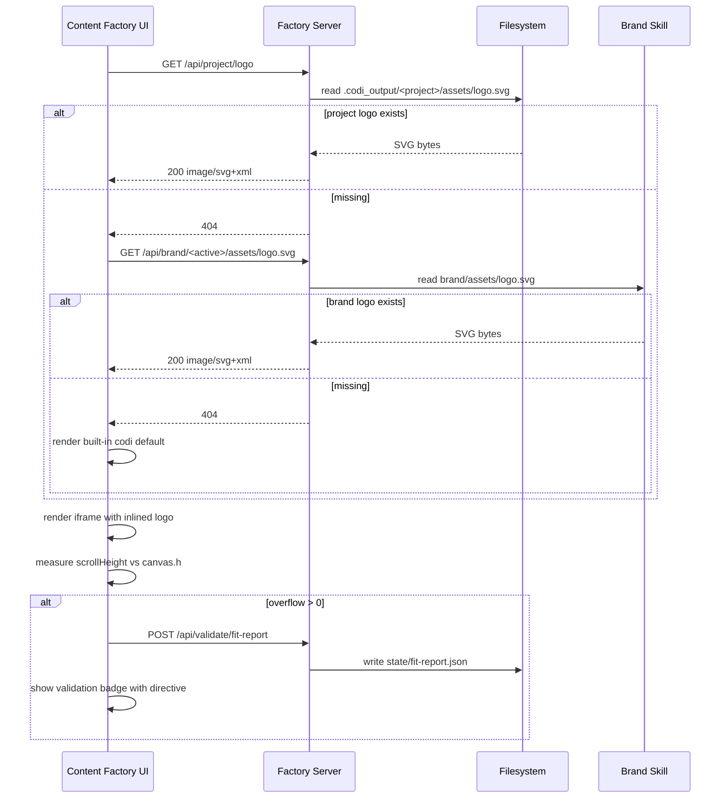

# Content Factory — Logo Discovery, Content Fit, and Logo Defaults

- **Date**: 2026-04-19 11:00
- **Document**: 20260419_1100_SPEC_content-factory-logo-and-fit.md
- **Category**: SPEC
- **Status**: Approved

## Problem

Three related defects in the content-factory pipeline:

1. The factory's logo overlay feature is hardcoded to render the SVG text `codi`.
   Project-specific logos (e.g. the BBVA mark shipped with
   `codi-adoption-t1-d3-leadership-onepager`) are never picked up, even though
   the project bundles its own logo at
   `content/document/assets/BBVA_RGB.svg`. There is no convention telling the
   factory where a project's logo lives.

2. Content templates clip overflow silently. The leadership onepager renders
   inside a `.doc-page` of fixed `794x1123` (A4) with `overflow: hidden`. When
   the rendered content exceeds the active format, the surplus is invisible
   and ships broken. There is no automated check that the content fits the
   active canvas.

3. The default logo overlay size (`size: 48`) is a fixed pixel value applied
   to every content type. It is too large for slides (`1280x720`), too small
   for social squares (`1080x1080`), and not derived from the active format.

The fix must be the same shape on all three points: a small, single
convention with one well-defined fallback chain. No workarounds, no
per-template patches.

## Goals

- One canonical filesystem location for a project's logo, picked up
  automatically by the content-factory web UI.
- A fallback chain from project to brand to a built-in default.
- Automated detection of content overflow on every render, with a
  machine-readable remediation directive an agent can act on.
- A default logo overlay size derived from the active canvas, recomputed when
  the format changes unless the user has overridden it.

## Non-Goals

- Redesigning the leadership onepager template itself. The template author
  fixes the layout once the framework reports the overflow correctly.
- Multi-format brand assets (light vs dark, horizontal vs stacked). v1 ships
  one logo per project, one logo per brand.
- Auto-pagination (the framework does not split content automatically). The
  framework only emits a directive; the agent or human edits the source.

## Design

### Part 1 — Logo discovery

#### Canonical project logo path

```
.codi_output/<project>/assets/logo.svg
```

- Project-level (not type-scoped). A project containing both a document and a
  social post shares one logo.
- Fixed filename. No discovery by extension or by parsing arbitrary names.
- Colocated with `state/` and `content/`, so the project remains portable
  when the folder is moved or zipped.

#### Bootstrap

When a content project is generated from a brand skill, the generator copies
the brand's logo to the canonical project path:

```
<active-brand>/brand/assets/logo.svg  ->  .codi_output/<project>/assets/logo.svg
```

The filename is normalized to `logo.svg` regardless of the source name. The
project owns the file from creation onward; subsequent edits in the brand
skill do not propagate (the project is the source of truth, not the brand).

#### Brand convention

Brand skills declare their logo at the conventional path:

```
<brand-skill>/brand/assets/logo.svg
```

This is additive — `discoverBrands()` already lists brands from
`*-brand/brand/tokens.json`. The logo is read from the same `brand/`
directory.

#### Fallback chain

The card-builder applies the chain in order, returning the first hit:

1. Project logo: `.codi_output/<project>/assets/logo.svg`
2. Active brand logo: `<active-brand>/brand/assets/logo.svg`
3. Built-in default: the current hardcoded `codi` SVG text

The chain runs once per render, server-side. The result is inlined into the
exported HTML so the export is self-contained (no external ``).

#### Server endpoint

One new route in `scripts/routes/project-routes.cjs`:

```
GET /api/project/logo
  -> 200 image/svg+xml  (project logo bytes if present)
  -> 404                 (project has no logo)
```

The brand fallback reuses the existing `/api/brand/:name/assets/*` route. No
new framework, no new abstraction.

### Part 2 — Content fit validator

#### Stop clipping in preview

Remove `overflow: hidden` from the canvas root in preview-facing CSS so
overflow is visible during authoring. Exports already use
`overflow: visible`. This is a one-line change per template that uses the
clip pattern, plus a guideline for new templates.

#### New validator layer

Add a `content-fit` layer to the existing validation framework
(`generators/lib/validation-panel.js`, `validation-settings.js`,
`validation-badge.js`). The layer runs on every render and measures:

```
overflowPxH = iframe.contentDocument.body.scrollHeight - canvas.h
overflowPxW = iframe.contentDocument.body.scrollWidth  - canvas.w
overflowPct = (overflowPxH / canvas.h) * 100
```

Either dimension > 0 raises a validation badge. Severity is per content
type:

| Type | Severity | Rationale |
|------|----------|-----------|
| `document` | error | Print format, must fit page or paginate |
| `slides` | error | Each slide is a fixed canvas |
| `social` | error | Square grid format, no overflow possible |

#### Remediation directive

When overflow is detected, the validator writes
`state/fit-report.json` on every render:

```json
{
  "file": "document/onepager.html",
  "canvas": { "w": 794, "h": 1123 },
  "measured": { "w": 794, "h": 1410 },
  "overflowPx": 287,
  "overflowPct": 25.6,
  "remediation": "paginate",
  "options": ["paginate", "tighten"],
  "directive": "Content exceeds A4 by 287px (25.6%). Add a second .doc-page after the current one and move overflow content into it. Preserve the existing header on every page."
}
```

Allowed remediations per content type:

| Type | Allowed | Default when overflow > 15% | Default when overflow <= 15% |
|------|---------|-----------------------------|------------------------------|
| `document` | `paginate`, `tighten` | `paginate` | `tighten` |
| `slides` | `split`, `tighten` | `split` | `tighten` |
| `social` | `tighten` | `tighten` | `tighten` |

The validation panel surfaces the same directive verbatim. Agents read
`fit-report.json`; humans read the panel. Same string, same instruction.

#### Pagination contract

To keep the framework and the templates aligned on what "fits" means:

- A multi-page document is a sequence of sibling `.doc-page` elements
  inside `.doc-container`.
- Each `.doc-page` is its own canvas (e.g. `794x1123` for A4) and ships its
  own header and footer.
- The fit validator measures **per page**, not the document as a whole.
  Adding pages legitimately resolves overflow only when each page fits.

The validator iterates `.doc-page` siblings and reports the first that
overflows. The `fit-report.json` includes a 1-indexed `pageIndex` field
(e.g. `"pageIndex": 1` for the first page) and the `directive` text names
the page explicitly: *"Page 1 exceeds A4 by 287px..."*. For single-page
documents `pageIndex` is `1`.

### Part 3 — Default logo proportion

#### Format-derived default

In `generators/lib/state.js`, replace the static logo default
(`size: 48`) with a function called whenever the active format is set:

```
defaultLogoSize(canvas) = round(min(canvas.w, canvas.h) * 0.08)
```

Resulting defaults:

| Format | Canvas | Default size |
|--------|--------|--------------|
| Document (A4) | 794 x 1123 | 64 px |
| Social (square) | 1080 x 1080 | 86 px |
| Slides (16:9) | 1280 x 720 | 58 px |

#### User override flag

Add `state.logo.userOverridden: false` to initial state. The flag flips to
`true` when the user moves the size slider in the inspector. While the flag
is `false`, switching format recomputes `state.logo.size` from the new
canvas. Once `true`, the user's value is preserved across format changes
until they explicitly reset.

## Components and Files

| File | Change |
|------|--------|
| `generators/lib/card-builder.js` | Replace hardcoded `codi` text with fallback chain; inline the resolved SVG |
| `generators/lib/state.js` | Format-derived default size; `userOverridden` flag |
| `generators/lib/validation-panel.js` | Add `content-fit` layer entry |
| `generators/lib/validation-settings.js` | Register `content-fit` layer with severity per content type |
| `generators/lib/validation-badge.js` | Render the `directive` string |
| `scripts/routes/project-routes.cjs` | Add `GET /api/project/logo` |
| `scripts/routes/validate-routes.cjs` | Persist `fit-report.json` to `<project>/state/` |
| `scripts/lib/brand-discovery.cjs` | Expose brand logo path via the discovery record |
| `scripts/lib/project-bootstrap.cjs` (new or existing) | Copy brand logo to `<project>/assets/logo.svg` on project creation |
| Document templates using `overflow: hidden` on the canvas root | Remove from preview CSS |

## Data Flow



## Error Handling

- Missing project logo: 404, fall back per chain. Not an error.
- Missing brand logo while no project logo: 404 from brand route, fall back
  to built-in default. Not an error.
- Malformed SVG: log to server, fall back to next step in the chain.
- `fit-report.json` write failure: log, do not block the render. The badge
  is shown either way.
- No active brand selected: skip step 2 of the chain, go straight to the
  built-in default.

## Testing

Per `codi-testing.md`, integration tests dominate:

- **Logo fallback** — set up three fixtures (project with logo, brand-only,
  neither) and assert the rendered card contains the correct inlined SVG.
- **Bootstrap copy** — generate a project from a brand fixture, assert
  `assets/logo.svg` exists at the project root with the same bytes as the
  brand source.
- **Fit validator** — render fixtures of three sizes (under, exact, over)
  for each content type, assert badge state and `fit-report.json` contents.
- **Pagination contract** — render a two-page document fixture where the
  first page overflows, assert the directive names page 1.
- **Default logo proportion** — switch active format with
  `userOverridden: false`, assert size recomputes; set `true`, assert size
  is preserved.

Unit coverage for the size formula and the per-type remediation matrix.

## Self-Evaluation

- **Security**: SVGs are served as `image/svg+xml` from a known path; the
  path is not user-controlled. No new attack surface beyond existing brand
  asset serving. Project paths are constrained to `.codi_output/<project>/`.
- **Performance**: Logo resolution is one filesystem stat plus one read per
  render. Fit measurement is one DOM call (`scrollHeight`) inside an
  existing iframe. Negligible.
- **Scalability**: All operations are per-project, no shared state.
- **Cost**: No new dependencies, no new infrastructure. Reuses existing
  routes and validation framework.

## Out of Scope

- Multi-variant logo handling (light/dark, horizontal/stacked).
- Automatic content splitting. The framework reports overflow and the
  remediation; the author or agent edits the source.
- Brand version pinning. The bootstrap copies the logo at project creation;
  brand updates do not retroactively flow into existing projects.
