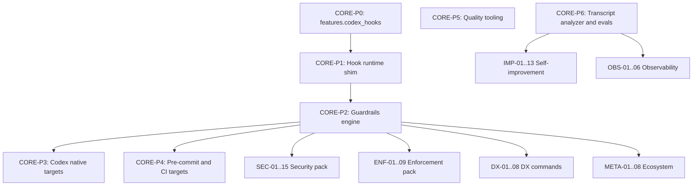

# Codi Hooks and Guardrails - Feature Prioritization Matrix

- **Date**: 2026-04-21 13:05
- **Document**: 20260421_130538_[ROADMAP]_codi-hooks-feature-prioritization.md
- **Category**: ROADMAP

## Purpose

Catalog all 79 candidate features identified from the Claude plugins
marketplace research and the Codex vs Claude hook probe. Score each on
effort, value, and dependencies. Rank into execution waves so delivery
follows the shortest value-to-effort path while respecting technical
order.

Supersedes the flat P0 - P6 ordering in
`20260421_124829_[ROADMAP]_codi-hooks-optimization.md`. That doc stays
as the conceptual statement of phases; this doc is the ranked execution
plan.

## Source documents

- `20260421_103122_[RESEARCH]_claude-plugins-marketplace-learnings.md`
- `20260421_122241_[REPORT]_codex-vs-claude-hook-probe-results.md`
- `20260421_124829_[ROADMAP]_codi-hooks-optimization.md`

## Scoring rubric

### Value (1 to 10)

| Value | Meaning |
|---|---|
| 10 | Fixes a live regression or unblocks every downstream feature |
| 9 | Major differentiator, visible to users, compounds with other features |
| 8 | Strong direct user value |
| 7 | Solid foundational value |
| 6 | Good quality-of-life improvement |
| 5 | Incremental polish |
| 4 | Niche, only useful in specific workflows |
| 3 or below | Far-future or optional |

### Effort (hours)

Estimated engineering hours for implementation + basic tests.

| Tag | Hours |
|---|---|
| XS | under 1 |
| S | 1 to 4 |
| M | 5 to 16 (roughly 1 to 2 days) |
| L | 17 to 40 (3 to 5 days) |
| XL | 41 to 80 (1 to 2 weeks) |

### Priority score

```
priority = (value ** 2) / effort_hours
```

Higher is better. The quadratic on value rewards high-impact work and
the denominator penalizes heavy lifts. Ties broken by dependency depth
(shallower wins).

### Dependencies

Listed by feature ID. A feature cannot start until every dependency has
landed.

## Feature catalog

### Core hook pipeline (CORE-*)

| ID | Name | Value | Effort (h) | Deps | Priority |
|---|---|---|---|---|---|
| CORE-P0 | Set `features.codex_hooks=true` in codex adapter | 10 | 0.5 | - | 200.0 |
| CORE-P1 | Hook runtime normalization shim | 9 | 8 | CORE-P0 | 10.1 |
| CORE-P2.1 | Guardrails engine core (dispatcher) | 9 | 16 | CORE-P1 | 5.1 |
| CORE-P2.2 | Rule-to-hook compiler | 9 | 8 | CORE-P2.1 | 10.1 |
| CORE-P2.3 | Guardrails YAML frontmatter schema | 8 | 4 | CORE-P2.1 | 16.0 |
| CORE-P2.4 | Compile target: `.claude/hooks.json` | 9 | 4 | CORE-P2.1 | 20.3 |
| CORE-P2.5 | Compile target: `.codex/hooks.json` | 9 | 4 | CORE-P2.1, CORE-P0 | 20.3 |
| CORE-P3.1 | Compile target: Codex `prefix_rule` DSL | 8 | 4 | CORE-P2.1 | 16.0 |
| CORE-P3.2 | Compile target: Codex `features.*` toggles | 7 | 2 | CORE-P2.1 | 24.5 |
| CORE-P3.3 | Compile target: Codex per-project trust | 6 | 2 | CORE-P2.1 | 18.0 |
| CORE-P4.1 | Compile target: `.husky/pre-commit` | 8 | 4 | CORE-P2.1 | 16.0 |
| CORE-P4.2 | Compile target: GitHub Actions workflow | 7 | 4 | CORE-P2.1 | 12.3 |
| CORE-P5.1 | Progressive-disclosure audit skill | 7 | 8 | - | 6.1 |
| CORE-P5.2 | Skill-trigger overlap detector | 8 | 6 | - | 10.7 |
| CORE-P5.3 | Parallel PR review agents, confidence filter | 8 | 16 | - | 4.0 |
| CORE-P6.1 | Skill-eval harness | 8 | 24 | CORE-P1 | 2.7 |
| CORE-P6.2 | Session-report transcript analyzer | 8 | 16 | - | 4.0 |
| CORE-P6.3 | Cross-session feedback rollups | 7 | 8 | CORE-P6.2 | 6.1 |
| CORE-P6.4 | Feedback-to-refine data pipeline | 7 | 8 | CORE-P6.2 | 6.1 |
| CORE-CLI | `codi guardrail` CLI surface (add, list, test, enable, disable) | 8 | 4 | CORE-P2.3 | 16.0 |

### Security guardrails (SEC-*)

All SEC items assume CORE-P2 has landed. Effort is regex + reminder text
per item.

| ID | Name | Value | Effort (h) | Deps | Priority |
|---|---|---|---|---|---|
| SEC-01 | Secrets-in-diff scanner | 10 | 4 | CORE-P2 | 25.0 |
| SEC-02 | AI-prompt-injection detector | 9 | 6 | CORE-P2 | 13.5 |
| SEC-03 | SSRF pattern detector | 8 | 4 | CORE-P2 | 16.0 |
| SEC-04 | SQL injection pattern | 8 | 4 | CORE-P2 | 16.0 |
| SEC-05 | XSS pattern detector | 8 | 4 | CORE-P2 | 16.0 |
| SEC-06 | Mass-assignment guard | 7 | 4 | CORE-P2 | 12.3 |
| SEC-07 | Dependency supply-chain guard | 9 | 8 | CORE-P2 | 10.1 |
| SEC-08 | Dangerous-command blocker | 9 | 2 | CORE-P2 | 40.5 |
| SEC-09 | PII-in-logs guard (PostToolUse) | 8 | 6 | CORE-P2 | 10.7 |
| SEC-10 | `.env` and `.codi/` edit protection | 7 | 2 | CORE-P2 | 24.5 |
| SEC-11 | GitHub Actions workflow injection detector | 8 | 4 | CORE-P2 | 16.0 |
| SEC-12 | Crypto misuse (ECB, MD5 for passwords, hardcoded IVs) | 7 | 6 | CORE-P2 | 8.2 |
| SEC-13 | License-compliance scanner | 6 | 8 | CORE-P2 | 4.5 |
| SEC-14 | Sandbox-escape detector | 6 | 6 | CORE-P2 | 6.0 |
| SEC-15 | Kill-switch guard (disable logging, auth, CSRF) | 7 | 4 | CORE-P2 | 12.3 |

### Self-improvement of Codi artifacts (IMP-*)

| ID | Name | Value | Effort (h) | Deps | Priority |
|---|---|---|---|---|---|
| IMP-01 | Auto-promote `[CODI-OBSERVATION]` markers to rule drafts | 9 | 8 | CORE-P6.4 | 10.1 |
| IMP-02 | Rule effectiveness scoring | 9 | 16 | CORE-P6.2 | 5.1 |
| IMP-03 | Unused-skill detector | 7 | 4 | CORE-P6.2 | 12.3 |
| IMP-04 | Suggest rules from repeated codebase patterns | 8 | 16 | CORE-P2 | 4.0 |
| IMP-05 | Skill conflict auto-resolver | 7 | 8 | CORE-P5.2 | 6.1 |
| IMP-06 | Cross-project preset graduation | 6 | 16 | CORE-P6 | 2.3 |
| IMP-07 | Agent performance regression detection | 6 | 8 | CORE-P6.2 | 4.5 |
| IMP-08 | Skill template self-evolution | 7 | 16 | IMP-01 | 3.1 |
| IMP-09 | Version-drift notifier | 7 | 4 | - | 12.3 |
| IMP-10 | Prompt-decay detector | 5 | 16 | CORE-P6.2 | 1.6 |
| IMP-11 | Rule conflict detector | 7 | 6 | - | 8.2 |
| IMP-12 | Stale feedback pruner | 5 | 2 | - | 12.5 |
| IMP-13 | Per-agent rule calibration | 6 | 8 | CORE-P6.2 | 4.5 |

### Best-practice enforcement (ENF-*)

| ID | Name | Value | Effort (h) | Deps | Priority |
|---|---|---|---|---|---|
| ENF-01 | TODO and FIXME age tracker | 5 | 4 | CORE-P2 | 6.3 |
| ENF-02 | Commit-message conformance (conventional commits) | 7 | 2 | CORE-P2 | 24.5 |
| ENF-03 | PR size limit | 7 | 2 | CORE-P4 | 24.5 |
| ENF-04 | Test coverage floor | 7 | 8 | CORE-P4 | 6.1 |
| ENF-05 | Bundle-size budget | 6 | 8 | CORE-P4 | 4.5 |
| ENF-06 | Docstring coverage on exports | 6 | 6 | CORE-P2 | 6.0 |
| ENF-07 | Accessibility audit on frontend diffs | 6 | 8 | CORE-P4 | 4.5 |
| ENF-08 | Performance regression gate (LCP delta) | 6 | 8 | CORE-P4 | 4.5 |
| ENF-09 | File-line budget enforcer (matches existing 700-line rule) | 8 | 2 | CORE-P2 | 32.0 |

### Observability (OBS-*)

| ID | Name | Value | Effort (h) | Deps | Priority |
|---|---|---|---|---|---|
| OBS-01 | Token-cost alerts | 7 | 4 | CORE-P6.2 | 12.3 |
| OBS-02 | Cache hit-rate tracking | 6 | 4 | CORE-P6.2 | 9.0 |
| OBS-03 | Subagent ROI analysis | 7 | 8 | CORE-P6.2 | 6.1 |
| OBS-04 | User-correction clustering | 10 | 12 | CORE-P6.2 | 8.3 |
| OBS-05 | Task-completion benchmarking | 5 | 8 | CORE-P6.2 | 3.1 |
| OBS-06 | Cross-session memory extractor | 7 | 6 | - | 8.2 |

### Developer experience (DX-*)

| ID | Name | Value | Effort (h) | Deps | Priority |
|---|---|---|---|---|---|
| DX-01 | `codi watch` reactive regenerate | 6 | 8 | - | 4.5 |
| DX-02 | `codi doctor` healthcheck | 10 | 8 | CORE-P0 | 12.5 |
| DX-03 | `codi diff` dry-run preview | 7 | 6 | - | 8.2 |
| DX-04 | `codi why <rule>` origin tracer | 7 | 4 | - | 12.3 |
| DX-05 | `codi trace <skill>` activation log | 6 | 4 | CORE-P6.2 | 9.0 |
| DX-06 | `codi explain <file>` source map | 6 | 6 | - | 6.0 |
| DX-07 | `codi probe` agent capability detector | 9 | 6 | - | 13.5 |
| DX-08 | `codi test-rule <rule>` synthetic harness | 8 | 8 | CORE-P2 | 8.0 |

### Meta and ecosystem (META-*)

| ID | Name | Value | Effort (h) | Deps | Priority |
|---|---|---|---|---|---|
| META-01 | Preset marketplace browser | 6 | 16 | - | 2.3 |
| META-02 | Preset diff viewer | 6 | 6 | - | 6.0 |
| META-03 | Preset A/B testing harness | 5 | 24 | CORE-P6.1 | 1.0 |
| META-04 | Community-shared guardrails repo | 6 | 16 | CORE-P2 | 2.3 |
| META-05 | Cross-agent round-trip validator | 7 | 8 | - | 6.1 |
| META-06 | Rule version pinning | 7 | 8 | - | 6.1 |
| META-07 | Auto-update notifier with changelog delta | 5 | 4 | - | 6.3 |
| META-08 | Plugin bridge (import hookify rules) | 9 | 16 | CORE-P2 | 5.1 |

## Totals

- Core: 20 features
- Security: 15 features
- Self-improvement: 13 features
- Enforcement: 9 features
- Observability: 6 features
- Developer experience: 8 features
- Meta and ecosystem: 8 features
- **Total: 79 features**

Total effort: approximately 520 hours (around 13 full engineering weeks
for one person, or 3 to 4 weeks for a focused small team).

## Ranked execution waves

Each wave is a logical unit that can be released as one or more PRs. The
goal: deliver user-visible value at the end of every wave.

### Wave 0 - Ship today (approximately 1 hour)

Zero dependencies, highest priority, smallest effort. Fixes live bugs.

| ID | Name | Effort | Priority |
|---|---|---|---|
| CORE-P0 | Set `features.codex_hooks=true` in codex adapter | 0.5h | 200 |

**Exit criteria:** Codex heartbeat observer fires for all users on
stock configuration.

### Wave 1 - Foundation (approximately 1 week)

Hook runtime + guardrails engine + the CLI command surface that every
downstream feature depends on.

| ID | Name | Effort |
|---|---|---|
| CORE-P1 | Hook runtime normalization shim | 8h |
| CORE-P2.1 | Guardrails engine core | 16h |
| CORE-P2.3 | YAML frontmatter schema | 4h |
| CORE-P2.2 | Rule-to-hook compiler | 8h |
| CORE-P2.4 | Compile to `.claude/hooks.json` | 4h |
| CORE-P2.5 | Compile to `.codex/hooks.json` | 4h |
| CORE-CLI | `codi guardrail` CLI subcommands | 4h |
| DX-07 | `codi probe` (productize the probe harness) | 6h |
| DX-02 | `codi doctor` healthcheck | 8h |
| IMP-12 | Stale feedback pruner (trivial drop-in) | 2h |

**Total:** approximately 64 hours.

**Exit criteria:** A user can author `.codi/guardrails/no-secrets.md`,
run `codi generate`, and see the hook fire on Claude and Codex. `codi
doctor` detects misconfiguration. `codi probe` reports agent capability.

### Wave 2 - Enforcement surface expansion (approximately 1 week)

Take the engine and compile to every surface. Defense-in-depth lands
here.

| ID | Name | Effort |
|---|---|---|
| CORE-P3.1 | Compile to Codex `prefix_rule` DSL | 4h |
| CORE-P3.2 | Compile to Codex `features.*` | 2h |
| CORE-P3.3 | Compile to Codex per-project trust | 2h |
| CORE-P4.1 | Compile to `.husky/pre-commit` | 4h |
| CORE-P4.2 | Compile to GitHub Actions workflow | 4h |
| CORE-P5.2 | Skill-trigger overlap detector | 6h |
| IMP-11 | Rule conflict detector | 6h |
| IMP-09 | Version-drift notifier | 4h |
| DX-04 | `codi why <rule>` | 4h |
| DX-03 | `codi diff` dry-run | 6h |

**Total:** approximately 42 hours.

**Exit criteria:** One rule file lands on five surfaces. Overlap and
conflict detection runs at `codi generate` time. `codi why` and
`codi diff` help debug generation.

### Wave 3 - First security pack (approximately 1 week)

Now that every surface compiles, ship the guardrail pack that
demonstrates the full system on real risks. Ordered by priority score.

| ID | Name | Effort | Priority |
|---|---|---|---|
| SEC-08 | Dangerous-command blocker | 2h | 40.5 |
| ENF-09 | File-line budget enforcer | 2h | 32.0 |
| SEC-01 | Secrets-in-diff scanner | 4h | 25.0 |
| ENF-02 | Commit-message conformance | 2h | 24.5 |
| SEC-10 | `.env` and `.codi/` protection | 2h | 24.5 |
| SEC-03 | SSRF pattern | 4h | 16.0 |
| SEC-04 | SQL injection | 4h | 16.0 |
| SEC-05 | XSS detector | 4h | 16.0 |
| SEC-11 | GitHub Actions injection | 4h | 16.0 |
| SEC-02 | AI-prompt-injection | 6h | 13.5 |
| SEC-07 | Supply-chain guard | 8h | 10.1 |
| SEC-09 | PII-in-logs | 6h | 10.7 |
| SEC-06 | Mass-assignment guard | 4h | 12.3 |
| SEC-15 | Kill-switch guard | 4h | 12.3 |
| ENF-03 | PR size limit | 2h | 24.5 |

**Total:** approximately 58 hours.

**Exit criteria:** The built-in Codi guardrail pack covers OWASP-shaped
risks on both agents + pre-commit + CI. A real rule edit anywhere in
the stack produces an actionable warning or block.

### Wave 4 - Data-driven feedback loop (approximately 2 weeks)

Transcript analysis turns real sessions into rule-quality signal. This
is the "Codi learns from itself" wave.

| ID | Name | Effort |
|---|---|---|
| CORE-P6.2 | Session-report transcript analyzer | 16h |
| OBS-04 | User-correction clustering | 12h |
| CORE-P6.4 | Feedback-to-refine pipeline | 8h |
| IMP-01 | Auto-promote observation markers | 8h |
| CORE-P6.3 | Cross-session rollups | 8h |
| IMP-03 | Unused-skill detector | 4h |
| OBS-01 | Token-cost alerts | 4h |
| OBS-02 | Cache hit-rate tracking | 4h |
| OBS-03 | Subagent ROI | 8h |
| DX-05 | `codi trace <skill>` | 4h |

**Total:** approximately 76 hours.

**Exit criteria:** Weekly `codi-session-report` produces trend HTML with
top corrections, unused skills, and cost breakdown. Observation markers
flow automatically into `.codi/feedback/` and surface as rule draft PRs.

### Wave 5 - Quality, evals, and DX polish (approximately 2 weeks)

Everything that makes the system measurably better rather than merely
bigger.

| ID | Name | Effort |
|---|---|---|
| CORE-P5.1 | Progressive-disclosure audit | 8h |
| CORE-P5.3 | Parallel PR review, confidence filter | 16h |
| CORE-P6.1 | Skill-eval harness | 24h |
| DX-08 | `codi test-rule <rule>` synthetic harness | 8h |
| DX-01 | `codi watch` reactive regenerate | 8h |
| DX-06 | `codi explain <file>` | 6h |
| IMP-02 | Rule effectiveness scoring | 16h |
| ENF-04 | Test coverage floor | 8h |
| ENF-06 | Docstring coverage | 6h |
| ENF-01 | TODO and FIXME age | 4h |
| OBS-06 | Cross-session memory extractor | 6h |

**Total:** approximately 110 hours.

**Exit criteria:** Every new rule comes with an eval. PR review is
parallel narrow agents with confidence filter. Skills comply with
progressive-disclosure layout. `codi watch` closes the feedback loop
while authoring.

### Wave 6 - Ecosystem and advanced (future)

Lower priority, longer horizon, valuable when Codi has traction.

| ID | Name | Effort |
|---|---|---|
| META-08 | Plugin bridge (import hookify rules) | 16h |
| META-05 | Cross-agent round-trip validator | 8h |
| META-06 | Rule version pinning | 8h |
| META-07 | Auto-update notifier | 4h |
| META-02 | Preset diff viewer | 6h |
| META-01 | Preset marketplace browser | 16h |
| META-04 | Community guardrails repo | 16h |
| IMP-04 | Rule suggestions from codebase patterns | 16h |
| IMP-05 | Skill conflict auto-resolver | 8h |
| IMP-07 | Agent performance regression | 8h |
| IMP-08 | Skill template self-evolution | 16h |
| IMP-13 | Per-agent rule calibration | 8h |
| IMP-06 | Cross-project preset graduation | 16h |
| IMP-10 | Prompt-decay detector | 16h |
| ENF-05 | Bundle-size budget | 8h |
| ENF-07 | Accessibility audit | 8h |
| ENF-08 | Performance regression gate | 8h |
| ENF-03 | PR size limit (already in W3 if simple; here if complex) | - |
| OBS-05 | Task-completion benchmarking | 8h |
| SEC-12 | Crypto misuse | 6h |
| SEC-13 | License-compliance | 8h |
| SEC-14 | Sandbox-escape detector | 6h |
| META-03 | Preset A/B testing | 24h |

**Total:** approximately 230 hours. Schedule piecemeal as priorities
shift.

## Dependency graph (simplified)



Full dependency pointers live in the feature catalog above.

## Rationale for the ordering

1. **Wave 0 fixes a bug.** No feature work, one config line. Highest
   ratio of user impact to effort.
2. **Wave 1 is 80% foundation, 20% quick wins.** The guardrails engine,
   hook runtime, and CLI surface gate everything else. The quick wins
   (`codi doctor`, `codi probe`, feedback pruner) buy visible value
   while the foundation lands.
3. **Wave 2 proves portability.** Until the same rule compiles to five
   surfaces, Codi's cross-agent value is theoretical. This wave turns
   the theoretical into tangible.
4. **Wave 3 populates the pack.** An engine without rules is an empty
   shell. The security pack exercises every surface on real risks and
   becomes the marketing artifact.
5. **Wave 4 closes the learning loop.** Transcript analysis + user
   correction clustering + auto-promote turns Codi into a system that
   improves itself from usage.
6. **Wave 5 measures quality.** Evals, confidence-filtered PR review,
   and the polish commands. Without this, quality claims are vibes.
7. **Wave 6 is ecosystem.** Plugin bridges, marketplaces, advanced
   self-improvement. Worthwhile when the core is solid and adoption
   is nonzero.

## Top-10 by raw priority (flat, ignoring dependencies)

For scanning: the highest-leverage items regardless of when they can
start.

| Rank | ID | Name | Priority |
|---|---|---|---|
| 1 | CORE-P0 | codex_hooks feature flag | 200.0 |
| 2 | SEC-08 | Dangerous-command blocker | 40.5 |
| 3 | ENF-09 | File-line budget enforcer | 32.0 |
| 4 | SEC-01 | Secrets-in-diff scanner | 25.0 |
| 5 | ENF-02 | Commit-message conformance | 24.5 |
| 6 | SEC-10 | `.env` and `.codi/` protection | 24.5 |
| 7 | ENF-03 | PR size limit | 24.5 |
| 8 | CORE-P3.2 | Codex features.* compile target | 24.5 |
| 9 | CORE-P2.4 | `.claude/hooks.json` target | 20.3 |
| 10 | CORE-P2.5 | `.codex/hooks.json` target | 20.3 |

## Decisions required before execution

1. **Approve Wave 0 as an immediate PR.** Zero risk, fixes a live bug.
2. **Confirm Wave 1 as the first multi-day effort.** Or swap specific
   items if you disagree with the cut.
3. **Trim or keep Wave 6.** Some items may never be worth doing.

## Definition of done for each wave

- **Wave 0:** `codi generate` on a fresh project produces a
  `.codex/config.toml` that includes `features.codex_hooks = true`, and
  the heartbeat observer fires in a real Codex session.
- **Wave 1:** A guardrail authored in `.codi/guardrails/<name>.md`
  fires on both agents. `codi doctor` reports healthy.
- **Wave 2:** The same guardrail enforces via `.claude/hooks.json`,
  `.codex/hooks.json`, `prefix_rule`, `.husky/pre-commit`, and a
  generated `.github/workflows/codi.yml`.
- **Wave 3:** The built-in security pack ships, each guardrail with
  BAD and GOOD examples, each verified via `codi test-rule`.
- **Wave 4:** Weekly session reports render. `.codi/feedback/`
  auto-promotes to rule draft PRs.
- **Wave 5:** Every skill has an eval in CI. PR review posts only
  high-confidence findings.
- **Wave 6:** Ecosystem-level features ship as demand arrives.

## Next action

Wave 0 PR: rename the codex adapter edit to a feature branch, land it,
and use it as the reference for how Codi edits compile across its three
layers (source template -> `.codi/` -> per-agent output). Then open a
separate PR for Wave 1.
