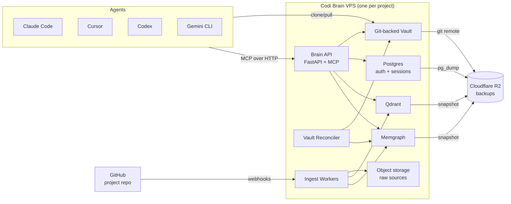
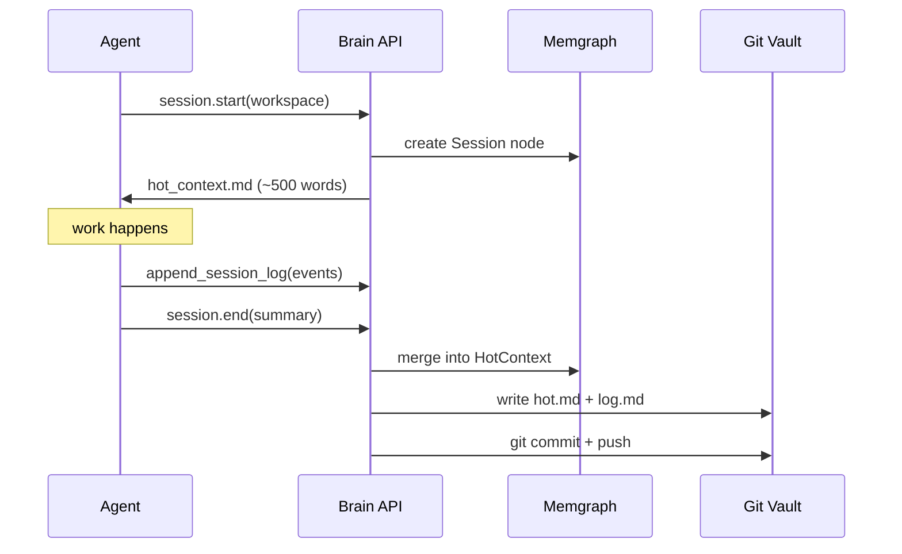
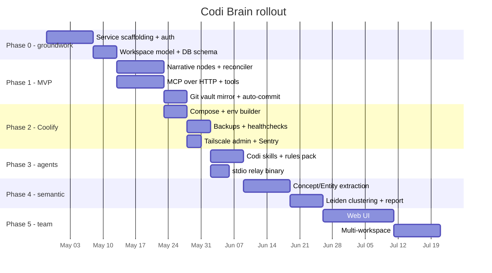

# Universal Agent Brain — Design & Roadmap

- **Date**: 2026-04-22
- **Document**: 20260422_140000_[RESEARCH]_universal-agent-brain-design.md
- **Category**: RESEARCH
- **Author**: Design pass synthesizing graphify, claude-obsidian, and code-graph-rag
- **Status**: Proposal — awaiting approval before any implementation
- **Updated**: 2026-04-22, integrated findings from Codi hook probe, Codi hooks optimization roadmap, Codi hooks feature prioritization matrix, and Karpathy LLM Wiki pattern (`obsidia.md`)

## 1. Executive summary

The goal is a **self-hosted, per-project central brain** for multi-agent coding teams, deployable to a Coolify VPS and reachable by any coding agent (Claude Code, Cursor, Codex, Gemini) over MCP and HTTP. The brain must combine four capabilities that no single analyzed repo covers alone:

1. Structural codebase understanding (AST-level graph).
2. Narrative / decision memory (why, not just what).
3. Working memory across sessions and agents.
4. Honest, traceable audit of what agents read and wrote.

Of the three repos analyzed, `code-graph-rag` is the only production-grade stateful service, and it is the correct foundation to extend. `graphify` supplies reusable patterns for confidence-labeled extraction, clustering, and heterogeneous-corpus ingestion. `claude-obsidian` supplies the markdown-first, git-backed narrative layer, the "hot cache" pattern for working memory, and the multi-agent skill distribution model.

The recommended system, **Codi Brain**, is a FastAPI service that wraps `code-graph-rag`, adds narrative/decision/session/doc node types, publishes its state as a git-backed markdown vault, exposes both stdio and HTTP MCP, and deploys as a Coolify app via the existing `rl3-infra-vps` provisioner.

**Opinionated recommendations up front:**

- Do not fork `code-graph-rag`. Depend on it. The brain is a thin service layer plus new node types plus an auth/workspace boundary.
- The markdown vault is non-optional. The graph is the source of truth, but agents and humans read and edit markdown far more reliably than graph tools.
- Multi-tenant in one instance is a trap at MVP. Follow the `rl3-infra-vps` pattern: one brain per project, many users per brain.
- Ship backups before features. Memgraph dump + Qdrant snapshot + Postgres pg_dump + git-vault → R2, daily.
- Confidence labels on every inferred edge and decision, from day one. Retrofitting honesty is expensive.

---

## 2. Scope and constraints

Constraints derived from your setup and instructions:

- **Deployment target**: Coolify on Hetzner VPS. Existing IaC in `rl3-infra-vps` uses Terraform + Ansible + a generic Python provisioner driven by `client.yaml`. Any new service must fit the single-container-per-service, port-routed, Traefik-fronted model.
- **Tenancy**: one brain instance per project, serving multiple human users and multiple agent sessions.
- **Agent set**: Claude Code (primary), Cursor, Codex, Gemini CLI. MCP is the lingua franca.
- **Existing workflow**: you already use `code-graph-rag` as the `graph-code` MCP tool. It must remain callable by your current clients.
- **Codi integration**: your Codi distribution pipeline is already the right vehicle to ship brain-aware rules, skills, and agents to IDEs. Don't build a second distribution mechanism.

Non-goals for this design pass:

- No code changes are proposed yet; this is a design deliverable.
- No web UI at MVP. Graph + markdown + API is the product surface.
- No multi-project-per-instance. Cross-project sharing is a post-MVP concern.
- No LLM-agnostic embeddings pipeline in MVP; Qdrant + existing providers from `code-graph-rag` are enough.

---

## 3. Deep analysis (condensed, per repo)

Full agent briefs are preserved in scratch memory; the compressed version below is the working reference.

### 3.1 graphify

**Shape**: Python library + multi-platform skill (Claude Code, Codex, Cursor, etc.). ~25k LOC. No database. Outputs a git-committable `graphify-out/` directory of JSON + Markdown + HTML.

**What it does well:**
- Deterministic AST extraction across 25 languages via tree-sitter.
- Optional LLM semantic pass with parallel subagent fan-out.
- Per-file SHA256 caching with YAML-frontmatter stripping, so metadata-only edits do not invalidate.
- Confidence-tagged edges: `EXTRACTED | INFERRED | AMBIGUOUS` plus a numeric `confidence_score` on inferred edges.
- Stable community detection (Leiden with fixed seed) for reproducible clustering.
- `GRAPH_REPORT.md` surfaces god nodes, surprising connections, and knowledge gaps.
- MCP stdio server is a lightweight query bridge over a static JSON graph.

**What it does not do:**
- No persistent service, no auth, no multi-user anything.
- Static snapshots. No decision history, no temporal edges.
- Semantic extraction is slow and cost-bound.
- MCP is read-only.

**Patterns worth stealing:**
- Confidence labeling on every derived edge.
- Deterministic + optional-semantic two-layer ingestion.
- Content-hash caching.
- Leiden clustering on top of a NetworkX graph, for "what are the communities here?" views.
- Honest report generation (god nodes, surprises, gaps, ambiguities).

### 3.2 claude-obsidian

**Shape**: pure markdown + YAML + bash. ~9.5k LOC, zero compiled code. Uses an Obsidian vault as the store, plus Claude Code hooks/skills/commands. Ships a multi-agent shim (symlinks to `~/.codex/skills/`, `~/.gemini/skills/`, etc.).

**What it does well:**
- Hot-cache pattern: `wiki/hot.md` (~500 words) is read at session start and after context compaction, then updated at session end. Cheap working memory.
- Immutable `.raw/` vs mutable `wiki/`. Audit trail is structural, not bolted on.
- Delta manifest (`.raw/.manifest.json`) for skip-if-unchanged ingestion.
- Contradiction flagging instead of silent overwrite. The write path is conservative.
- Append-only log with reverse chronological entries for durable history.
- Three query depths (quick/standard/deep) that scale token usage to question complexity.
- Git auto-commit on agent write, which gives you zero-friction audit without an audit table.
- Skills are plain markdown. No compilation, portable across agents.

**What it does not do:**
- Designed for one local user + one Obsidian. Team hosting requires adding a remote MCP, TLS, auth, and merge-conflict handling.
- No semantic search; Grep-only lookups.
- Scales to ~100–1000 pages before index scans get slow.
- Obsidian-specific extensions (Bases, canvas) are nice but not portable.

**Patterns worth stealing:**
- Hot cache as a session memory bridge.
- Immutable source / mutable synthesis separation.
- Delta manifest on source files.
- Contradiction callouts instead of overwrites.
- Skills-as-markdown, multi-agent via symlinks.
- Frontmatter schemas that double as database indexes.

### 3.3 code-graph-rag

**Shape**: Python 3.12+, uv-managed. Memgraph + Qdrant in Docker. Pydantic-AI agent. MCP stdio server with ~14 tools. Tree-sitter parsers across many languages. 146k LOC, 216 files. **This is the one real service, and it is the foundation.**

**Node/edge schema today:**
- Nodes: `Project`, `Folder`, `File`, `Package`, `Module`, `Class`, `Function`, `Method`, `Interface`, `Type`, `Enum`, `Union`, `ExternalPackage`.
- Edges: `CONTAINS_*`, `DEFINES_*`, `CALLS`, `IMPORTS`, `EXTENDS`, `IMPLEMENTS`, `DEPENDS_ON_EXTERNAL`.
- Unique constraints on `qualified_name` and `path`.
- Buffered batch writes via `UNWIND $batch AS row` Cypher, autocommit connection.

**What it does well:**
- Clean pipeline: parse → definition → calls → imports → graph writes, with buffered batching.
- Real incremental updates using git diff plus `clean_files(project, [rel_paths])`.
- Real-time watcher keeps graph and function-registry in sync.
- Multi-project already works at the graph layer (qualified names are project-prefixed).
- MCP tool registry is well-organized; tools are replaceable.
- Vector search via Qdrant with stable point IDs (hash of project + qualified name), so re-ingest is idempotent.

**What it does not do:**
- Single-process MCP over stdio only. No HTTP transport, no remote auth.
- No multi-tenant isolation. No users, no API keys, no per-project ACLs.
- Graph schema is code-driven, not config-driven. Adding a new node type means Python edits across `definition_processor.py`, `language_config.py`, and the schema proto.
- No audit of what agents read or wrote.
- No narrative / decision / doc node types.
- Single Memgraph connection pool; no per-workspace routing.

**Extension seams (the important part):**
- `MemgraphIngestor` in `codebase_rag/services/graph_service.py` is the right place to add new node and edge types; unique constraints live there.
- `codebase_rag/mcp/tools.py` is the right place to register new MCP tools.
- `codebase_rag/parsers/factory.py` is where new ingestion processors plug in (e.g., `DocProcessor`, `DecisionProcessor`).
- `config.py` (Pydantic `AppConfig`) is where workspace/auth/backup settings plug in.
- `embedder.py` already uses a `Protocol`, so extra embedding providers drop in cleanly.

### 3.4 rl3-infra-vps (deployment target)

**Shape**: Terraform (Hetzner + Cloudflare) + Ansible + Python provisioner. Generic, YAML-driven service loop. One VPS per client (CAX11 default, 2 vCPU / 4 GB / 40 GB, upgradable to CAX21 for 4 vCPU / 8 GB). Coolify for orchestration, Traefik with DNS-01 Let's Encrypt for TLS. Admin panel bound to Tailscale IP only.

**Relevant constraints for the brain:**
- New services are declared in `app.services.<name>` with `type`, `port`, `subdomain`, `env_builder`, `dockerfile`, `post_deploy`.
- Ports get Traefik routes automatically via `subdomain` → `.<domain>` binding.
- Healthcheck must return 2xx within 15s of container start, else provisioning times out at 300s.
- Secrets validated before deploy (`_require_secret`) against placeholder values.
- No per-container CPU/memory limits today — runaway container takes the whole VPS with it.
- Backups already exist for PostgreSQL (pg_dump + age + rclone → R2, daily). Memgraph and Qdrant do not yet fit this path.
- `acme.json` is backed up, so redeploys do not burn LE quota.
- No log aggregation. Docker stdout + optional Sentry is the whole story.

**Implication:** the brain must ship as a Coolify-friendly Compose stack, with one or more services declared in `client.yaml`. Memgraph and Qdrant are not PostgreSQL; we need to add backup logic for them alongside the existing pg_dump cron.

### 3.5 Karpathy LLM Wiki pattern (the conceptual parent)

**Shape**: Not a repo. A short idea document (`obsidia.md`) that claude-obsidian is a direct instance of. Worth naming because it states the core thesis more sharply than any of the three repos do.

**Thesis**: RAG re-derives knowledge on every query. The wiki pattern **compiles knowledge once and keeps it current**. Three layers, three operations, two special files.

**Three layers** (map directly to our Direction C):
- Raw sources — immutable; the LLM reads, never writes.
- Wiki — LLM-owned markdown with cross-references, summaries, synthesis.
- Schema — a `CLAUDE.md` / `AGENTS.md` convention file that tells the agent how the wiki is structured and what workflows to follow.

**Three operations**: ingest, query, lint. Claude-obsidian's 10 skills collapse to these three verbs plus thin wrappers.

**Two navigation files**: `index.md` (content catalog) and `log.md` (chronological operation log). Both human-readable, both queryable with `grep`.

**One memorable framing**: "Obsidian is the IDE; the LLM is the programmer; the wiki is the codebase."

**For the brain, this becomes**: any markdown editor is the IDE; LLMs are the programmers; the graph is the codebase; the vault is a human-readable view of the codebase. This is Direction C phrased as a pattern.

**Reference tool it mentions**: `qmd` — local BM25 + vector + LLM-rerank search over markdown, with CLI + MCP server. A fallback for small workspaces that want vault search without running Memgraph + Qdrant. Worth tracking, not worth adopting at MVP.

---

## 4. Comparison across the three repos

| Dimension | graphify | claude-obsidian | code-graph-rag |
|---|---|---|---|
| Persistence | JSON + Markdown in git | Markdown + YAML in git | Memgraph + Qdrant |
| Service model | Library + CLI + stdio MCP | None (local Obsidian) | Docker services + stdio MCP |
| Authority of truth | The JSON graph | The markdown files | The graph database |
| Audit trail | `GRAPH_REPORT.md` per run | `wiki/log.md` + git history | Incidental git diff |
| Working memory | None | `hot.md` + hooks | None |
| Decision traceability | None | Implicit via decision notes | None |
| Scope of ingestion | Code + docs + papers + media | Anything text | Code only |
| Agent write-back | Read-only MCP | Full vault write via skills | Approval-gated edits via MCP |
| Multi-agent support | 10+ platforms via skill variants | Claude + 5 others via symlinks | Anything that speaks MCP stdio |
| Multi-user | No | No (single vault) | Partial (projects, no auth) |
| Scale ceiling | ~5k nodes (viz cliff) | ~1k pages (grep slows) | 100k+ nodes (Memgraph RAM) |
| Confidence labels | Yes (`EXTRACTED/INFERRED/AMBIGUOUS`) | Informal (`confidence: high/medium/low`) | None |
| Real-time updates | Optional watcher | Manual | Watchdog-driven |
| Honesty artifacts | Ambiguous-edges report, knowledge gaps | Contradiction callouts | None |

**The pattern:** each repo focuses on a different axis. No one of them is a brain. Together, they imply the design.

### 4.5 Agent hook reality (evidence from the Codi probe)

The empirical probe in `20260421_122241_[REPORT]_codex-vs-claude-hook-probe-results.md` constrains what the brain can assume about cross-agent hook coverage. Findings that matter for the brain design:

- Only `SessionStart`, `UserPromptSubmit`, `PreToolUse(Bash)`, `PostToolUse(Bash)`, and `Stop` fire consistently on both Claude Code 2.1.116 and Codex 0.118.0.
- Codex does not fire hooks for `apply patch` — every Codex code edit is invisible to PreToolUse and PostToolUse.
- Codex does not fire `SessionEnd`. Cleanup work has to key off `Stop` if portability matters.
- `tool_response` shape differs: Claude returns `{stdout, stderr, ...}`, Codex returns a raw string.
- No `CLAUDE_PROJECT_DIR` equivalent on Codex. Hook scripts must read `cwd` from stdin or fall back to `git rev-parse`.
- Codex hooks are gated behind `features.codex_hooks=true` today; without it, `.codex/hooks.json` is a silent no-op.

**Implications for the brain:**

1. The brain's authoritative write path is the **explicit MCP / HTTP API**, not hooks. An agent writes to the brain by calling a tool, the same way it already calls `query_code_graph`. Hook-driven auto-logging is a convenience layer on top, not a correctness mechanism.
2. Any brain integration that uses hooks has to live inside the common-subset events. `Stop` is the primary session-finalize trigger on Codex; `SessionEnd` is Claude-only bonus.
3. Auditing agent code edits on Codex cannot happen via hooks. The brain reconstructs edits from `git diff` after the fact — either on `Stop` or via a scheduled reconciler sweep — and attaches them to the active `Session` node.
4. The brain should consume Codi's forthcoming **hook runtime normalization shim** (CORE-P1 in the Codi hooks roadmap) rather than reinventing per-agent branching. Sequencing matters: hook-based brain ingest is a Phase 3 feature that depends on Codi Wave 1.

---

## 5. Reusable patterns to carry forward

Named so we can reference them in the architecture section:

- **P1 — Deterministic + optional-semantic ingestion.** Fast structural extraction is free and always runs. LLM semantic passes are cached, parallelizable, and user-triggered. From graphify.
- **P2 — Content-hash delta cache.** Skip re-processing unchanged inputs. From graphify and claude-obsidian.
- **P3 — Confidence-labeled edges and claims.** Every derived relationship carries `EXTRACTED / INFERRED / AMBIGUOUS` plus a score. From graphify.
- **P4 — Immutable source / mutable synthesis.** `raw/` never changes; synthesized pages or nodes link back to sources. From claude-obsidian.
- **P5 — Hot-cache session bridge.** ~500 words of "what happened lately" read at session start, updated at session end. From claude-obsidian.
- **P6 — Append-only reverse-chronological log.** Human-readable operation history. From claude-obsidian.
- **P7 — Contradiction flagging, not overwriting.** Write-path stays conservative. From claude-obsidian.
- **P8 — Git-auto-commit on agent write.** Audit trail with zero friction. From claude-obsidian.
- **P9 — Multi-mode query depth.** Scale token usage to question complexity. From claude-obsidian.
- **P10 — MCP as lightweight query interface.** Persistence is elsewhere; MCP is a stateless bridge. From graphify and code-graph-rag.
- **P11 — Batched Cypher ingestion.** Buffered nodes and edges flushed via `UNWIND $batch AS row`. From code-graph-rag.
- **P12 — Incremental git-diff-driven update.** Only re-parse what changed; orphan-edge cleanup after file deletion. From code-graph-rag.
- **P13 — Project-prefixed qualified names.** Multi-project coexistence in one graph without schema changes. From code-graph-rag.
- **P14 — Stable vector point IDs.** Re-ingest is idempotent because ID = hash(project, qualified_name). From code-graph-rag.
- **P15 — Generic service loop in `client.yaml`.** No hardcoded service names; adding a new service is declarative. From rl3-infra-vps.
- **P16 — One rule, many surfaces.** A single source artifact (rule, guardrail, convention, agent skill) compiles down to multiple targets: Claude hooks, Codex hooks, Codex `prefix_rule`, pre-commit, CI. The brain uses the same idea for agent-side skill distribution — one source compiles to Claude, Codex, Cursor, and Gemini flavors. From the Codi hooks roadmap.
- **P17 — Stay inside the cross-agent common subset.** Cross-agent behavior only works on the narrow set of events that fire identically on both agents (today: `SessionStart`, `UserPromptSubmit`, `PreToolUse(Bash)`, `PostToolUse(Bash)`, `Stop`). Anything richer becomes a Claude-only or Codex-only extension with explicit feature detection. From the hook probe.

---

## 6. Unified product directions (brainstorm)

Three candidate shapes, from lightest to heaviest. I recommend Direction C; A and B are documented for completeness.

### Direction A — Vault-first brain (claude-obsidian spine)

- Markdown vault is the primary store. Memgraph is a secondary index rebuilt from the vault.
- All writes go through git. MCP server parses the vault on demand.
- Pros: simple, portable, obvious audit trail, Coolify-trivial.
- Cons: no real graph queries. Scale dies at ~10k pages. Semantic search is bolted on. Loses everything `code-graph-rag` is already good at.

### Direction B — Graph-first brain (code-graph-rag spine, vault as export)

- Memgraph + Qdrant are the truth. Markdown is a one-way export for humans.
- Pros: strong queries, strong incremental updates, minimal change to current stack.
- Cons: agents need bidirectional text. Read-only vault means decisions and docs must be authored through the API, which is high friction for a quick `vim note.md` workflow.

### Direction C — Dual-store brain, graph authoritative, vault editable (recommended)

- Memgraph is the authoritative store for structured nodes and edges.
- Git-backed markdown vault is a bidirectional mirror of **narrative node types** (Doc, Decision, Task, Session, HotContext). Code nodes are export-only (you don't edit functions from markdown).
- A reconciler watches the vault and upserts changes back into the graph. Writes through the API also update the vault.
- Conflicts are flagged (P7) rather than auto-merged.

**Why C wins:**
- Preserves all of `code-graph-rag`'s strengths for code understanding.
- Gives agents and humans a plain-markdown surface for the narrative layer.
- Git is the audit trail for free.
- Matches your existing Codi mental model: source-of-truth + generated surfaces.

---

## 7. Proposed system — Codi Brain

### 7.1 High-level architecture

### 7.2 Data model — node and edge additions

Keep everything in `code-graph-rag`'s schema. Add these, each with a `workspace_id` property and a `confidence` property where applicable:

**New nodes:**
- `Source` — immutable external artifact (article, transcript, PDF, image). Properties: `id`, `url`, `source_type`, `ingested_at`, `hash`, `raw_storage_key`, `confidence`.
- `Doc` — narrative page mirrored to the vault. Properties: `id`, `title`, `path`, `type` (guide/reference/adr/runbook/explanation per Diataxis), `status`, `created_at`, `updated_at`.
- `Concept` — extracted idea, pattern, framework. Properties: `id`, `name`, `aliases`, `description`.
- `Entity` — person, org, product, repo. Properties: `id`, `name`, `entity_type`.
- `Decision` — ADR. Properties: `id`, `title`, `status` (active/pending/done/superseded), `rationale`, `decided_at`, `decided_by`, `confidence`.
- `Task` — work item. Properties: `id`, `title`, `status`, `assignee`, `ticket_url`.
- `Session` — agent session record. Properties: `id`, `agent_name`, `started_at`, `ended_at`, `trace_id`.
- `HotContext` — per-workspace working memory. Properties: `id`, `content`, `updated_at`.
- `Question` — filed Q&A. Properties: `id`, `question`, `answer_quality`, `asked_in_session`.

**New edges (all carry `confidence: EXTRACTED | INFERRED | AMBIGUOUS`):**
- `REFERENCES` — `Doc → Module | Class | Function`
- `DERIVED_FROM` — `Concept | Decision | Doc ← Source | Session`
- `MENTIONED_IN` — `Entity → Source | Doc | Session`
- `AFFECTS` — `Decision → Function | Class | Module`
- `SUPERSEDES` — `Decision → Decision`
- `DECIDED_BY` — `Decision → Entity`
- `BLOCKS` — `Task → Task`
- `IMPLEMENTS_DECISION` — `Task → Decision`
- `READ_DURING` / `WROTE_DURING` — `Session → any node` (the agent audit trail)
- `CONTRADICTS` — `Source → Source | Claim`
- `DISCUSSED_IN` — `Concept | Decision → Session`

**Properties to add to existing code nodes:**
- `last_seen_commit`, `last_seen_branch` — already partly present via `Project.last_indexed_commit`.
- `confidence` on all inferred call edges (most CALLS edges are inferred when static resolution fails; label them honestly).

### 7.3 Service stack (Coolify compose)

- **`brain-api`**: FastAPI app. HTTP REST + MCP over HTTP + webhooks. Depends on `code-graph-rag` as a library. New code: auth middleware, workspace resolver, narrative-node handlers, vault reconciler.
- **`brain-ingest-worker`**: Background worker (arq or RQ on Redis). Runs code ingest, document ingest, URL fetch, optional transcription. Triggered by webhooks or API calls.
- **`memgraph`**: pre-built image, port 7687 internal.
- **`qdrant`**: pre-built image, port 6333 internal.
- **`postgres`**: Coolify-managed Postgres. Stores users, API keys, sessions, audit events, rate-limit counters.
- **`vault-mcp`**: thin MCP stdio-to-HTTP relay binary for agents that cannot speak MCP-over-HTTP natively. Ships as a small Go or Python binary, run locally by each agent.
- **Git-backed vault**: a git repository hosted on a git remote (GitHub preferred, matches your existing workflow). The brain commits and pushes; agents clone and pull.

Only `brain-api`, `memgraph`, `qdrant`, and `postgres` are exposed ports; only `brain-api` is exposed publicly (via Traefik). Admin endpoints are Tailscale-only, matching the `rl3-infra-vps` Coolify panel pattern.

### 7.4 API surfaces

- **HTTP REST + OpenAPI** — auth with API keys scoped to a workspace and a tool allowlist. Endpoints for workspaces, ingest, query, docs, decisions, tasks, sessions, hot-context, audit.
- **MCP over HTTP** (SSE or streamable HTTP transport) — same tool set as REST, MCP-flavored. Primary surface for agents.
- **MCP over stdio** — via the local relay binary, for agents that don't speak HTTP MCP yet.
- **Webhooks in** — GitHub push / PR, generic URL ingest.
- **SSE stream** — live workspace events for future UI and pair-of-agents scenarios.

### 7.5 Tool catalog (MCP + REST)

A minimum viable tool set, grouped. All tools take an implicit workspace (resolved from the API key) and emit a `session_id` for audit.

- **Understand** — `query_code_graph`, `get_code_snippet`, `semantic_search`, `list_callers`, `list_dependents`, `list_community` (Leiden cluster view), `summarize_module`.
- **Narrate** — `create_doc`, `update_doc`, `read_doc`, `list_docs`, `link_doc_to_code`.
- **Decide** — `create_decision`, `supersede_decision`, `list_decisions`, `link_decision_to_code`.
- **Track** — `create_task`, `update_task_status`, `block_task_on`, `list_tasks`.
- **Remember** — `get_hot_context`, `update_hot_context`, `append_session_log`, `pin_memory`.
- **Ingest** — `ingest_repo_delta`, `ingest_document`, `ingest_url`, `ingest_transcript`.
- **Audit** — `list_session_reads`, `list_session_writes`, `list_decision_history`.

### 7.6 Working memory pattern (P5 + P6)

`HotContext` is one node per workspace. Each agent session produces an append-only `SessionLog` that is merged into `HotContext` at session end. Rendered to `vault/hot.md` and `vault/log.md` for git history (P8).

### 7.7 Ingestion pipeline

Two-layer, matching P1:

1. **Structural layer (deterministic, always on)**
   - Code: tree-sitter via `code-graph-rag`, incremental via git diff (P12).
   - Docs: markdown parser, frontmatter extractor, wikilink resolver.
   - Git history: commit → Session-like `Commit` nodes (post-MVP).

2. **Semantic layer (LLM, user- or schedule-triggered)**
   - Source documents → Concept / Entity extraction.
   - Generate doc-to-code links via BM25 + embedding similarity, labeled `INFERRED` with a score.
   - Cluster communities via Leiden (graphify's pattern, P3-adjacent) — reproducible per workspace.

Caching: content-hash on every input (P2). Vector point IDs are stable (P14). Re-ingest is idempotent and cheap.

### 7.8 Multi-agent interop

One brain, many agents, same contract. Two write paths, one authoritative:

- **Explicit path (authoritative).** The agent calls an MCP tool or HTTP endpoint and the brain writes the node. Works identically across every agent that speaks MCP. The MVP ships on this path.
- **Implicit path (convenience, Phase 3).** A hook script fires on session events and POSTs to the brain — for example, `Stop` appends to `SessionLog`. Limited to the cross-agent common subset (P17) and depends on Codi's normalization shim landing first.

Transport by agent:
- Claude Code: MCP over HTTP. Codi ships the skill set to wire it up.
- Cursor: `.cursor/rules/` plus an MCP config entry (Cursor supports remote MCP).
- Codex CLI: MCP stdio via the relay binary; rules in `AGENTS.md`.
- Gemini CLI: MCP stdio via the relay binary; rules in `GEMINI.md`.

Codi distributes a unified `codi-brain` rule and skill pack so that agents across IDEs share the same mental model and tool names. One source file, compiled to per-agent formats — pattern P16.

### 7.9 Deployment on rl3-infra-vps

New entries in `client.yaml`:

- A project-scoped client (e.g., `codi` or `<project-slug>`) with `infrastructure.cloudflare.subdomains.brain = "brain-<slug>"` → `brain-<slug>.rl3.dev`.
- `app.services.brain-api`: type `repo`, port `8000`, health `/health`, `env_builder: brain_api`.
- `app.services.brain-ingest-worker`: type `repo`, same repo, no public port, `env_builder: brain_worker`.
- `app.services.memgraph`: type `image`, no public port, persistent volume.
- `app.services.qdrant`: type `image`, no public port, persistent volume.
- Coolify-managed Postgres alongside.

New env builder in `provisioner/integrations/env_builders.py`:

- `brain_api` — receives secrets (`BRAIN_ADMIN_TOKEN`, `JWT_SECRET`, `OPENAI_API_KEY`, `GOOGLE_API_KEY`, `QDRANT_URL`, `MEMGRAPH_HOST`, DB DSN), enforces non-placeholder via `_require_secret`.

Backups (extend existing Ansible cron):

- `memgraph dump` via `mgconsole` to `/var/backups/memgraph/`, age-encrypted, rcloned to R2.
- `qdrant snapshot create` via REST, upload result to R2.
- Postgres pg_dump path already exists — reuse.
- Git-vault push is backup by construction (remote is R2-backed or GitHub).

### 7.10 Relationship to the Codi hooks roadmap

The brain and the Codi hooks optimization roadmap are complementary, not overlapping.

- **Codi hooks** = local enforcement. Rule source in `src/templates/rules/` compiles to Claude hooks, Codex hooks, Codex `prefix_rule`, pre-commit, and CI. Scope: the current repo, the current session, the current diff. Stateless between sessions. See `20260421_124829_[ROADMAP]_codi-hooks-optimization.md` and `20260421_130538_[ROADMAP]_codi-hooks-feature-prioritization.md`.
- **Brain** = persistent memory per project. Stateful across sessions. Scope: the accumulated knowledge of the project, its decisions, its narrative, its code graph. No enforcement, only observation and retrieval.

The two meet at four integration points:

1. **Agent skill distribution.** Codi already ships rules, skills, and agents to every IDE. The brain's MCP tool list and agent prompt additions ride on the same pipeline — no second distribution mechanism.
2. **Observation markers.** Codi's `[CODI-OBSERVATION: ...]` protocol is already a structured write path from agent conversations to disk (`.codi/feedback/`). The brain consumes this channel as input to a new `Observation` or `RuleFeedback` node type (post-MVP).
3. **Session transcripts.** Codi Wave 4 (`codi-session-report`, OBS-04 user-correction clustering) plans to parse `~/.claude/projects/*.jsonl` and `~/.codex/sessions/**/*.jsonl`. The brain treats `codi-session-report` as the transcript ETL layer and ingests its structured output into `Session` and `Audit` nodes. Build once, store in the brain.
4. **Hook runtime normalization shim.** Codi CORE-P1 hides the Claude / Codex payload differences. The brain's hook-based ingest (Phase 3) depends on this shim; do not roll a parallel one.

**Sequencing rule**: the brain MVP (Phases 0–2) is independent of Codi hooks work and can ship first. The brain's Phase 3 hook integration depends on Codi Wave 1 (CORE-P1 shim + guardrails engine). The brain's Phase 4 semantic ingest can piggyback on Codi Wave 4 outputs (transcripts, correction clusters).

**Division of concerns, restated**:
- Codi governs how agents *behave* (rules, hooks, enforcement).
- Brain governs what the project *knows* (graph, docs, decisions, sessions).
- Codi skills are installed; brain nodes are authored.
- Codi hooks act at the moment of the event; brain records are durable.

---

## 8. MVP scope

Eight-week MVP. Cut anything optional if it threatens Week 8 delivery.

**In:**
1. Fork nothing. Depend on `code-graph-rag` as a pinned Git submodule or Python package.
2. FastAPI service with MCP-over-HTTP transport and bearer-token auth.
3. Workspace model: one brain instance = one workspace at MVP. `workspace_id` is present on every node and edge (future-proofs multi-workspace later).
4. New node types: `Doc`, `Decision`, `Session`, `HotContext`. Defer `Source`, `Concept`, `Entity`, `Task`, `Question` to post-MVP.
5. Reconciler: one-way initial pull from graph to vault; two-way after MVP stabilizes.
6. Git-backed vault with auto-commit on API write.
7. Hot-context + session-log endpoints.
8. MCP tools: `query_code_graph`, `get_code_snippet`, `create_doc`, `update_doc`, `read_doc`, `create_decision`, `get_hot_context`, `update_hot_context`, `append_session_log`.
9. Ingest endpoints: `ingest_repo_delta` (wraps code-graph-rag), `ingest_document` (markdown only).
10. Coolify compose + `env_builder` in `rl3-infra-vps`.
11. Backups: Memgraph dump + Qdrant snapshot + Postgres pg_dump + git push, daily.
12. stdio relay binary (simple Python CLI using the official MCP SDK) for agents that can't do HTTP MCP.

**Out (deferred):**
- Semantic concept/entity extraction.
- Contradiction detection.
- Video/audio transcription.
- Leiden clustering and community view.
- Web UI.
- Multi-workspace-per-instance.
- Fine-grained RBAC (start with API keys only).
- URL ingestion, PDF ingestion.

---

## 9. Roadmap

Phase 0 is throwaway if we hit trouble at Phase 1; everything from Phase 1 onward is production code.

---

## 10. Tradeoffs and risks

1. **Memgraph memory ceiling on CAX11 (4 GB).** Medium risk for mid-size repos. Mitigation: default brain VPSs to CAX21 (8 GB). Monitor `memgraph-prometheus-exporter` if we add metrics. Fallback: Neo4j Community on disk for XL projects.

2. **MCP-over-HTTP coverage.** Not every agent speaks it yet. Mitigation: ship a stdio relay binary that talks HTTP upstream. Low complexity; high future-proofing.

3. **Git-vault concurrency.** Two agents writing the same doc simultaneously will conflict. Mitigation: brain API is the sole writer to the vault (no direct human pushes for narrative nodes); humans edit via API or PR. For code, the existing git workflow is untouched.

4. **Single-process FastAPI at MVP.** Fine for per-project VPS scale. Mitigation: use uvicorn workers; scale vertically before horizontally. Revisit if we see contention.

5. **LLM cost for semantic ingestion.** Semantic pass is expensive and easy to accidentally run over a whole repo. Mitigation: keep it opt-in per run, content-hash-cached (P2), with a budget-per-job setting. Matches how graphify already does it.

6. **`code-graph-rag` as an upstream.** Pinning to a specific commit is safe; tracking `main` is not. Mitigation: pin to tag, review upgrades manually, contribute back our extension seams so they stay public.

7. **Coolify API drift.** Already biting `rl3-infra-vps`. Mitigation: lock Coolify to a known version per client; reproduce brain provisioning against that version in CI.

8. **Backup correctness.** Memgraph and Qdrant snapshots must be tested, not just taken. Mitigation: weekly restore test into a throwaway container in CI.

9. **Authorization scope creep.** RBAC is famously over-engineered. Mitigation: MVP has one role per key (owner, writer, reader, agent) plus a tool allowlist. Add object-level ACLs only when a real use case shows up.

10. **Hot-cache merge semantics.** If ten agents end sessions within minutes, hot.md ping-pongs. Mitigation: last-writer-wins with merge, but keep session logs append-only. The log is the truth; `hot.md` is the TL;DR.

11. **Codi-managed artifacts vs. brain-managed artifacts.** Risk of overlap: Codi ships rules and skills; Brain stores Decisions and Docs. Mitigation: Codi governs "how agents behave"; Brain governs "what the project knows." Codi skills are installed; Brain docs are authored. No overlap if we hold that line.

12. **Observability debt.** Docker stdout only will hurt at incident time. Mitigation: Sentry from MVP, structured JSON logs via loguru (already used by `code-graph-rag`), request-ID middleware. Add Prometheus only when a second brain instance exists.

13. **Codex `apply_patch` blindspot.** Codex file edits do not fire hooks, so the brain cannot log them in-session via the implicit path. Mitigation: reconstruct edits from `git diff` on `Stop` and attribute them to the active `Session` node. The brain must not rely on hook-level audit for correctness on Codex.

14. **Hook feature-flag regression on Codex.** Codex hooks are gated on `features.codex_hooks=true` today. If a brain instance relies on Codex hooks without coordinating with Codi's CORE-P0 fix, the implicit write path is silently a no-op. Mitigation: gate hook-based brain features on a `codi doctor` / `codi probe` check that verifies hook delivery is working end-to-end.

---

## 11. Critical recommendations

1. Save this document now and get alignment before any code changes; it is the source of truth for the brain's scope.
2. Treat the markdown vault as equal in weight to the graph. Any tool that cannot round-trip through markdown will feel fragile to agents.
3. Ship the stdio relay and HTTP MCP together in the first release. Agent coverage matters more than transport purity.
4. Put `workspace_id` on every node on day one, even with a single workspace. It is nearly free now and expensive later.
5. Use Codi as the distribution channel for brain-aware agent configuration. Do not build a second mechanism.
6. Assume `code-graph-rag`'s MCP will diverge from ours. Keep the brain's MCP surface the canonical one; treat the upstream MCP as an implementation detail of the ingest path.
7. Add `confidence` to derived edges and claims from the first migration. It costs a column; retrofitting honesty is ugly.
8. Never auto-merge conflicting narrative writes. Follow claude-obsidian's pattern and flag for a human (P7).
9. Write the backup test before the backup job. If the restore doesn't prove out in CI, the backup doesn't exist.
10. Do not touch Obsidian. The vault is plain markdown; any editor works. Avoiding Obsidian specifics is the price of portability.
11. Do not build a per-agent hook ingest layer inside the brain. Depend on Codi's normalization shim (CORE-P1) and schedule brain hook integration for Phase 3, after Codi Wave 1 lands.
12. Treat `codi-session-report` as the canonical transcript ETL layer. Ingest its output into `Session` and `Audit` nodes rather than re-parsing JSONL inside the brain.
13. Consume Codi `[CODI-OBSERVATION: ...]` markers as a first-class input channel in Phase 4. Map markers to brain `Observation` or `RuleFeedback` nodes linked to `Decision` and `Doc`.

---

## 12. Open questions for you

These I could not decide without your input:

- **Repo shape**: new repo (`codi-brain`) or folder inside Codi? Leaning new repo; Codi consumes it as a dependency and ships skills for it.
- **Auth model at MVP**: bearer tokens stored in Postgres, or JWT signed by the brain? Leaning Postgres-stored API keys — simpler, revocable, matches the agent-key lifecycle.
- **Vault host**: private GitHub repo per brain, or R2-backed git remote? Leaning GitHub for humans, R2 for cold backup.
- **LLM providers for semantic layer**: inherit from `code-graph-rag`'s config (OpenAI + Google), or strip to one at MVP? Leaning strip to the one you actually use in day-to-day work to keep cost predictable.
- **`code-graph-rag` dependency strategy**: submodule, published package, or vendored copy? Leaning pinned Git install via `uv add "git+..@tag"`. Submodules are painful in Coolify builds.
- **First workspace**: run this on the Codi repo itself as the dogfood project, or on a client project? Leaning Codi first — short feedback loop.

---

## 13. What to do next

Three concrete next steps I would take only after your approval:

1. Create a plan document (`[PLAN]`) covering brain Phase 0 + Phase 1 in detail, file by file, including the `client.yaml` changes for `rl3-infra-vps`. That becomes the living checklist.
2. Spin up a branch on `code-graph-rag` locally (no upstream changes) to verify the workspace-prefix migration is as cheap as this analysis assumes. If it is not, Phase 0 scope grows and the timeline shifts.
3. Decide the cross-roadmap sequencing with the Codi hooks work. If Codi Wave 0 and Wave 1 land in parallel with brain Phases 0 and 1, brain Phase 3 opens cleanly. If the Codi roadmap slips, brain Phases 0–2 still ship but the implicit hook-based ingest path arrives later. Neither roadmap blocks the other at MVP.

Nothing else should start until those three are agreed.
