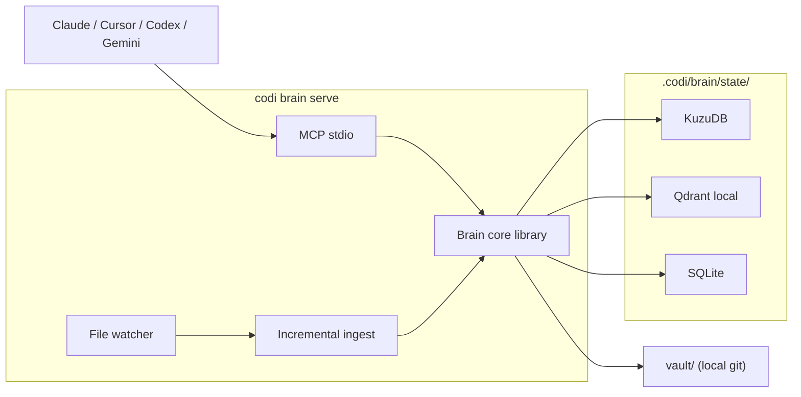
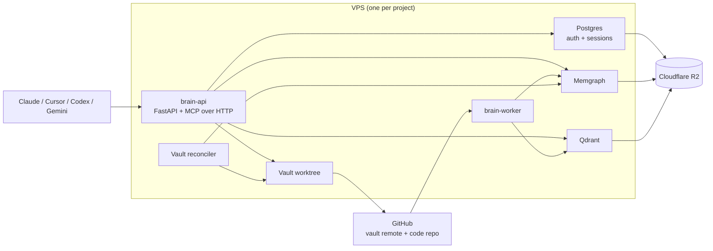

# Codi Brain — Dual-tier design for solo and team developers

- **Date**: 2026-04-22 16:30
- **Document**: 20260422_163000_[ARCHITECTURE]_codi-brain-dual-tier-design.md
- **Category**: ARCHITECTURE
- **Status**: Proposal — awaiting approval before any implementation
- **Supersedes**: the team-only architecture assumption in §7 of `20260422_140000_[RESEARCH]_universal-agent-brain-design.md`. The research doc's analysis, comparison, and reusable patterns remain authoritative.

## 1. Thesis

One product. Two backends. One contract.

Codi Brain is a per-project memory, knowledge, and decision layer for coding agents. A solo developer runs it as an embedded library on a laptop with zero services. A team runs the same logical system as a Coolify-deployed stack on a VPS. The data model, the MCP tool surface, the skill behavior, and the agent experience are identical across both tiers. Only the storage backends and transport differ.

The upgrade path from solo to team is a one-shot migration, not a rewrite.

## 2. Audiences

### 2.1 Audience A — Solo developer

- Zero infrastructure. No Docker unless they already use it. Works offline on a flight.
- One project at a time; laptop-only.
- Cost-sensitive: keeps LLM calls low, prefers local embeddings or none at all.
- Cares about not losing context across sessions, tracking decisions, organizing notes tied to real code.
- Installs with one command.

### 2.2 Audience B — VPS-hosted team or multi-device solo

- Runs on a Hetzner VPS via Coolify per the `rl3-infra-vps` pattern.
- Two to twenty users share one brain instance.
- Wants auth, TLS, backups, an audit trail.
- Ties into existing team workflows: GitHub, CI, Slack later.
- Willing to pay for Memgraph + Qdrant + Postgres + API LLMs.

One product serves both. Tier selection is a deployment choice, not a feature choice.

## 3. Tier model

| Component | Tier L (Local) | Tier T (Team) |
|---|---|---|
| Graph database | KuzuDB (embedded, single file) | Memgraph (service) |
| Vector store | Qdrant local mode (embedded file) | Qdrant service |
| Relational store | SQLite | PostgreSQL |
| Auth | None (stdio trust) | API keys + optional OIDC |
| Vault storage | Local git repo | Remote git (GitHub) + Coolify volume |
| Transport | MCP stdio | MCP over HTTP + REST |
| Embedding provider | Off / local / API, opt-in | API (OpenAI or Google) |
| Packaging | `uv tool install codi-brain` | Docker Compose for Coolify |
| Backups | `git push` + on-demand dump | Cron to Cloudflare R2 |
| Real-time updates | File watcher (watchdog) | File watcher + GitHub webhooks |
| Observability | stdout logs | stdout + Sentry + request IDs |
| Process model | One long-running process per project | API + worker + databases |
| Concurrent users | 1 | 2–20 |

The Cypher subset used for queries is the same on both tiers. The MCP tool names, input schemas, and return shapes are identical.

## 4. Shared contract

Everything below is tier-agnostic. A Claude Code skill written against Tier L works against Tier T unchanged.

### 4.1 Data model

Nodes (identical across tiers; every node carries `workspace_id`):

- Code, inherited from `code-graph-rag`: `Project`, `Folder`, `File`, `Package`, `Module`, `Class`, `Function`, `Method`, `Interface`, `Type`, `Enum`, `Union`, `ExternalPackage`.
- Narrative, new: `Source`, `Doc`, `Concept`, `Entity`, `Decision`, `Task`, `Session`, `HotContext`, `Question`, `Observation`.

Edges carry `confidence: EXTRACTED | INFERRED | AMBIGUOUS` (and an optional score for INFERRED):

- Code edges from `code-graph-rag`: `CONTAINS_*`, `DEFINES_*`, `CALLS`, `IMPORTS`, `EXTENDS`, `IMPLEMENTS`, `DEPENDS_ON_EXTERNAL`.
- Narrative edges, new: `REFERENCES`, `DERIVED_FROM`, `MENTIONED_IN`, `AFFECTS`, `SUPERSEDES`, `DECIDED_BY`, `BLOCKS`, `IMPLEMENTS_DECISION`, `READ_DURING`, `WROTE_DURING`, `CONTRADICTS`, `DISCUSSED_IN`.

Confidence is mandatory on every derived edge from day one (research-doc recommendation, graphify's pattern P3).

### 4.2 MCP and HTTP tool catalog

Tier L exposes these over stdio. Tier T exposes the identical set over HTTP (streamable MCP transport) plus REST.

- **Understand** — `query_code_graph`, `get_code_snippet`, `semantic_search`, `list_callers`, `list_dependents`, `summarize_module`.
- **Narrate** — `create_doc`, `update_doc`, `read_doc`, `list_docs`, `link_doc_to_code`.
- **Decide** — `create_decision`, `supersede_decision`, `list_decisions`, `link_decision_to_code`.
- **Track** — `create_task`, `update_task_status`, `block_task_on`, `list_tasks` (post-MVP).
- **Remember** — `get_hot_context`, `update_hot_context`, `append_session_log`, `pin_memory`.
- **Ingest** — `ingest_repo_delta`, `ingest_document`, `ingest_url` (Tier T only at MVP).
- **Audit** — `list_session_reads`, `list_session_writes`, `list_decision_history`.

Every tool takes an implicit workspace (resolved from CWD on Tier L, from API key on Tier T) and emits a `session_id` for audit.

### 4.3 Skills and agents (shipped via Codi)

Codi distributes one skill pack to every IDE. The skill pack is tier-agnostic; only the MCP endpoint config differs:

- `brain-ingest` — runs `ingest_repo_delta` then `ingest_document` on staged changes.
- `brain-query` — routes natural-language questions through `query_code_graph` + `semantic_search`, with quick / standard / deep depth control (pattern P9).
- `brain-decide` — structured decision capture: title, rationale, affected code.
- `brain-hot` — reads and updates `HotContext`.
- `brain-save` — files the current conversation as a `Doc` or `Question`.
- `brain-lint` — health check for orphans, contradictions, stale claims (post-MVP).
- `brain-session` — `Stop`-hook companion that flushes the session log on both agents that support hooks.

All seven live under `src/templates/skills/brain-*/` in the Codi source repo. One source, multi-agent output (pattern P16).

### 4.4 Filesystem layout

The same relative layout appears at both tiers so that file-resolving logic in agent skills works everywhere.

```
.codi/brain/
├── config.yaml              # tier + backend URLs + workspace_id
├── state/                   # Tier L only; Tier T stores state in services
│   ├── graph.kuzu/          # KuzuDB files
│   ├── vectors.qdrant/      # Qdrant local files
│   ├── metadata.sqlite      # SQLite
│   └── cache/               # content-hash cache (P2)
├── vault/                   # git repo at both tiers
│   ├── hot.md
│   ├── log.md
│   ├── index.md
│   ├── docs/
│   ├── decisions/
│   ├── sessions/
│   └── sources/             # narrative source summaries; immutable
├── raw/                     # original ingested artifacts (local mirror of object storage on Tier T)
└── backups/                 # on-demand dumps
```

## 5. Architecture by tier

### 5.1 Tier L — Local



Install and first run:

```
uv tool install codi-brain
codi brain init
codi brain ingest            # parses the current repo into the local graph
codi brain serve             # prints MCP stdio config to paste into the agent
```

Operations:

- Zero daemons. The `serve` command is the only long-running process, and only while the agent is active.
- Vault is a local git repo; a commit fires on every brain write (pattern P8).
- Embeddings are off by default. Opt in with `codi brain config set embeddings.provider local` (downloads sentence-transformers) or `... provider openai`.
- Backups: `git push` to any remote the user chooses; `codi brain backup` dumps KuzuDB + SQLite + vault into a single archive.

Constraints:

- Single-process writer. A second `codi brain serve` against the same workspace is blocked via a lockfile.
- KuzuDB memory scales with active query, not total node count.
- No auth. `codi brain serve` trusts any stdio client on the same machine; a warning prints if run over a network socket.

### 5.2 Tier T — Team (Coolify on `rl3-infra-vps`)



Install and first run:

```
# Inside the rl3-infra-vps repo
codi brain deploy --client myproject
# writes app.services entries to clients/myproject/client.yaml
# adds the brain env_builder to provisioner/integrations/env_builders.py
# adds the memgraph-dump and qdrant-snapshot cron to the Ansible backup role

cd clients/myproject
python provision.py create --client clients/myproject/client.yaml
```

Operations:

- Healthcheck `/healthz` returns 200 when Memgraph, Qdrant, and Postgres are all reachable within 5 seconds.
- TLS via DNS-01 Let's Encrypt, using the existing Traefik path.
- Admin endpoints bound to Tailscale only, matching the Coolify panel pattern.
- Backups extend the existing pg_dump + age + rclone pipeline: one new cron for Memgraph dump, one for Qdrant snapshot. Both land in the same R2 bucket.
- Observability: Sentry DSN injected when present; request-ID middleware stamps every log line; loguru structured JSON, inheriting from `code-graph-rag`.

Constraints:

- One brain per VPS. Cross-project queries are out of MVP scope.
- First-writer-wins on vault merges. Narrative writes go through the API, so conflicts are rare; code writes follow the project's existing git workflow.
- LLM provider API keys are injected via `_require_secret` with non-placeholder validation, matching the existing `rl3-infra-vps` pattern.

## 6. Upgrade path: Local → Team (and back)

```mermaid
sequenceDiagram
  participant Dev as Solo developer
  participant Local as Tier L brain
  participant Team as Tier T brain
  Dev->>Local: codi brain export snapshot.tar.gz
  Local-->>Dev: snapshot.tar.gz<br/>graph dump + vault + sqlite
  Dev->>Team: codi brain import snapshot.tar.gz --host https://brain-myproject.rl3.dev --api-key ...
  Team->>Team: load nodes + edges into Memgraph
  Team->>Team: push docs to GitHub vault remote
  Team->>Team: load sessions + audit into Postgres
  Team-->>Dev: import report<br/>nodes, edges, docs, sessions
  Dev->>Dev: codi brain config set tier team
  Note over Dev,Team: Local state becomes read-only; writes now go to Team
```

- One-shot and idempotent. Re-running the export/import pair picks up new local writes since the last run.
- Symmetric downgrade is supported: `codi brain export` on Tier T + `codi brain import` on Tier L for offline work.
- Every export carries a `schema_version`. Import refuses on mismatch and prints the upgrade command.

## 7. Codi integration

Codi Brain becomes a first-class Codi artifact type, alongside rules, skills, and agents.

New Codi command surface:

- `codi add brain <name> --template local|team` — scaffolds `.codi/brain/`.
- `codi brain init` — the runtime subcommand on the brain artifact.
- `codi brain serve | ingest | query | decide | log | hot | backup | restore | export | import | deploy | upgrade | status`.
- `codi generate` — extended to also compile the brain-aware skills for each IDE.

The Codi three-layer pipeline extends cleanly:

- Source: `src/templates/brains/<template>/` — two templates ship with Codi: `local` and `team`.
- Installed: `.codi/brain/` — one brain per project.
- Generated: `.claude/mcp-servers/brain.json`, `.cursor/mcp.json`, `.codex/mcp.json`, `.gemini/mcp.json` — each points at the right transport for the active tier.

`managed_by: user` applies to any brain-local data; `managed_by: codi` applies to template-generated config. Matches existing Codi conventions.

## 8. Package and distribution

One new repo, one new package:

- **`codi-brain`** — Python package exposing a library and the `codi brain` CLI.
  - Pinned dependency on `code-graph-rag` for AST parsing and Cypher generation plumbing.
  - Runtime deps: `kuzu`, `qdrant-client`, `sqlalchemy`, `fastapi`, `pydantic-ai`, `loguru`, `watchdog`.
  - Optional `[team]` extra adds Memgraph client and server-mode dependencies.

Install modes:

- Tier L: `uv tool install codi-brain` — single CLI, embedded storage, no Docker.
- Tier T build: `docker build -t ghcr.io/codi/brain-api .`. The Compose file lives in the repo, consumed by `rl3-infra-vps` via `codi brain deploy`.

Version pinning rule:

- Brain API version matches the skill and rule pack version Codi ships for it. `codi brain status` fails fast on mismatch and prints the `codi update` command the user needs.

## 9. Skills and rules (distributed via Codi)

New source-template files to add to Codi:

- `src/templates/skills/brain-ingest/` — ingest staged code + docs.
- `src/templates/skills/brain-query/` — query with quick / standard / deep depth.
- `src/templates/skills/brain-decide/` — structured decision capture.
- `src/templates/skills/brain-hot/` — read and update hot context.
- `src/templates/skills/brain-save/` — file the current conversation as a Doc or Question.
- `src/templates/skills/brain-lint/` — health check (post-MVP).
- `src/templates/skills/brain-session/` — Stop-hook companion.
- `src/templates/rules/brain-usage.md` — how agents should use brain tools (query before grep, decide before edit, always-with-confidence).
- `src/templates/agents/brain-auditor.md` — a Codi agent that audits brain hygiene weekly.

Distribution uses the existing Codi pipeline. Users opt in with `codi add skill brain-*` or `codi preset add brain`.

## 10. MVP cuts by tier

### 10.1 Tier L MVP — Phase L-1 (4 weeks)

- `codi brain init / ingest / serve / query / decide / hot / log / backup / restore`.
- KuzuDB storage of code graph + narrative nodes.
- Qdrant local mode for embeddings, opt-in.
- Local git vault with auto-commit.
- MCP stdio server (same core code as Tier T API).
- Brain skill pack shipped via Codi for Claude, Cursor, Codex, Gemini.

Out of L-MVP: URL ingestion, transcript ingestion, lint, upgrade to Team.

### 10.2 Tier T MVP — Phase T-1 (4 weeks, can start in Phase L-1 week 2)

- FastAPI + MCP over HTTP + bearer-token auth.
- Memgraph + Qdrant + Postgres services.
- Coolify Compose stack + env_builder in `rl3-infra-vps`.
- Backups for Memgraph dump + Qdrant snapshot + pg_dump.
- Webhook ingest from GitHub push.
- Upgrade path: `export` on Tier L + `import` on Tier T.

Out of T-MVP: web UI, multi-workspace per instance, OIDC, fine-grained RBAC, semantic concept and entity extraction.

### 10.3 Post-MVP (any tier)

- URL / PDF / transcript ingestion (ports from graphify).
- Leiden clustering + GRAPH_REPORT.md generation.
- Contradiction detection and callouts.
- Observation-marker consumption from Codi.
- Transcript ingest from `codi-session-report`.
- Web UI.

## 11. Risks and tradeoffs (tier-specific)

### 11.1 Tier L

- **KuzuDB maturity.** Newer than Memgraph, smaller community. Mitigation: pin version, keep a small abstraction that could swap to DuckDB PGQ or Memgraph if needed.
- **Embedded Qdrant scale.** Fine to around 100k vectors, latency rises past that. Mitigation: users at that scale typically already want Tier T.
- **No auth by design.** Document that `codi brain serve` trusts any stdio client on the machine; warn explicitly if run over a network socket.
- **Single-writer.** Second `serve` against the same workspace is blocked via a lockfile.

### 11.2 Tier T

Inherits every risk from the prior research doc §10. No new ones introduced by the dual-tier model.

### 11.3 Shared

- **Cypher portability.** Memgraph and KuzuDB support overlapping but not identical Cypher subsets. Mitigation: the brain query layer restricts itself to a common subset, with per-backend adapters for the few places they diverge (list indexing, regex functions, APOC-style helpers).
- **Upgrade drift.** If a Tier L user stays on L for months and the T schema evolves, the import step must run migrations. Mitigation: every brain export carries a `schema_version`; import refuses on mismatch and prints the upgrade command.
- **Skill parity.** A skill that silently uses a Tier-T-only feature (like server-side BM25) breaks on Tier L. Mitigation: CI runs the full skill suite against both tiers on every release.

## 12. Open decisions

1. **KuzuDB vs. Memgraph-everywhere.** KuzuDB is the right answer if the Tier L friction matters. Memgraph-everywhere cuts maintenance cost but forces Docker on solo devs. My recommendation: KuzuDB at Tier L, Memgraph at Tier T, common Cypher subset across both.
2. **Embedding default on Tier L.** Off, local, or API. Solo devs may not want a sentence-transformers download on first run. My recommendation: off by default; `codi brain config set embeddings local` opts in.
3. **Where does `codi-brain` live?** New repo (`lehidalgo/codi-brain`) or a directory inside Codi. My recommendation: new repo, consumed by Codi as a pinned dependency — matches how `code-graph-rag` is a separate project. The rule and skill pack for brain stays in Codi.
4. **Is `Task` in MVP?** Decisions often want to link to tasks, but task tracking drifts fast. My recommendation: drop from T-MVP, add post-MVP.
5. **Webhook vs. poll for Tier T code ingest.** Webhook is cleaner, poll is resilient to outages. My recommendation: webhook primary, hourly poll as fallback.
6. **Upgrade direction.** Team → Local downgrade is occasionally useful (offline work from a team project). My recommendation: support both directions from day one; they share the same export/import code path.

## 13. Next steps

Three concrete next steps I will take only after your approval:

1. Decide the six open questions in §12.
2. Write a `[PLAN]` doc for Tier L MVP (Phase L-1), file-by-file inside a new `codi-brain` repo, with the data-layer abstraction that allows Tier T swap-in.
3. Write the companion `client.yaml` and `env_builder` patches for `rl3-infra-vps` as a sibling PR plan, to prove the Tier T deployment story against the real infra.

Nothing else should start until those three are agreed.
