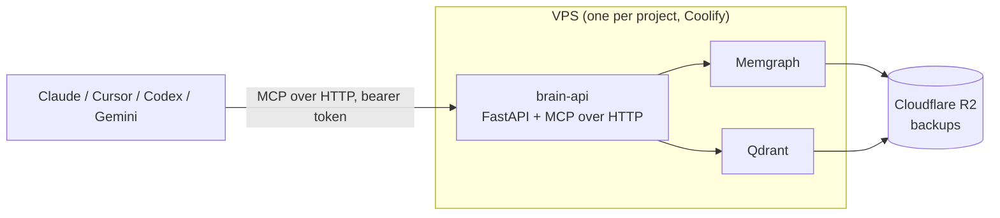

# Codi Brain — Simple design

- **Date**: 2026-04-22 17:30
- **Document**: 20260422_173000_[ARCHITECTURE]_codi-brain-simple.md
- **Category**: ARCHITECTURE
- **Status**: Proposal — awaiting approval before any implementation
- **Supersedes**: `20260422_163000_[ARCHITECTURE]_codi-brain-dual-tier-design.md`. The research doc (`20260422_140000_[RESEARCH]_...`) stays as the analysis source.

## 1. Thesis

One deployed service per project. One brain for the codebase and the team's memory. Agents talk to it through MCP. Codi ships the skills. Everything else is optional.

## 2. Stack

Three containers, one Coolify app per project.



- `brain-api` wraps `code-graph-rag` as a library, adds note storage and an HTTP MCP transport.
- `Memgraph` stores both the code graph (from `code-graph-rag`) and the notes. One graph, two node families.
- `Qdrant` stores embeddings for code and notes (inherited from `code-graph-rag`).
- No Postgres. No separate worker. No git vault at v1.

Deploys through the existing `rl3-infra-vps` pipeline as a new `brain-<project>` client or as services under an existing client.

## 3. Data model (small)

**Code nodes** — unchanged from `code-graph-rag`: `Project`, `Module`, `Class`, `Function`, `Method`, `File`, `Folder`, `ExternalPackage`, etc. With the existing edges (`CALLS`, `IMPORTS`, `DEFINES`, etc.).

**Note node** — the only narrative type.

| Field | Purpose |
|---|---|
| `id` | UUID |
| `kind` | `decision` | `doc` | `log` | `hot` | `observation` | `question` |
| `title` | short label |
| `body` | markdown |
| `tags` | list of strings |
| `session_id` | tag that groups notes written in the same agent session |
| `confidence` | `EXTRACTED` | `INFERRED` | `AMBIGUOUS` (inherits graphify pattern P3) |
| `created_at`, `updated_at` | timestamps |

**Edges (new)** — all carry a `confidence` property:

- `REFERENCES` — `Note → Code` (function, class, module)
- `RELATED_TO` — `Note → Note`
- `SUPERSEDES` — `Note → Note` (for decisions)

**Session is not a node.** `session_id` is a tag on notes. A session is emergent from the tag. If we need richer session audit later, we add a node then.

**Hot context is a singleton Note** with `kind=hot` per workspace. Read-modify-write on one row.

## 4. MCP tool surface (seven tools)

All seven are exposed over MCP-over-HTTP with a bearer token. Same names, same shapes across every agent.

| Tool | Purpose |
|---|---|
| `search_code` | Cypher + vector search over code nodes (wraps existing `query_code_graph`). |
| `get_code` | Fetch source snippet by qualified name (wraps `get_code_snippet`). |
| `save_note` | Write a Note. Inputs: `kind`, `title`, `body`, optional `tags`, optional `links[]` (code qualified names or note IDs). |
| `search_notes` | Query notes by kind, tags, text, or vector similarity. |
| `get_hot_context` | Read the singleton `kind=hot` note for the workspace. |
| `update_hot_context` | Upsert the singleton `kind=hot` note. |
| `append_session_log` | Append an entry to a `kind=log` note tagged with the current `session_id`. |

That's the whole API. REST counterparts exist at `/mcp/search_code`, `/mcp/save_note`, etc. for non-MCP clients.

## 5. Hooks (three)

Only the cross-agent common subset from the Codi probe. Same hook script runs on Claude and Codex.

| Hook | What it does |
|---|---|
| `SessionStart` | (1) POST `/session/start` → receive `session_id`. (2) Call `get_hot_context` → prepend to agent context. |
| `UserPromptSubmit` | Call `append_session_log` with `{role: user, text: ...}`. Optional; off by default to keep logs lean. |
| `Stop` | (1) Call `append_session_log` with the last assistant message. (2) Optionally refresh hot context with a 200-word TL;DR produced by the agent itself. |

No reliance on `PreToolUse`/`PostToolUse` for narrative writes (Codex `apply_patch` blindspot, from the hook probe). Any tool-level audit is v2.

## 6. Agent workflow (how it's used day to day)

1. **Session starts.** The SessionStart hook pulls hot context into the agent. The agent now knows what was decided last week, what's in-flight, and what the open questions are — without asking.
2. **User asks a question.** A `brain-query` skill matches ("what do we know about auth", "show callers of X"). The agent calls `search_code` and `search_notes` in parallel, merges results, answers with citations (both code locations and note IDs).
3. **User wants to record something.** A `brain-save` skill matches ("save this as a decision", "remember that"). The agent extracts a title, body, and links to the affected code, calls `save_note` with the right `kind`. The graph gains an edge to the referenced functions or classes.
4. **Agent finishes.** The Stop hook flushes the session log and refreshes hot context. The next session picks up cleanly.

Search is one concept from the agent's point of view: "ask the brain." Under the hood it branches to code or notes based on what the question wants.

## 7. Codi integration (the skills package)

Codi distributes a single brain pack to every IDE via its existing three-layer pipeline.

Source in Codi:

- `src/templates/skills/brain-query/` — query the brain (runs `search_code` + `search_notes`).
- `src/templates/skills/brain-save/` — structured note capture.
- `src/templates/skills/brain-hot/` — read and refresh hot context.
- `src/templates/skills/brain-session/` — the three-hook script.
- `src/templates/rules/brain-usage.md` — rule: ask the brain before grepping; save decisions as you make them; link notes to code.
- `src/templates/mcp/brain.json` — MCP config pointing at the deployed host with bearer token placeholder.

One command from the user:

```
codi add brain --host https://brain-myproject.rl3.dev --token $BRAIN_TOKEN
codi generate
```

The command writes the MCP config for every configured agent (`.claude/mcp-servers/brain.json`, `.cursor/mcp.json`, `.codex/mcp.json`, `.gemini/mcp.json`), installs the skill pack, and installs the three-hook script. Done.

## 8. Deployment

One Compose file, three services. Consumed by `rl3-infra-vps`:

- Add three entries to `clients/<project>/client.yaml` under `app.services` (or to an existing client): `brain-api` (repo build, port 8000, subdomain `brain-<project>`), `memgraph` (image, internal only), `qdrant` (image, internal only).
- Add one env_builder `brain_api` in `provisioner/integrations/env_builders.py` that receives `BRAIN_BEARER_TOKEN`, `OPENAI_API_KEY` (or equivalent), and wires database URLs.
- Extend the existing Ansible backup role with two crons: `memgraph dump` and `qdrant snapshot create`, both age-encrypted, both uploaded to the existing R2 bucket.
- Healthcheck `/healthz` returns 200 when Memgraph and Qdrant are both reachable.
- TLS via DNS-01 Let's Encrypt (existing Traefik path).

Resource footprint on a CAX21 (4 vCPU, 8 GB RAM): Memgraph ~2 GB, Qdrant ~1 GB, API ~250 MB. Comfortable.

## 9. Auth

One bearer token per deployment for v1. Stored in Coolify env, injected into `brain-api`, embedded in the agent's MCP config (referenced as `$BRAIN_TOKEN` env var, not hardcoded). Rotatable via Coolify UI + `codi generate`. Multi-user auth is v2.

## 10. Backups

- `memgraph dump` → age-encrypted → R2 daily at 02:00.
- `qdrant snapshot create` → R2 daily at 02:00.
- Restore test runs weekly in CI against a throwaway container. Untested backups do not exist.

## 11. What's deliberately out of v1

- Local / embedded mode (no KuzuDB variant). Service-only.
- Postgres. Everything lives in Memgraph.
- Git vault. Markdown export is a post-v1 add-on.
- Workers / async ingest. API calls run synchronously; ingestion uses `code-graph-rag`'s existing incremental path.
- Multiple narrative node types (Decision, Doc, Task as separate tables). One `Note` with a `kind` tag.
- Multi-workspace per instance. One brain per deployment.
- OIDC / RBAC / per-user scopes. Single bearer token.
- Contradiction detection, Leiden clustering, knowledge reports.
- URL / PDF / transcript ingestion.
- Stdio relay binary. MCP-over-HTTP only; agents that can't speak it wait for v2.

Each of these is a named post-v1 feature, not a missing requirement.

## 12. Why this is simple

- Three containers, three MCP tool families, three hooks. Easy to hold in your head.
- One graph database covers code and memory. No cross-store consistency to worry about.
- Every agent sees the same MCP surface. Skill code is identical across IDEs.
- Deployment rides on the existing `rl3-infra-vps` conventions. No new infra pattern.
- Data model is one edge short of trivial: code + notes + three edge types.

## 13. Next steps

Four concrete steps I will take only after your approval:

1. Write a `[PLAN]` doc for `brain-api` v1: FastAPI routes, `Note` schema in Memgraph, wrapping of `code-graph-rag` internals, Dockerfile, healthcheck, tests.
2. Write the `client.yaml` patch and `env_builder` patch for `rl3-infra-vps` as a sibling PR plan.
3. Write the source-template plan for the Codi brain skill pack (`src/templates/skills/brain-*/`, the rule, the MCP config, the hook script).
4. Decide the open questions below.

## 14. Open questions

1. Deployment model: a dedicated `brain-<project>` client on `rl3-infra-vps`, or three extra services inside an existing client (e.g., add to `codi` or `sapphira`). Leaning dedicated client for isolation.
2. LLM provider inside `brain-api` (for on-server enrichment like note summarization): OpenAI only, Google only, or both. Leaning OpenAI only at v1.
3. Memgraph tier: free (in-memory, crash-loses-recent-writes) vs. Memgraph Platform (paid, durable). For a team brain, durability matters. Leaning pinned Memgraph community with periodic snapshots as the v1 durability story.
4. Hot-context size: hard 500-word cap (claude-obsidian pattern) or soft 2000-token cap. Leaning 500 words.
5. `code-graph-rag` dependency pin: submodule, published package, or `uv add git+...@tag`. Leaning `uv add git+...@tag`.
