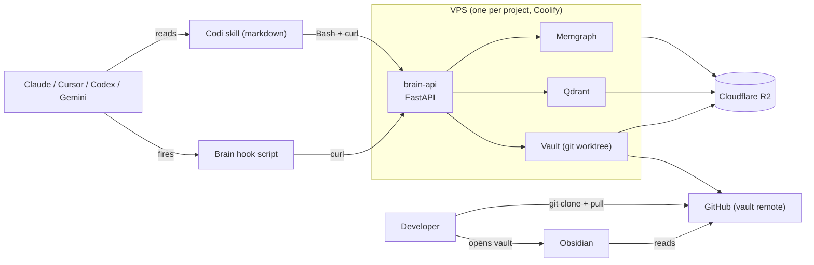

# Codi Brain — Pieces and attribution

- **Date**: 2026-04-22 18:30
- **Document**: 20260422_183000_[ARCHITECTURE]_codi-brain-pieces-and-attribution.md
- **Category**: ARCHITECTURE
- **Status**: Proposal — awaiting approval before any implementation
- **Supersedes**: `20260422_173000_[ARCHITECTURE]_codi-brain-simple.md`. The research doc (`20260422_140000_[RESEARCH]_...`) stays as the analysis source.

## 1. Thesis

One deployed brain per project. The agent reaches it through **skills + HTTP** (no MCP). A **git-backed Obsidian vault is always on** so humans browse the same knowledge the agents write. Simple, but nothing gets removed.

## 2. What changed from the prior simple doc

- **Skills over HTTP, not MCP.** Skills are markdown; they call the brain via `curl`. Works on every agent that can run Bash. No MCP server to build, version, or debug. Any agent that later wants MCP gets a v2 wrapper; the API stays authoritative.
- **Obsidian vault is a first-class, always-on component.** Humans must be able to open the knowledge in Obsidian (graph view, backlinks, Bases). Every brain write updates the vault in the same transaction as the graph write. The vault is a git repo, auto-committed and pushed.
- **Nothing is dropped for simplicity's sake.** Previous cuts (vault, human UI, confidence labels, hot cache, append-only log, lint) are back in v1. Simplicity is about component count and contract clarity, not feature count.

## 3. Attribution — what came from where

| Piece | From | How we use it |
|---|---|---|
| Tree-sitter AST parsing across many languages | `code-graph-rag` | Unchanged; dependency we import. |
| Memgraph as the code graph backend | `code-graph-rag` | Extended with one new node family (`Note`). |
| Qdrant for embeddings | `code-graph-rag` | Shared between code and notes. |
| Incremental git-diff ingest | `code-graph-rag` | Wrapped by `POST /ingest/repo`. |
| Real-time file watcher | `code-graph-rag` | Runs as an optional background task inside `brain-api`. |
| Pydantic-AI plumbing for LLM calls | `code-graph-rag` | Used for on-server enrichment (note summarization). |
| Confidence-labeled edges (`EXTRACTED / INFERRED / AMBIGUOUS`) | `graphify` | Mandatory on every derived edge. |
| Deterministic + optional-semantic two-layer ingest | `graphify` | Structural parse always runs; semantic extraction is opt-in per call. |
| Per-file SHA256 cache | `graphify` | `code-graph-rag` already has something equivalent; we keep the pattern. |
| Honest report generation (god nodes, gaps, surprises) | `graphify` | Exposed as `POST /lint` → writes `wiki/lint-YYYY-MM-DD.md`. |
| Obsidian vault layout (three layers: `_raw/`, `wiki/`, schema) | `claude-obsidian` + Karpathy LLM Wiki | The vault IS the human UI. Structure mirrored exactly. |
| Hot-cache singleton (`wiki/hot.md`, ~500 words) | `claude-obsidian` | Read at session start, refreshed at session end. |
| Append-only log with newest-first entries | `claude-obsidian` | `wiki/log.md`. |
| Master index (`wiki/index.md`) | `claude-obsidian` | Rebuilt on every note write. |
| Frontmatter conventions | `claude-obsidian` | `kind`, `tags`, `links`, `confidence`, `created`, `updated`. |
| Contradiction callouts | `claude-obsidian` | Reserved for v2; pattern kept in mind now so migration is free later. |
| Wikilinks as Obsidian graph edges | `claude-obsidian` | Every graph edge in Memgraph has a `[[...]]` wikilink in the note body. Obsidian graph view reflects brain graph. |
| Ingest / Query / Lint as the three verbs | Karpathy LLM Wiki | Same three verbs underneath the API, each with its own endpoint family. |
| Three-layer pipeline (source → installed → generated) | Codi itself | Brain is a new artifact type that rides this pipeline. |
| Cross-agent skill distribution | Codi itself | One skill pack, generates per-IDE configs. |
| Observation marker protocol (`[CODI-OBSERVATION: ...]`) | Codi itself | Consumed by the brain as an input channel (post-v1). |
| Cross-agent common-subset hooks (`SessionStart`, `UserPromptSubmit`, `Stop`) | Codi hook probe | Only these three hooks are used; others are skipped. |
| Hook runtime normalization shim (CORE-P1) | Codi hooks roadmap | Brain hook scripts depend on this when it lands; stub for now. |
| Coolify + Traefik + DNS-01 TLS | `rl3-infra-vps` | Unchanged deployment path. |
| `pg_dump + age + rclone → R2` backups | `rl3-infra-vps` | Extended with Memgraph dump + Qdrant snapshot + vault git push. |
| Generic `env_builder` service loop | `rl3-infra-vps` | One new `brain_api` builder. |
| Tailscale-only admin ingress | `rl3-infra-vps` | Admin endpoints live on the Tailscale IP, matching Coolify panel pattern. |

## 4. All the pieces of the project

Eleven concrete artifacts. Each one is small.

1. **`codi-brain` service repo.** FastAPI app that wraps `code-graph-rag` as a library, adds Note storage on top of Memgraph, runs a vault reconciler, and exposes the HTTP API. Dockerfile + Compose for Coolify. Backup scripts.
2. **Memgraph container.** Stores code nodes (from `code-graph-rag`) and Note nodes (new). One database, two node families.
3. **Qdrant container.** Embeddings for code docstrings (from `code-graph-rag`) and note bodies. One collection per kind.
4. **Vault git repo.** Lives on the VPS volume, pushed to a GitHub remote on every write. Obsidian-ready structure. Public read to the team; brain-api is the only writer.
5. **Brain HTTP API.** REST endpoints for sessions, notes, hot context, log, code search, ingest, lint, health. Bearer-token auth.
6. **Codi brain skill pack.** Seven markdown skills shipped via the existing Codi pipeline: `brain-query`, `brain-save`, `brain-hot`, `brain-log`, `brain-lint`, `brain-session-start`, `brain-session-end`.
7. **Codi brain rule.** One rule in `src/templates/rules/brain-usage.md`: ask the brain before grepping, save decisions as you go, link notes to code by qualified name.
8. **Brain hook script.** One Bash script, shipped by Codi. Runs on `SessionStart` and `Stop` on both Claude and Codex. Reads CWD, calls the brain over HTTPS, prints hot context on start, flushes log on stop.
9. **Brain env-var file in each consumer project.** `.env` contribution: `CODI_BRAIN_HOST=https://brain-<project>.rl3.dev`, `CODI_BRAIN_TOKEN=<bearer>`. Ignored from git; set once per developer machine.
10. **`rl3-infra-vps` patches.** Three entries added to one client's `client.yaml` (`brain-api`, `memgraph`, `qdrant`), one `brain_api` env_builder, two new backup crons, one Ansible role extension to push the vault git remote.
11. **`codi add brain` command.** Writes the MCP-free config pack to `.codi/brain/`, updates `.codi/artifact-manifest.json`, runs `codi generate` to produce per-agent skill installs.

## 5. Architecture (one diagram)



- Agents only ever see the skill and the hook. They call `curl` under the hood.
- Humans only ever see Obsidian (or any markdown editor) on a local clone of the vault.
- `brain-api` is the only writer to Memgraph, Qdrant, and the vault. All three stay in sync by construction.

## 6. Data model

**Code nodes**: unchanged from `code-graph-rag`. `Project`, `Folder`, `File`, `Module`, `Class`, `Function`, `Method`, `ExternalPackage`, etc. With the existing edges (`CALLS`, `IMPORTS`, `DEFINES`, `EXTENDS`, `IMPLEMENTS`).

**Note node**: one narrative type, differentiated by `kind`.

| Field | Purpose |
|---|---|
| `id` | UUID |
| `kind` | `decision` \| `doc` \| `source` \| `log` \| `hot` \| `observation` \| `question` |
| `title` | short label, becomes the vault filename |
| `body` | markdown, with `[[wikilinks]]` matching the graph edges |
| `tags` | string list |
| `session_id` | groups notes written in the same agent session |
| `confidence` | `EXTRACTED / INFERRED / AMBIGUOUS` |
| `created_at`, `updated_at` | timestamps |

**New edges** — all carry `confidence`:

- `REFERENCES` — `Note → Code` (by qualified name)
- `RELATED_TO` — `Note → Note`
- `SUPERSEDES` — `Note → Note` (for decisions)

Every graph edge also appears as a wikilink in the note body. Obsidian's graph view reflects the Memgraph graph automatically.

## 7. HTTP API surface

Flat REST. Every endpoint auth'd with a single bearer token. Request/response JSON.

```
POST   /sessions                          → { session_id }
POST   /sessions/{id}/log                 ← { role, text }
POST   /sessions/{id}/close               ← { summary }

GET    /hot                               → { body, updated_at }
PUT    /hot                               ← { body }

POST   /notes                             ← { kind, title, body, tags?, links? }
GET    /notes/{id}
PATCH  /notes/{id}                        ← { title?, body?, tags? }
GET    /notes/search                      ? q=, kind=, tag=, limit=

GET    /code/search                       ? q=, limit=            (wraps code-graph-rag)
GET    /code/snippet                      ? qualified_name=

POST   /ingest/repo                       ← { path?, force? }     (trigger incremental ingest)
POST   /ingest/doc                        ← { path, title? }

POST   /lint                              → { report_path }
GET    /healthz
```

That's the whole API. Skills call these with `curl`; humans can hit them from any HTTP client.

## 8. Skills shipped via Codi

Seven markdown skills. Each contains: a trigger description, the curl invocation, how to format the response for the user.

Example `brain-save/SKILL.md` skeleton:

```
---
name: brain-save
description: Save a decision, doc, or observation to the project brain
---

When the user says "save this as a decision", "remember that", "record:", run:

curl -sS -X POST "$CODI_BRAIN_HOST/notes" \
  -H "Authorization: Bearer $CODI_BRAIN_TOKEN" \
  -H "Content-Type: application/json" \
  -d '{
    "kind": "decision",
    "title": "<short title>",
    "body": "<markdown body with [[wikilinks]] to code entities>",
    "links": ["<qualified_name_1>", "<qualified_name_2>"],
    "session_id": "$CODI_BRAIN_SESSION_ID"
  }'

Confirm back to the user: "Saved decision [[<title>]]; linked to N code entities."
```

Seven skills, same shape:

- `brain-query` — calls `/code/search` and `/notes/search` in parallel, merges, cites.
- `brain-save` — `POST /notes`.
- `brain-hot` — `GET /hot` to read; `PUT /hot` to refresh.
- `brain-log` — `POST /sessions/{id}/log` on demand.
- `brain-lint` — `POST /lint`, reports back to the user what Obsidian will now highlight.
- `brain-session-start` — runs on SessionStart hook; starts a session, prints hot context.
- `brain-session-end` — runs on Stop hook; flushes log, refreshes hot context.

## 9. Obsidian vault (always on, the human surface)

Vault structure on disk (git-backed, pushed to GitHub on every write):

```
/vault/
├── hot.md                    # singleton; kind=hot
├── log.md                    # append-only, newest first
├── index.md                  # auto-rebuilt on every write
├── decisions/
│   └── <title>.md            # kind=decision
├── docs/
│   └── <title>.md            # kind=doc
├── sources/
│   └── <title>.md            # kind=source (immutable after creation)
├── sessions/
│   └── <session_id>.md       # kind=log, one file per closed session
├── questions/
│   └── <title>.md            # kind=question
├── observations/
│   └── <title>.md            # kind=observation
├── _raw/                     # original ingested artifacts (immutable)
├── _meta/
│   └── lint-YYYY-MM-DD.md    # health reports
└── .obsidian/                # pre-configured: graph colors, folder filters, Bases dashboards
```

Every note has YAML frontmatter so Obsidian's Bases plugin produces live dashboards. Every `REFERENCES` edge in Memgraph corresponds to a `[[...]]` wikilink in the note body — Obsidian's graph view visualizes the brain graph with no extra work.

Human workflow:

- Clone the vault GitHub repo once: `git clone git@github.com:<org>/<project>-brain-vault.git`.
- `git pull` daily, or set the Obsidian Git plugin to pull every 10 minutes.
- Open in Obsidian. Browse. Graph view. Backlinks. Bases.
- Never push. The brain-api is the only writer. Humans read.

## 10. Hooks (three, cross-agent common subset)

One shell script, shipped by Codi. Reads `$CODI_BRAIN_HOST` and `$CODI_BRAIN_TOKEN` from the env.

- `SessionStart` → `POST /sessions` → saves `session_id` to a file in `/tmp/`. Then `GET /hot` → print to stdout → agent includes it in context.
- `UserPromptSubmit` → `POST /sessions/{id}/log` with the user message. Optional, disabled by default to keep logs lean.
- `Stop` → `POST /sessions/{id}/log` with last assistant message → `POST /sessions/{id}/close` with a TL;DR the agent generates → `PUT /hot` with the refreshed hot context.

No reliance on `PreToolUse` / `PostToolUse` (Codex `apply_patch` blindspot from the probe).

## 11. Deployment (Coolify via `rl3-infra-vps`)

Three new `app.services` entries in `clients/<project>/client.yaml`:

- `brain-api`: type `repo`, port `8000`, subdomain `brain-<project>`, healthcheck `/healthz`, env_builder `brain_api`.
- `memgraph`: type `image`, internal only, persistent volume.
- `qdrant`: type `image`, internal only, persistent volume.

One new `env_builder` `brain_api` in `provisioner/integrations/env_builders.py`:

- Required secrets (validated via `_require_secret`): `CODI_BRAIN_BEARER_TOKEN`, `OPENAI_API_KEY` (or `GOOGLE_API_KEY`), `VAULT_GIT_REMOTE`, `VAULT_GIT_DEPLOY_KEY`.
- Non-secret env: `MEMGRAPH_HOST`, `QDRANT_URL`, workspace ID, vault path.

Two new backup crons in the Ansible backup role:

- `memgraph dump` → age → rclone → R2, daily at 02:00.
- `qdrant snapshot create` → rclone → R2, daily at 02:00.
- Vault git push is backup by construction (GitHub remote).

Resource footprint on a CAX21 (4 vCPU, 8 GB RAM): Memgraph ~2 GB, Qdrant ~1 GB, brain-api ~250 MB. Fits with headroom.

## 12. Why this stays simple

- Three containers. Two databases. One API. Seven skills. Three hooks.
- No MCP server to build, version, or debug.
- One graph DB for code and notes; one vector DB for both. No cross-store consistency.
- Brain-api is the only writer. Humans are readers in Obsidian; no concurrency problem at v1.
- Deployment rides the existing `rl3-infra-vps` conventions with three new YAML lines and one new env_builder.
- Every piece has an honest origin from one of the reference projects.

## 13. Explicitly not in v1 (named, not removed)

- MCP server (skills + HTTP is the v1 contract; MCP is a v2 transport wrapper).
- Multi-user auth (OIDC, per-user scopes). Single bearer token for now.
- Multi-workspace per instance. One brain per deployment.
- URL / PDF / transcript ingestion.
- Leiden clustering of the graph.
- Automated contradiction detection (pattern preserved in the data model; automation is v2).
- Observation-marker auto-ingest from `.codi/feedback/`.
- Web UI (Obsidian is the UI).
- Human-writer vault commits (adds concurrency questions; humans stay readers).

## 14. Next steps

Four concrete steps I will take only after your approval:

1. Decide the open questions in §15.
2. Write a `[PLAN]` doc for `brain-api` v1: FastAPI routes, Note schema in Memgraph, vault reconciler, Dockerfile, healthcheck, tests.
3. Write the `client.yaml` patch and `env_builder` patch for `rl3-infra-vps`.
4. Write the source-template plan for the seven skills + one rule + one hook script in Codi.

## 15. Open questions

1. Vault remote: a dedicated GitHub repo (`<project>-brain-vault`) or a branch in the project's own repo. Leaning dedicated repo — simpler ACLs, no pollution of the code repo's commit history.
2. Vault write style: one note = one file (readable, diffable) vs. grouped files (faster Obsidian indexing). Leaning one-note-one-file.
3. Wikilink generator: generate wikilinks from graph edges at write time vs. render them on read via a vault-side plugin. Leaning write-time — no plugin dependency, pure markdown.
4. Hot-context refresh style: agent writes TL;DR on Stop vs. brain-api generates TL;DR from session log via LLM. Leaning agent-writes — cheaper and the agent is already in context.
5. `code-graph-rag` dependency pin: submodule, published package, or `uv add git+...@tag`. Leaning `uv add git+...@tag`.
