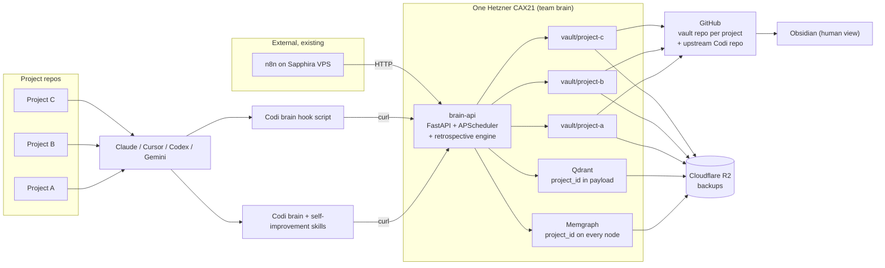

# Codi Brain — Plan (v2)

- **Date**: 2026-04-22 22:00
- **Document**: 20260422_210000_[PLAN]_codi-brain.md
- **Category**: PLAN
- **Version**: v2 — incorporates Codi's self-improvement ecosystem as a first-class Brain responsibility
- **Status**: Proposal — awaiting approval to start Phase 1
- **Consolidates**: all prior Codi Brain drafts (research, dual-tier, simple, pieces-and-attribution, audit). This is the single source of truth.

---

## Table of contents

1. Executive summary
2. The problem and the insight
3. What we learned from the reference projects
4. Attribution — what came from where
5. Design decisions and rationale
6. Architecture
7. Data model
8. HTTP API
9. Authentication model
10. Vault (Obsidian)
11. Hooks
12. Skills distributed via Codi
13. **Self-improvement ecosystem** (new central pillar)
14. Deployment via `rl3-infra-vps`
15. Backups and recovery
16. Observability
17. Scheduled tasks (APScheduler)
18. External orchestration (n8n)
19. Risks and mitigations
20. MVP plan (two phases, four weeks each)
21. Post-MVP roadmap
22. Open questions
23. Appendix

---

## 1. Executive summary

Codi Brain is a self-hosted, per-team, multi-project intelligence service for coding agents. One Hetzner VPS runs one `brain-api` container, one Memgraph, one Qdrant. Inside that service, many project brains coexist, each isolated by `project_id`. The Brain serves three roles simultaneously:

- **Memory** — it stores everything the team decides, writes, or learns. Code graph + narrative graph + git-backed Obsidian vault.
- **Search** — agents ask it for code and for past decisions through HTTP endpoints called by Codi skills.
- **Self-improvement** — it captures every user correction, preference, and usage event, aggregates across sessions and projects, and proposes concrete improvements to Codi rules and skills.

The third role is what elevates Codi Brain from "yet another RAG service" to the learning system for the entire Codi ecosystem. Every coding agent interaction feeds it; it feeds back awareness (at session start) and retrospection (weekly drafts for rule refinement).

The Brain absorbs the self-improvement machinery Codi already has (observation markers, `.codi/feedback/` storage, `codi-refine-rules`, `codi-compare-preset`, `codi contribute`, `codi skill evolve`) and fills in the twelve gaps that inventory exposed — cross-session aggregation, cross-project learning, retrospective synthesis, automated draft generation, and audit of refinement cycles.

One sentence: **Codi Brain is the memory, search, and self-improvement spine for every coding-agent interaction across a team's projects, served over HTTPS from one Coolify VPS.**

---

## 2. The problem and the insight

Every coding agent today re-derives context on every session: it greps the codebase, re-reads the same files, re-asks the same questions, re-makes the same decisions. Worse, it makes the same mistakes — the user corrects a pattern, the agent forgets next session, the correction is lost. Codi has a feedback protocol today (`[CODI-OBSERVATION: ...]` markers → `.codi/feedback/` JSON), but the data is isolated per project, per session, never analyzed at scale, and never cross-referenced to propose concrete rule changes.

The reference projects each solve one corner. `code-graph-rag` gives structural understanding of the code. `graphify` shows how to extract structure honestly with confidence labels and auto-generate retrospective reports (`GRAPH_REPORT.md`). `claude-obsidian` + Karpathy's LLM Wiki show how a persistent markdown knowledge base compounds over time and how to lint it for orphans and contradictions. `rl3-infra-vps` shows how to deploy stateful services to Coolify with backups and TLS. Codi itself has the cleanest multi-agent distribution pipeline in the ecosystem and a working observation protocol.

No one project is a brain. Combined, they imply one:

- Code lives as a graph (from `code-graph-rag`).
- Narrative lives as Notes linked to that graph.
- Humans browse through Obsidian on a git-backed vault.
- Confidence labels make honesty structural.
- **User corrections, preferences, and usage events live in the same graph, tied to the rules and skills they relate to.**
- **A retrospective engine turns accumulated signal into concrete drafts for rule and skill improvement.**
- **Awareness at session start means the agent knows what the user dislikes before it starts.**
- Codi ships the agent-side plumbing to every IDE.
- `rl3-infra-vps` hosts it.

The brain is what happens when all nine pieces are in the same service.

---

## 3. What we learned from the reference projects

### 3.1 `code-graph-rag`

Python 3.12 + uv. Memgraph + Qdrant in Docker. Tree-sitter parsers for Python, JavaScript, TypeScript, Rust, Go, Scala, Java, C++, Lua. A Pydantic-AI orchestrator generates Cypher queries from natural language. MCP stdio server exposes 14 tools. Batched Cypher writes via `UNWIND $batch AS row`. Incremental updates key off `git diff`; orphan-edge cleanup via `clean_files`. Real-time file watcher keeps the graph in sync. Multi-project already works at the graph layer — every qualified name is project-prefixed. What it doesn't have: HTTP transport, auth, multi-tenant isolation, narrative node types, audit trail, durable sessions, a human-readable view, self-improvement.

### 3.2 `graphify`

Python library + multi-platform skill. No database. Deterministic Tree-sitter extraction; parallel subagent dispatch for LLM semantic extraction. Every edge tagged `EXTRACTED | INFERRED | AMBIGUOUS` with a numeric score. Per-file SHA256 caching with frontmatter stripping. Leiden clustering with fixed seed for reproducible community IDs. `GRAPH_REPORT.md` surfaces god nodes, surprising connections, and knowledge gaps — honest auto-generated retrospective. What we take: confidence labels on every derived edge; two-layer ingest; honest report generation; the multi-platform skill abstraction; **the pattern of auto-generating a retrospective artifact (we will do the same for rules/skills usage)**.

### 3.3 `claude-obsidian`

Pure markdown + YAML + bash. Ten skills (`wiki`, `wiki-ingest`, `wiki-query`, `wiki-lint`, `save`, `autoresearch`, `canvas`, `defuddle`, `obsidian-markdown`, `obsidian-bases`). Vault organized by type, not topic. Universal frontmatter on every page. Hot-cache at `wiki/hot.md`. Append-only log with newest-first entries. Contradictions get `[!contradiction]` callouts. Delta manifest at `.raw/.manifest.json`. Multi-agent via symlinks. Auto-commit via `PostToolUse` hook. **`wiki-lint` is an automated retrospective: finds orphans, dead links, stale claims, missing pages, frontmatter gaps.** That pattern — lint-as-retrospective — is directly reusable for our rules and skills ("orphan rules with no recent triggers", "stale rules contradicted by user corrections").

### 3.4 Karpathy LLM Wiki pattern (`obsidia.md`)

The conceptual parent of claude-obsidian. Three layers: raw sources (immutable), wiki (LLM-owned), schema (`CLAUDE.md`/`AGENTS.md`). Three operations: ingest, query, lint. Two files: `index.md` and `log.md`. The memorable framing — "Obsidian is the IDE; the LLM is the programmer; the wiki is the codebase" — is exactly our human-side contract.

### 3.5 `rl3-infra-vps`

Terraform + Ansible + Python provisioner. Hetzner CAX11/CAX21. Coolify + Traefik + DNS-01 Let's Encrypt via Cloudflare. Admin on Tailscale only. `pg_dump` → `age` → `rclone` → Cloudflare R2 daily. TLS cert persistence via `acme.json`. Generic env_builder service loop driven by `client.yaml`. No per-container resource limits. Observability: Docker stdout + optional Sentry. n8n already runs on Sapphira's VPS for workflow orchestration.

### 3.6 Codi — general patterns

Three-layer pipeline: `src/templates/` → `.codi/` → `.claude/` + `.cursor/` + `.codex/`. Rules, skills, agents, and presets distributed via the same pipeline. Hook probe established the cross-agent common subset: `SessionStart`, `UserPromptSubmit`, `PreToolUse(Bash)`, `PostToolUse(Bash)`, `Stop`. Codex requires `features.codex_hooks=true`; `apply_patch` bypasses tool hooks entirely; no `SessionEnd`.

### 3.7 Codi — existing self-improvement ecosystem (to be absorbed)

This is the inventory the Brain redesign must respect. Everything below exists today and already works manually; the Brain upgrades it from manual per-session per-project loops into an automated cross-session cross-project system.

**What works today:**

- **Observation marker protocol.** `[CODI-OBSERVATION: artifact | category | text]` emitted inline in agent responses. Seven categories: `trigger-miss`, `trigger-false`, `missing-step`, `outdated-rule`, `missing-example`, `user-correction`, `wrong-output`. Defined in `.codi/rules/codi-improvement-dev.md:54-70`.
- **Stop hook extraction.** `.codi/hooks/codi-skill-observer.cjs` scans the session transcript, extracts markers, writes one JSON file per observation to `.codi/feedback/{ISO}-{artifact}-{uuid}.json`. Severity mapped from category: `user-correction`→high, `trigger-miss`/`trigger-false`→medium, others→low.
- **Feedback schema.** Two types defined in `src/schemas/feedback.ts`: `RuleObservationSchema` (rule feedback) and `FeedbackEntrySchema` (skill execution outcome).
- **`codi-rule-feedback` skill.** Auto-invoked, emits markers when a pattern appears 2+ times without a rule covering it, or when a user correction contradicts a loaded rule.
- **`codi-refine-rules` skill.** Two modes. REVIEW reads `.codi/feedback/` and groups observations by artifact + severity. REFINE walks the user through one-at-a-time approval, edits `.codi/rules/<name>.md`, runs `codi generate`.
- **`codi-compare-preset` skill.** Clones upstream Codi, diffs local artifacts, reports your improvements + upstream updates + conflicts. Read-only.
- **`codi-artifact-contributor` skill.** Multi-select artifacts, validate, open PR to upstream via `gh`, or export as ZIP.
- **`codi contribute` CLI.** Interactive wizard wrapping the artifact contributor.
- **`codi skill evolve` CLI.** Stub-level: generates a markdown prompt from feedback for the agent to review. Requires manual approval and editing.
- **`codi-skill-tracker.cjs` hook.** Writes `.codi/.session/active-skills.json` when skills load into context.
- **`codi-session-log` skill.** Manual handoff/resume. Writes to `docs/sessions/`.

**Twelve gaps (honest inventory):**

1. No cross-session aggregation — observations in session 1 and session 3 are independent, not cumulative evidence.
2. No cross-project learning — same pattern in 5 projects looks like 5 instances, not 1 systemic opportunity.
3. No automated rule synthesis — Codi refines existing rules, never drafts new ones from scratch based on patterns.
4. `codi skill evolve` is stub-level — generates a prompt, not a diff.
5. Feedback pruning is unwired — constants exist (`MAX_FEEDBACK_ENTRIES=1000`, `MAX_FEEDBACK_AGE_DAYS=90`), no code calls them.
6. Skill execution feedback collection is incomplete — schema exists, no writer wired.
7. No A/B testing or staged rollout — every rule change is instant-all-agents.
8. No retrospective synthesis — no scheduled digest; must run `/codi-refine-rules` manually.
9. No memory across refinement cycles — rule flipped by feedback, then flipped back by contradicting feedback, with no audit trail.
10. Preset compare is read-only — no staging, no draft, no PR linkage.
11. No structured reasoning in observations — no evidence count, no confidence level, no related-observation links.
12. Session transcripts are not archived or searchable — `docs/sessions/` files are manual handoff notes, not indexed.

Everything in §13 (Self-improvement ecosystem) is designed to fix gaps 1–12 while preserving the parts that work.

---

## 4. Attribution — what came from where

| Piece | From | How it lives in Codi Brain |
|---|---|---|
| Tree-sitter parsing | `code-graph-rag` | **Absorbed** as `codi-brain/src/code_graph/` (Week 0 of Phase 1). The upstream repo is archived. See Phase 1 spec §12.0. |
| Memgraph graph DB | `code-graph-rag` | Extended with `Note`, `Correction`, `Preference`, `UsageEvent`, `Artifact`, `RuleDraft`, `SkillDraft`, `Retrospective` families. |
| Qdrant vector store | `code-graph-rag` | Shared for code docstrings, note bodies, and correction texts. |
| Incremental git-diff ingest | `code-graph-rag` | Wrapped by `POST /ingest/repo`. |
| Real-time file watcher | `code-graph-rag` | Optional background task. |
| Batched Cypher writes | `code-graph-rag` | Direct reuse. |
| Multi-project in one graph | `code-graph-rag` | **Foundation of the whole design.** Every node has `project_id`. |
| Pydantic-AI orchestrator | `code-graph-rag` | Used for note summarization and retrospective synthesis. LLM provider: **Google Gemini**. Embedding provider: **OpenAI**. See §5.11. |
| Confidence labels on edges | graphify | Mandatory on every derived edge. |
| Deterministic + optional semantic ingest | graphify | Structural always; semantic opt-in. |
| Content-hash cache | graphify | Via `code-graph-rag`. |
| **Auto-generated retrospective report** | graphify (`GRAPH_REPORT.md`) | **Daily `Retrospective` note + draft proposals — core of the self-improvement engine.** |
| Multi-platform skill abstraction | graphify | Via Codi's pipeline. |
| Obsidian vault as human UI | claude-obsidian + Karpathy | One repo per project. |
| Three-layer vault structure | claude-obsidian + Karpathy | `_raw/` + `wiki/` + Codi rules. |
| Hot-cache singleton | claude-obsidian | `wiki/hot.md`. |
| Newest-first append-only log | claude-obsidian | `wiki/log.md`. |
| Master index | claude-obsidian | `wiki/index.md`, auto-rebuilt. |
| Frontmatter conventions | claude-obsidian | `kind`, `tags`, `author`, `confidence`, `created`. |
| **`wiki-lint` retrospective pattern** | claude-obsidian | **Applied to rules/skills: orphan rules, stale rules, rules contradicted by corrections.** |
| Contradiction callouts | claude-obsidian | Pattern preserved; automation deferred. |
| Wikilinks as Obsidian graph edges | claude-obsidian | Every graph edge mirrored as `[[link]]` in the note body. |
| Ingest / Query / Lint verbs | Karpathy LLM Wiki | Three endpoint families. |
| Three-layer Codi pipeline | Codi | Brain becomes a first-class artifact type. |
| Cross-agent skill distribution | Codi | Seven brain skills, one rule, one hook script. |
| Cross-agent common-subset hooks | Codi hook probe | `SessionStart`, `UserPromptSubmit`, `Stop`. |
| **`[CODI-OBSERVATION: ...]` protocol** | Codi (`.codi/rules/codi-improvement-dev.md`) | **Preserved verbatim; marker still emitted; Stop hook now posts to Brain.** |
| **Observation categories** | Codi | Preserved: trigger-miss, trigger-false, missing-step, outdated-rule, missing-example, user-correction, wrong-output. |
| **Observation severity mapping** | Codi (`codi-skill-observer.cjs`) | Preserved. |
| **`.codi/feedback/` local JSON** | Codi | **Kept as offline buffer; synced to Brain on connect; Brain is source of truth.** |
| **`codi-rule-feedback` skill** | Codi | Unchanged; emits markers. |
| **`codi-refine-rules` skill** | Codi | **Rewired to query Brain** instead of local files; cross-session + cross-project aware. |
| **`codi-compare-preset` skill** | Codi | Extended with Brain-sourced usage evidence. |
| **`codi-artifact-contributor` / `codi contribute`** | Codi | Extended to attach Brain-sourced evidence to PRs. |
| **`codi skill evolve`** | Codi | **Upgraded from stub to data-driven**: Brain generates diffs based on aggregated feedback. |
| **`codi-skill-tracker.cjs`** | Codi | Redirected: posts skill-load events to Brain as `UsageEvent` nodes. |
| `codi-session-log` skill | Codi | Complemented by Brain session records; manual log still works offline. |
| Coolify + Traefik + DNS-01 TLS | `rl3-infra-vps` | Existing path. |
| `pg_dump` + age + rclone backups | `rl3-infra-vps` | Extended to Memgraph dump + Qdrant snapshot. |
| Tailscale-only admin ingress | `rl3-infra-vps` | Admin endpoints on Tailscale. |
| Env_builder service loop | `rl3-infra-vps` | One new `brain_api` builder. |
| n8n workflow engine | `rl3-infra-vps` (via Sapphira) | External orchestrator; calls brain HTTP API. |

---

## 5. Design decisions and rationale

Ten decisions set the shape of the system. Each was debated; each is now locked.

### 5.1 Skills + HTTP, not MCP

Skills are markdown files that tell the agent to call `curl` against the brain. Any agent that runs Bash reaches the brain identically. No MCP server to build, version, or debug.

### 5.2 Obsidian vault always on

Not optional. Every brain write updates Memgraph **and** the vault in the same transaction. The vault is a git repo per project, auto-committed and pushed.

### 5.3 One VPS, multi-project brains inside

One Hetzner CAX21 hosts the brain for a team or a solo developer with several projects. Inside: one Memgraph, one Qdrant, one `brain-api`. Projects isolated by `project_id`.

### 5.4 Per-user per-project API keys

Each key is a tuple of `(user, project)`. Every write tags `author_id`. Every query filters by `project_id`.

### 5.5 Project-wide note visibility

No private notes at v1. Corrections and preferences can opt-in to user-private visibility (§13.11).

### 5.6 No workflow engine inside brain-api

APScheduler handles scheduled tasks in-process. External n8n handles multi-step event-driven flows.

### 5.7 REST only — no GraphQL in v1

Obsidian is the UI. No web dashboard on the v1 roadmap. Skip.

### 5.8 CAX21 default VPS size

4 vCPU / 8 GB RAM. Memgraph is in-memory; underprovisioning causes crashes.

### 5.9 Service-only deployment (no local mode)

One stack, one operational pattern. Solo developers deploy the same Coolify app.

### 5.10 Self-improvement is a first-class Brain responsibility

The Brain is not a neutral store — it is the learning system for the project's AI configuration. Every user correction, preference, and usage event is a first-class node. Scheduled retrospectives turn accumulated signal into concrete rule and skill drafts. The existing Codi self-improvement artifacts (observation markers, `.codi/feedback/`, `codi-refine-rules`, etc.) become **clients of the Brain**, not parallel infrastructure. This decision unifies Codi's learning loop into one place with cross-session, cross-project reach.

### 5.11 LLM is Gemini 3 Flash, embeddings are OpenAI

The Brain uses two providers, one role each, and one model for all LLM work:

- **LLM (generation, summarization, retrospective draft synthesis): Google Gemini.** Default model `gemini-3-flash` for every LLM task — routine enrichment (note summaries, hot-context TL;DR, cluster naming) and retrospective draft generation (proposed rule text + rationale). One model, one cost profile. Env-configurable via `LLM_MODEL`.
- **Embeddings: OpenAI.** Default model `text-embedding-3-small` (1536 dims) for code docstrings, note bodies, and correction texts. Stored in Qdrant. `text-embedding-3-large` (3072 dims) is an env-configurable upgrade if semantic recall quality becomes a limiting factor.

Rationale: Gemini 3 Flash is the cost-leader for generation at current quality and is capable enough on its own — no tiered Flash/Pro split needed. OpenAI's embedding models remain the strongest general-purpose baseline and have the best ecosystem support in the absorbed `code_graph` embedding layer. Two providers double the API-key surface but fail independently — a Gemini outage does not break vector search, an OpenAI outage does not break retrospective generation.

Env vars:
- `GEMINI_API_KEY` (required) — Google Generative AI key.
- `OPENAI_API_KEY` (required) — OpenAI key.
- `LLM_MODEL` — default `gemini-3-flash` (used for every LLM task).
- `EMBEDDING_MODEL` — default `text-embedding-3-small`.

### 5.12 Codi and Codi Brain are separate repositories coupled by an OpenAPI contract

`codi` (TypeScript CLI + templates) and `codi-brain` (Python service) live in **separate GitHub repositories**. Codi ships via npm and is installed per developer laptop; Codi Brain ships as a Docker image and deploys per team VPS. They are peer products with different release cadences, different toolchains, and different distribution channels.

The coupling between them is managed explicitly:

- **`codi-brain/openapi.yaml`** is the contract, regenerated from FastAPI routes on every release. Drift between routes and spec fails CI.
- **Every brain-skill SKILL.md in `codi/src/templates/skills/brain-*/`** declares `requires_brain: ">=X.Y.Z"` in its frontmatter. Semver governs compatibility.
- **`codi brain doctor` CLI subcommand** (part of the `codi` CLI) hits `GET /version` on a deployed Brain, reads `requires_brain` from every installed brain-skill in the consumer project, and reports mismatches. Runs automatically after `codi add brain` and `codi update`.

Rationale: Codi Brain is a **peer product** to Codi, not a component. It's independently deployable and end-user-facing. Splitting follows the industry pattern used by Temporal (core + SDKs), Stripe (API + client libs), and HashiCorp Terraform (core + providers). It matches single-language repos to single toolchains, keeps contributor mental models clean, and makes the cross-product contract a first-class artifact rather than an implicit source-level coupling.

(The earlier absorption of `code-graph-rag` into `codi-brain` followed the *opposite* logic — `code-graph-rag` is a **library**, not a peer product. Libraries get absorbed; peer products stay separate. That's the nuance.)

Details: see Phase 1 spec §5.9 for the full contract mechanics.

---

## 6. Architecture

### 6.1 High-level diagram



### 6.2 Services on the VPS

- **`brain-api`** — FastAPI app. Python 3.12. Absorbs `code-graph-rag` as the `src/code_graph/` module of the `codi-brain` repo (one image, one release cycle; see Phase 1 spec §12.0). Exposes REST endpoints. Runs APScheduler in-process for cron (reindex, lint, retrospective). Handles webhooks. Single writer to Memgraph, Qdrant, and vault directories. Houses the retrospective engine. Calls **Gemini** for every LLM task (summarization, hot-context TL;DR, retrospective draft synthesis) and **OpenAI** for every embedding (code docstrings, note bodies, corrections). See §5.11.
- **Memgraph** — one instance, all projects, every node `project_id`.
- **Qdrant** — one instance, collections per kind (`code_embeddings`, `note_embeddings`, `correction_embeddings`), `project_id` in payload.
- **Vault worktrees** — one directory per project, one GitHub remote per project. `brain-api` is the only writer.

### 6.3 Data flow — write path

1. Agent runs skill → `curl` against `brain-api`.
2. Middleware loads `user_id`, `project_id` from bearer key.
3. Handler writes node to Memgraph with `project_id`.
4. Handler embeds body into Qdrant with `project_id` in payload.
5. Handler renders markdown to `/data/brain/vaults/<project>/<folder>/<title>.md`.
6. Handler rebuilds per-project `index.md`.
7. Handler commits and pushes to the project's GitHub vault remote.
8. Response returns `{ id, url, vault_path }`.

### 6.4 Data flow — self-improvement path

1. Agent emits `[CODI-OBSERVATION: ...]` marker **or** hook detects correction from transcript.
2. Stop hook posts `Correction` node via `POST /corrections` — includes target artifact, category, text, session_id, transcript excerpt.
3. Brain writes Correction + `CORRECTS` edge to the target Artifact (if known), embeds the correction text into Qdrant.
4. Scheduled retrospective (daily 03:00) clusters new Corrections, identifies patterns, generates `RuleDraft` / `SkillDraft` proposals as notes in the vault under `drafts/`.
5. User runs `/codi-refine-rules` → skill calls `GET /drafts/pending`, presents to user, collects approvals.
6. On approval, skill writes changes to `.codi/rules/` or `.codi/skills/`, runs `codi generate`, reports back to Brain via `POST /drafts/{id}/resolve`.
7. Brain records outcome and watches for whether the correction stops appearing — closing the loop.

### 6.5 Multi-project isolation pattern

Unchanged from prior. Every Memgraph node carries `project_id`; composite unique constraints prevent cross-project collisions. Every Qdrant search filters by `project_id`. Every vault directory is distinct. Rate limits per `(user, project)`.

---

## 7. Data model

### 7.1 Code nodes (inherited from `code-graph-rag`)

`Project`, `Folder`, `File`, `Package`, `Module`, `Class`, `Function`, `Method`, `Interface`, `Type`, `Enum`, `Union`, `ExternalPackage`.

Every code node carries `project_id`. Composite unique constraints: `(project_id, qualified_name)` and `(project_id, path)`. Every derived edge carries `confidence`.

### 7.2 Narrative nodes

**Note** — unchanged from v1.

| Field | Type | Purpose |
|---|---|---|
| `id` | UUID | Primary key |
| `project_id` | UUID | Isolation |
| `kind` | enum | `decision \| doc \| source \| log \| hot \| question` |
| `title` | string | Vault filename |
| `body` | string | Markdown with `[[wikilinks]]` |
| `tags` | list[string] | Indexed |
| `author_id` | UUID | Server-set |
| `session_id` | UUID | Session grouping |
| `confidence` | enum | `EXTRACTED \| INFERRED \| AMBIGUOUS` |
| `created_at`, `updated_at` | timestamp | |

### 7.3 Identity nodes (unchanged)

`User`, `UserKey`, `Project`.

### 7.4 Self-improvement nodes (new in v2)

**Correction** — a user correction event. One row per observed correction.

| Field | Type | Purpose |
|---|---|---|
| `id` | UUID | |
| `project_id` | UUID | Isolation |
| `target_artifact_id` | UUID nullable | FK to Artifact (rule/skill/agent) if known |
| `target_artifact_name` | string nullable | Free-text target when node unknown |
| `category` | enum | `trigger-miss \| trigger-false \| missing-step \| outdated-rule \| missing-example \| user-correction \| wrong-output` (same as Codi today) |
| `severity` | enum | `high \| medium \| low` |
| `text` | string | <= 200 chars, extracted from marker or transcript |
| `evidence` | list[string] | Transcript excerpts supporting the correction |
| `source` | enum | `observation-marker \| transcript-analysis \| explicit-skill` |
| `author_id` | UUID | Who corrected |
| `session_id` | UUID | Where it happened |
| `confidence` | enum + score | Inferred from source |
| `resolved` | bool | Set true when a RuleDraft addressing it is approved |
| `resolved_by_draft_id` | UUID nullable | FK to RuleDraft that resolved it |
| `created_at` | timestamp | |

**Preference** — persistent user statement about what they want or don't want.

| Field | Type | Purpose |
|---|---|---|
| `id` | UUID | |
| `project_id` | UUID | Isolation |
| `polarity` | enum | `prefer \| avoid` |
| `statement` | string | "do not write tests before implementation" |
| `target_artifact_id` | UUID nullable | If tied to a specific rule/skill |
| `scope` | enum | `project \| user-private` |
| `author_id` | UUID | |
| `visibility` | enum | `project \| user-private` |
| `established_in_session` | UUID | |
| `ttl` | timestamp nullable | Null = never expires |
| `active` | bool | User can turn off |
| `created_at`, `updated_at` | timestamp | |

**UsageEvent** — one row per meaningful skill activation, rule application, or hook fire.

| Field | Type | Purpose |
|---|---|---|
| `id` | UUID | |
| `project_id` | UUID | |
| `event_type` | enum | `skill_loaded \| skill_triggered \| skill_rejected \| rule_applied \| rule_violated \| hook_fired \| tool_called` |
| `artifact_id` | UUID | FK to Artifact |
| `artifact_name` | string | Redundant for easy search |
| `session_id` | UUID | |
| `author_id` | UUID | |
| `agent` | string | `claude-code \| codex \| cursor \| gemini` |
| `outcome` | enum nullable | `success \| partial \| failure \| rejected` |
| `details` | json | Flexible payload (correction text, tool name, etc.) |
| `created_at` | timestamp | |

**Artifact** — a Codi rule, skill, or agent known to the brain. Synced via `POST /artifacts/sync`.

| Field | Type | Purpose |
|---|---|---|
| `id` | UUID | |
| `project_id` | UUID | Which project has this installed |
| `artifact_type` | enum | `rule \| skill \| agent \| hook \| command` |
| `name` | string | `codi-tdd`, `codi-refine-rules`, etc. |
| `version` | string | Semver |
| `source` | enum | `upstream \| user \| local-override` |
| `managed_by` | enum | `codi \| user` |
| `triggers` | list[string] | For skills, extracted from description |
| `path` | string | Where the file lives locally |
| `hash` | string | Content hash for change detection |
| `last_synced_at` | timestamp | |

**RuleDraft** — proposed change to a Rule, backed by evidence.

| Field | Type | Purpose |
|---|---|---|
| `id` | UUID | |
| `project_id` | UUID | |
| `target_artifact_id` | UUID | FK to Artifact (the rule) |
| `draft_kind` | enum | `amend \| new \| deprecate` |
| `proposed_text` | string | Full proposed rule content (markdown) |
| `diff_summary` | string | Human-readable summary of the change |
| `rationale` | string | Why this change, tied to evidence |
| `evidence_correction_ids` | list[UUID] | Corrections supporting this draft |
| `evidence_usage_event_ids` | list[UUID] | Usage events supporting this draft |
| `confidence_score` | float | 0.0–1.0 — the retrospective engine's confidence |
| `status` | enum | `pending \| approved \| rejected \| applied` |
| `reviewed_by` | UUID nullable | User who reviewed |
| `reviewed_at` | timestamp nullable | |
| `created_at` | timestamp | |

**SkillDraft** — identical shape, target is a skill instead of a rule.

**Retrospective** — a periodic analysis summary.

| Field | Type | Purpose |
|---|---|---|
| `id` | UUID | |
| `project_id` | UUID | |
| `period_start`, `period_end` | timestamp | Analysis window |
| `summary` | string | Markdown summary |
| `top_patterns` | json | Clusters identified |
| `drafts_generated_ids` | list[UUID] | RuleDraft / SkillDraft IDs |
| `stats` | json | Correction count, usage counts, outcome ratios |
| `created_at` | timestamp | |

### 7.5 Edges (expanded)

Narrative (from v1): `REFERENCES`, `RELATED_TO`, `SUPERSEDES`, `AUTHORED`, `HAS_KEY`, `KEY_FOR_PROJECT`.

Self-improvement (new):

- `CORRECTS` — `Correction → Artifact` (rule/skill being corrected)
- `EXPECTS` — `Preference → Artifact` (preference tied to a rule/skill)
- `INVALIDATES` — `Correction → Artifact` (stronger than corrects; the rule contradicts the user's preference)
- `TRIGGERED_IN` — `UsageEvent → Session` (where the event happened)
- `ABOUT` — `UsageEvent → Artifact` (which artifact the event concerns)
- `PROPOSES` — `RuleDraft \| SkillDraft → Artifact` (the draft proposes to change this artifact)
- `EVIDENCE_FROM` — `RuleDraft \| SkillDraft → Correction \| UsageEvent` (evidence supporting the draft)
- `APPLIED_AS` — `RuleDraft → Artifact` (after approval, the draft became this new version of the artifact)
- `DISCUSSED_IN` — `Preference → Session` (where the preference was established)
- `RESOLVES` — `RuleDraft → Correction` (this draft closes these corrections)

All edges carry `confidence`.

### 7.6 Wikilink mirror rule (extended)

Every `REFERENCES`, `RELATED_TO`, `SUPERSEDES`, `CORRECTS`, `PROPOSES`, `EVIDENCE_FROM`, `RESOLVES` edge has a `[[link]]` in the corresponding note body. Obsidian's graph view reflects the full brain graph — code, narrative, and self-improvement — with no plugin.

---

## 8. HTTP API

All endpoints require a bearer token. Token identifies `(user, project)`.

### 8.1 Endpoints — memory and search (v1)

```
POST   /notes                       { kind, title, body, tags?, links? }
GET    /notes/{id}
GET    /notes/search                ? q, kind, tag, author, limit, before, after
GET    /hot
PUT    /hot                         { body }
POST   /log                         { session_id, role, text }
GET    /code/search                 ? q, limit
GET    /code/snippet                ? qualified_name
POST   /ingest/repo                 { path?, force? }
POST   /hooks/github                (webhook payload)
GET    /healthz
GET    /readyz
```

### 8.2 Endpoints — self-improvement (new in v2)

```
POST   /corrections                 { target_artifact_name, category, text,
                                      evidence[], session_id, source }
                                    Idempotent-ish: dedupes on (project, author, text_hash, 24h window)
GET    /corrections                 ? artifact, category, since, resolved, limit
POST   /preferences                 { polarity, statement, target_artifact_name?,
                                      scope, established_in_session, ttl? }
GET    /preferences                 ? active, scope, author, limit
PATCH  /preferences/{id}            { active?, statement?, ttl? }

POST   /usage                       { event_type, artifact_name, session_id,
                                      agent, outcome?, details? }
                                    Batched: accepts an array of events
GET    /usage                       ? artifact, event_type, since, limit

POST   /artifacts/sync              { artifacts: [...] }
                                    Called by `codi generate` post-hook to sync installed inventory
GET    /artifacts                   ? type, managed_by, limit

POST   /drafts/retrospective        (admin or scheduler-triggered)
                                    Runs a retrospective synchronously over a window
GET    /drafts/pending              ? artifact_type, limit
                                    Returns RuleDraft + SkillDraft with status=pending
GET    /drafts/{id}
POST   /drafts/{id}/approve         { reviewer_id }
POST   /drafts/{id}/reject          { reviewer_id, reason }
POST   /drafts/{id}/apply           { applied_path }
                                    Called by /codi-refine-rules after writing the file

GET    /awareness                   Returns current corrections + active preferences
                                    in a compact block suitable for prepending to session context
GET    /retrospective/latest        Most recent Retrospective note
GET    /retrospective               ? period_start, period_end, limit
```

### 8.3 Endpoints — admin (Tailscale-only)

```
POST   /admin/projects              { name, vault_repo }
POST   /admin/users                 { email, name }
POST   /admin/keys                  { user_id, project_id }
DELETE /admin/keys/{id}
GET    /admin/projects
GET    /admin/users
GET    /admin/stats                 (global counts, retrospective schedule status)
```

### 8.4 Request/response examples

**Correction:**

```http
POST /corrections HTTP/1.1
Authorization: Bearer ak_a1b2c3d4e5f6g7h8
Content-Type: application/json

{
  "target_artifact_name": "codi-tdd",
  "category": "user-correction",
  "text": "user rejects TDD in this project, wants implementation-first",
  "evidence": [
    "User said: 'no, don't write tests before the implementation, I want to ship fast'",
    "Agent had started `tests/test_new_feature.py`"
  ],
  "session_id": "c1a2b3c4-d5e6-7890-abcd-ef1234567890",
  "source": "observation-marker"
}
```

**Awareness:**

```http
GET /awareness HTTP/1.1
Authorization: Bearer ak_a1b2c3d4e5f6g7h8
```

```json
{
  "recent_corrections": [
    {
      "artifact": "codi-tdd",
      "text": "user rejects TDD in this project, wants implementation-first",
      "count_last_7d": 3,
      "severity": "high"
    }
  ],
  "active_preferences": [
    {
      "polarity": "avoid",
      "statement": "do not write tests before implementation in project A",
      "established": "2026-04-22"
    }
  ],
  "hot": "..."
}
```

### 8.5 Auth middleware, rate limiting, error model

Unchanged from v1.

---

## 9. Authentication model

Unchanged from v1. Per-user per-project API keys. Argon2id hashing. Tailscale-bound admin. `codi brain admin` CLI wraps admin endpoints.

---

## 10. Vault (Obsidian)

### 10.1 Per-project structure (expanded in v2)

```
/data/brain/vaults/myproject/
├── hot.md                    # singleton; kind=hot
├── log.md                    # append-only, newest-first
├── index.md                  # auto-rebuilt
├── decisions/
├── docs/
├── sources/
├── sessions/
├── questions/
├── _raw/                     # immutable ingested sources
├── _meta/
│   ├── lint-YYYY-MM-DD.md
│   └── retrospectives/
│       └── retrospective-YYYY-MM-DD.md
├── drafts/                   # RuleDraft and SkillDraft markdown renderings
│   ├── rules/
│   │   └── rule-draft-<artifact>-<id>.md
│   └── skills/
│       └── skill-draft-<artifact>-<id>.md
├── corrections/              # human-readable Correction views (optional)
└── .obsidian/
```

### 10.2 Frontmatter schema — draft notes

```yaml
---
id: d-9a8b7c6d5e4f3g2h
kind: rule-draft
target: codi-tdd
draft_kind: amend
status: pending
confidence: 0.82
evidence_count: 3
author: brain-retrospective-engine
created: 2026-04-24T03:00:00Z
---
```

Body includes diff summary, rationale, and wikilinks to the Corrections that triggered the draft, so Obsidian's graph view shows the evidence chain.

### 10.3 Wikilinks mirror — self-improvement

When the retrospective engine creates a `RuleDraft`, the draft's body includes:

- `[[codi-tdd]]` — the target Artifact (renders as a link back to the artifact's brain page if one exists, else a stub).
- `[[Correction: user rejects TDD 2026-04-22 alice]]` — one link per evidence Correction, so the Obsidian graph view shows the evidence cluster.

This turns the evidence chain into a graph-viewable structure in Obsidian with zero extra tooling.

---

## 11. Hooks

Same cross-agent common subset: `SessionStart`, `UserPromptSubmit`, `Stop`. One shell script shipped by Codi. Reads `$CODI_BRAIN_HOST` and `$CODI_BRAIN_TOKEN` from env.

### 11.1 SessionStart — awareness pull

```bash
session_id=$(uuidgen)
echo "$session_id" > /tmp/codi-brain-session-$$.id

# Pull awareness: hot context + recent corrections + active preferences
curl -sS -H "Authorization: Bearer $CODI_BRAIN_TOKEN" \
  "$CODI_BRAIN_HOST/awareness" | jq -r '
    "## Hot context\n\(.hot)\n\n" +
    if (.recent_corrections | length) > 0 then
      "## Recent corrections (last 7 days)\n" +
      (.recent_corrections | map("- \(.artifact): \(.text) (×\(.count_last_7d), \(.severity))") | join("\n")) +
      "\n\n"
    else "" end +
    if (.active_preferences | length) > 0 then
      "## Active preferences\n" +
      (.active_preferences | map("- \(if .polarity == "avoid" then "DO NOT: " else "PREFER: " end)\(.statement)") | join("\n"))
    else "" end
  '
```

### 11.2 UserPromptSubmit — log + cheap correction detection

```bash
session_id=$(cat /tmp/codi-brain-session-$$.id 2>/dev/null || echo unknown)
user_text=$(jq -r '.prompt // empty')
[ -z "$user_text" ] && exit 0

# 1. Log the prompt as a session event (optional, on by default in v2)
curl -sS -H "Authorization: Bearer $CODI_BRAIN_TOKEN" \
  -X POST "$CODI_BRAIN_HOST/log" \
  -d "{\"session_id\":\"$session_id\",\"role\":\"user\",\"text\":$(jq -R . <<< "$user_text")}" &

# 2. Cheap correction detection (regex on obvious correction phrases)
if echo "$user_text" | grep -qiE '^(no[, ]|stop|don'\''t|do not|i told you|i already said|please don'\''t)'; then
  curl -sS -H "Authorization: Bearer $CODI_BRAIN_TOKEN" \
    -X POST "$CODI_BRAIN_HOST/corrections" \
    -d "{\"category\":\"user-correction\",\"text\":$(jq -R . <<< "$user_text" | head -c 200),\"session_id\":\"$session_id\",\"source\":\"transcript-analysis\",\"evidence\":[$(jq -R . <<< "$user_text")]}" &
fi

wait
```

### 11.3 Stop — flush log, extract observation markers, refresh hot

```bash
session_id=$(cat /tmp/codi-brain-session-$$.id 2>/dev/null || echo unknown)
transcript_path=$(jq -r '.transcript_path // empty')
last_msg=$(jq -r '.last_assistant_message // empty')

# 1. Log last assistant message
[ -n "$last_msg" ] && curl -sS -H "Authorization: Bearer $CODI_BRAIN_TOKEN" \
  -X POST "$CODI_BRAIN_HOST/log" \
  -d "{\"session_id\":\"$session_id\",\"role\":\"assistant\",\"text\":$(jq -R . <<< "$last_msg")}" &

# 2. Scan the full transcript for [CODI-OBSERVATION: ...] markers and POST each as a Correction
if [ -n "$transcript_path" ] && [ -f "$transcript_path" ]; then
  node "$CODI_HOME/hooks/extract-observations.cjs" "$transcript_path" "$session_id" "$CODI_BRAIN_HOST" "$CODI_BRAIN_TOKEN"
fi

# 3. Send usage events collected during the session (from active-skills.json + tool uses)
node "$CODI_HOME/hooks/flush-usage-events.cjs" "$session_id" "$CODI_BRAIN_HOST" "$CODI_BRAIN_TOKEN"

# 4. Refresh hot context if agent produced a TL;DR
if [ -f /tmp/codi-brain-hot-refresh-$$.md ]; then
  body=$(cat /tmp/codi-brain-hot-refresh-$$.md)
  curl -sS -H "Authorization: Bearer $CODI_BRAIN_TOKEN" \
    -X PUT "$CODI_BRAIN_HOST/hot" \
    -d "{\"body\":$(jq -R . <<< "$body")}"
fi

wait
```

The existing Codi Stop hook (`codi-skill-observer.cjs`) is rewired: instead of writing JSON to `.codi/feedback/`, it calls `POST /corrections` on the Brain. It keeps writing a local mirror to `.codi/feedback/` as an offline buffer in case the Brain is unreachable; a tiny daemon flushes the buffer on reconnect.

### 11.4 Why only three — and how we still capture rich signal

Per the Codi probe: `PreToolUse` / `PostToolUse` fire only on `Bash` in Codex, never on `apply_patch`, and `SessionEnd` is Claude-only. So the three hooks above are the cross-agent guaranteed surface.

Within that constraint, the `Stop` hook is where most signal is captured. It has access to the full transcript at `transcript_path`. The `extract-observations.cjs` helper parses the transcript for `[CODI-OBSERVATION: ...]` markers (reusing Codi's existing regex) and for tool-use events (from Claude's JSONL, which is available on disk). Codex-side events are less rich but the marker protocol still works.

---

## 12. Skills distributed via Codi

Eight markdown skills + one rule + one hook script (one Bash + two helper `.cjs` scripts).

### 12.1 Core memory skills (v1, unchanged)

- **`brain-query`** — search code + notes.
- **`brain-save`** — create Notes (decision, doc, source, question).
- **`brain-hot`** — read/update hot context.
- **`brain-log`** — manual log append.
- **`brain-ingest`** — trigger reindex.

### 12.2 Self-improvement skills (v2, new; some are rewires of existing Codi skills)

- **`brain-correct`** (rewired from `codi-rule-feedback`) — auto-invoked when the agent notices a gap, outdated guidance, user correction, or missing example. Emits `[CODI-OBSERVATION: ...]` (unchanged protocol) AND calls `POST /corrections` directly so the observation is captured even if the Stop hook fails.
- **`brain-refine`** (rewired from `codi-refine-rules`) — queries the Brain for pending drafts, presents them to the user, collects approvals, writes approved drafts to `.codi/rules/` or `.codi/skills/`, runs `codi generate`, reports outcome back to Brain via `POST /drafts/{id}/apply`.
- **`brain-remember`** (new) — captures user preferences on explicit statement: "always X", "never Y", "I prefer Z". Calls `POST /preferences`.
- **`brain-compare`** (extended from `codi-compare-preset`) — diff local vs upstream, augmented with Brain usage evidence: "this local rule differs from upstream and has 5 supporting corrections in Brain — strong contribution candidate."
- **`brain-contribute`** (extended from `codi-artifact-contributor`) — attaches Brain-sourced evidence to PRs automatically: the PR description includes correction counts, usage statistics, and retrospective excerpts.

### 12.3 Rule: `brain-usage.md` (expanded in v2)

Five directives:

1. Ask the brain before grepping.
2. Save decisions as you make them.
3. Link notes to code.
4. **When the user corrects you, emit `[CODI-OBSERVATION: ...]` with the correct category.**
5. **When the user states a preference ("I always want X", "I never want Y"), invoke `brain-remember` to persist it.**

### 12.4 Hook script (expanded in v2)

One Bash script + two Node helpers:

- `src/templates/hooks/brain-hooks.sh` — the SessionStart / UserPromptSubmit / Stop entrypoint.
- `src/templates/hooks/extract-observations.cjs` — rewrite of the existing `codi-skill-observer.cjs`; scans transcript for `[CODI-OBSERVATION: ...]`, posts to Brain, falls back to local `.codi/feedback/` if Brain is unreachable.
- `src/templates/hooks/flush-usage-events.cjs` — reads `.codi/.session/active-skills.json` (from existing `codi-skill-tracker.cjs`) and the session transcript, emits `UsageEvent`s via `POST /usage`.

The two existing Codi hooks (`codi-skill-observer.cjs`, `codi-skill-tracker.cjs`) are superseded by these helpers; they are replaced, not removed until the Brain is deployed everywhere.

---

## 13. Self-improvement ecosystem

This is the central new capability in v2. It turns the Brain from a passive store into a system that learns from every agent session and proposes concrete improvements to the project's AI configuration.

### 13.1 What Codi has today (summary)

Fully detailed in §3.7. In one paragraph: Codi has a working observation-marker protocol (`[CODI-OBSERVATION: artifact | category | text]`), a Stop hook that extracts markers and writes JSON to `.codi/feedback/`, four self-improvement skills (`codi-rule-feedback` auto-emits, `codi-refine-rules` reviews, `codi-compare-preset` diffs, `codi-artifact-contributor` PRs), and a `codi contribute` CLI. Everything is per-session per-project, manual-aggregation, with twelve documented gaps. The Brain absorbs the protocol, storage, and skills into one place and closes the gaps.

### 13.2 What the Brain adds

For each gap named in §3.7, the Brain's solution:

| Gap | Brain's solution |
|---|---|
| No cross-session aggregation | Corrections persisted in Memgraph with `(project_id, target_artifact, author)` index. Retrospective engine clusters across all sessions. |
| No cross-project learning | Opt-in `/admin/cross-project-analyze` aggregates across projects for a user or team. Results surface as contribution candidates. |
| No automated rule synthesis | Retrospective engine proposes `new` RuleDrafts when patterns without an existing rule emerge. |
| `codi skill evolve` is stub-level | Brain generates real diffs (full proposed text) based on usage events + corrections, not just a prompt. |
| Feedback pruning unwired | APScheduler job runs weekly: archive Corrections older than 90 days to cold storage (Qdrant payload + flat files), prune from Memgraph. |
| Skill feedback collection incomplete | `POST /usage` with `event_type=skill_rejected` or `outcome=failure` captures skill feedback directly. |
| No A/B testing | Drafts carry a `rollout` status: `pending → canary → live`. Canary applies to a subset of users; Brain tracks outcome deltas. (Post-MVP.) |
| No retrospective synthesis | Weekly retrospective job writes `_meta/retrospectives/retrospective-YYYY-MM-DD.md`. |
| No memory across refinement cycles | Every applied draft creates an `APPLIED_AS` edge to the new artifact version. Contradictory drafts detected via graph query. |
| Preset compare is read-only | `brain-compare` skill attaches Brain evidence; `brain-contribute` opens the PR directly. |
| No structured reasoning in observations | Corrections carry `evidence[]`, `confidence`, `severity`, and link to Artifact + Session — richer than Codi's current single-string text. |
| Session transcripts not searchable | Every log entry is a node; transcripts embedded in Qdrant; searchable via `GET /notes/search` and `GET /usage`. |

### 13.3 The loop (end to end)

```mermaid
sequenceDiagram
  participant User
  participant Agent
  participant Hook as Stop hook
  participant Brain
  participant Retro as Retrospective engine
  participant Vault as Obsidian vault

  User->>Agent: "no, don't write tests first"
  Agent->>Agent: Emit [CODI-OBSERVATION: codi-tdd | user-correction | ...]
  User->>Agent: (session ends)
  Agent->>Hook: Stop hook fires
  Hook->>Brain: POST /corrections
  Brain->>Brain: Store Correction, embed, link to Artifact
  Note over Brain: Days pass; more corrections accumulate
  Retro->>Brain: Read Corrections + UsageEvents (window)
  Retro->>Retro: Cluster by (artifact, category, author)
  Retro->>Retro: Generate RuleDraft per cluster
  Retro->>Brain: Write RuleDraft + edges
  Retro->>Vault: Write drafts/rules/rule-draft-codi-tdd-<id>.md
  Retro->>Vault: Write _meta/retrospectives/retrospective-<date>.md
  Vault->>Vault: Git commit + push
  Note over User: Later
  User->>Agent: "/codi-refine-rules"
  Agent->>Brain: GET /drafts/pending
  Brain->>Agent: List of RuleDrafts with evidence
  Agent->>User: Present draft #1
  User->>Agent: "approve"
  Agent->>Agent: Write to .codi/rules/codi-tdd.md (or project override)
  Agent->>Brain: POST /drafts/{id}/apply
  Brain->>Brain: Mark Correction as resolved, create APPLIED_AS edge
  Agent->>User: "Applied. codi generate queued."
```

### 13.4 Awareness vs retrospection

Two modes, both served by the same data.

**Awareness** — synchronous, read at session start. `GET /awareness` returns:

- Current hot context (~500 words).
- Top 5 recent corrections from last 7 days, grouped by artifact.
- Active preferences with `avoid` polarity (shown as "DO NOT: ...") and `prefer` polarity ("PREFER: ...").

The hook formats this as a context block prepended to the agent prompt. The agent starts the session already knowing what the user dislikes.

**Retrospection** — asynchronous, weekly. The retrospective engine (APScheduler job at 03:00 Sunday) runs:

1. Pull Corrections and UsageEvents from the last 7 days per project.
2. Cluster Corrections by `(target_artifact, category, similarity(text))`.
3. For each cluster with ≥ 2 Corrections from ≥ 1 users, generate a RuleDraft or SkillDraft via LLM call:
   - Input: current rule/skill text + cluster of Corrections + supporting UsageEvents.
   - Output: proposed amendment (markdown), rationale, confidence score.
4. Write drafts to the vault under `drafts/rules/` or `drafts/skills/`.
5. Write a `Retrospective` note summarizing: "N corrections this week clustered into M patterns; K drafts proposed."
6. If the Retrospective includes ≥ 1 high-confidence draft, inject a line into `hot.md`: "K rule improvement drafts pending review — run `/brain-refine` to review."

The user sees the note next Monday morning; they run `/brain-refine`; they review, approve, reject.

### 13.5 Integration with existing Codi mechanisms

Every existing Codi self-improvement artifact maps to a Brain concept:

| Codi today | Brain v2 |
|---|---|
| `[CODI-OBSERVATION: ...]` marker | Unchanged protocol. Stop hook posts to Brain instead of writing local JSON. |
| `.codi/feedback/*.json` | Local offline buffer; flushed to Brain on connect. Brain is source of truth. |
| `codi-skill-observer.cjs` Stop hook | Extended hook `extract-observations.cjs` posts to Brain. |
| `codi-skill-tracker.cjs` InstructionsLoaded hook | Extended helper `flush-usage-events.cjs` posts to Brain on Stop. |
| `codi-rule-feedback` skill | `brain-correct` skill — emits marker + direct `POST /corrections`. |
| `codi-refine-rules` skill | `brain-refine` skill — reads from Brain's `/drafts/pending`, approvals flow back via `/drafts/{id}/apply`. |
| `codi-compare-preset` skill | `brain-compare` skill — adds Brain evidence to the diff report. |
| `codi-artifact-contributor` skill | `brain-contribute` skill — attaches Brain evidence to PRs. |
| `codi contribute` CLI | Unchanged; optionally enriched with Brain evidence via a `--with-brain-evidence` flag. |
| `codi skill evolve` CLI | Rewired to query Brain for drafts the engine has already generated. The stub becomes real. |
| `codi-session-log` skill | Complementary. Brain tracks session events automatically; `codi-session-log` remains the manual handoff authoring tool. |
| `docs/sessions/*.md` | Kept for human-readable handoffs. Brain sessions are additional, automated. |
| Observation categories | Preserved verbatim (trigger-miss, trigger-false, missing-step, outdated-rule, missing-example, user-correction, wrong-output). |
| Severity mapping | Preserved: user-correction→high, trigger-*→medium, others→low. |
| Feedback schema (`src/schemas/feedback.ts`) | Brain's `Correction` and `UsageEvent` schemas are supersets — offline JSON files upgrade cleanly. |

Nothing Codi has today disappears. Most artifacts continue to work; some get rewired; several get upgraded. Users who deploy a Brain see the same skills with more capability. Users without a Brain keep the local feedback flow as a fallback.

### 13.6 User flows

**Flow 1: Monday correction.**
- Alice on Project A asks Claude to implement a feature.
- Claude starts writing a test first.
- Alice says: "no, don't write tests before the implementation, I want to ship fast."
- Claude recognizes the correction pattern, emits: `[CODI-OBSERVATION: codi-tdd | user-correction | user rejects TDD, wants implementation-first]`.
- Session ends. Stop hook extracts the marker, calls `POST /corrections`.
- Brain stores: Correction node, embeds text, creates `CORRECTS` edge to Artifact `codi-tdd`.
- Alice's `.codi/feedback/` gets a local JSON copy (offline mirror).

**Flow 2: Wednesday — same issue repeats.**
- Bob on Project A hits the same thing.
- Same path: marker → Stop hook → Brain.
- Brain now has 2 Corrections on `codi-tdd` in Project A.

**Flow 3: Sunday 03:00 — retrospective runs.**
- APScheduler wakes the retrospective engine.
- It pulls last 7 days of Corrections, sees the `codi-tdd` cluster.
- Generates a `RuleDraft`: proposed project-level override that disables TDD pre-emptive test-first for Project A.
- Writes `drafts/rules/rule-draft-codi-tdd-<id>.md` to the vault with evidence wikilinks.
- Writes `_meta/retrospectives/retrospective-2026-04-28.md`.
- Updates `hot.md` to mention: "1 rule improvement draft pending review."
- Commits + pushes to GitHub.

**Flow 4: Monday — Alice starts a session.**
- SessionStart hook pulls `/awareness` → hot context now mentions the draft.
- Alice says: "let's review the brain drafts."
- `brain-refine` skill triggers, calls `GET /drafts/pending`.
- Shows Alice: "RuleDraft for `codi-tdd` — 2 corrections (Alice, Bob), confidence 0.82. Proposed: project-level override disabling TDD pre-emption."
- Alice: "approve."
- Skill writes `.codi/rules/codi-tdd-project-a-override.md` with the draft's `proposed_text`.
- Runs `codi generate`.
- Posts `POST /drafts/<id>/apply { applied_path: ".codi/rules/codi-tdd-project-a-override.md" }`.
- Brain marks both Corrections as resolved, creates `APPLIED_AS` edge.
- Alice's next session: Claude sees the new rule, stops suggesting TDD in Project A.
- Brain watches for new Corrections on `codi-tdd` — none for 14 days → closes the loop.

**Flow 5: Cross-project contribution.**
- Six months in, Alice runs `/brain-compare`.
- Skill calls `GET /admin/cross-project-analyze?artifact=codi-tdd`.
- Brain returns: "Project A has an override with 12 supporting corrections. Project C has a similar pattern (3 corrections). Consider contributing to upstream."
- Alice runs `/brain-contribute`.
- Skill opens a PR to upstream Codi with the override rule, attaching the evidence as the PR body: "12 corrections across 2 projects over 6 months support this change."

### 13.7 Retrospective engine — internals

Implementation sketch:

```python
# src/codi_brain/retrospective/engine.py

class RetrospectiveEngine:
    def run(self, project_id: UUID, period_days: int = 7) -> Retrospective:
        since = now() - timedelta(days=period_days)
        corrections = self.store.query_corrections(project_id, since=since, resolved=False)
        usage = self.store.query_usage(project_id, since=since)
        artifacts = self.store.query_artifacts(project_id)

        clusters = self.cluster_corrections(corrections)
        drafts = []
        for cluster in clusters:
            if cluster.correction_count >= 2 and cluster.unique_authors >= 1:
                draft = self.propose_draft(cluster, artifacts, usage)
                if draft.confidence_score >= 0.6:
                    drafts.append(draft)

        retrospective = self.synthesize(corrections, usage, clusters, drafts, period=period_days)
        self.store.write_retrospective(retrospective)
        for draft in drafts:
            self.store.write_draft(draft)
            self.vault.render_draft(draft)
        self.vault.render_retrospective(retrospective)
        self.vault.update_hot(retrospective.hot_addendum)
        self.vault.commit_and_push(project_id)
        return retrospective

    def cluster_corrections(self, corrections: list[Correction]) -> list[Cluster]:
        # Group by (target_artifact, category), then sub-cluster by text similarity
        # using Qdrant vector search
        ...

    def propose_draft(self, cluster: Cluster, artifacts, usage) -> RuleDraft | SkillDraft:
        artifact = cluster.target_artifact
        current_text = self.vault.read_artifact_text(artifact)
        prompt = self.compose_prompt(current_text, cluster, usage)
        result = self.llm.generate(prompt)
        return RuleDraft(
            target_artifact_id=artifact.id,
            draft_kind=result.kind,      # amend | new | deprecate
            proposed_text=result.text,
            diff_summary=result.diff,
            rationale=result.rationale,
            evidence_correction_ids=[c.id for c in cluster.corrections],
            evidence_usage_event_ids=[u.id for u in cluster.related_usage],
            confidence_score=result.confidence,
        )
```

LLM calls here are structural (one per cluster, bounded per run). All retrospective generation runs on **Gemini 3 Flash** (§5.11). Cost is predictable: 5–20 drafts per week per project, ~3k tokens each at current Gemini 3 Flash pricing ≈ **well under $0.05 per week per project**. Cluster naming and diff-summary generation share the same model and add negligible incremental cost.

### 13.8 Guardrails

The Brain never applies a rule change automatically. The refinement loop is always gated on explicit user approval via `brain-refine`. Additional guardrails:

- **Per-session observation cap of 3** (preserved from Codi's existing `codi-improvement-dev` rule). Limits noise.
- **Confidence threshold of 0.6** before a draft is surfaced to the user. Low-confidence drafts are written to the vault for review but not pushed into hot context.
- **Evidence minimum**: 2 Corrections from ≥ 1 user before a draft is generated. User corrections are high-signal; fewer are required than other categories.
- **No auto-apply to upstream Codi templates**. `brain-contribute` always opens a PR for human review.
- **Drafts expire**. A pending draft that sits for 30 days without approval is auto-archived to `drafts/archived/` with status `stale`.
- **Contradiction detection (post-MVP)**. If a new Correction contradicts a previously applied draft, the engine flags the conflict for user review instead of silently proposing the flip.
- **Cross-project pooling is opt-in per artifact**. A user must explicitly allow their Corrections on `codi-tdd` to be used in the upstream contribution evidence pool. Default: off.

### 13.9 Privacy model

- Corrections and Preferences are project-scoped by default. Every user on the project sees them (enables team learning).
- `scope: user-private` on a Preference limits it to the author's sessions. Good for personal workflow tweaks that shouldn't apply to teammates.
- Cross-project analysis requires `user.cross_project_learning = true` on the user's profile (off by default).
- Contributed PRs attach aggregated statistics (correction counts, pattern descriptions), never verbatim user transcripts. The user approves the PR body before submission.
- The Brain stores the full transcript log. Admin can purge a user's history via `POST /admin/users/{id}/purge`.
- No automatic sharing outside the VPS. Everything stays on the team's infrastructure.

### 13.10 Metrics the engine exposes

Via `GET /admin/stats`:

- Corrections per artifact per week (sparkline).
- Rule-application success rate (applied draft → correction volume drop).
- Time-to-resolution for drafts (`created → approved` days).
- Unresolved correction backlog per artifact.
- Top 10 triggered skills and top 10 rejected skills.
- Retrospective schedule status.

---

## 14. Deployment via `rl3-infra-vps`

Unchanged from v1.

### 14.1 `client.yaml` entries

One client in `rl3-infra-vps` (either new `team-brain` or added to an existing client). Three new entries:

```yaml
app:
  services:
    brain-api:
      type: repo
      repo: https://github.com/<org>/codi-brain
      port: 8000
      subdomain: brain
      health_endpoint: /healthz
      env_builder: brain_api
      post_deploy:
        - python -m codi_brain.cli migrate
    brain-memgraph:
      type: image
      image: memgraph/memgraph-mage:latest
      port: 7687
      internal_only: true
      volumes:
        - memgraph_data:/var/lib/memgraph
    brain-qdrant:
      type: image
      image: qdrant/qdrant:latest
      port: 6333
      internal_only: true
      volumes:
        - qdrant_data:/qdrant/storage
```

### 14.2 `env_builder`

New `brain_api` in `provisioner/integrations/env_builders.py`. Required secrets: `BRAIN_BEARER_ADMIN_TOKEN`, `GEMINI_API_KEY` (LLM), `OPENAI_API_KEY` (embeddings). Non-secret: `MEMGRAPH_HOST`, `QDRANT_URL`, `VAULT_ROOT`, `LOG_LEVEL`, `LLM_MODEL` (default `gemini-3-flash`, used for every LLM task), `EMBEDDING_MODEL` (default `text-embedding-3-small`), optional `SENTRY_DSN`. Both model env vars are validated at startup; missing keys fail fast via `_require_secret`.

### 14.3 Coolify services

Traefik fronts `brain-api` on `brain.<domain>`. Admin on Tailscale only.

### 14.4 Subdomain and TLS

DNS-01 Let's Encrypt via the existing Traefik path. `acme.json` persistence already in place.

### 14.5 Tailscale admin

`/admin/*` on Tailscale-bound route (port 8001 internal). `codi brain admin` CLI connects through Tailscale.

---

## 15. Backups and recovery

### 15.1 Memgraph dump — daily 02:00

`mgconsole DUMP DATABASE` → `age -e -r <pubkey>` → `rclone copy` → `s3:codi-brain-backups/<client>/memgraph/YYYY-MM-DD.cypher.age`.

### 15.2 Qdrant snapshot — daily 02:05

`POST /collections/{name}/snapshots` per collection → rclone to R2.

### 15.3 Vault git push

Every write. Reconciler queue + retry on failure.

### 15.4 Cloudflare R2 destination

Shared bucket, 30-day daily retention, monthly retention for 1 year.

### 15.5 Weekly restore drill

GitHub Actions workflow runs every Sunday: throwaway Memgraph + Qdrant, restore latest backup, smoke-test query, report red or green to project channel.

---

## 16. Observability

loguru JSON logs with `request_id`, `user_id`, `project_id`, `trace_id`. Optional Sentry DSN. Request-ID middleware. Prometheus `/metrics`:

- `codi_brain_requests_total{method, path, status}`
- `codi_brain_request_duration_seconds{method, path}`
- `codi_brain_notes_created_total{project_id, kind}`
- `codi_brain_corrections_total{project_id, category, severity}` (new in v2)
- `codi_brain_drafts_generated_total{project_id, outcome}` (new in v2)
- `codi_brain_drafts_applied_total{project_id}` (new in v2)
- `codi_brain_ingest_duration_seconds{project_id}`
- `codi_brain_retrospective_duration_seconds{project_id}` (new in v2)
- `codi_brain_vault_push_failures_total{project_id}`

---

## 17. Scheduled tasks (APScheduler)

In-process, same `brain-api` process.

### 17.1 Daily lint — 02:30

Per project: orphan notes, dead wikilinks, stale claims, missing frontmatter. Writes `wiki/_meta/lint-YYYY-MM-DD.md`.

### 17.2 Hourly reindex — :15 past

Per project with pending webhook or on schedule: `code-graph-rag` incremental ingest.

### 17.3 Weekly retrospective — Sunday 03:00

Per project: retrospective engine runs. Generates `RuleDraft` and `SkillDraft` proposals. Writes `Retrospective` note and draft notes. Commits and pushes vault.

### 17.4 Nightly feedback prune — 02:45

Archive `Correction`s older than 90 days to cold storage (Qdrant payload + flat file in R2). Remove from Memgraph. Fixes Codi's unwired pruning gap.

### 17.5 Staleness watchdog — hourly :45

Flag pending `RuleDraft`s older than 30 days as `stale`; move out of `/drafts/pending`.

---

## 18. External orchestration (n8n)

Same split as v1.

- **APScheduler in-brain**: scheduled tasks ≤ 30 lines of Python.
- **Webhook in-brain**: single-call event ingest (`POST /hooks/github`).
- **n8n external**: multi-step flows, Slack notifications, approval gates, human-in-the-loop.

Two example v2 flows shipped:

1. **Retrospective Slack digest.** Sunday morning, n8n reads `GET /retrospective/latest` from each team's brain, posts a summary to `#codi-weekly` with draft counts and top patterns.
2. **High-severity correction alert.** When a `Correction` with severity `high` fires (via a webhook out of `brain-api`), n8n posts to `#codi-alerts` with the artifact and evidence, so maintainers can triage fast.

---

## 19. Risks and mitigations

| Risk | Likelihood | Impact | Mitigation |
|---|---|---|---|
| Memgraph RAM ceiling at N mid-size projects with full transcript logging | Medium | OOM | Start with CAX21; monitor; archive old transcripts to Qdrant + R2; upsize or split. |
| Memgraph crash loses recent writes | Medium | Minutes of data | 15-min snapshots; `log.md` replay on recovery. |
| Vault git push fails | Low | Stale Obsidian view | Reconciler queue + retry + stale header. |
| Leaked API key | Medium | Project-scoped access | Per-user revocation via `active=false`. |
| Codex `apply_patch` invisible to hooks | High | No in-session edit audit on Codex | Reconstruct from `git diff` on Stop. |
| Concurrent writes to same Note | Low (v1) | Last-writer-wins | Notes are immutable. |
| Coolify API drift | Medium | Deploy fails | Pin Coolify version per client. |
| `code-graph-rag` upstream breakage | Medium | Build fails | Pin tag. |
| Gemini outage | Medium | Retrospective generation pauses; hot-context TL;DR falls back to agent-authored text | Structural path unaffected; notes still searchable via OpenAI embeddings; engine retries next scheduled run. |
| OpenAI embeddings outage | Low | New notes queued without vectors; vector search skips them until re-embedded | Writes succeed without embeddings; background job flushes the queue when the provider recovers. |
| **Retrospective engine hallucinates bad drafts** | Medium | Wastes user review time | Confidence threshold 0.6; require ≥ 2 Corrections; user never auto-approves; stale drafts auto-archive at 30 days. |
| **Correction explosion from noisy hooks** | Low | DB bloat | Dedupe on `(project, author, text_hash, 24h window)` at `POST /corrections`; rate limit per user. |
| **Cross-project pooling leaks private context** | Low | Privacy breach | Opt-in per artifact per user; contributions surface aggregated stats, not raw transcripts. |
| **Draft backlog paralysis (too many drafts, user can't keep up)** | Medium | Reduced adoption | Top-3 filter in `brain-refine`; digest-mode summary; auto-archive stale. |
| **User corrections target wrong artifact** | Low | Drafts never applied | `target_artifact_name` accepts free text; engine matches against `Artifact` inventory with fuzzy resolution; unmatched drafts still written but flagged. |
| **Observation marker floods** | Low | Noise | Preserve Codi's 3-per-session cap; rate limit per user. |

---

## 20. MVP plan — two phases, four weeks each

### 20.1 Phase 1 (weeks 1–4) — foundation + capture

Ships a working Brain that captures everything. No retrospection yet.

**Week 1 — service skeleton + auth**

- `codi-brain` repo, `pyproject.toml`, `uv.lock`, `Dockerfile`, local Compose.
- FastAPI app, loguru JSON, request-ID middleware.
- Memgraph + Qdrant local dev.
- Pydantic config + Pydantic-AI.
- Bearer middleware, Argon2id.
- Rate limiting.
- Memgraph schema: `User`, `Project`, `UserKey`.
- Admin endpoints + `codi brain admin` CLI.
- `/healthz`, `/readyz`.
- Pytest harness.

**Week 2 — code brain**

- Pin `code-graph-rag` via `uv add git+...@vX.Y.Z`.
- `POST /ingest/repo`, `GET /code/search`, `GET /code/snippet`.
- Composite uniqueness `(project_id, qualified_name)` and `(project_id, path)`.
- Qdrant `code_embeddings` with `project_id` payload.
- `POST /hooks/github`.
- APScheduler hourly reindex.
- Integration test: ingest `codi-brain` repo itself.

**Week 3 — memory brain + vault + self-improvement capture**

- `Note`, `Correction`, `Preference`, `UsageEvent`, `Artifact` schemas.
- `POST /notes`, `GET /notes/{id}`, `GET /notes/search`.
- `GET /hot`, `PUT /hot`, `POST /log`.
- `POST /corrections`, `GET /corrections`, with dedupe logic.
- `POST /preferences`, `GET /preferences`, `PATCH /preferences/{id}`.
- `POST /usage` (batched), `GET /usage`.
- `POST /artifacts/sync`, `GET /artifacts`.
- `GET /awareness` — pulls hot + last-7-days corrections + active preferences.
- `VaultReconciler`: markdown rendering, wikilink generation, index rebuild, git commit+push.
- `.obsidian/` template bundled.
- APScheduler daily lint.

**Week 4 — Codi skills + infra + dogfood**

- `rl3-infra-vps` patches: `client.yaml`, `brain_api` env_builder, backup crons, Tailscale admin route.
- Five core skills in `src/templates/skills/brain-*/`: `brain-query`, `brain-save`, `brain-hot`, `brain-log`, `brain-ingest`.
- **Two self-improvement skills**: `brain-correct` (rewire of `codi-rule-feedback`), `brain-remember` (new).
- Rule in `src/templates/rules/brain-usage.md`.
- Hook script + `extract-observations.cjs` + `flush-usage-events.cjs`.
- `codi add brain --host ... --admin-token ...` CLI.
- Deploy against the Codi repo as first dogfood workspace.
- Run weekly restore drill once end-to-end.

**Phase 1 ship criterion**: The Codi source repo has its own Brain live on `brain.rl3.dev`. A contributor opens Claude Code; SessionStart prints awareness (hot + corrections + preferences); `brain-query` answers code and memory questions; `brain-save` files decisions; `brain-correct` captures observation markers; `POST /corrections` receives them; everything is searchable via `/corrections` and `/usage`; the vault repo on GitHub contains notes and drafts.

### 20.2 Phase 2 (weeks 5–8) — analysis + retrospection

Turns captured data into proposed improvements.

**Week 5 — retrospective engine core**

- `RetrospectiveEngine` class: clustering, draft proposal via LLM, confidence scoring.
- `Correction` clustering: group by `(target_artifact, category)`, sub-cluster by vector similarity.
- Prompt templates for draft generation (amend / new / deprecate).
- `Retrospective`, `RuleDraft`, `SkillDraft` Memgraph schemas + constraints.
- `POST /drafts/retrospective` — synchronous ad-hoc trigger.
- Unit tests on clustering and prompt composition.

**Week 6 — draft lifecycle + refinement skill**

- `GET /drafts/pending`, `GET /drafts/{id}`.
- `POST /drafts/{id}/approve`, `/reject`, `/apply`.
- `brain-refine` skill (rewire of `codi-refine-rules`): queries Brain, walks user through approvals, writes files, runs `codi generate`, posts `/apply`.
- Draft markdown rendering in vault (`drafts/rules/`, `drafts/skills/`).
- Retrospective note rendering in `_meta/retrospectives/`.
- `APScheduler` weekly retrospective job (Sunday 03:00).

**Week 7 — cross-project + contribution enrichment**

- `GET /admin/cross-project-analyze` (opt-in per user).
- `brain-compare` skill (extend `codi-compare-preset`) — adds Brain evidence.
- `brain-contribute` skill (extend `codi-artifact-contributor`) — attaches correction counts and retrospective excerpts to PR bodies.
- Nightly feedback prune job.
- Staleness watchdog job.
- Metrics endpoints and new Prometheus counters.

**Week 8 — hardening + dogfood**

- Upgrade `codi skill evolve` to call Brain and return real diffs.
- Retire `codi-skill-observer.cjs` in favor of `extract-observations.cjs` (Brain-backed).
- Retire `.codi/feedback/` as primary store; keep offline buffer logic.
- End-to-end test: plant a correction pattern, wait for Sunday retrospective, approve via `brain-refine`, verify file written and `codi generate` ran.
- Write migration guide for teams moving from `.codi/feedback/` to Brain.
- Publish Phase 2 runbook.

**Phase 2 ship criterion**: On the Codi repo's Brain, a week of dogfood corrections produces at least one `RuleDraft` on Sunday; a maintainer runs `/brain-refine`, approves it, and the change appears in `.codi/rules/` via `codi generate`; the Correction marks as resolved; the loop closes.

### 20.3 Phasing rationale

Phase 1 alone is valuable: a team that runs Phase 1 gets a working code + memory brain with Obsidian access, per-user attribution, and full capture of the self-improvement signal (ready for Phase 2 to analyze). Phase 2 doubles the value by turning that signal into proposed changes. Splitting reduces risk: Phase 1 has no LLM-dependent features (other than optional semantic code search via `code-graph-rag`), so it ships even if LLM providers are rate-limited or down.

---

## 21. Post-MVP roadmap

Not in Phase 1 or Phase 2. Named so we know where we are going.

- **MCP wrapper.** Expose the same tools over MCP-over-HTTP for agents that prefer it. Same resolvers as REST.
- **GraphQL read API.** For a future web UI or BI dashboard.
- **Private notes.** `visibility: private` frontmatter + query filter.
- **URL / PDF / video ingestion.** From graphify + claude-obsidian patterns.
- **Leiden clustering.** Community detection on the code + notes graph.
- **Contradiction auto-detection.** On every note write, check contradictions in linked notes.
- **A/B testing drafts.** Canary rollout of RuleDrafts to subsets of users; outcome tracking.
- **Hook runtime normalization.** Once Codi CORE-P1 lands, the brain's hook script replaces its ad-hoc JSON parsing with the shim.
- **Web UI.** Optional. Would motivate GraphQL.
- **OIDC + per-resource ACL.** Enterprise story.
- **Auto-generate skill improvements from usage patterns.** Engine proposes new skills based on repeated unmet user intents.
- **Federated brains.** Two teams sharing a project can link their brains and merge Corrections.

---

## 22. Open questions

Three questions left, none blocking Phase 1.

1. **Vault repo organization.** Dedicated repo per project (`<project>-brain-vault`) or a single monorepo with subdirectories. Leaning dedicated.
2. **`code-graph-rag` dependency pin form.** `uv add git+...@tag`, submodule, or PyPI. Leaning `uv add git+...@tag`.
3. **Client in `rl3-infra-vps`.** Dedicated `team-brain` or add services inside an existing client. Leaning dedicated.

*(Closed since v2 draft): LLM and embedding provider choice — Gemini for LLM, OpenAI for embeddings. See §5.11.)*

---

## 23. Appendix

### 23.1 Glossary

- **Brain** — The whole system: `brain-api` + Memgraph + Qdrant + per-project vaults + retrospective engine.
- **Workspace / Project** — A single codebase. Isolated by `project_id`.
- **Note** — A narrative atom: decision, doc, source, log, hot, question.
- **Correction** — A user correction event, linked to an Artifact and a Session.
- **Preference** — A persistent user statement ("always X", "never Y").
- **UsageEvent** — A skill activation, rule application, hook fire, or tool call.
- **Artifact** — A known Codi rule, skill, or agent installed in a project.
- **RuleDraft / SkillDraft** — A proposed change to an Artifact, backed by evidence.
- **Retrospective** — A periodic analysis summary with stats and draft proposals.
- **Vault** — The git-backed markdown mirror readable in Obsidian.
- **Hot context** — The singleton note read at session start; ~500 words.
- **Awareness** — The block returned by `GET /awareness` (hot + recent corrections + active preferences).
- **Retrospection** — The weekly job that turns Corrections into draft proposals.
- **Skill** — A markdown file shipped by Codi that tells an agent how to call the brain.
- **Hook** — A shell script run by the agent on SessionStart / UserPromptSubmit / Stop.
- **`code-graph-rag`** — Upstream library for code parsing + graph ingestion.
- **`rl3-infra-vps`** — Infrastructure repo hosting the brain on Coolify.

### 23.2 Skill example — `brain-correct`

```markdown
---
name: brain-correct
description: Record a user correction or observation about a Codi rule or skill. Auto-invoked.
---

# brain-correct

Activates automatically when:
- User corrects your behavior in a way that contradicts a loaded Codi rule
- A pattern appears 2+ times in this session without a rule covering it
- A rule recommends something the codebase has moved away from
- A skill misfired (triggered on the wrong phrase or skipped when it should have fired)
- A user says "stop doing X", "I told you Y", "don't do Z"

## Guardrails

- Max 3 observations per session (per Codi rule `codi-improvement-dev`).
- User corrections are always high severity.
- Require 2+ evidence points for non-correction categories.

## What to do

1. Decide the category: trigger-miss, trigger-false, missing-step, outdated-rule, missing-example, user-correction, wrong-output.
2. Emit the marker inline:

`[CODI-OBSERVATION: <artifact-name> | <category> | <observation text, max 200 chars>]`

3. Also post directly to the brain (redundancy in case the Stop hook fails):

\`\`\`bash
curl -sS -X POST "$CODI_BRAIN_HOST/corrections" \
  -H "Authorization: Bearer $CODI_BRAIN_TOKEN" \
  -H "Content-Type: application/json" \
  -d '{
    "target_artifact_name": "<artifact>",
    "category": "<category>",
    "text": "<observation text>",
    "evidence": ["<transcript excerpt 1>", "<transcript excerpt 2>"],
    "session_id": "'$CODI_BRAIN_SESSION_ID'",
    "source": "observation-marker"
  }'
\`\`\`

4. Do not announce the observation to the user. It's background signal.
```

### 23.3 Skill example — `brain-refine`

```markdown
---
name: brain-refine
description: Review and apply pending improvement drafts generated by the brain.
---

# brain-refine

Triggers: `/brain-refine`, `/codi-refine-rules`, "show pending drafts", "review brain drafts".

## Two modes

### REVIEW (read-only)

1. `curl -sS -H "Authorization: Bearer $CODI_BRAIN_TOKEN" "$CODI_BRAIN_HOST/drafts/pending?limit=20"`
2. Present top 3 by confidence score + severity. For each: artifact, draft kind, diff summary, evidence count, confidence.
3. Ask user: review which one, or all at once?

### REFINE (interactive)

For each draft the user chooses:

1. `GET /drafts/{id}` — full draft content.
2. Show user: current text / proposed text / rationale / evidence list (with wikilinks).
3. Prompt: approve / reject / skip / defer.
4. On approve:
   - Determine target path: `.codi/rules/<name>.md` or `.codi/rules/<name>-<project>-override.md`.
   - Write draft's `proposed_text` to the file.
   - Run `codi generate` (or `pnpm build && codi add rule ... && codi generate` if source-level).
   - `POST /drafts/{id}/apply` with `applied_path`.
   - Confirm to user: "Applied. Linked corrections resolved."
5. On reject:
   - `POST /drafts/{id}/reject` with `reason`.
   - Document why the draft was wrong; engine uses this to avoid similar proposals.
6. On skip: leave `pending`; revisit next time.
7. On defer: add to user's "review later" queue.

## Guardrails

- Always show evidence before asking for approval.
- Never auto-approve.
- Confirm path before writing.
- Warn if the draft targets an `upstream` artifact (requires contribution flow).
```

### 23.4 curl cheatsheet (expanded)

```bash
# Memory
curl -sS -H "Authorization: Bearer $CODI_BRAIN_TOKEN" "$CODI_BRAIN_HOST/awareness"
curl -sS -H "Authorization: Bearer $CODI_BRAIN_TOKEN" "$CODI_BRAIN_HOST/hot"
curl -sS -H "Authorization: Bearer $CODI_BRAIN_TOKEN" "$CODI_BRAIN_HOST/notes/search?kind=decision&limit=20"

# Code
curl -sS -H "Authorization: Bearer $CODI_BRAIN_TOKEN" "$CODI_BRAIN_HOST/code/search?q=authentication+handler"

# Self-improvement — capture
curl -sS -H "Authorization: Bearer $CODI_BRAIN_TOKEN" -X POST "$CODI_BRAIN_HOST/corrections" -d '{...}'
curl -sS -H "Authorization: Bearer $CODI_BRAIN_TOKEN" -X POST "$CODI_BRAIN_HOST/preferences" -d '{...}'
curl -sS -H "Authorization: Bearer $CODI_BRAIN_TOKEN" -X POST "$CODI_BRAIN_HOST/usage" -d '[{...},{...}]'

# Self-improvement — review
curl -sS -H "Authorization: Bearer $CODI_BRAIN_TOKEN" "$CODI_BRAIN_HOST/drafts/pending?limit=10"
curl -sS -H "Authorization: Bearer $CODI_BRAIN_TOKEN" -X POST "$CODI_BRAIN_HOST/drafts/$ID/approve" -d '{...}'
curl -sS -H "Authorization: Bearer $CODI_BRAIN_TOKEN" -X POST "$CODI_BRAIN_HOST/drafts/$ID/apply" -d '{"applied_path":".codi/rules/codi-tdd-override.md"}'

# Retrospection
curl -sS -H "Authorization: Bearer $CODI_BRAIN_TOKEN" "$CODI_BRAIN_HOST/retrospective/latest"

# Admin (Tailscale only)
curl -sS -H "Authorization: Bearer $CODI_BRAIN_ADMIN_TOKEN" -X POST "http://100.64.0.1:8001/admin/projects" -d '{...}'
```

### 23.5 File and artifact inventory

**New repository: `codi-brain`**

- `pyproject.toml`, `uv.lock`, `Dockerfile`, `docker-compose.yaml`
- `src/codi_brain/app.py` — FastAPI app factory
- `src/codi_brain/config.py` — Pydantic settings
- `src/codi_brain/auth.py` — bearer middleware, Argon2id, key issuance
- `src/codi_brain/schema/` — Memgraph migrations, Qdrant collection setup, APScheduler job definitions
- `src/codi_brain/routes/notes.py`
- `src/codi_brain/routes/code.py`
- `src/codi_brain/routes/hot.py`
- `src/codi_brain/routes/corrections.py` (new v2)
- `src/codi_brain/routes/preferences.py` (new v2)
- `src/codi_brain/routes/usage.py` (new v2)
- `src/codi_brain/routes/artifacts.py` (new v2)
- `src/codi_brain/routes/drafts.py` (new v2)
- `src/codi_brain/routes/awareness.py` (new v2)
- `src/codi_brain/routes/retrospective.py` (new v2)
- `src/codi_brain/routes/ingest.py`
- `src/codi_brain/routes/admin.py`
- `src/codi_brain/routes/health.py`
- `src/codi_brain/vault/reconciler.py`
- `src/codi_brain/vault/renderer.py`
- `src/codi_brain/retrospective/engine.py` (new v2)
- `src/codi_brain/retrospective/clustering.py` (new v2)
- `src/codi_brain/retrospective/drafting.py` (new v2, LLM prompting)
- `src/codi_brain/schedule.py`
- `src/codi_brain/cli.py`
- `src/codi_brain/obsidian_template/`
- `tests/`

**New in Codi source templates**

- `src/templates/skills/brain-query/SKILL.md`
- `src/templates/skills/brain-save/SKILL.md`
- `src/templates/skills/brain-hot/SKILL.md`
- `src/templates/skills/brain-log/SKILL.md`
- `src/templates/skills/brain-ingest/SKILL.md`
- `src/templates/skills/brain-correct/SKILL.md` (rewire of `codi-rule-feedback`)
- `src/templates/skills/brain-remember/SKILL.md` (new v2)
- `src/templates/skills/brain-refine/SKILL.md` (rewire of `codi-refine-rules`)
- `src/templates/skills/brain-compare/SKILL.md` (extension of `codi-compare-preset`)
- `src/templates/skills/brain-contribute/SKILL.md` (extension of `codi-artifact-contributor`)
- `src/templates/rules/brain-usage.md`
- `src/templates/hooks/brain-hooks.sh`
- `src/templates/hooks/extract-observations.cjs` (rewire of `codi-skill-observer.cjs`)
- `src/templates/hooks/flush-usage-events.cjs` (new v2)

**Deprecated after Phase 2 dogfood**

- `src/templates/hooks/codi-skill-observer.cjs` — replaced by `extract-observations.cjs`
- `src/templates/hooks/codi-skill-tracker.cjs` — subsumed by `flush-usage-events.cjs`
- `.codi/feedback/` as primary store — becomes offline buffer only

**New patches to `rl3-infra-vps`**

- `clients/team-brain/client.yaml` (or additions to an existing client)
- `provisioner/integrations/env_builders.py` — `brain_api` function + registration + required-secrets entry
- `provisioner/roles/backup/tasks/main.yml` — Memgraph dump + Qdrant snapshot cron
- `provisioner/roles/backup/files/codi-brain-backup-memgraph.sh`
- `provisioner/roles/backup/files/codi-brain-backup-qdrant.sh`

**New GitHub assets**

- Dedicated vault repo per project: `<org>/<project>-brain-vault`
- Deploy key per vault repo in Coolify secrets
- `codi-brain-restore-drill.yml` GitHub Action

Everything listed above is what it takes to have Codi Brain v2 running with the full self-improvement ecosystem. No hidden components.
