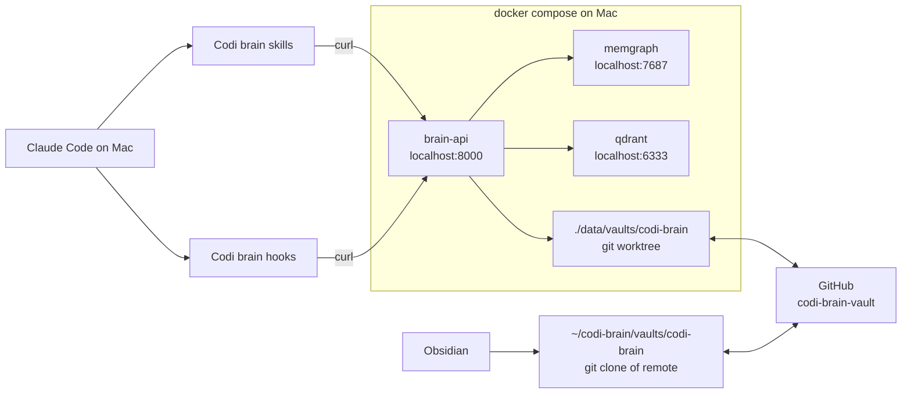
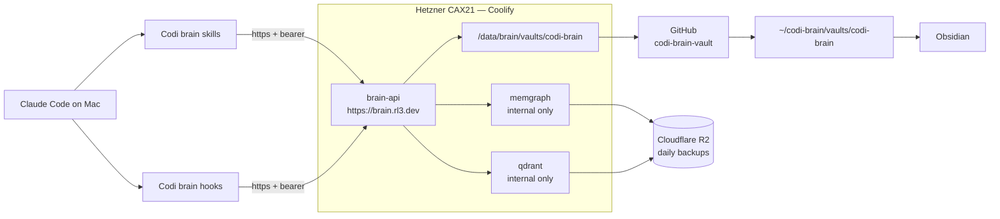

# Codi Brain — Phase 1 Implementation Spec

- **Date**: 2026-04-22 23:00
- **Document**: 20260422_230000_[PLAN]_codi-brain-phase-1.md
- **Category**: PLAN
- **Status**: Proposal — awaiting approval before `codi-plan-writer` breaks this into atomic tasks
- **Scope**: Phase 1 only. Phase 2 (self-improvement, multi-project, per-user keys) is out of scope here and lives in `docs/20260422_210000_[PLAN]_codi-brain.md` §20.2.
- **Parent plan**: `20260422_210000_[PLAN]_codi-brain.md` — the master architecture. This spec is the Phase 1 subset, specified concretely enough for atomic-task extraction.

---

## Table of contents

1. Scope and non-goals
2. Acceptance test
3. Architecture — local and VPS
4. Data model (Phase 1 subset)
5. API surface (8 endpoints)
6. Authentication (single bearer)
7. Vault structure and reconciler
8. Hooks
9. Agent skills
10. Mac-local skill: `brain-vault`
11. `rl3-infra-vps` integration
12. Sub-phases and weekly milestones
13. File and artifact inventory
14. Testing strategy
15. Risks and mitigations
16. Open questions

---

## 1. Scope and non-goals

### 1.1 In scope (Phase 1)

- `brain-api` FastAPI service with `code-graph-rag` **absorbed** as the `src/code_graph/` module of the `codi-brain` repo (one repo, one release cycle, one image — no external pin).
- Memgraph + Qdrant as Docker services.
- Single project seeded from environment at startup.
- Single shared bearer token for auth.
- 8 HTTP endpoints (§5).
- Obsidian-ready git-backed vault on the brain host; `.obsidian/` preconfigured; `.gitignore` per official Obsidian guidance.
- 3 agent skills (`brain-query`, `brain-save`, `brain-hot`) + 1 Mac-local skill (`brain-vault`).
- 3-hook script (SessionStart, UserPromptSubmit, Stop) — Phase 1 uses only SessionStart and Stop for hot-context flow; UserPromptSubmit is a no-op placeholder.
- 1 Codi rule: `brain-usage.md`.
- Coolify deployment via `rl3-infra-vps` env_builder.
- Daily Memgraph dump + Qdrant snapshot to Cloudflare R2.
- Traefik + DNS-01 Let's Encrypt TLS.
- `codi add brain` CLI command to wire agents on a user's machine.

### 1.2 Non-goals (deferred to Phase 2)

- All self-improvement: `Correction`, `Preference`, `UsageEvent`, `Artifact`, `RuleDraft`, `SkillDraft`, `Retrospective` node types and their endpoints.
- Awareness endpoint (`GET /awareness`).
- Retrospective engine, draft generation, `brain-refine` skill, Brain-backed `codi-refine-rules`.
- Multi-project inside one brain (Phase 1 = one project per deployment, scoped by env).
- Per-user API keys (Phase 1 = one shared bearer token).
- Multiple `Note` kinds beyond `decision` and `hot`.
- Lint cron, staleness watchdog, feedback pruner.
- Migration importer from `.codi/feedback/`.
- GraphQL endpoint.
- MCP wrapper.
- Web viewer / Silverbullet.
- Multi-workspace routing.

---

## 2. Acceptance test

Scenario C from the brainstorm: a day-in-the-life loop that exercises the full pipe.

### 2.1 Setup

- `brain-api` running on `https://brain.rl3.dev` (Phase 1B) or `http://localhost:8000` (Phase 1A).
- One project seeded: `codi-brain`, with `VAULT_REMOTE=git@github.com:lehidalgo/codi-brain-vault.git` (or an equivalent GitHub remote).
- Mac has Claude Code configured via `codi add brain --host <url> --token $BRAIN_TOKEN && codi generate`.
- Mac has no local clone of the vault yet.

### 2.2 Day 1 session

1. User runs `brain-ingest` (or manually calls `POST /ingest/repo` with path=`.`). Expected: 200 OK, response includes `{ nodes_added, nodes_updated, nodes_deleted, qualified_names_count }` with positive counts.
2. User in Claude Code: "save this as a decision: we are standardizing on Gemini 3 Flash for every LLM task in the brain; embeddings stay on OpenAI." The `brain-save` skill fires, emits `POST /notes` with `kind=decision`, extracted title, body with a `[[embedding_model]]` wikilink, `links=["src/codi_brain/schema/vector_store.py:embed_note"]`. Expected: 201, returns `{ id, url, vault_path }`.
3. User ends session. `Stop` hook fires, writes `/tmp/codi-brain-hot-refresh-$$.md` with a one-paragraph session TL;DR; the hook posts `PUT /hot` with that body. Expected: 200 OK.
4. `VaultReconciler` has written `vaults/codi-brain/decisions/<title>.md` on the server filesystem, committed locally, pushed to GitHub.

### 2.3 Day 2 session (simulated by restarting `brain-api` in Phase 1A, or by waiting in 1B)

5. Mac: `codi brain vault connect codi-brain`. Expected: clones the GitHub remote to `~/codi-brain/vaults/codi-brain/`, registers with Obsidian, opens the vault.
6. In the Mac vault, the user sees `decisions/<title>.md` with the correct body and wikilinks.
7. User opens a fresh Claude Code session. `SessionStart` hook runs `curl GET /hot`; stdout includes the decision's TL;DR. The agent sees this as prepended context.
8. User asks: "what did we decide about the LLM model?" — `brain-query` skill runs `GET /notes/search?q=LLM+model&kind=decision`. Expected: the decision note is returned. Response cites the note URL and vault path.
9. User asks: "where is the embedding function?" — `brain-query` skill runs `GET /code/search?q=embedding+function`. Expected: at least one `Function` or `Method` node returned with its qualified name; a follow-up `GET /code/snippet` returns the actual source lines.

### 2.4 Pass criteria

All 9 steps succeed. The decision the user saved on Day 1 is visible on Day 2 both in Obsidian (on the Mac) and in hot context (in the agent). Code search returns real code entities. The vault's `index.md` lists the decision.

---

## 3. Architecture

### 3.1 Phase 1A — local stack on Mac



### 3.2 Phase 1B — VPS deployment via `rl3-infra-vps`



### 3.3 Key invariants

- `brain-api` is the only writer to Memgraph, Qdrant, and the vault worktree.
- Humans only read. Obsidian pulls; nobody pushes narrative changes from the Mac.
- Every Memgraph node carries `project_id`; Phase 1 has exactly one value of `project_id` but the column exists day one so Phase 2 multi-project is additive, not a migration.
- Every Qdrant point has `project_id` in its payload.
- A vault write is transactional: Memgraph write + Qdrant upsert + vault file + git commit + git push all succeed together or the handler rolls back. Implementation uses a `VaultWriteContext` that tracks step completion and compensates on failure (§7.2).

---

## 4. Data model (Phase 1 subset)

### 4.1 Code nodes (from the absorbed `code_graph` module, originally `code-graph-rag`)

`Project`, `Folder`, `File`, `Package`, `Module`, `Class`, `Function`, `Method`, `Interface`, `Type`, `Enum`, `Union`, `ExternalPackage`.

**Isolation strategy for Phase 1:** we follow the `code_graph` module's existing convention verbatim (absorbed from `code-graph-rag`) — `qualified_name` carries a project prefix (e.g., `codi-brain.codi_brain.schema.vector_store.embed_note`), making it globally unique across all projects. A separate `project_id` property is also set on every node to enable clean Cypher filters (`MATCH (n) WHERE n.project_id = $project_id`) and to future-proof Phase 2's multi-project queries without a migration. Adding the `project_id` property is one of the Week 0 absorb-and-adapt tasks (§12.0).

Uniqueness is on `qualified_name` alone — matching upstream — not composite:

```cypher
CREATE CONSTRAINT ON (n:Function) ASSERT n.qualified_name IS UNIQUE;
CREATE CONSTRAINT ON (n:Class) ASSERT n.qualified_name IS UNIQUE;
CREATE CONSTRAINT ON (n:Method) ASSERT n.qualified_name IS UNIQUE;
CREATE CONSTRAINT ON (n:Module) ASSERT n.qualified_name IS UNIQUE;
CREATE CONSTRAINT ON (n:File) ASSERT n.path IS UNIQUE;
CREATE CONSTRAINT ON (n:Folder) ASSERT n.path IS UNIQUE;
```

(Phase 2 note: the prefix-in-qualified_name approach keeps working for multi-project; composite constraints are not needed because the prefix guarantees global uniqueness. `project_id` property remains queryable.)

Derived edges (`CALLS`, `IMPORTS`, `EXTENDS`, etc.) carry a `confidence` property with values `EXTRACTED | INFERRED | AMBIGUOUS`.

### 4.2 Narrative node — `Note`

One type, differentiated by `kind`. Phase 1 uses only two kinds: `decision` and `hot`.

| Field | Type | Notes |
|---|---|---|
| `id` | UUID | Primary key. Python-generated with `uuid.uuid4()`. |
| `project_id` | UUID | Always the single Phase 1 project's ID. |
| `kind` | string | `decision` or `hot` in Phase 1. Constraint enforced. |
| `title` | string | Max 200 chars. Slugified for vault filename. |
| `body` | string | Markdown. May include `[[wikilinks]]`. |
| `tags` | list[string] | Indexed on Memgraph label property for filter queries. |
| `author_id` | UUID | Set to the hard-coded Phase 1 admin user ID. |
| `session_id` | UUID | Client-generated; nullable. |
| `confidence` | string | `EXTRACTED` for user-authored notes. |
| `created_at` | ISO-8601 | Set server-side on insert. |
| `updated_at` | ISO-8601 | Equal to `created_at` for immutable notes; differs for `kind=hot`. |
| `deleted_at` | ISO-8601 \| null | Nullable. Set by the Week 2A Reconciler's tombstone path when a Memgraph Note node has no corresponding file on disk. Soft-delete by default; hard-delete opt-in via `RECONCILE_TOMBSTONE_MODE=hard`. |

Unique constraint: `(project_id, kind=hot)` allows only one hot note per project.

### 4.3 Identity — env-hardcoded in Phase 1

Phase 1 does **not** create `User`, `UserKey`, or `Project` nodes. Identity lives in three env vars:

- `PROJECT_ID` — a UUID that stamps every node's `project_id` property.
- `ADMIN_USER_ID` — a UUID used as the `author_id` on every Note.
- `BRAIN_BEARER_TOKEN` — the single shared bearer token. Compared at request time via `hmac.compare_digest` against the env value. No hash is stored anywhere; the token only lives in Coolify env + the client's `.env` file.

`User`, `UserKey`, and `Project` nodes materialize in Phase 2 when per-user keys and multi-project arrive. Phase 2 migration is additive: seed one row each from the env values, then accept new rows. No existing Phase 1 data needs rewriting.

### 4.4 Edges (Phase 1)

- `REFERENCES` — `Note → Function | Class | Module | File` (by qualified name). Confidence-labeled.

Phase 1 does not use `RELATED_TO`, `SUPERSEDES`, `CORRECTS`, etc. Those land in Phase 2.

### 4.5 Qdrant collections

- `code_embeddings` — payload includes `project_id`, `qualified_name`, `path`, `start_line`, `end_line`. Source text = docstring or signature (inherited from the absorbed `code_graph` module).
- `note_embeddings` — payload includes `project_id`, `note_id`, `kind`. Source text = note body.

Embedding model: OpenAI `text-embedding-3-small` (1536 dims). Configurable via `EMBEDDING_MODEL` env.

---

## 5. API surface (8 endpoints)

All non-health endpoints require `Authorization: Bearer <token>`. Responses are JSON. Errors follow:

```json
{ "error": { "code": "NOTE_NOT_FOUND", "message": "…", "request_id": "req-…" } }
```

### 5.1 `POST /ingest/repo`

**Request:**

```json
{ "path": "/path/to/repo", "force": false }
```

- `path` optional; default is the configured `PROJECT_REPO_PATH` env var.
- `force` optional; `true` wipes project nodes and re-ingests clean.

**Response 200:**

```json
{
  "project_id": "…",
  "nodes_added": 1234,
  "nodes_updated": 56,
  "nodes_deleted": 7,
  "qualified_names_count": 890,
  "duration_seconds": 42.1
}
```

**Implementation notes:**
- Calls `code_graph.graph_updater.GraphUpdater.run()` (absorbed module) with the configured `project_id` prefix.
- Runs synchronously. Phase 1 expects repos up to ~2000 files. Repos above that size are out of Phase 1 scope; async background ingestion (with `202` + `job_id` polling) lands in Phase 2.
- Rate-limited to 1 per minute per token.

### 5.2 `GET /code/search`

**Query params:**
- `q` (required): natural-language query.
- `limit` (default 10).

**Response 200:**

```json
{
  "results": [
    {
      "qualified_name": "codi_brain.schema.vector_store.embed_note",
      "label": "Function",
      "path": "src/codi_brain/schema/vector_store.py",
      "start_line": 42,
      "end_line": 67,
      "score": 0.87,
      "docstring": "Embed a note body…"
    }
  ]
}
```

`score` is a float in `[0.0, 1.0]`. For Qdrant-sourced hits the score is the cosine similarity; for Cypher-only hits (exact name matches) the score is `1.0`. Results are sorted by score descending.

**Implementation:** uses the absorbed `code_graph.query` NL-to-Cypher path via the Pydantic-AI agent with `LLM_MODEL=gemini-3-flash`; combines Cypher result with Qdrant vector search; merges by `qualified_name` deduplication keeping the higher score.

### 5.3 `GET /code/snippet`

**Query params:**
- `qualified_name` (required).

**Response 200:**

```json
{
  "qualified_name": "codi_brain.schema.vector_store.embed_note",
  "path": "src/codi_brain/schema/vector_store.py",
  "start_line": 42,
  "end_line": 67,
  "source": "def embed_note(...):\n    ...",
  "docstring": "Embed a note body…"
}
```

**Implementation:** reads the file from the ingest path cached on disk by the absorbed `code_graph.source_extraction` helpers.

### 5.4 `POST /notes`

**Request:**

```json
{
  "kind": "decision",
  "title": "Use Gemini 3 Flash",
  "body": "We standardize…",
  "tags": ["llm", "models"],
  "links": ["codi_brain.schema.vector_store.embed_note"],
  "session_id": "c1a2b3c4-…"
}
```

**Response 201:**

```json
{
  "id": "n-7f8a…",
  "url": "/notes/n-7f8a…",
  "vault_path": "decisions/use-gemini-3-flash.md",
  "session_id": "c1a2b3c4-…"
}
```

**Semantics:**
- `kind` constrained to `decision` in Phase 1 (returns 400 otherwise).
- Notes are immutable after creation — no PATCH endpoint exists.
- Handler runs the full `VaultWriteContext`: Memgraph → Qdrant → file → git commit → git push.

### 5.5 `GET /notes/search`

**Query params:**
- `q` (optional): text or vector query.
- `kind` (optional): filter.
- `tag` (optional, repeatable).
- `limit` (default 10).

**Response 200:**

```json
{
  "results": [
    {
      "id": "n-…",
      "kind": "decision",
      "title": "Use Gemini 3 Flash",
      "body": "…",
      "tags": ["llm", "models"],
      "created_at": "2026-04-22T21:00:00Z",
      "vault_path": "decisions/use-gemini-3-flash.md",
      "score": 0.91
    }
  ]
}
```

**Semantics:** combines Cypher (filters on kind/tag) + Qdrant vector search (on `q`); merges by score.

### 5.6 `GET /hot`

**Response 200:**

```json
{ "body": "…~500 word TL;DR…", "updated_at": "2026-04-22T21:45:00Z" }
```

Returns `{ "body": "", "updated_at": null }` if no hot note exists yet (204-equivalent).

### 5.7 `PUT /hot`

**Request:**

```json
{ "body": "…session TL;DR…" }
```

**Response 200:**

```json
{ "body": "…", "updated_at": "2026-04-22T22:00:00Z" }
```

**Semantics:** upserts the singleton `kind=hot` note for the project. Writes to `hot.md` in the vault, commits, pushes.

### 5.8 `GET /healthz`

**Response 200:**

```json
{
  "status": "ok",
  "checks": {
    "memgraph": "ok",
    "qdrant": "ok",
    "vault_worktree": "ok",
    "git_remote": "ok"
  }
}
```

Returns 503 with per-check detail if any dependency fails within a 2-second timeout.

### 5.9 API contract and cross-repo coupling

`codi` (TypeScript CLI + templates) and `codi-brain` (Python service) are **separate repositories**, coupled by a machine-checked contract. The contract is stronger than sharing a repo would give, because it is explicit and automated.

**The contract has three parts:**

1. **OpenAPI spec** at `codi-brain/openapi.yaml`.
   - Generated from FastAPI routes on every release.
   - Checked in to the repo; CI regenerates and diffs — a drift between live routes and the checked-in spec fails CI.
   - Published as a release asset on every `codi-brain` tag.
   - Single source of truth for request/response shapes. The §5 endpoint descriptions in this spec are the current state; `openapi.yaml` is what codes read.

2. **Skill frontmatter declares a minimum Brain version.** Every brain-skill SKILL.md in `codi/src/templates/skills/brain-*/SKILL.md` carries:
   ```yaml
   ---
   name: brain-save
   description: …
   requires_brain: ">=1.0.0"
   ---
   ```
   `codi-brain` versions follow semver. A breaking API change bumps the major version; skills that use the changed surface bump their `requires_brain` in the same PR. Old skills keep working against old Brains.

3. **`codi brain doctor` — a runtime compatibility check.** New CLI subcommand (shipped with `codi` CLI):
   - Reads `$CODI_BRAIN_HOST` and `$CODI_BRAIN_TOKEN`.
   - `GET /version` returns `{ "brain_version": "1.2.3", "openapi_version": "1.0.0" }`.
   - Reads `requires_brain` from every installed brain-skill in the consumer project.
   - Reports mismatches: "Skill `brain-save` requires `>=2.0.0`; deployed Brain is `1.2.3`. Upgrade Brain or downgrade the skill."
   - Runs automatically after `codi add brain` and `codi update`.

**Why separate repos, not monorepo.** They are peer products with different release cadences: `codi` ships often driven by rule/skill refinement; `codi-brain` ships on core-feature maturity. End users install `codi` (per laptop) and deploy `codi-brain` (per team VPS). Coupling is over HTTP, not source-linked imports. Splitting matches the Temporal/Stripe pattern (core + clients) rather than the Supabase/Dagster pattern (one product, split packages).

**Phase 1 version 1.0.0** is the first tagged Brain release. Its `openapi.yaml` is the baseline all subsequent compatibility is measured against.

---

## 6. Authentication

### 6.1 Phase 1 model

- A single bearer token `BRAIN_BEARER_TOKEN` is generated at deployment time, stored in Coolify env (or the user's `.env` file locally).
- The token is sent by every client (agent skills, hooks, local tools) in the `Authorization: Bearer <token>` header.
- Comparison is `hmac.compare_digest(supplied, settings.brain_bearer_token)` — constant-time, no hashing needed because there is no stored secret to defend (the secret only exists in env + in the client's `.env`).
- No `User`, `UserKey`, or `Project` nodes exist in Phase 1 (§4.3). `PROJECT_ID` and `ADMIN_USER_ID` are env-hardcoded UUIDs.

Phase 2 replaces this with per-user keys backed by Argon2id-hashed `UserKey` rows. Phase 1 is forward-compatible because the auth middleware's output (`AuthContext`) has the same shape either way.

### 6.2 FastAPI dependency

```python
import hmac
from dataclasses import dataclass
from fastapi import Header, HTTPException, Depends, status
from codi_brain.config import Settings, get_settings


@dataclass(frozen=True)
class AuthContext:
    user_id: str
    project_id: str


def require_bearer(
    authorization: str | None = Header(default=None),
    settings: Settings = Depends(get_settings),
) -> AuthContext:
    if not authorization or not authorization.startswith("Bearer "):
        raise HTTPException(status_code=status.HTTP_401_UNAUTHORIZED, detail="missing bearer")
    supplied = authorization[7:]
    if not hmac.compare_digest(supplied, settings.brain_bearer_token):
        raise HTTPException(status_code=status.HTTP_401_UNAUTHORIZED, detail="invalid bearer")
    return AuthContext(user_id=settings.admin_user_id, project_id=settings.project_id)
```

Every non-health route takes `auth: AuthContext = Depends(require_bearer)`. `get_settings()` is an `@lru_cache`-backed accessor so Settings is constructed once per process, not once per request.

### 6.3 Rate limiting

In-memory bucket per bearer token. Default: 60 requests/second burst, 1000/minute sustained. Reset on `brain-api` restart.

---

## 7. Vault structure and reconciler

### 7.1 Per-project directory

```
data/brain/vaults/codi-brain/
├── .obsidian/
│   ├── graph.json
│   ├── app.json
│   ├── appearance.json
│   └── snippets/vault-colors.css
├── .gitignore                         # excludes workspace.json and workspaces.json
├── hot.md                             # singleton; kind=hot
├── index.md                           # auto-rebuilt on every note write
├── decisions/
│   └── <slugified-title>.md
└── _meta/
    └── (empty in Phase 1; lint lives here in Phase 2)
```

`.gitignore` content (per Obsidian official docs):

```
.obsidian/workspace.json
.obsidian/workspaces.json
```

### 7.2 `VaultWriteContext`

```python
class VaultWriteContext:
    """Transactional envelope for any write that must reach Memgraph + Qdrant + vault + git."""
    steps_completed: list[str]
    
    async def commit(self): ...
    async def rollback(self): ...
```

Flow for `POST /notes`:

1. Begin context. Generate `id`, slugify title, compute `vault_path`.
2. Write `Note` node to Memgraph. On failure → abort, 500.
3. Embed body via OpenAI, upsert to Qdrant. On failure → delete Memgraph node, 502.
4. Write markdown to `vault_path`. On failure → delete Qdrant point + Memgraph node, 500.
5. Rebuild `index.md`. On failure → delete the new markdown file, delete Qdrant point + Memgraph node, 500.
6. `git add` + `git commit -m "<kind>: <title>"` with author from `AuthContext`. On failure → delete the new markdown file, rebuild `index.md` fresh (excluding the deleted note), delete Qdrant point + Memgraph node, return 500 with `VAULT_GIT_COMMIT_FAILED`. No orphan commit is created because no commit happened.
7. `git push`. On failure → the note remains committed in the local worktree. Return 201 with `"warnings": ["vault_push_pending"]`. A background task retries every 60 seconds up to 10 times; on final failure, a monitoring counter (`codi_brain_vault_push_failures_total`) increments and the request_id is logged. Subsequent successful writes also push pending commits in order. The invariant from §3.3 ("all succeed together or roll back") is preserved for steps 1–6; step 7 is the single, documented exception — the only visible inconsistency is GitHub lag, never lost data.

Phase 1 simplification: step 7 runs synchronously. Timeouts on push (default 10 seconds) fall through to the retry queue without blocking the response.

### 7.2.1 Filename slugification (grounded in obsidian-importer)

Slugification of `POST /notes` title → `vault_path/decisions/<slug>.md`. Follows `obsidian-importer/src/util.ts:13-28` plus Notion-specific refinements in `src/formats/notion/parse-info.ts:30-83`.

Algorithm (applied in order):

1. Lowercase the title.
2. Replace `/` and `\` with `-`.
3. Remove illegal characters `? < > : * | "`.
4. Remove control characters `\x00-\x1f` and `\x80-\x9f`.
5. Remove Obsidian wikilink-breaking characters `[ ] # | ^` (per `obsidian-help/en/Linking notes and files/Internal links.md:40-43`).
6. Strip leading dots (Unix hidden-file safety) and trailing dots or spaces (Windows file-system safety).
7. Collapse runs of whitespace to a single `-`.
8. Truncate to **200 characters with a word-aware cut**; append `…` on truncation.
9. If the result is empty, default to `untitled`.
10. On filename collision inside `decisions/`, append ` 2`, ` 3`, … before the `.md` extension (matches `obsidian-importer/src/formats/notion/clean-duplicates.ts:40-68`). The new note gets the next free slot; no existing notes are renamed.

The unslugified title is preserved verbatim in frontmatter `title` and is what Obsidian displays.

### 7.2.2 Batch folder creation

Before writing any markdown file, the reconciler ensures all required folders exist in a single upfront pass (pattern from `obsidian-importer/src/formats/notion.ts:84-96`). In Phase 1 the only target folder is `decisions/`, so this reduces to `os.makedirs(vault_root / "decisions", exist_ok=True)` on startup and before each write. The pattern is kept for Phase 2 when more kinds arrive.

### 7.2.3 File timestamps

Every markdown write passes `ctime` and `mtime` matching `Note.created_at` / `updated_at` (equal for immutable Phase 1 notes). Implementation: after `open(path, "w").write(...)`, call `os.utime(path, (ts, ts))` where `ts` is the note's `created_at` as a Unix float. Matches `obsidian-importer/src/formats/notion.ts:118-127`.

### 7.2.4 Per-file error isolation

On a failure inside a single `VaultWriteContext` the handler rolls that write back (per §7.2) and returns 500. Subsequent writes in unrelated requests are unaffected. There is no cross-request transaction; the upstream design deliberately isolates failures per note (pattern from `obsidian-importer/src/formats/notion.ts:146-153`).

### 7.3 Frontmatter renderer

Every note file begins with:

```yaml
---
id: n-7f8a9b0c1d2e3f40
kind: decision
title: Use Gemini 3 Flash
author: alice@team.com
created: 2026-04-22T21:00:00Z
updated: 2026-04-22T21:00:00Z
tags: [llm, models]
session_id: c1a2b3c4-d5e6-7890-abcd-ef1234567890
confidence: EXTRACTED
---
```

Body follows. Wikilinks `[[qualified_name]]` are kept verbatim — Obsidian renders them as stubs if no matching file exists, which is fine for code-entity wikilinks.

The `author` field in frontmatter is the rendered email, looked up from the `User` node whose `id` equals the note's `author_id`. The renderer calls `store.get_user(author_id).email` at write time and caches the result for the duration of the request.

### 7.3.1 Frontmatter rules (grounded in obsidian-help Properties)

Obsidian 1.9.0 (May 2025) removed support for the singular keys `tag`, `alias`, `cssclass` as recognized properties. We write only the plural list forms — `tags`, `aliases`, `cssclasses` — always as YAML lists. Sources: `obsidian-help/en/Editing and formatting/Properties.md:274-304`, `obsidian-help/Release notes/v1.9.0.md:20-22`.

```yaml
# Correct
tags: [llm, models]

# Wrong — removed in 1.9.0
tag: llm
```

If a value needs to contain a wikilink (Phase 1 does not — our `links[]` field is rendered as `[[...]]` in the body, not frontmatter), the link must be quoted: `ref: "[[Some Note]]"` (`Properties.md:33-45`).

Recognized default-property types from Obsidian core (Properties.md:33-45, 274-294):
- `tags` — list of strings, rendered as tag chips.
- `aliases` — list of strings that participate in wikilink resolution (`[[alias]]` resolves to the target note).
- `cssclasses` — list of CSS classes applied to the note's container.
- Dates — `YYYY-MM-DD` (no time) or `YYYY-MM-DDTHH:mm` (with time). ISO-8601 timestamps with seconds (`2026-04-22T22:15:00Z`) are still parsed but Obsidian's Properties view shows them as text, not date pickers. We accept this — `created` and `updated` are agent-facing, not user-facing.

Phase 1 frontmatter keys: `id`, `kind`, `title`, `author`, `created`, `updated`, `tags`, `session_id`, `confidence`. None are wikilinks, all string or list values are safe. The renderer uses Python's `yaml.safe_dump(data, default_flow_style=False, sort_keys=False, allow_unicode=True)` so output is human-readable, key order is preserved, and Unicode titles survive.

### 7.4 Git setup

Worktree initialized with `git init` at startup if `.git` doesn't exist. Remote added from `VAULT_REMOTE` env var. Deploy key mounted as a read-write SSH key at `/root/.ssh/id_ed25519` via Coolify secret. First push uses `--set-upstream origin main`.

### 7.5 Vault-root rule

Only two files live at the vault root in Phase 1: `hot.md` (the singleton) and `index.md` (auto-rebuilt). All decisions land in `decisions/`. No other files are written to the root. This avoids the "vaults within vaults" trap (`obsidian-help/en/Files and folders/How Obsidian stores data.md:18-19`) and matches `obsidian-importer`'s pattern of always writing under a named subfolder.

### 7.6 Obsidian compatibility target

Phase 1 targets **Obsidian ≥ 1.4.0** (July 2023) — the first version with the Properties UI. Users on older versions still see our notes as plain markdown with visible `---` blocks; functionality is not lost, only the Properties panel.

Version-specific grounded notes:

- **1.4.0+**: `tags`, `aliases`, `cssclasses` render in Properties (`Properties.md:33-45`).
- **1.9.0+**: singular `tag`, `alias`, `cssclass` removed (`Release notes/v1.9.0.md:20-22`). We never write those.
- **1.12.3**: current `obsidian-api` definitions version. We depend on no plugin API (we are not a plugin); users' Obsidian is at or past this.

Invalid characters in wikilink targets (`obsidian-help/en/Linking notes and files/Internal links.md:40-43`): `# | ^ : %% [[ ]]`. Our `qualified_name` values from `code-graph-rag` contain only `.`, letters, numbers, and underscores — all safe, no escaping needed. Block references are not used in Phase 1; if introduced later they must match `[a-zA-Z0-9-]+` (`Internal links.md:134`).

Obsidian's file watcher auto-detects external writes and refreshes the UI without user action (`How Obsidian stores data.md:12`). Our brain-api writes + `brain-vault sync` pulls on Mac therefore appear live in an open Obsidian session — no refresh click needed.

---

## 8. Hooks

Single Bash script shipped by Codi at `src/templates/hooks/brain-hooks.sh`. Dispatched by Codi's existing hook manifest generator.

**Shared paths (fixed, not PID-based):** the hook and agent skills share two well-known file paths, located under `$CODI_BRAIN_STATE_DIR` (default `$HOME/.codi/brain`):

- `current-session.id` — the active session UUID. Written by SessionStart, read by skills and the Stop hook, deleted by Stop.
- `hot-refresh.md` — the agent-authored session TL;DR. Written optionally by the `brain-hot` skill (write mode) or by the agent at end-of-session, read + deleted by Stop.

PID-based paths (`$$`) are avoided because the agent subprocess cannot reconstruct the hook's PID. Concurrent Claude sessions against the same brain on one Mac would race; Phase 1 assumes one active session per user per machine. Multi-session support is Phase 2.

### 8.1 SessionStart

```bash
state_dir="${CODI_BRAIN_STATE_DIR:-$HOME/.codi/brain}"
mkdir -p "$state_dir"
session_id=$(uuidgen)
echo "$session_id" > "$state_dir/current-session.id"
curl -sS -H "Authorization: Bearer $CODI_BRAIN_TOKEN" "$CODI_BRAIN_HOST/hot" \
  | jq -r '.body // empty'
```

The printed body becomes part of the agent's initial context.

### 8.2 UserPromptSubmit

Phase 1 no-op. Emits nothing. File exists for Phase 2 to extend.

### 8.3 Stop

```bash
state_dir="${CODI_BRAIN_STATE_DIR:-$HOME/.codi/brain}"
session_file="$state_dir/current-session.id"
hot_refresh_file="$state_dir/hot-refresh.md"
session_id=$(cat "$session_file" 2>/dev/null || echo unknown)

if [ -f "$hot_refresh_file" ]; then
  body=$(cat "$hot_refresh_file")
  curl -sS -H "Authorization: Bearer $CODI_BRAIN_TOKEN" \
    -H "Content-Type: application/json" \
    -X PUT "$CODI_BRAIN_HOST/hot" \
    -d "$(jq -nc --arg body "$body" '{body:$body}')"
  rm -f "$hot_refresh_file"
fi

rm -f "$session_file"
```

The agent is instructed (via `brain-usage` rule) to write a one-paragraph session TL;DR to `$CODI_BRAIN_STATE_DIR/hot-refresh.md` before the session closes, when it has new knowledge worth keeping. If absent, hot is not updated.

---

## 9. Agent skills

All three live in `src/templates/skills/brain-*/SKILL.md` inside the Codi source repo. One `SKILL.md` per skill.

### 9.1 `brain-query`

**Triggers:** "search for", "where is", "find", "what do we know about", "/brain-query".

**Steps:**
1. Decide: code question or note question or both. For ambiguous queries, do both in parallel.
2. Call `GET /code/search?q=...&limit=5` and `GET /notes/search?q=...&limit=5` concurrently via background subprocess or sequentially.
3. Merge results, cite each: code results as `path:start_line-end_line`; note results as `vault_path`.
4. If zero results: say so; do not hallucinate.

### 9.2 `brain-save`

**Triggers:** "save this as a decision", "record:", "let's document", "/brain-save".

**Steps:**
1. Extract a title up to 200 characters. Prefer concise; truncate at a word boundary if longer. (Matches `obsidian-importer/src/formats/notion/parse-info.ts:62-83`.)
2. Write body as markdown. Include `[[wikilinks]]` for code entities discussed.
3. Collect `links[]` — qualified names of affected code (from the session context).
4. Call `POST /notes` with `kind=decision`, `session_id=$CODI_BRAIN_SESSION_ID`.
5. Confirm back: "Saved [[<title>]] — <N> links."

### 9.3 `brain-hot`

**Triggers:** "what's the context", "show hot", "refresh hot context", "/brain-hot".

**Steps:**
- Read mode: `GET /hot`, print body.
- Write mode: user says "refresh hot with <body>" or "update hot context". Skill writes to `$CODI_BRAIN_STATE_DIR/hot-refresh.md` (see §8's shared-paths note). The Stop hook will push it on session end. The skill says so to the user.

### 9.4 Rule — `brain-usage`

Shipped at `src/templates/rules/brain-usage.md`. Content summary:

- Ask the brain before grepping the codebase.
- Save decisions as you make them via `brain-save`.
- Link notes to code using qualified names in the `links` array.
- Before ending a long session with meaningful new context, write a TL;DR to `/tmp/codi-brain-hot-refresh-$$.md` so the Stop hook can persist it.

---

## 10. Mac-local skill: `brain-vault`

Shipped at `src/templates/skills/brain-vault/SKILL.md`. Runs on the user's Mac, not in the brain. It's a shell-based helper — uses `git`, not the brain API.

### 10.1 `brain-vault connect <project>`

1. Read `.codi/brain/config.yaml` (written by `codi add brain`) to find `vault_remote` and `vault_local_root` (default `~/codi-brain/vaults`).
2. `git clone <vault_remote> <vault_local_root>/<project>`.
3. Write a small registration file at `~/Library/Application Support/obsidian/obsidian.json` that adds the new vault path (macOS). On non-Mac, print the path and instruct the user to add the vault manually.
4. Optionally open Obsidian with the `obsidian://open?path=<encoded>` URL scheme.

### 10.2 `brain-vault sync [<project>]`

1. `cd <vault_local_root>/<project>`.
2. `git fetch` + `git pull --ff-only`. If not fast-forwardable, report the conflict and exit; do not resolve automatically.
3. Print a summary: `"<N> files changed; latest: <commit subject>"`.

### 10.3 `brain-vault sync --all`

Loops over every subdirectory in `vault_local_root` and runs `sync` on each.

### 10.4 Optional launchd hook

Not required for Phase 1 acceptance. Documented for users who want auto-pull every 10 minutes: a `launchd` plist template lives at `src/templates/hooks/brain-vault-autosync.plist` — user installs manually.

---

## 11. `rl3-infra-vps` integration

### 11.1 `client.yaml` patch

New client directory `clients/team-brain/` (or additions inside an existing client; Phase 1 ships the dedicated client).

Relevant section of `clients/team-brain/client.yaml`:

```yaml
infrastructure:
  server_type: cax21
  location: hel1
  cloudflare:
    subdomains:
      brain: brain
app:
  services:
    brain-api:
      type: repo
      repo: https://github.com/lehidalgo/codi-brain
      branch: main
      base_directory: /
      dockerfile: /Dockerfile
      port: 8000
      subdomain: brain
      health_endpoint: /healthz
      env_builder: brain_api
      env_overrides:
        LOG_LEVEL: INFO
        PROJECT_ID: "00000000-0000-4000-8000-000000000001"  # UUIDv4 — Phase 1 uses UUIDs; migrate script generates a real one on first provision
        PROJECT_NAME: codi-brain
        VAULT_LOCAL_ROOT: /data/brain/vaults
      post_deploy:
        - python -m codi_brain.cli migrate
        - python -m codi_brain.cli seed --project codi-brain
    brain-memgraph:
      type: image
      image: memgraph/memgraph-mage:2.16
      port: 7687
      internal_only: true
      volumes:
        - memgraph_data:/var/lib/memgraph
    brain-qdrant:
      type: image
      image: qdrant/qdrant:v1.11
      port: 6333
      internal_only: true
      volumes:
        - qdrant_data:/qdrant/storage
backup:
  memgraph:
    enabled: true
    cron: "0 2 * * *"
  qdrant:
    enabled: true
    cron: "5 2 * * *"
```

### 11.2 `env_builder` signature

Add to `provisioner/integrations/env_builders.py`:

```python
def brain_api(
    *,
    memgraph_host: str,
    memgraph_port: int,
    qdrant_url: str,
    brain_bearer_token: str,
    gemini_api_key: str,
    openai_api_key: str,
    vault_remote: str,
    vault_deploy_key_path: str = "/root/.ssh/id_ed25519",
    vault_local_root: str = "/data/brain/vaults",
    llm_model: str = "gemini-3-flash",
    embedding_model: str = "text-embedding-3-small",
    log_level: str = "INFO",
    sentry_dsn: str | None = None,
    project_id: str = "",
    project_name: str = "",
    project_repo_path: str = "",
) -> dict[str, str]:
    _require_secret("brain_bearer_token", brain_bearer_token)
    _require_secret("gemini_api_key", gemini_api_key)
    _require_secret("openai_api_key", openai_api_key)
    _require_secret("vault_remote", vault_remote)
    env = {
        "MEMGRAPH_HOST": memgraph_host,
        "MEMGRAPH_PORT": str(memgraph_port),
        "QDRANT_URL": qdrant_url,
        "BRAIN_BEARER_TOKEN": brain_bearer_token,
        "GEMINI_API_KEY": gemini_api_key,
        "OPENAI_API_KEY": openai_api_key,
        "VAULT_REMOTE": vault_remote,
        "VAULT_DEPLOY_KEY_PATH": vault_deploy_key_path,
        "VAULT_LOCAL_ROOT": vault_local_root,
        "LLM_MODEL": llm_model,
        "EMBEDDING_MODEL": embedding_model,
        "LOG_LEVEL": log_level,
        "PROJECT_ID": project_id,
        "PROJECT_NAME": project_name,
        "PROJECT_REPO_PATH": project_repo_path,
    }
    if sentry_dsn:
        env["SENTRY_DSN"] = sentry_dsn
    return env
```

Register in `_ENV_BUILDERS["brain_api"] = brain_api`. Declare required secrets in `BUILDER_REQUIRED_SECRET_VARS["brain_api"] = ["brain_bearer_token", "gemini_api_key", "openai_api_key", "vault_remote"]`.

### 11.3 Ansible backup role extension

Add two files to `provisioner/roles/backup/files/`:

- `codi-brain-backup-memgraph.sh` — `docker exec brain-memgraph mgconsole --execute "DUMP DATABASE" > /tmp/memgraph-$(date +%F).cypher`; pipe through `age -e -r <pub>`; `rclone copy` to R2.
- `codi-brain-backup-qdrant.sh` — `curl -X POST http://localhost:6333/collections/code_embeddings/snapshots`; download; rclone to R2.

Register crons in `provisioner/roles/backup/tasks/main.yml`:

```yaml
- name: Memgraph backup cron
  ansible.builtin.cron:
    name: "codi-brain memgraph dump"
    minute: "0"
    hour: "2"
    job: "/usr/local/bin/codi-brain-backup-memgraph"
  when: backup.memgraph.enabled | default(false)

- name: Qdrant backup cron
  ansible.builtin.cron:
    name: "codi-brain qdrant snapshot"
    minute: "5"
    hour: "2"
    job: "/usr/local/bin/codi-brain-backup-qdrant"
  when: backup.qdrant.enabled | default(false)
```

### 11.4 Vault GitHub repo

Human-operated step at week 3 start (not in Ansible):

1. Create `github.com/lehidalgo/codi-brain-vault` (private).
2. Generate an SSH deploy key locally, add public key to the repo as a deploy key with write access.
3. Add private key to Coolify secrets as `VAULT_DEPLOY_KEY`.
4. Note the `VAULT_REMOTE` SSH URL in `client.yaml` or as a Coolify env var.

### 11.5 Mac-side env loading

`codi add brain --host ... --token $BRAIN_TOKEN --project <slug>` writes two files on the user's Mac:

- `$HOME/.codi/brain/config.yaml` — non-secret config (host URL, project slug, vault remote). Safe to commit if desired.
- `$HOME/.codi/brain/env` — `CODI_BRAIN_HOST=...`, `CODI_BRAIN_TOKEN=...`, `CODI_BRAIN_STATE_DIR=$HOME/.codi/brain`. Chmod 0600. Never committed.

The user sources this file in their shell profile (`~/.zshrc` or `~/.bash_profile`): `source ~/.codi/brain/env`. `codi add brain` prints the exact line to add and offers to append it automatically.

Skills and hooks read these env vars directly. No per-agent config duplication.

In Phase 1A (local brain), users set `CODI_BRAIN_HOST=http://localhost:8000` and any bearer string they pick (matching `BRAIN_BEARER_TOKEN` in `docker-compose.yaml`).

---

## 12. Sub-phases and weekly milestones

### 12.0 Week 0 — Absorb `code-graph-rag`

**Goal:** move the `code-graph-rag` codebase into the `codi-brain` repo as a first-class internal package, so that every subsequent edit is a single-repo change and no external pin exists. One image, one release cycle.

**Deliverables (roughly half a day of focused work):**

- `git clone` the `code-graph-rag` repo locally as a reference; inspect its module tree.
- Copy `codebase_rag/` → `codi-brain/src/code_graph/`. Rename the Python package accordingly.
- Copy `codebase_rag/tests/` → `codi-brain/tests/test_code_graph/`.
- Merge dependency declarations: `codi-brain/pyproject.toml` absorbs every `code-graph-rag` dep (tree-sitter, tree-sitter-languages, pymgclient, qdrant-client, pydantic-ai, loguru, watchdog, typer, rich, etc.). Resolve any version conflicts explicitly — newer of the two wins.
- Rewrite imports: every occurrence of `codebase_rag.X` becomes `code_graph.X` across the new `src/code_graph/` tree and `tests/test_code_graph/`.
- Delete artifacts we don't ship as part of `codi-brain`: `code_graph/main.py` CLI wrapper, `code_graph/mcp/` stdio server, `code_graph/build_binary.py` PyInstaller entry. Keep them in git history for reference; they re-emerge if Phase 2 needs them.
- Keep `code_graph/realtime_updater.py` as optional — `brain-api` may use it for file-watcher mode later.
- Add `project_id` as a first-class property on every node: edit `code_graph/graph_updater.py` and `code_graph/services/graph_service.py` (or equivalent) so every `MERGE` / `CREATE` writes `project_id` alongside `qualified_name`. This was previously a "prefix in qualified_name" pattern; from now on it's both, enabling clean Cypher filters.
- Confirm the library surface `brain-api` needs is callable from external Python without CLI flags or env-var hacks: `GraphUpdater(...)`, `query_code_graph(...)`, `get_snippet(...)`, `embed_note(...)` or their equivalents. Adjust signatures in-place where they're CLI-coupled.
- Configure `code_graph` modules to accept Memgraph/Qdrant connection settings via explicit constructor args (not only env vars), so `brain-api`'s config flows cleanly through.
- Run `pytest tests/test_code_graph/` — all green before moving on.
- Commit as one atomic "absorb code-graph-rag" commit so history is unambiguous.

**Disposition of the existing `code-graph-rag` GitHub repo:** archived, with a README note pointing to `codi-brain/src/code_graph/`. The existing Mac-local `graph-code` MCP install on the user's machine is unaffected — it keeps running from its own checkout until the user chooses to replace it with `brain-query` after Phase 1 ships.

**Ship criterion:** `pytest tests/test_code_graph/` is green. `from code_graph.graph_updater import GraphUpdater` works from a throwaway Python script inside the `codi-brain` repo. No `git+...` dependency line exists in `pyproject.toml`.

### 12.1 Phase 1A — Week 1: local foundation + code brain

**Deliverables:**

- `codi-brain/` repo with `pyproject.toml`, `uv.lock`, `Dockerfile`, `docker-compose.yaml`.
- FastAPI app with loguru JSON and request-ID middleware.
- Memgraph + Qdrant in local Compose.
- Bearer middleware with Argon2id.
- Rate limiting middleware.
- Memgraph schema: `User`, `Project`, `UserKey` nodes with constraints.
- Startup migration + seed: create one `User`, one `Project`, one `UserKey` from env.
- `POST /ingest/repo`, `GET /code/search`, `GET /code/snippet`.
- Qdrant `code_embeddings` collection with `project_id` in payload.
- `GET /healthz` with Memgraph + Qdrant + vault checks.
- Pytest harness with throwaway containers.

**Ship criterion:** `docker compose up`; `curl -X POST /ingest/repo` on the `codi-brain` repo itself returns 200 with positive `nodes_added`; `curl /code/search?q=auth` returns ≥ 1 hit.

### 12.2 Phase 1A — Week 2: notes + vault + agent side + local scenario C

**Deliverables:**

- `Note` node schema + constraint (`project_id`, `kind=hot` uniqueness).
- `POST /notes` with `VaultWriteContext` (steps 1–6 synchronous, step 7 async retry queue).
- `GET /notes/search`.
- `GET /hot` / `PUT /hot`.
- `VaultReconciler` class with frontmatter renderer + wikilink resolution + index rebuild + git commit + git push.
- `.obsidian/` template seeded on first vault init; `.gitignore` with workspace entries.
- Three skills in Codi source: `brain-query`, `brain-save`, `brain-hot`.
- `brain-vault` Mac-local skill.
- `brain-hooks.sh` hook script.
- `brain-usage.md` rule.
- `codi add brain` CLI command.
- Scenario C run locally with a test vault GitHub repo.

**Ship criterion (Phase 1A done):** Claude Code on Mac pointed at `http://localhost:8000` runs scenario C steps 1–9. All 9 pass.

### 12.3 Phase 1B — Week 3: VPS migration

**Deliverables:**

- Production Dockerfile (multi-stage, non-root user, pinned Python 3.12, pinned base image).
- `rl3-infra-vps` patches per §11.
- GitHub vault repo created + deploy key in Coolify secrets.
- Brain VPS provisioned via `python provision.py create --client clients/team-brain/client.yaml`.
- TLS green: `curl -I https://brain.rl3.dev/healthz` returns 200 via HTTPS.
- Scenario C re-runs against the live brain.
- Weekly restore drill workflow in GitHub Actions; first run green.

**Ship criterion (Phase 1 done):** `https://brain.rl3.dev` responds 200 on `/healthz`. Scenario C passes end-to-end. Mac Obsidian shows the Day 1 decision after `brain-vault sync` on Day 2. Restore drill passes.

---

## 13. File and artifact inventory

### 13.1 New repository: `codi-brain`

```
codi-brain/
├── pyproject.toml
├── uv.lock
├── Dockerfile
├── docker-compose.yaml
├── README.md
├── src/
│   └── codi_brain/
│       ├── __init__.py
│       ├── app.py                    # FastAPI factory
│       ├── config.py                 # Pydantic Settings
│       ├── auth.py                   # bearer middleware, Argon2id
│       ├── rate_limit.py             # in-memory bucket
│       ├── cli.py                    # `codi_brain.cli migrate / seed`
│       ├── schema/
│       │   ├── __init__.py
│       │   ├── memgraph.py           # constraints, migrations
│       │   ├── qdrant.py             # collections, payload schemas
│       │   └── nodes.py              # Pydantic models: User, Project, UserKey, Note
│       ├── store/
│       │   ├── __init__.py
│       │   ├── memgraph_store.py     # Cypher wrappers
│       │   ├── qdrant_store.py       # embedder + upsert
│       │   └── git_store.py          # worktree helpers: init, commit, push
│       ├── vault/
│       │   ├── __init__.py
│       │   ├── reconciler.py         # VaultWriteContext
│       │   ├── renderer.py           # frontmatter + wikilink rendering
│       │   ├── indexer.py            # index.md rebuild
│       │   └── obsidian_template/    # .obsidian/ seed files + .gitignore
│       ├── routes/
│       │   ├── __init__.py
│       │   ├── health.py
│       │   ├── ingest.py
│       │   ├── code.py
│       │   ├── notes.py
│       │   └── hot.py
│       └── integrations/
│           ├── __init__.py
│           ├── code_graph.py         # thin adapter over src/code_graph/
│           ├── openai_embed.py       # embedding client
│           └── gemini_llm.py         # Pydantic-AI model factory
├── src/code_graph/                   # absorbed from code-graph-rag (Week 0)
│   ├── __init__.py
│   ├── graph_updater.py              # ingest orchestrator; was codebase_rag/graph_updater.py
│   ├── query.py                      # NL-to-Cypher + graph query; was codebase_rag/query.py
│   ├── source_extraction.py          # snippet extraction by qualified_name
│   ├── parsers/                      # tree-sitter parsers per language
│   ├── services/
│   │   ├── graph_service.py          # MemgraphIngestor (batched writes)
│   │   └── llm.py                    # Pydantic-AI agent factory
│   ├── grammars/                     # tree-sitter grammar bindings
│   └── utils/
│       ├── fqn_resolver.py
│       └── source_extraction.py
└── tests/
    ├── conftest.py                   # docker-test fixtures
    ├── test_auth.py
    ├── test_ingest.py
    ├── test_code_search.py
    ├── test_notes.py
    ├── test_vault_reconciler.py
    ├── test_scenario_c.py            # the integration test
    └── test_code_graph/              # absorbed tests (Week 0)
        └── ...                       # mirror of code-graph-rag/codebase_rag/tests/
```

Note: the `codi-brain` pyproject defines **one installable package** (`codi_brain`) that imports from a sibling package (`code_graph`). Both live under `src/` so `uv sync` builds and installs them together. No `git+...` dependency.

### 13.2 New templates in Codi source

```
src/templates/
├── skills/
│   ├── brain-query/SKILL.md
│   ├── brain-save/SKILL.md
│   ├── brain-hot/SKILL.md
│   └── brain-vault/SKILL.md
├── rules/
│   └── brain-usage.md
└── hooks/
    ├── brain-hooks.sh
    └── brain-vault-autosync.plist    # optional launchd (doc, not installed)
```

### 13.3 New patches to `rl3-infra-vps`

```
clients/team-brain/
└── client.yaml

provisioner/
├── integrations/env_builders.py       # add brain_api function
├── roles/backup/tasks/main.yml        # add memgraph + qdrant crons
└── roles/backup/files/
    ├── codi-brain-backup-memgraph.sh
    └── codi-brain-backup-qdrant.sh
```

### 13.4 New GitHub assets

- `github.com/lehidalgo/codi-brain` (new repo; public)
- `github.com/lehidalgo/codi-brain-vault` (new repo; private)
- `codi-brain/.github/workflows/restore-drill.yml` (GitHub Action)

---

## 14. Testing strategy

### 14.1 Levels

- **Unit tests** — `codi_brain/auth.py`, `codi_brain/vault/renderer.py`, `codi_brain/vault/indexer.py`, `codi_brain/integrations/openai_embed.py` (mocked), `codi_brain/integrations/gemini_llm.py` (mocked).
- **Integration tests** — `tests/test_ingest.py`, `tests/test_notes.py`, `tests/test_vault_reconciler.py`. Use `testcontainers-python` to spin up Memgraph and Qdrant per test module.
- **Scenario test** — `tests/test_scenario_c.py`. Runs the full 9-step flow against a test-instance brain-api with a throwaway git remote (local bare repo).

### 14.2 Mocking boundaries

- OpenAI embeddings: mocked at the HTTP layer via `respx`. Vector values deterministic in tests.
- Gemini LLM: mocked at the `pydantic-ai` model level to return canned Cypher for a small set of NL queries.
- GitHub push: unit and integration tests use a local bare repo (`file:///tmp/brain-test.git`) as `VAULT_REMOTE` so the test suite runs offline. Phase 1A scenario C uses a real private GitHub repo (`codi-brain-vault-dev`) to exercise the full git path before Phase 1B. Phase 1B acceptance uses the production `codi-brain-vault` repo.

### 14.3 CI

`.github/workflows/ci.yml` on the `codi-brain` repo:

1. `uv sync`
2. `ruff check`
3. `mypy src/`
4. `pytest -x tests/` (unit + integration)
5. Build Docker image.
6. Push image to ghcr.io on `main` branch merges.

Restore drill runs on `schedule` (Sunday 04:00 UTC) on a separate workflow.

### 14.4 Acceptance

Scenario C from §2 is the only human-level acceptance test. It runs in two places:
- End of Phase 1A: locally against `http://localhost:8000`.
- End of Phase 1B: against `https://brain.rl3.dev`.

---

## 15. Risks and mitigations

| Risk | Likelihood | Impact | Mitigation |
|---|---|---|---|
| `code_graph` absorption reveals CLI-coupled APIs that resist direct import | Low | Week 0 slips half a day | Absorb-and-adapt is in our own repo — we edit the functions in place to accept explicit args instead of argv. No cross-repo PR, no version pin, no sidecar fallback needed. |
| Vault git push fails during scenario C | Low | Warning on response, not failure | Response returns 201 with `warnings: [vault_push_pending]`; retry loop fixes within 10 minutes. |
| Memgraph OOM on larger-than-expected Codi repo | Low | 500 on ingest | CAX21 has 8 GB; Codi repo has ~60k LOC which fits comfortably. If it doesn't, reduce batch size and retry. |
| Traefik DNS-01 delay on first provision | Medium | Week 3 slips by a day | Schedule the provision for a morning; LE issuance typically completes within 5 minutes; restore drill catches cert failures. |
| Obsidian on Mac doesn't pick up the vault auto-registration | Low | User adds it manually | `brain-vault connect` prints the path and a `obsidian://open?path=...` URL as fallback. |
| `.codi/brain/config.yaml` path collides with existing Codi artifacts | Low | `codi add brain` fails | Codi's artifact manifest covers this; `codi add brain` uses the standard artifact-type installer. |
| OpenAI embedding call stalls every request | Medium | User-facing latency | Embedding runs in a background task; the `POST /notes` response returns before Qdrant upsert completes; vector becomes available within seconds. Phase 1 simplification: inline. If stalls show up, switch to background. |
| Phase 1B discovers an `rl3-infra-vps` assumption not met | Medium | Week 3 slips | `env_builder` follows the existing generic pattern; most risk is in `acme.json` persistence and Tailscale admin binding, both already proven on Sapphira. |
| Obsidian 1.9.0 breaking change on singular `tag` / `alias` / `cssclass` properties | Avoided by design | None on users who follow us | Renderer emits only plural list forms (§7.3.1). Phase 1 is forward-compatible with 1.4.0 through 1.9.0+. |
| Pressure to adopt Obsidian Sync via `obsidian-headless` | Rejected for Phase 1 | Scope creep and licensing exposure | `obsidian-headless` is proprietary (`package.json: license: UNLICENSED`), requires every user to hold a paid Obsidian Sync subscription, routes all traffic through `api.obsidian.md` (no self-hosted option), and is at v0.0.9 (March 2026). Git-backed vault stays. Revisit only if Obsidian publishes a commercial redistribution license AND a self-hosted sync server. |
| Concurrent writes to same vault worktree from within brain-api | Low | Corrupted git commit | One FastAPI process, one in-process asyncio lock on the git worktree (`asyncio.Lock` per project). All vault writes acquire the lock. Phase 1 traffic is agent-driven, low concurrency. |

---

## 16. Open questions

Two questions remaining; none block Phase 1A.

1. **Vault Git remote for Phase 1A.** Use a throwaway local bare repo, or create the real GitHub vault repo at the start of Week 2? Leaning real GitHub repo so scenario C exercises the full git path from Week 2.
2. **`codi-brain` repo visibility.** Public or private. Leaning public; Coolify can clone public repos directly.

*(Closed since spec v1):*
- *LLM and embedding provider choice — Gemini for LLM, OpenAI for embeddings. See §5.11 of the master plan.*
- *`code-graph-rag` dependency pin form — no pin; absorbed into `src/code_graph/` at Week 0. See §12.0.*
- *`code_graph`'s LLM config for Cypher generation — part of the Week-0 absorb step; we edit the absorbed module to accept `LLM_MODEL` from `brain-api`'s config.*

---

## Appendix A — Environment variables (authoritative Phase 1 list)

| Variable | Required | Default | Purpose |
|---|---|---|---|
| `BRAIN_BEARER_TOKEN` | yes | — | Shared bearer token |
| `GEMINI_API_KEY` | yes | — | LLM |
| `OPENAI_API_KEY` | yes | — | Embeddings |
| `MEMGRAPH_HOST` | yes | — | Graph DB hostname |
| `MEMGRAPH_PORT` | no | `7687` | Graph DB port |
| `QDRANT_URL` | yes | — | Vector DB URL |
| `VAULT_REMOTE` | yes | — | Git SSH remote for the vault repo |
| `VAULT_DEPLOY_KEY_PATH` | no | `/root/.ssh/id_ed25519` | Deploy key path in container |
| `VAULT_LOCAL_ROOT` | no | `/data/brain/vaults` | Worktree parent on VPS |
| `LLM_MODEL` | no | `gemini-3-flash` | Gemini model ID |
| `EMBEDDING_MODEL` | no | `text-embedding-3-small` | OpenAI embedding model |
| `PROJECT_ID` | yes | — | ULID or UUID of the seeded project |
| `PROJECT_NAME` | yes | — | Human-readable project slug |
| `PROJECT_REPO_PATH` | yes | — | Path on disk to ingest |
| `LOG_LEVEL` | no | `INFO` | loguru level |
| `SENTRY_DSN` | no | — | Optional Sentry |
| `PYTHONUNBUFFERED` | no | `1` | Docker logs flush |

All required values validated at startup; `brain-api` exits non-zero with a clear error when missing.
