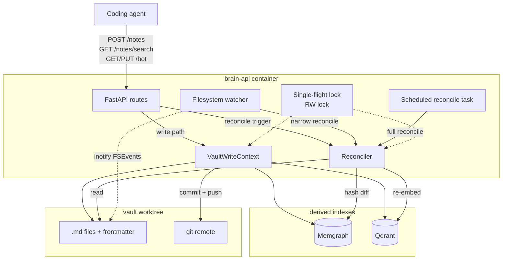
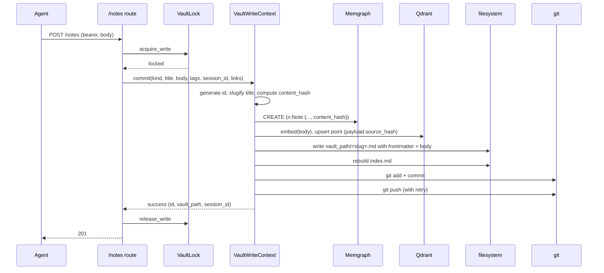
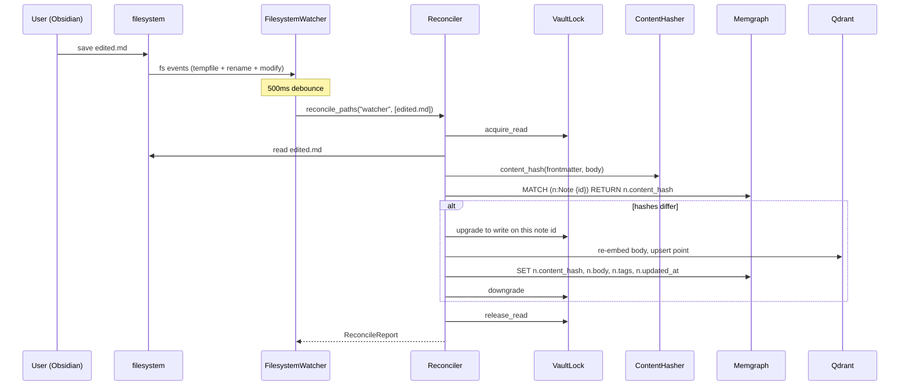

# Codi Brain — Phase 1 Week 2A Design Spec

- **Date**: 2026-04-23 11:54
- **Document**: 20260423_115429_[PLAN]_codi-brain-phase-1-week-2a-design.md
- **Category**: PLAN
- **Purpose**: Design spec for Week 2 sub-plan A — the brain-side Notes API and the vault integration (VaultWriteContext + bidirectional Reconciler + filesystem watcher + scheduled reconcile). Codi-side skills and `codi add brain` CLI are out of scope for this sub-plan (they arrive in Week 2B).

## Scope and relation to prior docs

This spec refines and extends the Phase 1 spec at `docs/20260422_230000_[PLAN]_codi-brain-phase-1.md`, specifically sections §4.2 (Note), §4.4–4.5 (edges, collections), §5.4–5.7 (notes + hot endpoints), §5.8 (healthz extensions), §7 (Vault structure and reconciler), and §7.4 (git setup).

The Phase 1 spec already decided:
- Note schema and frontmatter keys.
- VaultWriteContext 6-step transaction with reverse-order rollback.
- Filename slugification algorithm (obsidian-importer pattern).
- Batch folder creation, file timestamp rules, per-file error isolation.
- Frontmatter renderer and plural-only property naming (Obsidian ≥ 1.9.0 rules).
- Vault-root rule and Obsidian compatibility target (≥ 1.4.0).

This sub-plan adds the two decisions that were genuinely open:

1. **Reconciler scope for Phase 1** — Layers 1–8 of the robust design (content-hash primitive, bidirectional reconciler, startup reconcile, filesystem watcher, scheduled reconcile, single-flight lock, concurrent-write RW lock). Layers 9 (Qdrant provenance) and 10 (reconcile audit log) deferred to Phase 2.
2. **Vault git remote** — one private GitHub repo `lehidalgo/codi-brain-vault` for both Phase 1A (Mac) and Phase 1B (VPS). Credentials differ (Mac SSH key vs VPS deploy key); URL does not. Tests use a tmp local bare repo via pytest fixture.

## 1. Architecture

Week 2A adds new components on top of the Week 1 brain-api. Source of truth is the `.md` filesystem; Memgraph + Qdrant are derived indexes that must be reproducible from the source.



### Key boundaries

- **Source of truth**: the `.md` files on disk. If Memgraph and Qdrant are both wiped, a full reconcile from the filesystem rebuilds them.
- **Write path**: `VaultWriteContext` acquires `VaultLock.write()`. No reads see partial state.
- **Read/reconcile path**: `Reconciler` acquires `VaultLock.read()`. Multiple readers concurrent; readers and writers mutually exclusive.
- **Event sources for reconciliation** (all routed through the same `Reconciler`, single-flight coalesced):
  1. Startup (FastAPI lifespan) — full scan.
  2. Filesystem watcher (`watchdog`, 500ms debounce) — narrow scan for changed paths.
  3. Scheduled asyncio task (15-min interval) — full scan, backstop.
  4. Explicit `POST /vault/reconcile` — full or narrow, caller's choice.

## 2. Components

### 2.1 `ContentHasher`

Deterministic canonical hashing primitive. Hashes body + frontmatter serialized with sorted keys, default YAML flow style off. Not raw file bytes (YAML formatting variance produces false positives).

```python
def content_hash(frontmatter: dict, body: str) -> str:
    """Return sha256 of canonical (body + sorted-keys YAML frontmatter)."""
```

One public symbol. Pure function.

### 2.2 `VaultLock`

Asyncio reader-writer lock. Single writer at a time; multiple readers allowed but mutually exclusive with writers. Built on `asyncio.Lock` + reader count + condition variable.

```python
class VaultLock:
    async def acquire_write(self) -> None: ...
    async def release_write(self) -> None: ...
    async def acquire_read(self) -> None: ...
    async def release_read(self) -> None: ...
    def write(self) -> "AsyncContextManager[None]": ...
    def read(self) -> "AsyncContextManager[None]": ...
```

One instance per brain-api process, held in `app.state.vault_lock`. 30-second timeout on acquires.

### 2.3 `VaultWriteContext` (extends Phase 1 spec §7.2)

Existing spec defines the 6-step transaction. Week 2A additions:

- Acquires `VaultLock.write()` at step 1, releases at step 6.
- Computes `content_hash` via `ContentHasher`, stores it on both:
  - Memgraph `Note.content_hash` property.
  - Qdrant point payload `source_hash` field.
- Rollback path unchanged from spec §7.2.

### 2.4 `Reconciler`

Bidirectional drift detector.

```python
@dataclass
class ReconcileReport:
    trigger: str                # "startup|watcher|scheduled|manual"
    started_at: datetime
    finished_at: datetime
    scanned: int
    created: int                # file exists, Memgraph missing
    updated: int                # file differs from Memgraph
    tombstoned: int             # Memgraph node without file
    orphans_cleaned: int        # Qdrant points without Memgraph nodes
    errors: list[str]

class Reconciler:
    async def reconcile_full(self, trigger: str) -> ReconcileReport: ...
    async def reconcile_paths(self, trigger: str, paths: list[Path]) -> ReconcileReport: ...
```

Detects four drift kinds:
- **created**: file exists, no Memgraph node → insert node + embed + store hash.
- **updated**: file hash differs from Memgraph hash → re-embed + update node + update hash.
- **tombstoned**: Memgraph node without file → soft-delete by setting `deleted_at` on the node (new Week 2A schema property — not in the Phase 1 spec's §4.2 Note fields; added here explicitly). Hard-delete is opt-in via `RECONCILE_TOMBSTONE_MODE=hard` env var. Soft-deleted nodes are excluded from `GET /notes/search` and from Qdrant orphan-cleanup (the vector is kept because the node still exists).
- **orphan**: Qdrant point without Memgraph node (including soft-deleted nodes when in hard-delete mode) → delete Qdrant point.

**Schema drift with parent Phase 1 spec §4.2**: the `deleted_at` property is new in Week 2A. The plan-writer MUST include a follow-up edit to `docs/20260422_230000_[PLAN]_codi-brain-phase-1.md` §4.2 adding `deleted_at: ISO-8601 | null (nullable; set by reconciler tombstone path)` to the Note fields table. Without this follow-up edit, the parent spec and the implemented schema drift.

**Idempotency invariant on lock escalation**: after the reconciler releases read, acquires write, and re-reads the file, it MUST recompute the content hash on the freshly-read body + frontmatter before deciding whether to mutate. The file may have changed between the scan read and the mutation write (a concurrent `POST /notes` or `PUT /hot` could target the same path, though the lock ordering prevents this in practice). Re-reading and re-hashing before the mutation guarantees that running the reconciler twice on the same file yields the same end state as running it once.

**Two-phase scan pattern** (eager snapshot, then per-mutation write):

1. **Phase A — snapshot under read lock.** Take `VaultLock.read()`. Eagerly enumerate every `.md` file in the vault (reading body + frontmatter) and every `Note` node in Memgraph (reading `id`, `content_hash`, `deleted_at`). Classify each as a drift kind via `classify_drift`. Release the read lock when the snapshot is complete.
2. **Phase B — per-drift mutation under write lock.** For each drift item in the snapshot, take `VaultLock.write()`, **re-read the file and re-hash it** (critical — the snapshot is stale the moment the read lock was released; re-reading under write guarantees we mutate against the current state), apply the mutation (insert / update / tombstone / orphan-clean), release write. Move to the next drift.

The earlier version of this spec described a different pattern (hold read across the whole scan, escalate to write per drift, downgrade back to read). That pattern serializes writers unnecessarily during the drift-processing phase. The two-phase pattern above is strictly better on concurrency (writers are only blocked for the single-file mutation window, not for the full walk) and is semantically equivalent: both rely on the **re-read-and-re-hash-under-write-lock invariant** for idempotency. Per-note lock granularity is deliberately NOT implemented; the process-wide RW lock plus the re-read invariant is simpler and sufficient.

**Single-flight coalescing**: if a reconcile is in progress and a new trigger arrives, the new trigger joins the in-flight task (does not create a second one). All coalesced callers receive the same `ReconcileReport` when the run finishes. Implementation uses an internal `asyncio.Lock` around the claim-or-join state transition to prevent TOCTOU races under `asyncio.gather`.

Per-file error isolation: corrupt `.md` file is skipped, logged, and appended to `ReconcileReport.errors`. Run continues.

### 2.5 `FilesystemWatcher`

Wraps `watchdog.observers.Observer`. Watches `vault_root/` recursively.

```python
class FilesystemWatcher:
    def __init__(
        self,
        vault_root: Path,
        on_change: Callable[[list[Path]], Awaitable[None]],
        debounce_ms: int = 500,
    ): ...
    async def start(self) -> None: ...
    async def stop(self) -> None: ...
```

500ms sliding-window debounce coalesces editor atomic-save patterns (tempfile + rename + modify → one logical change). `on_change` wires to `reconciler.reconcile_paths("watcher", paths)`.

Started in FastAPI lifespan `startup`, stopped in `shutdown`.

### 2.6 `ScheduledReconcileTask`

Asyncio background task. Every 900s (15 min) calls `reconciler.reconcile_full("scheduled")`. Bare `try/except` per iteration — logs + continues on errors. Task-alive flag exposed via `/healthz`.

```python
class ScheduledReconcileTask:
    def __init__(self, reconciler: Reconciler, interval_seconds: int = 900): ...
    async def start(self) -> None: ...
    async def stop(self) -> None: ...
```

### 2.7 New FastAPI routes

| Route | Purpose | Auth | Component |
|-------|---------|------|-----------|
| `POST /notes` | Create a `decision` note | bearer | `VaultWriteContext` |
| `GET /notes/search` | Search notes (hybrid vector + filter) | bearer | Cypher + Qdrant merge |
| `GET /hot` | Read hot-state singleton | bearer | Direct Memgraph read |
| `PUT /hot` | Upsert hot-state singleton | bearer | `VaultWriteContext` on `hot.md` |
| `POST /vault/reconcile` | Manual reconcile trigger | bearer | `Reconciler`; `?paths=...` for narrow |

Existing `GET /healthz` extended with four new first-class checks (all peers; there is no "internal" vs "external" distinction — all four surface via `/healthz` JSON and feed the 200/503 aggregate):
- `vault_worktree: ok|fail` — is `/data/vaults/<project>` a git worktree? (spec §5.8)
- `git_remote: ok|fail` — does `git ls-remote origin` succeed within 2s? (spec §5.8)
- `watcher_alive: ok|fail` — is the `FilesystemWatcher` task still running?
- `scheduler_alive: ok|fail` — is the `ScheduledReconcileTask` still running?

### 2.8 Metrics endpoint

New `GET /metrics` route exposes Prometheus-format counters + histograms. Phase 1A uses this for `curl` debugging; Phase 1B wires it to Coolify's dashboard.

Metrics:
- `codi_brain_vault_writes_total{outcome}` — success | rollback | push_pending.
- `codi_brain_reconcile_runs_total{trigger, outcome}`.
- `codi_brain_reconcile_drift_found_total{kind}` — created | updated | tombstoned | orphan.
- `codi_brain_reconcile_duration_seconds{trigger}` — histogram.
- `codi_brain_vault_push_failures_total`.
- `codi_brain_vault_lock_wait_seconds{mode}` — read | write.

## 3. Data flow

### 3.1 Agent writes a note (`POST /notes`)



Step 7 (push) failure returns 201 with `warnings: ["vault_push_pending"]`. Steps 1–6 are transactional; step 7 has at-least-once delivery semantics via 60s retry (Phase 1 spec §7.2).

### 3.2 User edits in Obsidian, reconciler catches up



Full-scan variant walks every `.md` file, plus checks reverse direction: Memgraph nodes without files → tombstone; Qdrant points without Memgraph nodes → garbage collect.

### 3.3 Agent searches notes (`GET /notes/search`)

```mermaid
sequenceDiagram
    participant A as Agent
    participant R as /notes/search route
    participant L as VaultLock
    participant Q as Qdrant
    participant M as Memgraph
    A->>R: GET /notes/search?q=...&kind=decision&tag=llm&limit=10
    R->>L: acquire_read
    par vector search
        R->>Q: embed(q), search("note_embeddings", top 50)
    and cypher filter
        R->>M: MATCH (n:Note) WHERE n.project_id=$pid AND n.kind='decision' AND 'llm' IN n.tags RETURN n
    end
    R->>R: merge by id; hybrid score = α·vector + (1-α)·filter_match
    R->>L: release_read
    R-->>A: 200 results (top limit by merged score)
```

Default α=0.7 (vector-heavy). Filter-only (no `q`) returns filter results ordered by `updated_at desc`. Vector-only (no filter) returns Qdrant results. Both present: intersection — note must pass filter AND be in vector top-50.

### 3.4 Hot state

`PUT /hot` writes via `VaultWriteContext` to `vault_root/hot.md`. Unique-constraint on `(project_id, kind=hot)` enforces singleton. `GET /hot` is a direct Memgraph read of the singleton node — no search, no Qdrant. Returns `{body: "", updated_at: null}` when no hot note exists.

### 3.5 Concurrency and edge cases

| Case | How |
|------|-----|
| Two agent writes concurrent | Second blocks on `acquire_write` until first releases. Serialized. |
| Agent write + user Obsidian edit concurrent | Agent's write lock blocks watcher-triggered reconcile; reconcile catches the edit on next cycle. |
| Startup with stale indexes | Lifespan's startup reconcile runs before the app serves. |
| File deleted outside write path | Scheduled reconcile finds `Memgraph node without file`, tombstones. |
| Qdrant rebuilt from empty | Startup reconcile re-embeds everything because every file's hash mismatches. |
| Git push fails (network, auth) | Committed-locally state + 60s retry; request returns 201 with warning. |
| Git push non-fast-forward | Brain-api does `git pull --rebase origin main` + retry push. Conflicts resolved file-by-file: brain's writes win for its session's files; remote wins otherwise. Caps at 3 attempts; final failure logs + retries next cycle. |

## 4. Error handling

### 4.1 Error envelope

All 4xx/5xx responses use the shape already defined in Phase 1 spec §5:

```json
{ "error": { "code": "<ERROR_CODE>", "message": "...", "request_id": "req-..." } }
```

`request_id` from existing `RequestIdMiddleware` (Task 1.8).

### 4.2 Error code catalog (Week 2A)

| Code | HTTP | Cause |
|------|------|-------|
| `INVALID_NOTE_KIND` | 400 | `kind` not in `{decision, hot}` |
| `NOTE_TITLE_TOO_LONG` | 400 | title exceeds 200 chars before slugification |
| `NOTE_NOT_FOUND` | 404 | search hit has no matching Memgraph node (race; caller retries) |
| `VAULT_LOCK_TIMEOUT` | 503 | couldn't acquire `VaultLock` within 30s |
| `VAULT_MEMGRAPH_WRITE_FAILED` | 500 | step 1 failed; no partial state |
| `VAULT_EMBED_FAILED` | 502 | OpenAI call failed; Memgraph rolled back |
| `VAULT_QDRANT_WRITE_FAILED` | 502 | Qdrant upsert failed; Memgraph rolled back |
| `VAULT_FILE_WRITE_FAILED` | 500 | filesystem write failed; Memgraph + Qdrant rolled back |
| `VAULT_INDEX_REBUILD_FAILED` | 500 | index.md rebuild failed; full rollback |
| `VAULT_GIT_COMMIT_FAILED` | 500 | git add/commit failed; full rollback (no orphan commit) |
| `RECONCILE_IN_PROGRESS` | 202 | explicit `/vault/reconcile` while one runs; coalesces into live run, returns its report |

**Success warnings** (not errors; appear in the 2xx response body under `warnings: [...]`):

| Warning code | Response | Cause |
|--------------|----------|-------|
| `VAULT_PUSH_PENDING` | 201 (from POST /notes, PUT /hot) | git commit local but `git push` failed; background retry queue picks it up (spec §7.2) |

### 4.3 Per-component failure handling

- `ContentHasher`: pure; no failure modes except OOM on pathological input (bounded by FastAPI request-body limit).
- `VaultLock`: timeout on acquire → `VAULT_LOCK_TIMEOUT`. Deadlock prevented by design (readers never escalate while holding read; reconciler acquires write per-note, not while holding read).
- `VaultWriteContext`: strict reverse-order rollback per spec §7.2. Structured log per step `{step, status, duration_ms, request_id, note_id}`.
- `Reconciler`: per-file error isolation (spec §7.2.4 pattern). Corrupt `.md` file skipped + logged + accumulated in `ReconcileReport.errors`. Run continues.
- `FilesystemWatcher`: watchdog failures (inotify overflow, FSEvents dropouts) logged `warn`. Scheduled reconcile is the backstop. Watcher never raises to the reconciler; logs and keeps running.
- `ScheduledReconcileTask`: asyncio task with bare `try/except` per iteration. Task crash surfaced via `/healthz` `scheduler_alive` check.

### 4.4 Git push failure handling

| Failure | Behavior |
|---------|----------|
| `git add` / `git commit` fail | Treated as write-step failure; full rollback. |
| `git push` network / auth failure | Commit stays local. Retry every 60s up to 10 attempts. `codi_brain_vault_push_failures_total` increments on final give-up. Subsequent successful writes push all pending commits in order. |
| `git push` non-fast-forward | `git pull --rebase origin main` + retry push. Conflicts resolved file-by-file: brain's session writes win for its files; remote wins otherwise. 3-attempt cap per request; final failure logs + retries next cycle. |

### 4.5 Observability

Every component emits structured loguru events with:
- `request_id` (in request context)
- `component` (`write_context` | `reconciler` | `watcher` | `scheduler`)
- `operation`, `status` (`started|ok|error`), `duration_ms`
- Component-specific fields (`note_id`, `vault_path`, `trigger`, `drift_kind`)

### 4.6 Out of scope for Week 2A

Deferred (Layer 9 + 10):
- Vector model upgrade path (re-embed everything on model change). Embeddings opaque.
- `ReconcileLog` node history. Metrics give rate-level observability; node-level audit trail is Phase 2.
- `POST /vault/rebuild-from-filesystem` (drop both indexes + full rebuild). Phase 2.

## 5. Testing

### 5.1 Levels

| Level | Scope | Dependencies | Mock boundary |
|-------|-------|--------------|---------------|
| Unit | Pure logic | None | N/A |
| Integration | Components against real stores | Memgraph + Qdrant (testcontainers); git (tmp local bare repo); mocked OpenAI | `openai.embeddings.create` |
| End-to-end (scenario C) | Full stack happy path | Full compose stack or in-process TestClient | `openai.embeddings.create` |

### 5.2 Unit tests

- `test_content_hash.py` — property-based (`hypothesis`): stable across key reorderings, stable across YAML quoting, no collisions for different content. ~10 tests.
- `test_vault_slugification.py` — 20+ edge cases: emojis, CJK, leading/trailing dots, 200-char word-aware cut, collision dedup. Truth table from `obsidian-importer`.
- `test_reconcile_classification.py` — pure classification function: `(file_hash, node_hash, file_exists, node_exists) → (drift_kind, action)`. ~15 cases.
- `test_search_merge.py` — hybrid-score merge: given fake Qdrant hits + Cypher rows, returns deterministic ordering. ~8 cases.

Run in <1s. Every commit.

### 5.3 Integration tests

Fixtures:
- `memgraph_port`, `memgraph_client`, `qdrant_url` — existing Week 0 fixtures.
- `tmp_vault` — new: `tmp_path/vault/` + `git init` + `tmp_path/bare.git` + `git init --bare` + wire bare as origin.
- `fake_embed` — monkeypatches `openai.embeddings.create` to return deterministic 1536-dim vectors (sha256 expanded).
- `brain_app` — TestClient with fully wired app; `FilesystemWatcher` + `ScheduledReconcileTask` disabled by default (enabled per-test).

Test files:
- `test_vault_write_context.py` — happy path; rollback injected at each step 1–6.
- `test_reconciler.py` — 4 drift kinds; idempotency; bidirectional-concurrency; single-flight coalescing.
- `test_filesystem_watcher.py` — event coalescing for tempfile-rename pattern. **Uses a time-simulated fake clock** (e.g., `freezegun` or an injected `time_source` callable) to drive the 500ms debounce deterministically. Real wall-clock sleep + real FSEvents/inotify timing is flaky on CI (especially macOS FSEvents coalescing) and is explicitly avoided. A separate manual-only test (`test_filesystem_watcher_real.py`, marked `@pytest.mark.manual`) exercises the real watchdog integration and is run once per Phase on a developer's machine, not in CI.
- `test_scheduled_reconcile.py` — mocked `asyncio.sleep`, cadence assertion.
- `test_notes_routes.py` — `POST /notes` and `GET /notes/search` end-to-end through the stack.
- `test_hot_routes.py` — `GET /hot` empty + after PUT; singleton uniqueness.
- Git failure tests: push to non-existent path; non-fast-forward scenario with pre-populated bare repo.

Run in <60s cold, <30s warm. Every PR.

### 5.4 End-to-end test

`tests/test_scenario_c.py` — one test:
1. Full stack up (testcontainers Memgraph + Qdrant + `tmp_vault`).
2. `POST /notes` via HTTP.
3. Assert: vault `.md` exists, Memgraph node present, Qdrant vector present, bare repo has commit.
4. Simulate user editing the file directly (overwrite body, change tag).
5. Trigger filesystem watcher's debounce OR `POST /vault/reconcile`.
6. Assert: Memgraph + Qdrant now reflect the edit.
7. `GET /notes/search?q=<word-from-edited-body>` finds the edited note.

This is the Week 2A ship criterion, encoded as a test.

### 5.5 Coverage targets

- Unit: ~95% line coverage on pure functions.
- Integration: every error code in §4.2 hit by ≥1 test.
- E2E: one happy-path scenario. No exhaustive matrix.

### 5.6 What's NOT tested at the code level

- Actual OpenAI embeddings (cost + flakiness) — mocked.
- Actual GitHub remote — manual smoke against a sandbox repo separate from production, once per phase.
- Obsidian UI rendering — visual, manual check on Mac. E2E test asserts the file shape; opening in-app is a human verification step.

## 6. Ship criteria for Week 2A

1. Full pytest suite green (includes all new Week 2A tests + regression on Week 0+1).
2. `bash scripts/week2a_smoke.sh` passes:
   - `docker compose up -d --build` clean.
   - `codi-brain migrate` applies Week 2A additions (new Memgraph constraints, new Qdrant collection).
   - `POST /notes` returns 201, vault has `.md`, Memgraph has node, Qdrant has vector.
   - Edit the file via a script (simulating Obsidian).
   - `POST /vault/reconcile` returns a non-zero `updated` count.
   - `GET /notes/search?q=<edited word>` finds the note.
   - `PUT /hot` then `GET /hot` returns the body.
3. Structured logs include `request_id` on every Week 2A operation.
4. `/metrics` exposes the Week 2A counters and histograms.
5. `/healthz` includes `vault_worktree`, `git_remote`, `watcher_alive`, `scheduler_alive` checks.

## 7. Out of scope for Week 2A

- Codi-side skills (`brain-query`, `brain-save`, `brain-hot`) → Week 2B.
- Mac-local `brain-vault` skill → Week 2B.
- `brain-hooks.sh` template → Week 2B.
- `codi add brain <url>` CLI → Week 2B.
- End-to-end scenario C **from an actual agent** → Week 2B (this sub-plan's scenario C is driven by pytest, not by Claude Code).
- GitHub webhook event bus → Week 3 (VPS deployment).
- VPS-specific git setup (deploy key, Coolify secret) → Week 3.
- Vector model upgrade path, reconcile audit-log node → Phase 2.

## 8. Open questions resolved in this spec

| Question | Decision |
|----------|----------|
| Reconciler scope (Layers 1–10) | Layers 1–8. Defer 9 + 10 to Phase 2. |
| Vault git remote | `lehidalgo/codi-brain-vault` GitHub private for both Phase 1A + 1B. Tests use tmp local bare repo. |
| Hybrid search scoring | α=0.7 vector-weighted. Filter+vector = intersection. Filter-only = `updated_at desc`. Vector-only = Qdrant order. |
| Reconciler triggers | 4 sources (startup, watcher 500ms-debounced, scheduled 15-min, explicit POST). All coalesce via single-flight. |
| Tombstone strategy | Soft-delete default (sets `deleted_at`). Hard-delete opt-in via config. |
| Test harness git | Tmp local bare repo per test via `tmp_vault` fixture. OpenAI mocked. |

## 9. Next step

Invoke `codi-plan-writer` with this spec to produce the atomic TDD task list for Week 2A.
