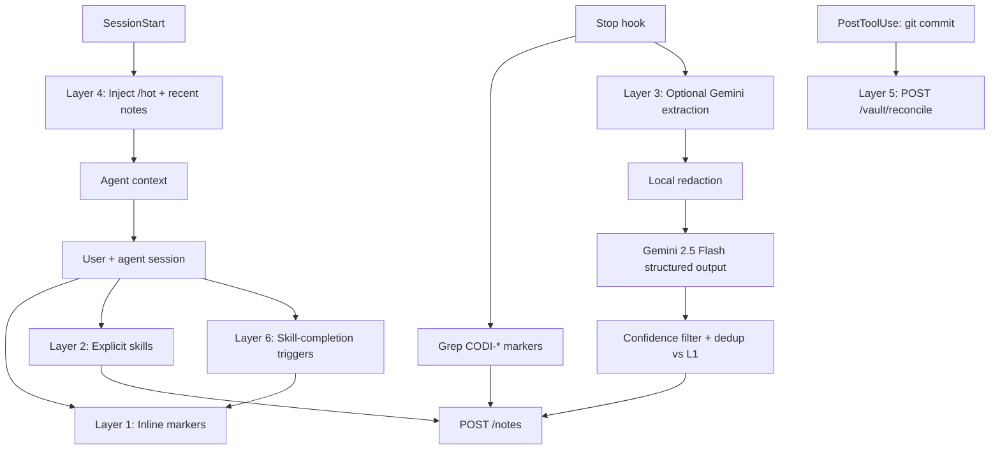
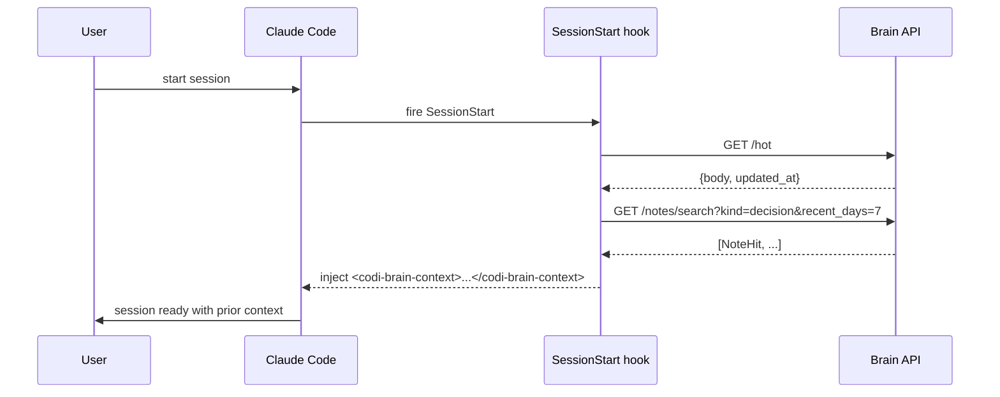
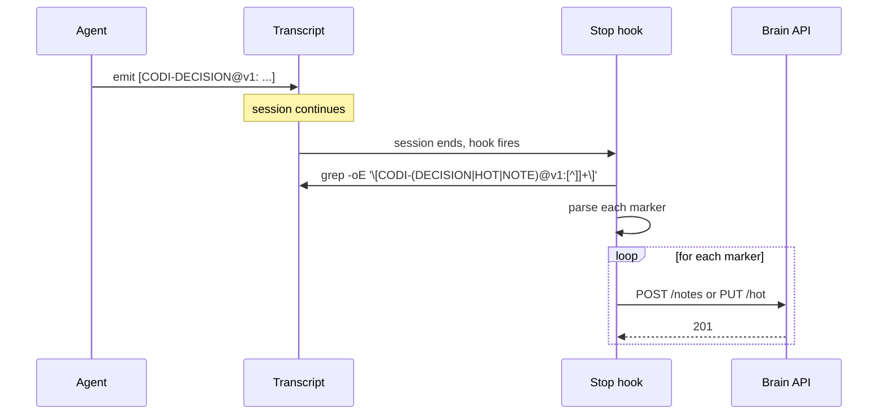
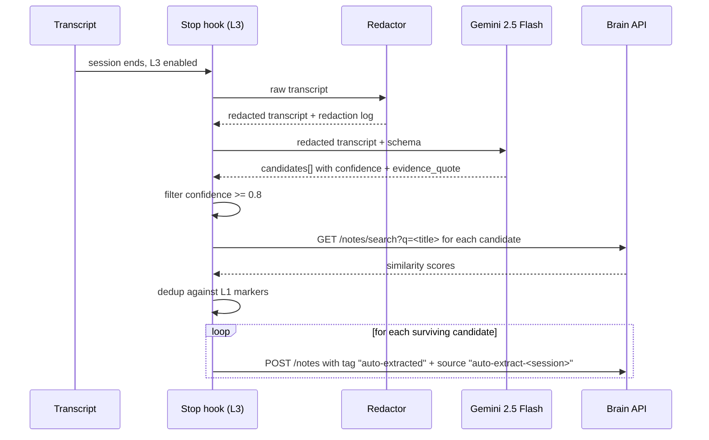
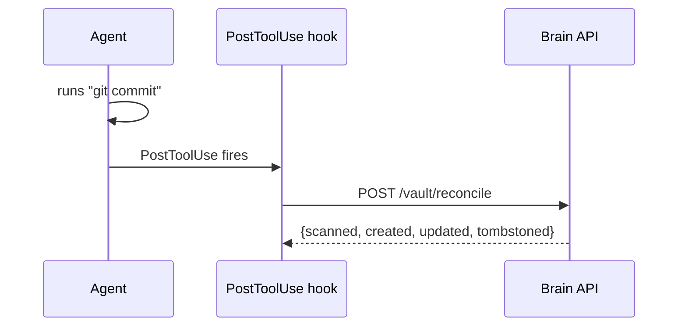

# Codi Brain — Phase 1 Week 2B Design Spec

- **Date**: 2026-04-23 19:28
- **Document**: 20260423_192802_[PLAN]_codi-brain-phase-1-week-2b-design.md
- **Category**: PLAN
- **Depends on**: Week 2A (brain-side Notes API, shipped at `ab3ce83` in `codi-brain`)
- **Agent target (reference)**: Claude Code. Contract documented for Cursor and Codex to follow.

## 1. Goal

By end of Week 2B, opening a Claude Code session in any project that has Codi installed automatically recalls prior decisions and captures new ones. The brain stops being a headless HTTP service and becomes ambient to the user's workflow.

Concrete success criterion: a new user runs `codi add skill codi-brain-*` (and the associated rules + hooks) in a project, starts a Claude Code session, and at end of session at least one decision the user made during that session is searchable via `/codi-brain-recall` in the next session — without any manual POST to the brain.

## 2. Architecture — six layers, each independently useful

Capture and recall are handled by six layers. Each layer is independently valuable and can be disabled without breaking the others. The default install enables five of them; Layer 3 (Gemini extraction) is opt-in.



### Layer 1 — Inline markers (default, free, deterministic)

Agent emits structured markers mid-session, driven by a `codi-brain-capture` rule. Marker schema uses paired XML-style tags with a JSON body. No delimiter ambiguity — any content (brackets, pipes, quotes) is safe inside JSON strings:

```
<CODI-DECISION@v1>
{"title": "Chose Gemini for generation", "reason": "3x cheaper than Haiku", "tags": ["llm", "cost"]}
</CODI-DECISION@v1>

<CODI-HOT@v1>
{"body": "Working on Week 2B client design"}
</CODI-HOT@v1>

<CODI-NOTE@v1>
{"title": "...", "body": "multiline is fine\nwith \"quotes\" and [brackets]", "tags": ["..."]}
</CODI-NOTE@v1>
```

Version tag (`@v1`) keeps old sessions parseable if the schema changes. Stop hook runs a regex over the full transcript with `/s` (DOTALL) flag:

```
<CODI-(DECISION|HOT|NOTE)@v1>\s*(.+?)\s*</CODI-\1@v1>
```

Body is standard JSON, parsed via `JSON.parse` in Node. Malformed JSON → marker logged + skipped (no crash). No LLM call. Full audit trail: every note has a traceable origin block in the transcript.

Mirrors the existing `[CODI-OBSERVATION: ...]` marker system in Codi's continuous-improvement pipeline; the JSON body is the production-grade evolution (the current `[...]` single-line form is fine for short observations but breaks on any content containing `]`).

### Layer 2 — Explicit skills (default, free, user-invocable)

Four skills, generated from Codi's skill-template system into `.claude/skills/`:

- `codi-brain-decide` — writes a decision via `POST /notes`. Invoked explicitly when the user wants to commit a decision mid-session.
- `codi-brain-recall` — searches via `GET /notes/search`. Returns formatted results for agent context.
- `codi-brain-hot-set` — updates hot state via `PUT /hot`.
- `codi-brain-hot-get` — reads hot state via `GET /hot`.

All four are thin wrappers over the brain's HTTP API, implemented through the shared `codi-brain-client` library (see §3).

### Layer 3 — Opt-in Gemini Stop-hook extraction (power-user, cheap, safety-railed)

**Off by default.** Enabled per project via `.codi/config.yaml`:

```yaml
brain:
  auto_extract: true
  auto_extract_model: "gemini-2.5-flash"
  auto_extract_confidence_threshold: 0.8
```

When enabled, at session end the Stop hook:

1. **Local redaction pass (initial set; extensible).** Regex-based redactor strips known-sensitive patterns. Initial set covers the high-prevalence cases; patterns are loaded from `src/brain-client/redactor/patterns.ts` (one named pattern per line) so adding a pattern is a one-file change with a test — explicitly **extensible without schema change**.

   Initial pattern set:
   - OpenAI / Anthropic API keys (`sk-[A-Za-z0-9]{32,}`, `sk-ant-[A-Za-z0-9-]{32,}`)
   - Google API keys (`AIza[A-Za-z0-9-_]{35}`)
   - GitHub PATs (`ghp_[A-Za-z0-9]{36}`, `gho_...`, `ghu_...`, `ghs_...`, `ghr_...`)
   - Slack tokens (`xox[abprs]-[A-Za-z0-9-]{10,}`)
   - JWTs (`eyJ[A-Za-z0-9_-]{20,}\.eyJ[A-Za-z0-9_-]{20,}\.[A-Za-z0-9_-]{20,}`)
   - SSH private key headers (`-----BEGIN (OPENSSH|RSA|DSA|EC) PRIVATE KEY-----`)
   - AWS access keys (`AKIA[0-9A-Z]{16}`)
   - Bearer tokens in HTTP headers (`[Aa]uthorization:\s*[Bb]earer\s+[A-Za-z0-9._-]+`)
   - Passwords in URLs (`://[^:/]+:[^@]+@`)
   - Email addresses (`[A-Za-z0-9._%+-]+@[A-Za-z0-9.-]+\.[A-Z|a-z]{2,}`)
   - `$HOME`-containing paths (computed at hook runtime from `$HOME` env)
   - Hex strings ≥32 chars (likely tokens/hashes)

   Every redacted run logs to `.codi/brain-logs/redaction-<session-id>.jsonl` recording the count of each pattern that fired (never the matched content itself) for audit.

2. **Gemini 2.5 Flash** call with structured output schema:
   ```json
   {
     "candidates": [{
       "title": "string, <=200 chars",
       "body": "string",
       "tags": ["string"],
       "evidence_quote": "string - the exact line from transcript that justifies this",
       "confidence": "number 0-1",
       "type": "decision | fact | hot-state"
     }]
   }
   ```
   The `evidence_quote` field is mandatory — it makes every extracted note auditable against the transcript. If the model hallucinates a decision with no supporting quote, confidence is forced to 0.

6. **Confidence filter (applied after steps 4 + 5).**
   - `confidence >= 0.8` → auto-write to `/notes` with tag `auto-extracted`.
   - `0.5 <= confidence < 0.8` → land in `.codi/pending-notes/<session-id>.jsonl` for review via `/codi-brain-review`.
   - `confidence < 0.5` → discarded, logged to `.codi/brain-logs/low-confidence-<session-id>.jsonl`.

4. **Dedup against Layer 1 markers (ordering contract).** Layer 1 and Layer 3 run inside a single `codi-brain-stop.cjs` hook in strict sequence: L1 parses + POSTs all markers first, storing each marker's `note_id` + title in an in-memory set. L3 then dedups each candidate against that in-memory set by exact title normalization (lowercase + whitespace collapse) as a first pass, then cosine similarity via `GET /notes/search?q=<title>&limit=5` as a second pass — similarity > 0.7 skips the candidate. A single hook eliminates any ordering race between separate Stop hooks.

5. **Evidence-quote verification (anti-hallucination).** Before writing, verify that `candidate.evidence_quote` is a substring of the redacted transcript (case-insensitive, whitespace-normalized). If not, force `confidence = 0` regardless of the model's self-reported value. This catches the common case where Gemini synthesizes a plausible-sounding quote that was never actually in the transcript.

7. **Session fingerprint tag.** Every auto-extracted note gets `source: "auto-extract-<session-id>"` metadata, enabling a future `/codi-brain-undo-session <session-id>` rollback skill.

**Why Gemini 2.5 Flash, not Haiku:**
- ~1/3 the cost per input/output token at equivalent extraction quality.
- 1M context window handles long sessions without truncation (Haiku caps at 200k).
- Structured-output (JSON schema) is first-class in the Gemini SDK.
- `GEMINI_API_KEY` is already in codi-brain's `.env`, no new secret surface.

### Layer 4 — SessionStart recall (default, free)

SessionStart hook fires before the user's first message. It makes two HTTP calls to the brain:

1. `GET /hot` → if non-empty body, injects into agent context as:
   ```
   <codi-brain-context>
   You are resuming work on project <project_id>.
   Hot state: <body>
   Last updated: <timestamp>
   </codi-brain-context>
   ```

2. `GET /notes/search?kind=decision&recent_days=7&limit=10` → injects recent decisions:
   ```
   Recent decisions (last 7 days):
   - [2026-04-22] Chose Gemini for generation (cost: 3x cheaper than Haiku)
   - [2026-04-21] Use modular monolith for brain services
   ...
   ```

Failure handling: if brain is unreachable, inject `<codi-brain-context>brain unavailable — recall disabled for this session</codi-brain-context>` and continue. Never blocks session start.

### Layer 5 — Reconcile on git commit (default, free)

PostToolUse hook on the `Bash` tool with command matching `^git commit`. After a successful commit, fires `POST /vault/reconcile` against the brain. This keeps Memgraph + Qdrant synced with any markdown edits the user made via Obsidian between sessions (the brain's filesystem watcher picks up changes while brain-api is running, but misses edits made while the stack was down).

**Known coverage gap:** L5 only fires on Bash-tool `git commit` invocations. Commits made through other paths (GUI clients, `gh pr merge --squash`, Obsidian-git plugin auto-commit) do not trigger L5. The brain's scheduled reconcile (Week 2A, default 15min) and its startup reconcile close the gap eventually, so this is a latency concern not a correctness concern. Acceptable for Week 2B.

Fails silently: if brain is unreachable, the change gets picked up on the next SessionStart's reconcile (existing Week 2A behavior).

### Layer 6 — Skill-completion trigger markers (default, free)

When the following Codi skills complete successfully, they emit a Layer 1 marker as part of their completion output — no separate hook required:

- `codi-brainstorming` approves a design spec → emits one `[CODI-DECISION@v1: <title> | ...]` per major decision in the spec, plus one `[CODI-HOT@v1: working on <feature-name>]` for the session's focus.
- `codi-branch-finish` merges a PR → emits `[CODI-DECISION@v1: merged PR #<num> — <one-line summary> | tags: <auto-extracted from commit messages>]`.
- `codi-debugging` concludes with a root cause → emits `[CODI-DECISION@v1: root cause = <x>, fix = <y> | tags: debugging, <domain>]`.

These are narrow, predictable trigger points → known-good notes without any extraction LLM.

## 3. Components

### 3.1 `codi-brain-client` — Node/TypeScript library

New package at `src/brain-client/` in the Codi CLI repo. Thin typed wrapper over the brain's HTTP API.

Public surface:
```typescript
export interface BrainClient {
  createNote(input: CreateNoteInput): Promise<NoteResponse>;
  searchNotes(query: SearchQuery): Promise<NoteHit[]>;
  getHot(): Promise<HotResponse>;
  putHot(body: string): Promise<HotResponse>;
  reconcile(paths?: string[]): Promise<ReconcileReport>;
  health(): Promise<HealthResponse>;
}

export function createBrainClient(config: BrainClientConfig): BrainClient;
```

Behavior:
- **Auth**: reads `BRAIN_BEARER_TOKEN` from env (config override available). Adds `Authorization: Bearer <token>` header.
- **Base URL**: reads `BRAIN_URL` from env, defaults to `http://127.0.0.1:8000`.
- **Retries**: 3x with exponential backoff on 5xx + network errors. No retry on 4xx.
- **Outbox fallback**: on unrecoverable write failure, persists the pending request to `.codi/brain-outbox/<timestamp>.json`. A separate `flushOutbox()` method (called on SessionStart by Layer 4 hook) drains the outbox.
- **No silent failures**: every failure logs to stderr with a structured event. Callers can choose to swallow or propagate.

Consumer of this library: every Layer 1/2/3/4/5/6 hook and skill. Single shared implementation.

### 3.2 Skills (Layer 2)

Four skills under `src/templates/skills/`:
- `codi-brain-decide`
- `codi-brain-recall`
- `codi-brain-hot-set`
- `codi-brain-hot-get`

Each skill template follows the existing Codi skill schema (`template.ts` with frontmatter + markdown). Supported platforms: `claude-code` for Week 2B ship; `cursor` and `codex` emit best-effort variants for Week 2C.

Additionally:
- `codi-brain-review` — surfaces `.codi/pending-notes/*.jsonl`, prompts user to accept/edit/discard, flushes approved ones to brain.
- `codi-brain-undo-session` — takes a session-id, finds all notes tagged `auto-extract-<session-id>`, soft-deletes them.

### 3.3 Hooks (Layers 1, 3, 4, 5)

Three hook files generated under `.codi/hooks/` (Node `.cjs` scripts, matching the existing Codi hook pattern — see `codi-skill-observer.cjs` / `codi-skill-tracker.cjs`). Registration is inserted into `.claude/settings.json` under the `hooks` key, using the standard Claude Code hook-event names (`SessionStart`, `Stop`, `PostToolUse`):

| Hook file | Registered event | Layers | Behavior |
|---|---|---|---|
| `codi-brain-session-start.cjs` | `SessionStart` | L4 + outbox-flush | (1) Flush `.codi/brain-outbox/*` to brain (POST each queued op, delete on success); (2) GET /hot + recent decisions; (3) inject into context |
| `codi-brain-stop.cjs` | `Stop` | L1 + L3 | (1) Parse markers + POST (L1); (2) if `auto_extract: true`, run redactor → Gemini → verify → filter → dedup-vs-L1 → POST (L3); strict sequence, single hook to eliminate ordering races |
| `codi-brain-post-commit.cjs` | `PostToolUse` with matcher for Bash `git commit` | L5 | POST /vault/reconcile |

Hook-runner semantics:
- `timeout: 10` (seconds) — exceeds the 2-second typical case; prevents runaway hooks from blocking the session.
- `async: true` on SessionStart and PostToolUse (non-blocking, user can proceed immediately). Stop hook is **synchronous** because the session is ending anyway and marker-POST correctness matters more than latency.
- `matcher: ""` for SessionStart and Stop (fire always), and a Bash-command regex matcher (`"Bash:^git\\s+commit"`) for PostToolUse.

Hooks are generated via `codi generate` into per-agent directories. The hook-runner already supports this pattern for Claude Code, Cursor, and Codex.

Every hook:
- Is idempotent.
- Fails silently with a single stderr log line + outbox enqueue.
- Has a `CODI_BRAIN_DISABLED=1` escape hatch env var — power-user opt-out without uninstalling.
- Completes in under 2 seconds in the typical case; hard-times out at 10s to avoid blocking the session.

### 3.4 Rules (Layer 1 — tells agent when to emit markers)

One rule `codi-brain-capture` added via Codi's rule-template system. Tells the agent:
- What the marker schema is (`[CODI-DECISION@v1: ...]` etc.).
- When to emit: after a design decision, a root-cause conclusion, a library/tool choice, a refactoring decision, or on direct instruction ("remember this").
- When NOT to emit: for exploratory back-and-forth, for questions, for information the user explicitly said not to persist.
- How to structure: title concise, reason one sentence, tags 1-3 items.

Rule is `priority: medium`, `alwaysApply: true` so it applies to every session without requiring a slash-command trigger.

### 3.5 CLI subcommand

One new Codi CLI subcommand: `codi brain <verb>`.

- `codi brain status` — pings `/healthz`, shows subsystem states.
- `codi brain search "query"` — non-interactive search (for scripts + shell users).
- `codi brain decide "title" --body "..." --tags a,b,c` — non-interactive decision write.
- `codi brain hot [--set "..."]` — get or set hot state.
- `codi brain outbox [--flush]` — inspect or flush the local outbox.
- `codi brain undo-session <id>` — same as the skill, but from CLI.

Implemented in `src/cli/brain.ts`, wired through `src/cli/index.ts` alongside the existing 43 subcommands. Uses the same `codi-brain-client` library as the hooks and skills.

## 4. Data flow

### 4.1 Read path (recall)



### 4.2 Write path — inline markers (L1)



### 4.3 Write path — Gemini extraction (L3, opt-in)



### 4.4a Concurrent sessions

Two Claude Code windows open simultaneously in the same project:

| Resource | Concurrency strategy |
|---|---|
| `.codi/brain-outbox/<ts>_<session-id>.json` | Session-id in filename breaks millisecond-collision ties. Each file is a single self-contained op, atomic on create. Concurrent flush is safe (delete-on-success). |
| `.codi/pending-notes/<session-id>.jsonl` | Session-id in filename; no two sessions write the same file. |
| `/hot` singleton | Week 2A's VaultWriteContext serializes writes via VaultLock (writer-preference RW-lock). Concurrent PUT /hot → last-write-wins at the brain, acceptable for session-scoped ephemeral state. |
| `/notes` writes | No concurrency concern; each note is independent with its own UUID. |
| SessionStart injection | Both windows get the same `/hot` body + same recent-decisions list, which is correct. |

Explicit choice: **last-write-wins for `/hot`**, not last-commit-wins. The hot state is session ephemera, not a shared document. Richer conflict resolution is deferred to Phase 2 if ever needed.

### 4.4b Configuration resolution

Configuration precedence (highest wins):

1. Environment variable (`BRAIN_URL`, `BRAIN_BEARER_TOKEN`, `BRAIN_AUTO_EXTRACT`)
2. Project `.codi/config.yaml` under `brain:` key
3. User-global `~/.codi/config.yaml` under `brain:` key
4. Built-in defaults (`BRAIN_URL=http://127.0.0.1:8000`, `auto_extract=false`, no token)

Config-file resolution:
- **Missing file**: use defaults silently (no warning).
- **Malformed YAML / unreadable**: log `WARN brain config parse error at <path>: <err>` to stderr once per hook invocation, fall back to defaults. L3 Gemini extraction in particular fails **closed** (disabled) on config parse error — never runs with partial config.
- **Missing `BRAIN_BEARER_TOKEN`**: hooks log `WARN codi-brain token not configured; disabling recall/capture for this session`. Skills return a clear error: `Set BRAIN_BEARER_TOKEN in env or .codi/config.yaml to enable /codi-brain-*`. CLI `codi brain status` reports `token: not-configured`.

### 4.4c Migration path for existing Codi-installed projects

An existing project that already ran `codi add` for Week 1 skills gets Week 2B via:

1. `codi update` — pulls the new skills/rules/hooks into `.codi/` under `managed_by: codi` ownership. Re-runs `codi generate` to emit per-agent artifacts. No user action needed beyond the single command.
2. Or explicit `codi add skill codi-brain-decide` (etc.) for users who want granular control.

The Week 2B install is non-destructive: it adds new artifacts and does not modify any Week 2A brain-side code. Existing projects need no data migration.

### 4.5 Reconcile path (L5)



## 5. Error handling

| Failure mode | Handling |
|---|---|
| Brain API unreachable | All hooks log to stderr + enqueue to `.codi/brain-outbox/`. Next SessionStart flushes. |
| Brain returns 4xx | Log + skip (do not retry). Outbox not used for 4xx (client error, retry won't help). |
| Brain returns 5xx | Retry 3x with exponential backoff (100ms → 400ms → 1.6s). Final failure → outbox. |
| Gemini API error (L3) | Skip extraction for this session, log to `.codi/brain-logs/extract-errors.jsonl`. L1 markers still process. |
| Redaction regex bug | Fail-closed: if redactor throws, skip L3 entirely for this session. Never send un-redacted transcript. |
| Rate limit hit | Respect `Retry-After` header, otherwise exponential backoff. |
| Hook timeout (10s) | Kill hook, log, continue session. No persistent damage — outbox picks up next time. |
| Transcript too large for Gemini (>1M tokens) | Skip L3 for this session with a warning. L1 markers still process. |
| Marker parse error (malformed JSON body) | Log the marker + parse error, skip it, continue with remaining markers. Never aborts the full Stop hook. |
| Outbox file corrupted | Move to `.codi/brain-outbox/quarantine/`, log, start fresh. |
| Config file missing | Silent fallback to defaults. |
| Config file malformed | Single WARN log line, fall back to defaults. L3 fails closed. |
| `BRAIN_BEARER_TOKEN` unset | Hooks log once per session + disable; skills return actionable error; CLI `status` reports unconfigured state. |
| Evidence_quote not found in transcript | Force confidence = 0. Candidate discarded. |
| Concurrent session racing on `/hot` | Accept last-write-wins. Brain's VaultLock serializes internally. |

**Invariant**: no hook failure blocks the user's session.

## 6. Testing approach

### 6.1 `codi-brain-client` library (unit)

- HTTP mock via `msw` or `nock`: happy-path for each method, retry behavior, outbox fallback.
- Integration test against live Week 2A stack using Testcontainers (same approach as codi-brain's test_scenario_c.py).
- Target coverage: >90% for the client library (it's the foundation).

### 6.2 Skills (integration)

- Each skill template tested via Codi's existing skill-testing framework (`docs/20260411_153614_[PLAN]_skill-testing-framework.md`).
- Assertions: correct HTTP call shape, correct env var consumption, correct error-envelope handling.

### 6.3 Hooks (integration + E2E)

- Unit: parse marker transcripts of varied shape, assert correct POST payloads.
- E2E: fixtures for (a) transcript with 3 markers + Brain up → 3 notes created; (b) transcript with markers + Brain down → 3 entries in outbox; (c) SessionStart with brain up → context injected; (d) SessionStart with brain down → graceful degrade; (e) L3 with redaction → sensitive patterns not present in Gemini payload.
- Property test: redactor must never emit any substring matching the sensitive patterns from its input.

### 6.4 CLI

- Each `codi brain <verb>` subcommand tested via the existing vitest CLI harness.

### 6.5 Rule (`codi-brain-capture`)

The rule is prose that tells the agent when to emit markers. Testing is manual + scenario-based:
- **Manual validation**: run 3 representative sessions (design session, debug session, exploration session), read the transcripts, verify markers appear at the expected decision points.
- **Regression fixture**: one transcript frozen in `tests/fixtures/capture-rule/` with annotated "expected marker here" points; run the Stop hook against it and verify the expected markers were emitted and POSTed.
- **Negative fixture**: a transcript that should emit zero markers (pure exploration with no decisions); verify the hook POSTs nothing.

### 6.6 End-to-end ship test

A Testcontainers-backed E2E test (canonical Week 2B ship criterion) that:
1. Spins up the Week 2A brain stack.
2. Simulates a full SessionStart → inline markers → Stop flow.
3. Verifies: L4 recall injected the right context, outbox flushed, L1 markers became notes, L5 reconcile fired on commit.
4. Flips `auto_extract: true` (with a stub Gemini responder that returns known candidates) and verifies: redaction applied, evidence_quote verified, confidence filter applied, dedup against L1 skipped the duplicate.
5. Simulates concurrent-session case: two SessionStart → two Stop flows in parallel; verifies no outbox corruption, no pending-notes file collision.

Analogous to Week 2A's `test_scenario_c.py`, client-side.

## 7. Out of scope for Week 2B

Explicitly deferred:
- **Cursor + Codex reference implementations.** Week 2B ships Claude Code support and documents the hook/skill contract. Week 2C applies the contract to Cursor + Codex.
- **Web UI for reviewing notes.** Obsidian remains the read UI.
- **Multi-user support.** Phase 2 concern.
- **Non-text tool-call capture.** Write-side hooks only look at markers and transcript — they don't snapshot tool-call payloads or file diffs. A future layer could, if needed.
- **Real-time streaming** from brain to agent. Pull-on-SessionStart is sufficient for Phase 1.

## 8. Open questions

None that block implementation. Resolved during brainstorming:

1. ~~Client library language~~ → Node/TypeScript (matches Codi CLI).
2. ~~Capture model~~ → Layered: markers (default) + skills (default) + opt-in Gemini + SessionStart recall + PostToolUse reconcile + skill-completion triggers.
3. ~~Extraction LLM~~ → Gemini 2.5 Flash (cheaper, 1M context, first-class structured output, key already in env).
4. ~~Agent portability order~~ → Claude Code first (reference), Cursor + Codex in Week 2C.
5. ~~Confidence threshold for auto-extraction~~ → 0.8 auto-write, 0.5-0.8 pending-review, <0.5 discarded.

## 9. Ship criterion

The E2E test in §6.6 is the canonical ship gate. Additionally:

- `codi add skill codi-brain-{decide,recall,hot-set,hot-get,review,undo-session}` succeeds and emits `.claude/skills/` entries.
- `codi add rule codi-brain-capture` succeeds and emits `.claude/rules/` entry.
- `codi add hook codi-brain-{session-start,stop,post-commit}` succeeds.
- `codi update` on an existing Week-1-installed project auto-installs the Week 2B artifacts without user action beyond the command.
- `codi brain status` returns green against a running Week 2A stack; reports clear unconfigured-state messaging when `BRAIN_BEARER_TOKEN` is missing.
- New test count delta roughly matches Week 2A (+80-100 tests) with >90% coverage on the client library.
- Documentation: one handoff report + one updated roadmap showing Week 2B complete, Week 2C queued + one cross-agent contract doc (the Cursor + Codex integration contract the next week will implement against).

## 10. Estimated effort

3-5 days, comparable to Week 2A. Breakdown rough estimate:
- Day 1: `codi-brain-client` library + unit tests.
- Day 2: 4 skills + CLI subcommand + skill tests.
- Day 3: Layer 1 + Layer 4 + Layer 5 hooks + integration tests.
- Day 4: Layer 3 (Gemini extraction + redactor + dedup) + E2E test.
- Day 5: `codi-brain-review` + `codi-brain-undo-session` + handoff docs + cross-agent contract doc for Cursor + Codex.

## 11. References

- Phase 1 parent plan: `docs/20260422_230000_[PLAN]_codi-brain-phase-1.md`
- Phase 1 impl plan (week-by-week): `docs/20260423_010000_[PLAN]_codi-brain-phase-1-impl.md`
- Week 2A design spec: `docs/20260423_115429_[PLAN]_codi-brain-phase-1-week-2a-design.md`
- Week 2A impl plan: `docs/20260423_120127_[PLAN]_codi-brain-phase-1-week-2a-impl.md`
- Week 2A handoff report: `docs/20260423_164719_[REPORT]_codi-brain-phase-1-week-2a-progress.md`
- Phase 1 roadmap (Week 2B/3 + Phase 2 preview): `docs/20260423_170000_[ROADMAP]_codi-brain-phase-1-next-phases.md`
- Codi existing marker pipeline: `.claude/rules/codi-improvement-dev.md` (`[CODI-OBSERVATION: ...]` system)
- Codi skill-testing framework: `docs/20260411_153614_[PLAN]_skill-testing-framework.md`
