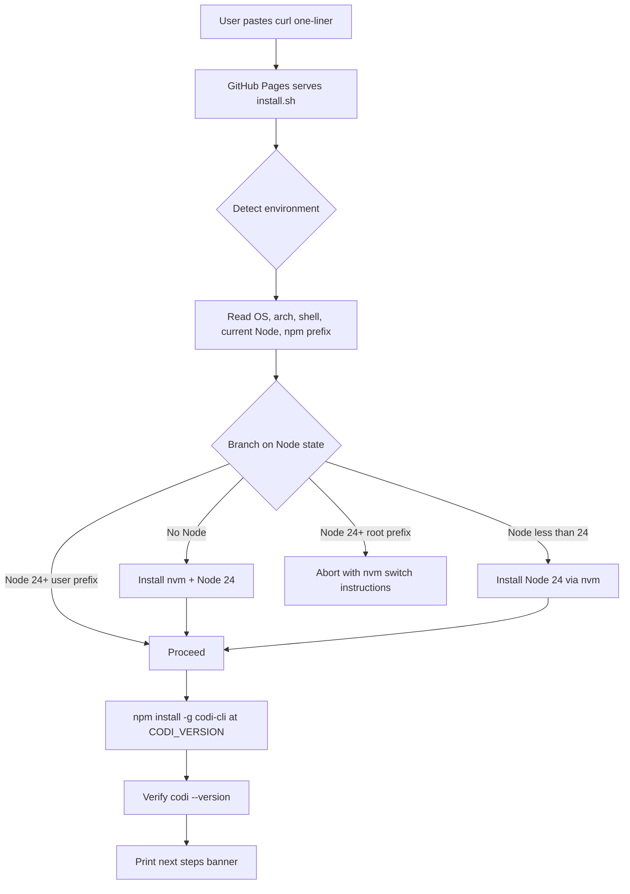
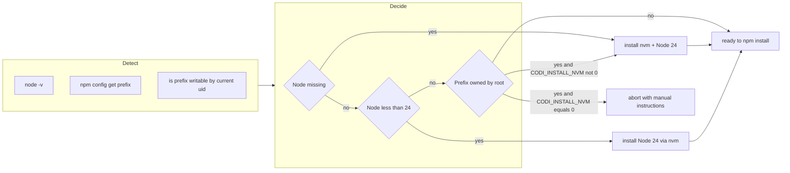

# Curl Installer — Design Specification

- **Date**: 2026-04-24 13:27
- **Document**: 20260424_1327_SPEC_curl-installer.md
- **Category**: SPEC
- **Status**: Approved (decisions locked, ready for plan)

## 1. Problem & Context

Users installing Codi via `npm install -g codi-cli@latest` on a fresh macOS hit two stacked failures:

1. **EACCES on `/usr/local/lib/node_modules`** — system Node is owned by root, so `npm install -g` requires `sudo` or a user-owned npm prefix.
2. **Engine mismatch** — Codi requires Node 24+ for npm 11 (OIDC publish, modern lockfile). System Node on many machines is 20.x or older.

The current `package.json` declares `"engines": { "node": ">=20" }`, which is too lax: npm permits the install even though Codi's CI, hooks, and release pipeline all assume Node 24.

Result: users see a confusing EACCES error instead of an actionable "your Node is too old, here is the one-command fix" message.

## 2. Goals

- Make first-time install succeed in one paste, with no prior Node setup
- Surface engine mismatches with an actionable error before EACCES can occur
- Reuse existing infrastructure (GitHub Pages already deploys `site/`) — no new hosting
- Stay reversible: users with managed Node setups (nvm, volta, fnm, asdf, system pkg manager) must not be silently overwritten

## 3. Non-Goals

- Bundling Node into Codi (Codi is and remains a Node CLI distributed via npm)
- Replacing the npm install path (it stays as the canonical mechanism; the installer wraps it)
- Windows support in v1 (deferred to follow-up PR — see §11)
- Custom domain (works fine on `lehidalgo.github.io/codi/`; domain is an orthogonal upgrade)

## 4. Constraints

### 4.1 The chicken-and-egg constraint

`npm install -g codi-cli` cannot self-heal a permissions failure. When `mkdir /usr/local/lib/node_modules/codi-cli` fails, npm aborts before any of our package's `preinstall`, `postinstall`, or main code runs. The directory was never created, so there is nothing to execute. **No code we ship inside the npm package can fix this case.** That forces the fix to live *outside* the npm install — hence the curl installer.

### 4.2 Hosting reality

GitHub Pages (`.github/workflows/pages.yml`) uploads the entire `site/` directory as the Pages artifact on every push to `main`. Anything dropped at `site/install.sh` is automatically served at:

```
https://lehidalgo.github.io/codi/install.sh
```

No new infra, no Astro changes, no domain. The Pages workflow already triggers on `site/**`.

### 4.3 Curl-pipe-bash threat model

`curl ... | bash` is criticized because the script can detect a TTY-bound `bash` and serve different content than what `curl ...` shows. Mitigations: serve the script verbatim (no UA-based variation), publish a SHA-256 alongside, and document the inspect-then-run path:

```bash
curl -fsSL https://lehidalgo.github.io/codi/install.sh -o install.sh
shasum -a 256 install.sh    # compare to published checksum
bash install.sh
```

## 5. Decisions Locked

| ID | Decision | Choice | Rationale |
|----|----------|--------|-----------|
| D1 | Install nvm if Node missing/old? | **Yes**, with opt-out via `CODI_INSTALL_NVM=0` | Most users have no Node manager; matches Bun/Volta/oh-my-zsh precedent. Opt-out preserves agency for managed setups. |
| D2 | Pin Node version or allow ≥24? | **Pin to Node 24** | Matches `.nvmrc`, all CI workflows, and memory rule "Node 24 only for codi dev". Single supported baseline reduces variance. |
| D3 | Allow rewriting npm prefix when system Node detected? | **No** | Mutating `npm config prefix` is invasive, persists across all Node usage, and breaks unrelated globally-installed tools. Refuse and instruct nvm switch instead. |
| D4 | Windows support in v1? | **Defer** | Bash installer first, PowerShell follow-up. Avoids doubling surface area before validating the Unix path. |
| D5 | Where to host the script? | **GitHub Pages** at `https://lehidalgo.github.io/codi/install.sh` | Zero new infra, already deployed by `pages.yml`, Pages caches via Fastly CDN. Custom domain is an orthogonal future upgrade. |

## 6. Architecture

### 6.1 End-to-end install flow



### 6.2 Decision matrix inside the script



### 6.3 Detection details

| Check | Command | Pass condition |
|-------|---------|----------------|
| OS | `uname -s` | `Darwin` or `Linux` |
| Arch | `uname -m` | `arm64`, `aarch64`, `x86_64` (informational only) |
| Node present | `command -v node` | exit 0 |
| Node version | `node -p "process.versions.node.split('.').map(Number)"` | major ≥ 24 |
| npm prefix | `npm config get prefix` | path writable by current uid (`[ -w "$prefix" ]`) |
| nvm present | `command -v nvm \|\| [ -s "$HOME/.nvm/nvm.sh" ]` | informational |
| Shell rc | derive from `$SHELL` | matches `bash`/`zsh`/`fish` (others: warn-only) |

## 7. File Layout

```
site/
  install.sh              # NEW — the installer (≤ 300 LOC)
  install.sh.sha256       # NEW — published checksum, regenerated by CI

scripts/
  generate_installer_checksum.mjs   # NEW — used by pages.yml

src/
  cli/
    doctor.ts             # MODIFIED — add Node version + prefix checks
  core/
    health/
      env-checks.ts       # NEW — reusable Node/npm env checks (called by doctor)

.github/
  workflows/
    pages.yml             # MODIFIED — generate checksum step
    installer-test.yml    # NEW — matrix test (ubuntu, macos)
    release.yml           # MODIFIED (deferred to PR #2) — attach install.sh as release asset

package.json              # MODIFIED — engines.node bumped to >=24

README.md                 # MODIFIED — install section restructured
docs/src/content/...      # MODIFIED — install guide page
```

All paths are relative to repo root. No file exceeds the 700-LOC source limit; `install.sh` is targeted at ≤ 300 LOC.

## 8. Public Interface

### 8.1 User-facing one-liner

```bash
curl -fsSL https://lehidalgo.github.io/codi/install.sh | bash
```

### 8.2 Environment variables

| Variable | Default | Purpose |
|----------|---------|---------|
| `CODI_VERSION` | `latest` | Pin a specific Codi version (e.g. `2.11.0`) |
| `CODI_INSTALL_NVM` | `1` | Set `0` to refuse nvm install — script aborts with manual instructions instead |
| `CODI_NODE_VERSION` | `24` | Override the Node major to install (escape hatch; not advertised) |
| `CODI_DRY_RUN` | `0` | Set `1` to print actions without executing |
| `CODI_NO_COLOR` | `0` (auto-detect TTY) | Disable ANSI color output |

### 8.3 Exit codes

| Code | Meaning |
|------|---------|
| 0 | Codi installed and verified |
| 1 | Generic failure (caught by `set -e`) |
| 10 | Unsupported OS |
| 11 | Node 24+ required, user opted out of nvm install |
| 12 | npm prefix is root-owned, user opted out of nvm install |
| 13 | npm install of `codi-cli` failed (network or registry) |
| 14 | Post-install verification failed (`codi --version` not found on PATH) |

### 8.4 Doctor enhancement

`codi doctor` adds two checks (always run, never block):

- `node-version` — warn if `process.versions.node` major < `engines.node` minimum
- `npm-prefix` — warn if `npm config get prefix` is not writable by current uid

Each warning includes the curl one-liner as the suggested fix. Implementation lives in `src/core/health/env-checks.ts` and is wired into `runAllChecks` so the `--ci` flag promotes warnings to failures.

## 9. Security Considerations

| Risk | Mitigation |
|------|------------|
| Pages serves modified script | Publish `install.sh.sha256` alongside; document inspect-then-run path; CI regenerates checksum on every deploy |
| Script edits user shell rc unexpectedly | Only when installing nvm; print exact lines being added; respect `CODI_INSTALL_NVM=0` |
| Pinned version becomes vulnerable | `CODI_VERSION=latest` is the recommended path; pinned installs are user-explicit |
| Network MITM | `curl -fsSL` requires HTTPS; GitHub Pages enforces TLS; checksum gives second factor |
| Supply chain (compromised GitHub account) | Out of scope for v1; mitigated by future Sigstore signing on release assets |

## 10. Risks & Mitigations

| Risk | Likelihood | Impact | Mitigation |
|------|------------|--------|------------|
| nvm install URL changes | Low | Medium | CI installer test runs on every PR; failure surfaces within hours |
| GitHub Pages cache serves stale script | Medium | Low | Pages CDN TTL is 10 min; document `?v=N` cache-busting query param if needed |
| User has unusual shell (nu, xonsh) | Low | Low | Detect → fall back to printing manual PATH instructions |
| Engines bump breaks downstream consumers on Node 20 | Medium | Medium | Coordinate via CHANGELOG entry; bump Codi minor version simultaneously |
| Doctor check false positive on managed prefix | Low | Low | Warning only — never blocks unless `--ci` |

## 11. Out of Scope (this spec)

- `install.ps1` for Windows — separate spec, separate PR
- Release-asset hosting (`/releases/download/...`) — separate PR, low priority
- Sigstore/Cosign signing — future supply-chain hardening
- Custom domain (`codi.dev` or similar) — orthogonal infra concern
- Auto-update of `codi` itself (`codi self-update`) — separate feature

## 12. Open Questions

None. All decisions resolved in §5. Implementation plan can proceed.

## 13. References

- `.github/workflows/pages.yml` — current Pages deploy
- `astro.config.mjs` — confirms `site/` is the Pages artifact root
- `src/cli/doctor.ts` — current doctor implementation
- `package.json:51` — current engines field (target of bump)
- nvm install reference: https://github.com/nvm-sh/nvm
- npm engines docs: https://docs.npmjs.com/cli/v10/configuring-npm/package-json#engines
