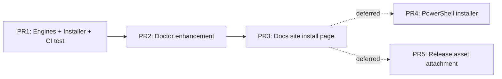
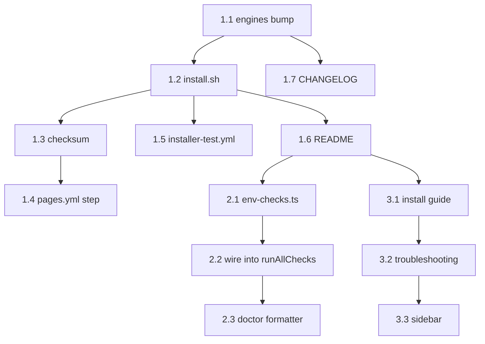

# Curl Installer — Implementation Plan

- **Date**: 2026-04-24 13:30
- **Document**: 20260424_1330_PLAN_curl-installer-impl.md
- **Category**: PLAN
- **Spec**: 20260424_1327_SPEC_curl-installer.md

## Overview

Three pull requests, sequenced. Each PR is independently revertable. Tasks are atomic (≤ 30 min each) and listed with the exact files touched and the verification command.



## PR Boundaries

| PR | Scope | Why this boundary |
|----|-------|-------------------|
| **PR #1** | Engines bump, `install.sh`, checksum, CI test, README install section | Self-contained user-facing fix; ships value immediately |
| **PR #2** | `codi doctor` Node + prefix checks | Code-only; needs PR #1's curl URL in error messages so it lands second |
| **PR #3** | Docs site install guide + troubleshooting page | Pure documentation; can land any time after PR #1 |
| PR #4 (deferred) | `install.ps1` for Windows | Separate platform validation cycle |
| PR #5 (deferred) | `release.yml` attaches `install.sh` to release artifacts | Enables pinned `/releases/download/...` URL |

---

## PR #1 — Engines + Installer + CI test

### Task 1.1 — Bump engines field

**File:** `package.json`
**Change:** `"engines": { "node": ">=20" }` → `"engines": { "node": ">=24" }`
**Verify:** `node -e 'console.log(require("./package.json").engines.node)'` prints `>=24`
**Why:** turns confusing EACCES into clear engine error for stale Node before npm even tries `mkdir`.

### Task 1.2 — Create `site/install.sh`

**File:** `site/install.sh` (new)
**LOC budget:** ≤ 300
**Structure** (top to bottom):

1. Shebang + `set -euo pipefail` + IFS hardening
2. Constants: `CODI_NODE_VERSION=24`, `NVM_VERSION=v0.39.7`, exit code constants
3. Color helpers (respect `CODI_NO_COLOR` and `[ -t 1 ]`)
4. `log_info`, `log_warn`, `log_error`, `die` helpers
5. `detect_os()` → sets `OS_KIND` to `darwin` | `linux` | exits 10
6. `detect_node()` → sets `NODE_PRESENT`, `NODE_MAJOR`
7. `detect_npm_prefix()` → sets `NPM_PREFIX`, `PREFIX_WRITABLE`
8. `detect_shell_rc()` → sets `SHELL_RC` path
9. `print_plan()` — prints what the script will do; honors `CODI_DRY_RUN`
10. `install_nvm()` — sources upstream install script at pinned `NVM_VERSION`
11. `install_node()` — `nvm install $CODI_NODE_VERSION && nvm use $CODI_NODE_VERSION && nvm alias default $CODI_NODE_VERSION`
12. `install_codi()` — `npm install -g codi-cli@${CODI_VERSION:-latest}`
13. `verify_install()` — `codi --version` must succeed, must print non-empty
14. `print_next_steps()` — banner with `codi init`, `codi doctor`, `codi hub`
15. `main()` — orchestrates per the §6.2 decision matrix

**Verify:** `bash -n site/install.sh` (syntax check) + manual run on a fresh container in Task 1.5.

### Task 1.3 — Generate initial checksum

**File:** `site/install.sh.sha256` (new)
**Command:** `shasum -a 256 site/install.sh > site/install.sh.sha256`
**Verify:** `shasum -a 256 -c site/install.sh.sha256` returns OK.

### Task 1.4 — CI step to regenerate checksum on every Pages deploy

**File:** `.github/workflows/pages.yml`
**Change:** Insert before the `actions/upload-pages-artifact` step:

```yaml
- name: Regenerate installer checksum
  run: shasum -a 256 site/install.sh > site/install.sh.sha256
```

**Why:** prevents drift between the served script and its published checksum if a contributor edits one without the other.
**Verify:** push to a branch, observe workflow log, confirm `site/install.sh.sha256` in the uploaded artifact matches the script.

### Task 1.5 — Installer integration test workflow

**File:** `.github/workflows/installer-test.yml` (new)
**Triggers:** `pull_request` on paths `site/install.sh`, `site/install.sh.sha256`, `.github/workflows/installer-test.yml`
**Matrix:** `runs-on: [ubuntu-latest, macos-latest]`
**Steps:**

1. Checkout
2. Use a clean shell (no preinstalled Node — uninstall on the runner if needed via `nvm deactivate && nvm uninstall <preinstalled>` or use a Node-less container for ubuntu)
3. Run `bash site/install.sh` with `CODI_INSTALL_NVM=1` and `CODI_VERSION=latest` (or a known-good pinned version for stability)
4. Source the modified shell rc
5. Assert `codi --version` exits 0

**Verify:** workflow green on PR; if red, surfaces installer regressions before merge.

### Task 1.6 — README install section rewrite

**File:** `README.md`
**Change:** Replace the current install snippet with a two-tier block:

```markdown
## Install

### Quick install (recommended)

curl -fsSL https://lehidalgo.github.io/codi/install.sh | bash

### Manual install (if you already manage Node)

Requires Node >= 24 and npm >= 11.

npm install -g codi-cli@latest

### Verify the installer (security-conscious)

curl -fsSL https://lehidalgo.github.io/codi/install.sh -o install.sh
curl -fsSL https://lehidalgo.github.io/codi/install.sh.sha256 -o install.sh.sha256
shasum -a 256 -c install.sh.sha256
bash install.sh
```

**Verify:** `npx markdown-link-check README.md` (or local visual check on rendered preview).

### Task 1.7 — CHANGELOG entry

**File:** `CHANGELOG.md`
**Section:** Unreleased → Added + Changed
**Entries:**

- Added: curl installer at `https://lehidalgo.github.io/codi/install.sh`
- Changed: minimum supported Node bumped from 20 to 24 (matches CI and release pipeline)

**Verify:** entry follows existing CHANGELOG format.

### PR #1 acceptance checklist

- [ ] `package.json` engines = `>=24`
- [ ] `site/install.sh` exists, ≤ 300 LOC, passes `bash -n`
- [ ] `site/install.sh.sha256` matches `site/install.sh`
- [ ] Pages workflow regenerates checksum
- [ ] Installer test workflow green on `ubuntu-latest` and `macos-latest`
- [ ] README install section updated
- [ ] CHANGELOG entry added
- [ ] No file > 700 LOC

---

## PR #2 — Doctor enhancement

### Task 2.1 — Extract reusable env checks

**File:** `src/core/health/env-checks.ts` (new)
**Exports:**

```ts
export interface EnvCheckResult {
  check: string;
  passed: boolean;
  message: string;
  hint?: string;
}

export function checkNodeVersion(minMajor: number): EnvCheckResult;
export function checkNpmPrefixWritable(): Promise<EnvCheckResult>;
```

**Implementation notes:**

- `checkNodeVersion` reads `process.versions.node`, parses major, compares
- `checkNpmPrefixWritable` runs `npm config get prefix` via `node:child_process`, then `fs.access(prefix, fs.constants.W_OK)`
- Both return structured results — no console output

**Verify:** Vitest unit tests in `tests/unit/core/health/env-checks.test.ts` covering: node major above/below threshold, prefix writable/not writable, npm command failure.

### Task 2.2 — Wire into `runAllChecks`

**File:** `src/core/version/version-checker.ts`
**Change:** Append `checkNodeVersion(24)` and `checkNpmPrefixWritable()` results to the report.
**Verify:** integration test in `tests/integration/cli/doctor.test.ts` asserting both checks appear in `--json` output.

### Task 2.3 — Doctor formatter includes hint

**File:** `src/cli/doctor.ts`
**Change:** When mapping results to errors/warnings, surface the `hint` field (curl one-liner) in the printed message.
**Verify:** snapshot test on the human-readable output containing the install URL.

### PR #2 acceptance checklist

- [ ] `env-checks.ts` ≤ 200 LOC, named exports, no `any`
- [ ] Unit tests cover all branches
- [ ] `codi doctor` on Node 20 prints actionable warning with curl URL
- [ ] `--ci` flag promotes warnings to failures (matches existing pattern)
- [ ] Coverage ≥ 80% for new file

---

## PR #3 — Docs site install page

### Task 3.1 — Install guide

**File:** `docs/src/content/docs/guides/install.md` (new — verify exact path matches Astro content collection structure)
**Content:** Mirror README install section, expand with:

- Why Node 24
- What `install.sh` does (link to source)
- Pinning a specific version
- Offline / air-gapped install
- Uninstall instructions

### Task 3.2 — Troubleshooting page

**File:** `docs/src/content/docs/guides/troubleshooting-install.md` (new)
**Content:**

- EACCES → curl installer
- Node version mismatch → curl installer
- nvm not found after install → source shell rc
- Corporate proxy / firewall — npm config + curl proxy flags
- Reset npm prefix — exact commands

### Task 3.3 — Update docs landing nav

**File:** depends on Astro content config (likely `docs/src/content.config.ts` or sidebar definition)
**Change:** Add the two new guides under a "Getting started" section.
**Verify:** `npm run docs:build` succeeds; manual preview via `npm run docs:preview`.

### PR #3 acceptance checklist

- [ ] Both guide pages render in `npm run docs:build`
- [ ] Sidebar includes both pages
- [ ] No broken internal links
- [ ] `astro check` passes

---

## Dependency Graph



Tasks 1.2 and 1.5 are the highest-risk items; everything else is mechanical.

## Verification Plan (end-to-end after PR #1 merge)

1. From a fresh macOS user account with no Node installed:
   ```bash
   curl -fsSL https://lehidalgo.github.io/codi/install.sh | bash
   exec $SHELL -l
   codi --version
   codi doctor
   ```
   Expected: nvm + Node 24 installed under `$HOME/.nvm`, `codi-cli` installed globally, `codi doctor` reports OK.

2. From a macOS account with system Node 20 only:
   ```bash
   curl -fsSL https://lehidalgo.github.io/codi/install.sh | bash
   ```
   Expected: detects old Node, installs nvm + Node 24, proceeds. No sudo required.

3. From a macOS account with system Node 20 and `CODI_INSTALL_NVM=0`:
   ```bash
   CODI_INSTALL_NVM=0 curl -fsSL https://lehidalgo.github.io/codi/install.sh | bash
   ```
   Expected: exits 11 with manual nvm instructions.

4. Dry-run mode:
   ```bash
   CODI_DRY_RUN=1 curl -fsSL https://lehidalgo.github.io/codi/install.sh | bash
   ```
   Expected: prints planned actions, executes nothing, exits 0.

5. Pinned version:
   ```bash
   CODI_VERSION=2.11.0 curl -fsSL https://lehidalgo.github.io/codi/install.sh | bash
   codi --version
   ```
   Expected: prints `2.11.0`.

## Rollout

- Merge PR #1 to `main` → Pages deploy publishes `install.sh` automatically
- Smoke-test using the Verification Plan §1 above on a fresh VM (or GitHub Codespaces)
- Announce in CHANGELOG and release notes for the next Codi version bump
- Monitor GitHub issues for one week before considering PR #2/#3

## Rollback

If `install.sh` breaks for users:

- Revert PR #1 — Pages workflow re-deploys, removing `install.sh` from `site/`
- README falls back to the previous npm-only instructions
- Engines bump can stand alone (it does not depend on the installer)

## Pre-flight checklist before starting any task

- [ ] On a feature branch, not `main`
- [ ] Tests passing locally (`npm run test:pre-commit`)
- [ ] Lint clean (`npm run lint`)
- [ ] No uncommitted unrelated changes
