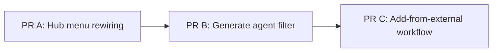
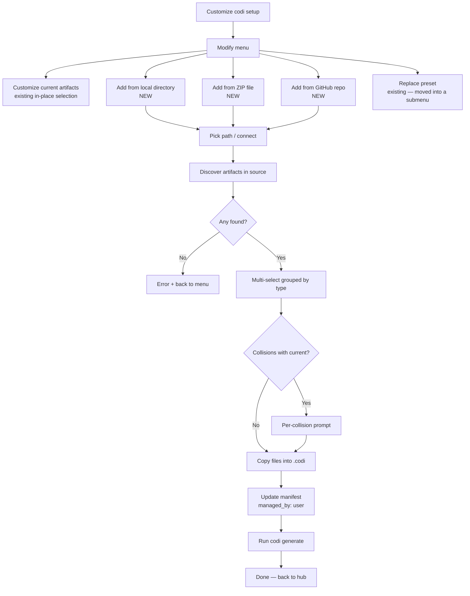

# Hub Menu Modify Redesign — Design Specification

- **Date**: 2026-04-25 11:30
- **Document**: 20260425_1130_SPEC_hub-menu-modify-redesign.md
- **Category**: SPEC
- **Status**: Approved (decisions locked, ready for plan)
- **Companion plan**: 20260425_1135_PLAN_hub-menu-modify-redesign-impl.md

## 1. Problem & Context

A user audit of `codi hub` flagged three concrete UX problems on the normal-mode menu:

1. **"Initialize project" is shown even when `.codi/` already exists.** The hub then asks "Force reinitialize? Yes/No" — the No branch does nothing useful, the Yes branch wipes everything. Users with an existing install have no good entry into "modify what I already have."
2. **The wizard already has a complete "modify" mode** (`init-wizard.ts:141-228`) — Customize current artifacts, Import from ZIP, Import from GitHub, Switch to built-in preset — but the hub never routes into it. The feature surface is unreachable without running `codi init` from the shell.
3. **`Generate configs` lists all 6 registered adapters** and pre-selects all of them, even when the project's `.codi/codi.yaml` only declares one or two agents. Users have to deselect 5 of 6 every time.

Beyond fixing these three findings, the user wants the modify flow to support a workflow the wizard does not yet handle: **add artifacts from an external source (local dir / ZIP / GitHub) without replacing the active preset.** Today's ZIP/GitHub paths *replace* the preset entirely (after a confirmation), which is a different intent.

## 2. Goals

- Show the right menu entry based on `.codi/` state — never confuse "I want to start over" with "I want to modify what I have"
- Route the existing modify wizard from the hub so users never need to know the `codi init` shell command exists
- Restrict `Generate configs` to the agents the project actually uses
- Add a true **"add from external"** workflow that augments the current install instead of replacing it
- Preserve the existing "replace preset" workflows (ZIP / GitHub / built-in) — move them where they belong (advanced or replace submenu) rather than deleting

## 3. Non-Goals

- Refactoring the underlying init wizard's `runInitWizard` signature
- Changing how `codi init` works from the shell — only the hub-driven entry changes
- Tracking external sources in the manifest for ongoing sync (V1 is one-time add; V2+ may add `source:` field for `codi update` to refresh)
- Adding non-Codi-format source support (only directories that follow `rules/ skills/ agents/ mcp-servers/` layout)
- Windows-specific tempdir behavior (Node's `os.tmpdir()` handles cross-platform)

## 4. Constraints

### 4.1 The wizard's modify mode already exists

Most of variant #2.1 ("add/remove via in-place selection") is already built. PR A's job is to *route into it*, not rebuild it. The user's "Customize codi setup" entry, when selected, should land directly on the wizard's modify-mode submenu (skipping the install-mode "Modify vs Fresh" toggle that would otherwise gate it).

### 4.2 The 700-LOC source rule

`init-wizard-paths.ts` is already 714 lines. New "add from external" code MUST live in a new file, not be appended there.

### 4.3 Manifest provenance

When an external artifact is added to `.codi/`, the manifest must record:
- Where it came from (so future `codi update` doesn't try to refresh it from the source preset)
- Who manages it (so `codi clean` / `codi update` skip it correctly)

V1 default: every externally-added artifact gets `managed_by: user`. This is the simplest provenance — Codi's existing `user`-managed code path already preserves these across update / regenerate.

### 4.4 Filename collision

Add-from-external can collide with existing artifacts. V1 behavior: prompt per-collision (keep current / overwrite / rename with `-from-<source>` suffix).

## 5. PR Map (Overview)



| PR | Scope | LOC est | Independent? |
|----|-------|---------|--------------|
| **A** | Conditional menu entry + route to modify wizard | ~40 | Yes |
| **B** | Read manifest agents in handleGenerate | ~25 | Yes |
| **C** | New "add from local dir / ZIP / GitHub" workflow | ~250 | Depends on A (uses the modify menu as its host) |

PRs A and B can ship in either order. C must come after A.

## 6. PR A — Hub Menu Rewiring

### 6.1 What changes

The single `init` entry in `NORMAL_MENU` becomes a context-sensitive entry computed at render time:

| `.codi/` state | Entry label | Hint | Handler |
|----------------|-------------|------|---------|
| **Absent** | "Initialize project" | "Preset, import ZIP, import GitHub, or custom selection" | `handleInit` (current — fresh init via wizard) |
| **Present** | "Customize codi setup" | "Add or remove artifacts, switch preset, import from external source" | `handleCustomize` (NEW — routes directly into modify wizard) |

### 6.2 Implementation outline

**`src/cli/hub.ts`:**
- Move the `init` entry out of the static `NORMAL_MENU` constant
- Compute it inside `runCommandCenter` based on `hasProject`
- Both variants share `requiresProject: false` (they're always shown — the entry just changes label and handler)

**`src/cli/hub-handlers.ts`:**
- Add `handleCustomize(projectRoot)` that calls `initHandler(projectRoot, { customize: true })` (or routes through a new entry-point function on init)
- The hub's existing `handleInit` stays for the no-project case

**`src/cli/init.ts`:**
- Add a `customize?: boolean` option to `InitOptions`
- When `customize: true`, force `installMode = "modify"` and skip the wizard step that asks "Modify current installation / Fresh installation"

**`src/cli/init-wizard.ts`:**
- Plumb a `forceModify?: boolean` parameter on `runInitWizard`
- When set, skip step 0's install-mode prompt and start at step 1 with `installMode = "modify"`

### 6.3 Test updates

- `tests/unit/cli/hub.test.ts`: update menu length expectations (still 5 normal entries, but the first is now context-dependent)
- New test: when `.codi/` exists, the first entry's label is "Customize codi setup"; otherwise, it's "Initialize project"

## 7. PR B — Generate Agent Filter

### 7.1 What changes

`handleGenerate` (`hub-handlers.ts:96-125`) currently lists all 6 registered adapters as the multi-select source. It should list only the agents declared in `.codi/codi.yaml`'s `agents:` field.

### 7.2 Implementation outline

**`src/cli/hub-handlers.ts:handleGenerate`:**
- Resolve config first via `resolveConfig(projectRoot)`
- Extract `manifest.agents` (array of agent IDs)
- Cross-reference with `getAllAdapters()` to filter to known/installable adapters
- Use the resulting list as both `options` and `initialValues` for the multi-select

### 7.3 Edge cases

| Case | Behavior |
|------|----------|
| Manifest missing or unreadable | Log warning, fall back to all-adapter list (current behavior) |
| Manifest declares an unknown adapter | Skip it, log a one-line warning |
| Manifest declares zero agents | Print error, ask user to run `codi init` to add agents, return without generating |

### 7.4 Test updates

- New unit test: stub config resolver returns `agents: ["claude-code", "cursor"]` → multiselect options length is 2, not 6
- Existing tests that mock the prompt continue to pass

## 8. PR C — Add-from-External Workflow

### 8.1 User-facing flow



### 8.2 Modify-menu restructure

Current 4 options → new 5-option layout:

| New label | Type | Notes |
|-----------|------|-------|
| Customize current artifacts | existing | The in-place add/remove selection (variant #2.1) |
| Add from local directory | NEW | Variant #2.2 over a local path |
| Add from ZIP file | NEW | Variant #2.2 over a `.zip` |
| Add from GitHub repo | NEW | Variant #2.2 over a Git URL |
| Replace preset (advanced)... | submenu | Wraps the existing 3 replace paths: ZIP, GitHub, built-in preset switch |

### 8.3 Source connector

A new internal module `src/core/external-source/` with one function per source type:

```ts
interface ExternalSource {
  /** Unique identifier shown in collision prompts (e.g. "github:org/repo@sha") */
  id: string;
  /** Absolute path to the readable, on-disk root after fetch */
  rootPath: string;
  /** Cleanup function called on success or failure */
  cleanup: () => Promise<void>;
}

connectLocalDirectory(path: string): Promise<ExternalSource>;
connectZipFile(path: string): Promise<ExternalSource>;  // extracts to os.tmpdir()
connectGithubRepo(spec: string): Promise<ExternalSource>;  // git clone --depth 1 to os.tmpdir()
```

All three return a `rootPath` to a directory that follows the standard layout (`rules/`, `skills/`, `agents/`, `mcp-servers/`). The discovery function is source-agnostic from this point.

### 8.4 Artifact discovery

```ts
interface DiscoveredArtifact {
  type: "rule" | "skill" | "agent" | "mcp-server";
  name: string;
  /** Source-relative path (e.g. "rules/security.md") */
  relPath: string;
  /** Absolute path on disk for copy operation */
  absPath: string;
}

discoverArtifacts(sourceRoot: string): Promise<DiscoveredArtifact[]>
```

Walks the four standard subdirectories. Skips files that fail basic shape validation (missing frontmatter, wrong extension). Returns flat list grouped by type at the UI layer.

### 8.5 Multi-select UI

Per-type groups, all options unchecked by default, with collision indicators:

```
Add which artifacts? Selected items will be added to your .codi/.

  Rules
  ◯ security                                  (NEW)
  ◯ python                                    (CONFLICT: existing version differs)

  Skills
  ◯ debugging                                 (NEW)
  ◯ test-suite                                (CONFLICT)

  Agents
  ◯ code-reviewer                             (NEW)
```

### 8.6 Collision handling

For each selected artifact whose name already exists in `.codi/`:

```
"security" already exists in .codi/rules/. What do you want to do?

  ● Keep current (skip this one)
  ○ Overwrite with imported
  ○ Rename imported to security-from-<source-id>
  ○ Apply same choice to remaining N collisions
```

Default: "Keep current". The 4th option lets users skip the prompt for the rest with the same default.

### 8.7 Provenance

After copy, the manifest's `installations` (or equivalent) records each added artifact with:

```yaml
- name: security
  type: rule
  managed_by: user
  source: "github:org/preset@abc123"   # OR "/local/path" OR "/path/to/file.zip"
  added_at: "2026-04-25T11:30:00Z"
```

The `source` field is informational only in V1 — `codi update` does not refresh from it. V2 (out of scope) may add a `--refresh-external` flag.

### 8.8 Files & estimated LOC

| File | LOC | Purpose |
|------|-----|---------|
| `src/core/external-source/connectors.ts` | ~80 | The 3 connect functions + ExternalSource interface |
| `src/core/external-source/discovery.ts` | ~60 | discoverArtifacts walker |
| `src/core/external-source/installer.ts` | ~80 | Copy + collision prompt + manifest update |
| `src/cli/init-wizard-modify-add.ts` | ~70 | Wizard flow integration (separate file to respect 700-LOC rule on init-wizard-paths.ts) |
| `src/cli/init-wizard-paths.ts` | +20 | Wire the new wizard option into the modify menu |
| Tests (unit + integration) | ~150 | Coverage for each module |

Total: ~280 LOC source + 150 LOC tests. Well within budget per file.

## 9. Decisions Locked

| ID | Decision | Choice | Rationale |
|----|----------|--------|-----------|
| D1 | Manifest provenance for added artifacts | `managed_by: user` | Simplest. Codi's existing `user`-managed path preserves these across `update` / `generate`. |
| D2 | Source tracking | Informational only in V1 (`source:` field, no refresh logic) | Keeps the V1 PR small. V2 can add `codi update --refresh-external`. |
| D3 | Filename collision default | Prompt per collision; default action = "keep current" | Preserves user agency, matches Codi's existing `--on-conflict keep-current` default. |
| D4 | Source layout | Codi-standard only (`rules/`, `skills/`, `agents/`, `mcp-servers/`) | Avoids parsing arbitrary tools' formats in V1. |
| D5 | "Replace" workflows | Move under "Replace preset (advanced)..." submenu — keep, do not delete | Existing users may rely on them; consolidation is a separate UX call. |
| D6 | New label for the conditional entry | "Customize codi setup" | Per user explicit request. |
| D7 | Generate agent filter fallback | If manifest unreadable, fall back to all-adapters with a warning | Avoids hard-failing in degenerate states. |

## 10. Risks & Mitigations

| Risk | Likelihood | Impact | Mitigation |
|------|------------|--------|------------|
| Git clone for GitHub source fails (no network, private repo) | Medium | Medium | Clear error + fallback to local-dir variant. Do not auto-retry. |
| ZIP extraction includes path-traversal payload | Low | High | Validate every extracted path stays under `rootPath`; reject any that resolves outside. |
| User adds 50+ artifacts; `codi generate` is slow | Medium | Low | No mitigation in V1 — generate already supports incremental modes. |
| Collision prompt fatigue (10+ collisions) | Medium | Low | The "apply to remaining" affordance in §8.6 handles this. |
| `init-wizard-paths.ts` exceeds 700 LOC | Medium | Medium | New code goes into separate `init-wizard-modify-add.ts` per §8.8. |
| Manifest schema doesn't yet have `installations` array for individual artifact entries | Unknown | Medium | First task in PR C is a schema reconnaissance; if missing, design the schema in the spec before coding. |

## 11. Out of Scope

- Refresh-external (`codi update --refresh-external`)
- Non-Codi-format source support (Cursor rules, Cline skills, etc.)
- Removing externally-added artifacts via UI (they go in `.codi/` and can be removed by file)
- Windows path-canonicalization edge cases beyond what `node:path` handles
- Rate-limiting GitHub API calls (we use git clone, not the API)
- Authentication for private GitHub repos (V1 supports public repos only)

## 12. Open Questions

None blocking. Manifest schema for individual artifact provenance (Risk row 6) is the only thing to verify before implementation; first task of PR C resolves it.

## 13. References

- `src/cli/hub.ts:42-73` — current NORMAL_MENU
- `src/cli/hub-handlers.ts:46-69, 96-125, 199-228` — handleInit, handleGenerate, handleUpdate
- `src/cli/init-wizard.ts:141-228` — existing modify-mode wizard
- `src/cli/init-wizard-paths.ts:185-252` — handleZipPath, handleGithubPath (replace-mode)
- `src/cli/init.ts:101-127` — existingInstall context construction
