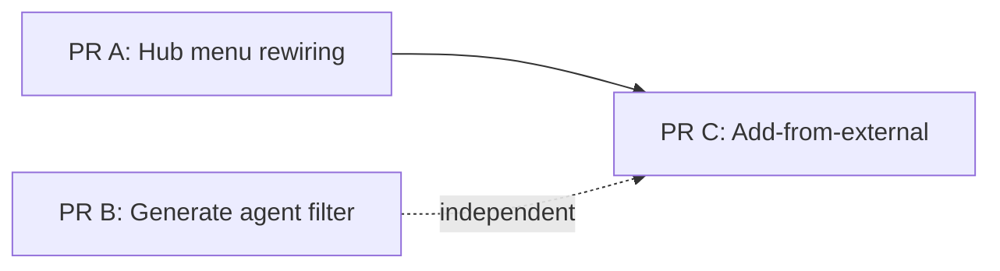
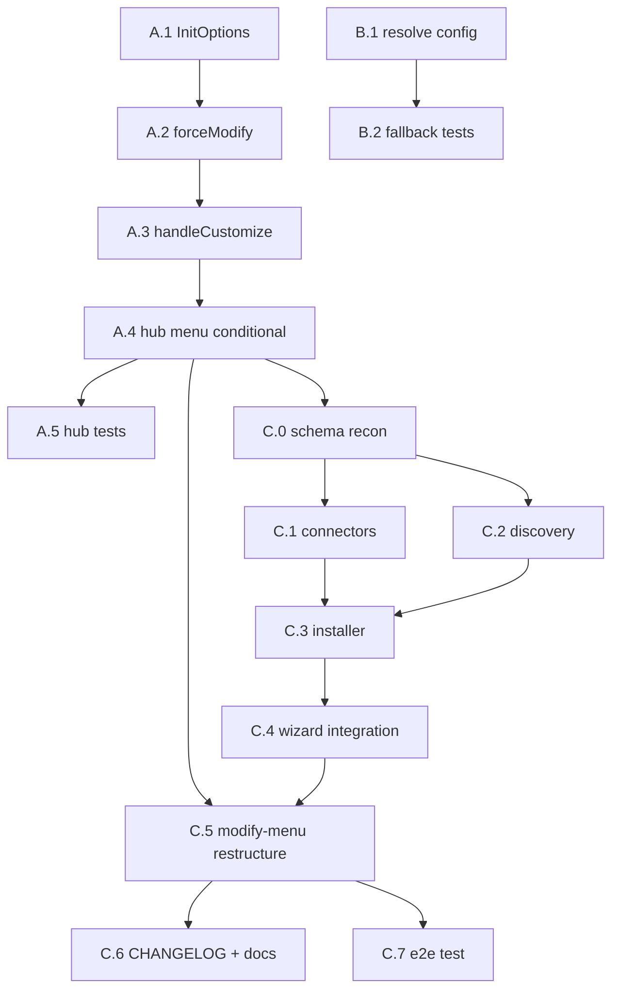

# Hub Menu Modify Redesign — Implementation Plan

- **Date**: 2026-04-25 11:35
- **Document**: 20260425_1135_PLAN_hub-menu-modify-redesign-impl.md
- **Category**: PLAN
- **Spec**: 20260425_1130_SPEC_hub-menu-modify-redesign.md
- **Status**: Ready for execution

## Overview

Three PRs, sequenced. PR A and B are small and independent of each other. PR C depends on A (it hangs new options off the modify-menu that A unlocks).



## PR Boundaries

| PR | Scope | Approx | Why this boundary |
|----|-------|--------|-------------------|
| **A** | Conditional menu entry + route into existing modify wizard | ~40 LOC | Smallest valuable unit; closes audit findings #1 and #2 |
| **B** | Generate uses configured agents only | ~25 LOC | Independent fix for audit finding #3 |
| **C** | New "Add from external" workflow + modify-menu restructure | ~280 LOC + tests | New feature, deserves its own commit history |

---

## PR A — Hub Menu Rewiring

### Task A.1 — Add `customize?: boolean` to InitOptions

**File:** `src/cli/init.ts`
**Change:**
- Add `customize?: boolean` to the `InitOptions` interface
- In `initHandler`, when `customize === true` AND `.codi/` exists: pass `forceModify: true` into `runInitWizard`

**Verify:**
- `tsc --noEmit` clean
- Existing init tests still pass

### Task A.2 — Plumb `forceModify` into `runInitWizard`

**File:** `src/cli/init-wizard.ts`
**Change:**
- Add `forceModify?: boolean` to the `runInitWizard` function signature
- When `forceModify === true`, skip step 0 (the "Modify current installation / Fresh installation" prompt) and start with `installMode = "modify"`, `step = 1`

**Verify:**
- Manual: spawn `codi init` with an existing `.codi/` and confirm step 0 still appears (regression check)
- New unit test (or extension to existing wizard test) for `forceModify: true` path

### Task A.3 — Add `handleCustomize` handler

**File:** `src/cli/hub-handlers.ts`
**Change:**
- Add `handleCustomize(projectRoot)` that calls `initHandler(projectRoot, { customize: true })`
- Keep existing `handleInit` for the no-project entry — no signature change

**Verify:**
- `tsc --noEmit` clean
- New unit test stubs initHandler, asserts it gets called with `{ customize: true }`

### Task A.4 — Make hub menu entry conditional

**File:** `src/cli/hub.ts`
**Change:**
- Move the `init` entry out of the static `NORMAL_MENU` constant
- Inside `runCommandCenter`, build the menu's first entry at render time:

```ts
const customizeOrInit: HubTopLevelEntry = hasProject
  ? {
      value: "customize",
      label: "Customize codi setup",
      hint: "Add or remove artifacts, switch preset, import from external source",
      requiresProject: false,
    }
  : {
      value: "init",
      label: "Initialize project",
      hint: "Preset, import ZIP, import GitHub, or custom selection",
      requiresProject: false,
    };
const visibleEntries = [customizeOrInit, ...NORMAL_MENU.filter(...)];
```

- Add `customize: handleCustomize` to the `routeAction` handler map

**Verify:**
- Manual: `codi` with `.codi/` present shows "Customize codi setup"; `cd` to a fresh dir and `codi` shows "Initialize project"

### Task A.5 — Update hub unit tests

**File:** `tests/unit/cli/hub.test.ts`
**Change:**
- Existing assertions about `NORMAL_MENU` length stay (NORMAL_MENU still has 4 entries — the conditional one is now built separately)
- Add: assertion that the rendered menu's first entry has the right label depending on `.codi/` presence (mock `dirExists`)

**Verify:**
- `npm run test -- tests/unit/cli/hub.test.ts` green

### PR A acceptance checklist

- [ ] `tsc --noEmit` clean
- [ ] All existing hub tests green
- [ ] New conditional-entry test passes
- [ ] Manual: `codi` in fresh dir → "Initialize project"
- [ ] Manual: `codi` in dir with `.codi/` → "Customize codi setup"
- [ ] Selecting "Customize codi setup" lands directly on modify-mode submenu (no install-mode toggle)

---

## PR B — Generate Agent Filter

### Task B.1 — Resolve config in handleGenerate

**File:** `src/cli/hub-handlers.ts`
**Change:** Inside `handleGenerate(projectRoot)`, before the multiselect:

```ts
const cfg = await resolveConfig(projectRoot);
const allAdapters = getAllAdapters().map((a) => a.id);
const configuredAgents = cfg.ok
  ? (cfg.data.manifest.agents ?? []).filter((id) => allAdapters.includes(id))
  : null;

if (cfg.ok && configuredAgents && configuredAgents.length === 0) {
  p.log.error("No agents configured in .codi/codi.yaml. Run `codi init` to select agents.");
  return;
}

const agentChoices = configuredAgents ?? allAdapters;  // fallback when manifest unreadable
```

Then use `agentChoices` for both `options` and `initialValues`.

**Verify:**
- `tsc --noEmit` clean
- Manual: project with `agents: [claude-code]` → multiselect shows 1 option, pre-checked

### Task B.2 — Warn-and-fallback path tests

**File:** `tests/unit/cli/hub-handlers.test.ts` (create if missing)
**Change:** Add 3 cases:

1. Manifest declares 2 agents → multiselect options length 2
2. Manifest unreadable → fallback to all-adapters + warning logged
3. Manifest declares 0 agents → error printed, no multiselect shown

**Verify:**
- `npm run test -- tests/unit/cli/hub-handlers.test.ts` green

### PR B acceptance checklist

- [ ] handleGenerate reads from manifest
- [ ] Unknown adapters in manifest filtered out (logged)
- [ ] Empty agents → clear error + early return
- [ ] All 3 unit tests added and passing
- [ ] Manual: project with one agent → only that one appears

---

## PR C — Add-from-External

### Task C.0 — Schema reconnaissance (BLOCKING for rest of PR)

**File:** read-only audit
**Action:** Trace what `.codi/codi.yaml` (or wherever the manifest lives) currently records about installed artifacts:
- Does it have a per-artifact `installations` array?
- Where does `managed_by: user` get written today by `codi add`?
- What schema does the operations-ledger use?

**Output:** A 1-page note in this PLAN doc (append below) documenting where artifact provenance lives. **If the schema is missing the field needed for source tracking (D2), open a separate sub-spec to design that field first.**

**Verify:** Findings written, user reviews before continuing

### Task C.1 — `ExternalSource` connectors

**File:** `src/core/external-source/connectors.ts` (NEW)
**LOC budget:** ≤ 100
**Exports:**

```ts
export interface ExternalSource {
  id: string;            // e.g. "github:org/repo@abc123" or absolute path
  rootPath: string;      // on-disk root, ready to read
  cleanup: () => Promise<void>;
}

export async function connectLocalDirectory(path: string): Promise<ExternalSource>;
export async function connectZipFile(path: string): Promise<ExternalSource>;
export async function connectGithubRepo(spec: string): Promise<ExternalSource>;
```

**Implementation notes:**
- Local dir: validate it exists and is readable; cleanup is a no-op
- ZIP: extract under `os.tmpdir() + /codi-import-<random>`; reject any entry whose normalized path resolves outside the extraction root (path-traversal guard); cleanup = `rm -rf`
- GitHub: parse the spec (`org/repo`, `org/repo@ref`, `https://github.com/...`); `git clone --depth 1 [--branch <ref>]` into `os.tmpdir()`; cleanup = `rm -rf`

**Verify:** Unit tests in `tests/unit/core/external-source/connectors.test.ts` for all three; ZIP path-traversal guard has a malicious-fixture test

### Task C.2 — Artifact discovery

**File:** `src/core/external-source/discovery.ts` (NEW)
**LOC budget:** ≤ 80
**Exports:**

```ts
export type ArtifactType = "rule" | "skill" | "agent" | "mcp-server";

export interface DiscoveredArtifact {
  type: ArtifactType;
  name: string;
  relPath: string;
  absPath: string;
}

export async function discoverArtifacts(sourceRoot: string): Promise<DiscoveredArtifact[]>;
```

**Implementation notes:**
- Walk `rules/`, `skills/`, `agents/`, `mcp-servers/` (existence is OK if absent — just skip that type)
- For each: list `.md` files (rules, agents) or directory entries (skills) or `.yaml` (mcp-servers) — match the existing scaffolder's expectations
- Validate basic frontmatter shape (skip + log entries that fail)

**Verify:** Unit tests with fixture directories covering: all four types, missing types, invalid frontmatter

### Task C.3 — Collision-aware installer

**File:** `src/core/external-source/installer.ts` (NEW)
**LOC budget:** ≤ 100
**Exports:**

```ts
export type CollisionResolution =
  | { kind: "skip" }
  | { kind: "overwrite" }
  | { kind: "rename"; newName: string };

export async function detectCollisions(
  configDir: string,
  selected: DiscoveredArtifact[],
): Promise<Map<DiscoveredArtifact, "exists" | "fresh">>;

export async function installSelected(
  configDir: string,
  selected: Array<{ artifact: DiscoveredArtifact; resolution: CollisionResolution }>,
  source: ExternalSource,
): Promise<{ installed: number; skipped: number; renamed: number }>;
```

**Implementation notes:**
- Copy file/directory (use existing scaffolder utilities if any)
- After write, append manifest entry per D1, D2 (`managed_by: user`, `source: <id>`)
- Single transaction logging via OperationsLedgerManager (matches existing patterns)

**Verify:** Integration test in `tests/integration/external-source/installer.test.ts` using real tempdirs

### Task C.4 — Wizard integration

**File:** `src/cli/init-wizard-modify-add.ts` (NEW)
**LOC budget:** ≤ 100
**Exports:**

```ts
export async function runAddFromExternal(
  configDir: string,
  source: "local" | "zip" | "github",
): Promise<void>;
```

**Implementation notes:**
- Prompts user for the source path/spec
- Calls the matching connect function, then discovery, then multi-select UI
- Calls collision detection + per-collision prompts (with "apply to remaining" affordance)
- Calls installer
- On any error or back-out: ensures `source.cleanup()` runs

**Verify:** Manual end-to-end against a fixture preset directory

### Task C.5 — Modify-menu restructure

**File:** `src/cli/init-wizard-paths.ts` and/or `src/cli/init-wizard.ts`
**Change:** Replace the existing 4-option modify menu with the new 5-option menu (per spec §8.2):

1. Customize current artifacts (existing handleCustomPath)
2. Add from local directory (NEW — calls runAddFromExternal("local"))
3. Add from ZIP file (NEW)
4. Add from GitHub repo (NEW)
5. Replace preset (advanced)... — submenu wrapping the existing replace paths

**Verify:** Manual walkthrough: each option lands at the right place; "Replace preset" submenu works as before

### Task C.6 — CHANGELOG and docs

**Files:**
- `CHANGELOG.md` — Unreleased: Added entry for "Add from external" workflow
- `docs/project/troubleshooting.md` — new section "Adding artifacts from an external source"

**Verify:** Docs render in Astro build

### Task C.7 — End-to-end fixture test

**File:** `tests/e2e/external-source.test.ts` (NEW)
**Action:** Build a sample preset under `tests/fixtures/external-presets/sample-a/` with one rule, one skill, one agent. Then in a temp project:
1. `codi init --preset balanced`
2. Run the new "Add from local directory" flow against the fixture
3. Assert the 3 artifacts land in `.codi/` with `managed_by: user`
4. Assert subsequent `codi update` does NOT overwrite them

**Verify:** Test passes on Node 24

### PR C acceptance checklist

- [ ] Schema recon completed and confirmed (Task C.0)
- [ ] All 3 connectors covered by unit tests including path-traversal guard
- [ ] Discovery handles missing-type directories
- [ ] Collision UI tested with > 1 collision
- [ ] All new files ≤ 100 LOC each (no file exceeds 700)
- [ ] CHANGELOG + docs updated
- [ ] E2E fixture test passes
- [ ] Manual walkthrough: dir, zip, github sources all work end-to-end

---

## Dependency Graph



## Verification Plan

After each PR, run:

```bash
npm run lint
npm run test:pre-commit
codi --version  # must print 2.12.x
```

After PR A: in a fresh tempdir, `codi` → "Initialize project"; in this repo, `codi` → "Customize codi setup".

After PR B: `codi generate` in this repo shows only the agents from `.codi/codi.yaml`.

After PR C: end-to-end fixture per Task C.7.

## Rollback

Each PR is a separate commit on `feature/hub-update-in-normal-menu` (or successor). Revert the failing commit; the others stay.

PR C carries the most risk because it touches manifest schema. If a regression appears after merge, revert PR C — PRs A and B remain valid on their own.

## Pre-flight Checklist Before Starting Any Task

- [ ] Working tree clean
- [ ] On the target feature branch (not `main` / `develop`)
- [ ] Node 24 + npm 11 active (per `.nvmrc`)
- [ ] `codi --version` reflects the linked local build
